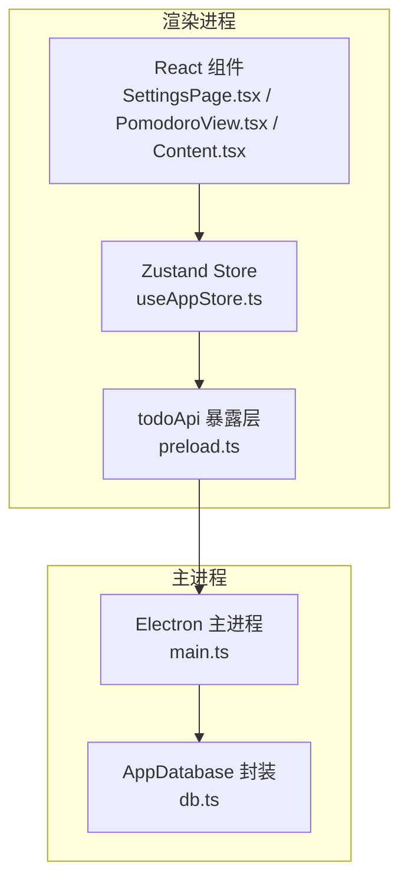
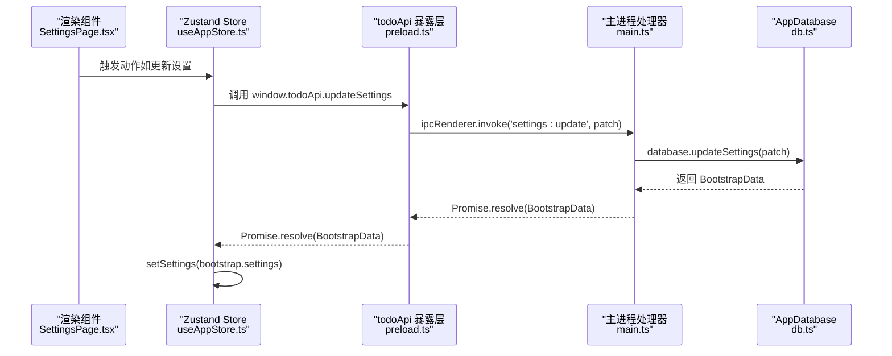
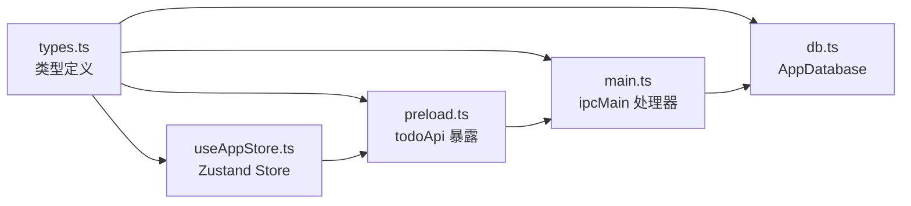

# API 参考

<cite>
**本文引用的文件**
- [app/electron/main.ts](file://app/electron/main.ts)
- [app/electron/preload.ts](file://app/electron/preload.ts)
- [app/electron/db.ts](file://app/electron/db.ts)
- [app/src/types.ts](file://app/src/types.ts)
- [app/src/store/useAppStore.ts](file://app/src/store/useAppStore.ts)
- [app/src/components/Settings/SettingsPage.tsx](file://app/src/components/Settings/SettingsPage.tsx)
- [app/src/components/Pomodoro/PomodoroView.tsx](file://app/src/components/Pomodoro/PomodoroView.tsx)
- [app/src/components/Content/Content.tsx](file://app/src/components/Content/Content.tsx)
- [app/package.json](file://app/package.json)
</cite>

## 目录
1. [简介](#简介)
2. [项目结构](#项目结构)
3. [核心组件](#核心组件)
4. [架构总览](#架构总览)
5. [详细组件分析](#详细组件分析)
6. [依赖关系分析](#依赖关系分析)
7. [性能考量](#性能考量)
8. [故障排查指南](#故障排查指南)
9. [结论](#结论)
10. [附录](#附录)

## 简介
本文件为 SnowTodo 的完整 API 参考文档，覆盖以下方面：
- IPC API 接口：主进程与渲染进程之间的通信接口，含方法名、参数类型、返回值与使用示例路径
- 数据库操作 API：基于 sql.js 的 CRUD、查询、事务与迁移机制
- 状态管理 API：Zustand store 的 actions、selectors 与状态订阅机制
- TypeScript 类型定义：接口、枚举、类型别名等
- 配置项参考：应用配置、模块配置、用户偏好设置
- 错误码与异常处理：错误场景与建议处理方式
- 版本兼容性与迁移指南：版本演进与迁移策略
- 客户端实现示例与最佳实践：如何在前端调用 IPC、如何使用 store、如何处理事件订阅

## 项目结构
SnowTodo 采用 Electron + React + Zustand + sql.js 的技术栈，前端通过 preload 暴露 todoApi 给渲染进程，主进程通过 ipcMain 注册 IPC 处理器，数据库层封装在 AppDatabase 中，类型定义集中在 types.ts。

图表来源
- [app/src/components/Settings/SettingsPage.tsx:1-147](file://app/src/components/Settings/SettingsPage.tsx#L1-L147)
- [app/src/components/Pomodoro/PomodoroView.tsx:1-200](file://app/src/components/Pomodoro/PomodoroView.tsx#L1-L200)
- [app/src/components/Content/Content.tsx:1-65](file://app/src/components/Content/Content.tsx#L1-L65)
- [app/src/store/useAppStore.ts:1-604](file://app/src/store/useAppStore.ts#L1-L604)
- [app/electron/preload.ts:1-117](file://app/electron/preload.ts#L1-L117)
- [app/electron/main.ts:1-391](file://app/electron/main.ts#L1-L391)
- [app/electron/db.ts:1-1825](file://app/electron/db.ts#L1-L1825)

章节来源
- [app/electron/main.ts:1-391](file://app/electron/main.ts#L1-L391)
- [app/electron/preload.ts:1-117](file://app/electron/preload.ts#L1-L117)
- [app/electron/db.ts:1-1825](file://app/electron/db.ts#L1-L1825)
- [app/src/store/useAppStore.ts:1-604](file://app/src/store/useAppStore.ts#L1-L604)
- [app/src/types.ts:1-278](file://app/src/types.ts#L1-L278)

## 核心组件
- IPC 暴露层（preload.ts）：将主进程能力以 todoApi 形式暴露给渲染进程，统一方法名与签名
- 主进程处理器（main.ts）：注册 ipcMain.handle，实现业务逻辑与数据库交互
- 数据库封装（db.ts）：AppDatabase 类，负责表结构、迁移、CRUD、查询、事务与统计
- 状态管理（useAppStore.ts）：Zustand store，集中管理 UI 状态、业务数据与计算派生
- 类型定义（types.ts）：统一的数据模型、枚举、别名与接口

章节来源
- [app/electron/preload.ts:18-116](file://app/electron/preload.ts#L18-L116)
- [app/electron/main.ts:227-358](file://app/electron/main.ts#L227-L358)
- [app/electron/db.ts:55-90](file://app/electron/db.ts#L55-L90)
- [app/src/store/useAppStore.ts:1-604](file://app/src/store/useAppStore.ts#L1-L604)
- [app/src/types.ts:1-278](file://app/src/types.ts#L1-L278)

## 架构总览
IPC 调用链路：渲染进程调用 window.todoApi 方法 -> preload 暴露层转发 -> ipcRenderer.invoke -> ipcMain.handle -> AppDatabase 执行 -> 返回结果

图表来源
- [app/src/components/Settings/SettingsPage.tsx:8-17](file://app/src/components/Settings/SettingsPage.tsx#L8-L17)
- [app/src/store/useAppStore.ts:304-305](file://app/src/store/useAppStore.ts#L304-L305)
- [app/electron/preload.ts:33-33](file://app/electron/preload.ts#L33-L33)
- [app/electron/main.ts:235-239](file://app/electron/main.ts#L235-L239)
- [app/electron/db.ts:871-880](file://app/electron/db.ts#L871-L880)

## 详细组件分析

### IPC API 接口清单（按模块分组）

- 基础与引导
  - 方法：todo:get-bootstrap
    - 参数：无
    - 返回：Promise<BootstrapData>
    - 示例路径：[app/src/store/useAppStore.ts:237-246](file://app/src/store/useAppStore.ts#L237-L246)
  - 方法：data:export
    - 参数：无
    - 返回：Promise<void>
    - 示例路径：[app/src/components/Settings/SettingsPage.tsx:19-21](file://app/src/components/Settings/SettingsPage.tsx#L19-L21)
  - 方法：data:import
    - 参数：无
    - 返回：Promise<BootstrapData | null>
    - 示例路径：[app/src/components/Settings/SettingsPage.tsx:23-28](file://app/src/components/Settings/SettingsPage.tsx#L23-L28)

- 待办（Todo）CRUD
  - 方法：todo:save
    - 参数：TodoDraft
    - 返回：Promise<Todo>
    - 示例路径：[app/src/store/useAppStore.ts:267-268](file://app/src/store/useAppStore.ts#L267-L268)
  - 方法：todo:toggle
    - 参数：{ todoId: string; completed: boolean }
    - 返回：Promise<Todo>
    - 示例路径：[app/src/store/useAppStore.ts:267-268](file://app/src/store/useAppStore.ts#L267-L268)
  - 方法：todo:delete
    - 参数：todoId: string
    - 返回：Promise<void>
    - 示例路径：[app/src/store/useAppStore.ts:269-272](file://app/src/store/useAppStore.ts#L269-L272)
  - 方法：todo:restore
    - 参数：todoId: string
    - 返回：Promise<Todo>
    - 示例路径：[app/src/store/useAppStore.ts:269-272](file://app/src/store/useAppStore.ts#L269-L272)

- 分类与标签
  - 方法：category:create
    - 参数：name: string
    - 返回：Promise<Category>
    - 示例路径：[app/src/store/useAppStore.ts:277-280](file://app/src/store/useAppStore.ts#L277-L280)
  - 方法：tag:create
    - 参数：name: string
    - 返回：Promise<Tag>
    - 示例路径：[app/src/store/useAppStore.ts:279-280](file://app/src/store/useAppStore.ts#L279-L280)

- 设置（Settings）
  - 方法：settings:update
    - 参数：Partial<Settings>
    - 返回：Promise<BootstrapData>
    - 示例路径：[app/src/components/Settings/SettingsPage.tsx:8-17](file://app/src/components/Settings/SettingsPage.tsx#L8-L17)

- 窗口控制
  - 方法：window:action
    - 参数：'minimize' | 'maximize' | 'close'
    - 返回：Promise<void>
    - 示例路径：[app/src/store/useAppStore.ts:253-260](file://app/src/store/useAppStore.ts#L253-L260)

- 提醒事件（系统/弹窗）
  - 方法：reminder:triggered（事件）
    - 参数：ReminderEvent
    - 返回：无（事件回调）
    - 示例路径：[app/electron/main.ts:98-118](file://app/electron/main.ts#L98-L118)
    - 订阅：onReminderTriggered(callback)

- 长期每日待办（Recurring Todos）
  - 方法：recurring:get-all
    - 参数：无
    - 返回：Promise<RecurringTodo[]>
    - 示例路径：[app/src/store/useAppStore.ts:295-298](file://app/src/store/useAppStore.ts#L295-L298)
  - 方法：recurring:create
    - 参数：RecurringTodoDraft
    - 返回：Promise<RecurringTodo>
    - 示例路径：[app/src/store/useAppStore.ts:286-289](file://app/src/store/useAppStore.ts#L286-L289)
  - 方法：recurring:update
    - 参数：{ id: string; draft: Partial<RecurringTodoDraft> }
    - 返回：Promise<RecurringTodo>
    - 示例路径：[app/src/store/useAppStore.ts:286-289](file://app/src/store/useAppStore.ts#L286-L289)
  - 方法：recurring:delete
    - 参数：id: string
    - 返回：Promise<void>
    - 示例路径：[app/src/store/useAppStore.ts:289-291](file://app/src/store/useAppStore.ts#L289-L291)
  - 方法：recurring:generate-daily
    - 参数：无
    - 返回：Promise<number>（生成数量）

- 番茄钟（Pomodoro）
  - 方法：pomodoro:get-settings
    - 参数：无
    - 返回：Promise<PomodoroSettings>
    - 示例路径：[app/src/store/useAppStore.ts:394-397](file://app/src/store/useAppStore.ts#L394-L397)
  - 方法：pomodoro:update-settings
    - 参数：Partial<PomodoroSettings>
    - 返回：Promise<PomodoroSettings>
    - 示例路径：[app/src/store/useAppStore.ts:398-399](file://app/src/store/useAppStore.ts#L398-L399)
  - 方法：pomodoro:create-session
    - 参数：Omit<PomodoroSession, 'id'>
    - 返回：Promise<PomodoroSession>
    - 示例路径：[app/src/store/useAppStore.ts:411-415](file://app/src/store/useAppStore.ts#L411-L415)
  - 方法：pomodoro:update-session
    - 参数：{ id: string; patch: Partial<PomodoroSession> }
    - 返回：Promise<PomodoroSession>
    - 示例路径：[app/src/store/useAppStore.ts:411-415](file://app/src/store/useAppStore.ts#L411-L415)
  - 方法：pomodoro:get-sessions
    - 参数：{ todoId?: string; date?: string; limit?: number }
    - 返回：Promise<PomodoroSession[]>
    - 示例路径：[app/src/store/useAppStore.ts:411-415](file://app/src/store/useAppStore.ts#L411-L415)
  - 方法：pomodoro:get-today-sessions
    - 参数：无
    - 返回：Promise<PomodoroSession[]>
    - 示例路径：[app/src/store/useAppStore.ts:417-420](file://app/src/store/useAppStore.ts#L417-L420)
  - 方法：pomodoro:set-active
    - 参数：active: boolean
    - 返回：Promise<void>
    - 示例路径：[app/src/store/useAppStore.ts:417-420](file://app/src/store/useAppStore.ts#L417-L420)
  - 事件：pomodoro:toggle（事件）
    - 参数：无
    - 返回：无（事件回调）
    - 订阅：onPomodoroToggle(callback)
  - 事件：pomodoro:active-changed（事件）
    - 参数：active: boolean
    - 返回：无（事件回调）
    - 订阅：onPomodoroActiveChanged(callback)

- 健康提醒（Health Reminder）
  - 方法：health:get-reminders
    - 参数：无
    - 返回：Promise<HealthReminder[]>
    - 示例路径：[app/src/store/useAppStore.ts:425-428](file://app/src/store/useAppStore.ts#L425-L428)
  - 方法：health:create-reminder
    - 参数：Omit<HealthReminder, 'id'>
    - 返回：Promise<HealthReminder>
    - 示例路径：[app/src/store/useAppStore.ts:430-432](file://app/src/store/useAppStore.ts#L430-L432)
  - 方法：health:update-reminder
    - 参数：{ id: string; patch: Partial<HealthReminder> }
    - 返回：Promise<HealthReminder>
    - 示例路径：[app/src/store/useAppStore.ts:430-432](file://app/src/store/useAppStore.ts#L430-L432)
  - 方法：health:delete-reminder
    - 参数：id: string
    - 返回：Promise<void>
    - 示例路径：[app/src/store/useAppStore.ts:436-438](file://app/src/store/useAppStore.ts#L436-L438)
  - 方法：health:get-history
    - 参数：{ reminderId?: string; limit?: number }
    - 返回：Promise<unknown[]>
    - 示例路径：[app/src/store/useAppStore.ts:436-438](file://app/src/store/useAppStore.ts#L436-L438)
  - 方法：health:snooze-reminder
    - 参数：{ id: string; minutes: number }
    - 返回：Promise<void>
    - 示例路径：[app/src/store/useAppStore.ts:436-438](file://app/src/store/useAppStore.ts#L436-L438)
  - 方法：health:dismiss-reminder
    - 参数：id: string
    - 返回：Promise<void>
    - 示例路径：[app/src/store/useAppStore.ts:436-438](file://app/src/store/useAppStore.ts#L436-L438)
  - 事件：health-reminder:triggered（事件）
    - 参数：HealthReminder
    - 返回：无（事件回调）
    - 订阅：onHealthReminderTriggered(callback)

- AI 设置（AI Settings）
  - 方法：ai:get-settings
    - 参数：无
    - 返回：Promise<AISettings>
    - 示例路径：[app/src/store/useAppStore.ts:443-446](file://app/src/store/useAppStore.ts#L443-L446)
  - 方法：ai:update-settings
    - 参数：Partial<AISettings>
    - 返回：Promise<AISettings>
    - 示例路径：[app/src/store/useAppStore.ts:447-448](file://app/src/store/useAppStore.ts#L447-L448)

- 时间块（Time Block）
  - 方法：timeblock:get-all
    - 参数：date: string
    - 返回：Promise<TimeBlock[]>
    - 示例路径：[app/src/store/useAppStore.ts:454-457](file://app/src/store/useAppStore.ts#L454-L457)
  - 方法：timeblock:create
    - 参数：Omit<TimeBlock, 'id'>
    - 返回：Promise<TimeBlock>
    - 示例路径：[app/src/store/useAppStore.ts:458-461](file://app/src/store/useAppStore.ts#L458-L461)
  - 方法：timeblock:update
    - 参数：{ id: string; patch: Partial<TimeBlock> }
    - 返回：Promise<TimeBlock>
    - 示例路径：[app/src/store/useAppStore.ts:458-461](file://app/src/store/useAppStore.ts#L458-L461)
  - 方法：timeblock:delete
    - 参数：id: string
    - 返回：Promise<void>
    - 示例路径：[app/src/store/useAppStore.ts:461-463](file://app/src/store/useAppStore.ts#L461-L463)

- 日常统计（Daily Stats）
  - 方法：stats:get-daily
    - 参数：{ startDate: string; endDate: string }
    - 返回：Promise<DailyStats[]>
    - 示例路径：[app/src/store/useAppStore.ts:468-471](file://app/src/store/useAppStore.ts#L468-L471)
  - 方法：stats:update-daily
    - 参数：Record<string, unknown>
    - 返回：Promise<void>
    - 示例路径：[app/src/store/useAppStore.ts:468-471](file://app/src/store/useAppStore.ts#L468-L471)

- 待办图片（Todo Images）
  - 方法：todo:get-images
    - 参数：todoId: string
    - 返回：Promise<{ id: string; data: string; mimeType: string }[]>
    - 示例路径：[app/src/store/useAppStore.ts:498-501](file://app/src/store/useAppStore.ts#L498-L501)
  - 方法：todo:add-image
    - 参数：{ todoId: string; data: string; mimeType: string }
    - 返回：Promise<string>
    - 示例路径：[app/src/store/useAppStore.ts:498-501](file://app/src/store/useAppStore.ts#L498-L501)
  - 方法：todo:delete-image
    - 参数：imageId: string
    - 返回：Promise<void>
    - 示例路径：[app/src/store/useAppStore.ts:498-501](file://app/src/store/useAppStore.ts#L498-L501)

- 项目格子（Project Cells）
  - 方法：project:get-cells-by-month
    - 参数：{ projectId: string; yearMonth: string }
    - 返回：Promise<{ id: string; cellDate: string; content: string; images: string[]; isAlert: boolean }[]>
    - 示例路径：[app/src/store/useAppStore.ts:474-486](file://app/src/store/useAppStore.ts#L474-L486)
  - 方法：project:get-cell
    - 参数：{ projectId: string; cellDate: string }
    - 返回：Promise<ProjectCell | null>
    - 示例路径：[app/src/store/useAppStore.ts:488-496](file://app/src/store/useAppStore.ts#L488-L496)
  - 方法：project:upsert-cell
    - 参数：{ projectId: string; cellDate: string; content: string; images: string[]; isAlert: boolean }
    - 返回：Promise<void>
    - 示例路径：[app/src/store/useAppStore.ts:498-507](file://app/src/store/useAppStore.ts#L498-L507)

章节来源
- [app/electron/preload.ts:18-116](file://app/electron/preload.ts#L18-L116)
- [app/electron/main.ts:227-358](file://app/electron/main.ts#L227-L358)

### 数据库操作 API（AppDatabase）

- 初始化与迁移
  - 方法：init(userDataPath: string)
    - 功能：初始化 sql.js、定位 wasm、加载或创建数据库、运行迁移
    - 返回：Promise<void>
    - 示例路径：[app/electron/main.ts:360-369](file://app/electron/main.ts#L360-L369)
  - 方法：runMigrations()
    - 功能：执行表结构与索引迁移，插入默认数据
    - 返回：void
    - 示例路径：[app/electron/db.ts:92-297](file://app/electron/db.ts#L92-L297)

- 基础数据（Bootstrap）
  - 方法：getBootstrapData(): BootstrapData
    - 功能：一次性拉取 todos、categories、tags、settings
    - 返回：BootstrapData
    - 示例路径：[app/electron/db.ts:676-714](file://app/electron/db.ts#L676-L714)

- 待办（Todo）
  - 方法：saveTodo(draft: TodoDraft): Todo
  - 方法：toggleTodo(todoId: string, completed: boolean): Todo
  - 方法：deleteTodo(todoId: string): void
  - 方法：restoreTodo(todoId: string): Todo
  - 示例路径：
    - [app/electron/db.ts:716-796](file://app/electron/db.ts#L716-L796)
    - [app/electron/db.ts:798-833](file://app/electron/db.ts#L798-L833)

- 分类与标签
  - 方法：createCategory(name: string): Category
  - 方法：createTag(name: string): Tag
  - 示例路径：
    - [app/electron/db.ts:835-869](file://app/electron/db.ts#L835-L869)

- 设置（Settings）
  - 方法：updateSettings(patch: Partial<Settings>): BootstrapData
  - 示例路径：[app/electron/db.ts:871-880](file://app/electron/db.ts#L871-L880)

- 提醒事件与日志
  - 方法：getDueReminderEvents(): ReminderEvent[]
  - 方法：recordReminder(todoId: string, channel: ReminderType): void
  - 示例路径：
    - [app/electron/db.ts:882-940](file://app/electron/db.ts#L882-L940)

- 长期每日待办（Recurring Todos）
  - 方法：getRecurringTodos(): RecurringTodo[]
  - 方法：createRecurringTodo(draft: RecurringTodoDraft): RecurringTodo
  - 方法：updateRecurringTodo(id: string, draft: Partial<RecurringTodoDraft>): RecurringTodo
  - 方法：deleteRecurringTodo(id: string): void
  - 方法：generateDailyTodos(): number
  - 示例路径：
    - [app/electron/db.ts:1053-1252](file://app/electron/db.ts#L1053-L1252)

- 番茄钟会话（Pomodoro Sessions）
  - 方法：createPomodoroSession(session: Omit<PomodoroSession, 'id'>): PomodoroSession
  - 方法：updatePomodoroSession(id: string, patch: Partial<PomodoroSession>): PomodoroSession | null
  - 方法：getPomodoroSessions(dateRange?: { start: string; end: string }): PomodoroSession[]
  - 方法：getTodayPomodoroSessions(): PomodoroSession[]
  - 示例路径：
    - [app/electron/db.ts:1271-1329](file://app/electron/db.ts#L1271-L1329)

- 健康提醒（Health Reminder）
  - 方法：getHealthReminders(): HealthReminder[]
  - 方法：createHealthReminder(reminder: Omit<HealthReminder, 'id'>): HealthReminder
  - 方法：updateHealthReminder(id: string, patch: Partial<HealthReminder>): HealthReminder | null
  - 方法：deleteHealthReminder(id: string): void
  - 方法：getDueHealthReminders(isPomodoroActive: boolean): HealthReminder[]
  - 方法：recordHealthReminderTrigger(reminderId: string, responded: boolean, snoozed: boolean, snoozedMinutes?: number): void
  - 方法：getReminderHistory(reminderId?: string): ReminderHistoryEntry[]
  - 示例路径：
    - [app/electron/db.ts:1353-1481](file://app/electron/db.ts#L1353-L1481)

- 时间块（Time Block）
  - 方法：getTimeBlocks(date?: string): TimeBlock[]
  - 方法：createTimeBlock(block: Omit<TimeBlock, 'id'>): TimeBlock
  - 方法：updateTimeBlock(id: string, patch: Partial<TimeBlock>): TimeBlock | null
  - 方法：deleteTimeBlock(id: string): void
  - 示例路径：
    - [app/electron/db.ts:1500-1552](file://app/electron/db.ts#L1500-L1552)

- 主题（Themes）
  - 方法：getThemes(): { id: string; name: string; config: string; isBuiltIn: boolean }[]
  - 方法：createCustomTheme(id: string, name: string, config: string): void
  - 方法：updateTheme(id: string, name: string, config: string): void
  - 方法：deleteTheme(id: string): void
  - 示例路径：
    - [app/electron/db.ts:1556-1583](file://app/electron/db.ts#L1556-L1583)

- AI 设置（AI Settings）
  - 方法：getAISettings(): AISettings
  - 方法：updateAISettings(patch: Partial<AISettings>): AISettings
  - 示例路径：
    - [app/electron/db.ts:1587-1622](file://app/electron/db.ts#L1587-L1622)

- 日常统计（Daily Stats）
  - 方法：updateDailyStats(): void
  - 方法：getDailyStats(dateRange?: { start: string; end: string }): DailyStats[]
  - 示例路径：
    - [app/electron/db.ts:1626-1698](file://app/electron/db.ts#L1626-L1698)

- 番茄钟设置（存储于 settings 表）
  - 方法：getPomodoroSettings(): PomodoroSettings
  - 方法：updatePomodoroSettings(patch: Partial<PomodoroSettings>): PomodoroSettings
  - 示例路径：
    - [app/electron/db.ts:1702-1721](file://app/electron/db.ts#L1702-L1721)

- 主题当前 ID（存储于 settings 表）
  - 方法：getCurrentThemeId(): string
  - 方法：setCurrentThemeId(themeId: string): void
  - 示例路径：
    - [app/electron/db.ts:1723-1739](file://app/electron/db.ts#L1723-L1739)

- 待办图片（Todo Images）
  - 方法：getTodoImages(todoId: string): { id: string; data: string; mimeType: string }[]
  - 方法：addTodoImage(todoId: string, data: string, mimeType: string): string
  - 方法：deleteTodoImage(imageId: string): void
  - 示例路径：
    - [app/electron/db.ts:1743-1769](file://app/electron/db.ts#L1743-L1769)

- 项目格子（Project Cells）
  - 方法：getProjectCellsByMonth(projectId: string, yearMonth: string): { id: string; cellDate: string; content: string; images: string[]; isAlert: boolean }[]
  - 方法：getProjectCell(projectId: string, cellDate: string): { id: string; content: string; images: string[]; isAlert: boolean } | null
  - 方法：upsertProjectCell(projectId: string, cellDate: string, content: string, images: string[], isAlert: boolean): void
  - 示例路径：
    - [app/electron/db.ts:1773-1823](file://app/electron/db.ts#L1773-L1823)

- 事务与一致性
  - 所有写操作均通过 SQL 语句执行，最终调用 save() 将内存数据库导出到磁盘文件
  - 示例路径：[app/electron/db.ts:626-630](file://app/electron/db.ts#L626-L630)

章节来源
- [app/electron/db.ts:55-1825](file://app/electron/db.ts#L55-L1825)
- [app/electron/main.ts:360-369](file://app/electron/main.ts#L360-L369)

### 状态管理 API（Zustand Store）

- 状态字段（AppState）
  - 基础数据：todos、recurringTodos、categories、tags、settings
  - UI 状态：currentView、selectedTodoId、isDetailPanelOpen、filters、sortBy
  - 番茄钟：pomodoroSettings、pomodoroPhase、pomodoroSecondsLeft、pomodoroSession、pomodoroActiveTodoId、pomodoroSessions、todayPomodoroSessions
  - 健康提醒：healthReminders、pendingHealthReminder
  - AI：aiSettings、isAISettingsLoaded
  - 时间块：timeBlocks、timeBlockDate
  - 仪表盘：dailyStats
  - 项目：projectCells

- Actions（AppActions）
  - 引导：initialize(data)，setLoading(loading)
  - 导航：setCurrentView(view)
  - 待办：setTodos(todos)、addTodo(todo)、updateTodo(todo)、removeTodo(todoId)
  - 分类/标签：setCategories(categories)、addCategory(category)、setTags(tags)、addTag(tag)
  - 长期待办：setRecurringTodos(...)、addRecurringTodo(...)、updateRecurringTodo(...)、removeRecurringTodo(id)、openRecurringPanel(id?)、closeRecurringPanel()、loadRecurringTodos()
  - 设置：setSettings(settings)、updateSettings(patch)
  - 详情面板：openDetailPanel(todoId?)、closeDetailPanel()
  - 过滤：setSearchQuery(query)、setFilterPriority(priority)、setFilterCategoryId(categoryId)、setFilterTagId(tagId)、setSortBy(sort)、clearFilters()
  - 计算：getFilteredTodos()、getTodayTodos()、getUpcomingTodos()、getCompletedTodos()、getTodosByCategory(categoryId)、getTodosByTag(tagId)、getPendingReminders()
  - 番茄钟：loadPomodoroSettings()、setPomodoroSettings(settings)、setPomodoroPhase(phase)、setPomodoroSecondsLeft(seconds)、tickPomodoro()、setPomodoroSession(n)、setPomodoroActiveTodoId(id)、addPomodoroSession(session)、setTodayPomodoroSessions(sessions)、loadTodayPomodoroSessions()
  - 健康提醒：loadHealthReminders()、setHealthReminders(reminders)、addHealthReminder(reminder)、updateHealthReminderLocal(reminder)、removeHealthReminder(id)、setPendingHealthReminder(reminder)
  - AI：loadAISettings()、setAISettings(settings)
  - 时间块：setTimeBlocks(blocks)、setTimeBlockDate(date)、loadTimeBlocks(date)、addTimeBlock(block)、updateTimeBlockLocal(block)、removeTimeBlock(id)
  - 仪表盘：setDailyStats(stats)、loadDailyStats(startDate, endDate)
  - 项目：loadProjectMonth(projectId, yearMonth)、loadProjectCell(projectId, cellDate)、upsertProjectCell(projectId, cellDate, content, images, isAlert)

- 订阅机制
  - 通过 window.todoApi.onXxx(callback) 订阅事件，返回移除函数
  - 示例路径：
    - [app/electron/preload.ts:43-47](file://app/electron/preload.ts#L43-L47)
    - [app/electron/preload.ts:64-73](file://app/electron/preload.ts#L64-L73)
    - [app/electron/preload.ts:83-87](file://app/electron/preload.ts#L83-L87)

章节来源
- [app/src/store/useAppStore.ts:30-176](file://app/src/store/useAppStore.ts#L30-L176)
- [app/src/store/useAppStore.ts:181-508](file://app/src/store/useAppStore.ts#L181-L508)
- [app/electron/preload.ts:43-87](file://app/electron/preload.ts#L43-L87)

### TypeScript 类型定义

- 枚举与字面量
  - TodoStatus: 'pending' | 'completed' | 'archived'
  - Priority: 'low' | 'medium' | 'high'
  - ReminderType: 'none' | 'system' | 'popup' | 'both'
  - RepeatRule: 'none' | 'daily' | 'weekdays' | 'weekly' | 'monthly' | 'custom'
  - RecurringPattern: 'daily' | 'weekdays' | 'weekends' | 'custom'
  - PomodoroPhase: 'idle' | 'focus' | 'shortBreak' | 'longBreak'
  - ViewId: 包含 'today' | 'all' | 'upcoming' | 'completed' | 'categories' | 'tags' | 'reminders' | 'settings' | 'recurring' | 'pomodoro' | 'dashboard' | 'health' | 'timeblock' | 'ai' | 'projects'

- 接口
  - Todo、TodoDraft、Category、Tag、Settings、BootstrapData、ReminderEvent、RecurringTodo、RecurringTodoDraft、PomodoroSession、PomodoroSettings、HealthReminder、ReminderHistoryEntry、DailyStats、TimeBlock、AISettings、AIChatMessage、ProjectCell、TodoImage

- 默认配置
  - DEFAULT_POMODORO_SETTINGS、DEFAULT_HEALTH_REMINDERS、DEFAULT_AI_SETTINGS

章节来源
- [app/src/types.ts:1-278](file://app/src/types.ts#L1-L278)

### 配置选项参考

- 应用配置（Settings）
  - launchOnStartup: boolean
  - defaultSort: 'dueSoon' | 'createdDesc' | 'priority'
  - defaultReminderType: ReminderType
  - compactMode: boolean

- 番茄钟设置（PomodoroSettings）
  - focusDuration: number
  - shortBreakDuration: number
  - longBreakDuration: number
  - longBreakInterval: number
  - autoComplete: boolean
  - soundEnabled: boolean
  - globalShortcut: string

- 健康提醒默认集（DEFAULT_HEALTH_REMINDERS）
  - 包含多个预设提醒项，含触发类型、间隔/固定时间、通知类型、跳过番茄钟等

- AI 设置（AISettings）
  - provider、apiUrl、apiKey、model、temperature、maxTokens、proxy

章节来源
- [app/src/types.ts:161-167](file://app/src/types.ts#L161-L167)
- [app/src/types.ts:50-58](file://app/src/types.ts#L50-L58)
- [app/src/types.ts:90-98](file://app/src/types.ts#L90-L98)
- [app/src/types.ts:119-127](file://app/src/types.ts#L119-L127)
- [app/electron/db.ts:28-53](file://app/electron/db.ts#L28-L53)

### 错误码与异常处理

- 错误场景
  - IPC 调用失败：ipcRenderer.invoke 抛出异常
  - 数据库操作失败：SQL 执行异常、文件读写失败
  - 定时任务异常：提醒循环、健康提醒循环中的 try/catch 已捕获并记录错误

- 建议处理方式
  - 渲染层：对 window.todoApi 调用进行 try/catch，显示友好提示
  - 主进程：在 ipcMain.handle 中捕获异常并返回结构化错误对象
  - 数据层：在 AppDatabase 中确保事务一致性，必要时回滚并记录日志

章节来源
- [app/electron/main.ts:120-139](file://app/electron/main.ts#L120-L139)
- [app/electron/main.ts:161-177](file://app/electron/main.ts#L161-L177)
- [app/electron/db.ts:92-104](file://app/electron/db.ts#L92-L104)

### 版本兼容性与迁移指南

- 版本信息
  - 应用版本：0.3.0（来自 package.json）
  - 项目名称：snowtodo

- 迁移策略
  - 数据库迁移：runMigrations 在首次启动或升级时执行，添加缺失列、索引与默认数据
  - 配置迁移：settings 表中新增键值（如 pomodoroSettings、currentThemeId），通过 INSERT OR REPLACE 保证存在性
  - 前端兼容：preload 暴露层与 main.ts 的 IPC 名称保持稳定，避免破坏性变更

- 迁移步骤建议
  - 升级前备份用户数据（导出 JSON）
  - 启动应用后自动执行迁移
  - 升级后验证关键功能（提醒、番茄钟、健康提醒、项目格子）

章节来源
- [app/package.json:4-4](file://app/package.json#L4-L4)
- [app/electron/db.ts:92-297](file://app/electron/db.ts#L92-L297)
- [app/electron/db.ts:1712-1721](file://app/electron/db.ts#L1712-L1721)

### 客户端实现示例与最佳实践

- 在组件中调用 IPC
  - 导入：import { useAppStore } from '../../store/useAppStore'
  - 使用：await window.todoApi.updateSettings({ launchOnStartup: true })
  - 示例路径：[app/src/components/Settings/SettingsPage.tsx:8-17](file://app/src/components/Settings/SettingsPage.tsx#L8-L17)

- 订阅事件
  - const remove = window.todoApi.onPomodoroToggle(() => { ... })
  - 在组件卸载时调用 remove() 移除监听
  - 示例路径：[app/src/store/useAppStore.ts:411-415](file://app/src/store/useAppStore.ts#L411-L415)

- 使用 Zustand Store
  - 通过 actions 更新状态，如 setSettings、addTodo、updateTodo
  - 示例路径：[app/src/store/useAppStore.ts:304-305](file://app/src/store/useAppStore.ts#L304-L305)

- 最佳实践
  - 对所有 IPC 调用进行 try/catch
  - 在组件卸载时清理事件订阅
  - 使用 store 的计算派生函数减少重复计算
  - 对批量操作（如导入）先提示用户并等待完成

章节来源
- [app/src/components/Settings/SettingsPage.tsx:8-28](file://app/src/components/Settings/SettingsPage.tsx#L8-L28)
- [app/src/store/useAppStore.ts:411-415](file://app/src/store/useAppStore.ts#L411-L415)
- [app/src/store/useAppStore.ts:304-305](file://app/src/store/useAppStore.ts#L304-L305)

## 依赖关系分析

图表来源
- [app/src/types.ts:1-278](file://app/src/types.ts#L1-L278)
- [app/electron/preload.ts:1-117](file://app/electron/preload.ts#L1-L117)
- [app/electron/main.ts:1-391](file://app/electron/main.ts#L1-L391)
- [app/electron/db.ts:1-1825](file://app/electron/db.ts#L1-L1825)
- [app/src/store/useAppStore.ts:1-604](file://app/src/store/useAppStore.ts#L1-L604)

章节来源
- [app/src/types.ts:1-278](file://app/src/types.ts#L1-L278)
- [app/electron/preload.ts:1-117](file://app/electron/preload.ts#L1-L117)
- [app/electron/main.ts:1-391](file://app/electron/main.ts#L1-L391)
- [app/electron/db.ts:1-1825](file://app/electron/db.ts#L1-L1825)
- [app/src/store/useAppStore.ts:1-604](file://app/src/store/useAppStore.ts#L1-L604)

## 性能考量
- 数据库性能
  - 使用索引优化查询（如 pomodoro_sessions、time_blocks、daily_stats、health_reminders）
  - 批量写入后统一 save()，减少磁盘 IO
- IPC 性能
  - 避免频繁小粒度调用，合并请求
  - 使用事件订阅（onXxx）替代轮询
- 前端性能
  - 使用 Zustand 的计算派生函数，避免不必要的重渲染
  - 对长列表使用虚拟滚动与分页

## 故障排查指南
- IPC 调用无响应
  - 检查 preload 是否正确暴露 todoApi
  - 检查 main.ts 是否注册对应 ipcMain.handle
- 数据库无法初始化
  - 确认 sql-wasm.wasm 路径正确
  - 检查用户数据目录权限
- 提醒未触发
  - 检查 getDueReminderEvents 查询条件与时间精度
  - 检查 reminder_logs 去重逻辑
- 番茄钟统计异常
  - 检查 updateDailyStats 的时间范围与 upsert 逻辑

章节来源
- [app/electron/preload.ts:1-117](file://app/electron/preload.ts#L1-L117)
- [app/electron/main.ts:120-139](file://app/electron/main.ts#L120-L139)
- [app/electron/db.ts:882-940](file://app/electron/db.ts#L882-L940)
- [app/electron/db.ts:1626-1677](file://app/electron/db.ts#L1626-L1677)

## 结论
本 API 参考文档系统性地梳理了 SnowTodo 的 IPC 接口、数据库操作、状态管理与类型定义，提供了配置项、错误处理、版本迁移与客户端实现的最佳实践。建议在生产环境中：
- 对所有 IPC 调用进行健壮的错误处理
- 使用事件订阅替代轮询
- 在升级时保留数据迁移脚本
- 通过 store 的计算派生函数提升前端性能

## 附录
- 版本号：0.3.0
- 项目名称：snowtodo
- 仓库地址：见 package.json 中的仓库信息

章节来源
- [app/package.json:1-100](file://app/package.json#L1-L100)