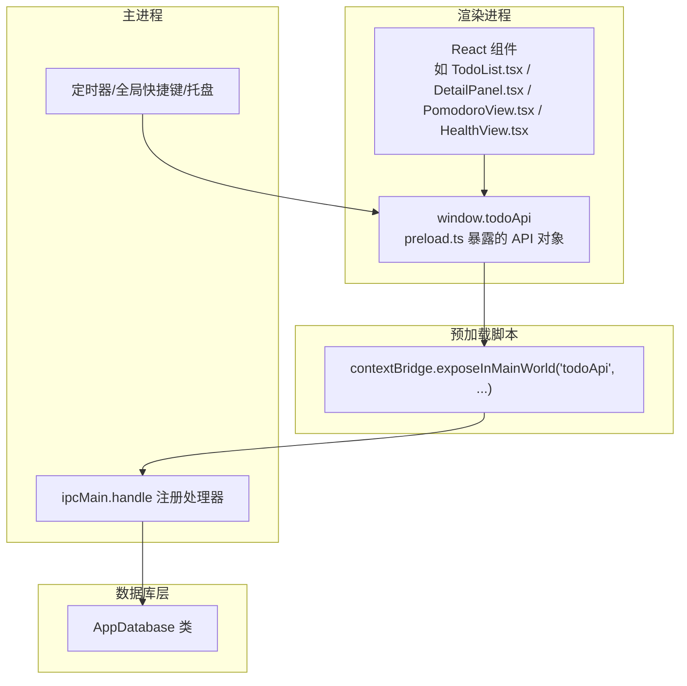
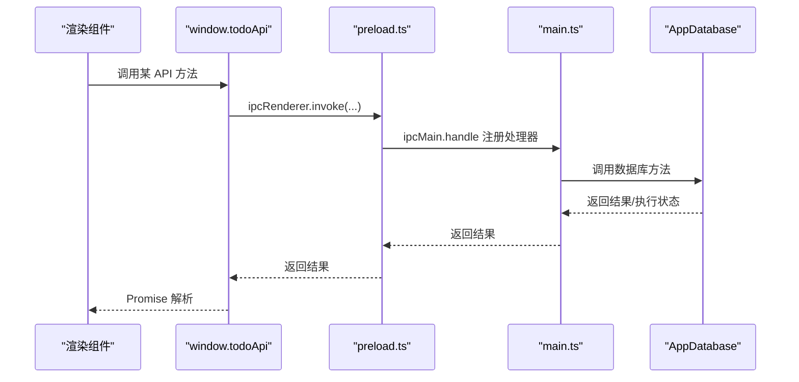
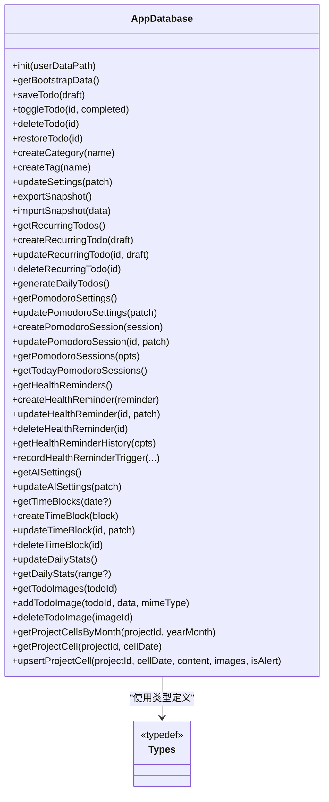

# IPC API 接口

<cite>
**本文引用的文件**
- [preload.ts](file://app/electron/preload.ts)
- [main.ts](file://app/electron/main.ts)
- [db.ts](file://app/electron/db.ts)
- [types.ts](file://app/src/types.ts)
- [App.tsx](file://app/src/App.tsx)
- [TodoList.tsx](file://app/src/components/Content/TodoList.tsx)
- [DetailPanel.tsx](file://app/src/components/DetailPanel/DetailPanel.tsx)
- [PomodoroView.tsx](file://app/src/components/Pomodoro/PomodoroView.tsx)
- [HealthView.tsx](file://app/src/components/Health/HealthView.tsx)
</cite>

## 目录
1. [简介](#简介)
2. [项目结构与 IPC 架构](#项目结构与-ipc-架构)
3. [核心 API 分类与接口清单](#核心-api-分类与接口清单)
4. [架构总览](#架构总览)
5. [详细 API 说明](#详细-api-说明)
6. [依赖关系分析](#依赖关系分析)
7. [性能与并发特性](#性能与并发特性)
8. [安全机制与类型安全](#安全机制与类型安全)
9. [版本兼容性与迁移指南](#版本兼容性与迁移指南)
10. [常见问题排查](#常见问题排查)
11. [结论](#结论)

## 简介
本文档面向前端开发者，系统化梳理 SnowTodo 在 Electron 中通过预加载脚本暴露给渲染进程的 IPC API。文档覆盖数据库操作、应用控制、系统集成、提醒与健康助手、番茄钟、时间块、项目看板、AI 设置、统计数据等模块的接口定义、调用方式、参数与返回值、错误处理、安全与类型保障、版本兼容与迁移建议，并提供可直接参考的调用示例路径。

## 项目结构与 IPC 架构
- 渲染进程通过预加载脚本暴露的全局对象访问主进程能力，采用 invoke/send 模式进行请求-响应与事件订阅。
- 主进程集中注册 ipcMain.handle 处理器，数据库层由 AppDatabase 封装，负责数据持久化与业务逻辑。
- 类型系统统一定义在前端 types.ts，确保前后端参数与返回值的类型一致性。

图表来源
- [preload.ts:18-116](file://app/electron/preload.ts#L18-L116)
- [main.ts:227-358](file://app/electron/main.ts#L227-L358)
- [db.ts:55-90](file://app/electron/db.ts#L55-L90)

章节来源
- [preload.ts:1-117](file://app/electron/preload.ts#L1-L117)
- [main.ts:1-391](file://app/electron/main.ts#L1-L391)
- [db.ts:1-1825](file://app/electron/db.ts#L1-L1825)

## 核心 API 分类与接口清单
以下按功能模块列出 API 名称、调用方式、参数与返回值概要（详见下节详细说明）。

- 启动与基础数据
  - getBootstrapData(): 获取启动时的全量数据（待办、分类、标签、设置）
- 待办管理（Todo）
  - saveTodo(draft): 保存/更新待办
  - toggleTodo(id, completed): 切换完成状态
  - deleteTodo(id): 归档删除
  - restoreTodo(id): 恢复待办
- 分类与标签
  - createCategory(name): 创建分类
  - createTag(name): 创建标签
- 应用设置
  - updateSettings(patch): 更新设置
- 数据导入导出
  - exportData(): 导出数据
  - importData(): 导入数据
- 窗口控制
  - windowAction(action): 最小化/最大化/关闭
- 提醒事件
  - onReminderTriggered(callback): 订阅提醒触发事件
- 重复待办（长期每日模板）
  - getRecurringTodos()
  - createRecurringTodo(draft)
  - updateRecurringTodo(id, draft)
  - deleteRecurringTodo(id)
  - generateDailyTodos()
- 番茄钟（Pomodoro）
  - getPomodoroSettings()
  - updatePomodoroSettings(patch)
  - createPomodoroSession(session)
  - updatePomodoroSession(id, patch)
  - getPomodoroSessions(opts)
  - getTodayPomodoroSessions()
  - setPomodoroActive(active)
  - onPomodoroToggle(callback)
  - onPomodoroActiveChanged(callback)
- 健康提醒
  - getHealthReminders()
  - createHealthReminder(reminder)
  - updateHealthReminder(id, patch)
  - deleteHealthReminder(id)
  - getHealthReminderHistory(opts)
  - snoozeHealthReminder(id, minutes)
  - dismissHealthReminder(id)
  - onHealthReminderTriggered(callback)
- AI 设置
  - getAISettings()
  - updateAISettings(patch)
- 时间块（TimeBlock）
  - getTimeBlocks(date?)
  - createTimeBlock(block)
  - updateTimeBlock(id, patch)
  - deleteTimeBlock(id)
- 统计数据（DailyStats）
  - getDailyStats(startDate, endDate)
  - updateDailyStats(patch)
- 待办图片
  - getTodoImages(todoId)
  - addTodoImage(todoId, data, mimeType)
  - deleteTodoImage(imageId)
- 项目看板（Project Cells）
  - getProjectCellsByMonth(projectId, yearMonth)
  - getProjectCell(projectId, cellDate)
  - upsertProjectCell(projectId, cellDate, content, images, isAlert)

章节来源
- [preload.ts:18-116](file://app/electron/preload.ts#L18-L116)
- [types.ts:1-278](file://app/src/types.ts#L1-L278)

## 架构总览
渲染进程通过 window.todoApi 调用预加载脚本暴露的方法；预加载脚本内部使用 ipcRenderer.invoke 或 ipcRenderer.on 与主进程通信；主进程在 ipcMain.handle 中分发到 AppDatabase 执行具体业务逻辑；数据库层负责 SQL.js/WASM 初始化、表结构与迁移、数据读写与索引维护。

图表来源
- [preload.ts:18-116](file://app/electron/preload.ts#L18-L116)
- [main.ts:227-358](file://app/electron/main.ts#L227-L358)
- [db.ts:55-90](file://app/electron/db.ts#L55-L90)

## 详细 API 说明

### 启动与基础数据
- getBootstrapData()
  - 调用方式: await window.todoApi.getBootstrapData()
  - 参数: 无
  - 返回: BootstrapData（包含 todos[], categories[], tags[], settings）
  - 错误: 无显式错误抛出；若数据库异常，主进程会捕获并在控制台输出错误
  - 示例路径: [App.tsx:24-34](file://app/src/App.tsx#L24-L34)

章节来源
- [preload.ts:20-20](file://app/electron/preload.ts#L20-L20)
- [main.ts:228-228](file://app/electron/main.ts#L228-L228)
- [db.ts:676-714](file://app/electron/db.ts#L676-L714)
- [types.ts:208-213](file://app/src/types.ts#L208-L213)

### 待办管理（Todo）
- saveTodo(draft: TodoDraft)
  - 调用方式: await window.todoApi.saveTodo(draft)
  - 参数: TodoDraft（含 id?, title, notes, priority, categoryId?, dueDate?, dueTime?, startDate?, isPinned, repeatRule, customDays?, reminderEnabled, reminderType, remindAt, tagIds[]）
  - 返回: Todo
  - 错误: 数据库异常时主进程捕获并记录日志
  - 示例路径: [DetailPanel.tsx:173-184](file://app/src/components/DetailPanel/DetailPanel.tsx#L173-L184)
- toggleTodo(id: string, completed: boolean)
  - 调用方式: await window.todoApi.toggleTodo(id, completed)
  - 参数: id, completed
  - 返回: Todo
  - 示例路径: [TodoList.tsx:83-86](file://app/src/components/Content/TodoList.tsx#L83-L86), [TodoList.tsx:152-156](file://app/src/components/Content/TodoList.tsx#L152-L156)
- deleteTodo(id: string)
  - 调用方式: await window.todoApi.deleteTodo(id)
  - 参数: id
  - 返回: void
  - 示例路径: [DetailPanel.tsx:193-198](file://app/src/components/DetailPanel/DetailPanel.tsx#L193-L198)
- restoreTodo(id: string)
  - 调用方式: await window.todoApi.restoreTodo(id)
  - 参数: id
  - 返回: Todo
  - 示例路径: [db.ts:824-833](file://app/electron/db.ts#L824-L833)

章节来源
- [preload.ts:23-26](file://app/electron/preload.ts#L23-L26)
- [main.ts:229-232](file://app/electron/main.ts#L229-L232)
- [db.ts:716-796](file://app/electron/db.ts#L716-L796)
- [types.ts:190-206](file://app/src/types.ts#L190-L206)

### 分类与标签
- createCategory(name: string)
  - 调用方式: await window.todoApi.createCategory(name)
  - 参数: name
  - 返回: Category
  - 示例路径: [db.ts:835-848](file://app/electron/db.ts#L835-L848)
- createTag(name: string)
  - 调用方式: await window.todoApi.createTag(name)
  - 参数: name
  - 返回: Tag
  - 示例路径: [db.ts:850-869](file://app/electron/db.ts#L850-L869)

章节来源
- [preload.ts:29-30](file://app/electron/preload.ts#L29-L30)
- [main.ts:233-234](file://app/electron/main.ts#L233-L234)
- [db.ts:835-869](file://app/electron/db.ts#L835-L869)

### 应用设置
- updateSettings(patch: Partial<Settings>)
  - 调用方式: await window.todoApi.updateSettings(patch)
  - 参数: Partial<Settings>
  - 返回: BootstrapData（更新后的全量数据）
  - 示例路径: [main.ts:235-239](file://app/electron/main.ts#L235-L239)

章节来源
- [preload.ts:33-33](file://app/electron/preload.ts#L33-L33)
- [main.ts:235-239](file://app/electron/main.ts#L235-L239)
- [db.ts:871-880](file://app/electron/db.ts#L871-L880)
- [types.ts:161-166](file://app/src/types.ts#L161-L166)

### 数据导入导出
- exportData()
  - 调用方式: await window.todoApi.exportData()
  - 参数: 无
  - 返回: void
  - 示例路径: [main.ts:195-207](file://app/electron/main.ts#L195-L207)
- importData()
  - 调用方式: await window.todoApi.importData()
  - 参数: 无
  - 返回: BootstrapData|null
  - 示例路径: [main.ts:209-225](file://app/electron/main.ts#L209-L225)

章节来源
- [preload.ts:36-37](file://app/electron/preload.ts#L36-L37)
- [main.ts:240-243](file://app/electron/main.ts#L240-L243)

### 窗口控制
- windowAction(action: 'minimize' | 'maximize' | 'close')
  - 调用方式: await window.todoApi.windowAction(action)
  - 参数: action
  - 返回: void
  - 示例路径: [main.ts:244-259](file://app/electron/main.ts#L244-L259)

章节来源
- [preload.ts:40-40](file://app/electron/preload.ts#L40-L40)
- [main.ts:244-259](file://app/electron/main.ts#L244-L259)

### 提醒事件
- onReminderTriggered(callback: (event: ReminderEvent) => void)
  - 调用方式: const unsub = window.todoApi.onReminderTriggered(cb)
  - 参数: 回调函数
  - 返回: 取消订阅函数
  - 触发: 主进程定时检查到期提醒并向渲染进程发送 reminder:triggered
  - 示例路径: [main.ts:98-118](file://app/electron/main.ts#L98-L118), [main.ts:120-139](file://app/electron/main.ts#L120-L139)
- getDueReminderEvents(): 主进程内部用于计算到期提醒
  - 示例路径: [db.ts:882-930](file://app/electron/db.ts#L882-L930)

章节来源
- [preload.ts:43-47](file://app/electron/preload.ts#L43-L47)
- [main.ts:98-118](file://app/electron/main.ts#L98-L118)
- [db.ts:882-930](file://app/electron/db.ts#L882-L930)

### 重复待办（长期每日模板）
- getRecurringTodos()
- createRecurringTodo(draft: RecurringTodoDraft)
- updateRecurringTodo(id: string, draft: Partial<RecurringTodoDraft>)
- deleteRecurringTodo(id: string)
- generateDailyTodos()
- getActiveRecurringTodos(): 主进程内部使用
- getRecurringTodoById(id: string): 主进程内部使用
- rowToRecurringTodo(row): 主进程内部使用
- saveTodo(draft): 主进程内部用于生成每日实例
- 示例路径: [main.ts:261-267](file://app/electron/main.ts#L261-L267), [db.ts:1053-1181](file://app/electron/db.ts#L1053-L1181), [db.ts:1183-1252](file://app/electron/db.ts#L1183-L1252)

章节来源
- [preload.ts:49-54](file://app/electron/preload.ts#L49-L54)
- [main.ts:261-267](file://app/electron/main.ts#L261-L267)
- [db.ts:1053-1252](file://app/electron/db.ts#L1053-L1252)
- [types.ts:224-258](file://app/src/types.ts#L224-L258)

### 番茄钟（Pomodoro）
- getPomodoroSettings()
- updatePomodoroSettings(patch: Partial<PomodoroSettings>)
- createPomodoroSession(session: Omit<PomodoroSession, 'id'>)
- updatePomodoroSession(id: string, patch: Partial<PomodoroSession>)
- getPomodoroSessions(opts: { todoId?: string; date?: string; limit?: number })
- getTodayPomodoroSessions()
- setPomodoroActive(active: boolean)
- onPomodoroToggle(callback: () => void)
- onPomodoroActiveChanged(callback: (active: boolean) => void)
- 示例路径: [main.ts:268-292](file://app/electron/main.ts#L268-L292), [db.ts:1254-1330](file://app/electron/db.ts#L1254-L1330), [PomodoroView.tsx:206-211](file://app/src/components/Pomodoro/PomodoroView.tsx#L206-L211), [PomodoroView.tsx:244-255](file://app/src/components/Pomodoro/PomodoroView.tsx#L244-L255), [PomodoroView.tsx:289-298](file://app/src/components/Pomodoro/PomodoroView.tsx#L289-L298)

章节来源
- [preload.ts:56-73](file://app/electron/preload.ts#L56-L73)
- [main.ts:268-292](file://app/electron/main.ts#L268-L292)
- [db.ts:1254-1330](file://app/electron/db.ts#L1254-L1330)
- [types.ts:27-48](file://app/src/types.ts#L27-L48)

### 健康提醒
- getHealthReminders()
- createHealthReminder(reminder: Omit<HealthReminder, 'id'>)
- updateHealthReminder(id: string, patch: Partial<HealthReminder>)
- deleteHealthReminder(id: string)
- getHealthReminderHistory(opts: { reminderId?: string; limit?: number })
- snoozeHealthReminder(id: string, minutes: number)
- dismissHealthReminder(id: string)
- onHealthReminderTriggered(callback: (reminder: HealthReminder) => void)
- getDueHealthReminders(isPomodoroActive: boolean): 主进程内部使用
- recordHealthReminderTrigger(...): 主进程内部使用
- 示例路径: [main.ts:294-311](file://app/electron/main.ts#L294-L311), [db.ts:1331-1481](file://app/electron/db.ts#L1331-L1481), [HealthView.tsx:262-269](file://app/src/components/Health/HealthView.tsx#L262-L269), [HealthView.tsx:273-281](file://app/src/components/Health/HealthView.tsx#L273-L281), [HealthView.tsx:316-336](file://app/src/components/Health/HealthView.tsx#L316-L336)

章节来源
- [preload.ts:75-87](file://app/electron/preload.ts#L75-L87)
- [main.ts:294-311](file://app/electron/main.ts#L294-L311)
- [db.ts:1331-1481](file://app/electron/db.ts#L1331-L1481)
- [types.ts:63-88](file://app/src/types.ts#L63-L88)

### AI 设置
- getAISettings()
- updateAISettings(patch: Partial<AISettings>)
- 示例路径: [main.ts:313-317](file://app/electron/main.ts#L313-L317), [db.ts:1585-1622](file://app/electron/db.ts#L1585-L1622), [AIView.tsx:235-235](file://app/src/components/AI/AIView.tsx#L235-L235)

章节来源
- [preload.ts:89-91](file://app/electron/preload.ts#L89-L91)
- [main.ts:313-317](file://app/electron/main.ts#L313-L317)
- [db.ts:1585-1622](file://app/electron/db.ts#L1585-L1622)
- [types.ts:119-127](file://app/src/types.ts#L119-L127)

### 时间块（TimeBlock）
- getTimeBlocks(date?: string)
- createTimeBlock(block: Omit<TimeBlock, 'id'>)
- updateTimeBlock(id: string, patch: Partial<TimeBlock>)
- deleteTimeBlock(id: string)
- 示例路径: [main.ts:319-327](file://app/electron/main.ts#L319-L327), [db.ts:1483-1552](file://app/electron/db.ts#L1483-L1552), [types.ts:103-114](file://app/src/types.ts#L103-L114)

章节来源
- [preload.ts:93-97](file://app/electron/preload.ts#L93-L97)
- [main.ts:319-327](file://app/electron/main.ts#L319-L327)
- [db.ts:1483-1552](file://app/electron/db.ts#L1483-L1552)

### 统计数据（DailyStats）
- getDailyStats(startDate: string, endDate: string)
- updateDailyStats(patch: Record<string, unknown>)
- 示例路径: [main.ts:329-335](file://app/electron/main.ts#L329-L335), [db.ts:1624-1698](file://app/electron/db.ts#L1624-L1698)

章节来源
- [preload.ts:99-101](file://app/electron/preload.ts#L99-L101)
- [main.ts:329-335](file://app/electron/main.ts#L329-L335)
- [db.ts:1624-1698](file://app/electron/db.ts#L1624-L1698)
- [types.ts:138-146](file://app/src/types.ts#L138-L146)

### 待办图片
- getTodoImages(todoId: string)
- addTodoImage(todoId: string, data: string, mimeType: string)
- deleteTodoImage(imageId: string)
- 示例路径: [main.ts:337-346](file://app/electron/main.ts#L337-L346), [db.ts:1741-1769](file://app/electron/db.ts#L1741-L1769), [DetailPanel.tsx:70-70](file://app/src/components/DetailPanel/DetailPanel.tsx#L70-L70), [DetailPanel.tsx:96-105](file://app/src/components/DetailPanel/DetailPanel.tsx#L96-L105), [DetailPanel.tsx:173-182](file://app/src/components/DetailPanel/DetailPanel.tsx#L173-L182)

章节来源
- [preload.ts:103-107](file://app/electron/preload.ts#L103-L107)
- [main.ts:337-346](file://app/electron/main.ts#L337-L346)
- [db.ts:1741-1769](file://app/electron/db.ts#L1741-L1769)
- [types.ts:263-267](file://app/src/types.ts#L263-L267)

### 项目看板（Project Cells）
- getProjectCellsByMonth(projectId: string, yearMonth: string)
- getProjectCell(projectId: string, cellDate: string)
- upsertProjectCell(projectId: string, cellDate: string, content: string, images: string[], isAlert: boolean)
- 示例路径: [main.ts:348-357](file://app/electron/main.ts#L348-L357), [db.ts:1771-1823](file://app/electron/db.ts#L1771-L1823), [types.ts:272-277](file://app/src/types.ts#L272-L277)

章节来源
- [preload.ts:109-116](file://app/electron/preload.ts#L109-L116)
- [main.ts:348-357](file://app/electron/main.ts#L348-L357)
- [db.ts:1771-1823](file://app/electron/db.ts#L1771-L1823)

## 依赖关系分析

图表来源
- [db.ts:55-1825](file://app/electron/db.ts#L55-L1825)
- [types.ts:1-278](file://app/src/types.ts#L1-L278)

章节来源
- [db.ts:55-1825](file://app/electron/db.ts#L55-L1825)
- [types.ts:1-278](file://app/src/types.ts#L1-L278)

## 性能与并发特性
- 数据库初始化: 使用 sql.js 并通过 locateFile 指定 wasm 路径，开发与打包环境分别定位资源，减少冷启动开销。
- 定时任务: 主进程每 30 秒检查到期提醒，每 60 秒检查健康提醒，避免频繁 IO。
- 番茄钟: 通过全局快捷键触发，避免额外线程开销。
- 并发: 渲染进程调用均为异步 invoke，主进程处理器串行执行，避免竞态；数据库层通过事务与索引优化查询性能。
- 索引: pomodoro_sessions、time_blocks、daily_stats、health_reminders 等均建立必要索引，提升查询效率。

章节来源
- [db.ts:60-90](file://app/electron/db.ts#L60-L90)
- [main.ts:120-177](file://app/electron/main.ts#L120-L177)
- [db.ts:197-206](file://app/electron/db.ts#L197-L206)

## 安全机制与类型安全
- 上下文隔离: 预加载脚本通过 contextBridge.exposeInMainWorld 暴露受控 API，未暴露 Node.js 全部能力。
- 类型约束: 所有 API 参数与返回值在 types.ts 中定义，预加载脚本与主进程处理器严格遵循类型签名，确保运行时一致性。
- IPC 通道: 使用 ipcRenderer.invoke 与 ipcMain.handle 进行请求-响应模式，避免直接暴露通用通道。
- 事件监听: 事件订阅返回取消函数，避免内存泄漏；主进程对事件广播仅限内部触发。
- 错误处理: 主进程在定时循环与处理器中捕获异常并记录日志，不向渲染进程抛出未处理异常。

章节来源
- [preload.ts:1-16](file://app/electron/preload.ts#L1-L16)
- [main.ts:18-52](file://app/electron/main.ts#L18-L52)
- [types.ts:1-278](file://app/src/types.ts#L1-L278)

## 版本兼容性与迁移指南
- 数据库迁移: AppDatabase.init 会在首次启动或已有数据库时运行迁移，新增表与索引、默认数据插入、字段补齐等。
- 默认值: Settings、PomodoroSettings、AI Settings 等均有默认值，保证新安装与升级后的可用性。
- 表结构演进: 迁移脚本会检测缺失列/表并自动补齐，避免破坏现有数据。
- 升级建议:
  - 若新增字段，请在 AppDatabase.runMigrations 中添加对应 ALTER/CREATE 语句。
  - 若修改类型定义，请同步更新主进程处理器与数据库方法的参数/返回值映射。
  - 导入导出使用 BootstrapData 结构，升级时注意字段兼容性。

章节来源
- [db.ts:92-297](file://app/electron/db.ts#L92-L297)
- [db.ts:299-504](file://app/electron/db.ts#L299-L504)
- [db.ts:507-624](file://app/electron/db.ts#L507-L624)

## 常见问题排查
- 无法调用 API
  - 确认预加载脚本已正确注入，且渲染进程在 DOMContentLoaded 后调用。
  - 检查 preload.ts 是否暴露了目标方法名。
- 调用报错
  - 查看主进程控制台是否有异常日志（如定时循环与处理器中的 try/catch）。
  - 确认传入参数符合类型定义。
- 数据未更新
  - 确认数据库保存成功（save() 调用），并检查索引与查询条件。
- 提醒未触发
  - 检查 getDueReminderEvents 与 getDueHealthReminders 的过滤逻辑与时间范围。
- 番茄钟状态不同步
  - 确认 setPomodoroActive 与 onPomodoroActiveChanged 的订阅与取消订阅逻辑。

章节来源
- [main.ts:120-177](file://app/electron/main.ts#L120-L177)
- [db.ts:882-930](file://app/electron/db.ts#L882-L930)
- [db.ts:1406-1457](file://app/electron/db.ts#L1406-L1457)

## 结论
SnowTodo 的 IPC API 通过预加载脚本与主进程处理器形成清晰的职责边界，结合严格的类型定义与数据库迁移机制，既保证了前端调用的简洁性，又确保了数据一致性和扩展性。建议在新增功能时遵循现有命名规范与类型约束，配合迁移脚本与错误日志，确保平滑升级与稳定运行。