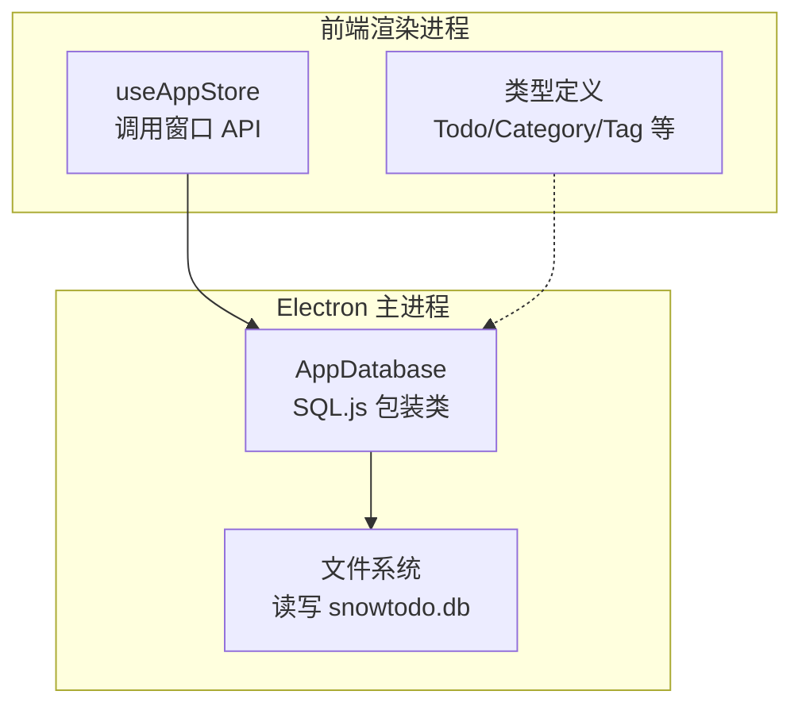
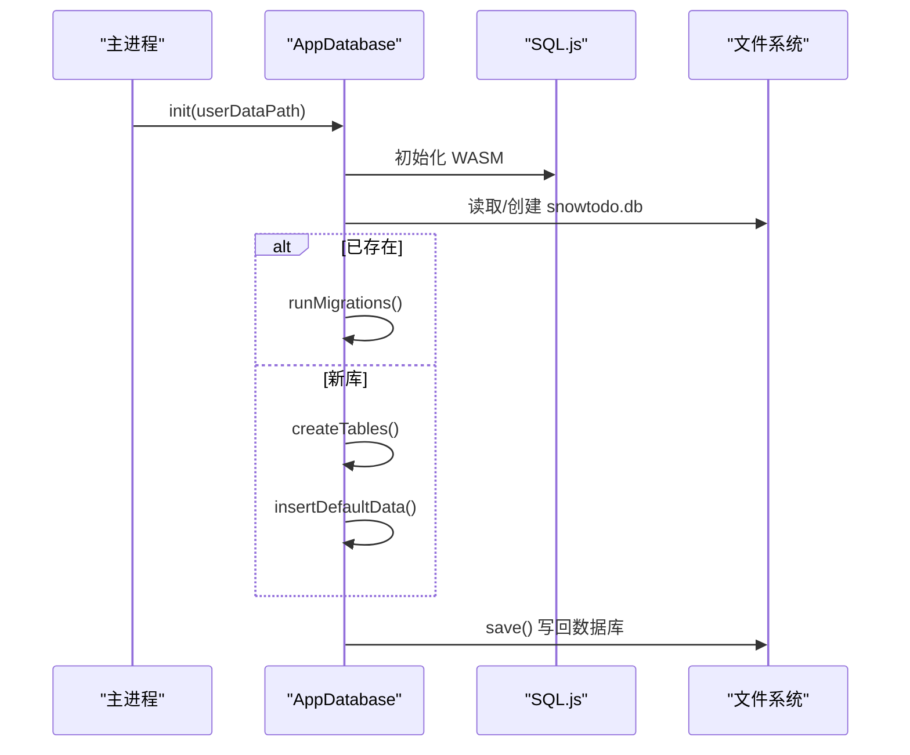
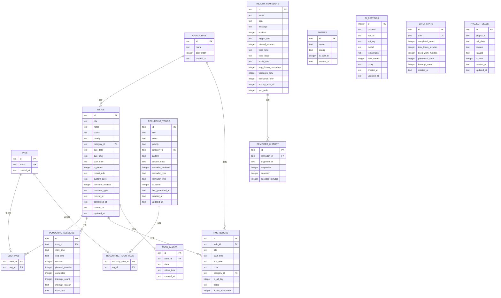
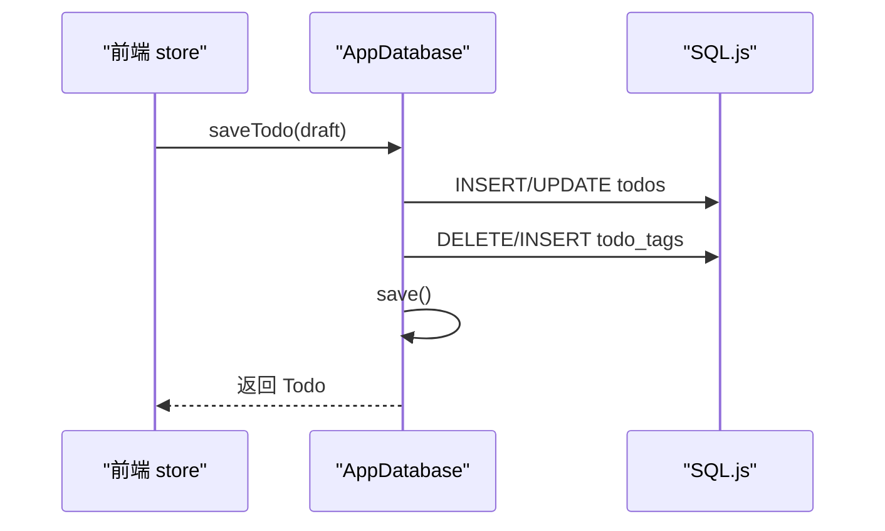
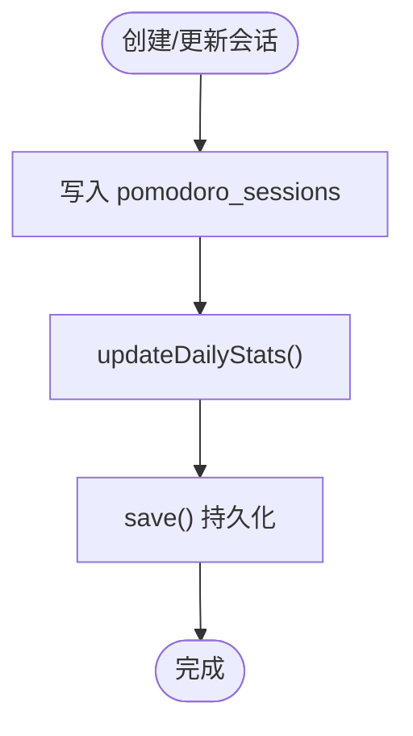
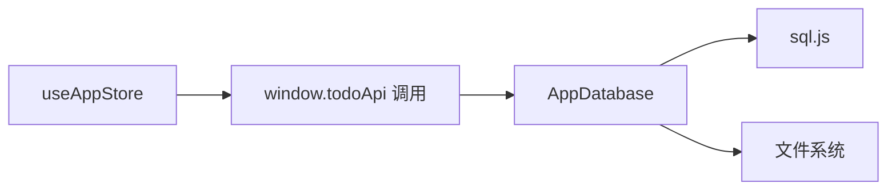
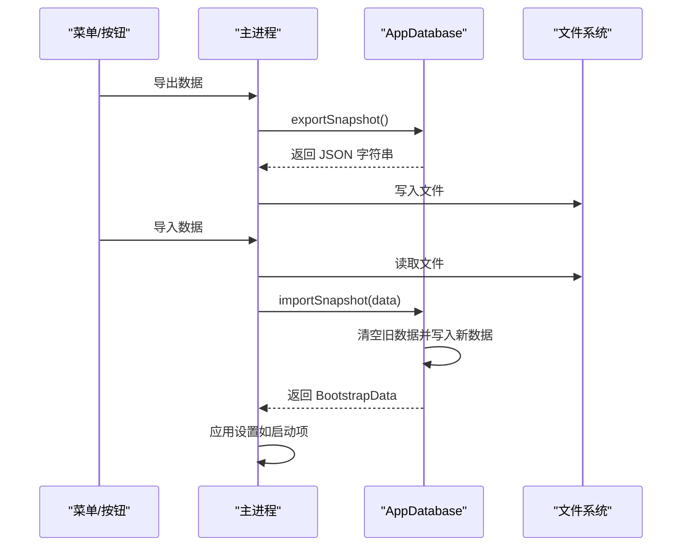

# 数据库 API

<cite>
**本文引用的文件**
- [db.ts](file://app/electron/db.ts)
- [types.ts](file://app/src/types.ts)
- [useAppStore.ts](file://app/src/store/useAppStore.ts)
- [main.ts](file://app/electron/main.ts)
</cite>

## 目录
1. [简介](#简介)
2. [项目结构](#项目结构)
3. [核心组件](#核心组件)
4. [架构总览](#架构总览)
5. [详细组件分析](#详细组件分析)
6. [依赖分析](#依赖分析)
7. [性能考虑](#性能考虑)
8. [故障排查指南](#故障排查指南)
9. [结论](#结论)
10. [附录](#附录)

## 简介
本文件为 SnowTodo 的数据库 API 完整技术文档，覆盖 SQLite（通过 sql.js 在 Electron 中运行）的表结构、初始化与迁移、事务与持久化策略、以及对 Todo、Category、Tag、PomodoroSession、HealthReminder 等实体的 CRUD 与查询接口。文档同时提供数据模型定义、关系说明、查询规范（条件、排序、分页）、性能优化建议与最佳实践，面向后端开发者与数据库管理员。

## 项目结构
数据库层位于 Electron 主进程侧，使用 sql.js 将 SQLite 以 WASM 方式嵌入，本地用户目录下存储单文件数据库。应用启动时加载或创建数据库，执行迁移与默认数据注入；每次写操作后统一保存到磁盘。

图表来源
- [db.ts:60-90](file://app/electron/db.ts#L60-L90)
- [main.ts:195-225](file://app/electron/main.ts#L195-L225)

章节来源
- [db.ts:60-90](file://app/electron/db.ts#L60-L90)
- [main.ts:195-225](file://app/electron/main.ts#L195-L225)

## 核心组件
- AppDatabase：封装数据库初始化、表结构创建与迁移、CRUD、查询、快照导入导出、索引维护等。
- 类型系统：定义 Todo、Category、Tag、PomodoroSession、HealthReminder、Settings 等数据模型与枚举。
- 前端 store：通过 window.todoApi 调用数据库 API，实现状态同步与 UI 更新。

章节来源
- [db.ts:55-90](file://app/electron/db.ts#L55-L90)
- [types.ts:168-278](file://app/src/types.ts#L168-L278)
- [useAppStore.ts:408-580](file://app/src/store/useAppStore.ts#L408-L580)

## 架构总览
数据库采用单文件 SQLite，通过 sql.js 初始化 WASM 并加载/保存数据库文件。迁移逻辑确保现有数据库与新版本 schema 兼容，新增索引提升查询性能。写操作均通过统一 save() 持久化，保证一致性。

图表来源
- [db.ts:60-90](file://app/electron/db.ts#L60-L90)
- [db.ts:299-505](file://app/electron/db.ts#L299-L505)
- [db.ts:507-543](file://app/electron/db.ts#L507-L543)

## 详细组件分析

### 数据模型与关系
- Todo：待办事项，支持优先级、到期时间、重复规则、标签关联、提醒配置、分类外键。
- Category：分类，带排序字段。
- Tag：标签，唯一名称。
- Todo <-> Tag：多对多，通过 todo_tags 关联表。
- RecurringTodo：长期每日模板，复制生成每日实例。
- PomodoroSession：专注会话，记录开始/结束、时长、中断次数与类型。
- HealthReminder：健康提醒，支持间隔/固定时间触发、工作日/周末限制、跳过番茄钟等。
- ReminderHistory：提醒历史记录。
- TimeBlock：时间块，用于日程安排。
- Theme/AI Settings/DailyStats：主题、AI 设置、每日统计。
- TodoImages/ProjectCells：图片附件、项目月度格子。

图表来源
- [db.ts:299-505](file://app/electron/db.ts#L299-L505)
- [types.ts:148-278](file://app/src/types.ts#L148-L278)

章节来源
- [db.ts:299-505](file://app/electron/db.ts#L299-L505)
- [types.ts:148-278](file://app/src/types.ts#L148-L278)

### 初始化与迁移机制
- 初始化：定位 sql-wasm.wasm，创建/加载数据库文件，若存在则执行迁移，否则创建表并插入默认数据。
- 迁移：
  - 补充 todos.custom_days 字段。
  - 新增 pomodoro_sessions、health_reminders、reminder_history、time_blocks、themes、ai_settings、daily_stats 等表。
  - 添加索引：idx_pomodoro_todo、idx_pomodoro_start、idx_timeblock_start、idx_daily_stats_date、idx_health_enabled。
  - 注入默认健康提醒、内置主题、AI 设置、番茄钟设置、todo_images、project_cells 表及 start_date 字段。
- 默认数据：分类、设置、主题、健康提醒、AI 设置。

章节来源
- [db.ts:60-90](file://app/electron/db.ts#L60-L90)
- [db.ts:92-297](file://app/electron/db.ts#L92-L297)
- [db.ts:507-624](file://app/electron/db.ts#L507-L624)

### 事务与持久化
- 写操作：所有写操作（INSERT/UPDATE/DELETE）后统一调用 save() 将内存数据库导出并写回磁盘文件。
- 无显式 BEGIN/COMMIT：基于单文件 SQLite 的 ACID 行为，写入即持久化，无需手动事务控制。
- 快照：exportSnapshot()/importSnapshot() 支持全量备份与恢复。

章节来源
- [db.ts:626-630](file://app/electron/db.ts#L626-L630)
- [db.ts:970-1023](file://app/electron/db.ts#L970-L1023)

### 查询规范
- 条件查询：WHERE + 索引列（如 status、due_date、category_id、enabled 等）。
- 排序：ORDER BY 对应字段，如按创建时间倒序、按 sort_order 排序。
- 分页：通过 LIMIT/OFFSET 或日期范围截断（如 pomodoro_sessions/date_range、reminder_history 限制条数）。
- 聚合统计：通过聚合函数与 GROUP BY（如 daily_stats 按日统计）。

章节来源
- [db.ts:1310-1329](file://app/electron/db.ts#L1310-L1329)
- [db.ts:1469-1481](file://app/electron/db.ts#L1469-L1481)
- [db.ts:1679-1698](file://app/electron/db.ts#L1679-L1698)

### Todo 实体 API
- 读取
  - getBootstrapData：一次性返回 todos、categories、tags、settings。
  - getDueReminderEvents：查询即将到期的提醒事件。
- 写入/更新
  - saveTodo(draft: TodoDraft)：新建或更新 Todo，同时维护 todo_tags。
  - toggleTodo(todoId, completed)：切换完成/未完成状态并更新完成时间。
  - restoreTodo(todoId)：从归档恢复为待办。
  - deleteTodo(todoId)：软删除（标记为 archived）。
  - advanceRecurringTodo(todo)：根据重复规则推进到期日。
- 导入导出
  - exportSnapshot()/importSnapshot()：全量快照。

图表来源
- [db.ts:716-796](file://app/electron/db.ts#L716-L796)
- [db.ts:798-833](file://app/electron/db.ts#L798-L833)
- [db.ts:824-833](file://app/electron/db.ts#L824-L833)
- [db.ts:835-848](file://app/electron/db.ts#L835-L848)
- [db.ts:850-869](file://app/electron/db.ts#L850-L869)
- [db.ts:871-880](file://app/electron/db.ts#L871-L880)
- [db.ts:882-940](file://app/electron/db.ts#L882-L940)
- [db.ts:942-968](file://app/electron/db.ts#L942-L968)
- [db.ts:970-1023](file://app/electron/db.ts#L970-L1023)

章节来源
- [db.ts:716-833](file://app/electron/db.ts#L716-L833)
- [db.ts:835-869](file://app/electron/db.ts#L835-L869)
- [db.ts:871-880](file://app/electron/db.ts#L871-L880)
- [db.ts:882-940](file://app/electron/db.ts#L882-L940)
- [db.ts:942-968](file://app/electron/db.ts#L942-L968)
- [db.ts:970-1023](file://app/electron/db.ts#L970-L1023)

### Category 实体 API
- createCategory(name)：创建分类并分配排序序号（最大值+1），返回 Category。

章节来源
- [db.ts:835-848](file://app/electron/db.ts#L835-L848)

### Tag 实体 API
- createTag(name)：若不存在则创建，返回 Tag；若已存在则返回已有记录。

章节来源
- [db.ts:850-869](file://app/electron/db.ts#L850-L869)

### PomodoroSession 实体 API
- createPomodoroSession(session)：创建会话并更新当日统计。
- updatePomodoroSession(id, patch)：增量更新，完成后更新统计。
- getPomodoroSessionById(id)：按 id 获取。
- getPomodoroSessions(dateRange?)：按日期范围或全局倒序查询。
- getTodayPomodoroSessions()：获取当日会话列表。
- updateDailyStats()：按日汇总统计并 upsert。

图表来源
- [db.ts:1271-1302](file://app/electron/db.ts#L1271-L1302)
- [db.ts:1304-1329](file://app/electron/db.ts#L1304-L1329)
- [db.ts:1626-1677](file://app/electron/db.ts#L1626-L1677)

章节来源
- [db.ts:1271-1329](file://app/electron/db.ts#L1271-L1329)
- [db.ts:1626-1677](file://app/electron/db.ts#L1626-L1677)

### HealthReminder 实体 API
- getHealthReminders()：按 sort_order 排序返回。
- createHealthReminder(reminder)：创建并返回。
- updateHealthReminder(id, patch)：增量更新。
- deleteHealthReminder(id)：删除并清理历史。
- getDueHealthReminders(isPomodoroActive)：计算触发条件（跳过番茄钟、工作日/周末、固定时间/间隔、最近触发时间）。
- recordHealthReminderTrigger(reminderId, responded, snoozed, snoozedMinutes?)：记录历史。

章节来源
- [db.ts:1353-1403](file://app/electron/db.ts#L1353-L1403)
- [db.ts:1406-1457](file://app/electron/db.ts#L1406-L1457)
- [db.ts:1459-1467](file://app/electron/db.ts#L1459-L1467)

### TimeBlock 实体 API
- getTimeBlocks(date?)：按日期范围或全量查询。
- createTimeBlock(block)：创建。
- updateTimeBlock(id, patch)：增量更新。
- deleteTimeBlock(id)：删除。

章节来源
- [db.ts:1500-1552](file://app/electron/db.ts#L1500-L1552)

### 其他实体 API
- Settings：updateSettings(patch)、getPomodoroSettings()、updatePomodoroSettings(patch)、getCurrentThemeId()、setCurrentThemeId(themeId)。
- Themes：getThemes()、createCustomTheme(id,name,config)、updateTheme(id,name,config)、deleteTheme(id)。
- AI Settings：getAISettings()、updateAISettings(patch)。
- Daily Stats：getDailyStats(dateRange?)、updateDailyStats()。
- Todo Images：getTodoImages(todoId)、addTodoImage(todoId,data,mimeType)、deleteTodoImage(imageId)。
- Project Cells：getProjectCellsByMonth(projectId,yearMonth)、getProjectCell(projectId,cellDate)、upsertProjectCell(...)。

章节来源
- [db.ts:871-880](file://app/electron/db.ts#L871-L880)
- [db.ts:1702-1739](file://app/electron/db.ts#L1702-L1739)
- [db.ts:1556-1583](file://app/electron/db.ts#L1556-L1583)
- [db.ts:1587-1622](file://app/electron/db.ts#L1587-L1622)
- [db.ts:1679-1698](file://app/electron/db.ts#L1679-L1698)
- [db.ts:1743-1769](file://app/electron/db.ts#L1743-L1769)
- [db.ts:1773-1823](file://app/electron/db.ts#L1773-L1823)

## 依赖分析
- 组件耦合
  - AppDatabase 与 sql.js 强耦合，负责初始化、迁移、CRUD、索引与持久化。
  - 前端 store 仅通过 window.todoApi 调用数据库 API，降低耦合。
- 外部依赖
  - Electron 应用生命周期与文件系统交互。
  - 导入导出功能依赖主进程对话框与文件读写。

图表来源
- [useAppStore.ts:408-580](file://app/src/store/useAppStore.ts#L408-L580)
- [db.ts:60-90](file://app/electron/db.ts#L60-L90)
- [main.ts:195-225](file://app/electron/main.ts#L195-L225)

章节来源
- [useAppStore.ts:408-580](file://app/src/store/useAppStore.ts#L408-L580)
- [db.ts:60-90](file://app/electron/db.ts#L60-L90)
- [main.ts:195-225](file://app/electron/main.ts#L195-L225)

## 性能考虑
- 索引优化
  - todos：idx_todos_status、idx_todos_due_date、idx_todos_category。
  - pomodoro_sessions：idx_pomodoro_todo、idx_pomodoro_start。
  - time_blocks：idx_timeblock_start。
  - daily_stats：idx_daily_stats_date。
  - health_reminders：idx_health_enabled。
- 查询建议
  - 使用索引列作为过滤条件（status、due_date、category_id、enabled 等）。
  - 日期范围查询使用 start_time/due_date 等索引列。
  - 限制返回数量（如 reminder_history 限制条数）。
- 写入优化
  - 批量写入后统一 save()，避免频繁落盘。
  - 使用 upsert（INSERT OR REPLACE/ON CONFLICT）减少往返。
- 统计更新
  - updateDailyStats() 按日汇总，避免频繁复杂聚合查询。

章节来源
- [db.ts:384-479](file://app/electron/db.ts#L384-L479)
- [db.ts:1626-1677](file://app/electron/db.ts#L1626-L1677)

## 故障排查指南
- 数据库无法加载
  - 检查 sql-wasm.wasm 路径是否正确（开发/发布环境路径不同）。
  - 确认数据库文件存在且可读写。
- 迁移失败
  - 查看迁移日志输出，确认 ALTER/CREATE/INDEX 语句执行情况。
  - 若字段已存在，确认迁移逻辑幂等性。
- 写入不生效
  - 确认每次写入后调用了 save()。
  - 检查权限与磁盘空间。
- 快照导入异常
  - 确认导入文件格式为 BootstrapData。
  - 导入后检查 settings 是否正确应用（如启动项）。

章节来源
- [db.ts:60-90](file://app/electron/db.ts#L60-L90)
- [db.ts:92-297](file://app/electron/db.ts#L92-L297)
- [db.ts:626-630](file://app/electron/db.ts#L626-L630)
- [main.ts:195-225](file://app/electron/main.ts#L195-L225)

## 结论
SnowTodo 的数据库层以 AppDatabase 为核心，通过 sql.js 提供 SQLite 功能，具备完善的初始化、迁移、CRUD、查询与统计能力。遵循“写后持久化”的简单事务模型，结合索引与聚合统计，满足日常任务管理场景。建议在生产环境中定期备份快照，并关注查询性能与索引维护。

## 附录
- 快照导入导出流程

图表来源
- [db.ts:970-1023](file://app/electron/db.ts#L970-L1023)
- [main.ts:195-225](file://app/electron/main.ts#L195-L225)