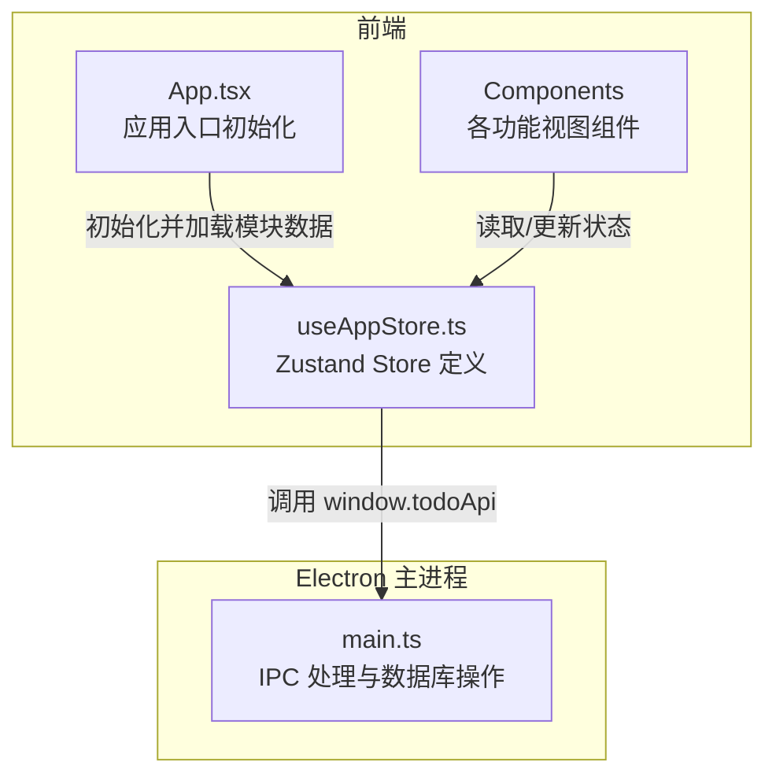
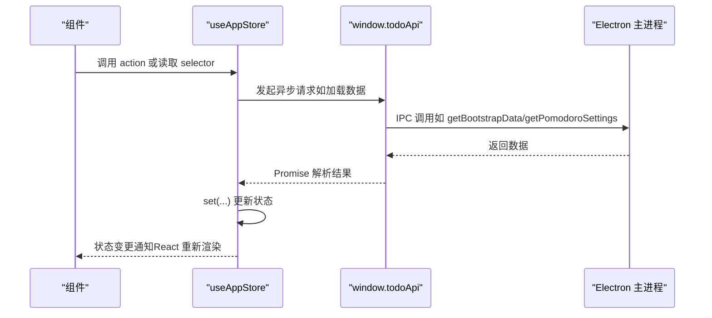
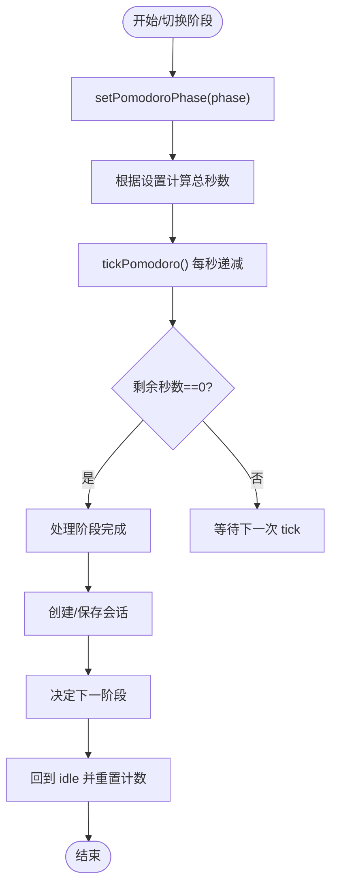
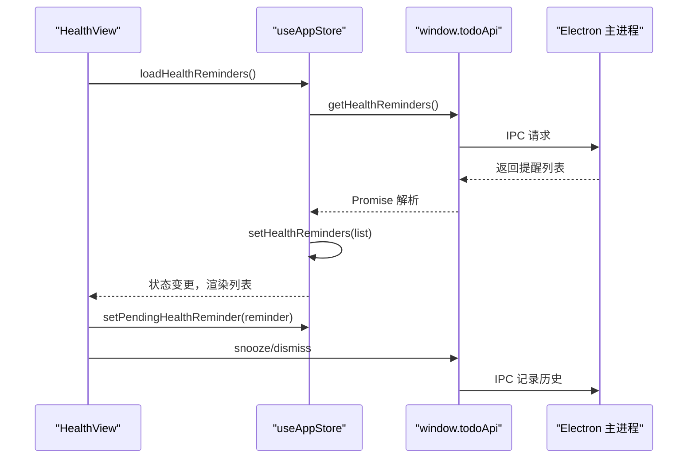
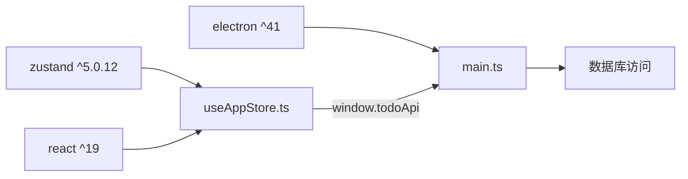

# 状态管理 API

<cite>
**本文引用的文件**
- [useAppStore.ts](file://app/src/store/useAppStore.ts)
- [types.ts](file://app/src/types.ts)
- [App.tsx](file://app/src/App.tsx)
- [Content.tsx](file://app/src/components/Content/Content.tsx)
- [TodoList.tsx](file://app/src/components/Content/TodoList.tsx)
- [PomodoroView.tsx](file://app/src/components/Pomodoro/PomodoroView.tsx)
- [HealthView.tsx](file://app/src/components/Health/HealthView.tsx)
- [DashboardView.tsx](file://app/src/components/Dashboard/DashboardView.tsx)
- [main.ts](file://app/electron/main.ts)
- [package.json](file://app/package.json)
</cite>

## 目录
1. [简介](#简介)
2. [项目结构](#项目结构)
3. [核心组件](#核心组件)
4. [架构总览](#架构总览)
5. [详细组件分析](#详细组件分析)
6. [依赖关系分析](#依赖关系分析)
7. [性能考量](#性能考量)
8. [故障排查指南](#故障排查指南)
9. [结论](#结论)
10. [附录](#附录)

## 简介
本文件为 SnowTodo 的状态管理 API 详细接口文档，基于 Zustand 实现。内容覆盖：
- 状态结构定义与字段说明
- Actions（动作）与 Selectors（派生计算）
- 状态订阅与副作用监听机制
- 状态更新机制与异步数据加载流程
- 状态持久化策略与本地存储建议
- 状态重置、同步与恢复能力说明
- 调试与监控方法
- 最佳实践与性能优化建议
- 面向前端开发者的使用指南与常见问题解答

## 项目结构
SnowTodo 使用 Zustand 在前端侧集中管理应用状态，并通过 Electron 的 window.todoApi 与主进程交互以实现数据持久化与系统级功能。

图表来源
- [useAppStore.ts:181-508](file://app/src/store/useAppStore.ts#L181-L508)
- [App.tsx:24-34](file://app/src/App.tsx#L24-L34)
- [main.ts:294-317](file://app/electron/main.ts#L294-L317)

章节来源
- [useAppStore.ts:181-508](file://app/src/store/useAppStore.ts#L181-L508)
- [App.tsx:11-34](file://app/src/App.tsx#L11-L34)
- [main.ts:294-317](file://app/electron/main.ts#L294-L317)

## 核心组件
- Zustand Store：集中定义状态、动作与派生计算，提供类型安全的读写接口。
- 类型系统：统一的 TypeScript 类型定义，确保状态结构与数据契约清晰。
- 组件层：通过 hooks 订阅状态，触发 actions 更新状态，渲染 UI。

章节来源
- [useAppStore.ts:30-80](file://app/src/store/useAppStore.ts#L30-L80)
- [types.ts:161-278](file://app/src/types.ts#L161-L278)

## 架构总览
Zustand Store 作为单一事实来源，组件通过 hooks 订阅状态并调用 actions。数据持久化通过 window.todoApi 与主进程通信，主进程负责数据库访问与 IPC 处理。

图表来源
- [useAppStore.ts:237-246](file://app/src/store/useAppStore.ts#L237-L246)
- [useAppStore.ts:394-397](file://app/src/store/useAppStore.ts#L394-L397)
- [main.ts:294-317](file://app/electron/main.ts#L294-L317)

## 详细组件分析

### 状态结构定义（AppState）
- 基础数据：待办、长期待办、分类、标签、设置
- UI 状态：当前视图、选中的待办/长期待办、详情面板开关、筛选条件、排序方式
- 引导状态：加载中、是否已初始化
- 番茄钟：设置、阶段、剩余秒数、会话计数、活跃任务、历史会话
- 健康提醒：提醒列表、待确认弹窗
- AI 设置：AI 配置、是否已加载
- 时间块：时间块列表、当前日期
- 仪表盘：每日统计
- 项目看板：按日期聚合的项目单元格

章节来源
- [useAppStore.ts:30-80](file://app/src/store/useAppStore.ts#L30-L80)
- [types.ts:161-278](file://app/src/types.ts#L161-L278)

### 动作（Actions）概览
- 引导与初始化：initialize、setLoading
- 导航：setCurrentView
- 待办 CRUD：setTodos、addTodo、updateTodo、removeTodo
- 分类/标签：setCategories、addCategory、setTags、addTag
- 长期待办：setRecurringTodos、addRecurringTodo、updateRecurringTodo、removeRecurringTodo、openRecurringPanel、closeRecurringPanel、loadRecurringTodos
- 设置：setSettings、updateSettings
- 详情面板：openDetailPanel、closeDetailPanel
- 筛选与排序：setSearchQuery、setFilterPriority、setFilterCategoryId、setFilterTagId、setSortBy、clearFilters
- 派生计算：getFilteredTodos、getTodayTodos、getUpcomingTodos、getCompletedTodos、getTodosByCategory、getTodosByTag、getPendingReminders
- 番茄钟：loadPomodoroSettings、setPomodoroSettings、setPomodoroPhase、setPomodoroSecondsLeft、tickPomodoro、setPomodoroSession、setPomodoroActiveTodoId、addPomodoroSession、setTodayPomodoroSessions、loadTodayPomodoroSessions
- 健康提醒：loadHealthReminders、setHealthReminders、addHealthReminder、updateHealthReminderLocal、removeHealthReminder、setPendingHealthReminder
- AI 设置：loadAISettings、setAISettings
- 时间块：setTimeBlocks、setTimeBlockDate、loadTimeBlocks、addTimeBlock、updateTimeBlockLocal、removeTimeBlock
- 仪表盘：setDailyStats、loadDailyStats
- 项目看板：loadProjectMonth、loadProjectCell、upsertProjectCell

章节来源
- [useAppStore.ts:82-176](file://app/src/store/useAppStore.ts#L82-L176)
- [useAppStore.ts:237-508](file://app/src/store/useAppStore.ts#L237-L508)

### 派生计算（Selectors）
- getFilteredTodos：按关键词、优先级、分类、标签过滤并排序
- getTodayTodos：今日到期且已开始的任务
- getUpcomingTodos：未来一周内到期的任务
- getCompletedTodos：已完成任务，按完成/更新时间倒序
- getTodosByCategory / getTodosByTag：按分类/标签过滤
- getPendingReminders：根据提醒时间与启用状态筛选待触发提醒

章节来源
- [useAppStore.ts:327-389](file://app/src/store/useAppStore.ts#L327-L389)

### 状态订阅与副作用监听
- 组件订阅：通过 hooks 读取状态与派生计算，自动响应状态变更
- 副作用监听：通过 window.todoApi.onPomodoroToggle 等事件回调，实现跨组件联动与系统级交互
- 生命周期：应用启动时初始化数据；各模块独立加载；定时器与计时逻辑在组件内管理

章节来源
- [App.tsx:24-34](file://app/src/App.tsx#L24-L34)
- [PomodoroView.tsx:206-211](file://app/src/components/Pomodoro/PomodoroView.tsx#L206-L211)

### 状态更新机制
- 同步更新：直接 set(...)
- 基于旧状态的更新：set(s => ...)，保证原子性与一致性
- 异步更新：通过 window.todoApi 获取远程数据后 set(...)
- 排序与过滤：在 selector 中进行，避免在 UI 层重复计算

章节来源
- [useAppStore.ts:265-272](file://app/src/store/useAppStore.ts#L265-L272)
- [useAppStore.ts:394-397](file://app/src/store/useAppStore.ts#L394-L397)

### 状态持久化策略
- 数据持久化：通过 window.todoApi 与主进程交互，主进程负责数据库读写
- IPC 映射：各模块的 get/update/delete/load 方法映射到主进程 handle
- 本地存储建议：可结合 IndexedDB 或本地文件系统缓存关键状态，减少首屏加载时间；对敏感数据进行加密存储

章节来源
- [useAppStore.ts:541-602](file://app/src/store/useAppStore.ts#L541-L602)
- [main.ts:294-317](file://app/electron/main.ts#L294-L317)

### 状态重置、同步与恢复
- 重置：可通过 actions 清空或重置特定字段（如 clearFilters、removeTodo 将状态归档）
- 同步：loadXxx 系列 action 从后端拉取最新数据，set(...) 合并到状态
- 恢复：应用启动时 initialize 将引导数据注入状态；支持导入/导出数据（见 window.todoApi）

章节来源
- [useAppStore.ts:321-322](file://app/src/store/useAppStore.ts#L321-L322)
- [useAppStore.ts:237-246](file://app/src/store/useAppStore.ts#L237-L246)
- [useAppStore.ts:545-554](file://app/src/store/useAppStore.ts#L545-L554)

### 番茄钟状态流

图表来源
- [useAppStore.ts:399-420](file://app/src/store/useAppStore.ts#L399-L420)
- [PomodoroView.tsx:228-283](file://app/src/components/Pomodoro/PomodoroView.tsx#L228-L283)

### 健康提醒状态流

图表来源
- [useAppStore.ts:425-438](file://app/src/store/useAppStore.ts#L425-L438)
- [HealthView.tsx:300-316](file://app/src/components/Health/HealthView.tsx#L300-L316)
- [main.ts:294-317](file://app/electron/main.ts#L294-L317)

### 仪表盘与项目看板
- 仪表盘：loadDailyStats 拉取日期范围内的统计数据，setDailyStats 更新
- 项目看板：按月/按单元格加载，upsertProjectCell 支持新增/更新

章节来源
- [useAppStore.ts:467-507](file://app/src/store/useAppStore.ts#L467-L507)
- [DashboardView.tsx:1-41](file://app/src/components/Dashboard/DashboardView.tsx#L1-L41)

## 依赖关系分析
- Zustand 版本：^5.0.12
- React 生态：React 19、React Hooks
- Electron：IPC 通信、构建打包
- 数据库：sql.js（WASM）

图表来源
- [package.json:25](file://app/package.json#L25)
- [useAppStore.ts:541-602](file://app/src/store/useAppStore.ts#L541-L602)
- [main.ts:294-317](file://app/electron/main.ts#L294-L317)

章节来源
- [package.json:16-26](file://app/package.json#L16-L26)
- [useAppStore.ts:541-602](file://app/src/store/useAppStore.ts#L541-L602)
- [main.ts:294-317](file://app/electron/main.ts#L294-L317)

## 性能考量
- 选择器计算：将过滤与排序放在 selector 中，避免在组件内重复计算
- 状态粒度：尽量细粒度拆分状态，减少不必要的重渲染
- 异步加载：使用 loadXxx 系列 action 并在组件挂载时触发，避免阻塞首屏
- 计时器：组件内管理定时器生命周期，确保清理防止内存泄漏
- 事件订阅：onXxx 回调需在组件卸载时返回解绑函数，避免重复订阅

## 故障排查指南
- 初始化失败：检查 App.tsx 中 initialize 流程与 window.todoApi.getBootstrapData 是否返回正确数据
- 番茄钟异常：确认 window.todoApi.onPomodoroToggle 是否被正确订阅，定时器是否按预期启停
- 健康提醒未弹窗：检查 setPendingHealthReminder 与 onHealthReminderTriggered 的联动
- 数据不一致：核对 loadXxx 与 setXxx 的调用顺序，确保异步完成后才渲染
- 依赖缺失：确认 package.json 中 zustand 已安装，版本满足要求

章节来源
- [App.tsx:24-34](file://app/src/App.tsx#L24-L34)
- [PomodoroView.tsx:206-211](file://app/src/components/Pomodoro/PomodoroView.tsx#L206-L211)
- [HealthView.tsx:300-316](file://app/src/components/Health/HealthView.tsx#L300-L316)
- [package.json:25](file://app/package.json#L25)

## 结论
SnowTodo 的状态管理以 Zustand 为核心，结合 window.todoApi 与 Electron 主进程实现数据持久化与系统级能力。通过清晰的动作与派生计算，组件可以高效地读取与更新状态。建议在实际工程中补充本地持久化方案、完善调试工具与监控埋点，持续优化性能与用户体验。

## 附录

### 常用使用路径索引
- 初始化与引导：[App.tsx:24-34](file://app/src/App.tsx#L24-L34)
- 番茄钟控制：[PomodoroView.tsx:206-211](file://app/src/components/Pomodoro/PomodoroView.tsx#L206-L211)
- 健康提醒弹窗：[HealthView.tsx:300-316](file://app/src/components/Health/HealthView.tsx#L300-L316)
- 仪表盘数据：[DashboardView.tsx:1-41](file://app/src/components/Dashboard/DashboardView.tsx#L1-L41)
- 状态结构与类型：[useAppStore.ts:30-80](file://app/src/store/useAppStore.ts#L30-L80)、[types.ts:161-278](file://app/src/types.ts#L161-L278)