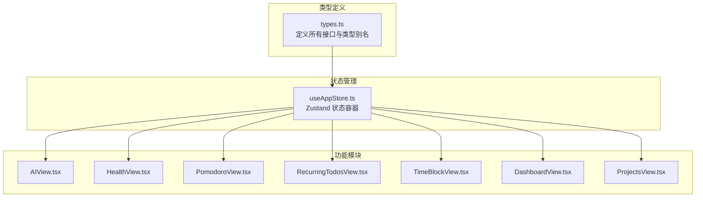
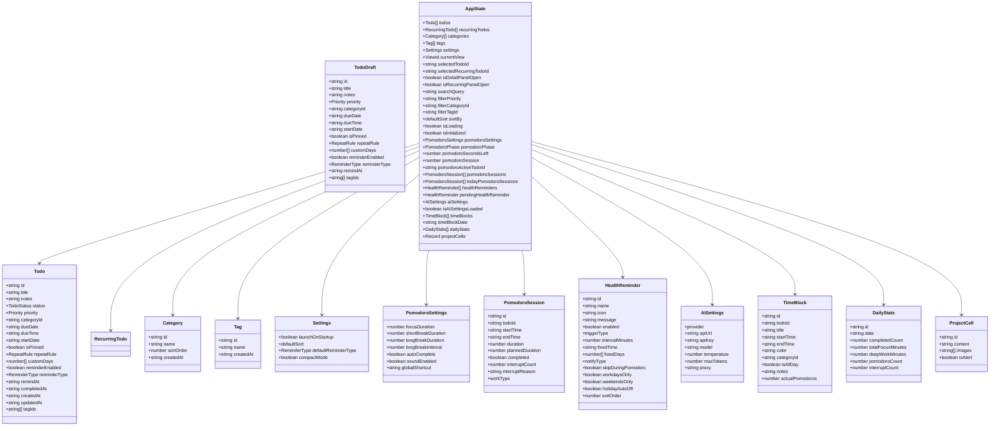
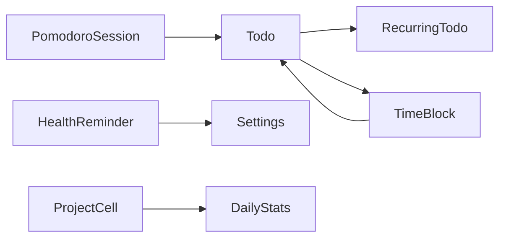

# 类型定义

<cite>
**本文档引用的文件**
- [types.ts](file://app/src/types.ts)
- [useAppStore.ts](file://app/src/store/useAppStore.ts)
- [AIView.tsx](file://app/src/components/AI/AIView.tsx)
- [HealthView.tsx](file://app/src/components/Health/HealthView.tsx)
- [PomodoroView.tsx](file://app/src/components/Pomodoro/PomodoroView.tsx)
- [ProjectsView.tsx](file://app/src/components/Projects/ProjectsView.tsx)
- [RecurringTodosView.tsx](file://app/src/components/RecurringTodos/RecurringTodosView.tsx)
- [TimeBlockView.tsx](file://app/src/components/TimeBlock/TimeBlockView.tsx)
- [DashboardView.tsx](file://app/src/components/Dashboard/DashboardView.tsx)
</cite>

## 目录
1. [简介](#简介)
2. [项目结构](#项目结构)
3. [核心组件](#核心组件)
4. [架构总览](#架构总览)
5. [详细组件分析](#详细组件分析)
6. [依赖分析](#依赖分析)
7. [性能考虑](#性能考虑)
8. [故障排除指南](#故障排除指南)
9. [结论](#结论)
10. [附录](#附录)

## 简介
本文件为 SnowTodo 的 TypeScript 类型定义参考文档，覆盖 Todo、Pomodoro、HealthReminder、AI 设置、时间块、项目格子、分类与标签、设置与统计等模块的类型体系。文档按功能模块组织，逐项说明接口、类型别名、枚举与常量的字段含义、数据类型约束与业务规则，并提供类型使用示例与最佳实践，帮助开发者理解类型系统并正确扩展与定制。

## 项目结构
类型定义集中于应用前端的类型文件中，配合状态管理与各功能模块组件共同构成完整的类型体系：
- 类型定义文件：app/src/types.ts
- 状态管理：app/src/store/useAppStore.ts
- 功能模块组件：AI、健康提醒、番茄钟、项目、每日待办、时间块、仪表盘等

**图表来源**
- [types.ts:1-278](file://app/src/types.ts#L1-L278)
- [useAppStore.ts:1-604](file://app/src/store/useAppStore.ts#L1-L604)

**章节来源**
- [types.ts:1-278](file://app/src/types.ts#L1-L278)
- [useAppStore.ts:1-604](file://app/src/store/useAppStore.ts#L1-L604)

## 核心组件
本节概述主要类型模块及其职责边界，便于快速定位与查阅。

- Todo 类型族：标准任务实体、草稿、重复任务模板、图像附件等
- Pomodoro 类型族：番茄钟会话、设置与阶段
- HealthReminder 类型族：健康提醒、历史记录与默认配置
- AI 设置类型：智能助手配置与聊天消息
- 时间块类型：日程时间块与草稿
- 项目格子类型：项目月视图与日视图的数据单元
- 统计与配置：每日统计、分类、标签、应用设置
- 视图标识：当前界面导航标识

**章节来源**
- [types.ts:168-278](file://app/src/types.ts#L168-L278)

## 架构总览
类型系统通过统一的类型定义文件集中管理，状态容器与各功能模块通过类型进行强约束交互。下图展示类型与状态容器的关系以及典型调用链路。

**图表来源**
- [types.ts:168-278](file://app/src/types.ts#L168-L278)
- [useAppStore.ts:30-80](file://app/src/store/useAppStore.ts#L30-L80)

**章节来源**
- [types.ts:168-278](file://app/src/types.ts#L168-L278)
- [useAppStore.ts:30-80](file://app/src/store/useAppStore.ts#L30-L80)

## 详细组件分析

### Todo 类型族
- Todo：标准任务实体，包含状态、优先级、重复规则、提醒设置、标签与时间戳等字段
- TodoDraft：创建/更新任务时使用的草稿对象，部分字段可选
- RecurringTodo：长期每日待办模板，支持多种重复模式与提醒配置
- RecurringTodoDraft：模板草稿
- TodoImage：任务图片附件（base64 编码）

字段约束与业务规则
- 状态：仅允许特定枚举值，支持归档
- 优先级：低/中/高
- 重复规则：无/日常/工作日/每周/每月/自定义
- 提醒类型：无/系统/弹窗/两者
- 日期字段：遵循 ISO 字符串格式或时间字符串格式
- 标签与分类：通过 ID 关联，草稿对象允许空值

使用示例与最佳实践
- 使用 TodoDraft 在表单提交前构建对象，避免遗漏必填字段
- 对 dueDate 与 startDate 进行有效性校验，确保逻辑一致性
- 重复任务模板应与实际生成任务解耦，模板仅描述规则

**章节来源**
- [types.ts:168-206](file://app/src/types.ts#L168-L206)
- [types.ts:224-258](file://app/src/types.ts#L224-L258)
- [types.ts:263-267](file://app/src/types.ts#L263-L267)

### Pomodoro 类型族
- PomodoroSession：一次番茄钟会话，记录开始/结束时间、专注时长、中断次数与原因、工作类型等
- PomodoroSettings：番茄钟全局设置，包含专注/短休/长休时长、长休周期、自动完成、声音提醒与全局快捷键
- 默认设置：提供合理的默认值，便于快速启用

字段约束与业务规则
- 时长字段以分钟为单位，且为正整数
- 阶段枚举：空闲/专注/短休/长休
- 自动完成：连续完成 N 个番茄后自动标记完成
- 全局快捷键：字符串格式，建议使用组合键

使用示例与最佳实践
- 在切换阶段时同步更新剩余秒数与当前活跃任务
- 中断计数与原因应与 UI 交互一致，便于统计分析
- 长休周期与声音提醒影响用户体验，需谨慎调整

**章节来源**
- [types.ts:27-58](file://app/src/types.ts#L27-L58)

### HealthReminder 类型族
- HealthReminder：健康提醒实体，支持间隔提醒与固定时间提醒，可配置通知类型、跳过番茄钟、工作日/周末限制、节假日自动关闭等
- ReminderHistoryEntry：提醒触发历史记录
- 默认健康提醒：内置多条常用提醒模板，便于初始化

字段约束与业务规则
- 触发类型：间隔/固定
- 固定时间：HH:mm 格式
- 固定日期：数组表示周几（0=周日, 1=周一, ...）
- 通知类型：系统通知/弹窗/两者
- 跳过番茄钟：专注期间跳过提醒
- 工作日/周末/节假日：布尔开关控制触发范围

使用示例与最佳实践
- 间隔提醒适合定时提醒喝水、活动等；固定时间适合上下班提醒
- 通过排序字段控制显示顺序
- 建议为每个提醒提供合适的图标与提示语

**章节来源**
- [types.ts:63-98](file://app/src/types.ts#L63-L98)

### AI 设置类型
- AISettings：AI 智能助手配置，支持多家供应商与自定义接口
- AIChatMessage：聊天消息，包含角色、内容与时间戳

字段约束与业务规则
- 供应商：OpenAI/Claude/通义/文心/自定义
- 温度：0~2 浮点数
- 最大令牌数：根据模型能力合理设置
- 代理：可选，支持 http/https

使用示例与最佳实践
- 在发送请求前检查 API Key 是否存在
- 控制温度与最大令牌数以平衡效果与成本
- 聊天消息应包含系统提示与上下文历史

**章节来源**
- [types.ts:119-133](file://app/src/types.ts#L119-L133)

### 时间块类型
- TimeBlock：日程时间块，支持全天、颜色、备注、关联任务与实际番茄数统计

字段约束与业务规则
- 时间：支持 ISO 时间字符串或 HH:mm 格式
- 颜色：十六进制颜色值
- 全天：布尔标志
- 实际番茄数：用于统计与可视化

使用示例与最佳实践
- 时间块高度与顶部位置基于时间换算计算
- 关联任务时应过滤未完成任务
- 颜色选择器提供常用配色，便于区分不同类别

**章节来源**
- [types.ts:103-114](file://app/src/types.ts#L103-L114)

### 项目格子类型
- ProjectCell：项目格子，支持内容、图片数组与告警标志

字段约束与业务规则
- 内容：文本
- 图片：base64 字符串数组
- 告警：布尔标志，用于突出显示

使用示例与最佳实践
- 月视图批量加载，日视图按需加载
- 支持拖拽上传图片并转换为 base64
- 告警状态可在月视图直接切换

**章节来源**
- [types.ts:272-277](file://app/src/types.ts#L272-L277)

### 统计与配置类型
- DailyStats：每日统计数据，包含完成数量、专注分钟数、深度工作分钟数、番茄数与中断次数
- Category/Tag：分类与标签，包含排序与创建时间
- Settings：应用设置，包含启动项、默认排序、默认提醒类型与紧凑模式

字段约束与业务规则
- 日期：YYYY-MM-DD
- 排序：数字越大越靠后
- 默认排序：按到期时间/创建时间/优先级

使用示例与最佳实践
- 仪表盘按近 7/14/30 天填充缺失日期，保证图表连续性
- 分类与标签用于任务筛选与聚合统计

**章节来源**
- [types.ts:138-166](file://app/src/types.ts#L138-L166)

### 视图标识类型
- ViewId：当前界面导航标识，涵盖今日、全部、即将到来、完成、分类、标签、提醒、设置、重复、番茄钟、仪表盘、健康、时间块、AI、项目等

使用示例与最佳实践
- 导航切换时重置相关筛选条件
- 不同视图对应不同的数据加载策略

**章节来源**
- [types.ts:7-22](file://app/src/types.ts#L7-L22)

## 依赖分析
类型之间的依赖关系与耦合情况如下：
- Todo 与 RecurringTodo：模板与实例分离，模板描述规则，实例随日期生成
- PomodoroSession 与 Todo：会话可关联到具体任务，便于统计与分析
- HealthReminder 与 Settings：提醒行为受应用设置影响（如默认提醒类型）
- TimeBlock 与 Todo：时间块可关联任务，实现时间规划
- ProjectCell 与时间维度：按日期存储，支持月/日视图
- DailyStats 与 PomodoroSession：统计来源于会话数据

**图表来源**
- [types.ts:168-278](file://app/src/types.ts#L168-L278)

**章节来源**
- [types.ts:168-278](file://app/src/types.ts#L168-L278)

## 性能考虑
- 批量加载：月视图项目格子采用批量加载策略，减少网络请求
- 图片处理：图片转 base64，注意内存占用与传输体积
- 统计填充：按日期区间填充缺失数据，避免图表断裂
- 番茄钟计时：使用秒级递减，避免频繁重渲染
- 提醒过滤：按启用状态与触发时间快速筛选待提醒任务

[本节为通用性能建议，无需特定文件引用]

## 故障排除指南
常见问题与排查要点
- 提醒未触发：检查提醒启用状态、触发类型与时间设置；确认是否处于跳过番茄钟或节假日自动关闭状态
- 番茄钟计时不准确：核对设置中的专注/短休/长休时长；检查阶段切换逻辑
- 时间块重叠：检查开始/结束时间与全天标志；确保时间换算正确
- 项目格子图片异常：确认 base64 编码有效；检查文件大小与 MIME 类型
- 仪表盘数据缺失：确认日期区间与填充逻辑；检查后端返回数据

**章节来源**
- [HealthView.tsx:1-200](file://app/src/components/Health/HealthView.tsx#L1-L200)
- [PomodoroView.tsx:1-200](file://app/src/components/Pomodoro/PomodoroView.tsx#L1-L200)
- [TimeBlockView.tsx:1-200](file://app/src/components/TimeBlock/TimeBlockView.tsx#L1-L200)
- [ProjectsView.tsx:1-200](file://app/src/components/Projects/ProjectsView.tsx#L1-L200)
- [DashboardView.tsx:1-200](file://app/src/components/Dashboard/DashboardView.tsx#L1-L200)

## 结论
SnowTodo 的类型系统围绕任务生命周期与效率工具链展开，通过清晰的接口与严格的字段约束，确保数据一致性与业务逻辑正确性。建议在扩展新功能时遵循现有类型设计原则，保持模块间低耦合与高内聚，以便于维护与演进。

[本节为总结性内容，无需特定文件引用]

## 附录

### 类型使用示例与最佳实践
- Todo 创建流程
  - 使用 TodoDraft 构建对象，设置标题、优先级、提醒等
  - 调用保存接口，等待返回 Todo 完整对象
  - 更新状态容器中的 todos 数组
- Pomodoro 会话管理
  - 切换阶段时同步更新剩余秒数与当前活跃任务
  - 记录中断原因与次数，便于后续统计
- 健康提醒配置
  - 初始化时加载默认提醒集合
  - 用户可按需启用/禁用与修改提醒参数
- AI 设置
  - 在发送请求前检查 API Key 与模型参数
  - 控制温度与最大令牌数，平衡效果与成本
- 时间块与项目格子
  - 时间块支持全天与颜色配置，便于日程可视化
  - 项目格子支持图片与告警，满足多样化记录需求
- 仪表盘统计
  - 按日期区间加载数据并填充缺失日期
  - 使用环形图与柱状图直观展示完成率与专注时长

**章节来源**
- [AIView.tsx:125-200](file://app/src/components/AI/AIView.tsx#L125-L200)
- [HealthView.tsx:1-200](file://app/src/components/Health/HealthView.tsx#L1-L200)
- [PomodoroView.tsx:160-200](file://app/src/components/Pomodoro/PomodoroView.tsx#L160-L200)
- [TimeBlockView.tsx:1-200](file://app/src/components/TimeBlock/TimeBlockView.tsx#L1-L200)
- [ProjectsView.tsx:1-200](file://app/src/components/Projects/ProjectsView.tsx#L1-L200)
- [DashboardView.tsx:125-200](file://app/src/components/Dashboard/DashboardView.tsx#L125-L200)