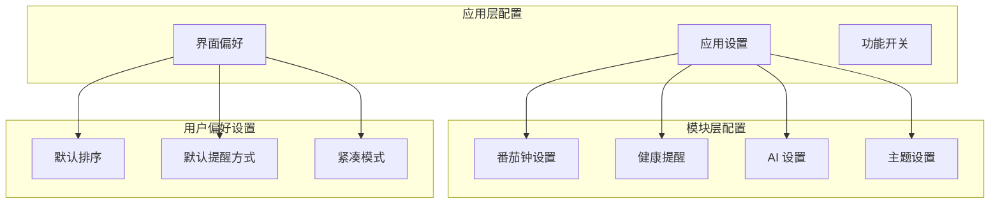
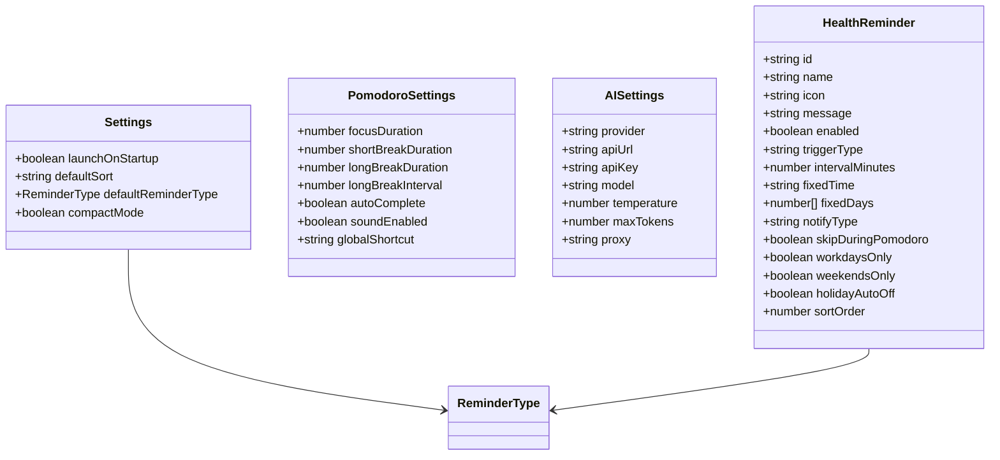
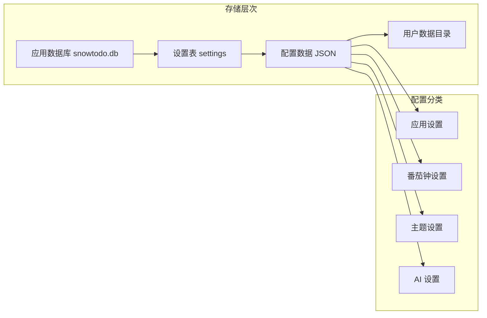
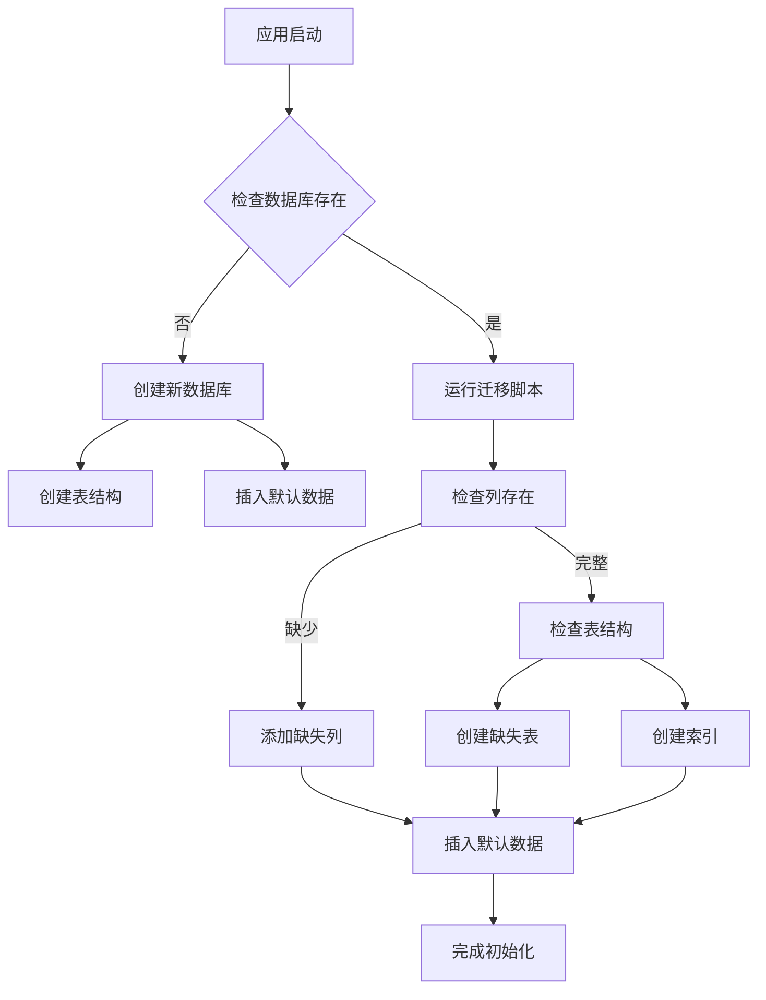
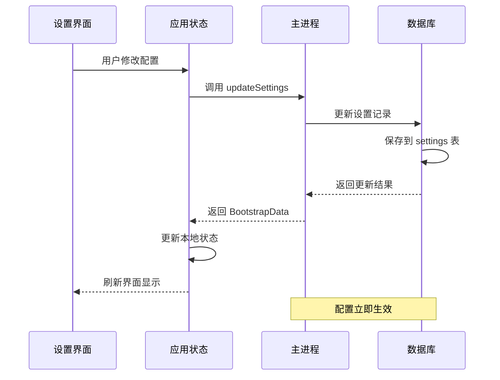
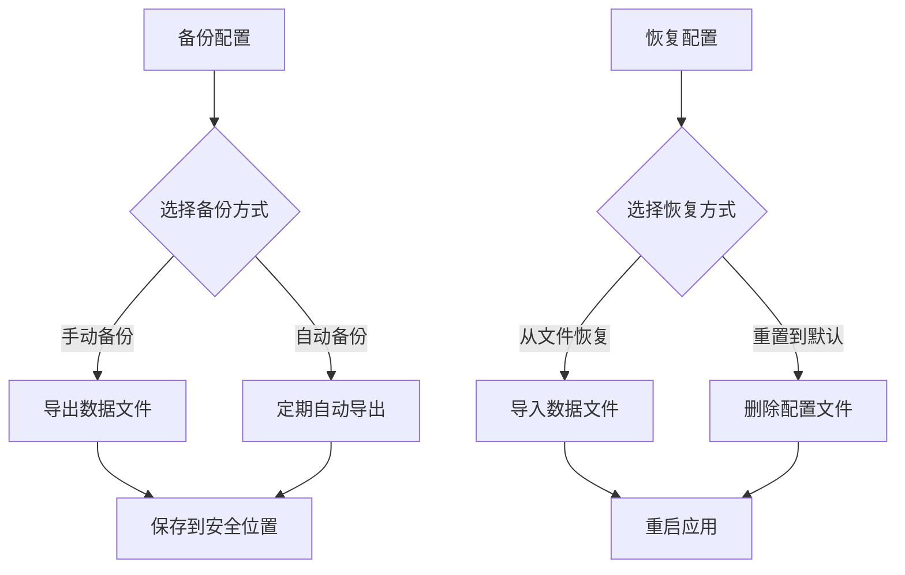

# 配置选项

<cite>
**本文档引用的文件**
- [package.json](file://app/package.json)
- [types.ts](file://app/src/types.ts)
- [useAppStore.ts](file://app/src/store/useAppStore.ts)
- [SettingsPage.tsx](file://app/src/components/Settings/SettingsPage.tsx)
- [db.ts](file://app/electron/db.ts)
- [main.ts](file://app/electron/main.ts)
</cite>

## 目录
1. [简介](#简介)
2. [项目结构](#项目结构)
3. [核心配置类型](#核心配置类型)
4. [应用配置](#应用配置)
5. [模块配置](#模块配置)
6. [用户偏好设置](#用户偏好设置)
7. [配置存储与迁移](#配置存储与迁移)
8. [配置修改与生效机制](#配置修改与生效机制)
9. [配置优化建议](#配置优化建议)
10. [故障排除指南](#故障排除指南)
11. [结论](#结论)

## 简介

SnowTodo 是一个基于 Electron + React + SQLite 的本地待办应用。本文档详细记录了应用的所有配置选项，包括应用启动配置、界面显示配置、功能开关配置以及各模块的专业配置。内容涵盖配置项的作用、默认值、取值范围、影响范围、修改方法、生效机制、存储位置、备份恢复方法、配置迁移和版本兼容性信息。

## 项目结构

SnowTodo 的配置体系由三层组成：
- 应用层配置：通过设置页面进行配置，存储在应用数据库中
- 模块层配置：各功能模块的独立配置，如番茄钟、健康提醒、AI 设置等
- 用户偏好设置：用户界面偏好和行为设置

**图表来源**
- [types.ts:161-166](file://app/src/types.ts#L161-L166)
- [db.ts:28-53](file://app/electron/db.ts#L28-L53)

## 核心配置类型

应用的核心配置类型定义如下：

**图表来源**
- [types.ts:161-127](file://app/src/types.ts#L161-L127)

**章节来源**
- [types.ts:161-127](file://app/src/types.ts#L161-L127)

## 应用配置

### 应用启动配置

| 配置项 | 类型 | 默认值 | 作用描述 | 影响范围 |
|--------|------|--------|----------|----------|
| launchOnStartup | boolean | false | 登录 Windows 时自动启动应用 | 系统启动项、应用生命周期 |
| defaultSort | string | 'dueSoon' | 新建待办时的默认排序方式 | 待办列表显示、排序逻辑 |
| defaultReminderType | ReminderType | 'system' | 新建待办时的默认提醒方式 | 提醒系统、通知渠道 |
| compactMode | boolean | false | 紧凑模式开关 | 界面布局、元素间距 |

### ReminderType 枚举值

- 'none': 不提醒
- 'system': 系统通知
- 'popup': 弹窗提醒
- 'both': 系统+弹窗

**章节来源**
- [types.ts:161-166](file://app/src/types.ts#L161-L166)
- [db.ts:28-33](file://app/electron/db.ts#L28-L33)
- [useAppStore.ts:187-192](file://app/src/store/useAppStore.ts#L187-L192)

## 模块配置

### 番茄钟设置 (PomodoroSettings)

| 配置项 | 类型 | 默认值 | 最小值 | 最大值 | 作用描述 | 影响范围 |
|--------|------|--------|--------|--------|----------|----------|
| focusDuration | number | 25 | 1 | 120 | 专注时长（分钟） | 番茄钟计时器、专注模式 |
| shortBreakDuration | number | 5 | 1 | 30 | 短休息时长（分钟） | 短休息计时器 |
| longBreakDuration | number | 15 | 1 | 60 | 长休息时长（分钟） | 长休息计时器 |
| longBreakInterval | number | 4 | 1 | 20 | 长休息周期（几个番茄后） | 番茄钟阶段切换 |
| autoComplete | boolean | false | - | - | 连续完成N个番茄后自动标记完成 | 番茄钟自动化 |
| soundEnabled | boolean | true | - | - | 声音提醒开关 | 番茄钟音频反馈 |
| globalShortcut | string | 'Ctrl+Shift+P' | - | - | 全局快捷键 | 系统快捷键绑定 |

**章节来源**
- [types.ts:40-58](file://app/src/types.ts#L40-L58)
- [db.ts:35-43](file://app/electron/db.ts#L35-L43)
- [useAppStore.ts:208-214](file://app/src/store/useAppStore.ts#L208-L214)

### 健康提醒设置 (HealthReminder)

| 配置项 | 类型 | 默认值 | 作用描述 | 影响范围 |
|--------|------|--------|----------|----------|
| name | string | - | 提醒名称 | 提醒显示、用户识别 |
| icon | string | - | 提醒图标 | 提醒界面图标 |
| message | string | - | 提醒消息内容 | 提醒通知内容 |
| enabled | boolean | false | 启用状态 | 提醒触发判断 |
| triggerType | string | 'interval' | 触发类型：interval/fixed | 触发策略选择 |
| intervalMinutes | number | null | 间隔分钟数 | 间隔触发频率 |
| fixedTime | string | null | 固定时间（HH:mm） | 固定时间触发 |
| fixedDays | number[] | [] | 固定触发的星期（0=周日） | 周期性触发控制 |
| notifyType | string | 'notification' | 通知类型：notification/popup/both | 通知渠道选择 |
| skipDuringPomodoro | boolean | false | 番茄钟期间跳过 | 番茄钟冲突处理 |
| workdaysOnly | boolean | false | 工作日专用 | 工作日提醒控制 |
| weekendsOnly | boolean | false | 周末专用 | 周末提醒控制 |
| holidayAutoOff | boolean | false | 节假日自动关闭 | 节假日提醒控制 |
| sortOrder | number | 0 | 排序权重 | 提醒显示顺序 |

**章节来源**
- [types.ts:63-98](file://app/src/types.ts#L63-L98)
- [db.ts:120-136](file://app/electron/db.ts#L120-L136)

### AI 设置 (AISettings)

| 配置项 | 类型 | 默认值 | 作用描述 | 影响范围 |
|--------|------|--------|----------|----------|
| provider | string | 'openai' | AI 服务提供商 | AI 功能集成 |
| apiUrl | string | OpenAI API 地址 | API 服务地址 | 网络请求目标 |
| apiKey | string | 空字符串 | API 访问密钥 | 认证授权 |
| model | string | 'gpt-4o-mini' | AI 模型选择 | 模型调用 |
| temperature | number | 0.7 | 生成随机性 | 输出多样性 |
| maxTokens | number | 4000 | 最大输出长度 | 生成内容长度 |
| proxy | string | null | 代理服务器地址 | 网络访问代理 |

**章节来源**
- [types.ts:119-127](file://app/src/types.ts#L119-L127)
- [db.ts:45-53](file://app/electron/db.ts#L45-L53)

## 用户偏好设置

### 界面显示偏好

| 配置项 | 类型 | 默认值 | 作用描述 | 影响范围 |
|--------|------|--------|----------|----------|
| compactMode | boolean | false | 紧凑模式开关 | 界面布局密度、元素尺寸 |

### 数据管理偏好

| 配置项 | 类型 | 默认值 | 作用描述 | 影响范围 |
|--------|------|--------|----------|----------|
| currentThemeId | string | 'theme-warmwhite' | 当前主题标识 | 主题应用、界面样式 |

**章节来源**
- [types.ts:161-166](file://app/src/types.ts#L161-L166)
- [db.ts:1723-1739](file://app/electron/db.ts#L1723-L1739)

## 配置存储与迁移

### 存储位置

应用配置采用多层存储架构：

**图表来源**
- [db.ts:26](file://app/electron/db.ts#L26)
- [db.ts:353-356](file://app/electron/db.ts#L353-L356)

### 初始化默认值

应用启动时会自动初始化以下默认配置：

| 配置类别 | 默认值来源 | 初始化时机 |
|----------|------------|------------|
| 应用设置 | DEFAULT_SETTINGS | 首次启动或数据库不存在 |
| 番茄钟设置 | DEFAULT_POMODORO_SETTINGS | settings 表中缺失时 |
| 主题设置 | 'theme-warmwhite' | settings 表中缺失时 |
| 健康提醒 | DEFAULT_HEALTH_REMINDERS | health_reminders 表为空时 |
| AI 设置 | DEFAULT_AI_SETTINGS | ai_settings 表为空时 |

### 数据库迁移

应用支持以下数据库迁移：

**图表来源**
- [db.ts:92-297](file://app/electron/db.ts#L92-L297)

**章节来源**
- [db.ts:507-543](file://app/electron/db.ts#L507-L543)
- [db.ts:92-297](file://app/electron/db.ts#L92-L297)

## 配置修改与生效机制

### 修改流程

**图表来源**
- [SettingsPage.tsx:8-28](file://app/src/components/Settings/SettingsPage.tsx#L8-L28)
- [useAppStore.ts:303-305](file://app/src/store/useAppStore.ts#L303-L305)
- [main.ts:235-239](file://app/electron/main.ts#L235-L239)

### 特殊配置生效机制

| 配置项 | 生效机制 | 特殊处理 |
|--------|----------|----------|
| launchOnStartup | 系统级设置 | 通过 app.setLoginItemSettings 应用 |
| globalShortcut | 全局快捷键 | 需要重新注册快捷键 |
| 番茄钟设置 | 实时生效 | 需要重新注册全局快捷键 |

**章节来源**
- [main.ts:94-96](file://app/electron/main.ts#L94-L96)
- [main.ts:179-193](file://app/electron/main.ts#L179-L193)
- [db.ts:1712-1721](file://app/electron/db.ts#L1712-L1721)

## 配置优化建议

### 性能优化

1. **番茄钟设置优化**
   - focusDuration 建议 25-50 分钟
   - longBreakInterval 建议 3-6 个番茄
   - soundEnabled 在安静环境可关闭

2. **提醒系统优化**
   - defaultReminderType 优先使用 'system' 减少资源占用
   - 合理设置健康提醒间隔，避免过于频繁

3. **数据库性能**
   - 定期清理历史数据减少数据库体积
   - 使用索引优化查询性能

### 用户体验优化

1. **界面偏好**
   - compactMode 适合小屏幕设备
   - 合理的主题选择提升视觉舒适度

2. **AI 设置**
   - temperature 0.3-0.7 适合大多数场景
   - maxTokens 根据需求调整，避免过大影响性能

## 故障排除指南

### 常见问题及解决方案

| 问题类型 | 症状 | 可能原因 | 解决方案 |
|----------|------|----------|----------|
| 配置不生效 | 修改设置后无变化 | 状态未更新 | 刷新页面或重启应用 |
| 启动项无效 | 开机自启设置失败 | 权限问题 | 以管理员身份运行或检查系统设置 |
| 快捷键冲突 | 全局快捷键无法使用 | 系统快捷键冲突 | 更换快捷键组合 |
| 数据库损坏 | 应用启动异常 | 数据库文件损坏 | 使用备份恢复或重新安装 |

### 配置重置

如果遇到配置问题，可以通过以下方式重置：

1. **临时重置**：删除应用数据目录下的 snowtodo.db 文件
2. **永久重置**：卸载应用后重新安装
3. **部分重置**：在设置页面重置特定模块配置

### 备份与恢复

**图表来源**
- [SettingsPage.tsx:19-28](file://app/src/components/Settings/SettingsPage.tsx#L19-L28)
- [main.ts:195-225](file://app/electron/main.ts#L195-L225)

**章节来源**
- [SettingsPage.tsx:19-28](file://app/src/components/Settings/SettingsPage.tsx#L19-L28)
- [main.ts:195-225](file://app/electron/main.ts#L195-L225)

## 结论

SnowTodo 的配置系统设计合理，涵盖了应用启动、界面显示、功能开关和各模块专业配置。通过多层存储架构和完善的迁移机制，确保了配置的持久性和兼容性。用户可以根据个人需求灵活调整各项配置，同时应用提供了完整的备份恢复机制来保障数据安全。

建议用户在调整重要配置前先了解各项配置的影响范围，并在测试环境中验证后再正式使用。对于开发者而言，应关注配置的向后兼容性和错误处理机制，确保应用升级过程中的配置平滑过渡。