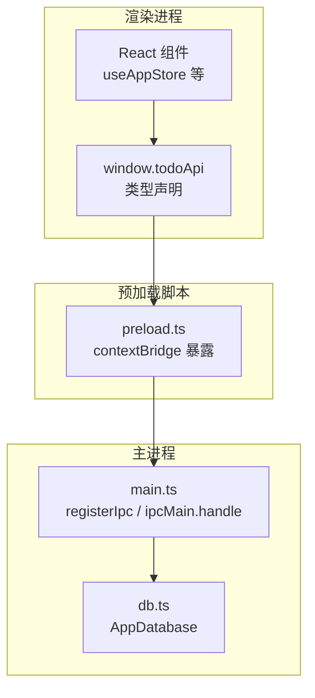
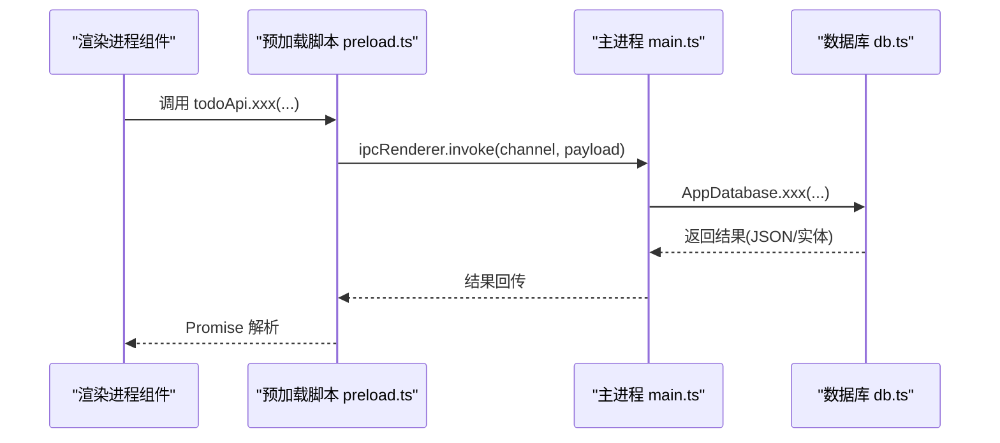
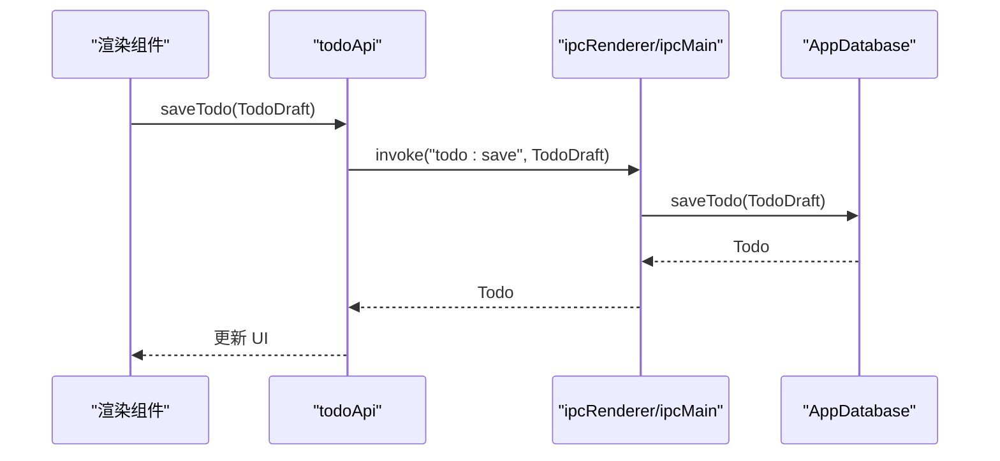
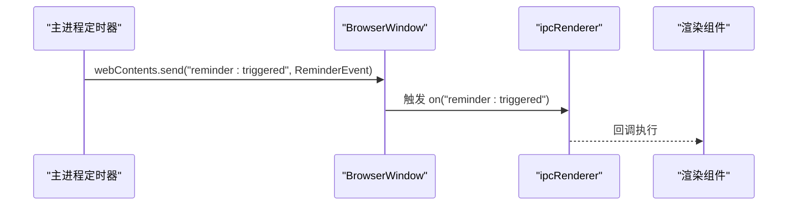
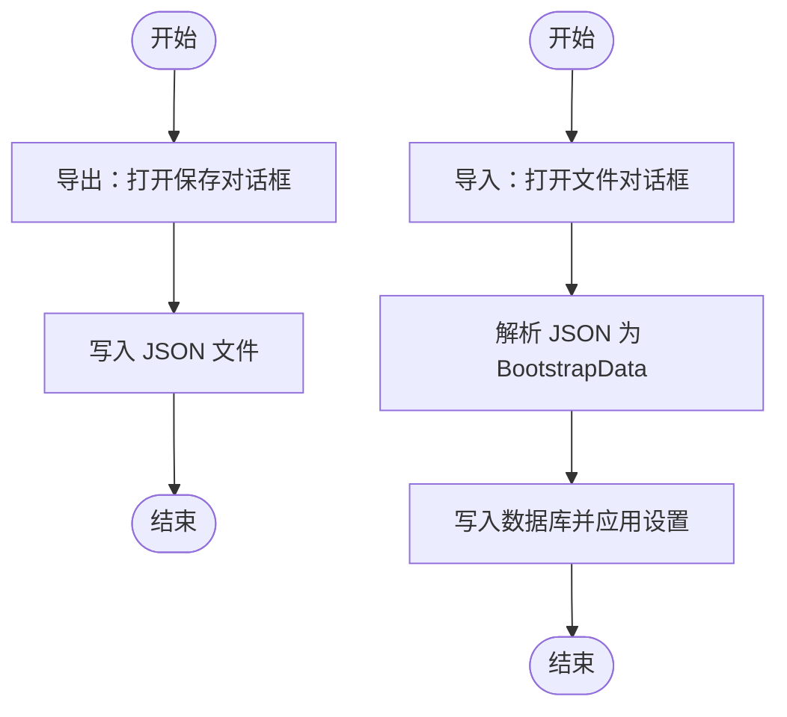
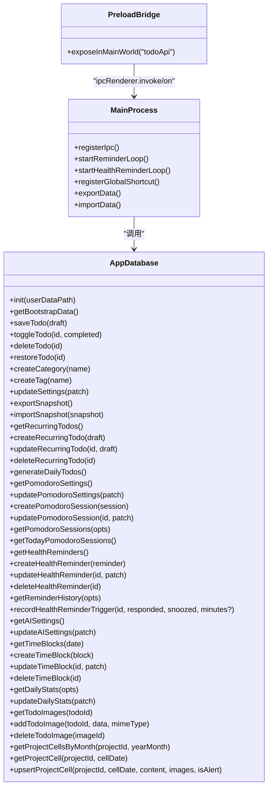

# IPC API 暴露机制

<cite>
**本文引用的文件**
- [main.ts](file://app/electron/main.ts)
- [preload.ts](file://app/electron/preload.ts)
- [db.ts](file://app/electron/db.ts)
- [types.ts](file://app/src/types.ts)
- [useAppStore.ts](file://app/src/store/useAppStore.ts)
- [DetailPanel.tsx](file://app/src/components/DetailPanel/DetailPanel.tsx)
- [SettingsPage.tsx](file://app/src/components/Settings/SettingsPage.tsx)
- [App.tsx](file://app/src/App.tsx)
- [vite-env.d.ts](file://app/src/vite-env.d.ts)
</cite>

## 目录
1. [简介](#简介)
2. [项目结构](#项目结构)
3. [核心组件](#核心组件)
4. [架构总览](#架构总览)
5. [详细组件分析](#详细组件分析)
6. [依赖关系分析](#依赖关系分析)
7. [性能考量](#性能考量)
8. [故障排查指南](#故障排查指南)
9. [结论](#结论)
10. [附录](#附录)

## 简介
本文档系统性解析 SnowTodo 的 IPC API 暴露机制，重点阐述渲染进程如何通过全局对象 todoApi 访问主进程能力，覆盖 CRUD 操作、设置管理、数据导入导出、事件监听、以及数据库层的数据持久化与序列化。文档还给出参数校验、错误处理、返回值标准化、扩展新接口与维护向后兼容性的方法，并提供 API 版本管理与废弃接口迁移策略及性能优化建议。

## 项目结构
SnowTodo 的 IPC 体系由三部分组成：
- 主进程（Electron 主线程）：负责数据库操作、定时任务、系统交互与 IPC 注册。
- 预加载脚本（Preload）：通过 contextBridge 将受控 API 暴露给渲染进程。
- 渲染进程（React 组件与状态管理）：以 todoApi 调用主进程，接收事件回调，更新 UI。

图表来源
- [main.ts:227-358](file://app/electron/main.ts#L227-L358)
- [preload.ts:18-116](file://app/electron/preload.ts#L18-L116)
- [db.ts:55-100](file://app/electron/db.ts#L55-L100)

章节来源
- [main.ts:18-52](file://app/electron/main.ts#L18-L52)
- [preload.ts:1-17](file://app/electron/preload.ts#L1-L17)
- [db.ts:55-100](file://app/electron/db.ts#L55-L100)

## 核心组件
- todoApi（渲染进程侧）：由预加载脚本暴露，封装所有 IPC 调用，统一请求-响应模式（invoke）与事件监听模式（on）。
- AppDatabase（主进程侧）：封装数据库初始化、迁移、查询与写入，负责数据序列化（JSON）与二进制图片存储。
- 主进程注册中心：集中注册所有 ipcMain.handle 通道，实现模块化分组（Todo、设置、提醒、番茄钟、健康提醒、AI、时间块、统计、图片、项目单元格等）。

章节来源
- [preload.ts:18-116](file://app/electron/preload.ts#L18-L116)
- [db.ts:55-100](file://app/electron/db.ts#L55-L100)
- [main.ts:227-358](file://app/electron/main.ts#L227-L358)

## 架构总览
渲染进程通过 window.todoApi 发起调用；预加载脚本将调用转发至 ipcRenderer.invoke 或注册事件监听器；主进程在 ipcMain.handle 中执行数据库操作并返回结果；必要时通过 ipcRenderer.send 向渲染进程推送事件。

图表来源
- [preload.ts:18-116](file://app/electron/preload.ts#L18-L116)
- [main.ts:227-358](file://app/electron/main.ts#L227-L358)
- [db.ts:676-714](file://app/electron/db.ts#L676-L714)

## 详细组件分析

### 1) 请求-响应模式（invoke）与事件监听模式（on）
- 请求-响应（invoke）：用于同步调用，如保存待办、切换完成状态、创建分类/标签、更新设置、导出/导入数据、窗口动作、查询/增删改各类实体等。预加载脚本将每个 API 映射为 ipcRenderer.invoke 调用，主进程在 ipcMain.handle 中处理并返回结果。
- 事件监听（on）：用于异步事件推送，如提醒触发、健康提醒触发、番茄钟切换与激活状态变更。预加载脚本注册 ipcRenderer.on 监听器，并返回一个移除监听器的函数，便于组件卸载时清理。

章节来源
- [preload.ts:18-116](file://app/electron/preload.ts#L18-L116)
- [main.ts:98-118](file://app/electron/main.ts#L98-L118)
- [main.ts:141-159](file://app/electron/main.ts#L141-L159)

### 2) 数据模型与序列化
- 类型定义：渲染进程与预加载脚本共享类型定义，确保 IPC 传输的数据结构一致。
- 序列化机制：
  - JSON 字符串：设置、默认配置、索引字段等以 JSON 字符串形式存储于 settings 表或内存结构中。
  - Base64 字符串：图片数据以 Base64 存储在数据库表中，避免文件系统耦合。
  - 时间戳字符串：ISO 8601 字符串表示时间字段，便于跨平台一致性。
  - 数组与枚举：自定义重复天数、标签 ID 列表、提醒类型等以数组或枚举字符串存储。

章节来源
- [types.ts:1-278](file://app/src/types.ts#L1-L278)
- [db.ts:676-714](file://app/electron/db.ts#L676-L714)
- [db.ts:256-270](file://app/electron/db.ts#L256-L270)
- [db.ts:636-674](file://app/electron/db.ts#L636-L674)

### 3) Todo CRUD 与设置管理
- Todo CRUD：保存、切换完成、删除、恢复、批量生成每日待办。
- 设置管理：更新设置并即时应用（如开机自启），返回完整的引导数据（包含 todos、categories、tags、settings）。
- 数据导入导出：通过对话框选择文件路径，导出为 JSON 文件，导入时解析为 BootstrapData 并重建应用状态。

图表来源
- [preload.ts:23-26](file://app/electron/preload.ts#L23-L26)
- [main.ts:229-232](file://app/electron/main.ts#L229-L232)
- [db.ts:716-796](file://app/electron/db.ts#L716-L796)

章节来源
- [preload.ts:23-37](file://app/electron/preload.ts#L23-L37)
- [main.ts:229-239](file://app/electron/main.ts#L229-L239)
- [db.ts:716-796](file://app/electron/db.ts#L716-L796)

### 4) 事件监听与推送
- 提醒触发事件：主进程在定时循环中检查到期提醒并向渲染进程发送“reminder:triggered”事件。
- 健康提醒事件：主进程检查到期健康提醒并向渲染进程发送“health-reminder:triggered”事件。
- 番茄钟事件：主进程在全局快捷键触发时向渲染进程发送“pomodoro:toggle”，并在激活状态变化时发送“pomodoro:active-changed”。

图表来源
- [main.ts:120-139](file://app/electron/main.ts#L120-L139)
- [main.ts:141-177](file://app/electron/main.ts#L141-L177)
- [main.ts:179-193](file://app/electron/main.ts#L179-L193)
- [preload.ts:43-47](file://app/electron/preload.ts#L43-L47)
- [preload.ts:83-87](file://app/electron/preload.ts#L83-L87)
- [preload.ts:64-73](file://app/electron/preload.ts#L64-L73)

章节来源
- [main.ts:98-118](file://app/electron/main.ts#L98-L118)
- [main.ts:141-159](file://app/electron/main.ts#L141-L159)
- [preload.ts:43-47](file://app/electron/preload.ts#L43-L47)
- [preload.ts:83-87](file://app/electron/preload.ts#L83-L87)
- [preload.ts:64-73](file://app/electron/preload.ts#L64-L73)

### 5) 数据导入导出流程
- 导出：打开保存对话框，将数据库快照导出为 JSON 文件。
- 导入：打开文件对话框，读取 JSON 文件，解析为 BootstrapData，写入数据库并应用设置。

图表来源
- [main.ts:195-225](file://app/electron/main.ts#L195-L225)
- [db.ts:676-714](file://app/electron/db.ts#L676-L714)

章节来源
- [main.ts:195-225](file://app/electron/main.ts#L195-L225)

### 6) 图片与项目单元格接口
- 图片接口：支持查询、添加（Base64）、删除单张图片。
- 项目单元格接口：支持按月查询、按日期查询、插入/更新单元格内容与图片数组。

章节来源
- [preload.ts:104-107](file://app/electron/preload.ts#L104-L107)
- [preload.ts:110-115](file://app/electron/preload.ts#L110-L115)
- [main.ts:338-346](file://app/electron/main.ts#L338-L346)
- [main.ts:349-357](file://app/electron/main.ts#L349-L357)

### 7) 番茄钟、健康提醒、AI、时间块、统计等模块
- 番茄钟：查询/更新设置、创建/更新会话、查询今日会话、设置活跃状态并广播。
- 健康提醒：CRUD、历史查询、延迟与忽略操作、事件推送。
- AI 设置：查询/更新。
- 时间块：CRUD。
- 统计：按日期范围查询与更新。

章节来源
- [preload.ts:57-73](file://app/electron/preload.ts#L57-L73)
- [preload.ts:76-87](file://app/electron/preload.ts#L76-L87)
- [preload.ts:89-91](file://app/electron/preload.ts#L89-L91)
- [preload.ts:94-97](file://app/electron/preload.ts#L94-L97)
- [preload.ts:99-101](file://app/electron/preload.ts#L99-L101)
- [main.ts:268-292](file://app/electron/main.ts#L268-L292)
- [main.ts:294-311](file://app/electron/main.ts#L294-L311)
- [main.ts:313-317](file://app/electron/main.ts#L313-L317)
- [main.ts:319-327](file://app/electron/main.ts#L319-L327)
- [main.ts:329-335](file://app/electron/main.ts#L329-L335)

### 8) 参数验证、错误处理与返回值标准化
- 参数验证：
  - 预加载脚本对调用参数进行类型约束（如 TodoDraft、Settings Patch 等）。
  - 主进程 handle 函数接收参数并执行业务逻辑，数据库层对字段进行 JSON 解析与默认值处理。
- 错误处理：
  - 定时器循环内捕获异常并记录日志，避免崩溃影响主进程运行。
  - 导入/导出对话框取消或失败时直接返回，不抛出异常。
- 返回值标准化：
  - invoke 返回 Promise，成功时返回实体或 BootstrapData，失败时抛出异常。
  - 事件推送采用 ipcRenderer.send，携带结构化事件对象。

章节来源
- [preload.ts:18-116](file://app/electron/preload.ts#L18-L116)
- [main.ts:120-139](file://app/electron/main.ts#L120-L139)
- [main.ts:161-177](file://app/electron/main.ts#L161-L177)
- [main.ts:195-225](file://app/electron/main.ts#L195-L225)

### 9) 扩展新 IPC 接口与向后兼容
- 新增步骤：
  - 在主进程 registerIpc 中新增 ipcMain.handle('your:channel', handler)。
  - 在预加载脚本 exposeInMainWorld('todoApi') 中新增对应方法。
  - 在渲染组件中通过 window.todoApi 调用。
  - 如需事件推送，在主进程中使用 mainWindow.webContents.send('your:event', payload)。
- 向后兼容：
  - 保持现有通道名称不变，新增可选参数时提供默认值。
  - 对于废弃通道，先保留一段时间再移除，并在文档中标注迁移指引。
  - 使用版本号前缀（如 todo:v1:xxx）隔离不同版本接口，逐步迁移。

章节来源
- [main.ts:227-358](file://app/electron/main.ts#L227-L358)
- [preload.ts:18-116](file://app/electron/preload.ts#L18-L116)

### 10) API 版本管理与废弃接口迁移策略
- 版本管理：为重要接口增加版本前缀，如 todo:v1:save、todo:v2:save（含新字段）。
- 迁移策略：
  - 旧客户端仍可使用 v1 接口，新客户端优先使用 v2。
  - 在主进程同时支持多个版本，内部做映射与兼容转换。
  - 废弃接口在下个大版本移除，提前发布迁移指南与自动升级脚本。

章节来源
- [main.ts:227-358](file://app/electron/main.ts#L227-L358)
- [preload.ts:18-116](file://app/electron/preload.ts#L18-L116)

### 11) 自定义 API 接口开发指南
- 设计原则：
  - 以模块分组命名通道（如 module:action），便于维护与查找。
  - 参数尽量使用 DTO（如 TodoDraft、RecurringTodoDraft），避免裸对象。
  - 返回值统一为实体或聚合数据（如 BootstrapData），减少二次查询。
- 开发步骤：
  - 在 db.ts 中实现具体方法，确保事务与索引优化。
  - 在 main.ts 中注册 handle，必要时调用定时器或系统服务。
  - 在 preload.ts 中暴露方法，提供类型约束与默认值处理。
  - 在渲染组件中调用，注意事件监听的生命周期管理（返回的移除函数）。
- 性能优化：
  - 合理使用索引（已见 create index 语句），避免全表扫描。
  - 批量操作合并（如批量插入标签、图片）。
  - 事件去抖与节流（如定时器检查间隔）。

章节来源
- [db.ts:189-206](file://app/electron/db.ts#L189-L206)
- [db.ts:252-280](file://app/electron/db.ts#L252-L280)
- [main.ts:227-358](file://app/electron/main.ts#L227-L358)
- [preload.ts:18-116](file://app/electron/preload.ts#L18-L116)

## 依赖关系分析

图表来源
- [db.ts:55-100](file://app/electron/db.ts#L55-L100)
- [main.ts:227-358](file://app/electron/main.ts#L227-L358)
- [preload.ts:18-116](file://app/electron/preload.ts#L18-L116)

章节来源
- [db.ts:55-100](file://app/electron/db.ts#L55-L100)
- [main.ts:227-358](file://app/electron/main.ts#L227-L358)
- [preload.ts:18-116](file://app/electron/preload.ts#L18-L116)

## 性能考量
- 数据库索引：已创建多处索引（如 pomodoro_sessions、time_blocks、daily_stats、health_reminders 等），建议在高频查询字段上继续评估索引覆盖。
- 查询优化：批量插入/更新时合并 SQL，减少往返次数。
- 事件频率：定时器检查间隔（如 30 秒、60 秒）已合理设置，避免过度轮询。
- 图片处理：Base64 存储便于跨平台，但体积较大，建议在 UI 层做懒加载与尺寸控制。
- 内存占用：避免一次性加载过多数据，采用分页或按需加载策略。

## 故障排查指南
- 无法连接数据库：检查 userData 路径与 sql-wasm 资源定位是否正确。
- 导入失败：确认 JSON 格式与 BootstrapData 结构一致，检查导入对话框取消分支。
- 事件未触发：确认主进程定时器是否启动，渲染进程是否正确注册 on 监听并返回移除函数。
- 设置未生效：确认主进程在更新设置后调用 applyLaunchOnStartup 并返回完整 BootstrapData。

章节来源
- [main.ts:60-90](file://app/electron/main.ts#L60-L90)
- [main.ts:195-225](file://app/electron/main.ts#L195-L225)
- [main.ts:98-118](file://app/electron/main.ts#L98-L118)
- [main.ts:235-239](file://app/electron/main.ts#L235-L239)

## 结论
SnowTodo 的 IPC 体系以 todoApi 为核心，采用统一的请求-响应与事件推送模式，结合预加载脚本的安全桥接与主进程的模块化注册，实现了稳定、可扩展的渲染进程与主进程通信。通过类型约束、序列化规范与数据库索引优化，系统在功能完整性与性能之间取得了良好平衡。建议在后续版本中引入版本化接口与更完善的错误上报机制，进一步提升可维护性与可观测性。

## 附录
- 实际使用示例：
  - 应用启动时加载引导数据：[App.tsx:24-34](file://app/src/App.tsx#L24-L34)
  - 保存待办并处理图片：[DetailPanel.tsx:166-185](file://app/src/components/DetailPanel/DetailPanel.tsx#L166-L185)
  - 更新设置并刷新 UI：[SettingsPage.tsx:8-17](file://app/src/components/Settings/SettingsPage.tsx#L8-L17)
  - 番茄钟设置加载：[useAppStore.ts:394-397](file://app/src/store/useAppStore.ts#L394-L397)
  - 健康提醒列表加载：[useAppStore.ts:425-428](file://app/src/store/useAppStore.ts#L425-L428)
  - 项目单元格读写：[useAppStore.ts:474-507](file://app/src/store/useAppStore.ts#L474-L507)