# IPC 通信

<cite>
**本文档引用的文件**
- [main.ts](file://app/electron/main.ts)
- [preload.ts](file://app/electron/preload.ts)
- [db.ts](file://app/electron/db.ts)
- [types.ts](file://app/src/types.ts)
- [App.tsx](file://app/src/App.tsx)
- [TodoList.tsx](file://app/src/components/Content/TodoList.tsx)
- [PomodoroView.tsx](file://app/src/components/Pomodoro/PomodoroView.tsx)
</cite>

## 目录
1. [简介](#简介)
2. [项目结构](#项目结构)
3. [核心组件](#核心组件)
4. [架构概览](#架构概览)
5. [详细组件分析](#详细组件分析)
6. [依赖关系分析](#依赖关系分析)
7. [性能考虑](#性能考虑)
8. [故障排除指南](#故障排除指南)
9. [结论](#结论)

## 简介

SnowTodo 是一个基于 Electron 的桌面应用程序，实现了完整的 IPC（进程间通信）机制来连接主进程和渲染进程。本文档深入解析了该应用的 IPC 通信架构，包括预加载脚本的设计原理、安全考虑、IPC API 的暴露机制、接口设计和类型安全实现。

该应用采用现代 Electron 开发模式，通过 contextBridge API 安全地向渲染进程暴露主进程功能，同时确保了严格的上下文隔离和安全边界。

## 项目结构

SnowTodo 的 IPC 架构围绕三个核心文件构建：

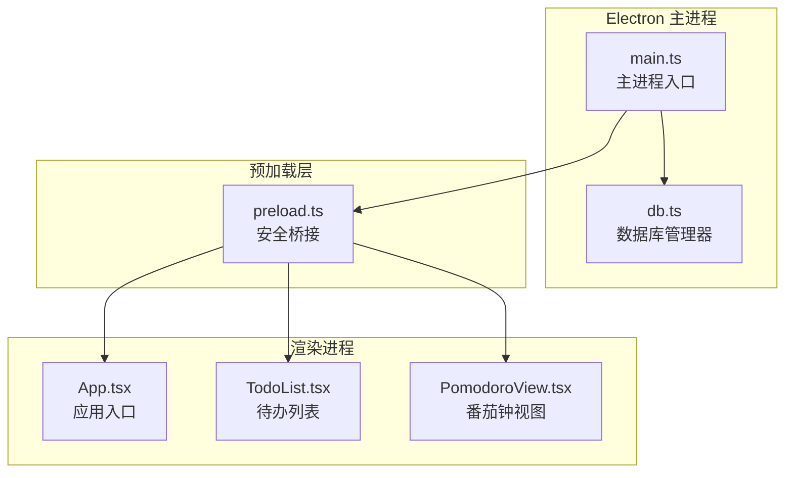

**图表来源**
- [main.ts:18-52](file://app/electron/main.ts#L18-L52)
- [preload.ts:18-116](file://app/electron/preload.ts#L18-L116)

**章节来源**
- [main.ts:1-391](file://app/electron/main.ts#L1-L391)
- [preload.ts:1-117](file://app/electron/preload.ts#L1-L117)

## 核心组件

### 预加载脚本（preload.ts）

预加载脚本是 IPC 通信的核心安全边界，它使用 Electron 的 contextBridge API 来安全地暴露主进程功能给渲染进程。

#### 安全设计原则

1. **上下文隔离**：预加载脚本运行在隔离的上下文中，无法直接访问 Node.js API
2. **最小暴露原则**：只暴露必要的 API 方法
3. **类型安全**：完整的 TypeScript 类型定义确保编译时检查
4. **事件监听管理**：提供事件监听器的清理机制

#### API 暴露机制

预加载脚本通过 `contextBridge.exposeInMainWorld` 将 `todoApi` 对象暴露给渲染进程：

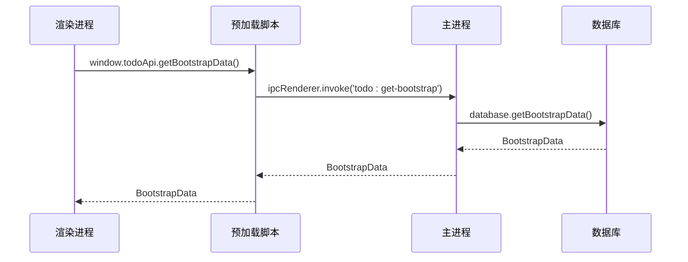

**图表来源**
- [preload.ts:20](file://app/electron/preload.ts#L20)
- [main.ts:228](file://app/electron/main.ts#L228)

**章节来源**
- [preload.ts:18-116](file://app/electron/preload.ts#L18-L116)

### 主进程（main.ts）

主进程负责：
- 窗口创建和生命周期管理
- IPC 事件处理器注册
- 数据库操作协调
- 系统集成功能

#### IPC 处理器注册

主进程使用 `ipcMain.handle` 注册各种 IPC 处理器：

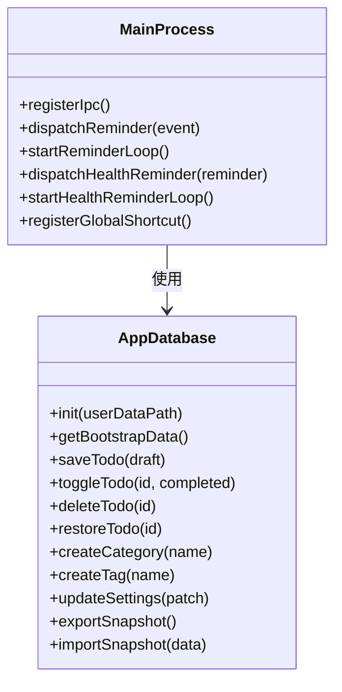

**图表来源**
- [main.ts:227-358](file://app/electron/main.ts#L227-L358)
- [db.ts:55-1825](file://app/electron/db.ts#L55-L1825)

**章节来源**
- [main.ts:227-358](file://app/electron/main.ts#L227-L358)

### 数据库层（db.ts）

数据库层提供了完整的 CRUD 操作和业务逻辑处理：

#### 数据库初始化

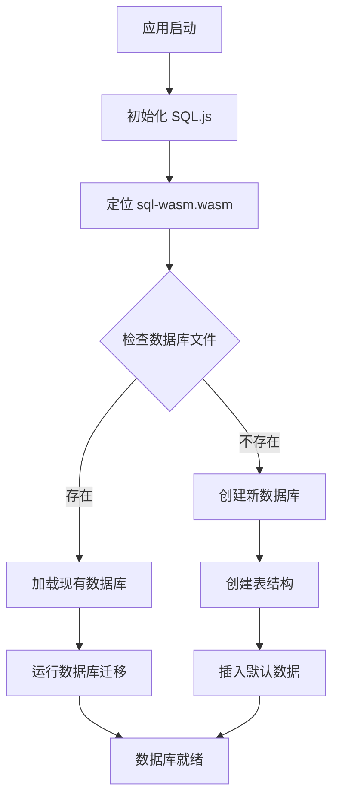

**图表来源**
- [db.ts:60-90](file://app/electron/db.ts#L60-L90)

**章节来源**
- [db.ts:55-297](file://app/electron/db.ts#L55-L297)

## 架构概览

SnowTodo 的 IPC 架构遵循以下设计模式：

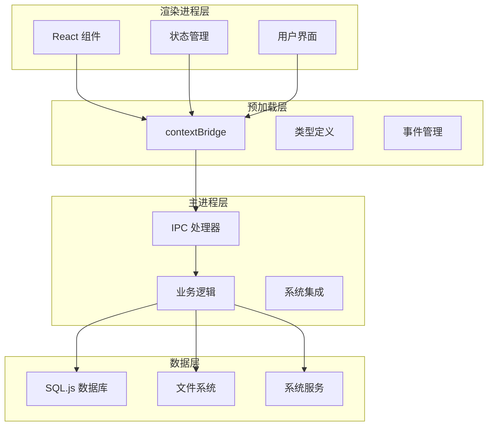

**图表来源**
- [preload.ts:1-117](file://app/electron/preload.ts#L1-L117)
- [main.ts:1-391](file://app/electron/main.ts#L1-L391)

## 详细组件分析

### IPC API 设计

#### 请求-响应模式

所有 IPC 调用都采用请求-响应模式，使用 `ipcRenderer.invoke` 和 `ipcMain.handle`：

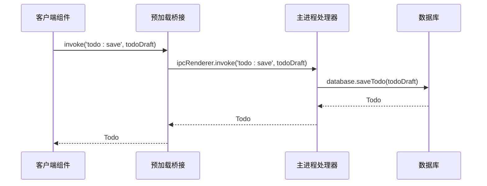

**图表来源**
- [preload.ts:23](file://app/electron/preload.ts#L23)
- [main.ts:229](file://app/electron/main.ts#L229)

#### 事件广播机制

对于实时事件，使用事件监听模式：

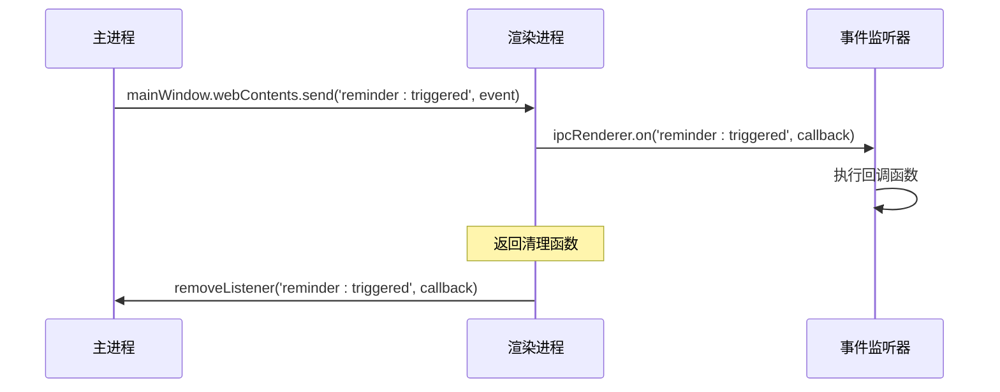

**图表来源**
- [main.ts:115](file://app/electron/main.ts#L115)
- [preload.ts:43-47](file://app/electron/preload.ts#L43-L47)

**章节来源**
- [preload.ts:43-87](file://app/electron/preload.ts#L43-L87)
- [main.ts:98-118](file://app/electron/main.ts#L98-L118)

### 类型安全实现

#### TypeScript 类型定义

应用使用完整的 TypeScript 类型系统确保 IPC 调用的类型安全：

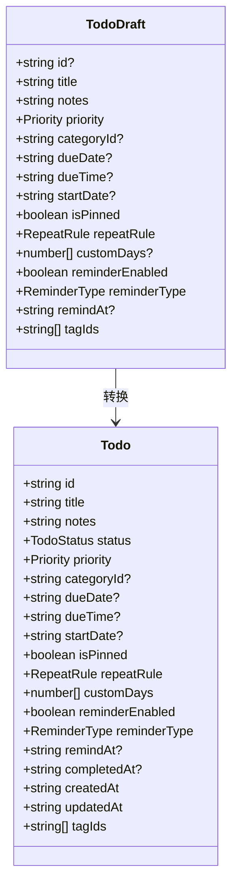

**图表来源**
- [types.ts:190-206](file://app/src/types.ts#L190-L206)
- [types.ts:168-188](file://app/src/types.ts#L168-L188)

**章节来源**
- [types.ts:1-278](file://app/src/types.ts#L1-L278)

### 错误处理策略

#### 异常处理机制

主进程中的 IPC 处理器包含完善的错误处理：

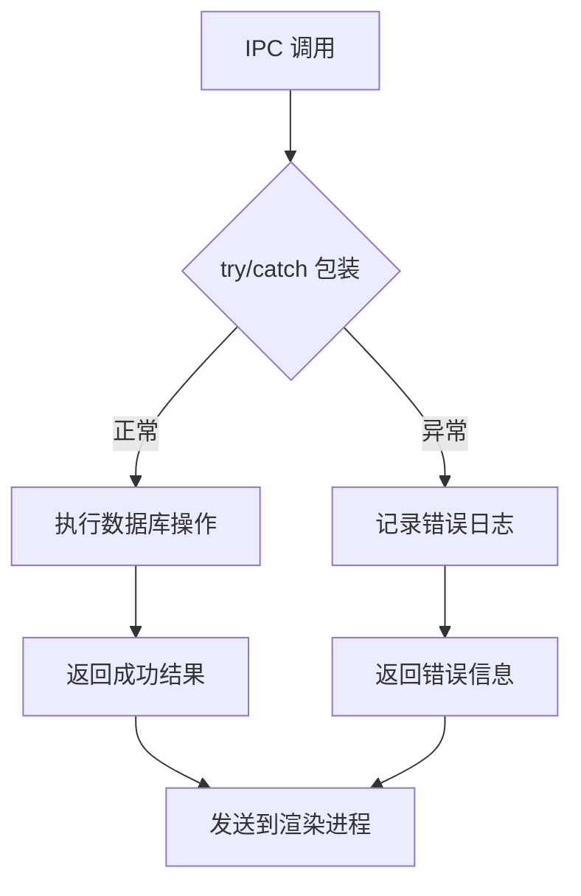

**图表来源**
- [main.ts:125-135](file://app/electron/main.ts#L125-L135)

#### 超时机制

虽然当前实现未显式实现超时机制，但可以通过以下方式扩展：

1. **Promise 超时包装**：为每个 IPC 调用添加超时控制
2. **重试逻辑**：对网络相关操作实现指数退避重试
3. **连接状态监控**：检测主进程崩溃并自动重启

**章节来源**
- [main.ts:120-139](file://app/electron/main.ts#L120-L139)

### 渲染进程调用示例

#### 应用初始化流程

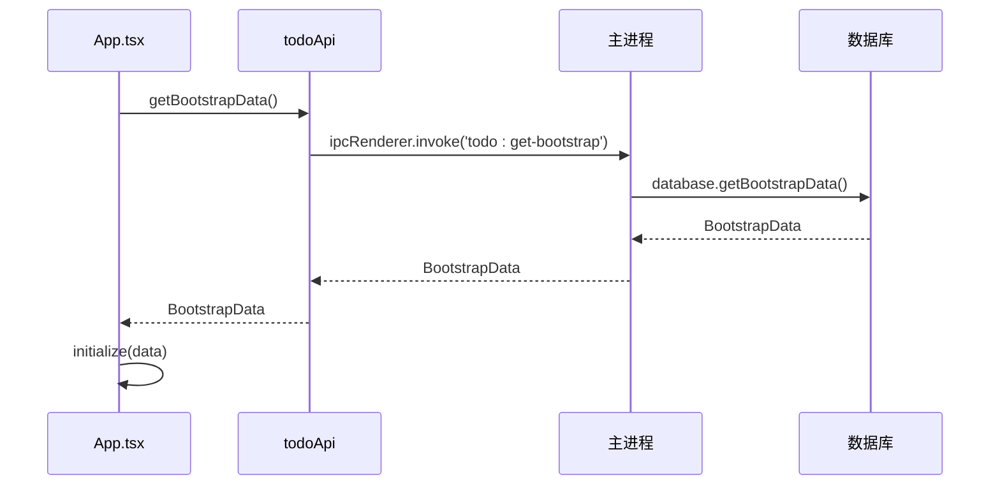

**图表来源**
- [App.tsx:25-32](file://app/src/App.tsx#L25-L32)
- [preload.ts:20](file://app/electron/preload.ts#L20)

#### 待办事项操作

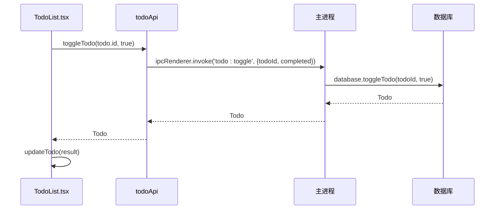

**图表来源**
- [TodoList.tsx:83-87](file://app/src/components/Content/TodoList.tsx#L83-L87)
- [preload.ts:24](file://app/electron/preload.ts#L24)

**章节来源**
- [App.tsx:24-34](file://app/src/App.tsx#L24-L34)
- [TodoList.tsx:83-87](file://app/src/components/Content/TodoList.tsx#L83-L87)

## 依赖关系分析

### 组件耦合度

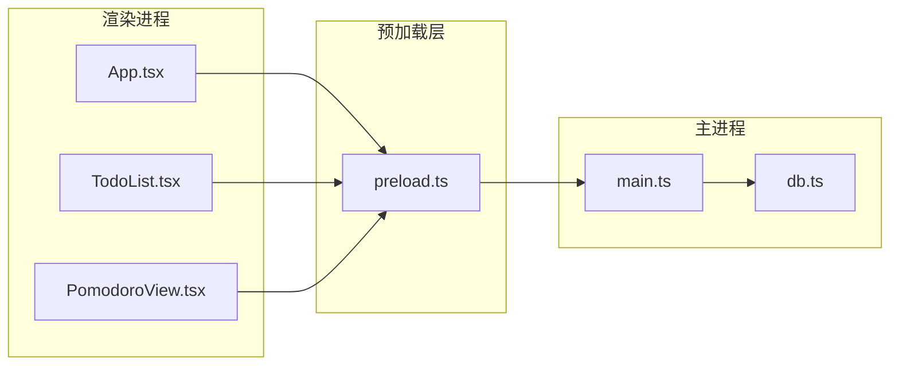

**图表来源**
- [preload.ts:1-117](file://app/electron/preload.ts#L1-L117)
- [main.ts:1-391](file://app/electron/main.ts#L1-L391)

### 数据流依赖

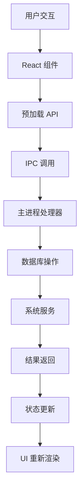

**图表来源**
- [PomodoroView.tsx:244-255](file://app/src/components/Pomodoro/PomodoroView.tsx#L244-L255)

**章节来源**
- [main.ts:1-391](file://app/electron/main.ts#L1-L391)
- [preload.ts:1-117](file://app/electron/preload.ts#L1-L117)

## 性能考虑

### IPC 性能优化技巧

1. **批量操作**：合并多个小的 IPC 调用为批量操作
2. **缓存策略**：在渲染进程中缓存常用数据
3. **防抖节流**：对频繁触发的操作使用防抖节流
4. **异步处理**：使用异步模式避免阻塞 UI 线程

### 最佳实践

1. **类型安全**：始终使用 TypeScript 确保类型正确性
2. **错误处理**：为所有 IPC 调用添加适当的错误处理
3. **资源管理**：及时清理事件监听器和定时器
4. **内存管理**：避免在 IPC 数据中传递大型对象

## 故障排除指南

### 常见问题诊断

#### IPC 调用失败

**症状**：渲染进程无法收到主进程响应

**排查步骤**：
1. 检查预加载脚本中的 API 暴露是否正确
2. 验证主进程中的 IPC 处理器是否注册
3. 查看控制台错误日志
4. 确认参数类型匹配

#### 数据同步问题

**症状**：UI 显示过期数据

**解决方案**：
1. 实现数据变更通知机制
2. 在组件卸载时清理监听器
3. 使用状态管理确保数据一致性

**章节来源**
- [main.ts:371-374](file://app/electron/main.ts#L371-L374)
- [preload.ts:43-47](file://app/electron/preload.ts#L43-L47)

### 调试方法

1. **开发者工具**：使用 Electron 开发者工具调试
2. **日志记录**：在关键节点添加日志输出
3. **单元测试**：为 IPC 层编写单元测试
4. **集成测试**：测试完整的 IPC 流程

## 结论

SnowTodo 的 IPC 通信机制展现了现代 Electron 应用的最佳实践。通过精心设计的预加载脚本、严格的类型安全和完善的错误处理，该应用实现了安全、高效的主进程与渲染进程通信。

关键优势包括：
- **安全性**：通过 contextBridge 实现严格的安全边界
- **类型安全**：完整的 TypeScript 支持确保编译时检查
- **可维护性**：清晰的架构分离和模块化设计
- **性能**：优化的 IPC 模式和数据流

该架构为其他 Electron 应用提供了优秀的参考模板，特别是在安全性和可扩展性方面。