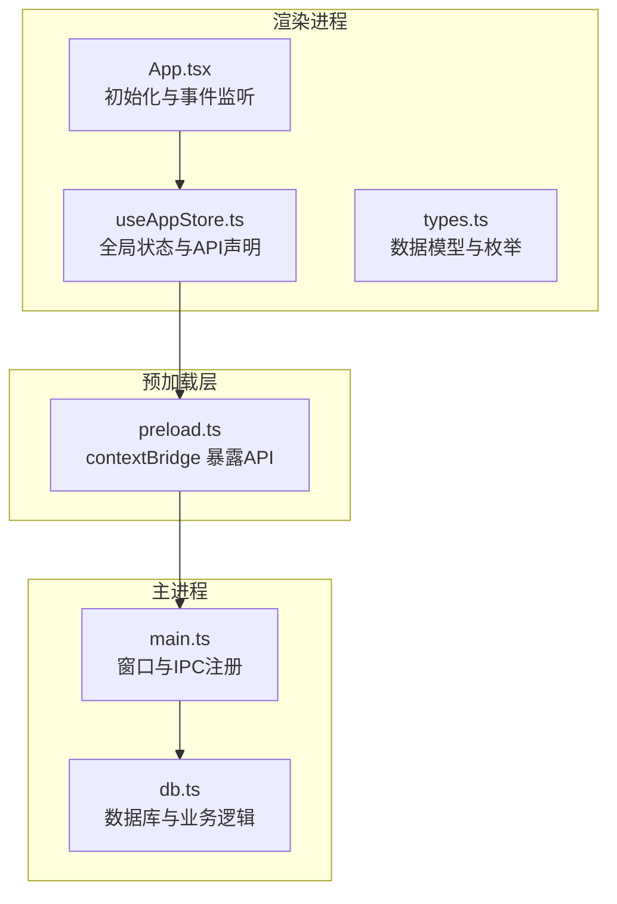
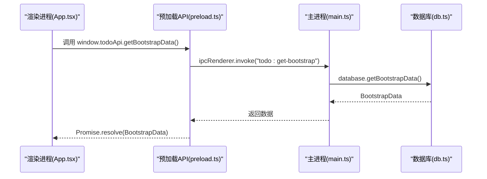
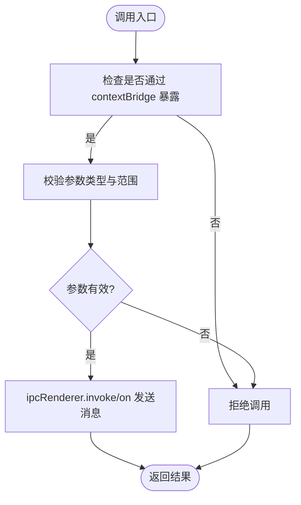
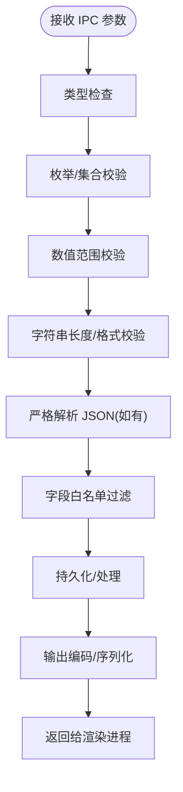
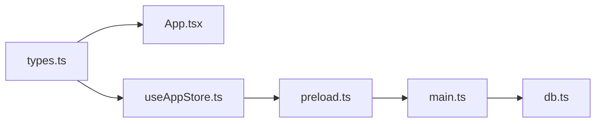

# 安全考虑

<cite>
**本文引用的文件**
- [main.ts](file://app/electron/main.ts)
- [preload.ts](file://app/electron/preload.ts)
- [db.ts](file://app/electron/db.ts)
- [types.ts](file://app/src/types.ts)
- [App.tsx](file://app/src/App.tsx)
- [useAppStore.ts](file://app/src/store/useAppStore.ts)
- [package.json](file://app/package.json)
</cite>

## 目录
1. [引言](#引言)
2. [项目结构](#项目结构)
3. [核心组件](#核心组件)
4. [架构总览](#架构总览)
5. [详细组件分析](#详细组件分析)
6. [依赖关系分析](#依赖关系分析)
7. [性能考量](#性能考量)
8. [故障排查指南](#故障排查指南)
9. [结论](#结论)
10. [附录](#附录)

## 引言
本文件聚焦 SnowTodo 在 Electron 环境下的 IPC 通信安全与上下文隔离实践，围绕以下目标展开：
- 解释上下文隔离与沙箱保护在 Electron 安全架构中的作用
- 阐述 contextBridge 的安全边界与权限控制原理
- 说明如何通过输入验证、输出编码与数据白名单机制防范代码注入、XSS 与权限提升
- 给出最小权限原则与纵深防御策略在项目中的落地方式
- 提供安全审计清单与合规建议

## 项目结构
SnowTodo 的安全相关代码主要分布在以下位置：
- 主进程：负责窗口创建、IPC 注册与数据库操作
- 预加载脚本：通过 contextBridge 暴露受控 API 至渲染进程
- 渲染进程：使用 window.todoApi 调用主进程能力
- 类型定义：统一前后端数据结构，便于输入校验与白名单控制

图表来源
- [main.ts:18-52](file://app/electron/main.ts#L18-L52)
- [preload.ts:18-116](file://app/electron/preload.ts#L18-L116)
- [App.tsx:24-34](file://app/src/App.tsx#L24-L34)
- [useAppStore.ts:541-564](file://app/src/store/useAppStore.ts#L541-L564)
- [types.ts:1-278](file://app/src/types.ts#L1-L278)

章节来源
- [main.ts:18-52](file://app/electron/main.ts#L18-L52)
- [preload.ts:1-117](file://app/electron/preload.ts#L1-L117)
- [App.tsx:1-60](file://app/src/App.tsx#L1-L60)
- [useAppStore.ts:536-564](file://app/src/store/useAppStore.ts#L536-L564)
- [types.ts:1-278](file://app/src/types.ts#L1-L278)

## 核心组件
- 主进程窗口与安全配置
  - 启用上下文隔离，禁用 Node 集成，确保渲染进程无法直接访问 Node.js API
- 预加载脚本与 contextBridge
  - 仅暴露受控 API，所有 IPC 调用均通过 ipcRenderer.invoke/on
- 数据库与 IPC 处理器
  - 所有数据变更通过 ipcMain.handle 分发至数据库层，避免渲染进程直接操作数据库
- 渲染进程调用链
  - 使用 window.todoApi 获取引导数据与执行业务操作，回调通过 ipcRenderer.on 订阅

章节来源
- [main.ts:28-32](file://app/electron/main.ts#L28-L32)
- [preload.ts:18-116](file://app/electron/preload.ts#L18-L116)
- [db.ts:55-90](file://app/electron/db.ts#L55-L90)
- [App.tsx:24-34](file://app/src/App.tsx#L24-L34)
- [useAppStore.ts:541-564](file://app/src/store/useAppStore.ts#L541-L564)

## 架构总览
下图展示 IPC 通信路径与安全边界：

图表来源
- [App.tsx:24-34](file://app/src/App.tsx#L24-L34)
- [preload.ts](file://app/electron/preload.ts#L20)
- [main.ts:227-228](file://app/electron/main.ts#L227-L228)
- [db.ts:676-714](file://app/electron/db.ts#L676-L714)

## 详细组件分析

### 上下文隔离与沙箱保护
- 上下文隔离
  - 主进程窗口启用上下文隔离，渲染进程无法直接访问 Node.js 与 Electron API
- Node 集成禁用
  - 通过 webPreferences 禁用 Node 集成，降低代码注入与权限提升风险
- 预加载脚本
  - 仅通过 contextBridge 暴露必要 API，形成明确的安全边界

章节来源
- [main.ts:28-32](file://app/electron/main.ts#L28-L32)
- [preload.ts:1-16](file://app/electron/preload.ts#L1-L16)

### contextBridge 的安全边界与权限控制
- 暴露范围最小化
  - 仅暴露 todoApi 及其方法，未暴露 ipcRenderer 或其他底层对象
- 显式参数传递
  - 所有调用均以参数形式传入，避免闭包捕获潜在危险上下文
- 回调订阅管理
  - 对于事件监听，返回移除函数以便清理，避免内存泄漏与意外回调

图表来源
- [preload.ts:18-116](file://app/electron/preload.ts#L18-L116)

章节来源
- [preload.ts:18-116](file://app/electron/preload.ts#L18-L116)

### IPC 输入验证与输出编码
- 输入验证
  - 主进程 ipcMain.handle 接收参数后，应进行类型与范围校验（例如枚举值、数值区间、字符串长度）
  - 对外部导入的数据（如 JSON）进行严格解析与字段白名单校验
- 输出编码
  - 将数据库查询结果映射为类型安全的对象，避免直接序列化原始数据
  - 对外发送的事件负载（如提醒事件）应进行最小化裁剪与格式化
- 白名单机制
  - 仅允许预定义的 IPC 通道名称与方法签名
  - 对可变字段（如标签、分类名）进行字符集与长度限制

图表来源
- [main.ts:227-358](file://app/electron/main.ts#L227-L358)
- [db.ts:974-1023](file://app/electron/db.ts#L974-L1023)

章节来源
- [main.ts:227-358](file://app/electron/main.ts#L227-L358)
- [db.ts:970-1023](file://app/electron/db.ts#L970-L1023)

### 防范代码注入、XSS 与权限提升
- 代码注入防护
  - 禁用 Node 集成与内联脚本，避免 eval 与动态代码执行
  - 对用户输入与富文本内容进行严格的白名单与转义
- XSS 防护
  - 渲染进程 DOM 操作遵循 CSP 与安全策略，避免 innerHTML 直接拼接
  - 事件回调中仅处理结构化数据，不执行任何字符串作为代码
- 权限提升
  - 通过上下文隔离与最小暴露 API，限制渲染进程对系统资源的直接访问
  - 导入/导出文件操作需经对话框确认，且仅在主进程执行文件系统操作

章节来源
- [main.ts:28-32](file://app/electron/main.ts#L28-L32)
- [preload.ts:18-116](file://app/electron/preload.ts#L18-L116)
- [main.ts:195-225](file://app/electron/main.ts#L195-L225)

### 渲染进程对敏感系统的访问限制
- 窗口控制
  - 仅通过 window.todoApi.windowAction 触发最小化/最大化/关闭，避免直接操作窗口对象
- 数据导出/导入
  - 通过 ipcMain.handle 触发对话框与文件写入，渲染进程不直接访问文件系统
- 全局快捷键
  - 由主进程注册与触发，渲染进程仅接收状态变化事件

章节来源
- [preload.ts:39-41](file://app/electron/preload.ts#L39-L41)
- [main.ts:195-225](file://app/electron/main.ts#L195-L225)
- [main.ts:179-193](file://app/electron/main.ts#L179-L193)

### 最小权限原则与纵深防御
- 最小权限
  - 仅暴露必要的 IPC 方法；对参数进行白名单与范围校验
- 纵深防御
  - 多层校验：类型、范围、格式、白名单
  - 多层隔离：上下文隔离 + 预加载 API + 主进程业务校验
  - 多层审计：错误日志、提醒记录、导入导出记录

章节来源
- [main.ts:227-358](file://app/electron/main.ts#L227-L358)
- [db.ts:882-940](file://app/electron/db.ts#L882-L940)

## 依赖关系分析
- 主进程依赖
  - Electron BrowserWindow、ipcMain、Notification、globalShortcut、Tray、Menu、nativeImage
  - AppDatabase 提供数据访问与迁移
- 预加载脚本依赖
  - contextBridge、ipcRenderer
- 渲染进程依赖
  - React 应用、Zustand 状态管理、类型定义

图表来源
- [types.ts:1-278](file://app/src/types.ts#L1-L278)
- [App.tsx:1-60](file://app/src/App.tsx#L1-L60)
- [useAppStore.ts:536-564](file://app/src/store/useAppStore.ts#L536-L564)
- [preload.ts:1-16](file://app/electron/preload.ts#L1-L16)
- [main.ts:1-10](file://app/electron/main.ts#L1-L10)
- [db.ts:1-26](file://app/electron/db.ts#L1-L26)

章节来源
- [package.json:1-100](file://app/package.json#L1-L100)

## 性能考量
- IPC 调用开销
  - 合理合并请求，避免频繁往返；批量获取数据时使用一次性调用
- 数据库访问
  - 控制事务粒度，避免长时间持有锁；对高频查询建立索引
- 渲染进程渲染
  - 使用 React 优化与分片渲染，减少主线程阻塞

## 故障排查指南
- IPC 无响应或报错
  - 检查通道名称是否一致；确认参数类型与白名单
- 上下文隔离导致 API 不可用
  - 确认预加载脚本已正确注入；检查 contextBridge 暴露的 API 是否存在
- 导入/导出失败
  - 检查文件对话框返回值；确认 JSON 结构与白名单字段匹配
- 提醒未触发
  - 检查数据库提醒记录与去重逻辑；核对时间与频率计算

章节来源
- [main.ts:227-358](file://app/electron/main.ts#L227-L358)
- [db.ts:882-940](file://app/electron/db.ts#L882-L940)

## 结论
SnowTodo 已在 Electron 安全架构上采取了关键措施：启用上下文隔离、禁用 Node 集成、通过 contextBridge 暴露受控 API，并将敏感操作集中在主进程与数据库层。为进一步强化安全，建议补充严格的输入验证、输出编码与白名单机制，完善错误处理与审计日志，并持续进行安全审查与渗透测试。

## 附录

### 安全审计清单
- 上下文隔离与 Node 集成
  - [ ] 确认 webPreferences 启用上下文隔离
  - [ ] 确认 webPreferences 禁用 Node 集成
- 预加载脚本
  - [ ] 仅暴露必要 API
  - [ ] 对外暴露的 API 具备清晰的类型声明
- IPC 通道与参数
  - [ ] 仅允许白名单通道名称
  - [ ] 对所有参数进行类型、范围、格式校验
  - [ ] 对 JSON 导入执行严格解析与字段白名单过滤
- 数据库与业务逻辑
  - [ ] 所有数据变更通过主进程处理器
  - [ ] 查询结果进行最小化裁剪与编码
- 渲染进程
  - [ ] 仅通过 window.todoApi 调用主进程能力
  - [ ] 事件回调不执行任何字符串代码
- 文件与系统交互
  - [ ] 导入/导出通过对话框确认
  - [ ] 全局快捷键由主进程注册与触发
- 错误处理与审计
  - [ ] 记录 IPC 错误与异常
  - [ ] 记录提醒触发与历史
  - [ ] 记录导入/导出操作

### 合规性与最佳实践
- 遵循最小权限原则：仅暴露必要 API 与通道
- 实施纵深防御：多层校验与隔离
- 采用白名单与编码：输入严格校验，输出安全编码
- 持续监控与审计：记录关键操作与异常