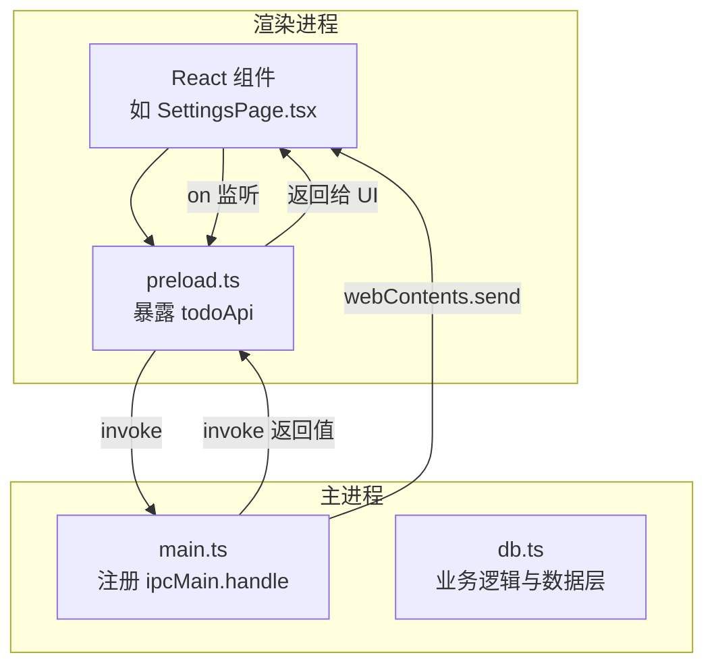
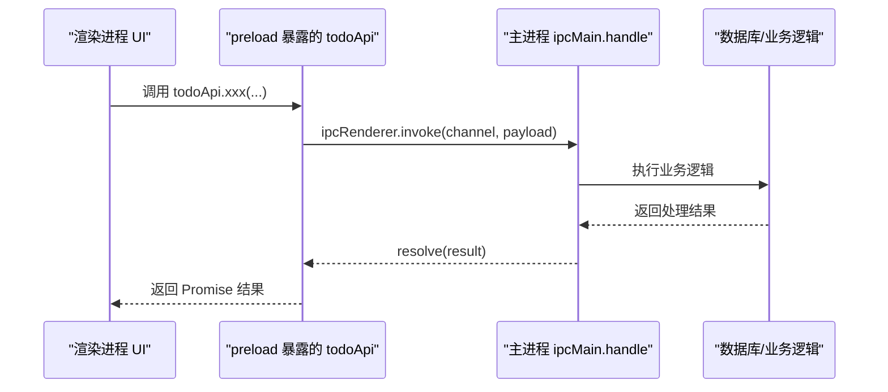
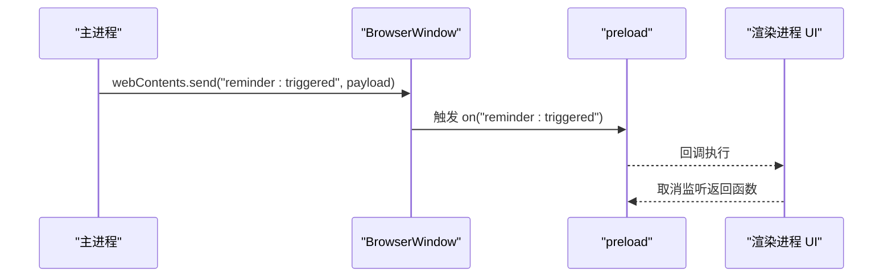
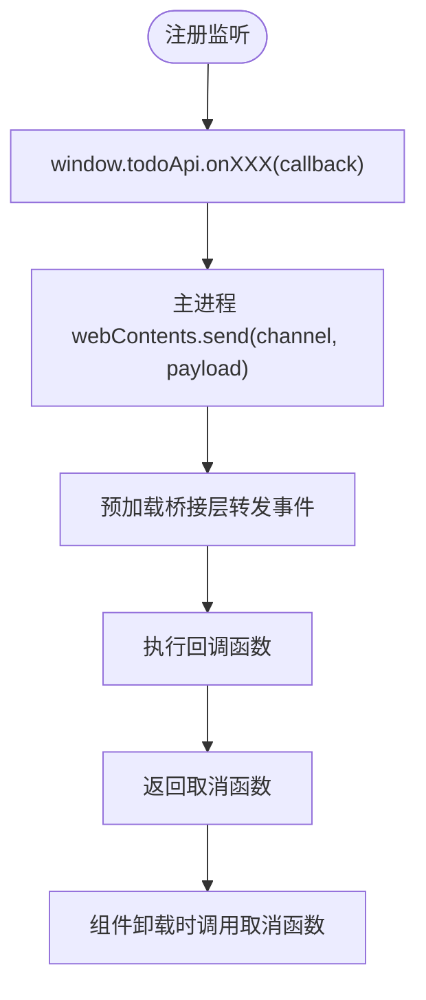
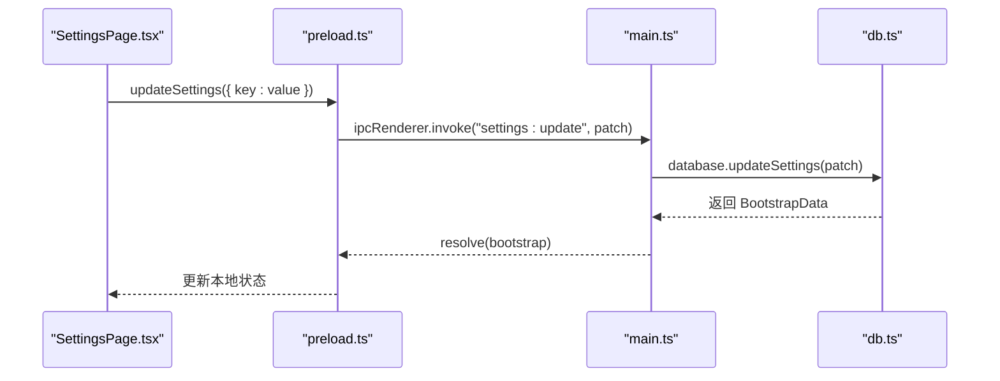
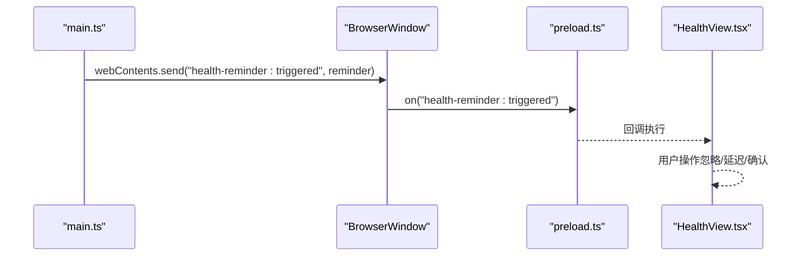
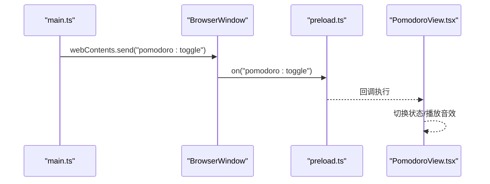
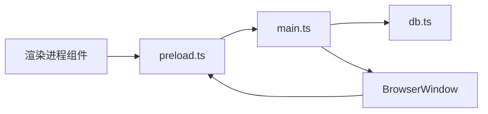

# 消息处理流程

<cite>
**本文引用的文件**
- [main.ts](file://app/electron/main.ts)
- [preload.ts](file://app/electron/preload.ts)
- [types.ts](file://app/src/types.ts)
- [db.ts](file://app/electron/db.ts)
- [SettingsPage.tsx](file://app/src/components/Settings/SettingsPage.tsx)
- [DetailPanel.tsx](file://app/src/components/DetailPanel/DetailPanel.tsx)
- [HealthView.tsx](file://app/src/components/Health/HealthView.tsx)
- [PomodoroView.tsx](file://app/src/components/Pomodoro/PomodoroView.tsx)
</cite>

## 目录
1. [简介](#简介)
2. [项目结构](#项目结构)
3. [核心组件](#核心组件)
4. [架构总览](#架构总览)
5. [详细组件分析](#详细组件分析)
6. [依赖关系分析](#依赖关系分析)
7. [性能考量](#性能考量)
8. [故障排查指南](#故障排查指南)
9. [结论](#结论)

## 简介
本文件面向 SnowTodo 的 IPC（进程间通信）消息处理流程，系统性梳理从渲染进程发起 IPC 请求到主进程响应的完整链路，涵盖：
- 请求发送与响应返回的两阶段流程
- invoke 与 send 两种消息模式的差异与适用场景
- 事件驱动的消息处理机制（on 监听器注册、事件触发与回调执行）
- 消息队列管理、并发控制与优先级处理现状
- 错误传播与异常处理策略
- 消息超时、重试与连接状态监控建议
- 性能优化技巧与调试方法

## 项目结构
SnowTodo 的 IPC 架构采用标准的 Electron 模式：
- 渲染进程通过 preload 暴露的 API 发起请求
- 主进程通过 ipcMain.handle 注册处理器
- 主进程可向渲染进程主动推送事件（webContents.send）

图表来源
- [main.ts:360-369](file://app/electron/main.ts#L360-L369)
- [preload.ts:18-116](file://app/electron/preload.ts#L18-L116)
- [db.ts:55-90](file://app/electron/db.ts#L55-L90)

章节来源
- [main.ts:18-52](file://app/electron/main.ts#L18-L52)
- [preload.ts:18-116](file://app/electron/preload.ts#L18-L116)

## 核心组件
- 渲染进程桥接层（preload.ts）
  - 通过 contextBridge.exposeInMainWorld 暴露 todoApi，封装 ipcRenderer.invoke 与 ipcRenderer.on
  - 将业务 API 映射为统一的调用入口，便于 UI 组件直接使用
- 主进程处理器（main.ts）
  - 使用 ipcMain.handle 注册各类 IPC 处理函数，实现请求-响应式交互
  - 在特定场景下使用 webContents.send 向渲染进程推送事件
- 数据库与业务逻辑（db.ts）
  - 承载具体业务操作（增删改查、定时任务、提醒分发等），被主进程处理器调用
- 类型定义（types.ts）
  - 定义 IPC 传输的数据结构（如 TodoDraft、Settings、ReminderEvent 等），确保强类型约束

章节来源
- [preload.ts:18-116](file://app/electron/preload.ts#L18-L116)
- [main.ts:227-358](file://app/electron/main.ts#L227-L358)
- [db.ts:55-90](file://app/electron/db.ts#L55-L90)
- [types.ts:161-221](file://app/src/types.ts#L161-L221)

## 架构总览
SnowTodo 的 IPC 采用“请求-响应”与“事件推送”双通道：
- 请求-响应（invoke）
  - 渲染进程调用 window.todoApi.xxx，主进程 ipcMain.handle 接收并处理，返回结果
  - 适用于 CRUD、查询、配置更新等需要明确返回值的场景
- 事件推送（webContents.send + on 监听）
  - 主进程在定时或状态变化时，主动向渲染进程推送事件
  - 渲染进程通过 window.todoApi.onXXX 注册监听器，接收并处理事件
  - 适用于提醒触发、全局状态变更等异步事件

图表来源
- [preload.ts:20-40](file://app/electron/preload.ts#L20-L40)
- [main.ts:227-259](file://app/electron/main.ts#L227-L259)
- [db.ts:55-90](file://app/electron/db.ts#L55-L90)

## 详细组件分析

### 请求-响应模式（invoke）与事件推送（send/on）
- invoke 模式
  - 渲染进程：通过 window.todoApi.xxx(...) 调用，内部使用 ipcRenderer.invoke
  - 主进程：通过 ipcMain.handle(channel, handler) 注册处理器，返回值作为 Promise 解析结果
  - 典型用途：数据读写、配置更新、窗口动作等
- send/on 模式
  - 主进程：通过 mainWindow.webContents.send(channel, payload) 主动推送事件
  - 渲染进程：通过 window.todoApi.onXXX(callback) 注册监听器，返回取消函数用于移除监听
  - 典型用途：提醒触发、全局状态变更（如 Pomodoro 活跃状态变化）

图表来源
- [main.ts:115](file://app/electron/main.ts#L115)
- [preload.ts:43-47](file://app/electron/preload.ts#L43-L47)

章节来源
- [preload.ts:20-40](file://app/electron/preload.ts#L20-L40)
- [main.ts:115](file://app/electron/main.ts#L115)
- [preload.ts:43-47](file://app/electron/preload.ts#L43-L47)

### invoke 与 send 的区别与适用场景
- invoke
  - 特点：请求-响应，有明确的返回值；适合同步语义的业务操作
  - 场景：保存待办、切换完成状态、导出/导入数据、窗口动作等
- send/on
  - 特点：事件驱动，无返回值；适合异步广播或状态变更通知
  - 场景：提醒触发、Pomodoro 切换、健康提醒触发等

章节来源
- [preload.ts:20-40](file://app/electron/preload.ts#L20-L40)
- [main.ts:115](file://app/electron/main.ts#L115)
- [preload.ts:43-47](file://app/electron/preload.ts#L43-L47)

### 事件驱动的消息处理机制
- 监听器注册
  - 渲染进程通过 window.todoApi.onXXX(callback) 注册监听器，返回一个取消函数
- 事件触发
  - 主进程在合适时机调用 webContents.send(channel, payload) 触发事件
- 回调执行
  - 预加载桥接层将事件转发给注册的回调函数
- 生命周期管理
  - 建议在组件卸载时调用取消函数，避免内存泄漏与重复监听

图表来源
- [preload.ts:43-47](file://app/electron/preload.ts#L43-L47)
- [main.ts:115](file://app/electron/main.ts#L115)

章节来源
- [preload.ts:43-47](file://app/electron/preload.ts#L43-L47)
- [main.ts:115](file://app/electron/main.ts#L115)

### 消息队列管理、并发控制与优先级处理
- 现状
  - 代码未显式实现自定义消息队列或优先级调度
  - 主进程通过 ipcMain.handle 逐个处理请求，天然具备串行化特性
- 并发控制
  - 对于耗时操作（如数据导入/导出），主进程已使用 async/await，避免阻塞主线程
- 优先级
  - 未实现显式的优先级队列；当前行为由 Electron 默认调度决定

章节来源
- [main.ts:240-243](file://app/electron/main.ts#L240-L243)
- [main.ts:244-259](file://app/electron/main.ts#L244-L259)

### 错误传播机制与异常处理策略
- 主进程异常
  - 主进程定时循环（提醒与健康提醒）对内部错误进行 try/catch 并记录日志，避免崩溃
- 渲染进程异常
  - 渲染进程通过 Promise 包裹 invoke 调用；若主进程抛错，Promise 将被拒绝
  - 建议在 UI 层捕获 Promise 拒绝并提示用户
- 数据一致性
  - 数据库层通过事务与迁移保证一致性；主进程处理器在成功后返回最新状态

章节来源
- [main.ts:125-135](file://app/electron/main.ts#L125-L135)
- [main.ts:166-173](file://app/electron/main.ts#L166-L173)

### 消息超时、重试与连接状态监控
- 超时与重试
  - 代码未实现 invoke 超时与自动重试机制
  - 建议在预加载桥接层或上层封装中增加超时控制与有限重试
- 连接状态监控
  - 未实现主/渲染进程断开检测
  - 建议在应用初始化时记录主进程可用性，并在 UI 层提示“主进程不可用”

章节来源
- [preload.ts:18-116](file://app/electron/preload.ts#L18-L116)

### 典型调用链示例

#### 设置项更新（invoke）

图表来源
- [SettingsPage.tsx:8-17](file://app/src/components/Settings/SettingsPage.tsx#L8-L17)
- [preload.ts:33](file://app/electron/preload.ts#L33)
- [main.ts:235-239](file://app/electron/main.ts#L235-L239)
- [db.ts:55-90](file://app/electron/db.ts#L55-L90)

#### 健康提醒触发（send/on）

图表来源
- [main.ts:154](file://app/electron/main.ts#L154)
- [preload.ts:83-87](file://app/electron/preload.ts#L83-L87)
- [HealthView.tsx:262-278](file://app/src/components/Health/HealthView.tsx#L262-L278)

#### Pomodoro 切换事件（send/on）

图表来源
- [main.ts:186](file://app/electron/main.ts#L186)
- [preload.ts:64-68](file://app/electron/preload.ts#L64-L68)
- [PomodoroView.tsx:206](file://app/src/components/Pomodoro/PomodoroView.tsx#L206)

## 依赖关系分析
- 渲染进程依赖 preload 暴露的 API，间接依赖主进程处理器
- 主进程处理器依赖数据库模块执行业务逻辑
- 事件推送依赖 BrowserWindow 的 webContents

图表来源
- [preload.ts:18-116](file://app/electron/preload.ts#L18-L116)
- [main.ts:227-358](file://app/electron/main.ts#L227-L358)
- [db.ts:55-90](file://app/electron/db.ts#L55-L90)

章节来源
- [preload.ts:18-116](file://app/electron/preload.ts#L18-L116)
- [main.ts:227-358](file://app/electron/main.ts#L227-L358)
- [db.ts:55-90](file://app/electron/db.ts#L55-L90)

## 性能考量
- 串行化优势
  - ipcMain.handle 的天然串行化避免了竞态条件，简化并发控制
- 耗时操作
  - 导入/导出、数据库写入等操作应尽量异步，避免阻塞 UI
- 事件风暴
  - 定时事件（如提醒）可能集中触发，建议在主进程侧做去抖/节流
- 内存与监听
  - 事件监听需在组件卸载时清理，避免内存泄漏

[本节为通用指导，无需列出章节来源]

## 故障排查指南
- invoke 无响应
  - 检查主进程是否正确注册对应 channel 的 handle
  - 检查渲染进程是否正确调用 window.todoApi.xxx
- 事件未到达
  - 检查主进程是否在正确时机调用 webContents.send
  - 检查渲染进程是否已注册对应的 on 监听器
- 异常日志
  - 主进程定时任务中的错误已被捕获并记录，可在控制台查看
- 数据不一致
  - 确认数据库事务与迁移是否成功执行

章节来源
- [main.ts:125-135](file://app/electron/main.ts#L125-L135)
- [main.ts:166-173](file://app/electron/main.ts#L166-L173)

## 结论
SnowTodo 的 IPC 架构清晰地分离了“请求-响应”与“事件推送”两类模式，满足了 CRUD、配置更新与事件驱动通知等需求。当前实现具备良好的可维护性与扩展性，建议后续在以下方面进一步完善：
- 引入 invoke 超时与重试机制
- 实现事件监听生命周期管理（自动清理）
- 在主进程侧引入事件去抖/节流，避免事件风暴
- 增加主/渲染进程连接状态监控与降级提示