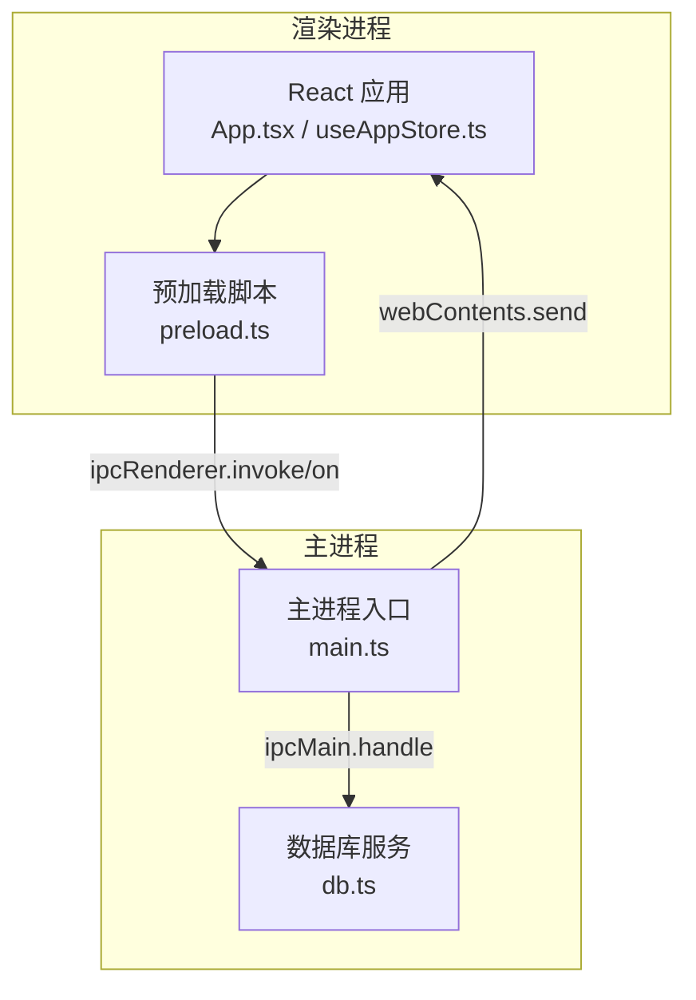
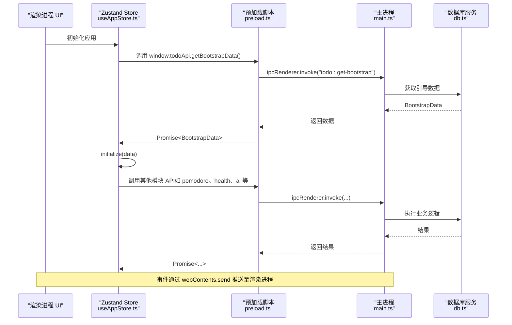
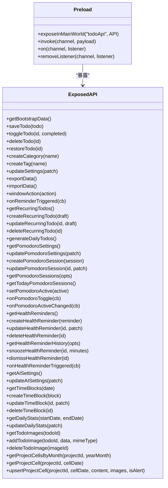
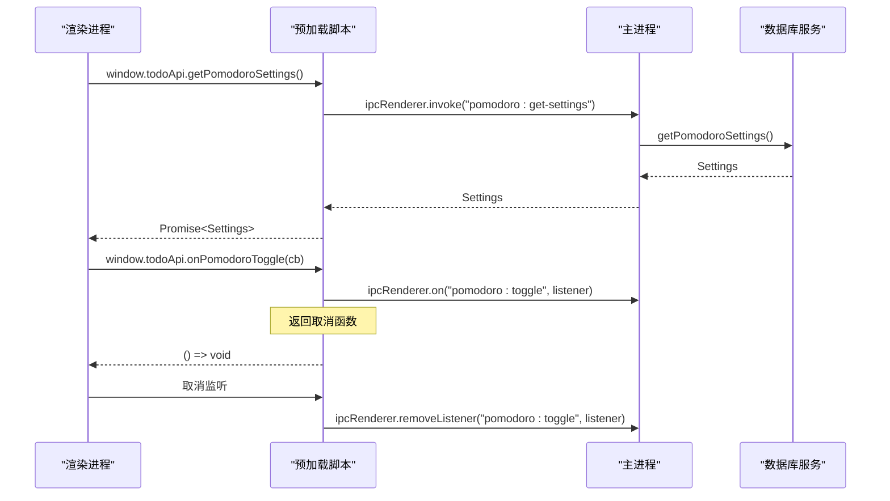
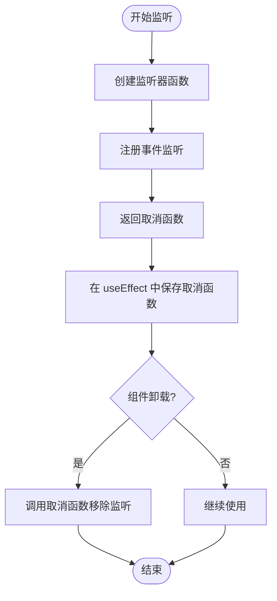
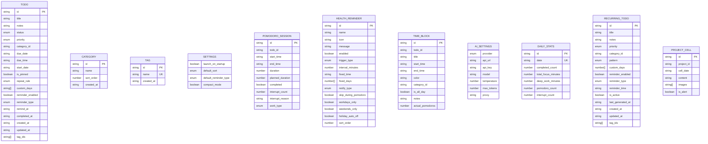
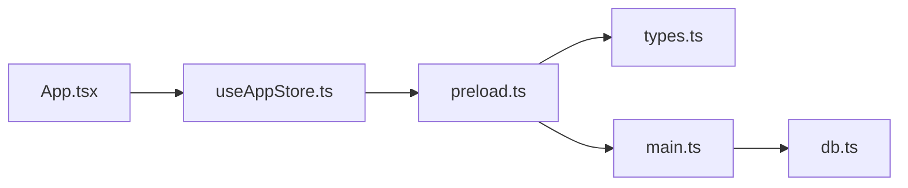

# 预加载脚本设计

<cite>
**本文档引用的文件**
- [app/electron/preload.ts](file://app/electron/preload.ts)
- [app/electron/main.ts](file://app/electron/main.ts)
- [app/electron/db.ts](file://app/electron/db.ts)
- [app/src/types.ts](file://app/src/types.ts)
- [app/src/store/useAppStore.ts](file://app/src/store/useAppStore.ts)
- [app/src/App.tsx](file://app/src/App.tsx)
- [app/dist-electron/preload.mjs](file://app/dist-electron/preload.mjs)
</cite>

## 目录
1. [简介](#简介)
2. [项目结构](#项目结构)
3. [核心组件](#核心组件)
4. [架构总览](#架构总览)
5. [详细组件分析](#详细组件分析)
6. [依赖关系分析](#依赖关系分析)
7. [性能考量](#性能考量)
8. [故障排查指南](#故障排查指南)
9. [结论](#结论)
10. [附录](#附录)

## 简介
本文件面向 SnowTodo 项目的预加载脚本设计，系统性阐述以下主题：
- contextBridge 的安全桥接机制与 exposeInMainWorld API 的使用原理
- 如何通过预加载脚本将主进程功能安全地暴露给渲染进程
- 类型安全的 API 暴露机制与 IPC 封装设计（invoke 与 on 事件监听器）
- 异步操作与回调函数的内存泄漏防护策略
- 预加载脚本在 Electron 安全架构中的作用与最佳实践
- 自定义 API 暴露的开发指南与调试技巧

## 项目结构
SnowTodo 采用标准的 Electron + React 架构，预加载脚本位于 app/electron/preload.ts，负责在渲染进程中注入类型安全的 API 桥接层，供前端 Store 与组件调用。

图表来源
- [app/electron/preload.ts:18-116](file://app/electron/preload.ts#L18-L116)
- [app/electron/main.ts:28-32](file://app/electron/main.ts#L28-L32)
- [app/electron/main.ts:227-358](file://app/electron/main.ts#L227-L358)
- [app/electron/db.ts:55-90](file://app/electron/db.ts#L55-L90)

章节来源
- [app/electron/preload.ts:1-117](file://app/electron/preload.ts#L1-L117)
- [app/electron/main.ts:18-52](file://app/electron/main.ts#L18-L52)

## 核心组件
- 预加载脚本（preload.ts）：通过 contextBridge.exposeInMainWorld 在渲染进程全局注入 todoApi 对象，统一暴露 CRUD、设置、提醒、番茄钟、健康提醒、AI 设置、时间块、统计、图片与项目单元格等 API。
- 主进程（main.ts）：启用 contextIsolation 并配置 preload 路径；注册 ipcMain.handle 处理来自渲染进程的请求；通过 webContents.send 向渲染进程推送事件。
- 数据库服务（db.ts）：封装 SQL.js 存储与业务逻辑，提供各类查询与写入方法。
- 类型定义（types.ts）：定义 Todo、Category、Tag、Settings、Pomodoro、HealthReminder、TimeBlock、AISettings、DailyStats、RecurringTodo、ProjectCell 等核心类型。
- 应用状态（useAppStore.ts）：Zustand 状态管理，声明 window.todoApi 的类型签名，驱动各模块初始化与交互。
- 入口应用（App.tsx）：在首次挂载时调用 window.todoApi.getBootstrapData 完成应用初始化。

章节来源
- [app/electron/preload.ts:18-116](file://app/electron/preload.ts#L18-L116)
- [app/electron/main.ts:28-32](file://app/electron/main.ts#L28-L32)
- [app/electron/db.ts:55-90](file://app/electron/db.ts#L55-L90)
- [app/src/types.ts:1-278](file://app/src/types.ts#L1-L278)
- [app/src/store/useAppStore.ts:541-603](file://app/src/store/useAppStore.ts#L541-L603)
- [app/src/App.tsx:24-34](file://app/src/App.tsx#L24-L34)

## 架构总览
预加载脚本作为“安全桥”，在渲染进程与主进程之间建立受控通信通道，确保：
- 渲染进程只能通过暴露的 API 与主进程交互
- 主进程通过 ipcMain.handle 统一处理请求，避免直接暴露 Node.js 能力
- 事件推送通过 webContents.send 实现，配合 onXxx 回调清理机制防止内存泄漏

图表来源
- [app/src/store/useAppStore.ts:295-298](file://app/src/store/useAppStore.ts#L295-L298)
- [app/electron/preload.ts:20](file://app/electron/preload.ts#L20)
- [app/electron/main.ts:227-228](file://app/electron/main.ts#L227-L228)
- [app/electron/db.ts:676-714](file://app/electron/db.ts#L676-L714)

## 详细组件分析

### contextBridge 与 exposeInMainWorld 安全桥接机制
- 安全隔离：主进程 BrowserWindow.webPreferences 中启用 contextIsolation，禁止渲染进程直接访问 Node.js 与 Electron API。
- 暴露接口：预加载脚本通过 contextBridge.exposeInMainWorld 将 todoApi 注入到 window 对象，仅暴露白名单方法。
- 类型约束：通过全局类型声明 window.todoApi，确保前端调用具备类型提示与编译期校验。

图表来源
- [app/electron/preload.ts:18-116](file://app/electron/preload.ts#L18-L116)
- [app/src/store/useAppStore.ts:541-603](file://app/src/store/useAppStore.ts#L541-L603)

章节来源
- [app/electron/preload.ts:18-116](file://app/electron/preload.ts#L18-L116)
- [app/src/store/useAppStore.ts:541-603](file://app/src/store/useAppStore.ts#L541-L603)

### IPC 封装设计：invoke 与 on 事件监听器
- invoke 模式：用于请求-响应式调用，返回 Promise，适合 CRUD 与查询场景。
- on 事件模式：用于订阅主进程推送的事件，返回取消函数以释放监听器，防止内存泄漏。

图表来源
- [app/electron/preload.ts:57-68](file://app/electron/preload.ts#L57-L68)
- [app/electron/main.ts:268-292](file://app/electron/main.ts#L268-L292)
- [app/electron/db.ts:1702-1721](file://app/electron/db.ts#L1702-L1721)

章节来源
- [app/electron/preload.ts:43-47](file://app/electron/preload.ts#L43-L47)
- [app/electron/preload.ts:64-73](file://app/electron/preload.ts#L64-L73)
- [app/electron/main.ts:227-358](file://app/electron/main.ts#L227-L358)

### 异步操作与回调内存泄漏防护
- 事件监听器清理：onXxx 方法内部创建监听器并返回取消函数，调用方应在组件卸载或不再需要时调用取消函数。
- 生命周期绑定：在 React 组件中，可在 useEffect 的 cleanup 中调用取消函数，确保组件销毁时释放资源。
- 主动移除：预加载脚本内部在每次监听时创建独立的匿名函数，保证可被正确移除。

图表来源
- [app/electron/preload.ts:43-47](file://app/electron/preload.ts#L43-L47)
- [app/electron/preload.ts:64-73](file://app/electron/preload.ts#L64-L73)

章节来源
- [app/electron/preload.ts:43-47](file://app/electron/preload.ts#L43-L47)
- [app/electron/preload.ts:64-73](file://app/electron/preload.ts#L64-L73)

### 类型安全的 API 暴露机制
- 类型定义：types.ts 提供 Todo、Category、Tag、Settings、Pomodoro、HealthReminder、TimeBlock、AISettings、DailyStats、RecurringTodo、ProjectCell 等完整类型。
- 全局类型声明：useAppStore.ts 中为 window.todoApi 提供精确的类型签名，确保调用参数与返回值的类型安全。
- 预加载脚本与主进程映射：preload.ts 的每个方法签名与 main.ts 的 ipcMain.handle 实现一一对应，保证调用链路的类型一致性。

图表来源
- [app/src/types.ts:168-278](file://app/src/types.ts#L168-L278)

章节来源
- [app/src/types.ts:1-278](file://app/src/types.ts#L1-L278)
- [app/src/store/useAppStore.ts:541-603](file://app/src/store/useAppStore.ts#L541-L603)

### 预加载脚本在 Electron 安全架构中的作用
- 限制暴露面：仅暴露 todoApi，避免渲染进程直接访问 Node.js 或 Electron 的敏感 API。
- 统一入口：所有 IPC 通信经由预加载脚本，便于审计与错误处理。
- 类型约束：结合全局类型声明，从源头保证调用的类型安全。
- 事件生命周期：通过返回取消函数，确保事件监听器在组件销毁时被正确移除，降低内存泄漏风险。

章节来源
- [app/electron/main.ts:28-32](file://app/electron/main.ts#L28-L32)
- [app/electron/preload.ts:18-116](file://app/electron/preload.ts#L18-L116)

### 自定义 API 暴露的开发指南与调试技巧
- 新增 API 步骤
  1) 在 types.ts 中定义参数与返回值类型。
  2) 在 main.ts 的 registerIpc 中添加 ipcMain.handle 映射。
  3) 在 preload.ts 中暴露对应的 window.todoApi 方法。
  4) 在 useAppStore.ts 中补充全局类型声明。
  5) 在渲染组件中调用并处理返回值。
- 调试技巧
  - 使用浏览器开发者工具的 Console 查看预加载脚本注入情况。
  - 在 main.ts 中打印 ipcMain.handle 的调用日志，验证参数与返回值。
  - 对于事件监听，务必在组件卸载时调用返回的取消函数。
  - 若遇到类型错误，优先检查 useAppStore.ts 的类型声明与实际实现是否一致。

章节来源
- [app/src/types.ts:1-278](file://app/src/types.ts#L1-L278)
- [app/electron/main.ts:227-358](file://app/electron/main.ts#L227-L358)
- [app/electron/preload.ts:18-116](file://app/electron/preload.ts#L18-L116)
- [app/src/store/useAppStore.ts:541-603](file://app/src/store/useAppStore.ts#L541-L603)

## 依赖关系分析
预加载脚本与主进程、数据库服务之间的依赖关系如下：

图表来源
- [app/electron/preload.ts:1-16](file://app/electron/preload.ts#L1-L16)
- [app/electron/main.ts:5-6](file://app/electron/main.ts#L5-L6)
- [app/electron/db.ts:5-24](file://app/electron/db.ts#L5-L24)
- [app/src/store/useAppStore.ts:2-21](file://app/src/store/useAppStore.ts#L2-L21)
- [app/src/App.tsx:1-8](file://app/src/App.tsx#L1-L8)

章节来源
- [app/electron/preload.ts:1-16](file://app/electron/preload.ts#L1-L16)
- [app/electron/main.ts:5-6](file://app/electron/main.ts#L5-L6)
- [app/electron/db.ts:5-24](file://app/electron/db.ts#L5-L24)
- [app/src/store/useAppStore.ts:2-21](file://app/src/store/useAppStore.ts#L2-L21)
- [app/src/App.tsx:1-8](file://app/src/App.tsx#L1-L8)

## 性能考量
- IPC 调用开销：频繁的 invoke 调用会带来序列化与线程切换成本，建议合并请求或批量处理。
- 事件监听：onXxx 方法返回的取消函数需在合适时机调用，避免长期持有监听器导致内存占用上升。
- 数据库访问：复杂查询应尽量在主进程侧进行，避免在渲染进程进行大量计算。
- 预加载脚本体积：尽量减少不必要的类型导入与运行时代码，保持预加载脚本精简。

## 故障排查指南
- 预加载脚本未注入
  - 检查主进程 webPreferences 是否启用 contextIsolation 且正确配置 preload 路径。
  - 确认 dist-electron/preload.mjs 是否存在并可被加载。
- 类型错误
  - useAppStore.ts 的 window.todoApi 类型声明与 preload.ts 的实现不一致会导致编译错误。
- IPC 无响应
  - 检查 main.ts 的 registerIpc 是否已注册对应 handle。
  - 在 main.ts 中增加日志输出，确认 handle 是否被触发。
- 事件未触发或内存泄漏
  - 确保在组件卸载时调用 onXxx 返回的取消函数。
  - 检查是否存在重复监听或未移除的监听器。

章节来源
- [app/electron/main.ts:28-32](file://app/electron/main.ts#L28-L32)
- [app/dist-electron/preload.mjs](file://app/dist-electron/preload.mjs)
- [app/src/store/useAppStore.ts:541-603](file://app/src/store/useAppStore.ts#L541-L603)
- [app/electron/main.ts:227-358](file://app/electron/main.ts#L227-L358)

## 结论
SnowTodo 的预加载脚本通过 contextBridge.exposeInMainWorld 实现了安全可控的 API 暴露，结合严格的类型声明与 IPC 封装，有效提升了系统的安全性与可维护性。通过 invoke 与 on 事件模式的合理使用，以及事件监听器的生命周期管理，能够显著降低内存泄漏风险。遵循本文档提供的最佳实践与调试技巧，可以高效扩展新的功能模块并保持整体架构的稳定性。

## 附录
- 预加载脚本文件位置：app/electron/preload.ts
- 预加载脚本产物位置：app/dist-electron/preload.mjs
- 主进程入口：app/electron/main.ts
- 数据库服务：app/electron/db.ts
- 类型定义：app/src/types.ts
- 应用状态：app/src/store/useAppStore.ts
- 入口应用：app/src/App.tsx