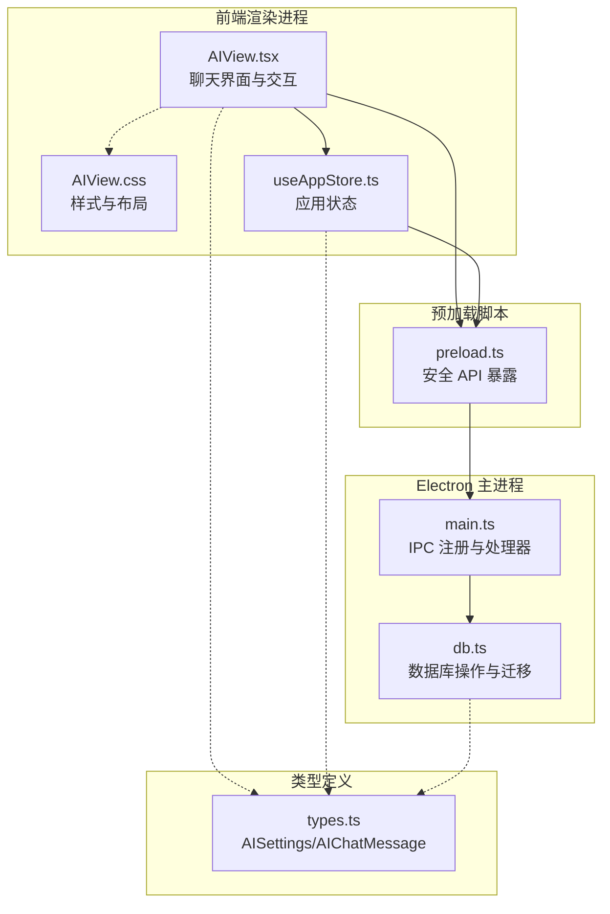
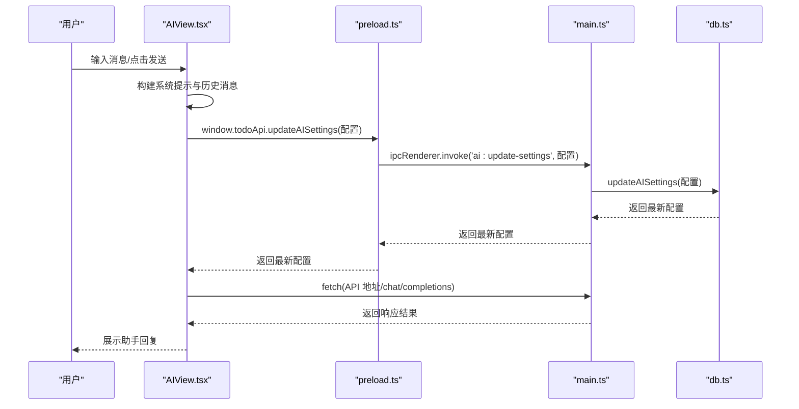
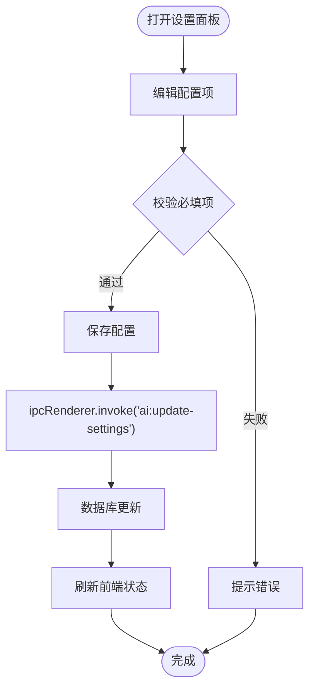
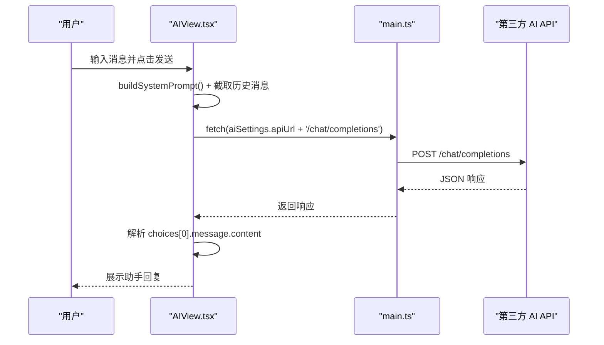
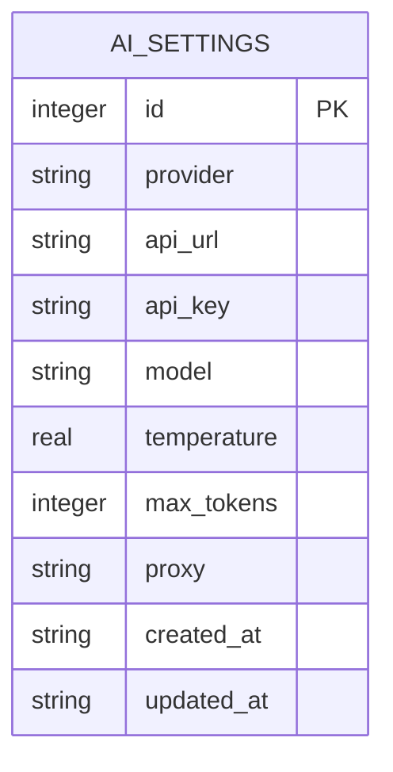
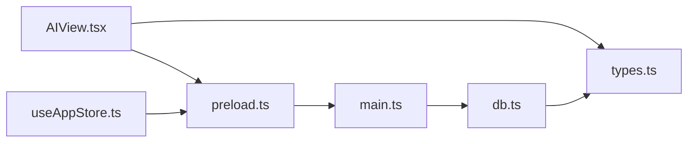

# AI 智能助手

<cite>
**本文档引用的文件**
- [AIView.tsx](file://app/src/components/AI/AIView.tsx)
- [AIView.css](file://app/src/components/AI/AIView.css)
- [types.ts](file://app/src/types.ts)
- [db.ts](file://app/electron/db.ts)
- [main.ts](file://app/electron/main.ts)
- [preload.ts](file://app/electron/preload.ts)
- [useAppStore.ts](file://app/src/store/useAppStore.ts)
</cite>

## 目录
1. [简介](#简介)
2. [项目结构](#项目结构)
3. [核心组件](#核心组件)
4. [架构总览](#架构总览)
5. [详细组件分析](#详细组件分析)
6. [依赖关系分析](#依赖关系分析)
7. [性能考虑](#性能考虑)
8. [故障排除指南](#故障排除指南)
9. [结论](#结论)

## 简介
本模块为 SnowTodo 的 AI 智能助手，提供跨平台多模型对话能力，支持 OpenAI、Claude、通义千问、文心一言等主流大模型服务，同时允许自定义 API 接口。系统通过本地 SQLite 数据库存储 API 配置与会话上下文，前端使用 React 组件实现聊天界面与交互逻辑，后端通过 Electron IPC 提供安全的数据库访问接口。

## 项目结构
AI 模块涉及以下关键文件与职责分工：
- 前端界面与交互：AIView.tsx 负责聊天界面、快捷指令、消息发送与接收、设置面板
- 样式与布局：AIView.css 提供聊天气泡、输入框、设置面板等样式
- 类型定义：types.ts 定义 AISettings、AIChatMessage 等核心类型
- 数据库层：db.ts 负责 AI 设置的读取与更新、SQL 表结构与迁移
- 主进程桥接：main.ts 注册 IPC 处理器，暴露 AI 设置的获取与更新
- 预加载脚本：preload.ts 暴露安全的 API 接口给渲染进程
- 应用状态：useAppStore.ts 管理全局状态与 AI 设置的加载与更新

**图表来源**
- [AIView.tsx:125-330](file://app/src/components/AI/AIView.tsx#L125-L330)
- [AIView.css:1-341](file://app/src/components/AI/AIView.css#L1-L341)
- [types.ts:119-133](file://app/src/types.ts#L119-L133)
- [db.ts:165-176](file://app/electron/db.ts#L165-L176)
- [main.ts:313-317](file://app/electron/main.ts#L313-L317)
- [preload.ts:89-91](file://app/electron/preload.ts#L89-L91)
- [useAppStore.ts:67-70](file://app/src/store/useAppStore.ts#L67-L70)

**章节来源**
- [AIView.tsx:1-331](file://app/src/components/AI/AIView.tsx#L1-L331)
- [AIView.css:1-341](file://app/src/components/AI/AIView.css#L1-L341)
- [types.ts:119-133](file://app/src/types.ts#L119-L133)
- [db.ts:165-176](file://app/electron/db.ts#L165-L176)
- [main.ts:313-317](file://app/electron/main.ts#L313-L317)
- [preload.ts:89-91](file://app/electron/preload.ts#L89-L91)
- [useAppStore.ts:67-70](file://app/src/store/useAppStore.ts#L67-L70)

## 核心组件
- AI 设置面板：支持选择服务提供商、配置 API 地址、API Key、模型名称、Temperature、代理地址等
- 聊天界面：包含系统提示构建、历史消息截断、消息发送与接收、输入框与快捷指令
- 数据持久化：通过数据库表 ai_settings 存储配置；前端通过 IPC 与主进程交互
- 类型系统：AISettings 与 AIChatMessage 明确定义配置与消息结构

**章节来源**
- [AIView.tsx:6-12](file://app/src/components/AI/AIView.tsx#L6-L12)
- [AIView.tsx:15-105](file://app/src/components/AI/AIView.tsx#L15-L105)
- [AIView.tsx:125-330](file://app/src/components/AI/AIView.tsx#L125-L330)
- [types.ts:119-133](file://app/src/types.ts#L119-L133)
- [db.ts:165-176](file://app/electron/db.ts#L165-L176)

## 架构总览
AI 智能助手采用“前端界面 + 预加载脚本 + 主进程 IPC + 数据库”的分层架构。前端负责用户交互与展示，预加载脚本通过 contextBridge 暴露受控 API，主进程注册 IPC 处理器，数据库层负责配置与数据持久化。

**图表来源**
- [AIView.tsx:163-233](file://app/src/components/AI/AIView.tsx#L163-L233)
- [preload.ts:89-91](file://app/electron/preload.ts#L89-L91)
- [main.ts:313-317](file://app/electron/main.ts#L313-L317)
- [db.ts:1602-1622](file://app/electron/db.ts#L1602-L1622)

**章节来源**
- [AIView.tsx:163-233](file://app/src/components/AI/AIView.tsx#L163-L233)
- [preload.ts:89-91](file://app/electron/preload.ts#L89-L91)
- [main.ts:313-317](file://app/electron/main.ts#L313-L317)
- [db.ts:1602-1622](file://app/electron/db.ts#L1602-L1622)

## 详细组件分析

### 组件 A：AI 设置面板与配置管理
- 支持的服务提供商：OpenAI、Claude、通义千问、文心一言、自定义接口
- 关键配置项：API 地址、API Key、模型名称、Temperature、最大 Token、代理地址
- 交互流程：打开设置面板 -> 修改配置 -> 保存 -> 通过 IPC 更新数据库 -> 前端刷新

**图表来源**
- [AIView.tsx:15-105](file://app/src/components/AI/AIView.tsx#L15-L105)
- [AIView.tsx:235-238](file://app/src/components/AI/AIView.tsx#L235-L238)
- [preload.ts:90-91](file://app/electron/preload.ts#L90-L91)
- [main.ts:315-317](file://app/electron/main.ts#L315-L317)
- [db.ts:1602-1622](file://app/electron/db.ts#L1602-L1622)

**章节来源**
- [AIView.tsx:15-105](file://app/src/components/AI/AIView.tsx#L15-L105)
- [AIView.tsx:235-238](file://app/src/components/AI/AIView.tsx#L235-L238)
- [preload.ts:90-91](file://app/electron/preload.ts#L90-L91)
- [main.ts:315-317](file://app/electron/main.ts#L315-L317)
- [db.ts:1602-1622](file://app/electron/db.ts#L1602-L1622)

### 组件 B：聊天消息发送与接收流程
- 系统提示构建：从当前待办任务提取前 N 条待处理任务作为上下文
- 历史消息截断：仅保留最近若干条非系统消息，控制上下文长度
- 请求参数：模型名、Temperature、最大 Token、消息数组（含 system、history、user）
- 响应处理：解析 choices[0].message.content，异常时回退提示

**图表来源**
- [AIView.tsx:147-161](file://app/src/components/AI/AIView.tsx#L147-L161)
- [AIView.tsx:186-233](file://app/src/components/AI/AIView.tsx#L186-L233)
- [main.ts:313-317](file://app/electron/main.ts#L313-L317)

**章节来源**
- [AIView.tsx:147-161](file://app/src/components/AI/AIView.tsx#L147-L161)
- [AIView.tsx:186-233](file://app/src/components/AI/AIView.tsx#L186-L233)
- [main.ts:313-317](file://app/electron/main.ts#L313-L317)

### 组件 C：数据库与类型定义
- 数据表结构：ai_settings 包含 provider、api_url、api_key、model、temperature、max_tokens、proxy 等字段
- 默认值：provider 默认 openai，temperature 默认 0.7，max_tokens 默认 4000
- 迁移与初始化：首次运行自动创建表并插入默认 AI 设置

**图表来源**
- [db.ts:165-176](file://app/electron/db.ts#L165-L176)
- [db.ts:228-236](file://app/electron/db.ts#L228-L236)

**章节来源**
- [db.ts:165-176](file://app/electron/db.ts#L165-L176)
- [db.ts:228-236](file://app/electron/db.ts#L228-L236)
- [types.ts:119-133](file://app/src/types.ts#L119-L133)

## 依赖关系分析
- 前端依赖：React Hooks、应用状态管理、CSS 样式
- IPC 依赖：preload.ts 暴露 getAISettings/updateAISettings，main.ts 注册处理器
- 数据库依赖：db.ts 提供 getAISettings/updateAISettings，支持按需更新字段
- 类型依赖：types.ts 统一 AISettings/AIChatMessage 定义

**图表来源**
- [AIView.tsx:1-4](file://app/src/components/AI/AIView.tsx#L1-L4)
- [preload.ts:18-116](file://app/electron/preload.ts#L18-L116)
- [main.ts:313-317](file://app/electron/main.ts#L313-L317)
- [db.ts:1587-1622](file://app/electron/db.ts#L1587-L1622)
- [types.ts:119-133](file://app/src/types.ts#L119-L133)
- [useAppStore.ts:67-70](file://app/src/store/useAppStore.ts#L67-L70)

**章节来源**
- [AIView.tsx:1-4](file://app/src/components/AI/AIView.tsx#L1-L4)
- [preload.ts:18-116](file://app/electron/preload.ts#L18-L116)
- [main.ts:313-317](file://app/electron/main.ts#L313-L317)
- [db.ts:1587-1622](file://app/electron/db.ts#L1587-L1622)
- [types.ts:119-133](file://app/src/types.ts#L119-L133)
- [useAppStore.ts:67-70](file://app/src/store/useAppStore.ts#L67-L70)

## 性能考虑
- 上下文长度控制：历史消息仅保留最近若干条，避免超出模型上下文限制
- Token 估算：通过 max_tokens 控制输出长度，结合 Temperature 调整创造性
- 网络优化：支持代理配置，便于内网或跨境网络环境使用
- 数据库写入：按需更新字段，减少不必要的全量覆盖

[本节为通用指导，无需特定文件来源]

## 故障排除指南
- API Key 未配置：前端检测到空 API Key 时会提示用户先配置
- 请求失败：捕获 HTTP 错误与异常，返回可读的错误信息
- 网络问题：检查代理设置与 API 地址连通性
- 配置未生效：确认 IPC 更新成功并刷新前端状态

**章节来源**
- [AIView.tsx:165-175](file://app/src/components/AI/AIView.tsx#L165-L175)
- [AIView.tsx:210-230](file://app/src/components/AI/AIView.tsx#L210-L230)

## 结论
SnowTodo 的 AI 智能助手模块通过清晰的前后端分离与 IPC 通信，实现了对多平台大模型服务的统一接入。其配置管理、上下文控制与错误处理机制保证了良好的用户体验与安全性。后续可在现有基础上扩展更多模型提供商与高级对话功能。