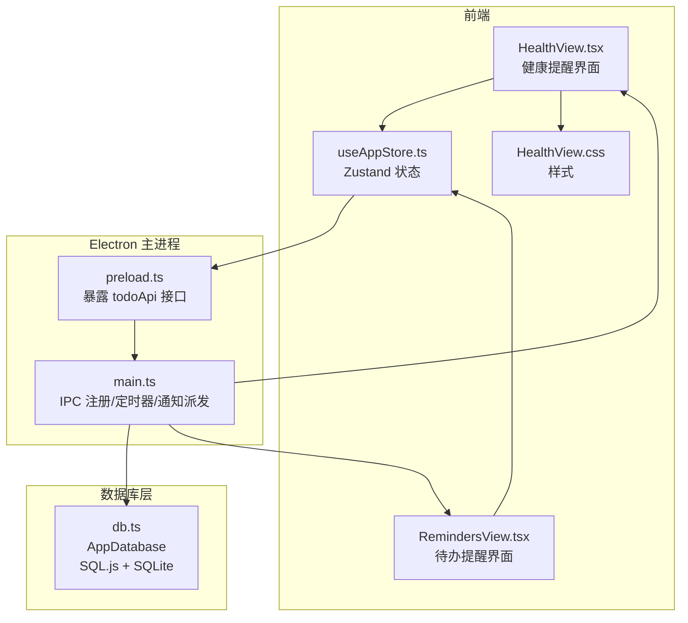
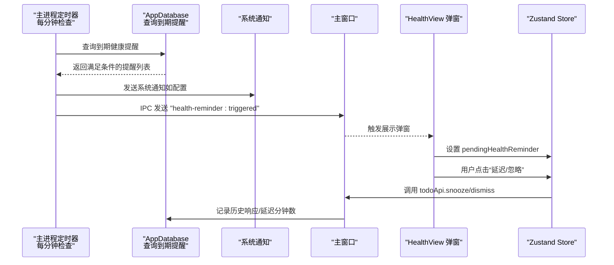
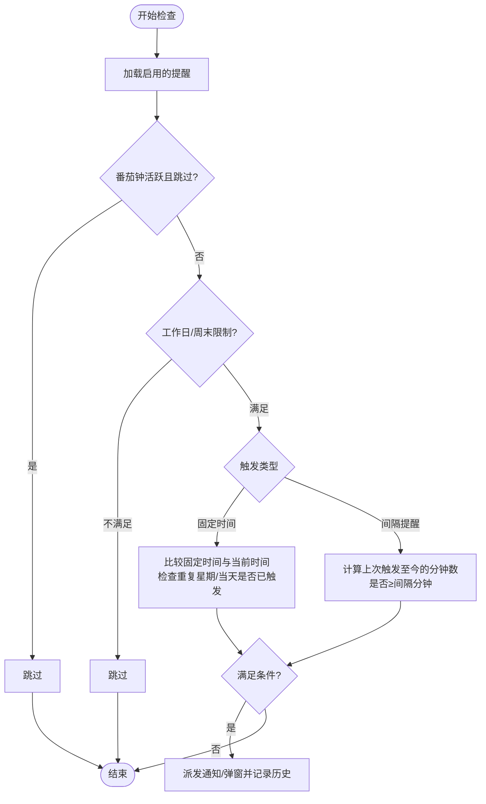
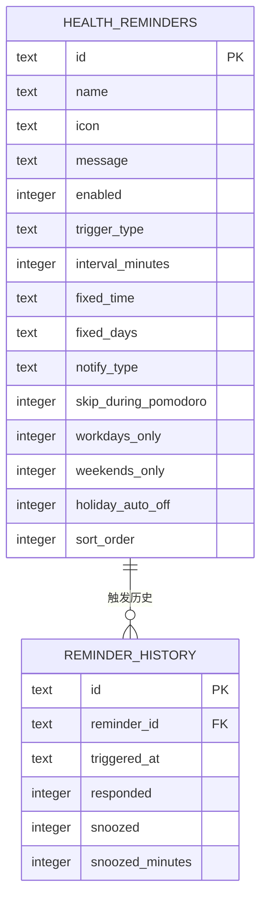
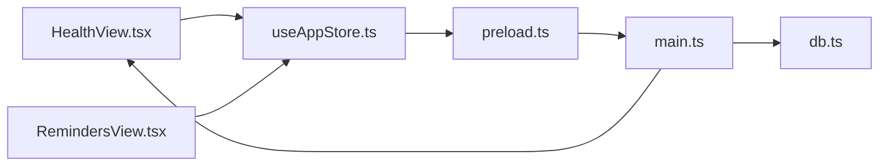

# 健康提醒系统

<cite>
**本文引用的文件**
- [HealthView.tsx](file://app/src/components/Health/HealthView.tsx)
- [RemindersView.tsx](file://app/src/components/Reminders/RemindersView.tsx)
- [useAppStore.ts](file://app/src/store/useAppStore.ts)
- [db.ts](file://app/electron/db.ts)
- [main.ts](file://app/electron/main.ts)
- [preload.ts](file://app/electron/preload.ts)
- [types.ts](file://app/src/types.ts)
- [HealthView.css](file://app/src/components/Health/HealthView.css)
</cite>

## 目录
1. [简介](#简介)
2. [项目结构](#项目结构)
3. [核心组件](#核心组件)
4. [架构总览](#架构总览)
5. [详细组件分析](#详细组件分析)
6. [依赖关系分析](#依赖关系分析)
7. [性能考量](#性能考量)
8. [故障排查指南](#故障排查指南)
9. [结论](#结论)
10. [附录](#附录)

## 简介
本文件面向 SnowTodo 的“健康提醒系统”，系统性地阐述健康提醒的配置与管理机制，包括：
- 提醒规则的设置与触发条件
- 提醒类型的分类与通知渠道
- 间隔提醒与固定时间提醒的实现原理与使用场景
- 工作日与周末提醒的差异化配置
- 提醒事件的触发机制、通知系统的集成、历史记录管理
- 用户交互处理与提醒确认流程
- 配置示例与最佳实践建议

## 项目结构
健康提醒系统由前端 React 组件、全局状态管理、Electron 主进程与数据库层共同组成：
- 前端 UI：健康提醒卡片、编辑面板、弹窗提醒
- 全局状态：Zustand store 管理提醒列表与待确认弹窗
- 主进程：定时轮询检查到期提醒，派发系统通知或弹窗
- 数据库：SQLite（sql.js）存储提醒规则、历史记录与默认模板

图表来源
- [HealthView.tsx:1-385](file://app/src/components/Health/HealthView.tsx#L1-L385)
- [RemindersView.tsx:1-103](file://app/src/components/Reminders/RemindersView.tsx#L1-L103)
- [useAppStore.ts:1-604](file://app/src/store/useAppStore.ts#L1-L604)
- [main.ts:1-391](file://app/electron/main.ts#L1-L391)
- [preload.ts:1-117](file://app/electron/preload.ts#L1-L117)
- [db.ts:1-1825](file://app/electron/db.ts#L1-L1825)

章节来源
- [HealthView.tsx:1-385](file://app/src/components/Health/HealthView.tsx#L1-L385)
- [useAppStore.ts:1-604](file://app/src/store/useAppStore.ts#L1-L604)
- [main.ts:1-391](file://app/electron/main.ts#L1-L391)
- [db.ts:1-1825](file://app/electron/db.ts#L1-L1825)

## 核心组件
- 健康提醒界面（HealthView.tsx）
  - 展示提醒卡片、编辑/新增面板、弹窗提醒
  - 支持启用/禁用、编辑、删除提醒
- 全局状态（useAppStore.ts）
  - 管理健康提醒列表与“待确认弹窗”
  - 提供 CRUD 与本地更新方法
- 主进程（main.ts）
  - 定时轮询检查到期健康提醒
  - 派发系统通知与/或弹窗
  - 处理“延迟”“忽略”操作并记录历史
- 数据库（db.ts）
  - 存储健康提醒规则、历史记录
  - 提供查询到期提醒、记录历史等方法
- 预加载桥接（preload.ts）
  - 暴露 todoApi 接口给渲染进程调用
- 类型定义（types.ts）
  - HealthReminder、ReminderHistoryEntry 等核心类型

章节来源
- [HealthView.tsx:1-385](file://app/src/components/Health/HealthView.tsx#L1-L385)
- [useAppStore.ts:1-604](file://app/src/store/useAppStore.ts#L1-L604)
- [main.ts:1-391](file://app/electron/main.ts#L1-L391)
- [db.ts:1-1825](file://app/electron/db.ts#L1-L1825)
- [preload.ts:1-117](file://app/electron/preload.ts#L1-L117)
- [types.ts:1-278](file://app/src/types.ts#L1-L278)

## 架构总览
健康提醒系统采用“主进程定时扫描 + 渲染进程 UI 管理 + 数据库存储”的分层设计：
- 主进程每分钟扫描一次到期健康提醒，过滤掉重复触发与番茄钟期间的提醒
- 符合条件的提醒通过系统通知与/或弹窗发送至渲染进程
- 渲染进程根据用户选择执行“延迟”或“忽略”，并记录历史

图表来源
- [main.ts:161-177](file://app/electron/main.ts#L161-L177)
- [db.ts:1405-1467](file://app/electron/db.ts#L1405-L1467)
- [HealthView.tsx:259-297](file://app/src/components/Health/HealthView.tsx#L259-L297)
- [useAppStore.ts:425-438](file://app/src/store/useAppStore.ts#L425-L438)

## 详细组件分析

### 健康提醒规则与类型
- 规则字段
  - 名称、图标、提示语
  - 启用开关、排序序号
  - 触发类型：间隔提醒（分钟）、固定时间提醒（HH:mm，可选重复星期）
  - 通知类型：系统通知、弹窗提醒、两者皆有
  - 特殊策略：番茄钟期间跳过、仅工作日、仅周末、节假日自动关闭
- 默认模板
  - 包含喝水、活动、眼保健操、深呼吸、番茄休息、下班提醒、吃药提醒等

章节来源
- [types.ts:63-98](file://app/src/types.ts#L63-L98)
- [db.ts:545-562](file://app/electron/db.ts#L545-L562)

### 触发条件与实现原理
- 间隔提醒
  - 基于上次触发时间与当前时间差判断是否超过设定分钟数
- 固定时间提醒
  - 比较当前时间与固定时间；若在当天内且未触发过，则触发
  - 可限制在指定星期几触发
- 番茄钟期间跳过
  - 若开启且番茄钟处于活跃状态，则跳过该提醒
- 工作日/周末限制
  - 仅工作日：周末不触发
  - 仅周末：工作日不触发
- 历史去重
  - 每天同一固定时间只允许触发一次

图表来源
- [db.ts:1405-1457](file://app/electron/db.ts#L1405-L1457)

章节来源
- [db.ts:1405-1457](file://app/electron/db.ts#L1405-L1457)

### 通知系统集成
- 系统通知
  - 使用 Electron Notification 发送系统级通知
- 弹窗提醒
  - 主进程恢复/显示主窗口并聚焦，向渲染进程发送 IPC
  - 渲染进程通过 Zustand store 显示弹窗，支持“延迟/忽略”

章节来源
- [main.ts:141-159](file://app/electron/main.ts#L141-L159)
- [HealthView.tsx:259-297](file://app/src/components/Health/HealthView.tsx#L259-L297)
- [useAppStore.ts:425-438](file://app/src/store/useAppStore.ts#L425-L438)

### 历史记录管理
- 表结构
  - 记录提醒触发时间、是否响应、是否延迟、延迟分钟数
- 查询接口
  - 支持按提醒 ID 或全局查询最近 N 条记录
- 记录时机
  - 触发成功即记录；用户“延迟”会记录延迟分钟数；“忽略”记录响应但未延迟

章节来源
- [db.ts:1469-1481](file://app/electron/db.ts#L1469-L1481)
- [main.ts:157-159](file://app/electron/main.ts#L157-L159)
- [main.ts:306-311](file://app/electron/main.ts#L306-L311)

### 用户交互与确认流程
- 弹窗交互
  - “10 分钟后提醒”“30 分钟后提醒”“好的，知道了”
  - 调用 todoApi.snooze/dismiss，主进程记录历史
- 编辑/新增
  - 支持图标选择、名称、消息、触发类型、间隔/固定时间、重复星期、通知类型、特殊策略
- 列表管理
  - 启用/禁用、排序、删除；支持新建与编辑面板

章节来源
- [HealthView.tsx:71-256](file://app/src/components/Health/HealthView.tsx#L71-L256)
- [HealthView.tsx:259-297](file://app/src/components/Health/HealthView.tsx#L259-L297)
- [useAppStore.ts:425-438](file://app/src/store/useAppStore.ts#L425-L438)

### 数据模型与持久化
- 健康提醒表
  - 字段覆盖触发类型、间隔分钟、固定时间、重复星期、通知类型、特殊策略、排序等
- 历史表
  - 关联健康提醒，记录触发与响应情况
- 默认模板
  - 应用初始化时插入默认健康提醒

图表来源
- [db.ts:120-145](file://app/electron/db.ts#L120-L145)
- [db.ts:402-428](file://app/electron/db.ts#L402-L428)

章节来源
- [db.ts:120-145](file://app/electron/db.ts#L120-L145)
- [db.ts:402-428](file://app/electron/db.ts#L402-L428)

## 依赖关系分析
- 前端依赖
  - HealthView.tsx 依赖 useAppStore.ts 管理状态与 todoApi 接口
  - RemindersView.tsx 管理待办提醒（与健康提醒不同模块）
- 主进程依赖
  - main.ts 注册 IPC、启动定时器、派发通知
  - db.ts 提供健康提醒查询与历史记录
- 预加载桥接
  - preload.ts 将 IPC 方法暴露为 window.todoApi

图表来源
- [HealthView.tsx:1-385](file://app/src/components/Health/HealthView.tsx#L1-L385)
- [RemindersView.tsx:1-103](file://app/src/components/Reminders/RemindersView.tsx#L1-L103)
- [useAppStore.ts:1-604](file://app/src/store/useAppStore.ts#L1-L604)
- [preload.ts:1-117](file://app/electron/preload.ts#L1-L117)
- [main.ts:1-391](file://app/electron/main.ts#L1-L391)
- [db.ts:1-1825](file://app/electron/db.ts#L1-L1825)

章节来源
- [HealthView.tsx:1-385](file://app/src/components/Health/HealthView.tsx#L1-L385)
- [RemindersView.tsx:1-103](file://app/src/components/Reminders/RemindersView.tsx#L1-L103)
- [useAppStore.ts:1-604](file://app/src/store/useAppStore.ts#L1-L604)
- [preload.ts:1-117](file://app/electron/preload.ts#L1-L117)
- [main.ts:1-391](file://app/electron/main.ts#L1-L391)
- [db.ts:1-1825](file://app/electron/db.ts#L1-L1825)

## 性能考量
- 定时轮询频率
  - 健康提醒每分钟检查一次，待办提醒每 30 秒检查一次，避免频繁 IO
- 历史去重
  - 固定时间提醒按“当天+固定时间”维度去重，减少重复触发
- 番茄钟跳过
  - 在番茄钟活跃时跳过健康提醒，避免打断专注
- 数据库索引
  - 对健康提醒启用列建立索引，提升查询效率

章节来源
- [main.ts:161-177](file://app/electron/main.ts#L161-L177)
- [db.ts:197-206](file://app/electron/db.ts#L197-L206)
- [db.ts:1424-1443](file://app/electron/db.ts#L1424-L1443)

## 故障排查指南
- 提醒未触发
  - 检查提醒是否启用、是否处于番茄钟活跃且勾选“跳过”
  - 检查工作日/周末限制是否与当前日期匹配
  - 检查固定时间是否已过且当天是否已触发
- 重复触发
  - 固定时间提醒按“当天+固定时间”维度去重，确保未被提前触发
- 弹窗不显示
  - 确认通知类型包含“弹窗提醒”或“两者皆有”
  - 检查主进程是否正确发送 IPC 并恢复/聚焦主窗口
- 历史记录异常
  - 检查历史表字段是否正确写入（响应/延迟/分钟数）

章节来源
- [db.ts:1405-1457](file://app/electron/db.ts#L1405-L1457)
- [main.ts:141-159](file://app/electron/main.ts#L141-L159)
- [HealthView.tsx:259-297](file://app/src/components/Health/HealthView.tsx#L259-L297)

## 结论
SnowTodo 的健康提醒系统通过清晰的规则定义、严格的触发条件与完善的用户交互，实现了灵活而可靠的健康提醒能力。其分层架构保证了可维护性与扩展性，适合在日常工作中帮助用户养成良好习惯。

## 附录

### 配置示例与最佳实践
- 间隔提醒
  - 场景：定时喝水、活动、深呼吸
  - 建议：间隔 30–90 分钟，通知类型选“系统通知”或“两者皆有”
- 固定时间提醒
  - 场景：眼保健操、下班提醒、吃药
  - 建议：固定时间设为 14:00、18:00、08:00；工作日/周末限制按需开启
- 番茄钟期间跳过
  - 建议：启用以避免打断专注
- 通知类型
  - 建议：工作场景优先“系统通知”，个人场景可选“弹窗提醒”或“两者皆有”
- 历史记录
  - 建议：定期查看历史，优化间隔与固定时间，提升使用体验

章节来源
- [types.ts:63-98](file://app/src/types.ts#L63-L98)
- [db.ts:545-562](file://app/electron/db.ts#L545-L562)