# 功能模块

<cite>
**本文引用的文件**
- [TodoList.tsx](file://app/src/components/Content/TodoList.tsx)
- [DetailPanel.tsx](file://app/src/components/DetailPanel/DetailPanel.tsx)
- [Toolbar.tsx](file://app/src/components/Toolbar/Toolbar.tsx)
- [PomodoroView.tsx](file://app/src/components/Pomodoro/PomodoroView.tsx)
- [HealthView.tsx](file://app/src/components/Health/HealthView.tsx)
- [AIView.tsx](file://app/src/components/AI/AIView.tsx)
- [DashboardView.tsx](file://app/src/components/Dashboard/DashboardView.tsx)
- [ProjectsView.tsx](file://app/src/components/Projects/ProjectsView.tsx)
- [RecurringTodosView.tsx](file://app/src/components/RecurringTodos/RecurringTodosView.tsx)
- [RecurringTodoPanel.tsx](file://app/src/components/RecurringTodos/RecurringTodoPanel.tsx)
- [TimeBlockView.tsx](file://app/src/components/TimeBlock/TimeBlockView.tsx)
- [RemindersView.tsx](file://app/src/components/Reminders/RemindersView.tsx)
- [types.ts](file://app/src/types.ts)
- [useAppStore.ts](file://app/src/store/useAppStore.ts)
- [main.ts](file://app/electron/main.ts)
</cite>

## 目录
1. [简介](#简介)
2. [项目结构](#项目结构)
3. [核心组件](#核心组件)
4. [架构总览](#架构总览)
5. [详细组件分析](#详细组件分析)
6. [依赖关系分析](#依赖关系分析)
7. [性能考量](#性能考量)
8. [故障排查指南](#故障排查指南)
9. [结论](#结论)
10. [附录](#附录)

## 简介
本文件面向 SnowTodo 的各功能模块，系统化梳理其设计理念、实现原理与使用方法。覆盖基础待办管理（TodoList）、搜索与过滤、排序；番茄工作法（PomodoroView）的专注计时、打断记录与统计；健康提醒（HealthView）的规则配置与触发机制；AI 智能助手（AIView）的多平台服务集成；数据仪表盘（DashboardView）的统计分析；项目管理（ProjectsView）的进度追踪；重复任务（RecurringTodosView）的自动生成机制；时间块（TimeBlockView）的日程可视化；提醒管理（RemindersView）的事件处理等。每个模块均提供使用示例、配置选项、API 接口说明与常见问题解决方案。

## 项目结构
应用采用前端 React + Electron 主进程的双层架构：
- 前端负责 UI 组件与状态管理（Zustand），通过 window.todoApi 与主进程通信。
- 主进程负责数据库操作、定时任务（提醒、健康提醒、每日待办生成）、全局快捷键、托盘与通知等系统能力。

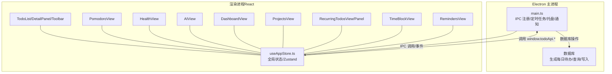

**图表来源**
- [main.ts:360-391](file://app/electron/main.ts#L360-L391)
- [useAppStore.ts:541-604](file://app/src/store/useAppStore.ts#L541-L604)

**章节来源**
- [main.ts:18-52](file://app/electron/main.ts#L18-L52)
- [useAppStore.ts:181-508](file://app/src/store/useAppStore.ts#L181-L508)

## 核心组件
- TodoList：按视图（今日/全部/即将到期/已完成/分类/标签）聚合展示待办，支持空状态提示与详情面板打开。
- DetailPanel：统一的待办编辑/新建表单，支持图片拖拽粘贴、标签与分类选择、重复规则、提醒设置、置顶等。
- Toolbar：视图标题、搜索框、优先级筛选与“新建待办”入口。
- PomodoroView：番茄钟计时器、阶段切换、设置面板、打断记录、历史与统计。
- HealthView：健康提醒卡片、编辑面板、弹窗提醒与“稍后再提醒/忽略”交互。
- AIView：多平台 AI 服务接入（OpenAI/Claude/通义/文心/自定义），聊天界面与快捷指令。
- DashboardView：近 N 日趋势图与环形统计、任务完成率与番茄完成率等指标。
- ProjectsView：项目进度月历视图与日视图，支持置红标记、图片缩略与放大预览。
- RecurringTodosView/Panel：每日待办模板的创建、编辑、启用/停用、自动生成与提醒配置。
- TimeBlockView：日程时间块可视化，支持颜色、备注、关联任务、全天模式。
- RemindersView：基于截止时间的提醒列表（已错过/即将提醒）。

**章节来源**
- [TodoList.tsx:16-75](file://app/src/components/Content/TodoList.tsx#L16-L75)
- [DetailPanel.tsx:33-507](file://app/src/components/DetailPanel/DetailPanel.tsx#L33-L507)
- [Toolbar.tsx:16-78](file://app/src/components/Toolbar/Toolbar.tsx#L16-L78)
- [PomodoroView.tsx:160-480](file://app/src/components/Pomodoro/PomodoroView.tsx#L160-L480)
- [HealthView.tsx:300-385](file://app/src/components/Health/HealthView.tsx#L300-L385)
- [AIView.tsx:125-331](file://app/src/components/AI/AIView.tsx#L125-L331)
- [DashboardView.tsx:125-272](file://app/src/components/Dashboard/DashboardView.tsx#L125-L272)
- [ProjectsView.tsx:318-355](file://app/src/components/Projects/ProjectsView.tsx#L318-L355)
- [RecurringTodosView.tsx:28-218](file://app/src/components/RecurringTodos/RecurringTodosView.tsx#L28-L218)
- [RecurringTodoPanel.tsx:46-368](file://app/src/components/RecurringTodos/RecurringTodoPanel.tsx#L46-L368)
- [TimeBlockView.tsx:229-348](file://app/src/components/TimeBlock/TimeBlockView.tsx#L229-L348)
- [RemindersView.tsx:5-103](file://app/src/components/Reminders/RemindersView.tsx#L5-L103)

## 架构总览
- 状态与计算：useAppStore 提供 todos、分类、标签、设置、Pomodoro、健康提醒、AI、时间块、统计数据等状态与派生计算（如 getFilteredTodos/getTodayTodos/getUpcomingTodos/getCompletedTodos）。
- 事件与定时：主进程定时扫描“到期提醒”与“健康提醒”，触发系统通知与弹窗；监听全局快捷键控制 Pomodoro。
- 数据持久化：所有 CRUD 通过 window.todoApi.* 与主进程 IPC 交互，主进程写入数据库。

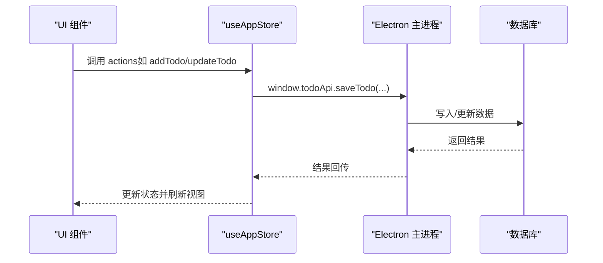

**图表来源**
- [useAppStore.ts:541-604](file://app/src/store/useAppStore.ts#L541-L604)
- [main.ts:227-260](file://app/electron/main.ts#L227-L260)

**章节来源**
- [useAppStore.ts:136-176](file://app/src/store/useAppStore.ts#L136-L176)
- [main.ts:120-139](file://app/electron/main.ts#L120-L139)

## 详细组件分析

### 基础待办管理（TodoList）
- 设计理念
  - 视图驱动：根据 currentView 切换数据源（今日/全部/即将到期/已完成/分类/标签），统一渲染逻辑。
  - 空状态友好：针对不同视图提供引导文案与“新建待办”入口。
  - 交互简洁：点击任务项打开详情面板，复选框切换完成状态。
- 实现要点
  - 使用 store.getFilteredTodos/getTodayTodos/getUpcomingTodos/getCompletedTodos/getTodosByCategory/getTodosByTag 等派生函数。
  - 完成/恢复通过 window.todoApi.toggleTodo 与 store.updateTodo 更新本地状态。
- 使用示例
  - 在“全部待办”视图中，输入搜索词“会议”可快速定位相关任务。
  - 点击“分类”视图中的某个分类，即可看到该分类下的待办与已完成任务。
- 配置选项
  - 通过 Toolbar 的搜索框与优先级筛选进行快速过滤。
  - 详情面板中可设置优先级、截止时间、开始日期、分类、标签、重复规则、提醒方式与时间、置顶等。
- API 接口
  - window.todoApi.saveTodo/saveTodo/toggleTodo/deleteTodo/restoreTodo/createCategory/createTag 等。
- 常见问题
  - “今日待办”为空：检查任务的 dueDate 是否为今天或之前，以及是否设置了 startDate 且尚未到达。
  - 搜索无效：确认搜索词大小写不敏感，且在 title 或 notes 中匹配。

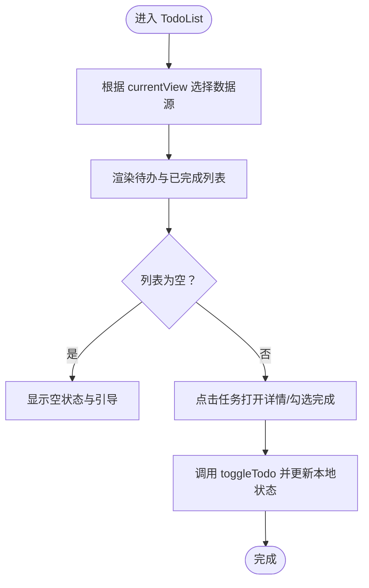

**图表来源**
- [TodoList.tsx:27-75](file://app/src/components/Content/TodoList.tsx#L27-L75)
- [useAppStore.ts:327-380](file://app/src/store/useAppStore.ts#L327-L380)

**章节来源**
- [TodoList.tsx:16-75](file://app/src/components/Content/TodoList.tsx#L16-L75)
- [Toolbar.tsx:16-78](file://app/src/components/Toolbar/Toolbar.tsx#L16-L78)
- [DetailPanel.tsx:166-185](file://app/src/components/DetailPanel/DetailPanel.tsx#L166-L185)
- [useAppStore.ts:327-380](file://app/src/store/useAppStore.ts#L327-L380)

### 番茄工作法（PomodoroView）
- 设计理念
  - 以阶段驱动的状态机（空闲/专注/短休息/长休息），自动推进与打断记录，结合声音与 UI 提示。
  - 支持全局快捷键、关联任务、今日统计与历史记录。
- 实现要点
  - store 管理 pomodoroSettings/pomodoroPhase/pomodoroSecondsLeft/pomodoroSession/pomodoroSessions。
  - 主进程注册全局快捷键，发送“pomodoro:toggle”事件；主进程维护 isPomodoroActive 并广播“pomodoro:active-changed”。
  - 完成专注后创建 PomodoroSession，并更新今日 sessions。
- 使用示例
  - 设置“专注时长 25 分钟、短休息 5 分钟、长休息 15 分钟、长休息周期 4 个”，启动后自动进入专注阶段。
  - 在专注中点击“中断”，填写原因并确认，系统记录打断次数与原因。
- 配置选项
  - 专注/短/长时长、长休息周期、全局快捷键、声音提醒。
- API 接口
  - window.todoApi.getPomodoroSettings/updatePomodoroSettings/createPomodoroSession/getTodayPomodoroSessions/setPomodoroActive/onPomodoroToggle/onPomodoroActiveChanged。
- 常见问题
  - 快捷键无效：检查主进程是否成功注册全局快捷键，确认设置中的快捷键格式正确。
  - 无法保存打断：确保在专注阶段点击“中断”并填写原因，系统会创建打断 session。

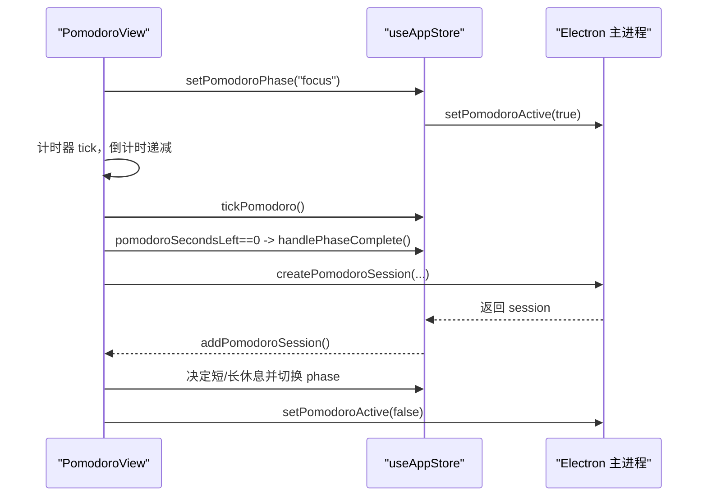

**图表来源**
- [PomodoroView.tsx:234-283](file://app/src/components/Pomodoro/PomodoroView.tsx#L234-L283)
- [useAppStore.ts:394-420](file://app/src/store/useAppStore.ts#L394-L420)
- [main.ts:286-292](file://app/electron/main.ts#L286-L292)

**章节来源**
- [PomodoroView.tsx:160-480](file://app/src/components/Pomodoro/PomodoroView.tsx#L160-L480)
- [main.ts:179-193](file://app/electron/main.ts#L179-L193)
- [types.ts:27-48](file://app/src/types.ts#L27-L48)

### 健康提醒（HealthView）
- 设计理念
  - 多种触发方式（间隔/固定时间）、多种通知方式（系统通知/弹窗/两者），支持工作日/周末限制、节假日自动关闭、番茄钟期间跳过等。
- 实现要点
  - store 管理 healthReminders 与 pendingHealthReminder；主进程定时扫描到期健康提醒，触发系统通知与弹窗。
  - 弹窗支持“稍后再提醒（10/30 分钟）”与“忽略”。
- 使用示例
  - 新建“喝水提醒”，触发方式为“间隔 60 分钟”，通知方式为“系统通知”，启用“番茄钟时跳过”。
  - 弹窗出现后点击“稍后再提醒 30 分钟”，下次同一提醒将延后。
- 配置选项
  - 名称/图标/消息、触发方式（间隔/固定）、间隔分钟数/固定时间与重复星期、通知方式、跳过番茄钟、仅工作日/仅周末、节假日自动关闭。
- API 接口
  - window.todoApi.getHealthReminders/create/update/delete/snooze/dismiss/onHealthReminderTriggered。
- 常见问题
  - 弹窗不出现：确认通知权限已开启，且提醒类型为“弹窗/两者”。

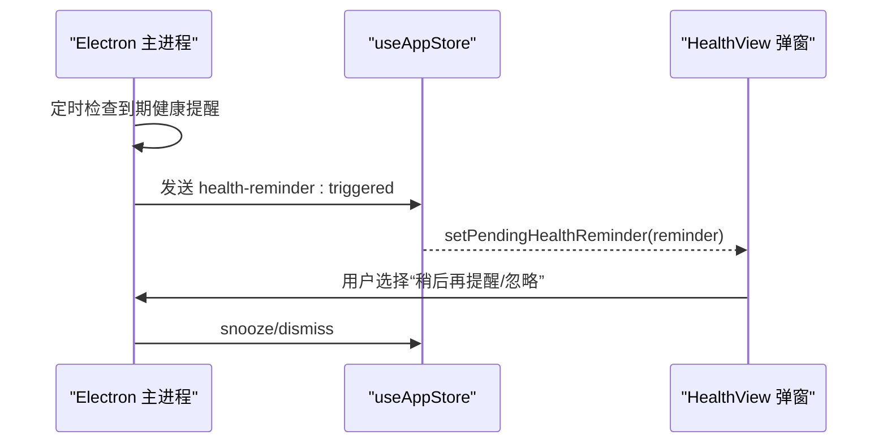

**图表来源**
- [HealthView.tsx:259-297](file://app/src/components/Health/HealthView.tsx#L259-L297)
- [main.ts:141-177](file://app/electron/main.ts#L141-L177)

**章节来源**
- [HealthView.tsx:300-385](file://app/src/components/Health/HealthView.tsx#L300-L385)
- [main.ts:161-177](file://app/electron/main.ts#L161-L177)

### AI 智能助手（AIView）
- 设计理念
  - 支持多平台服务（OpenAI/Claude/通义/文心/自定义），提供任务分析、拆分子任务、制定计划等智能建议。
- 实现要点
  - store 管理 aiSettings 与 isAISettingsLoaded；UI 构造 system prompt，拼接最近对话历史，调用外部 API 获取回复。
  - 支持 Temperature、最大 Token、代理等参数。
- 使用示例
  - 在右上角设置 API Key 与模型，点击“📋 分析今日任务”获取优先级建议与番茄计划。
- 配置选项
  - 服务提供商、API 地址、API Key、模型名、Temperature、代理地址。
- API 接口
  - window.todoApi.getAISettings/updateAISettings。
- 常见问题
  - 请求失败：检查 API Key、网络连通性与代理设置；确认模型名称与服务提供商匹配。

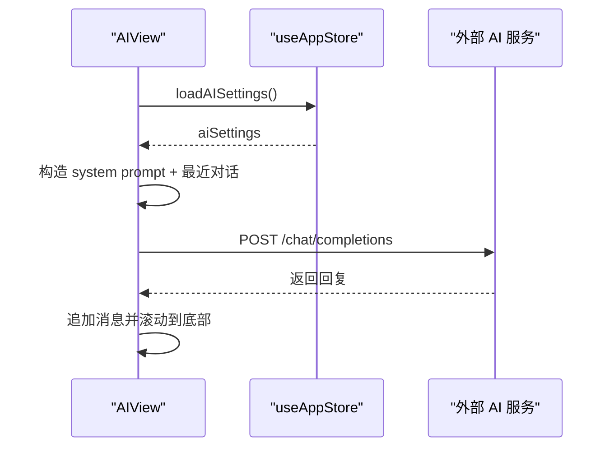

**图表来源**
- [AIView.tsx:125-331](file://app/src/components/AI/AIView.tsx#L125-L331)
- [useAppStore.ts:541-604](file://app/src/store/useAppStore.ts#L541-L604)

**章节来源**
- [AIView.tsx:125-331](file://app/src/components/AI/AIView.tsx#L125-L331)
- [types.ts:119-133](file://app/src/types.ts#L119-L133)

### 数据仪表盘（DashboardView）
- 设计理念
  - 展示近 N 日的趋势与汇总，包含任务完成数、专注时长、番茄数、中断次数与完成率等关键指标。
- 实现要点
  - store 提供 dailyStats；UI 填充缺失日期、计算汇总与环形图百分比。
- 使用示例
  - 切换“近 7/14/30 天”，查看趋势变化；对比今日完成任务与专注时长。
- 配置选项
  - 选择时间范围（7/14/30 天）。
- API 接口
  - window.todoApi.getDailyStats。
- 常见问题
  - 图表断层：系统会自动填充缺失日期，确保连续性。

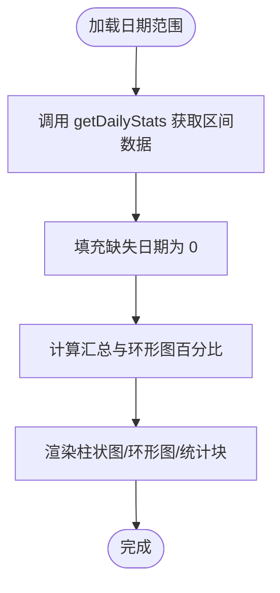

**图表来源**
- [DashboardView.tsx:125-272](file://app/src/components/Dashboard/DashboardView.tsx#L125-L272)
- [useAppStore.ts:467-471](file://app/src/store/useAppStore.ts#L467-L471)

**章节来源**
- [DashboardView.tsx:125-272](file://app/src/components/Dashboard/DashboardView.tsx#L125-L272)

### 项目管理（ProjectsView）
- 设计理念
  - 月视图与日视图结合，支持内容文本、图片缩略、置红标记与放大预览，便于项目进度可视化。
- 实现要点
  - store 提供 projectCells；月视图批量加载，日视图按需加载；支持拖拽/粘贴图片上传。
- 使用示例
  - 在月视图中点击某日进入日视图，输入内容并上传图片；可对日期置红标记。
- 配置选项
  - 无额外配置项，主要为交互与数据输入。
- API 接口
  - window.todoApi.getProjectCellsByMonth/getProjectCell/upsertProjectCell。
- 常见问题
  - 图片过大：建议在日视图中使用缩略图浏览，必要时压缩后再上传。

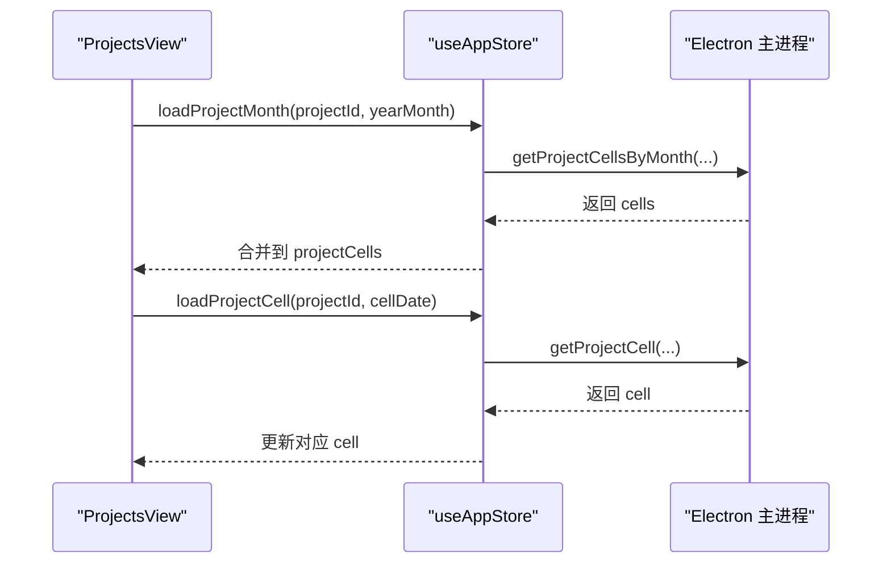

**图表来源**
- [ProjectsView.tsx:45-144](file://app/src/components/Projects/ProjectsView.tsx#L45-L144)
- [useAppStore.ts:473-507](file://app/src/store/useAppStore.ts#L473-L507)
- [main.ts:349-357](file://app/electron/main.ts#L349-L357)

**章节来源**
- [ProjectsView.tsx:318-355](file://app/src/components/Projects/ProjectsView.tsx#L318-L355)
- [useAppStore.ts:473-507](file://app/src/store/useAppStore.ts#L473-L507)

### 重复任务（RecurringTodosView）
- 设计理念
  - 通过模板化的“每日待办”自动在指定周期生成实例，支持提醒与分类标签。
- 实现要点
  - store 提供 recurringTodos；主进程定时生成每日待办；UI 支持启用/停用、编辑、删除。
- 使用示例
  - 创建“每天发日报”，启用提醒并在 09:00 弹窗；系统会在每天生成对应的待办实例。
- 配置选项
  - 重复规则（每天/工作日/周末/自定义）、自定义星期、提醒开关与提醒时间、优先级、分类、标签、状态。
- API 接口
  - window.todoApi.getRecurringTodos/create/update/delete/generateDailyTodos。
- 常见问题
  - 未生成实例：确认模板处于“启用”状态，且主进程定时任务正常运行。

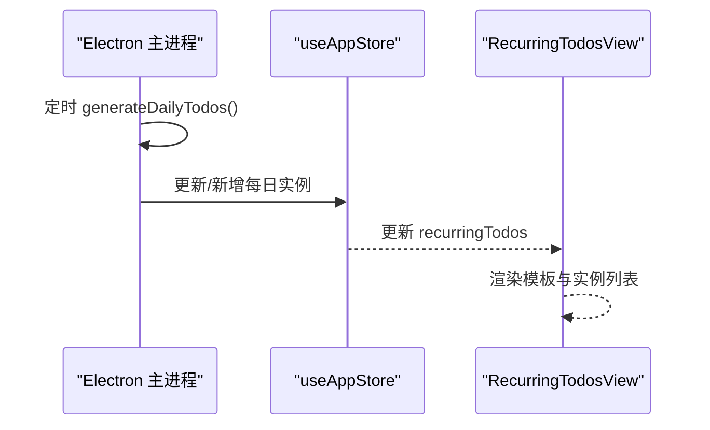

**图表来源**
- [RecurringTodosView.tsx:28-218](file://app/src/components/RecurringTodos/RecurringTodosView.tsx#L28-L218)
- [main.ts:127-129](file://app/electron/main.ts#L127-L129)

**章节来源**
- [RecurringTodosView.tsx:28-218](file://app/src/components/RecurringTodos/RecurringTodosView.tsx#L28-L218)
- [RecurringTodoPanel.tsx:46-368](file://app/src/components/RecurringTodos/RecurringTodoPanel.tsx#L46-L368)
- [main.ts:127-129](file://app/electron/main.ts#L127-L129)

### 时间块（TimeBlockView）
- 设计理念
  - 将一天 24 小时映射为可视化的“时间块”，支持颜色、备注、关联任务与全天模式。
- 实现要点
  - store 提供 timeBlocks 与 timeBlockDate；UI 计算块位置与高度，支持当前时间指示线。
- 使用示例
  - 在“2025-04-05”创建“会议”时间块（09:00–10:00），关联“准备材料”任务，设置颜色为蓝色。
- 配置选项
  - 标题、关联任务、开始/结束时间、颜色、备注、分类、是否全天、实际番茄数。
- API 接口
  - window.todoApi.getTimeBlocks/create/update/delete。
- 常见问题
  - 时间块重叠：调整开始/结束时间或颜色区分。

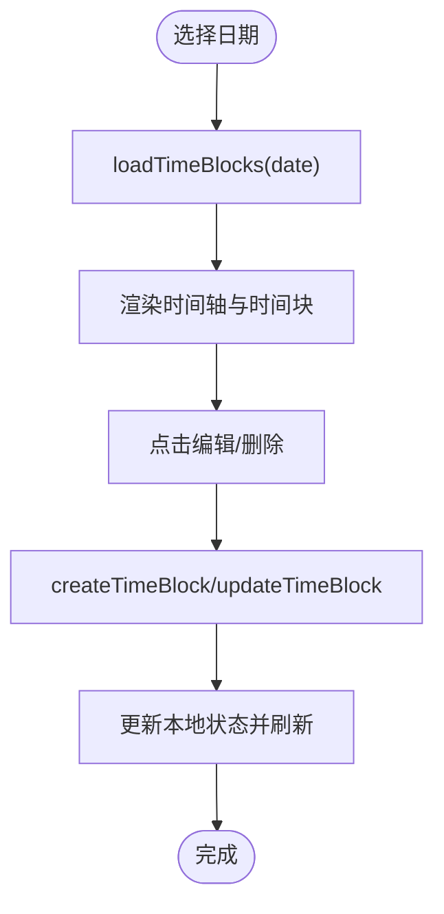

**图表来源**
- [TimeBlockView.tsx:229-348](file://app/src/components/TimeBlock/TimeBlockView.tsx#L229-L348)
- [useAppStore.ts:454-462](file://app/src/store/useAppStore.ts#L454-L462)

**章节来源**
- [TimeBlockView.tsx:229-348](file://app/src/components/TimeBlock/TimeBlockView.tsx#L229-L348)

### 提醒管理（RemindersView）
- 设计理念
  - 按截止时间展示“已错过”与“即将提醒”的待办，支持点击跳转详情。
- 实现要点
  - store 提供 getPendingReminders；UI 过滤并排序，显示倒计时。
- 使用示例
  - 查看“即将提醒”列表，点击某任务跳转详情面板。
- 配置选项
  - 无额外配置项，依赖待办的提醒设置。
- API 接口
  - 依赖 store 的 getPendingReminders 与 openDetailPanel。
- 常见问题
  - 无提醒：确认待办已启用提醒且提醒时间已到。

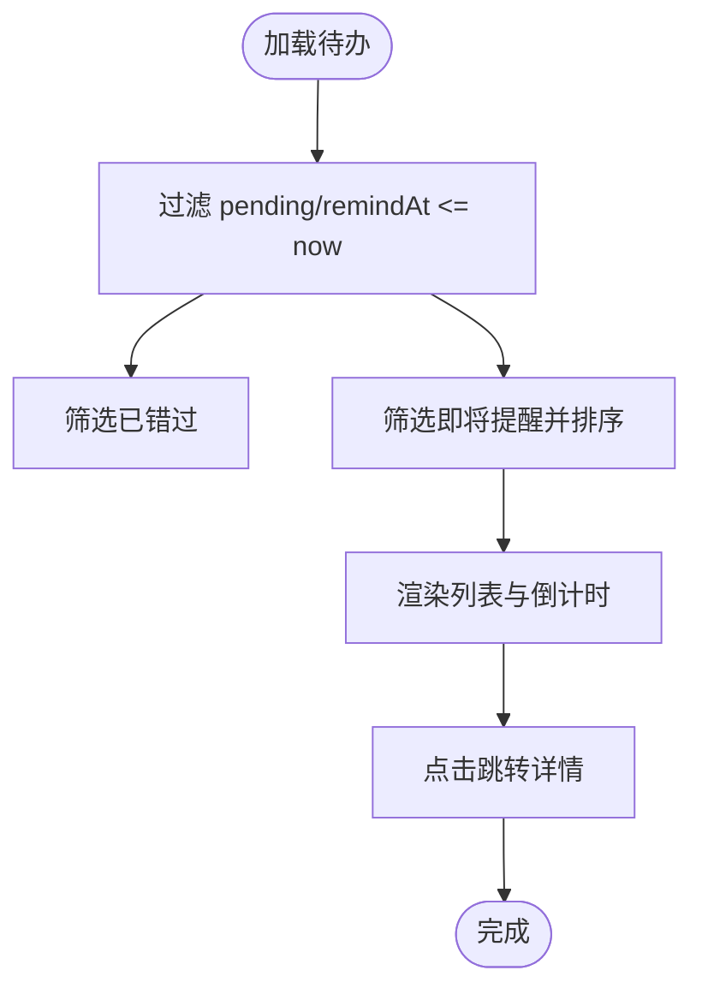

**图表来源**
- [RemindersView.tsx:5-103](file://app/src/components/Reminders/RemindersView.tsx#L5-L103)
- [useAppStore.ts:382-389](file://app/src/store/useAppStore.ts#L382-L389)

**章节来源**
- [RemindersView.tsx:5-103](file://app/src/components/Reminders/RemindersView.tsx#L5-L103)

## 依赖关系分析
- 组件耦合
  - TodoList/DetailPanel/Toolbar 与 store 高度耦合，通过派生函数与 actions 解耦业务逻辑。
  - PomodoroView 与主进程强耦合（全局快捷键、活动状态广播）。
  - HealthView 与主进程强耦合（定时扫描与弹窗）。
- 外部依赖
  - Electron 主进程提供 IPC、定时器、托盘、通知。
  - 外部 AI 服务（OpenAI/Claude/通义/文心/自定义）。
- 可能的循环依赖
  - 未发现组件间直接循环依赖；store 作为单一事实来源避免循环。

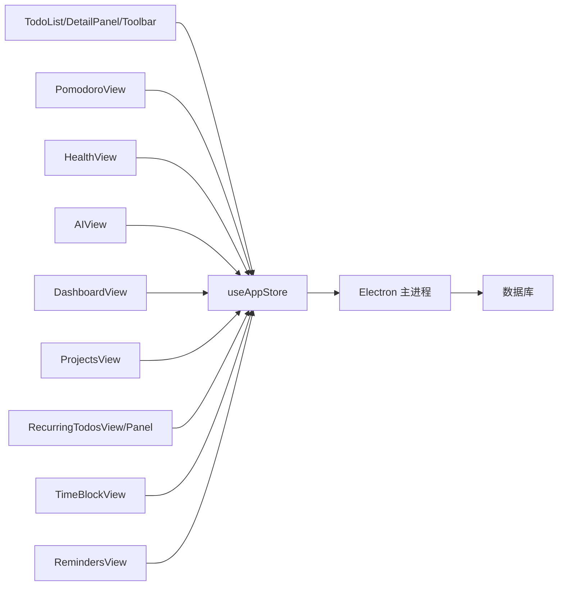

**图表来源**
- [useAppStore.ts:181-508](file://app/src/store/useAppStore.ts#L181-L508)
- [main.ts:227-358](file://app/electron/main.ts#L227-L358)

**章节来源**
- [useAppStore.ts:181-508](file://app/src/store/useAppStore.ts#L181-L508)
- [main.ts:227-358](file://app/electron/main.ts#L227-L358)

## 性能考量
- 渲染优化
  - TodoList 使用派生函数过滤与排序，避免重复计算；分页/虚拟化可进一步优化大量数据场景。
- 状态更新
  - 使用局部更新（如 addPomodoroSession/addTimeBlock）减少重渲染。
- 定时任务
  - 主进程定时器（提醒/健康提醒/每日待办）间隔合理，避免频繁 IO。
- 网络请求
  - AI 请求应限制并发与缓存历史消息，避免频繁调用外部 API。

## 故障排查指南
- 番茄钟快捷键无效
  - 检查主进程是否注册成功，确认设置中的快捷键格式；重启应用后生效。
- 健康提醒弹窗不出现
  - 确认系统通知权限；检查提醒类型为“弹窗/两者”。
- AI 请求失败
  - 检查 API Key、网络连通性与代理设置；确认模型名称与服务提供商匹配。
- 重复任务未生成
  - 确认模板处于“启用”状态；检查主进程定时任务是否运行。
- 项目图片上传失败
  - 确认文件类型为图片；检查磁盘空间与权限。

**章节来源**
- [main.ts:179-193](file://app/electron/main.ts#L179-L193)
- [HealthView.tsx:259-297](file://app/src/components/Health/HealthView.tsx#L259-L297)
- [AIView.tsx:163-233](file://app/src/components/AI/AIView.tsx#L163-L233)
- [main.ts:127-129](file://app/electron/main.ts#L127-L129)

## 结论
SnowTodo 通过清晰的模块划分与统一的状态管理，实现了从基础待办到高级效率工具的完整闭环。前端组件围绕 store 构建，主进程提供系统级能力与数据持久化，二者通过 IPC 紧密协作。各模块在设计上强调易用性与可扩展性，适合个人与团队持续迭代使用。

## 附录
- 类型定义参考
  - Todo、Category、Tag、Settings、PomodoroSession/Settings、HealthReminder、TimeBlock、AISettings、DailyStats、RecurringTodo 等。
- 常用 API 汇总
  - 待办：saveTodo/toggleTodo/deleteTodo/restoreTodo/createCategory/createTag。
  - 重复任务：getRecurringTodos/create/update/delete/generateDailyTodos。
  - 番茄钟：getPomodoroSettings/updatePomodoroSettings/createPomodoroSession/getTodayPomodoroSessions/setPomodoroActive/onPomodoroToggle。
  - 健康提醒：getHealthReminders/create/update/delete/snooze/dismiss/onHealthReminderTriggered。
  - AI：getAISettings/updateAISettings。
  - 时间块：getTimeBlocks/create/update/delete。
  - 仪表盘：getDailyStats。
  - 项目：getProjectCellsByMonth/getProjectCell/upsertProjectCell。

**章节来源**
- [types.ts:168-278](file://app/src/types.ts#L168-L278)
- [useAppStore.ts:541-604](file://app/src/store/useAppStore.ts#L541-L604)
- [main.ts:227-358](file://app/electron/main.ts#L227-L358)