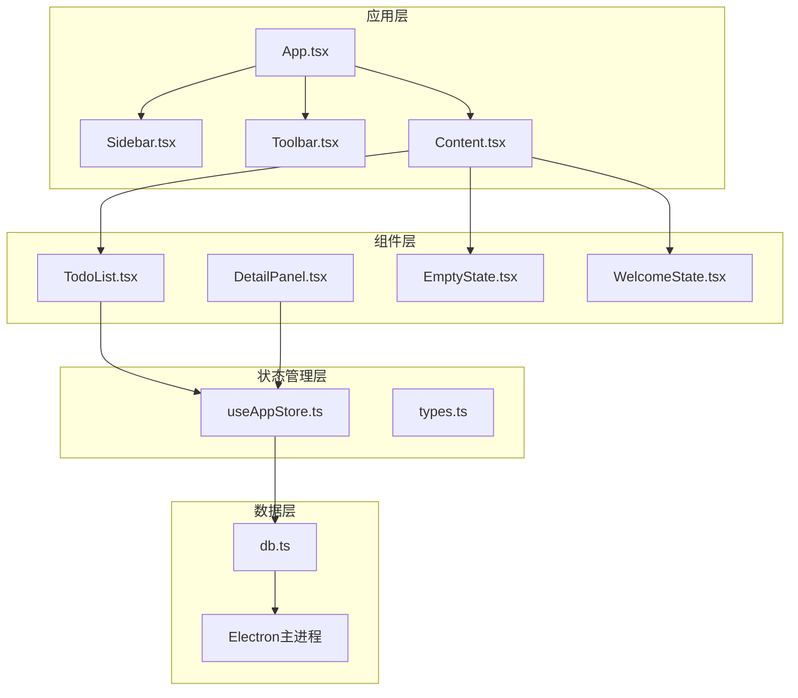
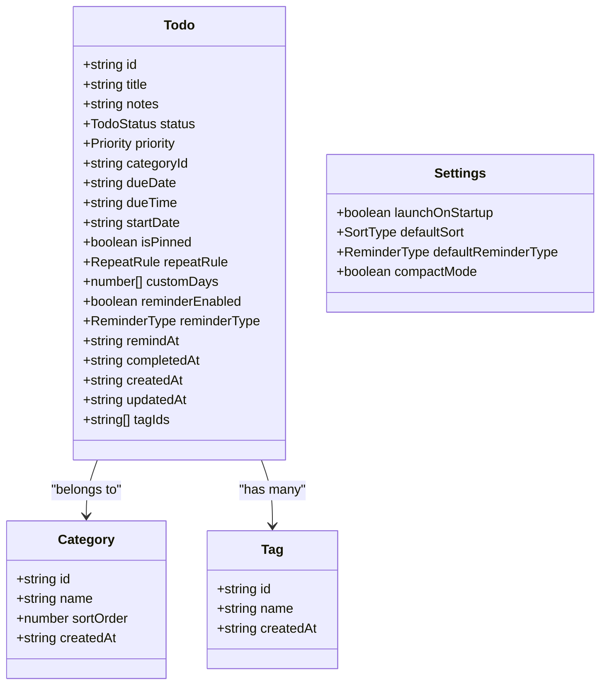
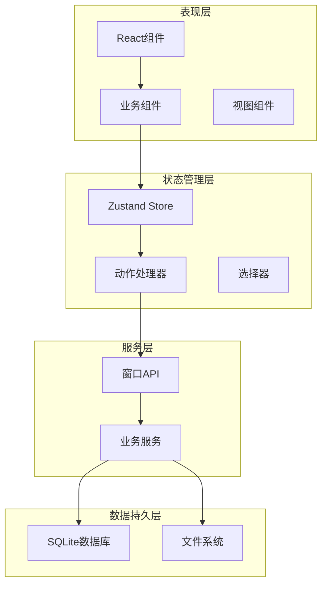
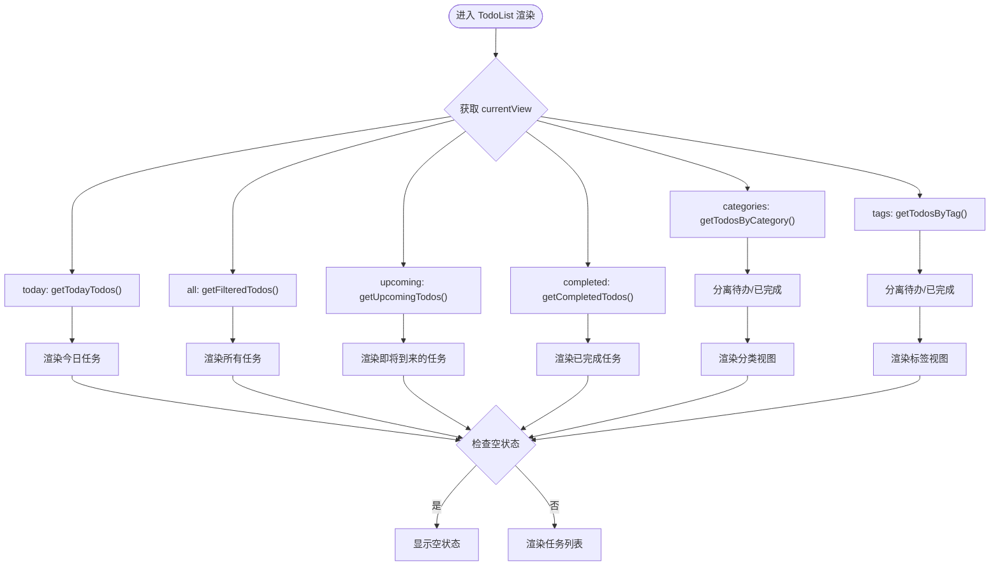
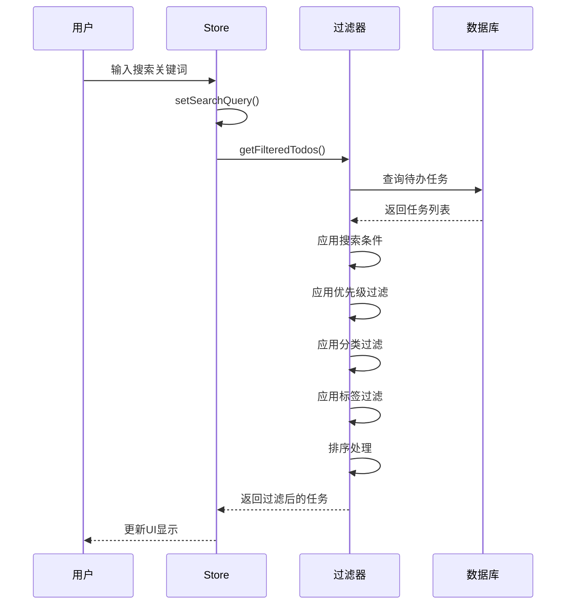
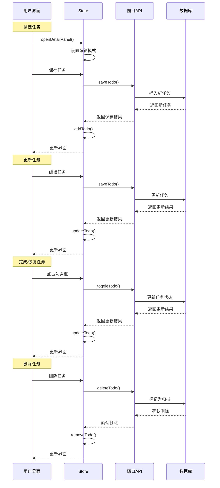
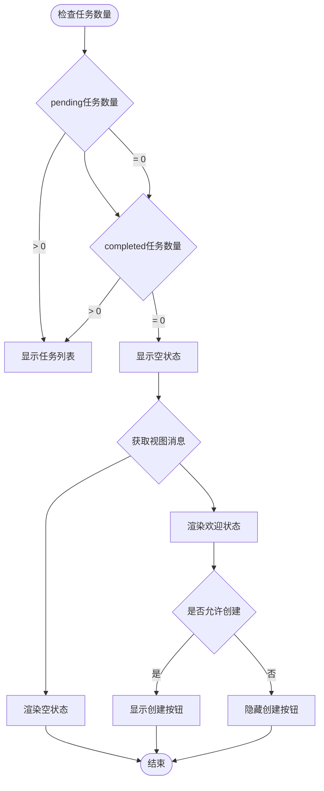
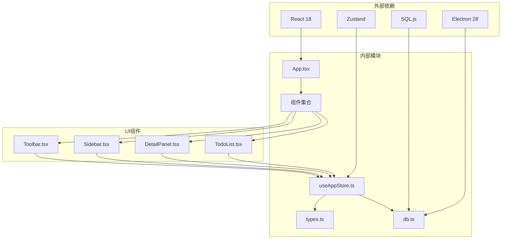

# 基础待办管理

<cite>
**本文档引用的文件**
- [TodoList.tsx](file://app/src/components/Content/TodoList.tsx)
- [useAppStore.ts](file://app/src/store/useAppStore.ts)
- [types.ts](file://app/src/types.ts)
- [EmptyState.tsx](file://app/src/components/Content/EmptyState.tsx)
- [WelcomeState.tsx](file://app/src/components/Content/WelcomeState.tsx)
- [DetailPanel.tsx](file://app/src/components/DetailPanel/DetailPanel.tsx)
- [db.ts](file://app/electron/db.ts)
- [Sidebar.tsx](file://app/src/components/Sidebar/Sidebar.tsx)
- [App.tsx](file://app/src/App.tsx)
- [Toolbar.tsx](file://app/src/components/Toolbar/Toolbar.tsx)
- [Content.css](file://app/src/components/Content/Content.css)
</cite>

## 目录
1. [简介](#简介)
2. [项目结构](#项目结构)
3. [核心组件](#核心组件)
4. [架构概览](#架构概览)
5. [详细组件分析](#详细组件分析)
6. [依赖关系分析](#依赖关系分析)
7. [性能考虑](#性能考虑)
8. [故障排除指南](#故障排除指南)
9. [结论](#结论)

## 简介

SnowTodo 是一个基于 Electron 的桌面待办事项管理系统，采用 React + TypeScript 构建。该系统提供了完整的待办管理功能，包括任务 CRUD 操作、搜索过滤、排序功能，以及多种视图模式（today、all、upcoming、completed、categories、tags）。系统支持任务的优先级管理、分类、标签、截止日期等属性，并提供了丰富的用户界面交互体验。

## 项目结构

SnowTodo 采用模块化的组件架构，主要分为以下几个核心部分：

**图表来源**
- [App.tsx:11-57](file://app/src/App.tsx#L11-L57)
- [Sidebar.tsx:30-202](file://app/src/components/Sidebar/Sidebar.tsx#L30-L202)
- [useAppStore.ts:181-508](file://app/src/store/useAppStore.ts#L181-L508)

**章节来源**
- [App.tsx:1-60](file://app/src/App.tsx#L1-L60)
- [Sidebar.tsx:1-203](file://app/src/components/Sidebar/Sidebar.tsx#L1-L203)

## 核心组件

### TodoList 组件

TodoList 是待办管理的核心组件，负责渲染不同视图模式下的任务列表。它支持六种不同的视图模式：

1. **today**: 显示当天到期的任务
2. **all**: 显示所有待办任务（支持搜索和过滤）
3. **upcoming**: 显示未来7天内到期的任务
4. **completed**: 显示已完成的任务
5. **categories**: 按分类显示任务（同时显示待办和已完成）
6. **tags**: 按标签显示任务（同时显示待办和已完成）

每个视图都有专门的空状态处理机制，提供友好的用户体验。

**章节来源**
- [TodoList.tsx:16-75](file://app/src/components/Content/TodoList.tsx#L16-L75)
- [TodoList.tsx:77-145](file://app/src/components/Content/TodoList.tsx#L77-L145)
- [TodoList.tsx:147-189](file://app/src/components/Content/TodoList.tsx#L147-L189)

### 状态管理

系统使用 Zustand 作为状态管理库，提供集中式的全局状态管理：

- **基础数据**: todos、categories、tags、settings
- **UI状态**: currentView、selectedTodoId、isDetailPanelOpen
- **过滤器**: searchQuery、filterPriority、filterCategoryId、filterTagId
- **计算属性**: 各种 getFilteredTodos、getTodayTodos 等方法

**章节来源**
- [useAppStore.ts:30-80](file://app/src/store/useAppStore.ts#L30-L80)
- [useAppStore.ts:181-508](file://app/src/store/useAppStore.ts#L181-L508)

### 数据模型

系统定义了完整的数据模型，支持复杂的企业级功能：

**图表来源**
- [types.ts:168-188](file://app/src/types.ts#L168-L188)
- [types.ts:148-159](file://app/src/types.ts#L148-L159)
- [types.ts:155-159](file://app/src/types.ts#L155-L159)
- [types.ts:161-166](file://app/src/types.ts#L161-L166)

**章节来源**
- [types.ts:1-278](file://app/src/types.ts#L1-L278)

## 架构概览

SnowTodo 采用分层架构设计，确保代码的可维护性和扩展性：

**图表来源**
- [useAppStore.ts:541-603](file://app/src/store/useAppStore.ts#L541-L603)
- [db.ts:55-90](file://app/electron/db.ts#L55-L90)

## 详细组件分析

### TodoList 视图切换逻辑

TodoList 组件根据 currentView 状态动态切换不同的数据处理逻辑：

**图表来源**
- [TodoList.tsx:27-45](file://app/src/components/Content/TodoList.tsx#L27-L45)
- [TodoList.tsx:48-63](file://app/src/components/Content/TodoList.tsx#L48-L63)

#### 任务项渲染逻辑

系统为不同类型的任务提供了不同的渲染样式：

**未完成任务渲染**：
- 勾选框用于标记完成状态
- 支持置顶功能（左侧彩色指示条）
- 显示截止日期、分类、优先级等元信息
- 支持标签显示

**已完成任务渲染**：
- 勾选框显示已完成状态
- 文本显示删除线效果
- 显示完成时间信息

**章节来源**
- [TodoList.tsx:77-145](file://app/src/components/Content/TodoList.tsx#L77-L145)
- [TodoList.tsx:147-189](file://app/src/components/Content/TodoList.tsx#L147-L189)

### 搜索过滤功能

系统提供了强大的搜索和过滤功能：

**图表来源**
- [useAppStore.ts:327-338](file://app/src/store/useAppStore.ts#L327-L338)
- [Toolbar.tsx:16-77](file://app/src/components/Toolbar/Toolbar.tsx#L16-L77)

#### 过滤器实现细节

系统支持多维度的过滤：

1. **文本搜索**: 在标题和备注中搜索
2. **优先级过滤**: 高、中、低三个级别
3. **分类过滤**: 基于任务所属分类
4. **标签过滤**: 基于任务标签
5. **排序规则**: 支持按截止日期、创建时间、优先级排序

**章节来源**
- [useAppStore.ts:327-380](file://app/src/store/useAppStore.ts#L327-L380)
- [Toolbar.tsx:39-64](file://app/src/components/Toolbar/Toolbar.tsx#L39-L64)

### 任务 CRUD 操作

系统提供了完整的任务生命周期管理：

**图表来源**
- [DetailPanel.tsx:166-185](file://app/src/components/DetailPanel/DetailPanel.tsx#L166-L185)
- [useAppStore.ts:265-272](file://app/src/store/useAppStore.ts#L265-L272)
- [db.ts:716-796](file://app/electron/db.ts#L716-L796)

#### 任务状态管理

系统支持三种任务状态：

1. **pending**: 待完成状态
2. **completed**: 已完成状态  
3. **archived**: 已归档状态（通过删除操作实现）

**章节来源**
- [types.ts:1-2](file://app/src/types.ts#L1-L2)
- [useAppStore.ts:265-272](file://app/src/store/useAppStore.ts#L265-L272)

### 空状态处理

系统针对不同视图提供了专门的空状态处理：

**图表来源**
- [TodoList.tsx:47-63](file://app/src/components/Content/TodoList.tsx#L47-L63)
- [TodoList.tsx:6-14](file://app/src/components/Content/TodoList.tsx#L6-L14)

#### 空状态类型

1. **欢迎状态**: 应用启动时或特定视图为空时显示
2. **空状态**: 搜索无结果或过滤后无任务时显示
3. **视图专用消息**: 不同视图有不同的提示信息

**章节来源**
- [TodoList.tsx:6-14](file://app/src/components/Content/TodoList.tsx#L6-L14)
- [WelcomeState.tsx:5-21](file://app/src/components/Content/WelcomeState.tsx#L5-L21)
- [EmptyState.tsx:4-11](file://app/src/components/Content/EmptyState.tsx#L4-L11)

## 依赖关系分析

系统采用模块化设计，各组件之间的依赖关系清晰：

**图表来源**
- [useAppStore.ts:1-22](file://app/src/store/useAppStore.ts#L1-L22)
- [db.ts:1-24](file://app/electron/db.ts#L1-L24)

### 组件耦合度分析

- **低耦合**: 组件间通过 props 和状态共享进行通信
- **高内聚**: 每个组件专注于单一职责
- **单向数据流**: 数据从 Store 流向各个组件
- **事件驱动**: 用户交互通过 Store actions 触发状态更新

**章节来源**
- [App.tsx:11-57](file://app/src/App.tsx#L11-L57)
- [useAppStore.ts:181-508](file://app/src/store/useAppStore.ts#L181-L508)

## 性能考虑

### 数据查询优化

系统实现了高效的数据库查询策略：

1. **索引优化**: 对常用查询字段建立索引
2. **批量操作**: 使用批量插入和更新减少数据库往返
3. **缓存策略**: 内存中缓存常用数据
4. **延迟加载**: 按需加载数据，避免一次性加载大量数据

### 渲染性能优化

1. **虚拟滚动**: 对大量数据使用虚拟滚动技术
2. **组件记忆化**: 使用 React.memo 优化组件重渲染
3. **状态分割**: 将大对象分割为小的状态片段
4. **防抖搜索**: 对搜索输入进行防抖处理

### 存储性能优化

1. **增量备份**: 支持增量数据备份
2. **压缩存储**: 数据库文件压缩存储
3. **异步操作**: 所有数据库操作都是异步的
4. **事务处理**: 复杂操作使用数据库事务保证一致性

## 故障排除指南

### 常见问题及解决方案

**问题1: 任务无法保存**
- 检查网络连接（如果使用云同步）
- 验证数据库权限
- 查看控制台错误信息

**问题2: 视图显示异常**
- 刷新页面
- 清除浏览器缓存
- 检查视图切换逻辑

**问题3: 性能问题**
- 检查任务数量是否过多
- 关闭不必要的标签页
- 重启应用

### 调试工具

系统提供了丰富的调试工具：

1. **开发者工具**: F12 打开开发者工具
2. **状态检查**: 在控制台检查 Store 状态
3. **网络监控**: 监控 API 请求
4. **数据库检查**: 检查 SQLite 数据库状态

**章节来源**
- [db.ts:626-630](file://app/electron/db.ts#L626-L630)
- [useAppStore.ts:541-603](file://app/src/store/useAppStore.ts#L541-L603)

## 结论

SnowTodo 基础待办管理系统展现了现代前端应用的最佳实践。系统采用模块化架构设计，提供了完整的任务管理功能，包括：

- **完整的 CRUD 操作**: 支持任务的创建、读取、更新、删除
- **智能搜索过滤**: 多维度的搜索和过滤功能
- **灵活的视图模式**: 支持多种视图模式切换
- **丰富的数据模型**: 支持优先级、分类、标签、截止日期等属性
- **优秀的用户体验**: 空状态处理、动画效果、响应式设计

系统的设计充分考虑了可扩展性和可维护性，为后续功能扩展奠定了良好的基础。通过模块化的组件设计和清晰的依赖关系，开发者可以轻松地添加新功能或修改现有功能。