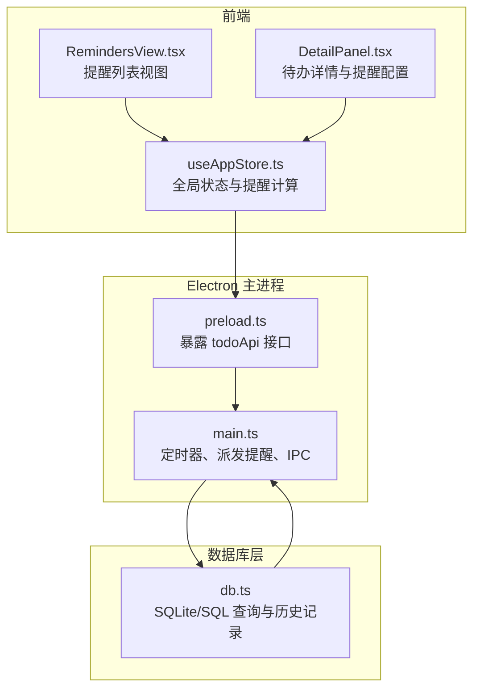
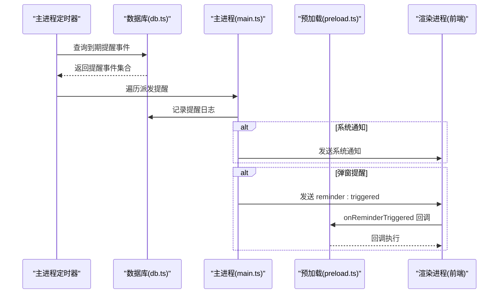
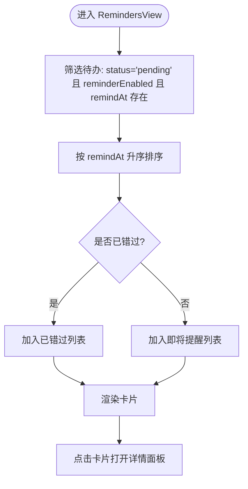
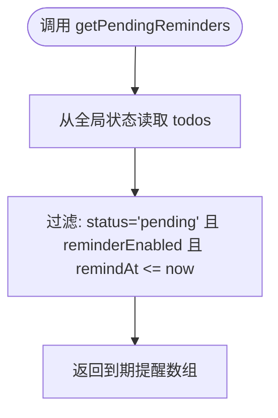
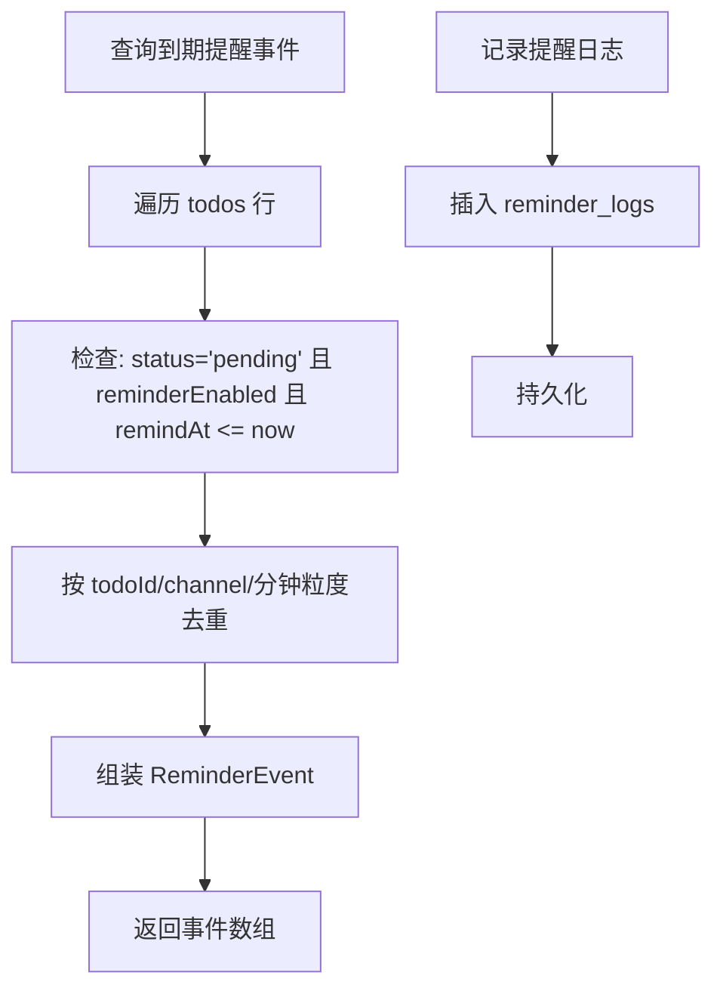
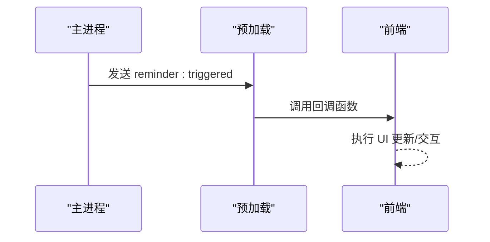
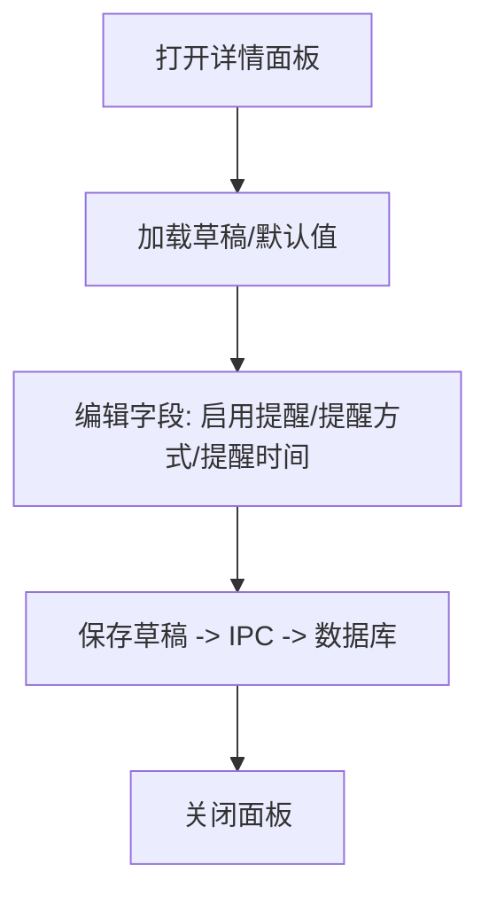
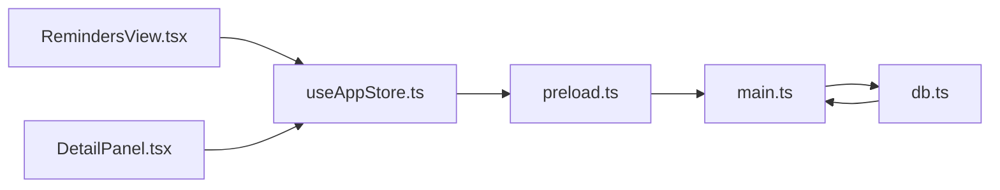

# 提醒管理

<cite>
**本文引用的文件**
- [RemindersView.tsx](file://app/src/components/Reminders/RemindersView.tsx)
- [RemindersView.css](file://app/src/components/Reminders/RemindersView.css)
- [useAppStore.ts](file://app/src/store/useAppStore.ts)
- [types.ts](file://app/src/types.ts)
- [main.ts](file://app/electron/main.ts)
- [preload.ts](file://app/electron/preload.ts)
- [db.ts](file://app/electron/db.ts)
- [DetailPanel.tsx](file://app/src/components/DetailPanel/DetailPanel.tsx)
</cite>

## 目录
1. [简介](#简介)
2. [项目结构](#项目结构)
3. [核心组件](#核心组件)
4. [架构总览](#架构总览)
5. [详细组件分析](#详细组件分析)
6. [依赖关系分析](#依赖关系分析)
7. [性能考量](#性能考量)
8. [故障排查指南](#故障排查指南)
9. [结论](#结论)
10. [附录](#附录)

## 简介
本文件面向 SnowTodo 的“提醒管理”模块，系统性阐述提醒事件的处理机制与实现细节，覆盖以下方面：
- 提醒的创建、编辑、删除与状态管理
- 触发机制：时间触发、条件触发、用户交互触发
- 用户交互处理流程：通知显示、确认与忽略
- 系统通知集成与管理
- 提醒历史记录与查询
- 具体配置示例与使用场景

## 项目结构
提醒管理涉及前端 UI 组件、全局状态管理、Electron 主进程与数据库层协同工作：
- 前端 UI：提醒列表视图与详情面板
- 全局状态：Zustand store 提供提醒计算与 UI 状态
- 主进程：定时扫描、派发系统通知与弹窗提醒
- 数据库：存储提醒事件、记录历史与查询到期事件



图表来源
- [RemindersView.tsx:1-103](file://app/src/components/Reminders/RemindersView.tsx#L1-L103)
- [DetailPanel.tsx:1-507](file://app/src/components/DetailPanel/DetailPanel.tsx#L1-L507)
- [useAppStore.ts:1-604](file://app/src/store/useAppStore.ts#L1-L604)
- [main.ts:1-391](file://app/electron/main.ts#L1-L391)
- [preload.ts:1-117](file://app/electron/preload.ts#L1-L117)
- [db.ts:1-1495](file://app/electron/db.ts#L1-L1495)

章节来源
- [RemindersView.tsx:1-103](file://app/src/components/Reminders/RemindersView.tsx#L1-L103)
- [useAppStore.ts:1-604](file://app/src/store/useAppStore.ts#L1-L604)
- [main.ts:1-391](file://app/electron/main.ts#L1-L391)
- [db.ts:1-1495](file://app/electron/db.ts#L1-L1495)

## 核心组件
- 提醒视图组件：渲染“即将提醒”和“已错过”的待办卡片，支持点击进入详情面板
- 全局状态管理：提供提醒过滤、计算与 UI 切换
- 主进程定时器：周期性扫描到期提醒并派发系统通知或弹窗
- 数据库层：查询到期提醒事件、记录提醒日志与历史

章节来源
- [RemindersView.tsx:1-103](file://app/src/components/Reminders/RemindersView.tsx#L1-L103)
- [useAppStore.ts:382-389](file://app/src/store/useAppStore.ts#L382-L389)
- [main.ts:120-139](file://app/electron/main.ts#L120-L139)
- [db.ts:881-930](file://app/electron/db.ts#L881-L930)

## 架构总览
提醒系统采用“前端展示 + 主进程派发 + 数据库存储”的分层设计：
- 前端负责提醒列表展示与待办详情配置
- 主进程通过定时器扫描数据库，派发系统通知与弹窗
- 数据库负责提醒事件查询、去重与历史记录



图表来源
- [main.ts:120-139](file://app/electron/main.ts#L120-L139)
- [db.ts:881-940](file://app/electron/db.ts#L881-L940)
- [preload.ts:42-47](file://app/electron/preload.ts#L42-L47)

## 详细组件分析

### 提醒视图组件（RemindersView）
职责与行为
- 过滤“待办”且启用提醒且存在提醒时间的待办
- 区分“即将提醒”和“已错过”
- 渲染卡片：标题、提醒时间、倒计时提示
- 点击卡片打开详情面板

关键逻辑
- 即将提醒：remindAt > 当前时间
- 已错过：remindAt ≤ 当前时间
- 倒计时算法：按分钟/小时/天计算相对时间



图表来源
- [RemindersView.tsx:8-16](file://app/src/components/Reminders/RemindersView.tsx#L8-L16)
- [RemindersView.tsx:63-102](file://app/src/components/Reminders/RemindersView.tsx#L63-L102)

章节来源
- [RemindersView.tsx:1-103](file://app/src/components/Reminders/RemindersView.tsx#L1-L103)
- [RemindersView.css:1-109](file://app/src/components/Reminders/RemindersView.css#L1-L109)

### 全局状态与提醒计算（useAppStore）
职责与行为
- 提供 getPendingReminders 计算函数，用于筛选当前已到期的提醒
- 通过 openDetailPanel 控制详情面板的打开与关闭
- 通过 todoApi 与主进程通信

关键逻辑
- getPendingReminders：筛选 status='pending' 且 reminderEnabled 且 remindAt ≤ 当前时间



图表来源
- [useAppStore.ts:382-389](file://app/src/store/useAppStore.ts#L382-L389)

章节来源
- [useAppStore.ts:1-604](file://app/src/store/useAppStore.ts#L1-L604)

### 主进程提醒派发（main.ts）
职责与行为
- 定时器每 30 秒扫描一次到期提醒事件
- 生成每日待办后，查询到期提醒事件并逐条派发
- 派发策略：根据提醒类型决定系统通知或弹窗提醒
- 记录提醒日志

关键逻辑
- dispatchReminder：记录日志并根据 reminderType 派发
- startReminderLoop：启动定时器，周期性检查

```mermaid
sequenceDiagram
participant Loop as "定时器"
participant DB as "数据库"
participant Main as "主进程"
participant Win as "主窗口"
Loop->>DB : 查询到期提醒事件
DB-->>Loop : 返回事件集合
Loop->>Main : 遍历派发
Main->>DB : 记录提醒日志
alt system/both
Main->>Main : 创建系统通知
end
alt popup/both
Main->>Win : 展示窗口并发送 reminder : triggered
end
```

图表来源
- [main.ts:98-118](file://app/electron/main.ts#L98-L118)
- [main.ts:120-139](file://app/electron/main.ts#L120-L139)

章节来源
- [main.ts:1-391](file://app/electron/main.ts#L1-L391)

### 数据库层（db.ts）
职责与行为
- 查询到期提醒事件：去重（同一分钟内仅一次）、组装 ReminderEvent
- 记录提醒日志：避免重复触发
- 历史记录：记录健康提醒触发情况（响应、忽略、延迟）

关键逻辑
- getDueReminderEvents：查询 todos 中满足条件的提醒事件，去重后返回
- recordReminder：插入 reminder_logs 记录
- getReminderHistory：查询提醒历史（可按提醒 ID 或限制数量）



图表来源
- [db.ts:881-930](file://app/electron/db.ts#L881-L930)
- [db.ts:932-940](file://app/electron/db.ts#L932-L940)
- [db.ts:1469-1481](file://app/electron/db.ts#L1469-L1481)

章节来源
- [db.ts:1-1495](file://app/electron/db.ts#L1-L1495)

### 预加载接口（preload.ts）
职责与行为
- 暴露 todoApi.onReminderTriggered，供前端订阅提醒触发事件
- 通过 ipcRenderer.on 监听主进程发送的 reminder:triggered



图表来源
- [preload.ts:42-47](file://app/electron/preload.ts#L42-L47)

章节来源
- [preload.ts:1-117](file://app/electron/preload.ts#L1-L117)

### 类型定义（types.ts）
职责与行为
- 定义 Todo、ReminderType、ReminderEvent 等类型
- 为提醒系统提供强类型约束

```mermaid
classDiagram
class Todo {
+string id
+string title
+string notes
+string status
+string priority
+string categoryId
+string dueDate
+string dueTime
+string startDate
+boolean isPinned
+string repeatRule
+number[] customDays
+boolean reminderEnabled
+string reminderType
+string remindAt
+string completedAt
+string createdAt
+string updatedAt
+string[] tagIds
}
class ReminderEvent {
+string todoId
+string title
+string notes
+string dueLabel
+string reminderType
}
class ReminderType {
<<enumeration>>
"none"
"system"
"popup"
"both"
}
Todo --> ReminderType : "使用"
ReminderEvent --> ReminderType : "使用"
```

图表来源
- [types.ts:168-188](file://app/src/types.ts#L168-L188)
- [types.ts:215-221](file://app/src/types.ts#L215-L221)
- [types.ts:3-3](file://app/src/types.ts#L3-L3)

章节来源
- [types.ts:1-278](file://app/src/types.ts#L1-L278)

### 详情面板与提醒配置（DetailPanel）
职责与行为
- 在新建/编辑待办时配置提醒：开关、提醒方式、提醒时间
- 保存时写入数据库，后续由主进程定时器扫描派发



图表来源
- [DetailPanel.tsx:166-185](file://app/src/components/DetailPanel/DetailPanel.tsx#L166-L185)

章节来源
- [DetailPanel.tsx:1-507](file://app/src/components/DetailPanel/DetailPanel.tsx#L1-L507)

## 依赖关系分析
- RemindersView 依赖 useAppStore 的 todos 与 openDetailPanel
- useAppStore 通过 window.todoApi 与主进程通信
- main.ts 依赖 db.ts 查询与记录，依赖 Notification API 发送系统通知
- preload.ts 暴露 onReminderTriggered 供前端订阅



图表来源
- [RemindersView.tsx:1-3](file://app/src/components/Reminders/RemindersView.tsx#L1-L3)
- [useAppStore.ts:541-601](file://app/src/store/useAppStore.ts#L541-L601)
- [preload.ts:18-116](file://app/electron/preload.ts#L18-L116)
- [main.ts:98-118](file://app/electron/main.ts#L98-L118)
- [db.ts:881-940](file://app/electron/db.ts#L881-L940)

章节来源
- [useAppStore.ts:1-604](file://app/src/store/useAppStore.ts#L1-L604)
- [main.ts:1-391](file://app/electron/main.ts#L1-L391)
- [db.ts:1-1495](file://app/electron/db.ts#L1-L1495)

## 性能考量
- 定时器频率：主进程每 30 秒扫描一次，兼顾实时性与性能
- 去重策略：按 todoId、channel 与分钟粒度去重，避免重复触发
- 数据库索引：对 pomodoro、time_blocks、daily_stats、health_reminders 等表建立索引，提升查询效率
- 前端渲染：提醒列表按时间排序，减少不必要的重排

章节来源
- [main.ts:120-139](file://app/electron/main.ts#L120-L139)
- [db.ts:881-930](file://app/electron/db.ts#L881-L930)
- [db.ts:197-206](file://app/electron/db.ts#L197-L206)

## 故障排查指南
常见问题与定位建议
- 提醒未触发
  - 检查待办状态是否为“待办”，是否启用提醒，remindAt 是否小于等于当前时间
  - 确认主进程定时器是否运行，日志是否输出
  - 核对系统通知权限与应用权限
- 重复提醒
  - 检查 reminder_logs 是否正确插入，去重逻辑是否生效
- 历史记录缺失
  - 确认 reminder_history 表是否存在，查询接口是否传入正确的参数

章节来源
- [useAppStore.ts:382-389](file://app/src/store/useAppStore.ts#L382-L389)
- [main.ts:120-139](file://app/electron/main.ts#L120-L139)
- [db.ts:932-940](file://app/electron/db.ts#L932-L940)
- [db.ts:1469-1481](file://app/electron/db.ts#L1469-L1481)

## 结论
SnowTodo 的提醒管理模块以清晰的分层设计实现了“前端展示 + 主进程派发 + 数据库存储”的闭环。通过定时扫描、去重与历史记录，系统在保证可靠性的同时兼顾性能。提醒视图与详情面板提供了直观的配置与交互体验，配合系统通知与弹窗提醒，满足多场景使用需求。

## 附录

### 提醒配置示例与使用场景
- 场景一：工作日固定时间提醒
  - 设置：启用提醒、提醒方式为“系统通知”或“弹窗提醒”，提醒时间为工作日的固定时刻
  - 适用：会议、下班提醒等
- 场景二：间隔提醒
  - 设置：启用提醒、提醒方式为“系统通知”，间隔分钟数设置为 60/90 等
  - 适用：喝水、活动、深呼吸等周期性提醒
- 场景三：一次性提醒
  - 设置：启用提醒、提醒方式为“系统通知+弹窗”，提醒时间为具体日期时间
  - 适用：重要任务截止前的即时提醒

章节来源
- [DetailPanel.tsx:441-476](file://app/src/components/DetailPanel/DetailPanel.tsx#L441-L476)
- [types.ts:168-188](file://app/src/types.ts#L168-L188)
- [types.ts:215-221](file://app/src/types.ts#L215-L221)