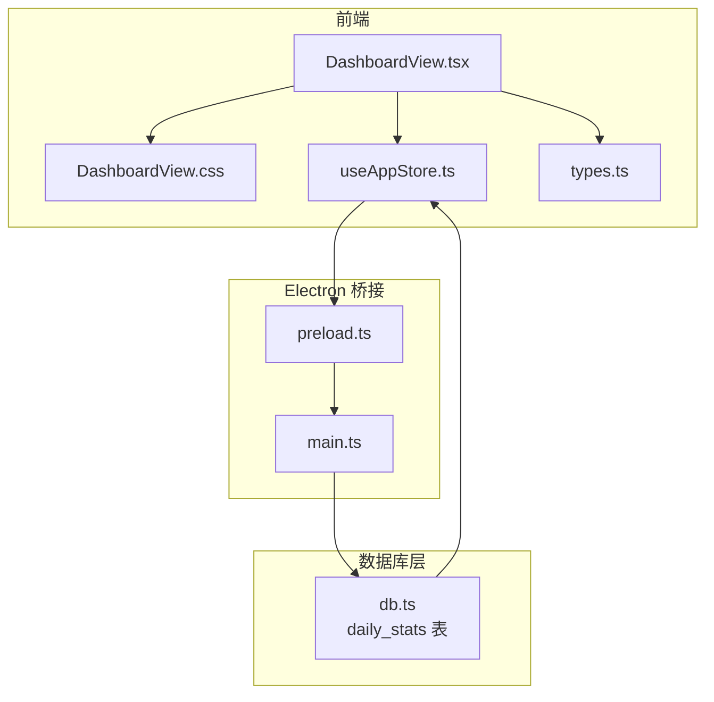
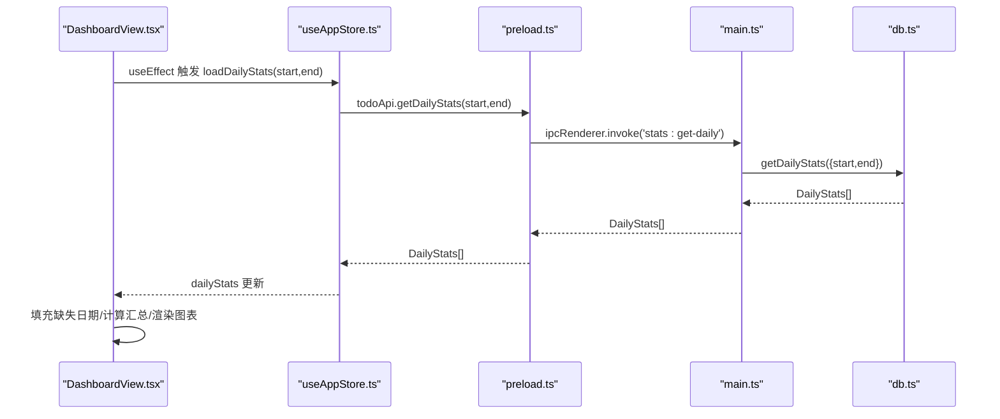
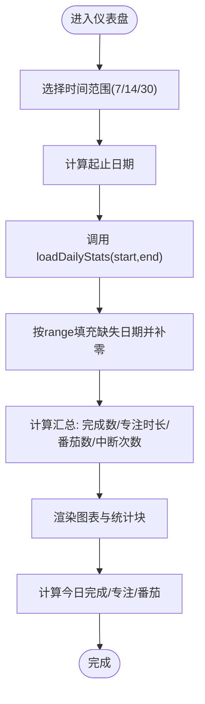
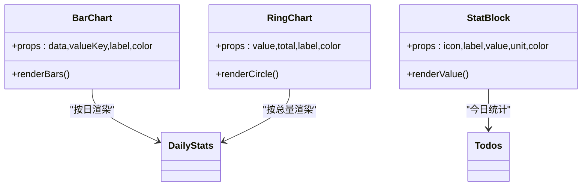
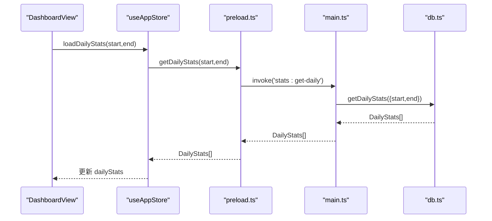
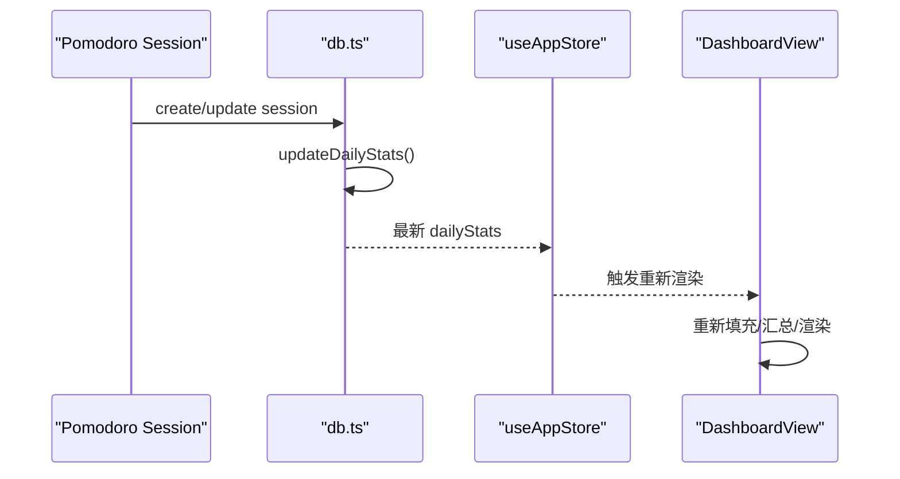
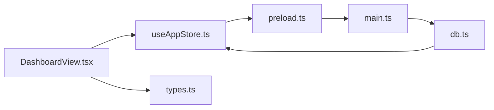

# 数据仪表盘

<cite>
**本文引用的文件**
- [DashboardView.tsx](file://app/src/components/Dashboard/DashboardView.tsx)
- [DashboardView.css](file://app/src/components/Dashboard/DashboardView.css)
- [useAppStore.ts](file://app/src/store/useAppStore.ts)
- [types.ts](file://app/src/types.ts)
- [db.ts](file://app/electron/db.ts)
- [main.ts](file://app/electron/main.ts)
- [preload.ts](file://app/electron/preload.ts)
</cite>

## 目录
1. [简介](#简介)
2. [项目结构](#项目结构)
3. [核心组件](#核心组件)
4. [架构总览](#架构总览)
5. [详细组件分析](#详细组件分析)
6. [依赖关系分析](#依赖关系分析)
7. [性能考量](#性能考量)
8. [故障排查指南](#故障排查指南)
9. [结论](#结论)
10. [附录](#附录)

## 简介
本文件面向 SnowTodo 的“数据仪表盘”模块，系统性阐述统计数据的计算与展示机制，涵盖任务完成率、效率指标、时间分布等关键指标；解释折线图、柱状图、环形图等可视化实现；说明时间范围切换（日、周、月、年）的聚合逻辑；文档化数据导出与报告生成机制；说明实时数据更新与缓存策略，并提供统计分析示例与解读指南，帮助开发者与用户高效理解与使用该模块。

## 项目结构
仪表盘模块位于前端组件层，通过预加载桥接与主进程数据库交互，最终从本地 SQLite 数据库读取与写入统计数据。核心文件组织如下：
- 前端展示层：DashboardView.tsx（组件）、DashboardView.css（样式）
- 状态管理：useAppStore.ts（Zustand store，包含 dailyStats 与加载接口）
- 类型定义：types.ts（DailyStats 接口）
- 主进程桥接：preload.ts（暴露 todoApi 给渲染进程）
- 主进程 IPC：main.ts（注册 stats:get-daily、stats:update-daily）
- 数据库层：db.ts（SQL.js + SQLite，提供 getDailyStats、updateDailyStats）

图表来源
- [DashboardView.tsx:125-272](file://app/src/components/Dashboard/DashboardView.tsx#L125-L272)
- [useAppStore.ts:168-171](file://app/src/store/useAppStore.ts#L168-L171)
- [preload.ts:99-101](file://app/electron/preload.ts#L99-L101)
- [main.ts:329-335](file://app/electron/main.ts#L329-L335)
- [db.ts:1624-1698](file://app/electron/db.ts#L1624-L1698)

章节来源
- [DashboardView.tsx:1-272](file://app/src/components/Dashboard/DashboardView.tsx#L1-L272)
- [useAppStore.ts:1-604](file://app/src/store/useAppStore.ts#L1-L604)
- [types.ts:136-146](file://app/src/types.ts#L136-L146)
- [preload.ts:1-117](file://app/electron/preload.ts#L1-L117)
- [main.ts:329-335](file://app/electron/main.ts#L329-L335)
- [db.ts:1624-1698](file://app/electron/db.ts#L1624-L1698)

## 核心组件
- 仪表盘视图组件：负责时间范围切换、数据填充、汇总计算、图表渲染与展示。
- 状态管理：提供 dailyStats 数据与加载接口 loadDailyStats。
- 数据模型：DailyStats 定义每日统计字段。
- 预加载桥接：todoApi 暴露 getDailyStats、updateDailyStats。
- 主进程 IPC：注册 stats:get-daily、stats:update-daily。
- 数据库层：维护 daily_stats 表，提供 getDailyStats 查询与 updateDailyStats 写入。

章节来源
- [DashboardView.tsx:125-272](file://app/src/components/Dashboard/DashboardView.tsx#L125-L272)
- [useAppStore.ts:168-171](file://app/src/store/useAppStore.ts#L168-L171)
- [types.ts:136-146](file://app/src/types.ts#L136-L146)
- [preload.ts:99-101](file://app/electron/preload.ts#L99-L101)
- [main.ts:329-335](file://app/electron/main.ts#L329-L335)
- [db.ts:1624-1698](file://app/electron/db.ts#L1624-L1698)

## 架构总览
仪表盘的数据流自下而上：数据库层产生或更新 daily_stats，前端通过 store 加载并渲染；当番茄钟会话完成或更新时，数据库层触发 daily_stats 的增量更新，前端感知变化并刷新。

图表来源
- [DashboardView.tsx:129-132](file://app/src/components/Dashboard/DashboardView.tsx#L129-L132)
- [useAppStore.ts:168-171](file://app/src/store/useAppStore.ts#L168-L171)
- [preload.ts:99-101](file://app/electron/preload.ts#L99-L101)
- [main.ts:329-335](file://app/electron/main.ts#L329-L335)
- [db.ts:1679-1698](file://app/electron/db.ts#L1679-L1698)

## 详细组件分析

### 时间范围切换与数据聚合
- 时间范围：支持近 7/14/30 天，默认 7 天。
- 聚合逻辑：
  - 使用日期范围函数生成起止日期。
  - 从 store 中读取已加载的 dailyStats。
  - 以 range 为步长，按天生成完整日期序列，若某天无记录则补零，确保图表连续。
  - 汇总计算：累计完成数、专注时长、番茄数、中断次数。
- 今日数据：基于当日日期匹配 dailyStats 或合并今日番茄会话统计。

图表来源
- [DashboardView.tsx:7-19](file://app/src/components/Dashboard/DashboardView.tsx#L7-L19)
- [DashboardView.tsx:129-154](file://app/src/components/Dashboard/DashboardView.tsx#L129-L154)
- [DashboardView.tsx:157-178](file://app/src/components/Dashboard/DashboardView.tsx#L157-L178)

章节来源
- [DashboardView.tsx:7-19](file://app/src/components/Dashboard/DashboardView.tsx#L7-L19)
- [DashboardView.tsx:129-154](file://app/src/components/Dashboard/DashboardView.tsx#L129-L154)
- [DashboardView.tsx:157-178](file://app/src/components/Dashboard/DashboardView.tsx#L157-L178)

### 统计指标与计算方法
- 任务完成率：当日完成任务数 / 当日总任务数（含已完成与待处理）。
- 番茄完成率：当日完成番茄数 / （完成番茄数 + 中断次数）。
- 日均专注时长：近 N 天总专注分钟数 / N。
- 日均完成任务：近 N 天总完成任务数 / N。
- 效率指标：可结合“深度专注时长”与“专注时长”进行对比分析（数据库提供 deep_work_minutes 字段）。

章节来源
- [DashboardView.tsx:223-265](file://app/src/components/Dashboard/DashboardView.tsx#L223-L265)
- [db.ts:1626-1677](file://app/electron/db.ts#L1626-L1677)
- [types.ts:136-146](file://app/src/types.ts#L136-L146)

### 图表可视化实现
- 柱状图（BarChart）：用于展示每日完成数、专注时长、番茄数、中断次数的时间序列。通过最大值归一化高度，实现视觉对比。
- 环形图（RingChart）：用于展示任务完成率与番茄完成率，采用 SVG 圆环绘制，动态计算百分比与描边长度。
- 统计块（StatBlock）：展示今日关键指标，如完成任务、完成番茄、专注时长、待处理任务。

图表来源
- [DashboardView.tsx:22-55](file://app/src/components/Dashboard/DashboardView.tsx#L22-L55)
- [DashboardView.tsx:58-96](file://app/src/components/Dashboard/DashboardView.tsx#L58-L96)
- [DashboardView.tsx:99-122](file://app/src/components/Dashboard/DashboardView.tsx#L99-L122)

章节来源
- [DashboardView.tsx:22-55](file://app/src/components/Dashboard/DashboardView.tsx#L22-L55)
- [DashboardView.tsx:58-96](file://app/src/components/Dashboard/DashboardView.tsx#L58-L96)
- [DashboardView.tsx:99-122](file://app/src/components/Dashboard/DashboardView.tsx#L99-L122)

### 数据加载与缓存策略
- 加载入口：DashboardView 在 range 变更时调用 store 的 loadDailyStats(start,end)。
- 缓存策略：store 内部维护 dailyStats 数组，组件通过 useMemo 对填充与汇总结果进行稳定化处理，避免不必要的重渲染。
- 数据来源：通过 preload 暴露的 todoApi.getDailyStats 调用主进程 IPC，主进程再调用数据库层查询。

图表来源
- [DashboardView.tsx:129-132](file://app/src/components/Dashboard/DashboardView.tsx#L129-L132)
- [useAppStore.ts:168-171](file://app/src/store/useAppStore.ts#L168-L171)
- [preload.ts:99-101](file://app/electron/preload.ts#L99-L101)
- [main.ts:329-335](file://app/electron/main.ts#L329-L335)
- [db.ts:1679-1698](file://app/electron/db.ts#L1679-L1698)

章节来源
- [DashboardView.tsx:129-132](file://app/src/components/Dashboard/DashboardView.tsx#L129-L132)
- [useAppStore.ts:168-171](file://app/src/store/useAppStore.ts#L168-L171)
- [preload.ts:99-101](file://app/electron/preload.ts#L99-L101)
- [main.ts:329-335](file://app/electron/main.ts#L329-L335)
- [db.ts:1679-1698](file://app/electron/db.ts#L1679-L1698)

### 实时数据更新与数据库联动
- 番茄钟会话更新：每次创建或更新 pomodoro_session 后，数据库层调用 updateDailyStats，自动刷新当日统计。
- 仪表盘感知：前端 store 通过定时或事件驱动方式重新加载 dailyStats，实现“所见即所得”的实时更新。

图表来源
- [db.ts:1271-1302](file://app/electron/db.ts#L1271-L1302)
- [db.ts:1626-1677](file://app/electron/db.ts#L1626-L1677)
- [useAppStore.ts:168-171](file://app/src/store/useAppStore.ts#L168-L171)
- [DashboardView.tsx:129-132](file://app/src/components/Dashboard/DashboardView.tsx#L129-L132)

章节来源
- [db.ts:1271-1302](file://app/electron/db.ts#L1271-L1302)
- [db.ts:1626-1677](file://app/electron/db.ts#L1626-L1677)
- [useAppStore.ts:168-171](file://app/src/store/useAppStore.ts#L168-L171)
- [DashboardView.tsx:129-132](file://app/src/components/Dashboard/DashboardView.tsx#L129-L132)

### 数据导出与报告生成机制
- 导出入口：主进程提供 data:export IPC，调用数据库导出快照。
- 报告生成：当前代码未提供专用“报告生成”页面，但可通过导出快照（包含所有数据）在外部工具中进行二次加工与生成报告。

章节来源
- [main.ts:195-207](file://app/electron/main.ts#L195-L207)
- [db.ts:970-972](file://app/electron/db.ts#L970-L972)

## 依赖关系分析
- 组件依赖：DashboardView 依赖 useAppStore（状态）、types（DailyStats）、CSS（样式）。
- 状态依赖：store 依赖 preload 暴露的 todoApi，todoApi 通过 IPC 调用 main.ts 注册的方法。
- 数据依赖：main.ts 依赖 db.ts 的 getDailyStats 与 updateDailyStats。
- 数据模型：DailyStats 定义于 types.ts，供前端与数据库共同使用。

图表来源
- [DashboardView.tsx:1-4](file://app/src/components/Dashboard/DashboardView.tsx#L1-L4)
- [useAppStore.ts:1-22](file://app/src/store/useAppStore.ts#L1-L22)
- [preload.ts:1-16](file://app/electron/preload.ts#L1-L16)
- [main.ts:1-10](file://app/electron/main.ts#L1-L10)
- [db.ts:1-24](file://app/electron/db.ts#L1-L24)

章节来源
- [DashboardView.tsx:1-4](file://app/src/components/Dashboard/DashboardView.tsx#L1-L4)
- [useAppStore.ts:1-22](file://app/src/store/useAppStore.ts#L1-L22)
- [preload.ts:1-16](file://app/electron/preload.ts#L1-L16)
- [main.ts:1-10](file://app/electron/main.ts#L1-L10)
- [db.ts:1-24](file://app/electron/db.ts#L1-L24)

## 性能考量
- 渲染优化：使用 useMemo 对填充与汇总计算进行稳定化，减少不必要的重渲染。
- 数据量控制：默认仅加载近 7/14/30 天，避免一次性加载过多数据导致卡顿。
- 归一化渲染：柱状图按最大值归一化高度，提升视觉对比度与性能表现。
- 数据库索引：daily_stats 表存在 date 索引，查询按日期范围具备良好性能。

章节来源
- [DashboardView.tsx:135-154](file://app/src/components/Dashboard/DashboardView.tsx#L135-L154)
- [DashboardView.tsx:157-167](file://app/src/components/Dashboard/DashboardView.tsx#L157-L167)
- [db.ts:197-206](file://app/electron/db.ts#L197-L206)
- [db.ts:1679-1698](file://app/electron/db.ts#L1679-L1698)

## 故障排查指南
- 无法加载统计数据
  - 检查 store 的 loadDailyStats 是否被正确调用（依赖 range）。
  - 检查 preload 暴露的 todoApi.getDailyStats 是否可用。
  - 检查主进程 IPC 注册是否生效。
- 统计为空或为零
  - 确认数据库中是否存在 daily_stats 记录；必要时手动触发 updateDailyStats。
  - 检查番茄钟会话是否完成并持久化。
- 图表不连续
  - 确保填充缺失日期逻辑正常执行（按 range 生成日期序列并补零）。
- 性能问题
  - 控制时间范围大小；避免长时间跨度。
  - 检查是否有频繁的无效重渲染，确认 useMemo 使用正确。

章节来源
- [DashboardView.tsx:129-154](file://app/src/components/Dashboard/DashboardView.tsx#L129-L154)
- [useAppStore.ts:168-171](file://app/src/store/useAppStore.ts#L168-L171)
- [preload.ts:99-101](file://app/electron/preload.ts#L99-L101)
- [main.ts:329-335](file://app/electron/main.ts#L329-L335)
- [db.ts:1626-1677](file://app/electron/db.ts#L1626-L1677)

## 结论
SnowTodo 的数据仪表盘通过清晰的分层设计与完善的 IPC 机制，实现了从数据库到前端的高效数据流转。其核心优势在于：
- 明确的指标定义与计算方法，便于用户理解与解读。
- 灵活的时间范围切换与连续数据填充，保证图表稳定性。
- 与番茄钟会话的强耦合更新，确保数据实时性。
- 可扩展的可视化组件，便于后续引入更多图表类型与分析维度。

建议后续增强方向：
- 引入“年”级时间范围与月度聚合。
- 增加更多效率指标（如深度专注占比、中断频率等）。
- 提供报告导出页面或模板，一键生成 PDF/Excel 报告。

## 附录

### 统计分析示例与数据解读指南
- 示例 1：近 7 天任务完成率
  - 计算：完成任务总数 / 总任务数（已完成+待处理）。
  - 解读：若近期完成率持续上升，表明任务管理效率提升；若波动较大，需关注任务拆分与优先级设置。
- 示例 2：日均专注时长
  - 计算：近 N 天总专注分钟数 / N。
  - 解读：日均专注时长稳定增长，反映时间管理能力提升；若下降，建议检查干扰因素与番茄钟使用规范。
- 示例 3：番茄完成率
  - 计算：完成番茄数 / （完成番茄数 + 中断次数）。
  - 解读：完成率高说明专注质量好；若中断次数多，建议优化环境与打断管理策略。
- 示例 4：时间分布
  - 展示：柱状图按日展示完成数、专注时长、番茄数、中断次数。
  - 解读：识别高峰与低谷时段，优化工作节奏与排程。

章节来源
- [DashboardView.tsx:223-265](file://app/src/components/Dashboard/DashboardView.tsx#L223-L265)
- [db.ts:1626-1677](file://app/electron/db.ts#L1626-L1677)
- [types.ts:136-146](file://app/src/types.ts#L136-L146)