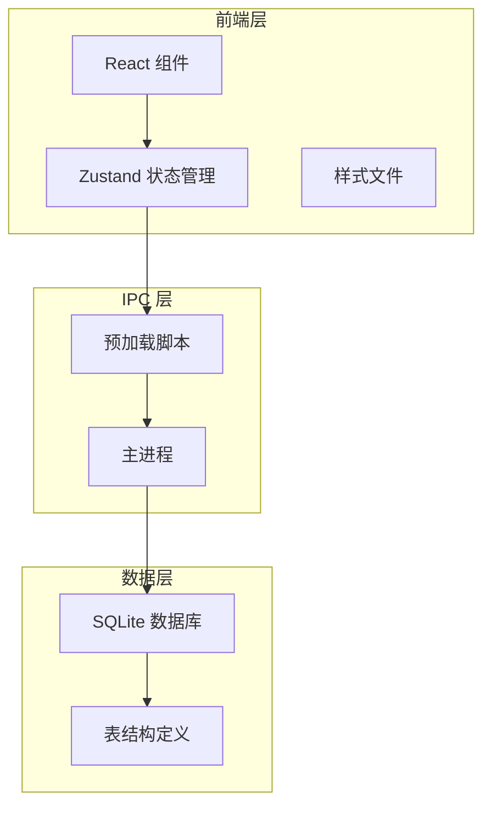
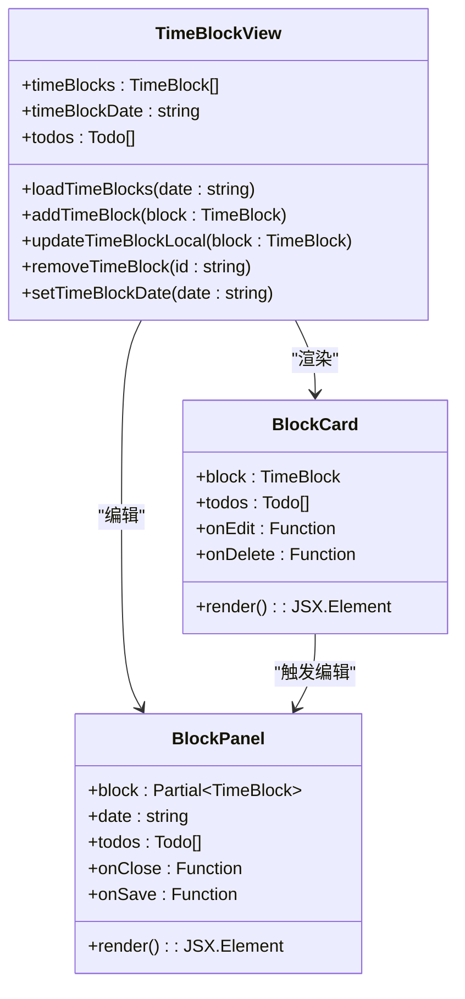
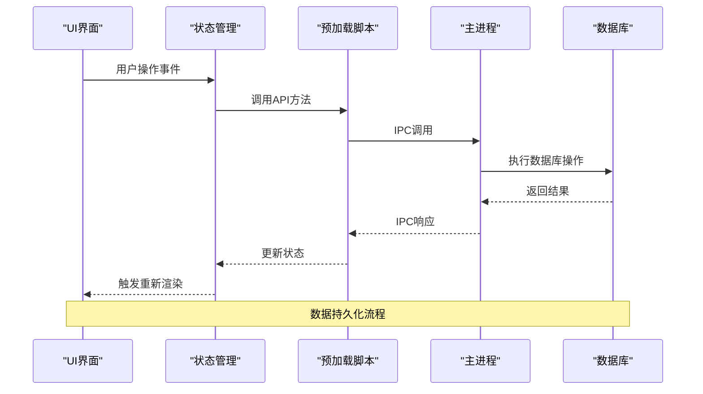
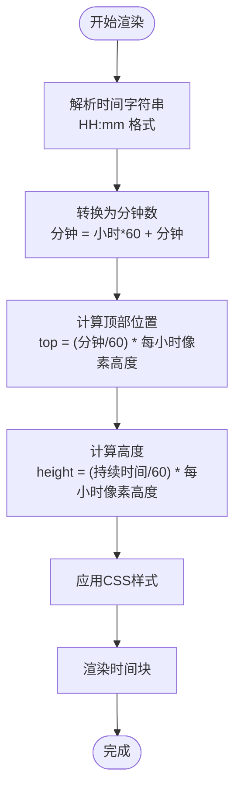
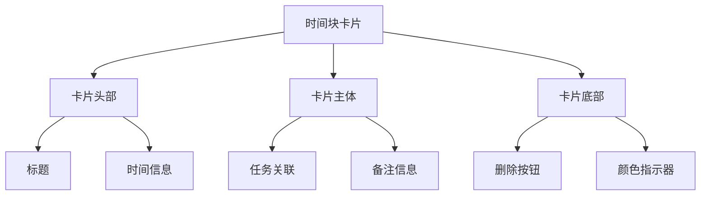
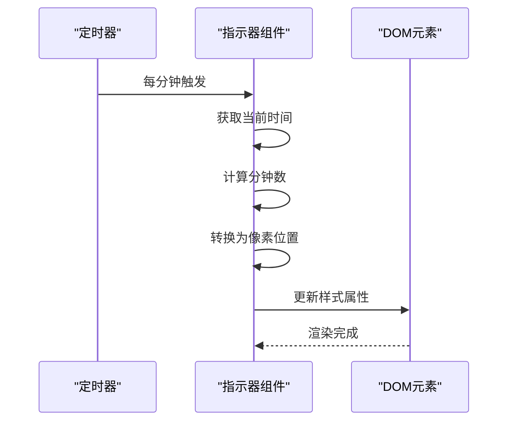
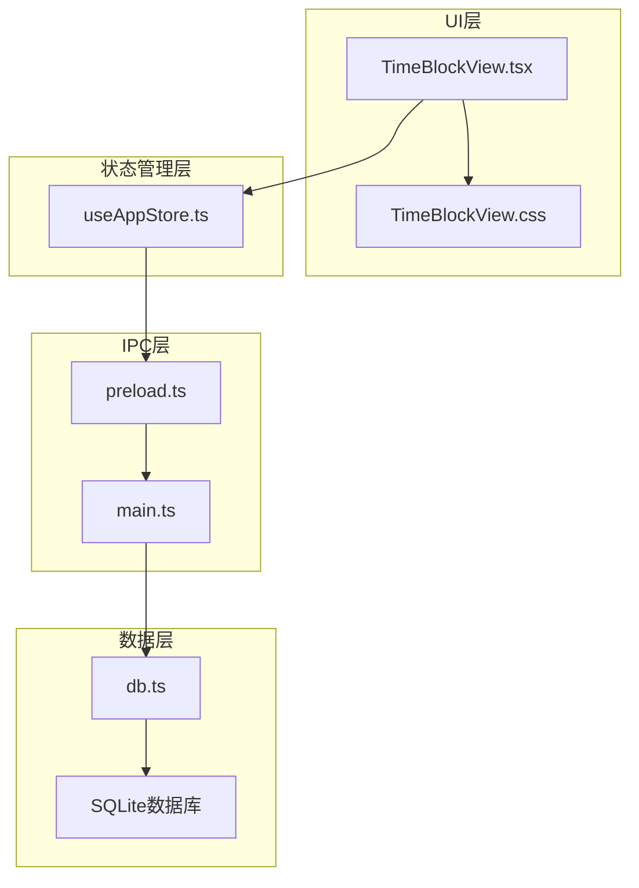

# 时间块管理

<cite>
**本文档引用的文件**
- [TimeBlockView.tsx](file://app/src/components/TimeBlock/TimeBlockView.tsx)
- [TimeBlockView.css](file://app/src/components/TimeBlock/TimeBlockView.css)
- [useAppStore.ts](file://app/src/store/useAppStore.ts)
- [types.ts](file://app/src/types.ts)
- [db.ts](file://app/electron/db.ts)
- [preload.ts](file://app/electron/preload.ts)
- [main.ts](file://app/electron/main.ts)
- [Sidebar.tsx](file://app/src/components/Sidebar/Sidebar.tsx)
</cite>

## 目录
1. [简介](#简介)
2. [项目结构](#项目结构)
3. [核心组件](#核心组件)
4. [架构概览](#架构概览)
5. [详细组件分析](#详细组件分析)
6. [依赖关系分析](#依赖关系分析)
7. [性能考虑](#性能考虑)
8. [故障排除指南](#故障排除指南)
9. [结论](#结论)
10. [附录](#附录)

## 简介

SnowTodo 的时间块管理模块是一个强大的日程可视化系统，它将传统的待办事项与时间轴相结合，为用户提供直观的时间规划体验。该模块的核心功能包括：

- **时间轴可视化**：以24小时制时间轴展示全天的日程安排
- **时间块管理**：支持创建、编辑、删除和移动时间块
- **任务关联**：将时间块与具体的待办任务进行关联
- **颜色标识系统**：通过颜色区分不同类型的时间块
- **实时同步**：本地数据库与UI界面的双向数据同步
- **交互设计**：支持点击选择、双击编辑、拖拽调整等操作

## 项目结构

时间块管理模块采用分层架构设计，主要包含以下层次：

**图表来源**
- [TimeBlockView.tsx:229-347](file://app/src/components/TimeBlock/TimeBlockView.tsx#L229-L347)
- [useAppStore.ts:181-508](file://app/src/store/useAppStore.ts#L181-L508)
- [preload.ts:18-116](file://app/electron/preload.ts#L18-L116)
- [main.ts:227-358](file://app/electron/main.ts#L227-L358)

**章节来源**
- [TimeBlockView.tsx:1-348](file://app/src/components/TimeBlock/TimeBlockView.tsx#L1-L348)
- [useAppStore.ts:1-604](file://app/src/store/useAppStore.ts#L1-L604)

## 核心组件

### 时间块数据模型

时间块是系统的核心数据实体，具有以下关键属性：

| 属性名 | 类型 | 描述 | 默认值 |
|--------|------|------|--------|
| id | string | 唯一标识符 | 自动生成 |
| todoId | string \| null | 关联的待办任务ID | null |
| title | string | 时间块标题 | 必填 |
| startTime | string | 开始时间 (ISO格式) | 必填 |
| endTime | string | 结束时间 (ISO格式) | 必填 |
| color | string \| null | 颜色标识 | null |
| categoryId | string \| null | 分类ID | null |
| isAllDay | boolean | 是否全天 | false |
| notes | string \| null | 备注信息 | null |
| actualPomodoros | number | 实际番茄钟数量 | 0 |

### 时间块渲染组件

时间块渲染组件负责将数据库中的时间块数据转换为可视化的UI元素：

**图表来源**
- [TimeBlockView.tsx:31-75](file://app/src/components/TimeBlock/TimeBlockView.tsx#L31-L75)
- [TimeBlockView.tsx:78-203](file://app/src/components/TimeBlock/TimeBlockView.tsx#L78-L203)

**章节来源**
- [types.ts:103-114](file://app/src/types.ts#L103-L114)
- [TimeBlockView.tsx:31-203](file://app/src/components/TimeBlock/TimeBlockView.tsx#L31-L203)

## 架构概览

时间块管理模块采用客户端-服务器架构，结合Electron的IPC通信机制：

**图表来源**
- [preload.ts:18-116](file://app/electron/preload.ts#L18-L116)
- [main.ts:227-358](file://app/electron/main.ts#L227-L358)
- [db.ts:1500-1552](file://app/electron/db.ts#L1500-L1552)

## 详细组件分析

### 时间轴绘制系统

时间轴系统是时间块管理的核心视觉组件，采用绝对定位和CSS计算实现精确的时间映射：

#### 时间轴坐标计算

**图表来源**
- [TimeBlockView.tsx:10-28](file://app/src/components/TimeBlock/TimeBlockView.tsx#L10-L28)

#### 时间轴渲染逻辑

时间轴系统包含24小时刻度线和小时标签：

- **小时刻度**：每小时一条水平线，用于网格背景
- **小时标签**：显示24小时制的时间标签
- **网格背景**：通过CSS伪元素实现细线网格效果

**章节来源**
- [TimeBlockView.tsx:309-334](file://app/src/components/TimeBlock/TimeBlockView.tsx#L309-L334)
- [TimeBlockView.css:68-98](file://app/src/components/TimeBlock/TimeBlockView.css#L68-L98)

### 时间块卡片组件

时间块卡片是用户交互的主要载体，支持多种交互模式：

#### 卡片布局结构

**图表来源**
- [TimeBlockView.tsx:50-75](file://app/src/components/TimeBlock/TimeBlockView.tsx#L50-L75)

#### 交互行为设计

| 交互类型 | 触发方式 | 行为描述 | 视觉反馈 |
|----------|----------|----------|----------|
| 点击选择 | 左键单击 | 打开编辑面板 | 卡片高亮 |
| 删除操作 | 点击删除按钮 | 弹出确认对话框 | 卡片淡出 |
| 悬停效果 | 鼠标悬停 | 显示删除按钮 | 背景变亮 |
| 拖拽调整 | 按住拖拽 | 支持时间调整 | 边框高亮 |

**章节来源**
- [TimeBlockView.tsx:50-75](file://app/src/components/TimeBlock/TimeBlockView.tsx#L50-L75)
- [TimeBlockView.css:108-175](file://app/src/components/TimeBlock/TimeBlockView.css#L108-L175)

### 编辑面板系统

编辑面板提供完整的CRUD操作界面，支持时间块的创建和修改：

#### 表单字段设计

| 字段名称 | 类型 | 必填 | 说明 |
|----------|------|------|------|
| 标题 | 文本输入 | 是 | 时间块显示名称 |
| 关联任务 | 下拉选择 | 否 | 选择对应的待办任务 |
| 开始时间 | 时间选择器 | 是 | 24小时制时间 |
| 结束时间 | 时间选择器 | 是 | 24小时制时间 |
| 颜色 | 颜色选择器 | 是 | 预设颜色方案 |
| 备注 | 文本域 | 否 | 可选的详细说明 |

#### 颜色标识系统

系统提供8种预设颜色，每种颜色都有特定的语义含义：

| 颜色代码 | 颜色名称 | 使用场景 |
|----------|----------|----------|
| #3b82f6 | 蓝色 | 工作任务 |
| #22c55e | 绿色 | 学习任务 |
| #f97316 | 橙色 | 个人事务 |
| #8b5cf6 | 紫色 | 创意工作 |
| #ec4899 | 粉色 | 社交活动 |
| #14b8a6 | 青色 | 健康运动 |
| #e85d50 | 红色 | 紧急任务 |
| #eab308 | 黄色 | 重要会议 |

**章节来源**
- [TimeBlockView.tsx:78-203](file://app/src/components/TimeBlock/TimeBlockView.tsx#L78-L203)
- [TimeBlockView.tsx:104](file://app/src/components/TimeBlock/TimeBlockView.tsx#L104)

### 当前时间指示器

系统内置当前时间指示器，实时显示用户所在时间的位置：

#### 实时更新机制

**图表来源**
- [TimeBlockView.tsx:206-226](file://app/src/components/TimeBlock/TimeBlockView.tsx#L206-L226)

**章节来源**
- [TimeBlockView.tsx:206-226](file://app/src/components/TimeBlock/TimeBlockView.tsx#L206-L226)

## 依赖关系分析

时间块管理模块的依赖关系呈现清晰的分层结构：

**图表来源**
- [useAppStore.ts:181-508](file://app/src/store/useAppStore.ts#L181-L508)
- [preload.ts:18-116](file://app/electron/preload.ts#L18-L116)
- [main.ts:227-358](file://app/electron/main.ts#L227-L358)

### 组件耦合度分析

- **低耦合**：UI组件与数据层通过IPC接口分离
- **高内聚**：每个组件职责明确，功能单一
- **状态集中**：使用Zustand统一管理应用状态

**章节来源**
- [useAppStore.ts:181-508](file://app/src/store/useAppStore.ts#L181-L508)
- [TimeBlockView.tsx:229-347](file://app/src/components/TimeBlock/TimeBlockView.tsx#L229-L347)

## 性能考虑

### 渲染优化策略

1. **虚拟滚动**：对于大量时间块的情况，可以考虑实现虚拟滚动
2. **防抖处理**：对频繁的UI更新操作进行防抖处理
3. **增量更新**：只更新发生变化的时间块，而非整页重绘

### 数据访问优化

1. **索引优化**：数据库已建立适当的索引（如时间索引）
2. **查询优化**：按日期范围查询，避免全表扫描
3. **缓存策略**：对常用数据进行内存缓存

### 内存管理

1. **组件卸载**：及时清理定时器和事件监听器
2. **状态清理**：合理管理大型对象的状态
3. **垃圾回收**：避免内存泄漏的常见陷阱

## 故障排除指南

### 常见问题及解决方案

#### 时间块显示异常

**问题现象**：时间块位置不正确或重叠

**可能原因**：
- 时间格式不正确（缺少T字符）
- 数据库时间字段格式错误
- CSS单位换算错误

**解决步骤**：
1. 检查时间字符串格式是否符合ISO标准
2. 验证数据库中时间字段的存储格式
3. 确认CSS像素换算常量设置正确

#### 数据同步问题

**问题现象**：UI与数据库状态不一致

**可能原因**：
- IPC通信失败
- 状态更新时机不当
- 数据库事务未提交

**解决步骤**：
1. 检查IPC通道连接状态
2. 确认状态更新回调的执行顺序
3. 验证数据库事务的完整性

#### 性能问题

**问题现象**：页面渲染缓慢或卡顿

**可能原因**：
- 时间块数量过多
- 样式计算复杂
- 事件监听器过多

**解决步骤**：
1. 实施虚拟滚动或分页加载
2. 简化CSS样式计算
3. 合理管理事件监听器生命周期

**章节来源**
- [db.ts:1500-1552](file://app/electron/db.ts#L1500-L1552)
- [TimeBlockView.tsx:258-271](file://app/src/components/TimeBlock/TimeBlockView.tsx#L258-L271)

## 结论

SnowTodo 的时间块管理模块展现了现代任务管理应用的最佳实践：

### 技术优势

1. **架构清晰**：分层设计使得代码易于维护和扩展
2. **用户体验优秀**：直观的时间轴可视化和流畅的交互体验
3. **数据持久化可靠**：基于SQLite的本地存储确保数据安全
4. **性能表现良好**：合理的架构设计保证了良好的运行性能

### 功能特色

1. **灵活的时间块管理**：支持创建、编辑、删除和移动操作
2. **智能的颜色标识**：通过颜色系统提升视觉识别效率
3. **实时同步机制**：UI与数据库的双向数据同步
4. **响应式设计**：适配不同屏幕尺寸和设备类型

### 改进建议

1. **拖拽功能**：可以考虑添加拖拽调整时间块位置的功能
2. **批量操作**：支持批量创建和编辑多个时间块
3. **搜索过滤**：增加按任务、颜色等条件的筛选功能
4. **导出功能**：支持将时间安排导出为日历格式

## 附录

### 使用示例

#### 创建新的时间块

1. 在时间轴上点击空白区域
2. 在弹出的编辑面板中填写基本信息
3. 选择关联的待办任务（可选）
4. 设置开始和结束时间
5. 选择颜色标识
6. 点击保存按钮完成创建

#### 编辑现有时间块

1. 点击要编辑的时间块卡片
2. 在编辑面板中修改相关信息
3. 点击保存按钮确认更改
4. 系统会自动更新数据库和UI显示

#### 删除时间块

1. 将鼠标悬停在时间块上
2. 点击右上角的删除按钮
3. 在确认对话框中选择删除
4. 系统会从数据库中移除该时间块

### 最佳实践建议

1. **合理分配时间**：根据任务的重要性和紧急程度合理安排时间块
2. **颜色编码系统**：建立稳定的颜色编码体系，便于快速识别任务类型
3. **定期回顾**：每天结束时回顾当天的时间块使用情况，优化时间安排
4. **任务关联**：尽量为时间块关联具体的待办任务，提高执行效率
5. **留有缓冲**：在时间块之间预留适当的缓冲时间，应对突发情况