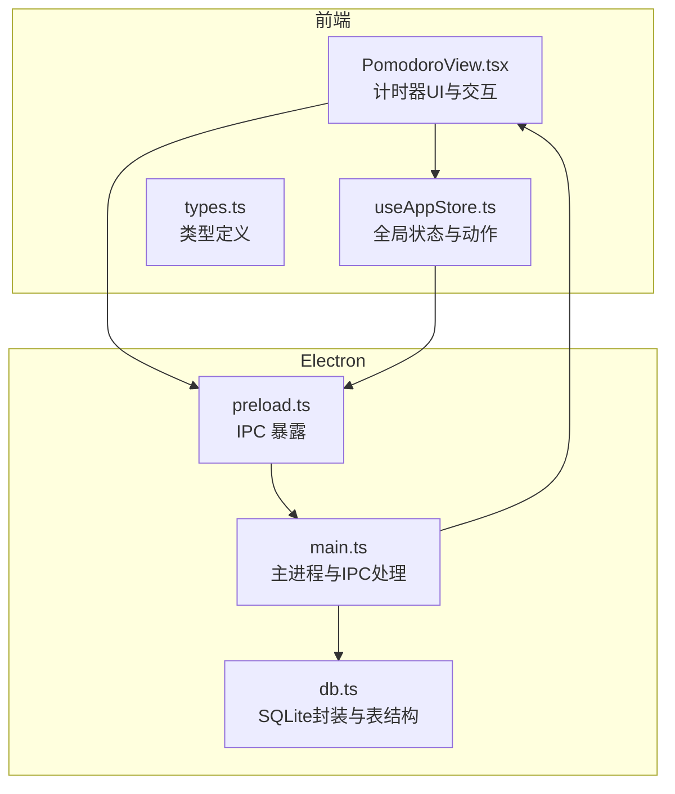
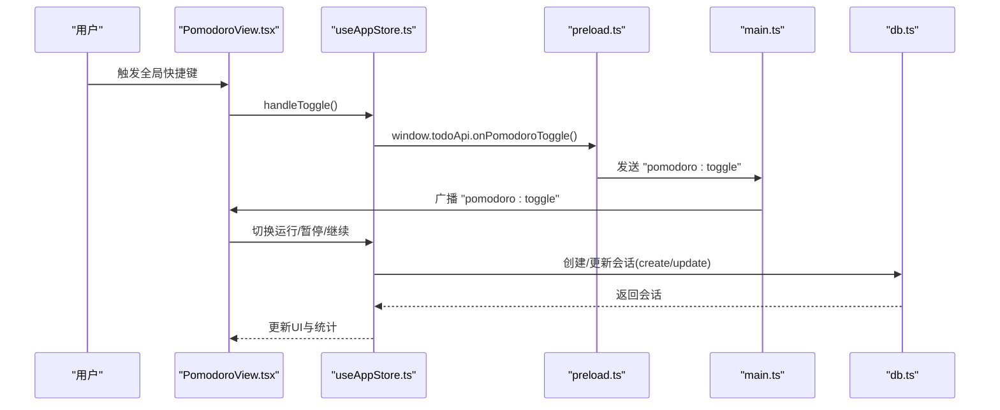
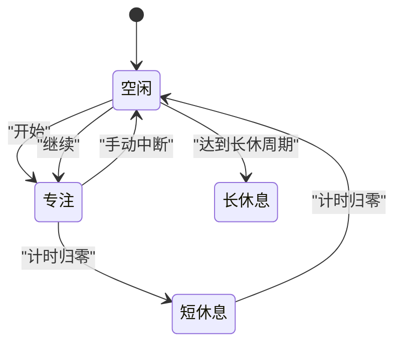
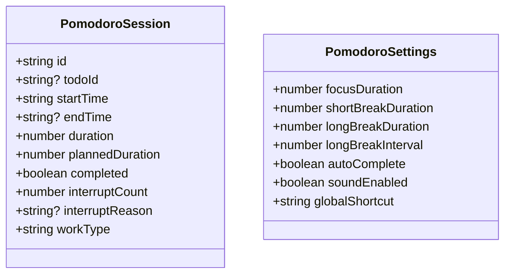
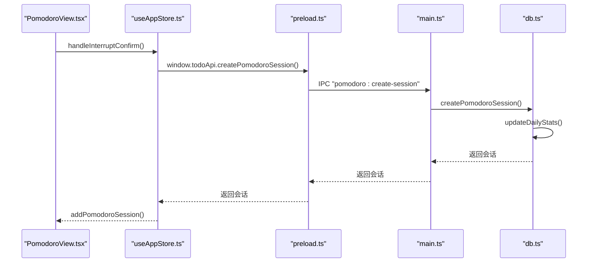
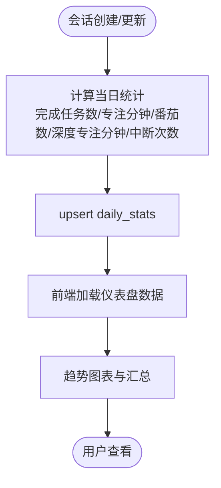
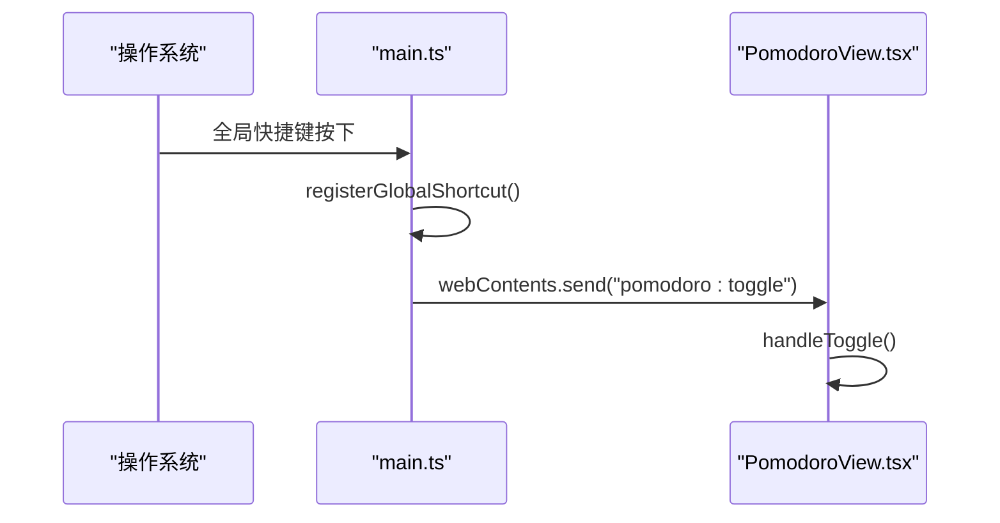
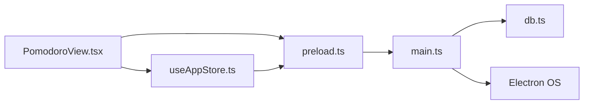

# 番茄工作法

<cite>
**本文引用的文件**
- [PomodoroView.tsx](file://app/src/components/Pomodoro/PomodoroView.tsx)
- [useAppStore.ts](file://app/src/store/useAppStore.ts)
- [types.ts](file://app/src/types.ts)
- [main.ts](file://app/electron/main.ts)
- [db.ts](file://app/electron/db.ts)
- [preload.ts](file://app/electron/preload.ts)
- [DashboardView.tsx](file://app/src/components/Dashboard/DashboardView.tsx)
</cite>

## 目录
1. [简介](#简介)
2. [项目结构](#项目结构)
3. [核心组件](#核心组件)
4. [架构总览](#架构总览)
5. [详细组件分析](#详细组件分析)
6. [依赖关系分析](#依赖关系分析)
7. [性能考量](#性能考量)
8. [故障排查指南](#故障排查指南)
9. [结论](#结论)
10. [附录](#附录)

## 简介
本文件面向 SnowTodo 的“番茄工作法”模块，系统性阐述专注计时器的实现原理、会话生命周期管理、打断记录与存储、统计分析能力、全局快捷键机制，并提供使用示例与性能优化建议。目标是帮助开发者与用户全面理解并高效使用该模块。

## 项目结构
围绕“番茄工作法”的关键代码分布在前端 React 组件、全局状态管理、类型定义以及 Electron 主进程与数据库层：
- 前端组件负责 UI、交互与本地状态；通过 window.todoApi 与主进程通信。
- 全局状态管理负责计时器状态、会话列表与统计数据的集中维护。
- 主进程负责全局快捷键注册、IPC 通信、活跃状态广播与数据库访问。
- 数据库层负责持久化存储、会话与统计的读写。

**图表来源**
- [PomodoroView.tsx:160-480](file://app/src/components/Pomodoro/PomodoroView.tsx#L160-L480)
- [useAppStore.ts:136-421](file://app/src/store/useAppStore.ts#L136-L421)
- [preload.ts:56-73](file://app/electron/preload.ts#L56-L73)
- [main.ts:268-292](file://app/electron/main.ts#L268-L292)
- [db.ts:108-186](file://app/electron/db.ts#L108-L186)

**章节来源**
- [PomodoroView.tsx:160-480](file://app/src/components/Pomodoro/PomodoroView.tsx#L160-L480)
- [useAppStore.ts:136-421](file://app/src/store/useAppStore.ts#L136-L421)
- [types.ts:27-58](file://app/src/types.ts#L27-L58)
- [main.ts:179-193](file://app/electron/main.ts#L179-L193)
- [db.ts:108-186](file://app/electron/db.ts#L108-L186)

## 核心组件
- 计时器与会话生命周期：由前端组件驱动，包含 idle/focus/shortBreak/longBreak 四种阶段，支持开始、暂停、继续、中断、重置。
- 设置与全局快捷键：支持专注/短休/长休时长、长休周期、声音提醒、全局快捷键配置。
- 打断记录：记录中断原因与次数，支持手动输入与自动计算。
- 统计分析：提供今日完成番茄数、专注分钟数、中断次数等基础统计，结合仪表盘进行趋势分析。
- 数据持久化：通过 IPC 将会话写入数据库，自动更新每日统计。

**章节来源**
- [PomodoroView.tsx:185-350](file://app/src/components/Pomodoro/PomodoroView.tsx#L185-L350)
- [useAppStore.ts:136-421](file://app/src/store/useAppStore.ts#L136-L421)
- [types.ts:27-58](file://app/src/types.ts#L27-L58)
- [db.ts:1271-1329](file://app/electron/db.ts#L1271-L1329)
- [DashboardView.tsx:125-248](file://app/src/components/Dashboard/DashboardView.tsx#L125-L248)

## 架构总览
前端组件通过 window.todoApi 与主进程通信，主进程通过 IPC 接口调用数据库层，数据库层以 SQLite 存储会话与统计信息。全局快捷键由主进程注册，触发后向渲染进程发送事件，从而控制计时器状态。

**图表来源**
- [PomodoroView.tsx:205-211](file://app/src/components/Pomodoro/PomodoroView.tsx#L205-L211)
- [useAppStore.ts:136-421](file://app/src/store/useAppStore.ts#L136-L421)
- [preload.ts:64-68](file://app/electron/preload.ts#L64-L68)
- [main.ts:179-193](file://app/electron/main.ts#L179-L193)
- [db.ts:1271-1302](file://app/electron/db.ts#L1271-L1302)

## 详细组件分析

### 计时器与会话生命周期
- 阶段与状态
  - idle：空闲，等待开始；可选择关联任务。
  - focus：专注中，倒计时进行。
  - shortBreak/longBreak：休息阶段，自动切换至 idle 或继续专注。
- 生命周期事件
  - 开始：设置当前阶段为 focus，启动定时器，记录会话起始时间。
  - 暂停/继续：切换 isRunning 状态，维持会话起始时间不变。
  - 结束：当倒计时归零且处于 focus 阶段，保存会话、更新番茄计数、决定下一段阶段、播放提示音。
  - 中断：在专注中点击“中断”，弹出原因输入框，计算实际耗时并保存未完成会话。
  - 重置：回到 idle，清空中断计数与原因，重置倒计时。

**图表来源**
- [PomodoroView.tsx:234-283](file://app/src/components/Pomodoro/PomodoroView.tsx#L234-L283)
- [useAppStore.ts:399-408](file://app/src/store/useAppStore.ts#L399-L408)

**章节来源**
- [PomodoroView.tsx:285-341](file://app/src/components/Pomodoro/PomodoroView.tsx#L285-L341)
- [useAppStore.ts:394-420](file://app/src/store/useAppStore.ts#L394-L420)

### 计时逻辑与数据结构
- 计时逻辑
  - 使用每秒 tick 的定时器推进倒计时。
  - 倒计时归零时触发阶段完成处理，区分专注结束与休息结束。
- 数据结构
  - PomodoroSession：包含会话标识、关联任务、起止时间、实际/计划时长、完成状态、中断次数与原因、工作类型。
  - PomodoroSettings：专注/短休/长休时长、长休周期、自动完成、声音提醒、全局快捷键。

**图表来源**
- [types.ts:27-58](file://app/src/types.ts#L27-L58)

**章节来源**
- [types.ts:27-58](file://app/src/types.ts#L27-L58)
- [useAppStore.ts:407-408](file://app/src/store/useAppStore.ts#L407-L408)

### 打断记录与存储机制
- 打断记录
  - 在专注中点击“中断”时，弹出原因输入框，记录中断原因与次数。
  - 计算实际耗时（毫秒差转分钟），保存为未完成会话。
- 存储流程
  - 前端调用 window.todoApi.createPomodoroSession，主进程通过 IPC 写入数据库。
  - 数据库层执行插入并调用 updateDailyStats 更新当日统计。
  - 同步更新前端 todayPomodoroSessions 与 pomodoroSessions 列表。

**图表来源**
- [PomodoroView.tsx:311-331](file://app/src/components/Pomodoro/PomodoroView.tsx#L311-L331)
- [useAppStore.ts:411-415](file://app/src/store/useAppStore.ts#L411-L415)
- [preload.ts:59-62](file://app/electron/preload.ts#L59-L62)
- [main.ts:276-278](file://app/electron/main.ts#L276-L278)
- [db.ts:1271-1282](file://app/electron/db.ts#L1271-L1282)

**章节来源**
- [PomodoroView.tsx:311-331](file://app/src/components/Pomodoro/PomodoroView.tsx#L311-L331)
- [db.ts:1271-1302](file://app/electron/db.ts#L1271-L1302)

### 统计分析功能
- 今日统计（前端）
  - 完成番茄数：todayPomodoroSessions 中 completed 为真计数。
  - 专注分钟：completed 会话 duration 求和。
  - 中断次数：所有会话 interruptCount 求和。
- 日常统计（数据库）
  - 每次会话创建/更新后，调用 updateDailyStats 计算当日完成任务数、专注分钟、番茄数、深度专注分钟、中断次数，并 upsert 到 daily_stats 表。
- 仪表盘（DashboardView）
  - 支持近 7/14/30 天趋势分析，展示完成任务数、专注时长、番茄数、中断次数等指标。

**图表来源**
- [db.ts:1626-1677](file://app/electron/db.ts#L1626-L1677)
- [DashboardView.tsx:125-248](file://app/src/components/Dashboard/DashboardView.tsx#L125-L248)

**章节来源**
- [PomodoroView.tsx:351-356](file://app/src/components/Pomodoro/PomodoroView.tsx#L351-L356)
- [db.ts:1626-1677](file://app/electron/db.ts#L1626-L1677)
- [DashboardView.tsx:125-248](file://app/src/components/Dashboard/DashboardView.tsx#L125-L248)

### 全局快捷键实现与配置
- 注册与触发
  - 主进程读取 pomodoroSettings.globalShortcut，注册全局快捷键。
  - 快捷键触发时，向渲染进程广播 "pomodoro:toggle"。
  - 渲染进程监听该事件，调用 handleToggle 切换计时器状态。
- 配置更新
  - 前端设置面板允许修改全局快捷键，保存后通过 IPC 更新数据库中的 pomodoroSettings，并重新注册快捷键。

**图表来源**
- [main.ts:179-193](file://app/electron/main.ts#L179-L193)
- [PomodoroView.tsx:205-211](file://app/src/components/Pomodoro/PomodoroView.tsx#L205-L211)
- [preload.ts:64-68](file://app/electron/preload.ts#L64-L68)

**章节来源**
- [main.ts:179-193](file://app/electron/main.ts#L179-L193)
- [PomodoroView.tsx:127-134](file://app/src/components/Pomodoro/PomodoroView.tsx#L127-L134)

## 依赖关系分析
- 组件耦合
  - PomodoroView 依赖 useAppStore 管理状态与动作，依赖 window.todoApi 进行 IPC 通信。
- 状态一致性
  - 前端状态与数据库状态通过 IPC 保持一致，数据库变更后自动更新每日统计。
- 外部依赖
  - Electron globalShortcut 用于全局快捷键。
  - SQLite.js 用于嵌入式数据库存储。

**图表来源**
- [PomodoroView.tsx:160-480](file://app/src/components/Pomodoro/PomodoroView.tsx#L160-L480)
- [useAppStore.ts:136-421](file://app/src/store/useAppStore.ts#L136-L421)
- [preload.ts:56-73](file://app/electron/preload.ts#L56-L73)
- [main.ts:179-193](file://app/electron/main.ts#L179-L193)
- [db.ts:108-186](file://app/electron/db.ts#L108-L186)

**章节来源**
- [PomodoroView.tsx:160-480](file://app/src/components/Pomodoro/PomodoroView.tsx#L160-L480)
- [useAppStore.ts:136-421](file://app/src/store/useAppStore.ts#L136-L421)
- [main.ts:179-193](file://app/electron/main.ts#L179-L193)

## 性能考量
- 定时器开销
  - 每秒 tick 的定时器对 CPU 影响较小，但应确保在组件卸载时清理定时器，避免内存泄漏。
- 数据库写入
  - 会话创建/更新后立即调用 updateDailyStats，建议在批量更新时合并写入，减少频繁 IO。
- 图表渲染
  - 仪表盘按需加载指定日期范围的数据，避免一次性渲染大量历史数据导致卡顿。
- 快捷键注册
  - 修改全局快捷键后及时注销旧快捷键并注册新快捷键，避免冲突与无效注册。

[本节为通用性能建议，无需特定文件引用]

## 故障排查指南
- 全局快捷键无效
  - 检查主进程是否成功注册快捷键，确认 pomodoroSettings.globalShortcut 是否有效。
  - 确认渲染进程已正确监听 "pomodoro:toggle" 事件。
- 会话未保存
  - 检查 window.todoApi.createPomodoroSession 的返回值与错误日志。
  - 确认数据库层 updateDailyStats 是否被调用。
- 统计不更新
  - 确认数据库层 updateDailyStats 的 upsert 逻辑是否执行。
  - 检查前端是否正确加载 dailyStats。

**章节来源**
- [main.ts:179-193](file://app/electron/main.ts#L179-L193)
- [db.ts:1626-1677](file://app/electron/db.ts#L1626-L1677)

## 结论
SnowTodo 的番茄工作法模块通过清晰的阶段化计时、完善的打断记录与存储、自动化的每日统计与仪表盘分析，形成了完整的专注力管理闭环。全局快捷键提升了使用便捷性，而基于 IPC 的前后端协作与 SQLite 存储保障了数据一致性与可靠性。建议在实际使用中根据个人节奏调整时长与周期，并利用统计分析持续优化专注效率。

## 附录

### 使用示例
- 开始专注：在空闲状态下点击“开始”，进入专注阶段。
- 暂停/继续：在专注阶段点击“暂停”或“继续”，保持会话起始时间不变。
- 中断：在专注阶段点击“中断”，输入原因并确认，系统保存未完成会话。
- 重置：在非空闲阶段点击“重置”，回到空闲并清空中断计数。
- 配置：打开设置面板，调整专注/短休/长休时长、长休周期、全局快捷键与声音提醒。

**章节来源**
- [PomodoroView.tsx:285-341](file://app/src/components/Pomodoro/PomodoroView.tsx#L285-L341)
- [PomodoroView.tsx:127-147](file://app/src/components/Pomodoro/PomodoroView.tsx#L127-L147)