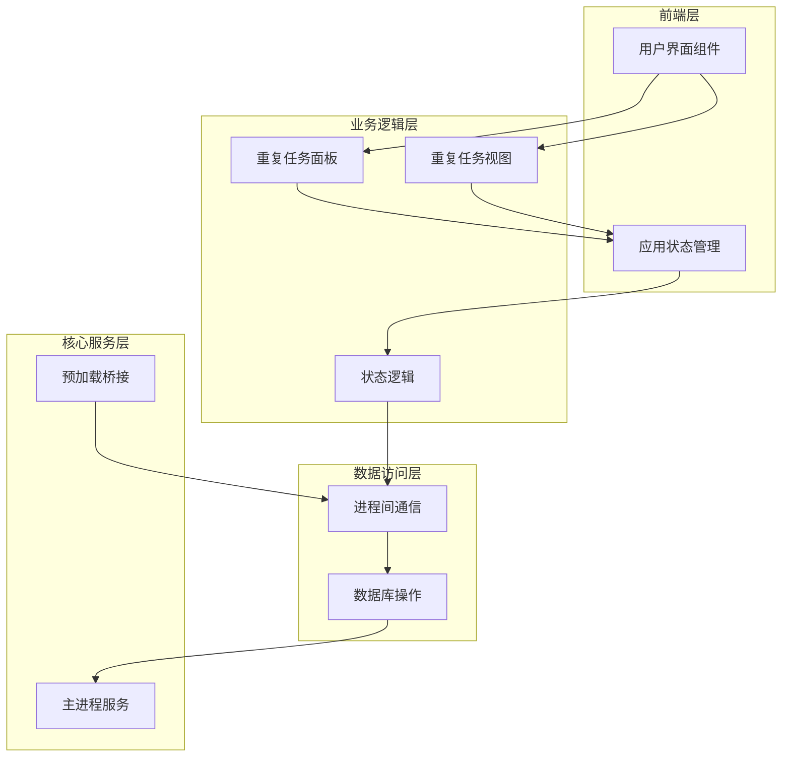
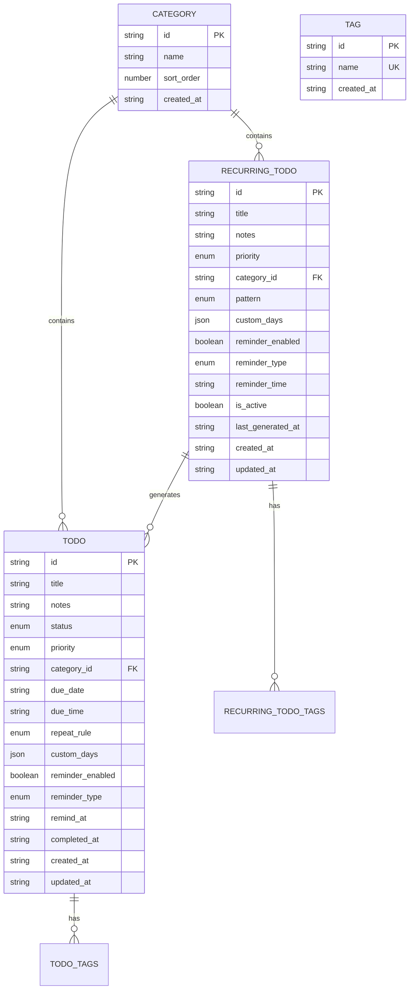
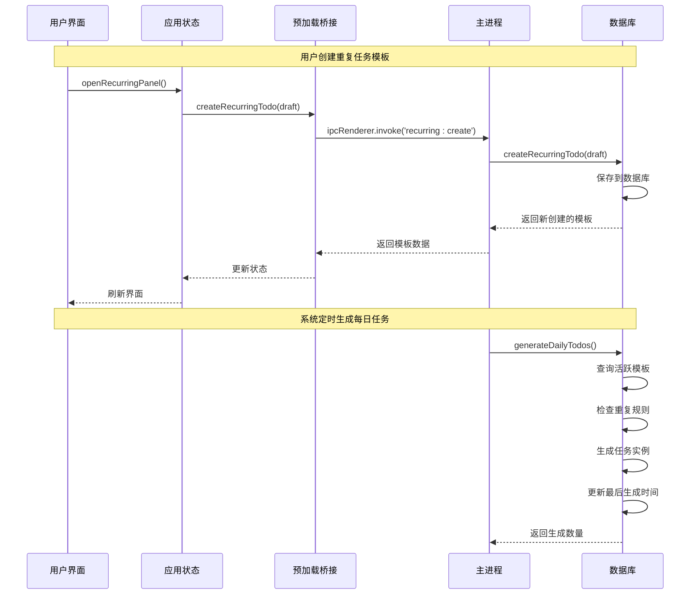
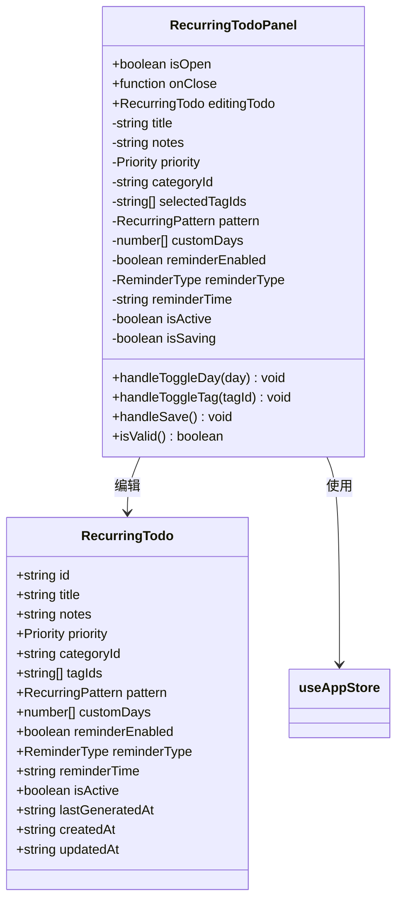
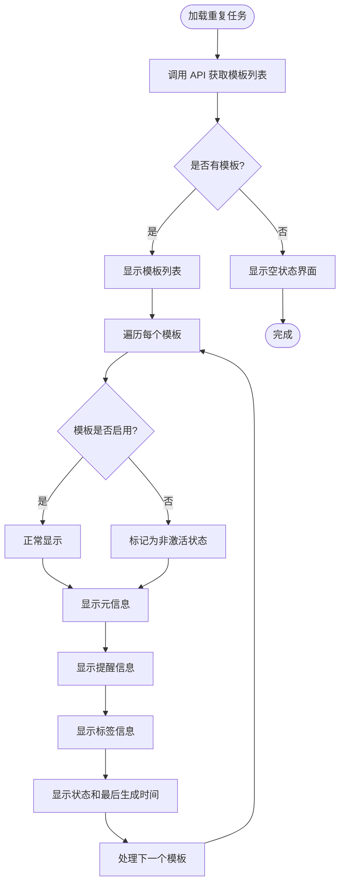
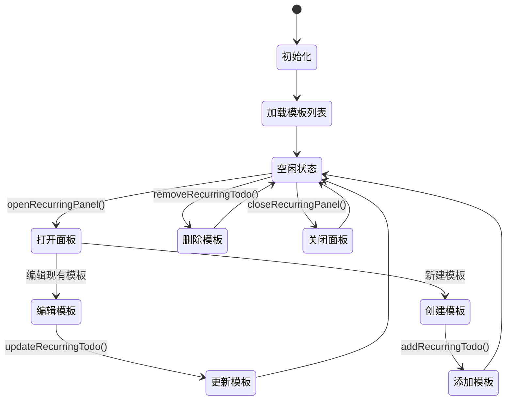
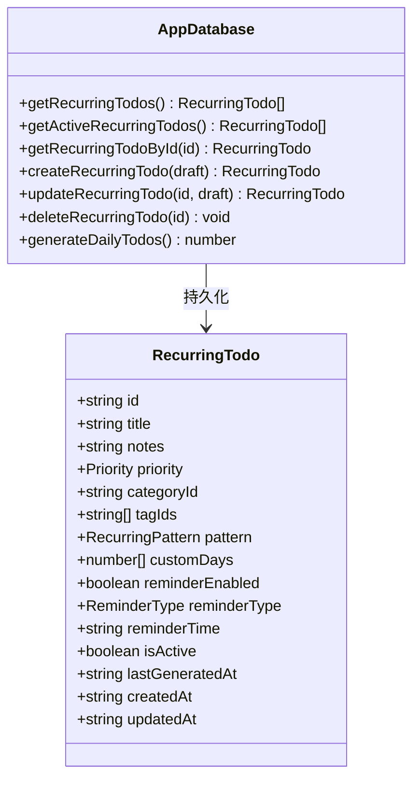
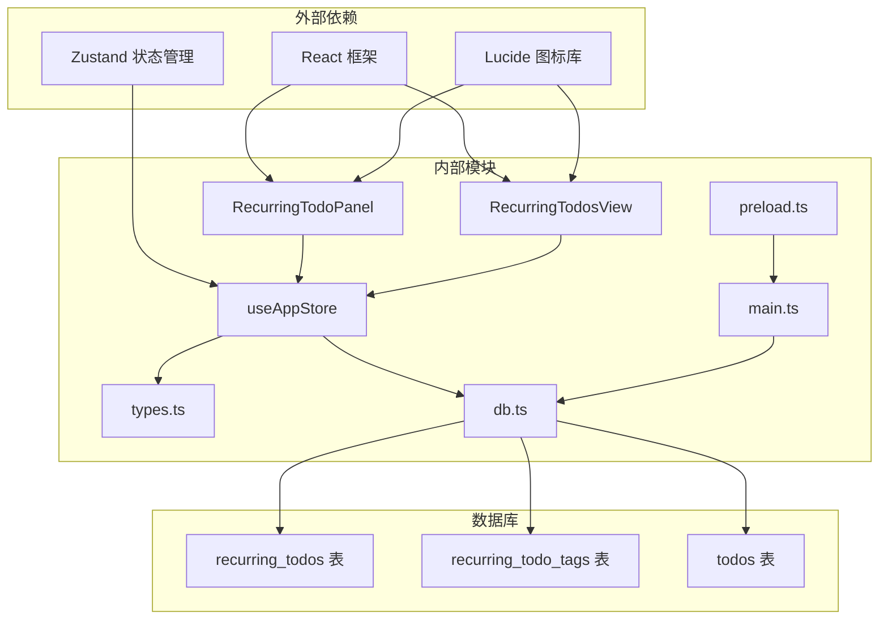

# 重复任务管理

<cite>
**本文档引用的文件**
- [RecurringTodoPanel.tsx](file://app/src/components/RecurringTodos/RecurringTodoPanel.tsx)
- [RecurringTodosView.tsx](file://app/src/components/RecurringTodos/RecurringTodosView.tsx)
- [useAppStore.ts](file://app/src/store/useAppStore.ts)
- [types.ts](file://app/src/types.ts)
- [db.ts](file://app/electron/db.ts)
- [main.ts](file://app/electron/main.ts)
- [preload.ts](file://app/electron/preload.ts)
</cite>

## 目录
1. [简介](#简介)
2. [项目结构](#项目结构)
3. [核心组件](#核心组件)
4. [架构概览](#架构概览)
5. [详细组件分析](#详细组件分析)
6. [依赖关系分析](#依赖关系分析)
7. [性能考虑](#性能考虑)
8. [故障排除指南](#故障排除指南)
9. [结论](#结论)
10. [附录](#附录)

## 简介

SnowTodo 的重复任务管理模块是一个强大的自动化系统，允许用户创建长期存在的任务模板，这些模板会在满足特定条件时自动转换为具体的任务实例。该模块提供了灵活的重复规则配置、智能的自动生成机制、完善的例外处理能力，以及直观的用户界面。

重复任务管理模块的核心价值在于：
- **自动化生成**：无需手动创建每日任务，系统自动根据模板生成
- **灵活配置**：支持多种重复模式（每天、工作日、周末、自定义）
- **智能管理**：内置去重机制，避免重复生成
- **完整生命周期**：从创建到删除的全链路管理
- **状态同步**：与主任务系统无缝集成

## 项目结构

重复任务管理模块采用分层架构设计，主要包含以下层次：

**图表来源**
- [RecurringTodoPanel.tsx:1-368](file://app/src/components/RecurringTodos/RecurringTodoPanel.tsx#L1-L368)
- [RecurringTodosView.tsx:1-218](file://app/src/components/RecurringTodos/RecurringTodosView.tsx#L1-L218)
- [useAppStore.ts:1-604](file://app/src/store/useAppStore.ts#L1-L604)

**章节来源**
- [RecurringTodoPanel.tsx:1-368](file://app/src/components/RecurringTodos/RecurringTodoPanel.tsx#L1-L368)
- [RecurringTodosView.tsx:1-218](file://app/src/components/RecurringTodos/RecurringTodosView.tsx#L1-L218)
- [useAppStore.ts:1-604](file://app/src/store/useAppStore.ts#L1-L604)

## 核心组件

### 数据模型

重复任务系统基于以下核心数据模型：

**图表来源**
- [types.ts:223-258](file://app/src/types.ts#L223-L258)
- [db.ts:358-382](file://app/electron/db.ts#L358-L382)

### 重复规则类型

系统支持四种重复模式：

| 模式 | 描述 | 星期匹配规则 |
|------|------|-------------|
| daily | 每天 | 所有星期都匹配 |
| weekdays | 工作日 | 周一至周五（1-5） |
| weekends | 周末 | 周六和周日（0,6） |
| custom | 自定义 | 用户选择的具体星期 |

**章节来源**
- [types.ts:4-5](file://app/src/types.ts#L4-L5)
- [RecurringTodoPanel.tsx:16-21](file://app/src/components/RecurringTodos/RecurringTodoPanel.tsx#L16-L21)

## 架构概览

重复任务管理模块采用客户端-服务器架构，通过IPC通道实现前后端通信：

**图表来源**
- [useAppStore.ts:557-562](file://app/src/store/useAppStore.ts#L557-L562)
- [preload.ts:49-54](file://app/electron/preload.ts#L49-L54)
- [main.ts:261-266](file://app/electron/main.ts#L261-L266)

## 详细组件分析

### 重复任务面板组件

重复任务面板是用户配置和管理重复任务模板的主要界面：

**图表来源**
- [RecurringTodoPanel.tsx:40-44](file://app/src/components/RecurringTodos/RecurringTodoPanel.tsx#L40-L44)
- [types.ts:224-243](file://app/src/types.ts#L224-L243)

#### 面板特性

1. **多模式重复规则**：支持四种重复模式的选择
2. **自定义星期选择**：针对自定义模式提供星期选择器
3. **提醒系统集成**：可配置提醒时间和提醒类型
4. **标签管理**：支持多标签关联
5. **状态控制**：可启用或停用模板

**章节来源**
- [RecurringTodoPanel.tsx:46-142](file://app/src/components/RecurringTodos/RecurringTodoPanel.tsx#L46-L142)

### 重复任务视图组件

重复任务视图提供模板列表的展示和管理功能：

**图表来源**
- [RecurringTodosView.tsx:28-217](file://app/src/components/RecurringTodos/RecurringTodosView.tsx#L28-L217)

#### 视图功能

1. **模板列表展示**：以卡片形式展示所有重复任务模板
2. **状态可视化**：通过颜色和图标显示模板状态
3. **快速操作**：支持启用/停用、编辑、删除操作
4. **元信息显示**：显示重复规则、提醒设置、标签等信息

**章节来源**
- [RecurringTodosView.tsx:28-217](file://app/src/components/RecurringTodos/RecurringTodosView.tsx#L28-L217)

### 应用状态管理

应用状态管理负责协调重复任务相关的所有状态变化：

**图表来源**
- [useAppStore.ts:291-294](file://app/src/store/useAppStore.ts#L291-L294)
- [useAppStore.ts:102-109](file://app/src/store/useAppStore.ts#L102-L109)

#### 状态管理特性

1. **模板生命周期管理**：完整的 CRUD 操作支持
2. **面板状态控制**：打开/关闭重复任务面板的状态管理
3. **数据同步**：确保前端状态与数据库状态一致
4. **错误处理**：提供统一的错误处理机制

**章节来源**
- [useAppStore.ts:102-109](file://app/src/store/useAppStore.ts#L102-L109)

### 数据库层实现

数据库层实现了重复任务模板的持久化存储和查询功能：

**图表来源**
- [db.ts:1057-1181](file://app/electron/db.ts#L1057-L1181)
- [db.ts:1183-1252](file://app/electron/db.ts#L1183-L1252)

#### 数据库特性

1. **模板存储**：完整的重复任务模板数据持久化
2. **智能生成**：自动检查和生成每日任务实例
3. **去重机制**：防止同一天重复生成相同模板
4. **索引优化**：为查询性能优化建立适当索引

**章节来源**
- [db.ts:1057-1252](file://app/electron/db.ts#L1057-L1252)

## 依赖关系分析

重复任务管理模块的依赖关系如下：

**图表来源**
- [RecurringTodoPanel.tsx:12](file://app/src/components/RecurringTodos/RecurringTodoPanel.tsx#L12)
- [RecurringTodosView.tsx:15](file://app/src/components/RecurringTodos/RecurringTodosView.tsx#L15)
- [useAppStore.ts:1](file://app/src/store/useAppStore.ts#L1)
- [db.ts:1](file://app/electron/db.ts#L1)

### 组件耦合度

重复任务管理模块展现了良好的内聚性和低耦合性：

- **UI 组件**：专注于用户交互，不直接操作数据库
- **状态管理**：集中处理业务逻辑，提供统一的数据接口
- **数据访问**：封装数据库操作，提供事务安全
- **IPC 通信**：清晰的进程间通信边界

**章节来源**
- [useAppStore.ts:1-604](file://app/src/store/useAppStore.ts#L1-L604)
- [db.ts:1-1825](file://app/electron/db.ts#L1-L1825)

## 性能考虑

### 查询优化

1. **索引策略**：为 `recurring_todos` 表的 `is_active` 字段建立索引，加速活跃模板查询
2. **批量操作**：数据库层支持批量生成任务实例，减少多次往返
3. **缓存机制**：应用状态管理提供本地缓存，减少重复查询

### 内存管理

1. **状态清理**：面板关闭时自动清理临时状态
2. **事件监听**：组件卸载时移除事件监听器，防止内存泄漏
3. **数据序列化**：使用 JSON 序列化复杂数据结构，确保传输效率

### 并发处理

1. **生成锁**：通过 `last_generated_at` 字段实现生成过程的原子性
2. **事务隔离**：数据库操作在事务中执行，保证数据一致性
3. **异步处理**：所有网络操作都是异步的，不影响主线程响应

## 故障排除指南

### 常见问题及解决方案

#### 问题1：重复任务未生成
**症状**：创建了重复任务模板但没有生成对应的任务实例

**可能原因**：
1. 模板未启用
2. 日期不在重复规则范围内
3. 今天已经生成过该模板

**解决步骤**：
1. 检查模板状态是否为启用
2. 验证重复规则是否适用于当前日期
3. 查看 `lastGeneratedAt` 字段确认是否已生成

**章节来源**
- [db.ts:1183-1252](file://app/electron/db.ts#L1183-L1252)

#### 问题2：生成重复任务
**症状**：同一天生成了多个相同的任务实例

**解决方法**：
系统通过 `lastGeneratedAt` 字段自动防止重复生成。如果遇到此问题，检查数据库中的该字段值。

#### 问题3：模板更新不生效
**症状**：修改了重复任务模板但生成的任务仍使用旧配置

**解决步骤**：
1. 确认模板已正确保存
2. 检查数据库中的模板记录
3. 重启应用确保状态同步

**章节来源**
- [db.ts:1103-1169](file://app/electron/db.ts#L1103-L1169)

### 调试工具

1. **开发者工具**：使用浏览器开发者工具监控网络请求
2. **数据库查看器**：直接查询 SQLite 数据库验证数据状态
3. **日志输出**：系统会输出关键操作的日志信息

## 结论

SnowTodo 的重复任务管理模块是一个设计精良的自动化系统，它成功地解决了日常重复性任务管理的痛点。通过灵活的配置选项、智能的生成机制、完善的错误处理和直观的用户界面，该模块为用户提供了高效的重复任务管理体验。

模块的主要优势包括：
- **易用性**：简洁直观的用户界面，降低学习成本
- **灵活性**：支持多种重复模式，适应不同使用场景
- **可靠性**：完善的错误处理和数据一致性保障
- **扩展性**：模块化设计便于功能扩展和维护

未来可以考虑的功能增强：
- 历史记录的详细查看功能
- 更复杂的例外日期处理
- 与其他功能模块的深度集成
- 移动端同步支持

## 附录

### 使用场景示例

#### 场景1：每日例行任务
- **模板**：每天早上发送日报
- **配置**：重复模式选择 "每天"，提醒时间设置为 "09:00"
- **效果**：每天都会生成一条对应的日报任务

#### 场景2：工作日专用任务
- **模板**：工作日需要完成的会议准备
- **配置**：重复模式选择 "工作日"，提醒类型选择 "系统通知"
- **效果**：周一至周五自动生成会议准备任务

#### 场景3：自定义频率任务
- **模板**：每周三和周五的专项工作
- **配置**：重复模式选择 "自定义"，勾选周三和周五
- **效果**：仅在指定星期生成相应任务

### 配置最佳实践

1. **模板命名**：使用明确的标题，便于识别和管理
2. **提醒设置**：根据任务重要性和紧急程度合理设置提醒
3. **标签分类**：为相似任务使用相同标签，便于筛选和统计
4. **定期审查**：定期检查和调整重复任务模板，确保符合实际需求