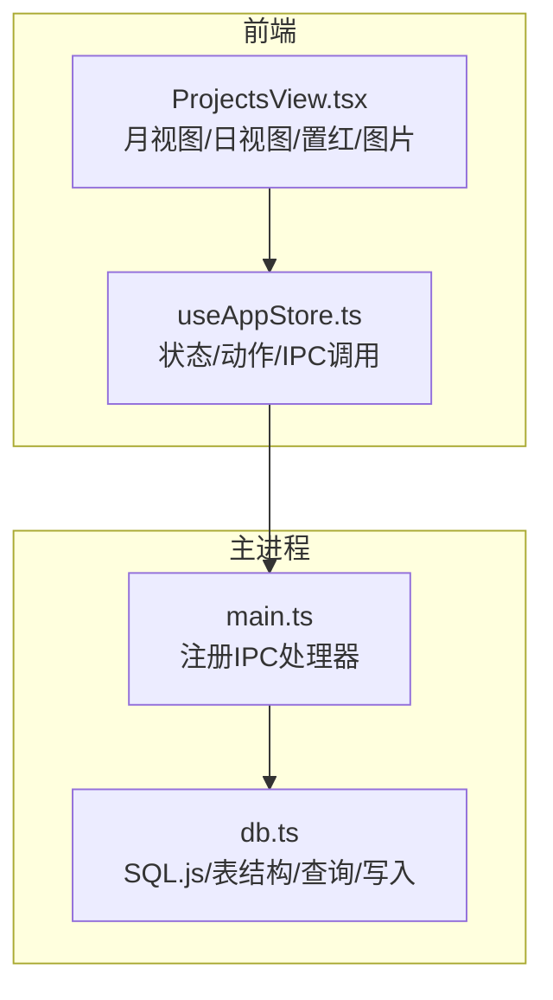
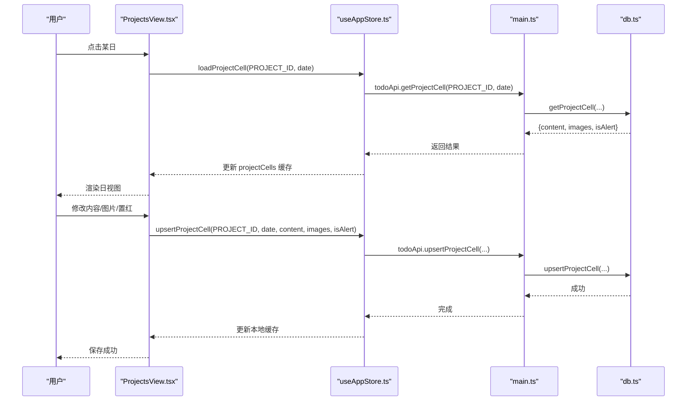
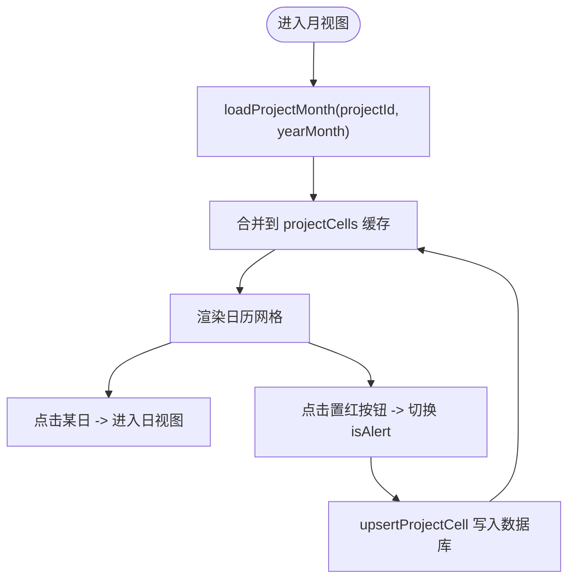
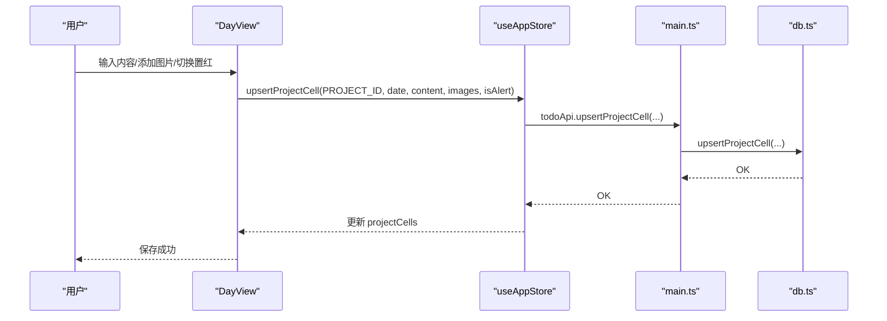
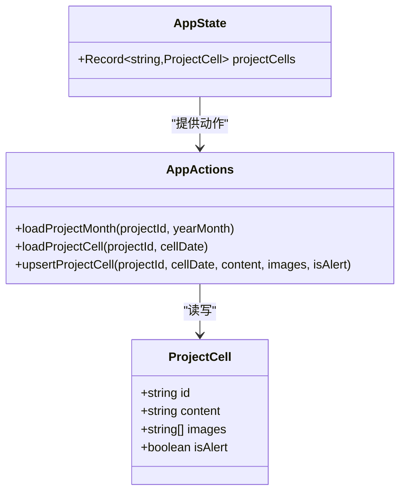
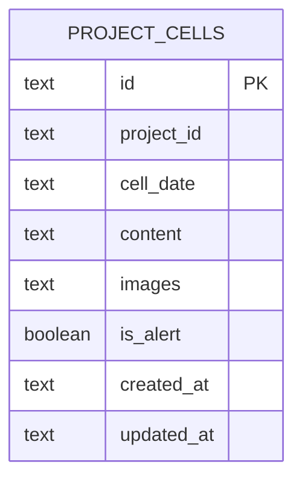
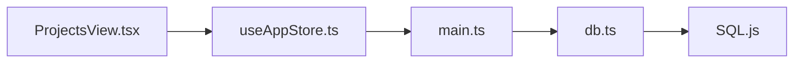

# 项目管理

<cite>
**本文引用的文件**
- [ProjectsView.tsx](file://app/src/components/Projects/ProjectsView.tsx)
- [useAppStore.ts](file://app/src/store/useAppStore.ts)
- [db.ts](file://app/electron/db.ts)
- [main.ts](file://app/electron/main.ts)
- [types.ts](file://app/src/types.ts)
</cite>

## 目录
1. [简介](#简介)
2. [项目结构](#项目结构)
3. [核心组件](#核心组件)
4. [架构总览](#架构总览)
5. [详细组件分析](#详细组件分析)
6. [依赖关系分析](#依赖关系分析)
7. [性能考量](#性能考量)
8. [故障排查指南](#故障排查指南)
9. [结论](#结论)
10. [附录](#附录)

## 简介
本文件面向 SnowTodo 的“项目管理”能力，聚焦于“项目集合”的可视化与交互，包括：
- 项目集合的月视图与日视图展示
- 项目单元格（按日）的内容编辑、图片上传与置红标记
- 项目数据的持久化与批量加载
- 项目集合与提醒系统的关系说明
- 项目间任务分配与依赖关系的现状与扩展建议

注意：当前仓库未实现“项目”实体的独立管理（如创建/编辑/删除项目），亦未实现“任务在项目间的分配与依赖”。本文将基于现有“项目集合”能力进行文档化，并给出最佳实践与扩展建议。

## 项目结构
项目管理相关代码主要分布在以下位置：
- 前端视图层：app/src/components/Projects/ProjectsView.tsx
- 应用状态与数据接口：app/src/store/useAppStore.ts
- 数据库与IPC：app/electron/db.ts、app/electron/main.ts
- 类型定义：app/src/types.ts

图表来源
- [ProjectsView.tsx:317-355](file://app/src/components/Projects/ProjectsView.tsx#L317-L355)
- [useAppStore.ts:473-508](file://app/src/store/useAppStore.ts#L473-L508)
- [main.ts:348-357](file://app/electron/main.ts#L348-L357)
- [db.ts:1771-1823](file://app/electron/db.ts#L1771-L1823)

章节来源
- [ProjectsView.tsx:1-355](file://app/src/components/Projects/ProjectsView.tsx#L1-L355)
- [useAppStore.ts:1-604](file://app/src/store/useAppStore.ts#L1-L604)
- [db.ts:1-800](file://app/electron/db.ts#L1-L800)
- [main.ts:340-391](file://app/electron/main.ts#L340-L391)
- [types.ts:270-278](file://app/src/types.ts#L270-L278)

## 核心组件
- 月视图 MonthView：渲染指定年月的日历网格，支持批量加载当月单元格、置红标记、悬浮预览。
- 日视图 DayView：针对选定日期的单元格进行内容编辑、图片上传/粘贴/拖拽、置红切换、图片网格与放大查看。
- 应用状态 useAppStore：维护 projectCells 映射，提供 loadProjectMonth/loadProjectCell/upsertProjectCell 动作，通过 window.todoApi 调用主进程。
- 主进程 IPC：注册 project:* 相关处理器，委托数据库执行查询与写入。
- 数据库 db.ts：定义 project_cells 表结构与索引，提供按月/按日查询与 upsert 写入。

章节来源
- [ProjectsView.tsx:45-144](file://app/src/components/Projects/ProjectsView.tsx#L45-L144)
- [ProjectsView.tsx:147-315](file://app/src/components/Projects/ProjectsView.tsx#L147-L315)
- [useAppStore.ts:473-508](file://app/src/store/useAppStore.ts#L473-L508)
- [main.ts:348-357](file://app/electron/main.ts#L348-L357)
- [db.ts:490-504](file://app/electron/db.ts#L490-L504)

## 架构总览
项目集合采用“前端视图 + 状态管理 + IPC + 主进程数据库”的分层设计：
- 视图层负责渲染与交互（月/日视图、置红、图片上传）
- 状态层负责缓存与动作（projectCells 缓存、批量加载、单日加载、写入）
- IPC 层负责前后端通信（注册处理器、调用数据库）
- 数据库层负责持久化（project_cells 表、索引、查询/写入）

图表来源
- [ProjectsView.tsx:147-315](file://app/src/components/Projects/ProjectsView.tsx#L147-L315)
- [useAppStore.ts:488-507](file://app/src/store/useAppStore.ts#L488-L507)
- [main.ts:348-357](file://app/electron/main.ts#L348-L357)
- [db.ts:1789-1823](file://app/electron/db.ts#L1789-L1823)

## 详细组件分析

### 月视图 MonthView
- 渲染逻辑：根据年月计算当月天数与首日偏移，生成空单元格与日期单元格；每个单元格包含日期数字、置红按钮、图片缩略图、文字预览与悬浮提示。
- 性能优化：进入月视图时一次性调用 loadProjectMonth 加载整月数据，减少多次请求。
- 置红交互：handleToggleAlert 在月视图直接切换 isAlert，避免进入日视图。
- 数据来源：useAppStore.projectCells 作为本地缓存，key 为 `${projectId}_${date}`。

图表来源
- [ProjectsView.tsx:45-144](file://app/src/components/Projects/ProjectsView.tsx#L45-L144)
- [useAppStore.ts:473-486](file://app/src/store/useAppStore.ts#L473-L486)
- [db.ts:1773-1787](file://app/electron/db.ts#L1773-L1787)

章节来源
- [ProjectsView.tsx:45-144](file://app/src/components/Projects/ProjectsView.tsx#L45-L144)
- [useAppStore.ts:473-486](file://app/src/store/useAppStore.ts#L473-L486)
- [db.ts:1773-1787](file://app/electron/db.ts#L1773-L1787)

### 日视图 DayView
- 编辑能力：文本域支持粘贴、失焦保存；图片支持点击上传、拖拽/粘贴/拖放；图片网格支持放大与删除。
- 置红开关：顶部“飘红”按钮切换 isAlert 并保存。
- 交互细节：拖拽高亮、轻量级预览、缩略图悬浮预览、大图灯箱。
- 数据同步：所有变更通过 upsertProjectCell 写入数据库并更新本地缓存。

图表来源
- [ProjectsView.tsx:147-315](file://app/src/components/Projects/ProjectsView.tsx#L147-L315)
- [useAppStore.ts:498-507](file://app/src/store/useAppStore.ts#L498-L507)
- [db.ts:1804-1823](file://app/electron/db.ts#L1804-L1823)

章节来源
- [ProjectsView.tsx:147-315](file://app/src/components/Projects/ProjectsView.tsx#L147-L315)
- [useAppStore.ts:498-507](file://app/src/store/useAppStore.ts#L498-L507)
- [db.ts:1804-1823](file://app/electron/db.ts#L1804-L1823)

### 状态与动作：useAppStore 中的项目集合
- 状态：projectCells 为 Record<string, ProjectCell>，key 为 `${projectId}_${date}`。
- 动作：
  - loadProjectMonth：批量拉取某年月的所有单元格，合并进缓存
  - loadProjectCell：按日拉取单个单元格
  - upsertProjectCell：写入或更新单元格内容、图片、置红标记
- IPC 接口：通过 window.todoApi 调用主进程处理器。

图表来源
- [useAppStore.ts:30-80](file://app/src/store/useAppStore.ts#L30-L80)
- [useAppStore.ts:172-176](file://app/src/store/useAppStore.ts#L172-L176)
- [types.ts:272-277](file://app/src/types.ts#L272-L277)

章节来源
- [useAppStore.ts:30-80](file://app/src/store/useAppStore.ts#L30-L80)
- [useAppStore.ts:172-176](file://app/src/store/useAppStore.ts#L172-L176)
- [types.ts:272-277](file://app/src/types.ts#L272-L277)

### 数据模型：project_cells
- 表结构：包含 id、project_id、cell_date、content、images、is_alert、created_at、updated_at。
- 索引：对 cell_date 与 project_id 建有索引，提升按月/按项目查询效率。
- 查询/写入：
  - 按月查询：getProjectCellsByMonth(projectId, yearMonth)
  - 按日查询：getProjectCell(projectId, cellDate)
  - 写入/更新：upsertProjectCell(projectId, cellDate, content, images, isAlert)

图表来源
- [db.ts:490-504](file://app/electron/db.ts#L490-L504)
- [db.ts:1773-1823](file://app/electron/db.ts#L1773-L1823)

章节来源
- [db.ts:490-504](file://app/electron/db.ts#L490-L504)
- [db.ts:1773-1823](file://app/electron/db.ts#L1773-L1823)

### IPC 与数据库对接
- 注册处理器：
  - project:get-cells-by-month
  - project:get-cell
  - project:upsert-cell
- 主进程调用数据库对应方法，返回结果或执行写入。

章节来源
- [main.ts:348-357](file://app/electron/main.ts#L348-L357)
- [db.ts:1773-1823](file://app/electron/db.ts#L1773-L1823)

## 依赖关系分析
- 组件耦合：
  - ProjectsView 依赖 useAppStore 的 actions 与 projectCells 状态
  - useAppStore 通过 window.todoApi 与主进程通信
  - 主进程通过 db.ts 访问 SQLite 数据库
- 外部依赖：
  - SQL.js：WebAssembly 版本的 SQLite
  - Electron IPC：前后端通信通道
- 潜在循环依赖：
  - 未见直接循环依赖；前端视图仅消费状态，不反向写回 store 的全局状态

图表来源
- [ProjectsView.tsx:1-5](file://app/src/components/Projects/ProjectsView.tsx#L1-L5)
- [useAppStore.ts:1-504](file://app/src/store/useAppStore.ts#L1-L504)
- [main.ts:348-357](file://app/electron/main.ts#L348-L357)
- [db.ts:1-80](file://app/electron/db.ts#L1-L80)

章节来源
- [ProjectsView.tsx:1-5](file://app/src/components/Projects/ProjectsView.tsx#L1-L5)
- [useAppStore.ts:1-604](file://app/src/store/useAppStore.ts#L1-L604)
- [main.ts:348-357](file://app/electron/main.ts#L348-L357)
- [db.ts:1-800](file://app/electron/db.ts#L1-L800)

## 性能考量
- 批量加载：月视图进入时一次性加载整月单元格，降低网络/IPC 次数
- 本地缓存：projectCells 作为内存缓存，避免重复请求
- 索引优化：project_cells 对 cell_date 与 project_id 建有索引，查询高效
- 图片处理：前端将图片转为 base64 存储，注意存储体积与序列化开销
- 建议：
  - 控制单日图片数量与尺寸，避免过多 base64 字符串
  - 可考虑分页或懒加载策略（当前已按月批量加载，可评估按季度或年度分批）

[本节为通用性能建议，无需特定文件来源]

## 故障排查指南
- 无法加载月视图数据
  - 检查是否正确传入 PROJECT_ID 与 yearMonth
  - 查看控制台是否有 IPC 错误
  - 确认数据库中是否存在对应记录
- 置红标记无效
  - 确认 handleToggleAlert 是否被调用
  - 检查 upsertProjectCell 是否成功返回
- 图片无法上传/显示
  - 检查拖拽/粘贴事件是否触发
  - 确认图片数组是否正确更新
- 数据库异常
  - 检查 project_cells 表是否存在与索引是否建立
  - 关注 SQL.js 初始化路径与 wasm 文件加载

章节来源
- [ProjectsView.tsx:66-72](file://app/src/components/Projects/ProjectsView.tsx#L66-L72)
- [useAppStore.ts:473-507](file://app/src/store/useAppStore.ts#L473-L507)
- [db.ts:1773-1823](file://app/electron/db.ts#L1773-L1823)

## 结论
SnowTodo 的项目管理模块以“项目集合”为核心，提供月/日双视图与单元格内容编辑、图片管理、置红标记等能力。其架构清晰、性能友好（批量加载 + 本地缓存），数据持久化通过 SQL.js 与 project_cells 表实现。当前未实现“项目实体管理”与“任务在项目间的分配/依赖”，后续可在此基础上扩展。

[本节为总结性内容，无需特定文件来源]

## 附录

### 项目进度追踪与统计说明
- 当前仓库未提供“项目进度追踪”的专用统计字段或算法
- 项目集合以“单元格内容/置红/图片”为主，不直接映射到任务完成状态统计
- 若需实现进度统计，可在现有 project_cells 基础上扩展“任务计数/完成计数/依赖关系”等字段，并在前端实现计算逻辑

[本节为概念性说明，无需特定文件来源]

### 月度视图展示逻辑与数据组织
- 展示逻辑：根据年月计算首日偏移与当月天数，生成日历网格
- 数据组织：以 `${projectId}_${date}` 为 key 存储在 projectCells 中，便于快速定位与更新
- 性能要点：进入月视图时一次性加载，避免频繁请求

章节来源
- [ProjectsView.tsx:7-18](file://app/src/components/Projects/ProjectsView.tsx#L7-L18)
- [ProjectsView.tsx:54-63](file://app/src/components/Projects/ProjectsView.tsx#L54-L63)
- [useAppStore.ts:78-80](file://app/src/store/useAppStore.ts#L78-L80)

### 项目警报系统配置与触发机制
- 项目集合支持“置红”标记（isAlert），用于突出某日重要性
- 警报系统（Health Reminder）与项目集合相互独立，分别维护各自的表与触发逻辑
- 若需将项目集合与提醒联动，可在现有 isAlert 基础上扩展“提醒类型/时间/消息”等字段，并在主进程或前端实现触发逻辑

章节来源
- [ProjectsView.tsx:66-72](file://app/src/components/Projects/ProjectsView.tsx#L66-L72)
- [db.ts:137-146](file://app/electron/db.ts#L137-L146)

### 项目间任务分配与依赖关系管理
- 当前仓库未实现“项目实体”与“任务在项目间的分配/依赖”
- 建议扩展方向：
  - 新增 projects 表与 project_tasks 关联表
  - 在 project_cells 中增加“任务ID列表/依赖关系”字段
  - 在前端提供项目选择与任务拖拽分配界面
  - 在数据库层新增查询与更新逻辑

[本节为扩展建议，无需特定文件来源]

### 示例与最佳实践
- 示例：使用月视图记录“里程碑日期”与“关键节点图片”，通过置红标记提醒
- 最佳实践：
  - 合理控制图片数量与大小，避免 base64 过大
  - 使用置红标记区分重要日期，配合日视图详细记录
  - 将项目集合与健康提醒等系统结合，形成统一的“重要日期”管理

[本节为通用建议，无需特定文件来源]