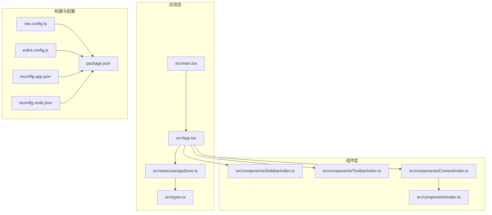
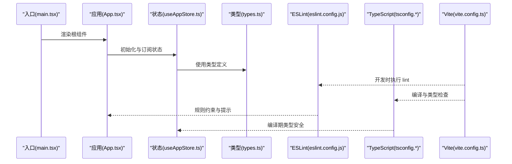
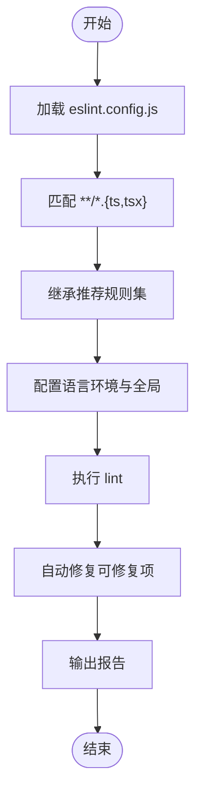
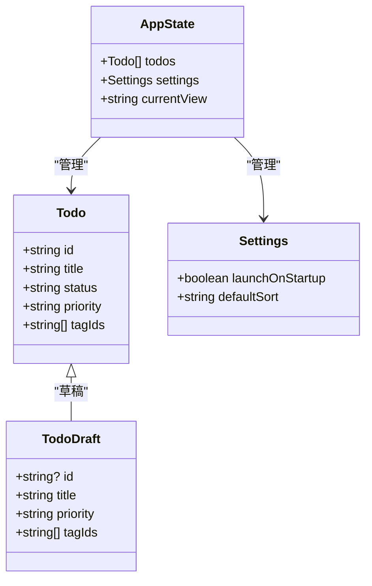
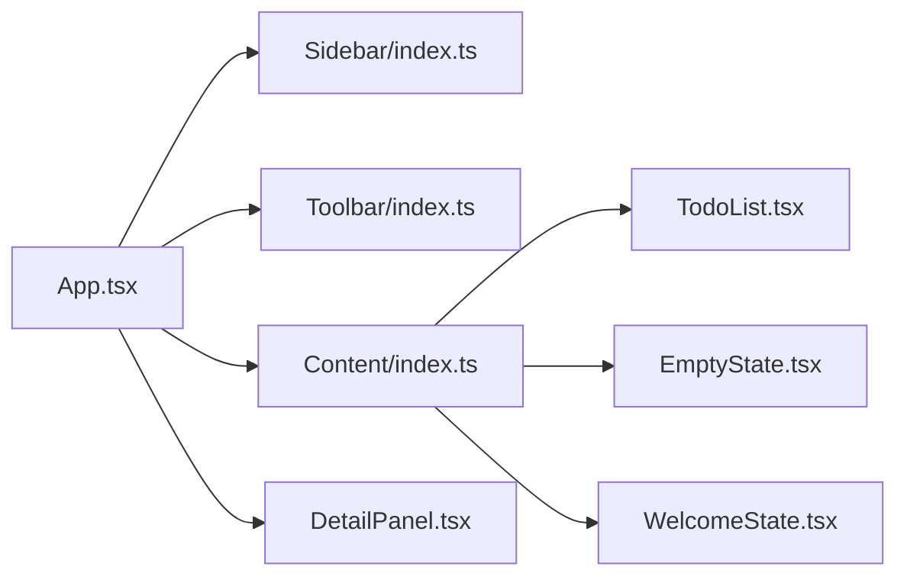
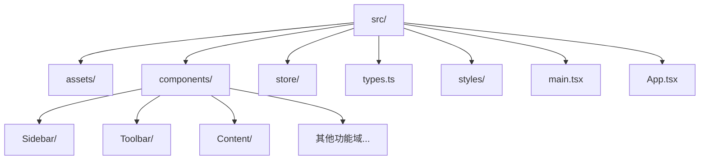
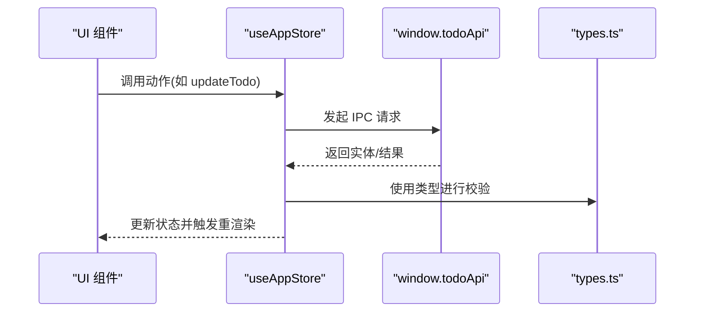
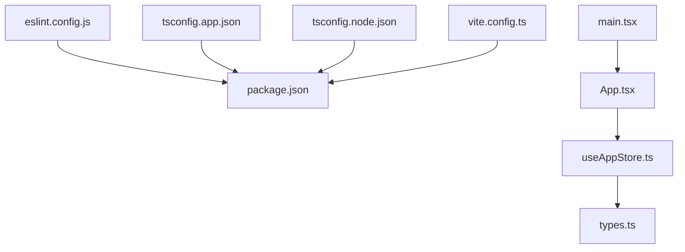

# 代码规范与最佳实践

<cite>
**本文引用的文件**
- [eslint.config.js](file://app/eslint.config.js)
- [package.json](file://app/package.json)
- [tsconfig.json](file://app/tsconfig.json)
- [tsconfig.app.json](file://app/tsconfig.app.json)
- [tsconfig.node.json](file://app/tsconfig.node.json)
- [vite.config.ts](file://app/vite.config.ts)
- [src/types.ts](file://app/src/types.ts)
- [src/index.css](file://app/src/index.css)
- [src/main.tsx](file://app/src/main.tsx)
- [src/App.tsx](file://app/src/App.tsx)
- [src/store/useAppStore.ts](file://app/src/store/useAppStore.ts)
- [src/components/index.ts](file://app/src/components/index.ts)
- [src/components/Content/index.ts](file://app/src/components/Content/index.ts)
- [src/components/Sidebar/index.ts](file://app/src/components/Sidebar/index.ts)
- [src/components/Toolbar/index.ts](file://app/src/components/Toolbar/index.ts)
</cite>

## 目录
1. [引言](#引言)
2. [项目结构](#项目结构)
3. [核心组件](#核心组件)
4. [架构总览](#架构总览)
5. [详细组件分析](#详细组件分析)
6. [依赖关系分析](#依赖关系分析)
7. [性能考量](#性能考量)
8. [故障排查指南](#故障排查指南)
9. [结论](#结论)
10. [附录](#附录)

## 引言
本文件面向 SnowTodo 项目，提供一套系统化的代码规范与最佳实践，覆盖 ESLint 配置与使用、TypeScript 类型设计、React 组件开发规范、文件组织与模块化原则，并给出代码审查清单与常见问题的解决方案。目标是提升代码一致性、可维护性与可读性，降低回归风险。

## 项目结构
项目采用 Vite + React + Electron 的混合前端架构，TypeScript 作为主要语言，Zustand 管理全局状态，组件按功能域分层组织并通过统一入口导出，便于复用与维护。

**图表来源**
- [src/main.tsx:1-11](file://app/src/main.tsx#L1-L11)
- [src/App.tsx:1-60](file://app/src/App.tsx#L1-L60)
- [src/store/useAppStore.ts:1-604](file://app/src/store/useAppStore.ts#L1-L604)
- [src/types.ts:1-278](file://app/src/types.ts#L1-L278)
- [src/components/index.ts:1-10](file://app/src/components/index.ts#L1-L10)
- [src/components/Content/index.ts:1-5](file://app/src/components/Content/index.ts#L1-L5)
- [src/components/Sidebar/index.ts:1-2](file://app/src/components/Sidebar/index.ts#L1-L2)
- [src/components/Toolbar/index.ts:1-2](file://app/src/components/Toolbar/index.ts#L1-L2)
- [vite.config.ts:1-37](file://app/vite.config.ts#L1-L37)
- [eslint.config.js:1-24](file://app/eslint.config.js#L1-L24)
- [tsconfig.app.json:1-26](file://app/tsconfig.app.json#L1-L26)
- [tsconfig.node.json:1-25](file://app/tsconfig.node.json#L1-L25)
- [package.json:1-100](file://app/package.json#L1-L100)

**章节来源**
- [src/main.tsx:1-11](file://app/src/main.tsx#L1-L11)
- [src/App.tsx:1-60](file://app/src/App.tsx#L1-L60)
- [vite.config.ts:1-37](file://app/vite.config.ts#L1-L37)
- [eslint.config.js:1-24](file://app/eslint.config.js#L1-L24)
- [tsconfig.json:1-8](file://app/tsconfig.json#L1-L8)
- [tsconfig.app.json:1-26](file://app/tsconfig.app.json#L1-L26)
- [tsconfig.node.json:1-25](file://app/tsconfig.node.json#L1-L25)
- [package.json:1-100](file://app/package.json#L1-L100)

## 核心组件
- ESLint 配置：基于 flat config，启用 JavaScript/TypeScript 推荐规则、React Hooks、React Refresh（Vite），并限定仅对 ts/tsx 文件生效。
- TypeScript 编译：双配置文件（app/node）分离前端与 Electron 主进程编译选项；开启严格未使用检测与不可达分支检测。
- 构建工具：Vite 插件组合 Electron 主进程、预加载脚本与渲染器端，统一输出目录与打包策略。
- 全局状态：Zustand 单一 store，集中管理 Todo、分类、标签、设置、Pomodoro、健康提醒、AI、时间块、仪表盘与项目看板等模块状态。
- 类型系统：集中定义领域模型与接口，配合默认值常量与只读片段，确保类型安全与可扩展性。

**章节来源**
- [eslint.config.js:8-23](file://app/eslint.config.js#L8-L23)
- [tsconfig.app.json:18-22](file://app/tsconfig.app.json#L18-L22)
- [tsconfig.node.json:17-21](file://app/tsconfig.node.json#L17-L21)
- [vite.config.ts:6-32](file://app/vite.config.ts#L6-L32)
- [src/store/useAppStore.ts:1-604](file://app/src/store/useAppStore.ts#L1-L604)
- [src/types.ts:1-278](file://app/src/types.ts#L1-L278)

## 架构总览
下图展示了从入口到组件与状态的交互路径，以及 ESLint/TS/Vite 在开发流程中的作用。

**图表来源**
- [src/main.tsx:1-11](file://app/src/main.tsx#L1-L11)
- [src/App.tsx:1-60](file://app/src/App.tsx#L1-L60)
- [src/store/useAppStore.ts:1-604](file://app/src/store/useAppStore.ts#L1-L604)
- [src/types.ts:1-278](file://app/src/types.ts#L1-L278)
- [eslint.config.js:1-24](file://app/eslint.config.js#L1-L24)
- [tsconfig.app.json:1-26](file://app/tsconfig.app.json#L1-L26)
- [vite.config.ts:1-37](file://app/vite.config.ts#L1-L37)

## 详细组件分析

### ESLint 配置与使用
- 配置要点
  - 使用 flat config，显式声明忽略 dist 目录。
  - 对 ts/tsx 文件启用推荐规则集：JavaScript、TypeScript、React Hooks、React Refresh（Vite）。
  - 语言环境：浏览器全局变量。
- 使用建议
  - 在本地 IDE 中安装 ESLint 插件，保存时自动修复可修复问题。
  - CI 中通过 npm 脚本运行 lint，失败即阻断合并。
  - 新增规则需经团队评审，避免破坏既有风格。

**图表来源**
- [eslint.config.js:8-23](file://app/eslint.config.js#L8-L23)

**章节来源**
- [eslint.config.js:1-24](file://app/eslint.config.js#L1-L24)
- [package.json:9-14](file://app/package.json#L9-L14)

### TypeScript 类型设计最佳实践
- 类型定义
  - 使用字面量联合类型表达固定取值集合，如状态、优先级、视图 ID 等。
  - 使用接口描述对象结构，区分实体与草稿（带可选字段）。
  - 导出默认配置常量，避免魔法值，增强可测试性。
- 类型安全
  - 利用严格未使用检测与不可达分支检测，减少冗余与逻辑漏洞。
  - 在 store 中以联合类型与只读片段约束状态变更，避免越界写入。
- 泛型与工具
  - 使用 Partial、Record 等映射类型处理部分更新与索引访问。
  - 将跨模块共享的类型集中于 types.ts，避免分散定义导致的不一致。

**图表来源**
- [src/types.ts:168-206](file://app/src/types.ts#L168-L206)
- [src/types.ts:161-166](file://app/src/types.ts#L161-L166)
- [src/store/useAppStore.ts:30-80](file://app/src/store/useAppStore.ts#L30-L80)

**章节来源**
- [src/types.ts:1-278](file://app/src/types.ts#L1-L278)
- [tsconfig.app.json:18-22](file://app/tsconfig.app.json#L18-L22)
- [tsconfig.node.json:17-21](file://app/tsconfig.node.json#L17-L21)
- [src/store/useAppStore.ts:1-604](file://app/src/store/useAppStore.ts#L1-L604)

### React 组件开发规范
- 命名与结构
  - 组件文件与导出同名，便于 IDE 自动识别与跳转。
  - 功能域组件通过 index.ts 聚合导出，统一入口，降低导入复杂度。
- Props 设计
  - 明确必填/可选属性，必要时提供默认值或空对象。
  - 使用类型约束 props，避免动态字符串拼接带来的运行时风险。
- 结构与样式
  - 通过统一入口引入设计系统样式，保证视觉一致性。
  - 将布局与内容分离，避免在组件内直接耦合样式细节。

**图表来源**
- [src/App.tsx:1-60](file://app/src/App.tsx#L1-L60)
- [src/components/index.ts:1-10](file://app/src/components/index.ts#L1-L10)
- [src/components/Content/index.ts:1-5](file://app/src/components/Content/index.ts#L1-L5)
- [src/components/Sidebar/index.ts:1-2](file://app/src/components/Sidebar/index.ts#L1-L2)
- [src/components/Toolbar/index.ts:1-2](file://app/src/components/Toolbar/index.ts#L1-L2)

**章节来源**
- [src/App.tsx:1-60](file://app/src/App.tsx#L1-L60)
- [src/components/index.ts:1-10](file://app/src/components/index.ts#L1-L10)
- [src/components/Content/index.ts:1-5](file://app/src/components/Content/index.ts#L1-L5)
- [src/components/Sidebar/index.ts:1-2](file://app/src/components/Sidebar/index.ts#L1-L2)
- [src/components/Toolbar/index.ts:1-2](file://app/src/components/Toolbar/index.ts#L1-L2)
- [src/index.css:1-3](file://app/src/index.css#L1-L3)

### 文件组织与模块化原则
- 目录结构
  - 按功能域划分组件目录（如 Sidebar、Toolbar、Content 等），并在同级提供 index.ts 聚合导出。
  - store 目录集中存放全局状态逻辑，types.ts 放置共享类型定义。
- 导入导出
  - 优先使用相对路径，避免深层相对路径导致的维护成本。
  - 通过聚合导出减少上层组件的导入复杂度，遵循“就近暴露、向上收敛”原则。
- 构建与打包
  - Vite 配置分别构建主进程与预加载脚本，渲染器端由 React 插件处理。
  - 输出目录与 Electron 打包配置保持一致，避免资源缺失。

**图表来源**
- [src/components/index.ts:1-10](file://app/src/components/index.ts#L1-L10)
- [vite.config.ts:6-32](file://app/vite.config.ts#L6-L32)

**章节来源**
- [src/components/index.ts:1-10](file://app/src/components/index.ts#L1-L10)
- [src/components/Content/index.ts:1-5](file://app/src/components/Content/index.ts#L1-L5)
- [vite.config.ts:1-37](file://app/vite.config.ts#L1-L37)

### 全局状态与类型契约
- 状态切片
  - 将业务模块拆分为独立切片（如 Todo、Pomodoro、Health、AI、TimeBlock、Dashboard、Projects），每个切片包含状态与动作。
- 类型契约
  - 通过全局 window.todoApi 类型声明，约束与主进程通信的接口签名，确保调用方与实现方一致。
- 默认值与初始化
  - 在 store 初始化阶段设置默认值，避免未定义状态导致的渲染异常。

**图表来源**
- [src/store/useAppStore.ts:1-604](file://app/src/store/useAppStore.ts#L1-L604)
- [src/types.ts:1-278](file://app/src/types.ts#L1-L278)

**章节来源**
- [src/store/useAppStore.ts:1-604](file://app/src/store/useAppStore.ts#L1-L604)
- [src/types.ts:1-278](file://app/src/types.ts#L1-L278)

## 依赖关系分析
- 工具链依赖
  - ESLint 及插件版本与 TypeScript 版本需匹配，避免规则冲突或报错。
  - Vite 与 Electron 插件组合需与 Electron 主进程/预加载脚本的入口一致。
- 类型依赖
  - 所有组件与 store 依赖 types.ts 中的类型定义，新增类型需同步更新相关消费点。
- 构建依赖
  - tsconfig.app.json 与 tsconfig.node.json 分别服务于渲染器与主进程，避免相互污染。

**图表来源**
- [eslint.config.js:1-24](file://app/eslint.config.js#L1-L24)
- [tsconfig.app.json:1-26](file://app/tsconfig.app.json#L1-L26)
- [tsconfig.node.json:1-25](file://app/tsconfig.node.json#L1-L25)
- [vite.config.ts:1-37](file://app/vite.config.ts#L1-L37)
- [src/store/useAppStore.ts:1-604](file://app/src/store/useAppStore.ts#L1-L604)
- [src/types.ts:1-278](file://app/src/types.ts#L1-L278)
- [src/App.tsx:1-60](file://app/src/App.tsx#L1-L60)
- [src/main.tsx:1-11](file://app/src/main.tsx#L1-L11)

**章节来源**
- [package.json:27-49](file://app/package.json#L27-L49)
- [tsconfig.json:1-8](file://app/tsconfig.json#L1-L8)
- [vite.config.ts:1-37](file://app/vite.config.ts#L1-L37)

## 性能考量
- 编译与类型检查
  - 启用严格未使用检测与不可达分支检测，提前发现潜在性能与内存浪费点。
  - 使用 bundler 模式与 verbatimModuleSyntax，减少运行时解析开销。
- 状态更新
  - 在 store 中采用不可变更新模式，避免不必要的重渲染。
  - 对高频计算使用 memo 化或派生状态，降低渲染成本。
- 构建优化
  - Vite 默认按需打包，结合 Electron 插件合理拆分主进程与渲染器代码，缩短冷启动时间。

[本节为通用指导，无需特定文件来源]

## 故障排查指南
- ESLint 报错
  - 症状：保存或提交时出现规则报错。
  - 处理：根据报错定位到具体文件与行号，优先使用自动修复；无法修复时调整代码风格或禁用规则（需评审）。
- TypeScript 类型错误
  - 症状：编译失败或智能提示异常。
  - 处理：检查 types.ts 中的类型定义是否与实际使用一致；确认 tsconfig.* 的 include/exclude 是否正确。
- Vite/Electron 构建问题
  - 症状：打包产物缺失或运行时报错。
  - 处理：核对 vite.config.ts 的入口与输出目录；检查 Electron 插件配置与打包配置中的 files/extraResources。
- 状态异常
  - 症状：界面不更新或行为不符合预期。
  - 处理：检查 useAppStore 中的动作是否正确更新状态；确认 window.todoApi 的类型声明与实现一致。

**章节来源**
- [eslint.config.js:1-24](file://app/eslint.config.js#L1-L24)
- [tsconfig.app.json:1-26](file://app/tsconfig.app.json#L1-L26)
- [tsconfig.node.json:1-25](file://app/tsconfig.node.json#L1-L25)
- [vite.config.ts:1-37](file://app/vite.config.ts#L1-L37)
- [src/store/useAppStore.ts:1-604](file://app/src/store/useAppStore.ts#L1-L604)
- [src/types.ts:1-278](file://app/src/types.ts#L1-L278)

## 结论
通过统一的 ESLint 规则、严格的 TypeScript 类型体系、清晰的组件与模块化结构，以及完善的构建与状态管理策略，SnowTodo 项目能够在功能演进的同时保持高质量与高可维护性。建议持续在团队内推广上述规范，并在 CI 中强制执行，以保障交付质量。

[本节为总结，无需特定文件来源]

## 附录

### 代码审查清单
- 代码风格
  - 是否符合 ESLint 推荐规则？是否存在可自动修复的问题？
  - 命名是否语义化、一致且可读？
- 类型安全
  - 是否使用了合适的类型定义？是否存在 any 或 unknown 的滥用？
  - 是否利用 Partial/Readonly 等映射类型提升安全性？
- 组件设计
  - Props 是否明确、最小化？是否存在过度耦合？
  - 是否通过 index.ts 聚合导出，便于上层使用？
- 状态与副作用
  - store 动作是否遵循不可变更新？是否存在副作用泄漏？
  - 是否正确声明与使用 window.todoApi 的类型契约？
- 构建与部署
  - tsconfig 与 vite.config 是否与 Electron 插件配置一致？
  - 打包产物是否包含必要的资源文件？

### 常见问题与解决方案
- 问题：组件导入路径过深，维护困难
  - 方案：在功能域目录提供 index.ts 聚合导出，上层仅依赖聚合入口
- 问题：状态更新导致频繁重渲染
  - 方案：使用不可变更新与最小化状态切片，必要时进行组件 memo 化
- 问题：类型定义散落各处，难以统一
  - 方案：集中于 types.ts，新增类型时同步更新相关消费点
- 问题：构建后资源缺失或运行异常
  - 方案：核对 vite.config.ts 与打包配置，确保 files/extraResources 正确

[本节为通用指导，无需特定文件来源]