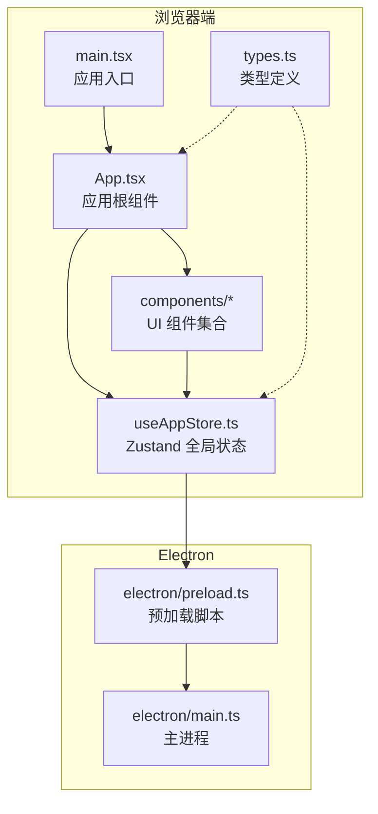
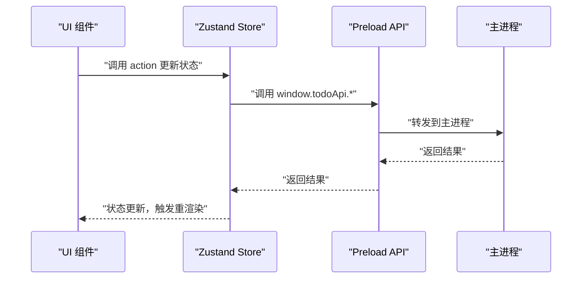
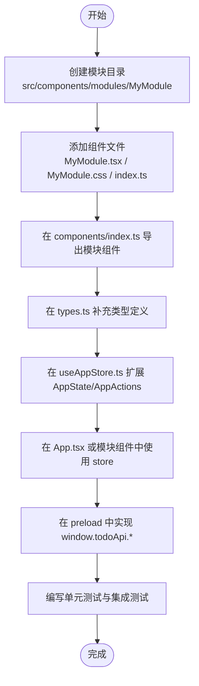
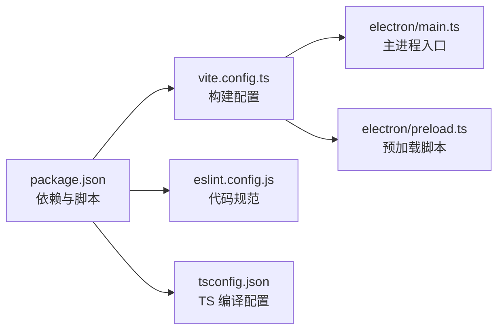

# 开发指南

<cite>
**本文引用的文件**
- [package.json](file://app/package.json)
- [main.tsx](file://app/src/main.tsx)
- [App.tsx](file://app/src/App.tsx)
- [useAppStore.ts](file://app/src/store/useAppStore.ts)
- [types.ts](file://app/src/types.ts)
- [eslint.config.js](file://app/eslint.config.js)
- [tsconfig.json](file://app/tsconfig.json)
- [vite.config.ts](file://app/vite.config.ts)
- [components/index.ts](file://app/src/components/index.ts)
- [components/Sidebar/index.ts](file://app/src/components/Sidebar/index.ts)
- [components/Content/index.ts](file://app/src/components/Content/index.ts)
- [components/Toolbar/index.ts](file://app/src/components/Toolbar/index.ts)
- [components/DetailPanel/index.ts](file://app/src/components/DetailPanel/index.ts)
- [components/RecurringTodos/index.ts](file://app/src/components/RecurringTodos/index.ts)
- [components/Settings/index.ts](file://app/src/components/Settings/index.ts)
</cite>

## 目录
1. [简介](#简介)
2. [项目结构](#项目结构)
3. [核心组件](#核心组件)
4. [架构总览](#架构总览)
5. [详细组件分析](#详细组件分析)
6. [依赖分析](#依赖分析)
7. [性能考虑](#性能考虑)
8. [故障排查指南](#故障排查指南)
9. [结论](#结论)
10. [附录](#附录)

## 简介
本指南面向新加入的开发者，帮助你快速理解并参与 SnowTodo 的开发。内容涵盖新增模块的完整流程（文件结构、组件开发、状态管理集成）、代码规范与 ESLint 使用、TypeScript 类型最佳实践、组件开发标准流程（Props 设计、事件处理、生命周期管理）、扩展与特性添加、调试与开发工具、性能优化与内存管理、测试策略与单元测试编写、重构与架构演进原则，以及常见问题解答。

## 项目结构
SnowTodo 是一个基于 React + Electron 的桌面应用，采用 Vite 构建，使用 Zustand 管理全局状态，TypeScript 提供类型安全，ESLint 保障代码质量。前端主入口负责渲染应用，App 组件协调各模块，Zustand store 负责跨模块状态共享；Electron 主进程负责系统级能力（如托盘、窗口控制）与数据库交互（通过 preload 暴露的 API）。

**图表来源**
- [main.tsx:1-11](file://app/src/main.tsx#L1-L11)
- [App.tsx:1-60](file://app/src/App.tsx#L1-L60)
- [useAppStore.ts:1-604](file://app/src/store/useAppStore.ts#L1-L604)
- [types.ts:1-278](file://app/src/types.ts#L1-L278)
- [vite.config.ts:1-37](file://app/vite.config.ts#L1-L37)

**章节来源**
- [main.tsx:1-11](file://app/src/main.tsx#L1-L11)
- [App.tsx:1-60](file://app/src/App.tsx#L1-L60)
- [vite.config.ts:1-37](file://app/vite.config.ts#L1-L37)

## 核心组件
- 应用入口与根组件
  - 入口负责挂载 React 根节点，渲染 App。
  - App 负责初始化数据、协调侧边栏、工具栏、内容区、详情面板、周期性任务面板与健康提醒弹窗，并调用 store 初始化各模块数据。
- 全局状态管理（Zustand）
  - 提供基础数据（待办、分类、标签、设置）、UI 状态（当前视图、选中项、筛选器）、模块化状态（番茄钟、健康提醒、AI、时间块、仪表盘、项目格子）及对应的 actions。
  - 通过 window.todoApi 与 Electron 主进程通信，实现数据持久化与系统能力调用。
- 类型系统（TypeScript）
  - 定义 Todo、Category、Tag、Settings、Pomodoro、Health、AI、TimeBlock、DailyStats、RecurringTodo 等核心类型，确保跨模块的数据一致性与可维护性。

**章节来源**
- [main.tsx:1-11](file://app/src/main.tsx#L1-L11)
- [App.tsx:1-60](file://app/src/App.tsx#L1-L60)
- [useAppStore.ts:1-604](file://app/src/store/useAppStore.ts#L1-L604)
- [types.ts:1-278](file://app/src/types.ts#L1-L278)

## 架构总览
应用采用“UI 组件 + Zustand Store + Electron API”的分层架构。UI 层通过 hooks 访问 store；store 通过 window.todoApi 与主进程交互；主进程负责实际的数据读写与系统能力调用。

**图表来源**
- [useAppStore.ts:540-603](file://app/src/store/useAppStore.ts#L540-L603)
- [App.tsx:24-34](file://app/src/App.tsx#L24-L34)

## 详细组件分析

### 新增模块流程（从零到一）
- 文件结构规范
  - 在 src/components 下新建模块目录，例如 modules/MyModule，并在该目录下创建 MyModule.tsx、MyModule.css、index.ts。
  - 在 src/components/modules/index.ts 中导出模块组件，便于统一导入。
  - 若模块涉及 UI 与业务逻辑分离，可在模块目录内再拆分 views、hooks、services 等子目录。
- 组件开发规范
  - 使用函数组件 + hooks，Props 明确且尽量只读，避免在组件内部直接修改 props。
  - 使用 TypeScript 接口定义 Props，结合 Partial/Omit 等工具类型提升复用性。
  - 将样式放入独立 CSS 文件，避免内联样式污染。
- 状态管理集成
  - 在 useAppStore.ts 的 AppState 与 AppActions 中新增对应的状态字段与 action 方法。
  - 在 App.tsx 或模块组件中通过 hooks 访问 store，必要时在组件挂载或依赖变化时调用 store 的异步 action。
  - 对于需要与主进程通信的模块，先在 types.ts 中补充接口，在 window.todoApi 的类型声明中增加对应方法签名，然后在 preload 中实现具体逻辑。
- 数据流示意

**图表来源**
- [components/index.ts:1-10](file://app/src/components/index.ts#L1-L10)
- [useAppStore.ts:30-176](file://app/src/store/useAppStore.ts#L30-L176)
- [types.ts:1-278](file://app/src/types.ts#L1-L278)

**章节来源**
- [components/index.ts:1-10](file://app/src/components/index.ts#L1-L10)
- [useAppStore.ts:30-176](file://app/src/store/useAppStore.ts#L30-L176)
- [types.ts:1-278](file://app/src/types.ts#L1-L278)

### 组件开发标准流程
- Props 设计
  - 使用明确的接口定义 Props，区分必需与可选属性；对复杂对象使用 Partial/Omit 提升灵活性。
  - 对于回调事件，使用函数类型并约定参数结构，避免在组件内部拼接字符串。
- 事件处理
  - 将事件处理器绑定在组件外层，避免在 render 内部创建新函数导致重渲染。
  - 对于异步操作，使用 Promise 包装并在 action 中统一处理错误与加载状态。
- 生命周期管理
  - 使用 useEffect 管理副作用，注意清理函数与依赖数组，避免内存泄漏。
  - 对于定时器、订阅事件、全局快捷键等资源，务必在卸载时释放。
- 示例参考
  - App 组件在初始化时一次性拉取多模块数据并设置到 store，体现了“一次性初始化 + 模块化加载”的模式。
  - store 中的 computed 函数（如 getFilteredTodos、getTodayTodos）展示了如何在状态变更时按需计算派生数据。

**章节来源**
- [App.tsx:24-34](file://app/src/App.tsx#L24-L34)
- [useAppStore.ts:327-389](file://app/src/store/useAppStore.ts#L327-L389)

### TypeScript 类型最佳实践
- 类型安全保证
  - 使用联合类型约束枚举值（如 TodoStatus、Priority），避免魔法字符串。
  - 对外暴露的接口使用只读属性，防止意外修改。
  - 对可空字段使用 null/undefined 明确标注，配合非空断言时要谨慎。
- 类型复用与工具
  - 使用 Partial、Pick、Omit、Record 等工具类型减少重复定义。
  - 将通用类型抽离到 types.ts，确保跨模块一致。
- 与 store 的类型集成
  - store 的 state 与 actions 使用泛型 create，确保类型推导准确。
  - 对 window.todoApi 的类型声明放在全局命名空间中，保证 Electron 与渲染进程的类型一致性。

**章节来源**
- [types.ts:1-278](file://app/src/types.ts#L1-L278)
- [useAppStore.ts:1-21](file://app/src/store/useAppStore.ts#L1-L21)
- [useAppStore.ts:540-603](file://app/src/store/useAppStore.ts#L540-L603)

### 代码规范与 ESLint 配置
- ESLint 配置
  - 使用 flat config，启用 TypeScript、React Hooks、React Refresh 推荐规则。
  - 语言选项启用浏览器全局变量，确保 DOM 相关 API 不报错。
- 规范要点
  - 使用 TypeScript 严格模式，避免隐式 any。
  - 钩子使用遵循 React Hooks 规则，依赖数组完整。
  - 组件命名与文件命名一致，导出统一通过 index.ts。
- 命令与脚本
  - dev、build、lint、typecheck 等脚本已在 package.json 中配置，开发时优先使用 lint 与 typecheck。

**章节来源**
- [eslint.config.js:1-24](file://app/eslint.config.js#L1-L24)
- [package.json:9-14](file://app/package.json#L9-L14)

### 扩展现有功能与添加新特性
- 新增模块步骤
  - 在 components 下创建模块目录与入口 index.ts。
  - 在 types.ts 中补充模块相关类型。
  - 在 useAppStore.ts 中扩展状态与 actions，并在 App.tsx 中接入。
  - 如需与主进程通信，完善 window.todoApi 的类型与 preload 实现。
- 特性扩展建议
  - 优先通过 store 的 computed 字段实现派生数据，减少重复计算。
  - 对高频更新的 UI 使用局部状态，避免污染全局 store。
  - 对外部依赖（如第三方 API）进行封装，统一错误处理与重试策略。

**章节来源**
- [components/index.ts:1-10](file://app/src/components/index.ts#L1-L10)
- [types.ts:1-278](file://app/src/types.ts#L1-L278)
- [useAppStore.ts:30-176](file://app/src/store/useAppStore.ts#L30-L176)
- [App.tsx:40-56](file://app/src/App.tsx#L40-L56)

### 调试技巧与开发工具
- 开发环境
  - 使用 Vite 的热重载与预加载插件，提高迭代效率。
  - 在浏览器 DevTools 中检查 React 组件树与状态变化。
- Electron 调试
  - 主进程与渲染进程分别打开 DevTools，定位问题来源。
  - 使用 console 与日志记录关键路径，避免在生产环境输出敏感信息。
- 性能分析
  - 使用 React Profiler 分析组件重渲染热点。
  - 使用 Chrome Performance 面板观察主线程阻塞点。

**章节来源**
- [vite.config.ts:1-37](file://app/vite.config.ts#L1-L37)

### 性能优化与内存管理
- 渲染优化
  - 合理拆分组件，使用 memo 包装纯展示组件，避免不必要的重渲染。
  - 对列表使用稳定 key，减少列表重排。
- 状态优化
  - 将局部 UI 状态与业务状态分离，缩小 store 更新范围。
  - 使用 computed 字段缓存派生数据，避免每次渲染都重新计算。
- 内存管理
  - 及时清理定时器、订阅事件与全局监听器。
  - 对图片与大对象使用懒加载与及时释放。

**章节来源**
- [useAppStore.ts:327-389](file://app/src/store/useAppStore.ts#L327-L389)

### 测试策略与单元测试编写
- 单元测试
  - 对纯函数与计算逻辑（如排序、过滤）编写独立测试用例。
  - 对 hooks 的行为进行测试，模拟 store 与外部依赖。
- 集成测试
  - 使用最小化渲染树测试组件组合与状态联动。
  - 对 store 的 action 进行 mock 并验证状态变更。
- 覆盖重点
  - 边界条件（空数据、超长列表、异常输入）。
  - 用户交互链路（点击、输入、切换视图）。

[本节为通用指导，无需特定文件引用]

### 重构与架构演进原则
- 保持单一职责：每个模块聚焦一个领域，避免“上帝对象”。
- 明确边界：store、组件、服务层职责清晰，接口稳定。
- 渐进式演进：小步快跑，每次改动控制在可验证范围内。
- 文档与注释：重要决策与边界条件必须有注释说明。

[本节为通用指导，无需特定文件引用]

## 依赖分析
- 运行时依赖
  - React 生态、路由、动画、图标库、状态管理、日期处理、SQL.js 等。
- 构建与打包
  - Vite、Electron、Electron Builder、TypeScript、ESLint、React 插件等。
- 构建配置
  - vite.config.ts 配置了 React 插件、Electron 插件与预加载脚本，输出目录与 Rollup 外部化策略。

**图表来源**
- [package.json:1-100](file://app/package.json#L1-L100)
- [vite.config.ts:1-37](file://app/vite.config.ts#L1-L37)
- [eslint.config.js:1-24](file://app/eslint.config.js#L1-L24)
- [tsconfig.json:1-8](file://app/tsconfig.json#L1-L8)

**章节来源**
- [package.json:1-100](file://app/package.json#L1-L100)
- [vite.config.ts:1-37](file://app/vite.config.ts#L1-L37)

## 性能考虑
- 首屏与增量加载
  - App 在初始化时一次性拉取基础数据，随后按需加载各模块数据，减少首屏压力。
- 渲染与状态
  - 将派生数据放入 store 的 computed 字段，避免重复计算。
  - 控制组件层级深度，避免深层嵌套导致的重渲染风暴。
- 存储与 I/O
  - SQL.js 作为本地存储，注意批量写入与事务使用，降低磁盘 I/O。

**章节来源**
- [App.tsx:24-34](file://app/src/App.tsx#L24-L34)
- [useAppStore.ts:327-389](file://app/src/store/useAppStore.ts#L327-L389)

## 故障排查指南
- 启动与构建
  - 若构建失败，检查 vite.config.ts 的插件配置与输出目录。
  - 若 ESLint 报错，根据规则逐条修复或在本地禁用临时定位问题。
- 运行时错误
  - 在浏览器控制台查看 React 错误边界与堆栈。
  - 在 Electron 主进程日志中定位 API 调用异常。
- 状态异常
  - 使用 React DevTools 检查组件状态与 props 是否符合预期。
  - 在 store 中打印关键 action 的入参与返回值，确认数据流转。

**章节来源**
- [eslint.config.js:1-24](file://app/eslint.config.js#L1-L24)
- [vite.config.ts:1-37](file://app/vite.config.ts#L1-L37)

## 结论
通过本指南，你可以按照既定流程快速新增模块、规范组件开发、集成状态管理、遵循代码与类型规范，并在调试与性能方面建立系统性的方法论。建议在每次提交前执行 lint 与 typecheck，并在功能完成后补充测试用例，以确保代码质量与可维护性。

## 附录

### 快速上手清单
- 环境准备：安装 Node.js、包管理器，运行 npm install。
- 启动开发：npm run dev，打开浏览器与 Electron 窗口。
- 代码规范：npm run lint，npm run typecheck。
- 构建发布：npm run build，使用 electron-builder 生成安装包。

**章节来源**
- [package.json:9-14](file://app/package.json#L9-L14)
- [vite.config.ts:1-37](file://app/vite.config.ts#L1-L37)

### 常见问题解答
- Q：如何新增一个视图模块？
  - A：在 components 下创建目录与 index.ts 导出组件；在 types.ts 补充类型；在 useAppStore.ts 扩展状态与 action；在 App.tsx 或路由中接入。
- Q：如何与主进程通信？
  - A：在 types.ts 中完善 window.todoApi 的类型声明，在 preload 中实现对应方法，最后在 store 的 action 中调用。
- Q：如何优化渲染性能？
  - A：拆分组件、使用 memo、减少全局状态更新、利用 computed 缓存派生数据。
- Q：如何编写单元测试？
  - A：针对纯函数与计算逻辑编写测试；对 hooks 与组件行为进行模拟与断言。

[本节为通用指导，无需特定文件引用]