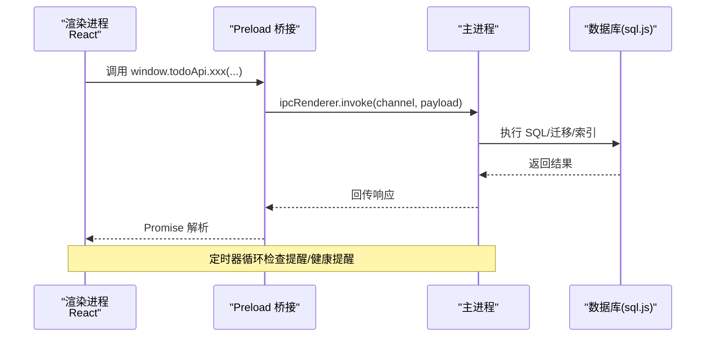
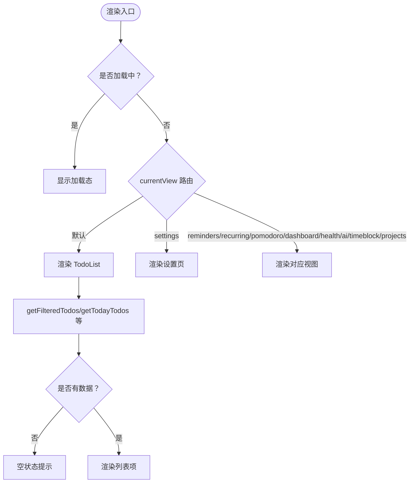
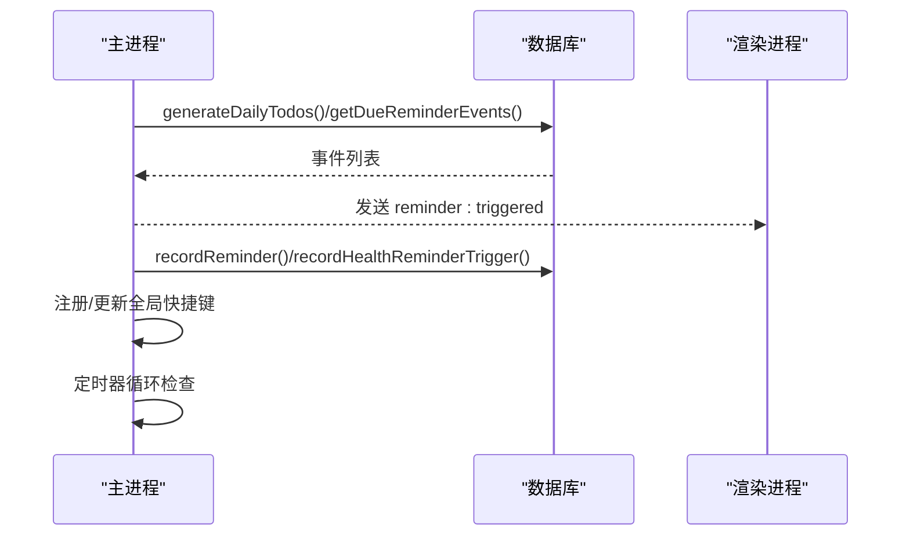
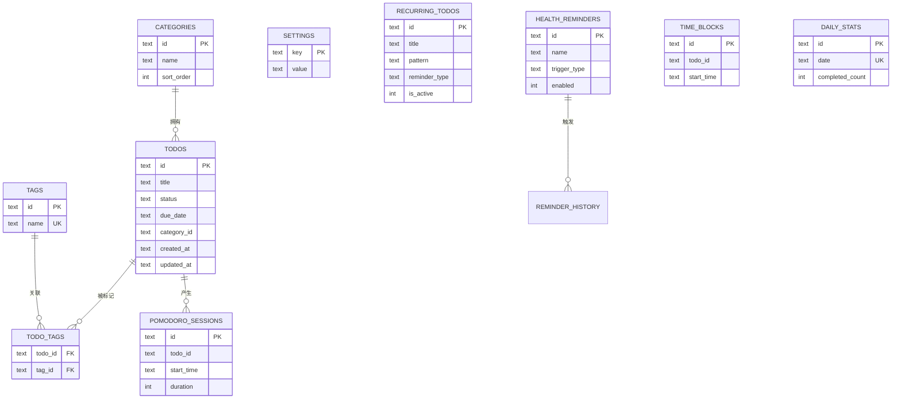
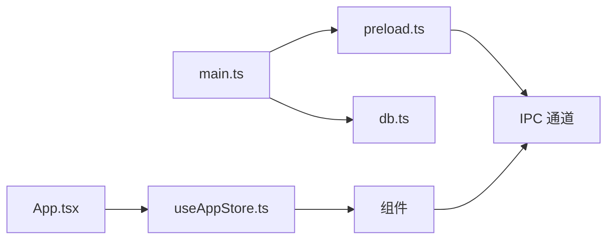

# 性能优化指南

<cite>
**本文引用的文件**
- [main.tsx](file://app/src/main.tsx)
- [App.tsx](file://app/src/App.tsx)
- [useAppStore.ts](file://app/src/store/useAppStore.ts)
- [Content.tsx](file://app/src/components/Content/Content.tsx)
- [TodoList.tsx](file://app/src/components/Content/TodoList.tsx)
- [Sidebar.tsx](file://app/src/components/Sidebar/Sidebar.tsx)
- [DetailPanel.tsx](file://app/src/components/DetailPanel/DetailPanel.tsx)
- [types.ts](file://app/src/types.ts)
- [main.ts](file://app/electron/main.ts)
- [preload.ts](file://app/electron/preload.ts)
- [db.ts](file://app/electron/db.ts)
- [vite.config.ts](file://app/vite.config.ts)
- [package.json](file://app/package.json)
</cite>

## 目录
1. [简介](#简介)
2. [项目结构](#项目结构)
3. [核心组件](#核心组件)
4. [架构总览](#架构总览)
5. [详细组件分析](#详细组件分析)
6. [依赖关系分析](#依赖关系分析)
7. [性能考量与优化建议](#性能考量与优化建议)
8. [故障排查指南](#故障排查指南)
9. [结论](#结论)
10. [附录](#附录)

## 简介
本指南面向 SnowTodo 的前端与 Electron 主进程/渲染进程性能优化，覆盖 React 组件与状态管理优化、Electron 进程性能调优、数据库查询与索引优化、构建与打包优化、性能监控与分析、内存泄漏检测与修复、缓存与持久化策略等方面。目标是帮助开发者在保证功能完整性的同时，显著提升应用的启动速度、交互流畅度、资源占用与稳定性。

## 项目结构
SnowTodo 采用 React + Vite + Electron 的混合架构：
- 前端（React 渲染进程）：负责 UI、状态管理、组件渲染与用户交互。
- 主进程（Electron）：负责窗口生命周期、系统通知、全局快捷键、定时器、IPC 通信与数据库初始化。
- 数据层（sql.js + SQLite）：本地嵌入式数据库，支持迁移、索引与事务性写入。
- 构建系统（Vite + electron-builder）：开发与生产构建、打包与安装包生成。

```mermaid
graph TB
subgraph "渲染进程React"
A["main.tsx<br/>入口"]
B["App.tsx<br/>根组件"]
C["useAppStore.ts<br/>Zustand 状态"]
D["Components<br/>Sidebar/Content/TodoList/DetailPanel"]
end
subgraph "主进程Electron"
E["main.ts<br/>窗口/定时器/IPC"]
F["preload.ts<br/>contextBridge 暴露 API"]
G["db.ts<br/>sql.js/SQLite 封装"]
end
A --> B
B --> C
C --> D
B <- --> F
F --> E
E --> G
```

**图表来源**
- [main.tsx:1-11](file://app/src/main.tsx#L1-L11)
- [App.tsx:1-60](file://app/src/App.tsx#L1-L60)
- [useAppStore.ts:1-604](file://app/src/store/useAppStore.ts#L1-L604)
- [main.ts:1-391](file://app/electron/main.ts#L1-L391)
- [preload.ts:1-117](file://app/electron/preload.ts#L1-L117)
- [db.ts:1-800](file://app/electron/db.ts#L1-L800)

**章节来源**
- [main.tsx:1-11](file://app/src/main.tsx#L1-L11)
- [App.tsx:1-60](file://app/src/App.tsx#L1-L60)
- [main.ts:1-391](file://app/electron/main.ts#L1-L391)
- [preload.ts:1-117](file://app/electron/preload.ts#L1-L117)
- [db.ts:1-800](file://app/electron/db.ts#L1-L800)

## 核心组件
- 渲染进程入口与根组件：负责应用挂载与初始数据拉取。
- Zustand 状态仓库：集中管理 todos、UI 状态、模块数据（番茄钟、健康提醒、AI 设置、时间块、仪表盘、项目单元格等）。
- 视图路由与内容区：根据当前视图切换不同页面组件。
- 列表组件：按视图过滤与排序，空状态处理。
- 侧边栏与详情面板：导航、筛选、表单与媒体上传。

**章节来源**
- [main.tsx:1-11](file://app/src/main.tsx#L1-L11)
- [App.tsx:1-60](file://app/src/App.tsx#L1-L60)
- [useAppStore.ts:1-604](file://app/src/store/useAppStore.ts#L1-L604)
- [Content.tsx:1-65](file://app/src/components/Content/Content.tsx#L1-L65)
- [TodoList.tsx:1-189](file://app/src/components/Content/TodoList.tsx#L1-L189)
- [Sidebar.tsx:1-203](file://app/src/components/Sidebar/Sidebar.tsx#L1-L203)
- [DetailPanel.tsx:1-507](file://app/src/components/DetailPanel/DetailPanel.tsx#L1-L507)

## 架构总览
渲染进程通过 preload 暴露的 window.todoApi 与主进程进行 IPC 通信；主进程维护数据库连接与定时任务，并向渲染进程推送事件（如提醒触发）。数据库采用 sql.js，支持迁移、索引与批量写入。



**图表来源**
- [preload.ts:18-116](file://app/electron/preload.ts#L18-L116)
- [main.ts:227-358](file://app/electron/main.ts#L227-L358)
- [db.ts:626-630](file://app/electron/db.ts#L626-L630)

**章节来源**
- [preload.ts:1-117](file://app/electron/preload.ts#L1-L117)
- [main.ts:1-391](file://app/electron/main.ts#L1-L391)
- [db.ts:1-800](file://app/electron/db.ts#L1-L800)

## 详细组件分析

### React 组件与状态管理优化
- 状态拆分与局部更新
  - 使用 Zustand 将基础数据（todos、categories、tags、settings）、UI 状态（currentView、selectedTodoId、isDetailPanelOpen）、模块数据（Pomodoro、Health、AI、TimeBlock、DailyStats、ProjectCells）分离，避免单一大对象导致的全量重渲染。
  - 推荐：将高频变更的 UI 状态（如搜索框、筛选器）从全局 store 中抽离为组件内部状态，减少无关订阅。
- 计算属性与派生状态
  - getFilteredTodos、getTodayTodos、getUpcomingTodos、getCompletedTodos 等计算函数在渲染前完成过滤与排序，避免在渲染函数中做昂贵计算。
  - 建议：对复杂计算引入 memo 化（如 useMemo/useCallback），并在 store 中仅保留必要的输入状态。
- 列表渲染与空状态
  - TodoList 根据 currentView 选择数据源，空状态统一处理，减少分支渲染开销。
  - 建议：为列表项提供稳定 key，避免不必要的重排；对长列表考虑虚拟滚动（如 react-window 或 react-virtual）。
- 表单与媒体上传
  - DetailPanel 对图片拖拽、粘贴、本地临时存储与异步上传进行解耦，减少 UI 卡顿。
  - 建议：对大文件上传增加节流/并发限制，上传失败重试与进度反馈。



**图表来源**
- [Content.tsx:14-63](file://app/src/components/Content/Content.tsx#L14-L63)
- [TodoList.tsx:16-75](file://app/src/components/Content/TodoList.tsx#L16-L75)
- [useAppStore.ts:327-389](file://app/src/store/useAppStore.ts#L327-L389)

**章节来源**
- [useAppStore.ts:1-604](file://app/src/store/useAppStore.ts#L1-L604)
- [Content.tsx:1-65](file://app/src/components/Content/Content.tsx#L1-L65)
- [TodoList.tsx:1-189](file://app/src/components/Content/TodoList.tsx#L1-L189)
- [DetailPanel.tsx:1-507](file://app/src/components/DetailPanel/DetailPanel.tsx#L1-L507)

### Electron 主进程与渲染进程性能优化
- 窗口与托盘
  - 关闭行为改为隐藏至托盘而非退出，降低频繁创建销毁窗口的开销。
  - 建议：在最小化/隐藏时暂停非必要渲染任务，恢复显示时再恢复。
- 定时器与事件循环
  - 提醒与健康提醒分别以 30 秒与 1 分钟轮询检查，注意异常捕获与清理。
  - 建议：将检查逻辑合并为更少的定时器，或使用更智能的触发机制（如基于事件而非轮询）。
- IPC 与上下文隔离
  - preload 使用 contextBridge 暴露受控 API，避免直接暴露 Node.js 能力。
  - 建议：对高频 IPC 调用（如列表刷新）采用批量请求或去抖动。
- 全局快捷键
  - 根据设置动态注册/注销，避免冲突与资源泄露。
  - 建议：在设置变更时先注销旧快捷键，再注册新快捷键。



**图表来源**
- [main.ts:120-177](file://app/electron/main.ts#L120-L177)
- [main.ts:179-193](file://app/electron/main.ts#L179-L193)
- [main.ts:360-369](file://app/electron/main.ts#L360-L369)

**章节来源**
- [main.ts:1-391](file://app/electron/main.ts#L1-L391)
- [preload.ts:1-117](file://app/electron/preload.ts#L1-L117)

### 数据库查询与索引优化
- 表与索引
  - 已建立多处索引：todos 状态/到期/分类、recurring_todos 激活状态、pomodoro_sessions、time_blocks、daily_stats、health_reminders 等，有效支撑常见查询。
  - 建议：对高频查询字段（如 dueDate、createdAt、updatedAt）保持索引；定期分析执行计划，避免全表扫描。
- 迁移与默认数据
  - 运行时迁移确保新增列/索引存在，插入默认主题与健康提醒，减少首次使用成本。
- 写入与持久化
  - 采用事务性写入与一次性导出，避免频繁 IO。
  - 建议：批量写入时合并多个 INSERT/UPDATE 为事务，减少磁盘写入次数。



**图表来源**
- [db.ts:299-504](file://app/electron/db.ts#L299-L504)
- [db.ts:197-206](file://app/electron/db.ts#L197-L206)

**章节来源**
- [db.ts:1-800](file://app/electron/db.ts#L1-L800)
- [types.ts:1-278](file://app/src/types.ts#L1-L278)

### 构建与打包优化
- Vite 插件配置
  - 使用 vite-plugin-electron 与 vite-plugin-electron-renderer，主进程与预加载独立输出目录，外部化 sql.js。
  - 建议：开启代码分割与懒加载，减少首屏体积。
- 打包与资源
  - electron-builder 配置 asar、目标平台与安装脚本，额外资源包含 sql-wasm.wasm 与托盘图标。
  - 建议：对静态资源进行压缩与缓存策略，合理利用 CDN（如可选）。

**章节来源**
- [vite.config.ts:1-37](file://app/vite.config.ts#L1-L37)
- [package.json:1-100](file://app/package.json#L1-L100)

## 依赖关系分析
- 渲染进程依赖
  - main.tsx -> App.tsx -> useAppStore.ts -> 组件（Sidebar/Content/TodoList/DetailPanel）
  - App.tsx 通过 window.todoApi 与主进程通信。
- 主进程依赖
  - main.ts -> preload.ts -> db.ts
  - 定时器与 IPC 注册在应用启动阶段完成。



**图表来源**
- [main.ts:360-369](file://app/electron/main.ts#L360-L369)
- [preload.ts:18-116](file://app/electron/preload.ts#L18-L116)
- [db.ts:60-90](file://app/electron/db.ts#L60-L90)
- [App.tsx:11-34](file://app/src/App.tsx#L11-L34)
- [useAppStore.ts:181-250](file://app/src/store/useAppStore.ts#L181-L250)

**章节来源**
- [main.ts:1-391](file://app/electron/main.ts#L1-L391)
- [preload.ts:1-117](file://app/electron/preload.ts#L1-L117)
- [db.ts:1-800](file://app/electron/db.ts#L1-L800)
- [App.tsx:1-60](file://app/src/App.tsx#L1-L60)
- [useAppStore.ts:1-604](file://app/src/store/useAppStore.ts#L1-L604)

## 性能考量与优化建议

### React 组件优化
- 减少重渲染
  - 将高频 UI 状态（如搜索框、筛选器）移出全局 store，使用组件内部状态。
  - 对列表项使用稳定 key，避免不必要的 DOM 更新。
  - 对复杂计算使用 useMemo/useCallback，避免每次渲染都重新计算。
- 列表性能
  - 对长列表考虑虚拟滚动（react-window/react-virtual），只渲染可视区域。
  - 合理拆分组件，使用 React.memo 包裹纯展示组件。
- 事件与副作用
  - 在 useEffect 中进行一次性初始化，确保清理函数释放定时器与监听器。
  - 对高频事件（如滚动、输入）使用防抖/节流。

### 状态管理优化
- Store 设计
  - 将“计算属性”放在 store 内部，避免在组件中重复计算。
  - 将“视图状态”与“业务状态”分离，减少无关订阅。
- 异步数据
  - 对远程数据加载采用分页/懒加载，避免一次性加载大量数据。
  - 对批量更新使用批处理，减少多次 setState 导致的重渲染。

### Electron 进程优化
- 主进程
  - 合并定时器，统一检查逻辑，避免重复扫描。
  - 在窗口隐藏/最小化时暂停非必要任务，恢复时再恢复。
  - 对 IPC 请求进行去抖/合并，减少主线程压力。
- 预加载与安全
  - 严格控制暴露 API，避免注入风险。
  - 对用户输入与外部数据进行校验与清理。

### 数据库优化
- 查询优化
  - 为高频查询字段建立索引，避免全表扫描。
  - 使用 LIMIT/分页，避免一次性返回大量数据。
- 写入优化
  - 将多个写入合并为事务，减少磁盘写入次数。
  - 对大对象（如图片）采用分表或外部存储，仅保存引用。
- 迁移与兼容
  - 在迁移中幂等处理，避免重复创建索引/列。
  - 对历史数据进行归档或清理，保持表规模可控。

### 构建与打包优化
- 代码分割与懒加载
  - 将大型视图组件（如 AI、仪表盘、项目视图）按需加载。
  - 对第三方库进行动态 import，减少首屏体积。
- 资源压缩
  - 启用压缩与缓存策略，合理使用 gzip/br。
  - 对静态资源进行版本化，便于缓存管理。
- 打包策略
  - asar 加密与签名，确保安装包安全性。
  - 针对不同平台与架构进行差异化配置。

### 性能监控与分析
- 渲染进程
  - 使用 React DevTools Profiler 分析组件渲染耗时。
  - 使用浏览器性能面板（Performance/Network）定位卡顿与网络瓶颈。
- 主进程
  - 使用 Node.js profiler 分析 CPU 与内存使用。
  - 监控定时器与 IPC 调用频率，避免过载。
- 数据库
  - 记录慢查询与执行时间，定期分析索引命中率。
  - 对批量写入进行吞吐量测试，调整事务大小。

### 内存泄漏检测与修复
- 常见泄漏点
  - 未清理的定时器、事件监听器、IPC 监听器。
  - 未释放的大对象（如图片 Blob、Canvas 缓存）。
- 检测方法
  - 使用 Chrome DevTools Memory 面板进行快照对比。
  - 使用 heapdump 生成堆转储，结合 heap-profiler 分析。
- 修复建议
  - 在组件卸载或页面切换时，确保清理所有监听器与定时器。
  - 对大对象使用弱引用或及时释放。

### 缓存与持久化优化
- 前端缓存
  - 对远端数据采用内存缓存与本地存储（IndexedDB/LocalStorage）双层缓存。
  - 对图片与媒体采用本地缓存，避免重复下载。
- 数据持久化
  - 对频繁访问的数据进行本地化，减少 IPC 调用。
  - 对历史数据进行归档，保持活跃数据集精简。

## 故障排查指南
- 启动缓慢
  - 检查首屏组件是否过大，是否存在阻塞渲染的同步计算。
  - 确认 preload 是否正确暴露 API，避免重复初始化。
- 列表卡顿
  - 检查列表项是否过度渲染，是否缺少稳定 key。
  - 对长列表启用虚拟滚动，减少 DOM 数量。
- 提醒不生效
  - 检查主进程定时器是否正常运行，异常是否被捕获。
  - 确认 IPC 通道是否正确注册，渲染进程是否监听到事件。
- 数据库异常
  - 检查迁移是否成功，索引是否创建。
  - 对批量写入进行事务封装，避免部分失败。

**章节来源**
- [main.ts:120-177](file://app/electron/main.ts#L120-L177)
- [preload.ts:43-47](file://app/electron/preload.ts#L43-L47)
- [db.ts:92-297](file://app/electron/db.ts#L92-L297)

## 结论
通过合理的 React 组件与状态管理设计、Electron 主/渲染进程协同优化、数据库索引与查询优化、以及构建与打包策略，SnowTodo 可在保证功能完整性的同时实现更高的性能与稳定性。建议持续进行性能监控与回归测试，确保优化效果长期维持。

## 附录
- 关键类型与接口定义参考：[types.ts:1-278](file://app/src/types.ts#L1-L278)
- 渲染进程入口与根组件：[main.tsx:1-11](file://app/src/main.tsx#L1-L11)、[App.tsx:1-60](file://app/src/App.tsx#L1-L60)
- 状态管理与计算函数：[useAppStore.ts:1-604](file://app/src/store/useAppStore.ts#L1-L604)
- 视图与列表组件：[Content.tsx:1-65](file://app/src/components/Content/Content.tsx#L1-L65)、[TodoList.tsx:1-189](file://app/src/components/Content/TodoList.tsx#L1-L189)
- 侧边栏与详情面板：[Sidebar.tsx:1-203](file://app/src/components/Sidebar/Sidebar.tsx#L1-L203)、[DetailPanel.tsx:1-507](file://app/src/components/DetailPanel/DetailPanel.tsx#L1-L507)
- 主进程与 IPC：[main.ts:1-391](file://app/electron/main.ts#L1-L391)、[preload.ts:1-117](file://app/electron/preload.ts#L1-L117)
- 数据库封装与索引：[db.ts:1-800](file://app/electron/db.ts#L1-L800)
- 构建与打包配置：[vite.config.ts:1-37](file://app/vite.config.ts#L1-L37)、[package.json:1-100](file://app/package.json#L1-L100)