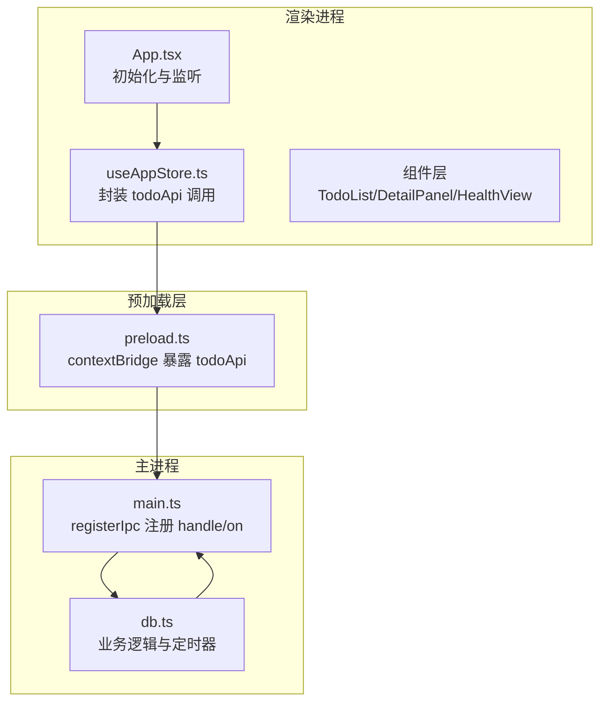
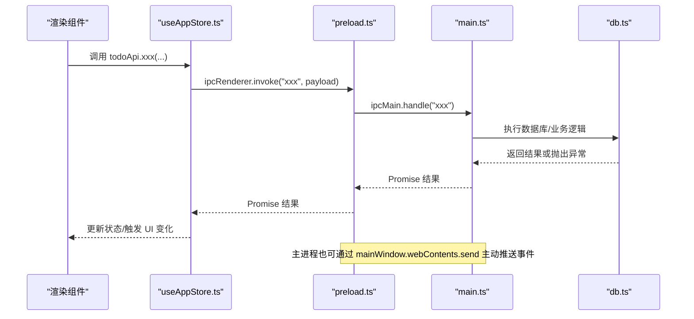
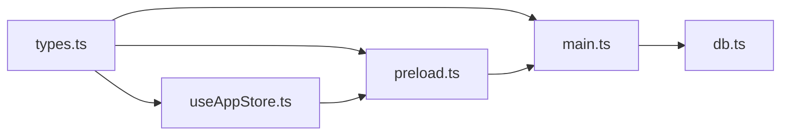

# IPC 通信集成

<cite>
**本文引用的文件列表**
- [main.ts](file://app/electron/main.ts)
- [preload.ts](file://app/electron/preload.ts)
- [types.ts](file://app/src/types.ts)
- [useAppStore.ts](file://app/src/store/useAppStore.ts)
- [App.tsx](file://app/src/App.tsx)
- [TodoList.tsx](file://app/src/components/Content/TodoList.tsx)
- [DetailPanel.tsx](file://app/src/components/DetailPanel/DetailPanel.tsx)
- [HealthView.tsx](file://app/src/components/Health/HealthView.tsx)
- [db.ts](file://app/electron/db.ts)
- [package.json](file://app/package.json)
</cite>

## 目录
1. [简介](#简介)
2. [项目结构](#项目结构)
3. [核心组件](#核心组件)
4. [架构总览](#架构总览)
5. [详细组件分析](#详细组件分析)
6. [依赖关系分析](#依赖关系分析)
7. [性能考量](#性能考量)
8. [故障排查指南](#故障排查指南)
9. [结论](#结论)
10. [附录](#附录)

## 简介
本指南面向在 SnowTodo 中新增 IPC 通信模块的开发者，系统性讲解如何在新模块中集成主进程与渲染进程之间的安全通信，涵盖：
- 安全的 API 暴露方式（contextBridge + 类型约束）
- 消息传递机制（ipcMain.handle 与 ipcRenderer.invoke/on）
- 错误处理策略与调试方法
- IPC 接口设计原则（命名规范、参数校验、返回值处理）
- 异步操作与数据序列化的最佳实践
- 性能优化与安全最佳实践

## 项目结构
SnowTodo 的 IPC 通信主要分布在以下位置：
- 主进程入口与 IPC 注册：app/electron/main.ts
- 渲染进程桥接层：app/electron/preload.ts
- 类型定义：app/src/types.ts
- 渲染侧调用封装与类型声明：app/src/store/useAppStore.ts
- 渲染侧组件使用示例：app/src/components/…/*.tsx
- 数据库与业务逻辑：app/electron/db.ts
- 构建与打包配置：app/package.json

图表来源
- [main.ts:360-390](file://app/electron/main.ts#L360-L390)
- [preload.ts:18-116](file://app/electron/preload.ts#L18-L116)
- [useAppStore.ts:541-603](file://app/src/store/useAppStore.ts#L541-L603)
- [db.ts:1406-1457](file://app/electron/db.ts#L1406-L1457)

章节来源
- [main.ts:18-52](file://app/electron/main.ts#L18-L52)
- [preload.ts:1-17](file://app/electron/preload.ts#L1-L17)
- [useAppStore.ts:1-604](file://app/src/store/useAppStore.ts#L1-L604)
- [db.ts:1406-1457](file://app/electron/db.ts#L1406-L1457)

## 核心组件
- 主进程 IPC 注册与处理：在主进程集中注册所有 ipcMain.handle 和事件监听，统一管理业务逻辑与定时任务。
- 预加载层桥接：通过 contextBridge 将 todoApi 暴露给渲染进程，确保上下文隔离与类型安全。
- 渲染层封装与调用：在 useAppStore 中声明 todoApi 的类型签名，并在组件中以 Promise/回调形式调用。
- 类型系统：通过 types.ts 统一定义 IPC 参数与返回值的数据结构，保证主/渲染两端一致。

章节来源
- [main.ts:227-358](file://app/electron/main.ts#L227-L358)
- [preload.ts:18-116](file://app/electron/preload.ts#L18-L116)
- [useAppStore.ts:541-603](file://app/src/store/useAppStore.ts#L541-L603)
- [types.ts:1-278](file://app/src/types.ts#L1-L278)

## 架构总览
下图展示了从渲染进程发起 IPC 请求到主进程处理并返回结果的完整流程，以及主进程主动向渲染进程推送事件的机制。

图表来源
- [main.ts:227-358](file://app/electron/main.ts#L227-L358)
- [preload.ts:18-116](file://app/electron/preload.ts#L18-L116)
- [useAppStore.ts:541-603](file://app/src/store/useAppStore.ts#L541-L603)
- [db.ts:1406-1457](file://app/electron/db.ts#L1406-L1457)

## 详细组件分析

### 主进程 IPC 注册与处理（registerIpc）
- 统一注册：将所有 IPC 方法集中在 registerIpc 函数内，便于维护与扩展。
- 方法分类：按功能模块分组（如 Todo、Recurring、Pomodoro、Health、AI、TimeBlock、Stats、Images、Projects），每个模块以“模块名: 动作”命名，例如 “todo:save”、“pomodoro:get-settings”。
- 参数与返回值：严格使用类型定义（如 TodoDraft、Settings、PomodoroSettings 等），确保参数校验与返回值一致性。
- 异步处理：对耗时操作（如数据导入导出）采用 async/await；对定时任务（提醒循环）使用定时器并在异常时记录日志。
- 事件推送：主进程通过 mainWindow.webContents.send 向渲染进程推送事件（如 “reminder:triggered”、“health-reminder:triggered”、“pomodoro:toggle”、“pomodoro:active-changed”）。

章节来源
- [main.ts:227-358](file://app/electron/main.ts#L227-L358)
- [main.ts:98-118](file://app/electron/main.ts#L98-L118)
- [main.ts:141-159](file://app/electron/main.ts#L141-L159)
- [main.ts:179-193](file://app/electron/main.ts#L179-L193)

### 预加载层桥接（contextBridge）
- 暴露 API：通过 contextBridge.exposeInMainWorld 将 todoApi 暴露到渲染进程全局对象 window 中。
- 类型约束：引入 src/types.ts 中的类型，确保暴露的方法签名与渲染侧一致。
- 调用模式：
  - 同步/异步请求：ipcRenderer.invoke("channel", payload) 对应 ipcMain.handle("channel")。
  - 事件监听：ipcRenderer.on("event", handler) 对应主进程 send("event", payload)，并提供移除监听的返回函数。
- 回调清理：事件监听返回移除函数，避免内存泄漏。

章节来源
- [preload.ts:18-116](file://app/electron/preload.ts#L18-L116)
- [types.ts:1-278](file://app/src/types.ts#L1-L278)

### 渲染层封装与调用（useAppStore + 组件）
- 类型声明：在全局 window 上声明 todoApi 的完整方法签名，确保 TS 在渲染侧进行类型检查。
- 方法封装：将 todoApi 的调用封装到 store 的 actions 中，统一处理加载状态、错误与 UI 更新。
- 组件使用：组件直接调用 window.todoApi.xxx(...) 或通过 store 的 action 间接调用，实现数据驱动的 UI 更新。
- 示例场景：
  - Todo 列表项切换：调用 toggleTodo 并更新本地状态。
  - 健康提醒事件监听：注册 onHealthReminderTriggered，在回调中弹出提醒面板。
  - 项目单元格读写：调用 getProjectCellsByMonth/getProjectCell/upsertProjectCell。

章节来源
- [useAppStore.ts:541-603](file://app/src/store/useAppStore.ts#L541-L603)
- [TodoList.tsx:83-87](file://app/src/components/Content/TodoList.tsx#L83-L87)
- [DetailPanel.tsx:68-75](file://app/src/components/DetailPanel/DetailPanel.tsx#L68-L75)
- [HealthView.tsx:71-109](file://app/src/components/Health/HealthView.tsx#L71-L109)

### 数据库与业务逻辑（db.ts）
- 业务职责：负责数据持久化、提醒计算、会话管理、统计数据生成等。
- 提醒机制：根据配置与当前时间判断是否触发健康提醒或待办提醒，并记录历史。
- 定时任务：启动定时器定期检查提醒事件并向主进程推送。

章节来源
- [db.ts:1406-1457](file://app/electron/db.ts#L1406-L1457)

### IPC 接口设计原则
- 命名规范
  - 使用“模块:动作”的命名风格，如 “todo:save”、“health:get-reminders”、“project:upsert-cell”。
  - 事件通道使用短横线分隔，如 “reminder:triggered”、“health-reminder:triggered”。
- 参数验证
  - 在主进程中对传入参数进行类型检查与必要校验（如 todoId 存在性、日期格式等）。
  - 对于可选字段，明确默认值与边界条件。
- 返回值处理
  - Promise 化：统一使用 ipcRenderer.invoke 返回 Promise，便于在渲染侧 await。
  - 错误传播：主进程捕获异常并通过日志输出，渲染侧通过 try/catch 或 .catch 处理。
- 事件推送
  - 主进程仅推送必要事件，避免频繁广播造成性能问题。
  - 事件名称语义清晰，配合类型定义确保双方一致。

章节来源
- [main.ts:227-358](file://app/electron/main.ts#L227-L358)
- [preload.ts:43-47](file://app/electron/preload.ts#L43-L47)
- [preload.ts:83-87](file://app/electron/preload.ts#L83-L87)

### 新增 IPC 方法的步骤指南
- 步骤 1：在 types.ts 中定义参数与返回值类型，确保主/渲染两端一致。
- 步骤 2：在 main.ts 的 registerIpc 中添加 ipcMain.handle("模块:动作", ...)，实现业务逻辑。
- 步骤 3：在 preload.ts 的 todoApi 中添加对应方法签名与调用逻辑。
- 步骤 4：在 useAppStore.ts 的全局 window 声明中补充该方法的类型签名。
- 步骤 5：在组件中调用 window.todoApi.xxx(...) 或通过 store 的 action 调用。
- 步骤 6：如需推送事件，使用 mainWindow.webContents.send("事件名", payload) 并在渲染侧注册监听。

章节来源
- [types.ts:1-278](file://app/src/types.ts#L1-L278)
- [main.ts:227-358](file://app/electron/main.ts#L227-L358)
- [preload.ts:18-116](file://app/electron/preload.ts#L18-L116)
- [useAppStore.ts:541-603](file://app/src/store/useAppStore.ts#L541-L603)

### 异步操作与数据序列化
- 异步处理
  - 渲染侧统一使用 await window.todoApi.xxx(...) 获取结果。
  - 主进程 handle 中的业务逻辑建议使用 async/await，异常通过 try/catch 捕获并记录。
- 数据序列化
  - IPC 传输的对象必须是可序列化的（JSON 兼容），避免传递函数、Symbol、undefined、Date 对象等。
  - 对于复杂对象（如时间戳），建议以字符串 ISO 格式传输，避免跨语言差异。

章节来源
- [main.ts:240-243](file://app/electron/main.ts#L240-L243)
- [main.ts:244-259](file://app/electron/main.ts#L244-L259)

### 事件推送与回调清理
- 事件监听
  - 渲染侧通过 onXxx(callback) 注册监听，返回移除函数用于清理。
  - 主进程通过 webContents.send 推送事件，payload 为可序列化对象。
- 清理策略
  - 在组件卸载或页面切换时调用返回的移除函数，避免内存泄漏与重复监听。

章节来源
- [preload.ts:43-47](file://app/electron/preload.ts#L43-L47)
- [preload.ts:83-87](file://app/electron/preload.ts#L83-L87)
- [useAppStore.ts:425-437](file://app/src/store/useAppStore.ts#L425-L437)

## 依赖关系分析
- 渲染层依赖
  - useAppStore.ts 依赖 window.todoApi（由 preload.ts 暴露）。
  - 组件依赖 useAppStore 的 actions 与状态。
- 预加载层依赖
  - 依赖 src/types.ts 的类型定义，确保暴露 API 的类型安全。
- 主进程依赖
  - 依赖 db.ts 的业务逻辑与定时器。
  - 依赖 Electron 的 ipcMain、BrowserWindow、globalShortcut、Notification 等原生能力。
- 类型系统
  - types.ts 作为 IPC 参数与返回值的唯一真相来源，贯穿主/渲染两端。

图表来源
- [types.ts:1-278](file://app/src/types.ts#L1-L278)
- [preload.ts:18-116](file://app/electron/preload.ts#L18-L116)
- [useAppStore.ts:541-603](file://app/src/store/useAppStore.ts#L541-L603)
- [main.ts:227-358](file://app/electron/main.ts#L227-L358)
- [db.ts:1406-1457](file://app/electron/db.ts#L1406-L1457)

## 性能考量
- 减少不必要的事件推送：仅在确有需要时发送事件，避免高频触发。
- 合理使用定时器：提醒循环与健康提醒循环已采用定时器，注意清理与异常处理。
- 数据批量读取：对于大量数据的读取，优先使用批量查询与分页策略。
- 序列化开销：尽量避免传输大对象，必要时进行压缩或拆分。
- UI 响应性：在渲染侧对 IPC 调用进行节流/防抖，避免频繁重渲染。

章节来源
- [main.ts:120-139](file://app/electron/main.ts#L120-L139)
- [main.ts:161-177](file://app/electron/main.ts#L161-L177)

## 故障排查指南
- 常见问题
  - 方法未找到：检查 preload.ts 是否正确暴露、main.ts 是否注册、调用端是否拼写正确。
  - 类型不匹配：检查 types.ts 中的参数/返回值定义是否与实际调用一致。
  - 事件未收到：确认主进程是否正确发送、渲染侧是否注册监听并返回移除函数。
  - 异常未捕获：主进程 handle 中增加 try/catch 并记录错误日志。
- 调试方法
  - 在主进程控制台打印关键路径日志（如 “[Main] Reminder loop error:”）。
  - 在渲染侧使用浏览器开发者工具断点调试，观察 IPC 调用链路。
  - 使用最小复现：新建一个最小 IPC 方法，逐步验证桥接与注册流程。
- 安全建议
  - 严格限制暴露 API 的范围，避免将 Node.js 全部能力暴露到渲染进程。
  - 对外部输入进行白名单校验，避免注入攻击。
  - 对敏感数据（如 API Key）进行加密存储与传输。

章节来源
- [main.ts:132-134](file://app/electron/main.ts#L132-L134)
- [main.ts:170-172](file://app/electron/main.ts#L170-L172)
- [preload.ts:1-17](file://app/electron/preload.ts#L1-L17)

## 结论
SnowTodo 的 IPC 通信体系通过严格的类型约束、清晰的模块划分与完善的错误处理，实现了主/渲染进程间的高效协作。新增模块时，遵循本文的设计原则与实施步骤，即可快速、安全地集成新的 IPC 方法与事件推送，保障应用的稳定性与可维护性。

## 附录

### IPC 方法清单（示例）
- 基础数据
  - todo:get-bootstrap
  - todo:save
  - todo:toggle
  - todo:delete
  - todo:restore
  - category:create
  - tag:create
  - settings:update
  - data:export
  - data:import
  - window:action
- 重复待办
  - recurring:get-all
  - recurring:create
  - recurring:update
  - recurring:delete
  - recurring:generate-daily
- 番茄钟
  - pomodoro:get-settings
  - pomodoro:update-settings
  - pomodoro:create-session
  - pomodoro:update-session
  - pomodoro:get-sessions
  - pomodoro:get-today-sessions
  - pomodoro:set-active
- 健康提醒
  - health:get-reminders
  - health:create-reminder
  - health:update-reminder
  - health:delete-reminder
  - health:get-history
  - health:snooze-reminder
  - health:dismiss-reminder
- AI 设置
  - ai:get-settings
  - ai:update-settings
- 时间块
  - timeblock:get-all
  - timeblock:create
  - timeblock:update
  - timeblock:delete
- 日常统计
  - stats:get-daily
  - stats:update-daily
- 待办图片
  - todo:get-images
  - todo:add-image
  - todo:delete-image
- 项目单元格
  - project:get-cells-by-month
  - project:get-cell
  - project:upsert-cell

章节来源
- [main.ts:227-358](file://app/electron/main.ts#L227-L358)