# 数据库操作

<cite>
**本文档引用的文件**
- [db.ts](file://app/electron/db.ts)
- [types.ts](file://app/src/types.ts)
</cite>

## 目录
1. [简介](#简介)
2. [项目结构](#项目结构)
3. [核心组件](#核心组件)
4. [架构概览](#架构概览)
5. [详细组件分析](#详细组件分析)
6. [依赖关系分析](#依赖关系分析)
7. [性能考虑](#性能考虑)
8. [故障排除指南](#故障排除指南)
9. [结论](#结论)

## 简介

SnowTodo 使用 SQL.js 作为本地数据库解决方案，为 Electron 应用提供完整的数据库操作能力。本指南详细说明了如何在新模块中使用 SQL.js 进行数据库操作，包括表结构设计、CRUD 操作实现、查询优化等。文档涵盖了数据库模型的设计原则，包括实体关系、索引策略、数据完整性约束等，并提供了数据库操作的代码示例和最佳实践。

## 项目结构

SnowTodo 的数据库架构采用模块化设计，主要包含以下关键组件：

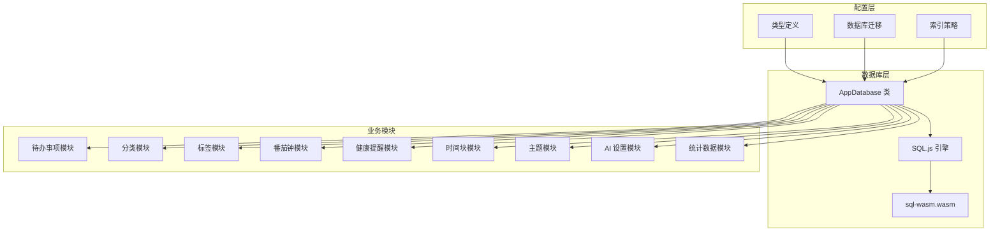

**图表来源**
- [db.ts:55-90](file://app/electron/db.ts#L55-L90)
- [db.ts:299-505](file://app/electron/db.ts#L299-L505)

**章节来源**
- [db.ts:55-90](file://app/electron/db.ts#L55-L90)
- [db.ts:299-505](file://app/electron/db.ts#L299-L505)

## 核心组件

### AppDatabase 类

AppDatabase 是整个数据库系统的核心类，负责数据库初始化、连接管理和所有数据库操作。

#### 主要职责
- 数据库初始化和配置
- 表结构创建和维护
- 数据库迁移管理
- 所有 CRUD 操作的封装
- 数据导出和导入功能

#### 关键特性
- 支持开发和生产环境的不同配置
- 自动化的数据库迁移机制
- 完整的数据备份和恢复功能
- 性能优化的索引策略

**章节来源**
- [db.ts:55-90](file://app/electron/db.ts#L55-L90)
- [db.ts:299-505](file://app/electron/db.ts#L299-L505)

## 架构概览

SnowTodo 的数据库架构采用了分层设计模式，确保了良好的可维护性和扩展性：

```mermaid
classDiagram
class AppDatabase {
-sql : SqlJsStatic
-db : Database
-userDataPath : string
+init(userDataPath : string) Promise~void~
+runMigrations() void
+createTables() void
+save() void
+generateId() string
+getBootstrapData() BootstrapData
+saveTodo(draft : TodoDraft) Todo
+toggleTodo(todoId : string, completed : boolean) Todo
+deleteTodo(todoId : string) void
+createCategory(name : string) Category
+createTag(name : string) Tag
+updateSettings(patch : Partial~Settings~) BootstrapData
+getDueReminderEvents() ReminderEvent[]
+recordReminder(todoId : string, channel : ReminderType) void
+generateDailyTodos() number
+createPomodoroSession(session : Omit~PomodoroSession~, patch : Partial~PomodoroSession~) PomodoroSession
+getPomodoroSessions(dateRange? : {start : string, end : string}) PomodoroSession[]
+getHealthReminders() HealthReminder[]
+createHealthReminder(reminder : Omit~HealthReminder~) HealthReminder
+updateHealthReminder(id : string, patch : Partial~HealthReminder~) HealthReminder
+getDueHealthReminders(isPomodoroActive : boolean) HealthReminder[]
+recordHealthReminderTrigger(reminderId : string, responded : boolean, snoozed : boolean, snoozedMinutes? : number) void
+getTimeBlocks(date? : string) TimeBlock[]
+createTimeBlock(block : Omit~TimeBlock~) TimeBlock
+updateTimeBlock(id : string, patch : Partial~TimeBlock~) TimeBlock
+deleteTimeBlock(id : string) void
+getThemes() Theme[]
+createCustomTheme(id : string, name : string, config : string) void
+updateTheme(id : string, name : string, config : string) void
+deleteTheme(id : string) void
+getAISettings() AISettings
+updateAISettings(patch : Partial~AISettings~) AISettings
+updateDailyStats() void
+getDailyStats(dateRange? : {start : string, end : string}) DailyStats[]
+getPomodoroSettings() PomodoroSettings
+updatePomodoroSettings(patch : Partial~PomodoroSettings~) PomodoroSettings
+getCurrentThemeId() string
+setCurrentThemeId(themeId : string) void
+getTodoImages(todoId : string) TodoImage[]
+addTodoImage(todoId : string, data : string, mimeType : string) string
+deleteTodoImage(imageId : string) void
+getProjectCellsByMonth(projectId : string, yearMonth : string) ProjectCell[]
+getProjectCell(projectId : string, cellDate : string) ProjectCell
+upsertProjectCell(projectId : string, cellDate : string, content : string, images : string[], isAlert : boolean) void
+exportSnapshot() string
+importSnapshot(data : BootstrapData) BootstrapData
}
class BootstrapData {
+todos : Todo[]
+categories : Category[]
+tags : Tag[]
+settings : Settings
}
class Todo {
+id : string
+title : string
+notes : string
+status : TodoStatus
+priority : Priority
+categoryId : string | null
+dueDate : string | null
+dueTime : string | null
+startDate : string | null
+isPinned : boolean
+repeatRule : RepeatRule
+customDays : number[]
+reminderEnabled : boolean
+reminderType : ReminderType
+remindAt : string | null
+completedAt : string | null
+createdAt : string
+updatedAt : string
+tagIds : string[]
}
AppDatabase --> BootstrapData : "返回"
AppDatabase --> Todo : "操作"
```

**图表来源**
- [db.ts:55-1825](file://app/electron/db.ts#L55-L1825)
- [types.ts:168-213](file://app/src/types.ts#L168-L213)

## 详细组件分析

### 数据库初始化流程

数据库初始化是整个系统的关键步骤，涉及多个复杂的配置过程：

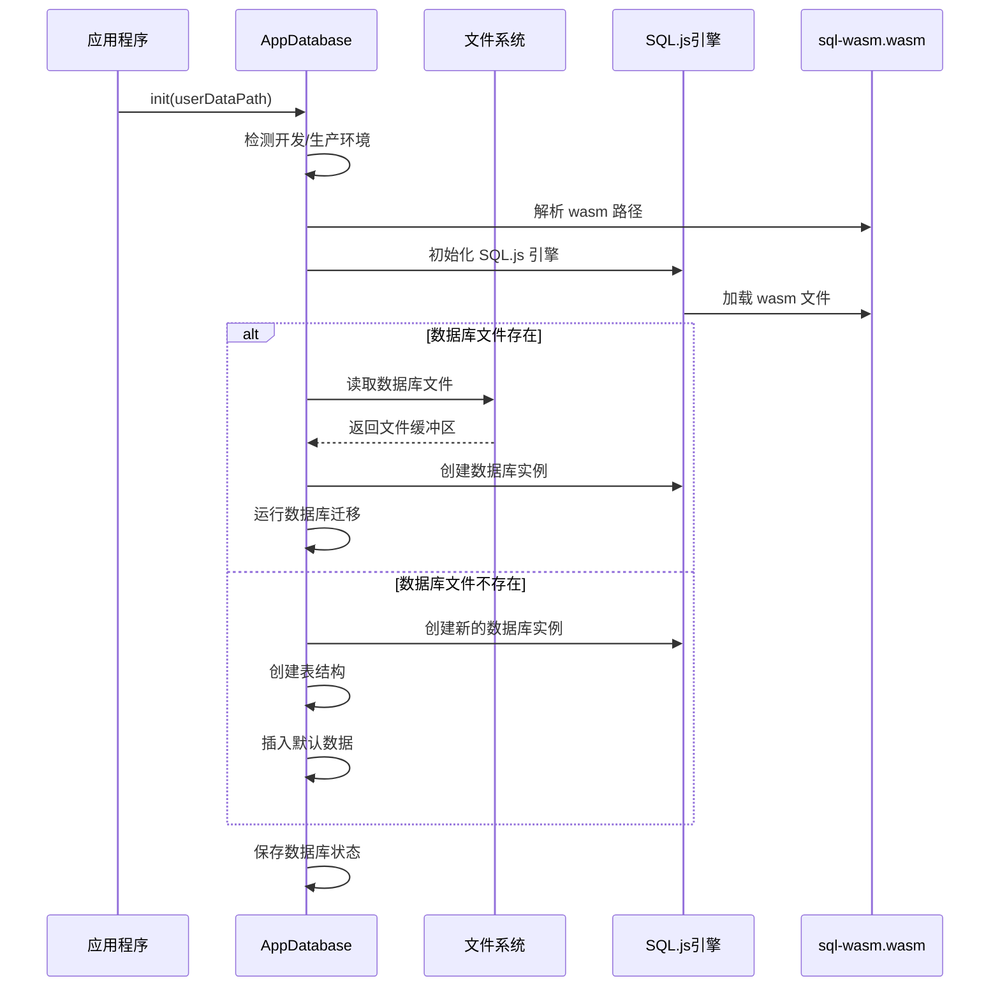

**图表来源**
- [db.ts:60-90](file://app/electron/db.ts#L60-L90)

#### 初始化配置要点
- **环境检测**: 自动识别开发和生产环境，使用不同的 wasm 文件路径
- **WASM 加载**: 确保 WebAssembly 模块正确加载
- **文件持久化**: 将数据库状态保存到用户数据目录
- **错误处理**: 完善的异常捕获和错误日志记录

**章节来源**
- [db.ts:60-90](file://app/electron/db.ts#L60-L90)

### 表结构设计原则

SnowTodo 采用了规范的关系型数据库设计，遵循第三范式和实际业务需求的平衡：

#### 核心表结构

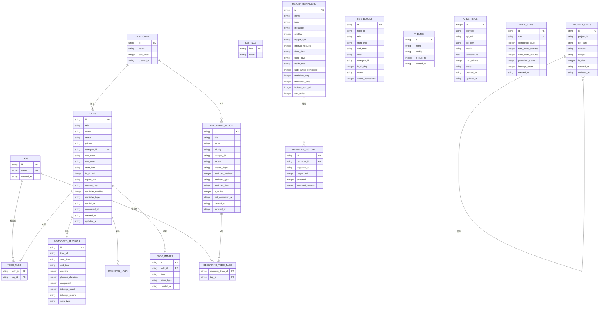

**图表来源**
- [db.ts:299-505](file://app/electron/db.ts#L299-L505)

#### 设计原则
1. **主键设计**: 所有表都使用字符串类型的主键，便于跨平台兼容
2. **外键约束**: 合理使用外键确保数据完整性
3. **索引策略**: 为核心查询字段建立索引
4. **JSON 存储**: 对于灵活的数据结构使用 JSON 字符串存储
5. **级联删除**: 正确处理相关数据的删除

**章节来源**
- [db.ts:299-505](file://app/electron/db.ts#L299-L505)

### CRUD 操作实现

#### 待办事项 CRUD

待办事项模块提供了完整的 CRUD 操作，支持复杂的状态管理和标签关联：

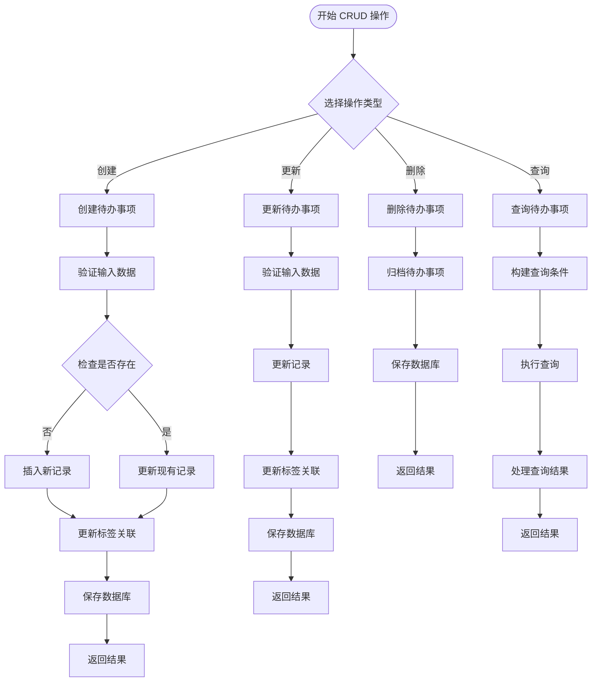

**图表来源**
- [db.ts:716-796](file://app/electron/db.ts#L716-L796)
- [db.ts:798-833](file://app/electron/db.ts#L798-L833)

#### 标签管理

标签系统采用多对多关系设计，支持灵活的内容组织：

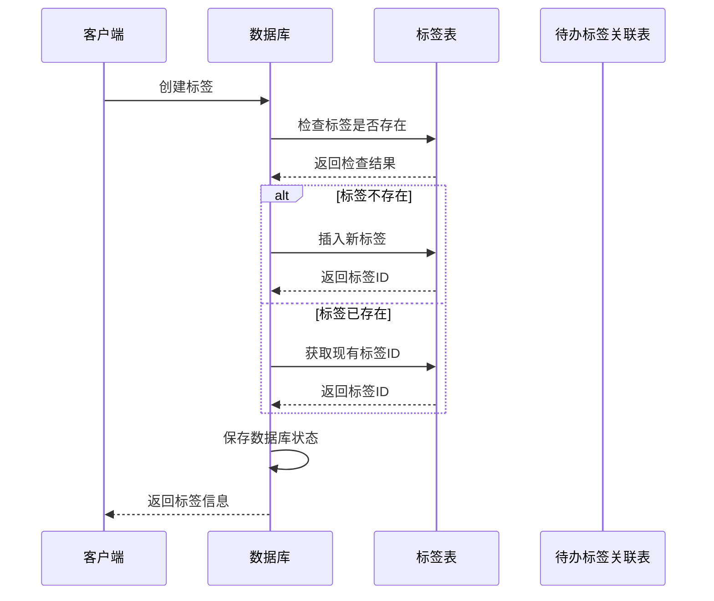

**图表来源**
- [db.ts:850-869](file://app/electron/db.ts#L850-L869)

**章节来源**
- [db.ts:716-796](file://app/electron/db.ts#L716-L796)
- [db.ts:798-833](file://app/electron/db.ts#L798-L833)
- [db.ts:850-869](file://app/electron/db.ts#L850-L869)

### 查询优化策略

#### 索引设计

SnowTodo 在关键查询字段上建立了专门的索引，以提升查询性能：

| 表名 | 索引名 | 字段 | 用途 |
|------|--------|------|------|
| todos | idx_todos_status | status | 状态查询过滤 |
| todos | idx_todos_due_date | due_date | 逾期查询 |
| todos | idx_todos_category | category_id | 分类查询 |
| recurring_todos | idx_recurring_active | is_active | 活跃模板查询 |
| pomodoro_sessions | idx_pomodoro_todo | todo_id | 待办事项统计 |
| pomodoro_sessions | idx_pomodoro_start | start_time | 时间范围查询 |
| time_blocks | idx_timeblock_start | start_time | 日程安排查询 |
| daily_stats | idx_daily_stats_date | date | 统计查询 |
| health_reminders | idx_health_enabled | enabled | 启用状态查询 |

#### 查询优化技巧

1. **选择性索引**: 在高选择性的字段上建立索引
2. **复合查询**: 使用合适的 WHERE 条件减少扫描范围
3. **LIMIT 限制**: 对大数据集查询使用 LIMIT 限制结果数量
4. **批量操作**: 使用批量插入和更新减少数据库往返

**章节来源**
- [db.ts:384-479](file://app/electron/db.ts#L384-L479)
- [db.ts:197-206](file://app/electron/db.ts#L197-L206)

### 数据库迁移机制

SnowTodo 实现了完善的数据库迁移系统，确保应用升级时的数据安全：

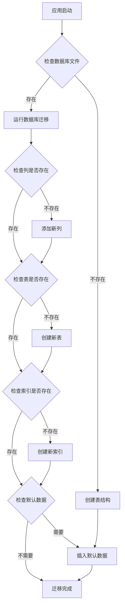

**图表来源**
- [db.ts:92-297](file://app/electron/db.ts#L92-L297)

#### 迁移策略

1. **向后兼容**: 新增列和表时使用默认值确保兼容性
2. **幂等操作**: 迁移脚本设计为可重复执行
3. **错误处理**: 完善的异常捕获和错误日志
4. **数据保护**: 迁移前自动备份数据库状态

**章节来源**
- [db.ts:92-297](file://app/electron/db.ts#L92-L297)

### 复杂查询实现

#### 生成每日待办事项

系统实现了智能的每日待办生成功能，支持多种重复模式：

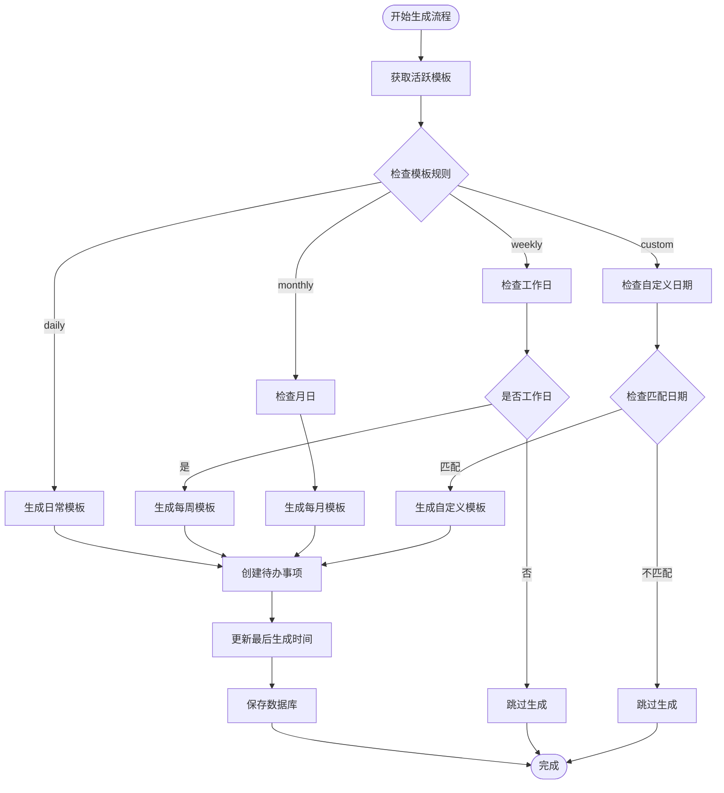

**图表来源**
- [db.ts:1183-1252](file://app/electron/db.ts#L1183-L1252)

#### 健康提醒系统

健康提醒系统实现了复杂的触发逻辑，支持固定时间和间隔两种模式：

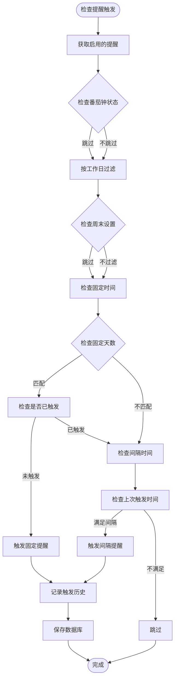

**图表来源**
- [db.ts:1406-1457](file://app/electron/db.ts#L1406-L1457)

**章节来源**
- [db.ts:1183-1252](file://app/electron/db.ts#L1183-L1252)
- [db.ts:1406-1457](file://app/electron/db.ts#L1406-L1457)

### 数据完整性约束

#### 外键约束设计

SnowTodo 在关键关系上使用了外键约束，确保数据一致性：

1. **分类与待办**: `todos.category_id` → `categories.id`
2. **标签关联**: `todo_tags.todo_id` → `todos.id` (CASCADE 删除)
3. **标签关联**: `todo_tags.tag_id` → `tags.id` (CASCADE 删除)
4. **图片关联**: `todo_images.todo_id` → `todos.id` (CASCADE 删除)

#### 数据验证策略

1. **唯一约束**: 标签名使用唯一约束防止重复
2. **非空约束**: 关键字段设置非空约束
3. **默认值**: 合理设置默认值确保数据完整性
4. **枚举值**: 使用枚举类型限制可能的值范围

**章节来源**
- [db.ts:333-342](file://app/electron/db.ts#L333-L342)
- [db.ts:309-312](file://app/electron/db.ts#L309-L312)

## 依赖关系分析

### 外部依赖

SnowTodo 的数据库层依赖于以下外部库：

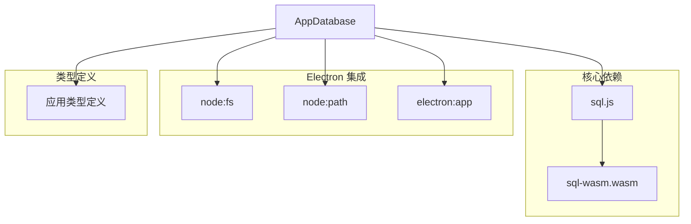

**图表来源**
- [db.ts:1-24](file://app/electron/db.ts#L1-L24)

### 内部依赖关系

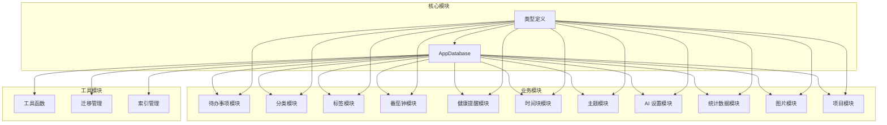

**图表来源**
- [db.ts:55-1825](file://app/electron/db.ts#L55-L1825)
- [types.ts:1-278](file://app/src/types.ts#L1-L278)

**章节来源**
- [db.ts:1-24](file://app/electron/db.ts#L1-L24)
- [db.ts:55-1825](file://app/electron/db.ts#L55-L1825)
- [types.ts:1-278](file://app/src/types.ts#L1-L278)

## 性能考虑

### 数据库性能优化

#### 查询性能优化

1. **索引优化**: 在高频查询字段上建立索引
2. **查询计划**: 使用 EXPLAIN QUERY PLAN 分析查询性能
3. **批量操作**: 减少数据库往返次数
4. **缓存策略**: 对静态数据使用内存缓存

#### 内存管理

1. **WASM 内存**: 合理管理 WebAssembly 内存分配
2. **连接池**: 复用数据库连接减少开销
3. **垃圾回收**: 及时释放不再使用的对象引用

#### I/O 优化

1. **批量写入**: 使用事务批量提交数据
2. **延迟保存**: 合理安排数据库保存时机
3. **文件系统**: 优化文件读写操作

### 应用性能监控

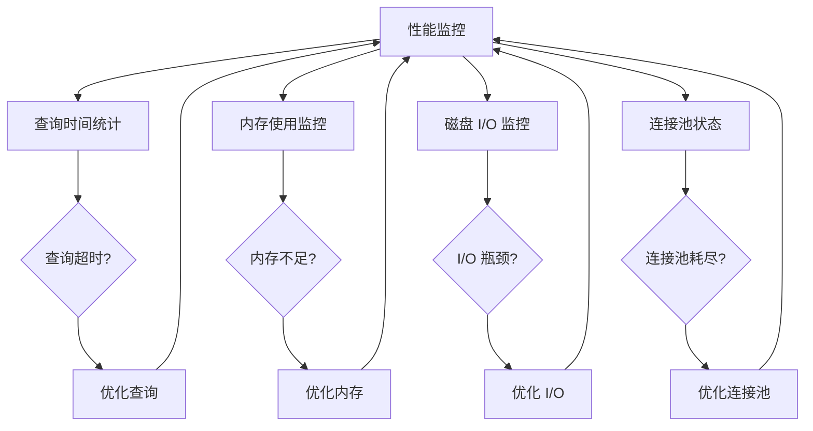

## 故障排除指南

### 常见问题及解决方案

#### 数据库初始化失败

**问题症状**:
- 应用启动时报错
- 数据库文件无法读取
- WASM 文件加载失败

**解决步骤**:
1. 检查 `sql-wasm.wasm` 文件是否存在
2. 验证文件权限设置
3. 确认路径解析正确
4. 查看详细的错误日志

**章节来源**
- [db.ts:63-76](file://app/electron/db.ts#L63-L76)

#### 数据库迁移错误

**问题症状**:
- 迁移过程中断
- 数据库结构不完整
- 查询报错

**解决步骤**:
1. 检查迁移脚本语法
2. 验证数据库权限
3. 确认数据格式正确
4. 查看迁移日志

**章节来源**
- [db.ts:92-297](file://app/electron/db.ts#L92-L297)

#### 查询性能问题

**问题症状**:
- 查询响应缓慢
- 内存使用过高
- 应用卡顿

**解决步骤**:
1. 分析慢查询语句
2. 检查索引使用情况
3. 优化查询条件
4. 考虑查询重写

**章节来源**
- [db.ts:384-479](file://app/electron/db.ts#L384-L479)

### 调试工具和方法

#### 数据库调试

1. **直接查询**: 使用 SQLite 命令行工具检查数据库状态
2. **日志分析**: 查看应用日志中的数据库操作记录
3. **性能分析**: 使用性能分析工具监控数据库操作

#### 数据完整性检查

1. **外键检查**: 使用 PRAGMA foreign_key_check 验证外键约束
2. **索引检查**: 使用 PRAGMA index_info 检查索引状态
3. **表结构检查**: 使用 PRAGMA table_info 验证表结构

**章节来源**
- [db.ts:92-297](file://app/electron/db.ts#L92-L297)

## 结论

SnowTodo 的数据库系统展现了现代 Electron 应用的最佳实践，通过 SQL.js 实现了强大的本地数据库功能。系统的设计充分考虑了性能、可维护性和扩展性，为开发者提供了完整的数据库操作框架。

### 主要优势

1. **跨平台兼容**: 基于 WebAssembly 的 SQL.js 确保了良好的跨平台支持
2. **完整的功能**: 提供了从基础 CRUD 到复杂查询的全套数据库功能
3. **完善的迁移**: 自动化的数据库迁移机制确保了数据安全
4. **性能优化**: 合理的索引策略和查询优化提升了整体性能
5. **易于扩展**: 模块化的架构设计便于功能扩展

### 最佳实践建议

1. **遵循设计原则**: 严格按照数据库设计原则进行表结构设计
2. **性能监控**: 持续监控数据库性能指标，及时发现和解决问题
3. **备份策略**: 建立完善的数据备份和恢复机制
4. **测试覆盖**: 为数据库操作编写充分的单元测试和集成测试
5. **文档维护**: 保持数据库设计文档的实时更新

通过遵循本指南提供的最佳实践，开发者可以高效地在 SnowTodo 中实现新的数据库功能，同时确保系统的稳定性和性能。