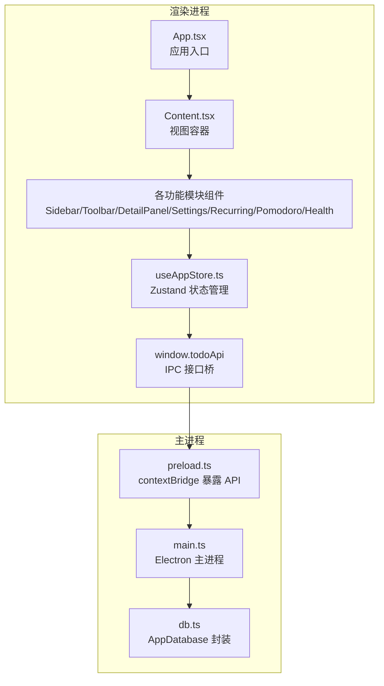
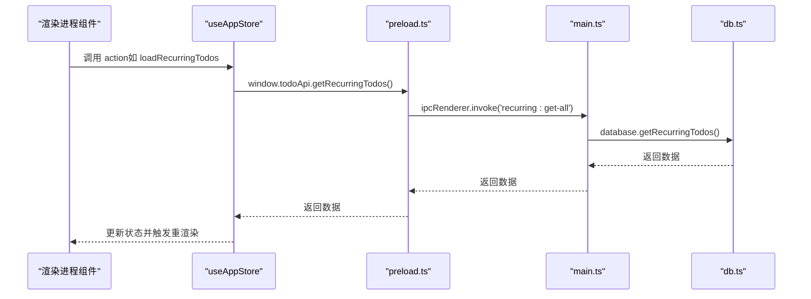
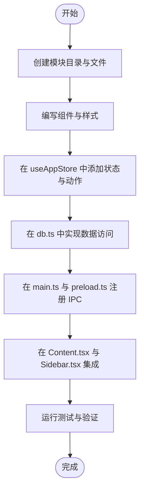
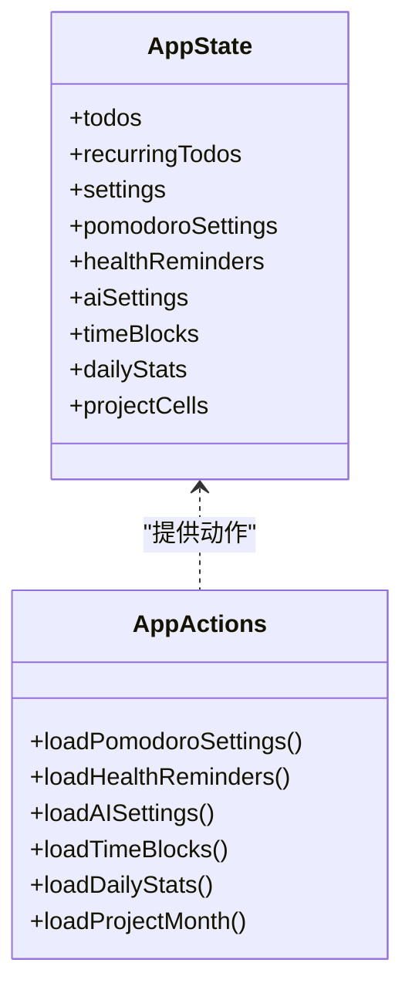
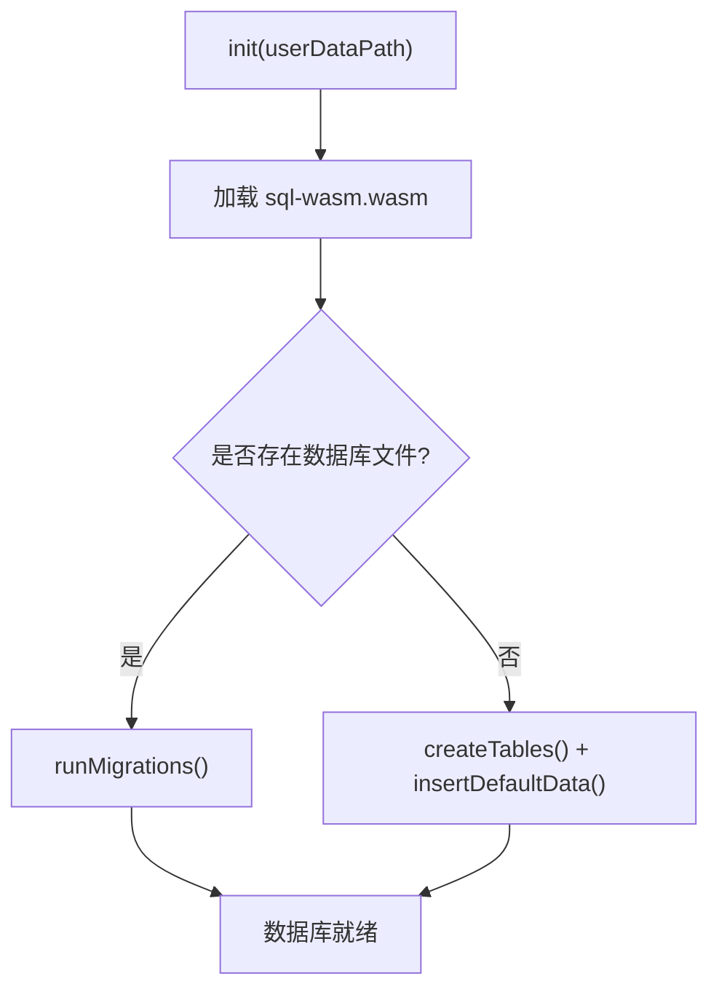
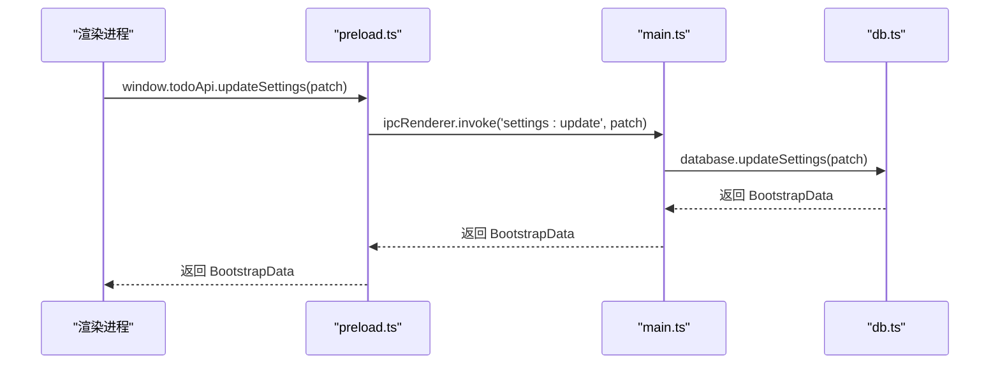
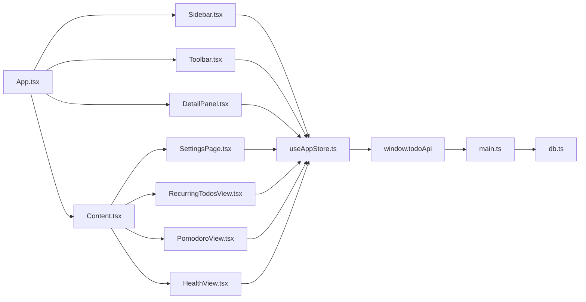

# 模块开发流程

<cite>
**本文档引用的文件**
- [main.tsx](file://app/src/main.tsx)
- [App.tsx](file://app/src/App.tsx)
- [types.ts](file://app/src/types.ts)
- [useAppStore.ts](file://app/src/store/useAppStore.ts)
- [main.ts](file://app/electron/main.ts)
- [preload.ts](file://app/electron/preload.ts)
- [db.ts](file://app/electron/db.ts)
- [components/index.ts](file://app/src/components/index.ts)
- [Content.tsx](file://app/src/components/Content/Content.tsx)
- [Sidebar.tsx](file://app/src/components/Sidebar/Sidebar.tsx)
- [Toolbar.tsx](file://app/src/components/Toolbar/Toolbar.tsx)
- [DetailPanel.tsx](file://app/src/components/DetailPanel/DetailPanel.tsx)
- [SettingsPage.tsx](file://app/src/components/Settings/SettingsPage.tsx)
- [RecurringTodosView.tsx](file://app/src/components/RecurringTodos/RecurringTodosView.tsx)
- [PomodoroView.tsx](file://app/src/components/Pomodoro/PomodoroView.tsx)
- [HealthView.tsx](file://app/src/components/Health/HealthView.tsx)
</cite>

## 目录
1. [简介](#简介)
2. [项目结构](#项目结构)
3. [核心组件](#核心组件)
4. [架构总览](#架构总览)
5. [详细组件分析](#详细组件分析)
6. [依赖关系分析](#依赖关系分析)
7. [性能考虑](#性能考虑)
8. [故障排除指南](#故障排除指南)
9. [结论](#结论)
10. [附录](#附录)

## 简介
本指南面向在 SnowTodo 项目中新增功能模块的开发者，覆盖从文件结构创建、组件开发、状态管理集成、数据库操作到模块间通信与依赖关系的完整流程。文档同时提供标准模板、代码路径示例、测试方法与调试技巧，帮助你快速、安全地扩展现有功能。

## 项目结构
SnowTodo 采用前端 React + Electron 的双端架构：
- 前端（渲染进程）：React 组件通过 Zustand 状态管理，使用 window.todoApi 与主进程通信。
- 主进程（Electron）：负责数据库操作、定时任务、系统通知、全局快捷键等。
- 数据层：基于 sql.js 的 SQLite 数据库，支持迁移与索引优化。

**图表来源**
- [App.tsx:11-57](file://app/src/App.tsx#L11-L57)
- [Content.tsx:14-63](file://app/src/components/Content/Content.tsx#L14-L63)
- [useAppStore.ts:181-508](file://app/src/store/useAppStore.ts#L181-L508)
- [preload.ts:18-116](file://app/electron/preload.ts#L18-L116)
- [main.ts:360-391](file://app/electron/main.ts#L360-L391)
- [db.ts:55-90](file://app/electron/db.ts#L55-L90)

**章节来源**
- [main.tsx:1-11](file://app/src/main.tsx#L1-L11)
- [App.tsx:11-57](file://app/src/App.tsx#L11-L57)
- [Content.tsx:14-63](file://app/src/components/Content/Content.tsx#L14-L63)
- [useAppStore.ts:181-508](file://app/src/store/useAppStore.ts#L181-L508)
- [preload.ts:18-116](file://app/electron/preload.ts#L18-L116)
- [main.ts:360-391](file://app/electron/main.ts#L360-L391)
- [db.ts:55-90](file://app/electron/db.ts#L55-L90)

## 核心组件
- 应用入口与布局
  - 渲染进程入口：[main.tsx:1-11](file://app/src/main.tsx#L1-L11)
  - 应用根组件：[App.tsx:11-57](file://app/src/App.tsx#L11-L57)，负责初始化与模块挂载。
  - 视图容器：[Content.tsx:14-63](file://app/src/components/Content/Content.tsx#L14-L63)，根据 currentView 渲染不同模块视图。
- 状态管理
  - 全局状态：[useAppStore.ts:181-508](file://app/src/store/useAppStore.ts#L181-L508)，包含基础数据、UI 状态、各模块状态与动作。
- IPC 与主进程
  - 预加载桥接：[preload.ts:18-116](file://app/electron/preload.ts#L18-L116)，暴露 window.todoApi。
  - 主进程注册：[main.ts:227-358](file://app/electron/main.ts#L227-L358)，注册所有 IPC 处理函数。
  - 数据库封装：[db.ts:55-90](file://app/electron/db.ts#L55-L90)、[db.ts:299-504](file://app/electron/db.ts#L299-L504)。

**章节来源**
- [main.tsx:1-11](file://app/src/main.tsx#L1-L11)
- [App.tsx:11-57](file://app/src/App.tsx#L11-L57)
- [Content.tsx:14-63](file://app/src/components/Content/Content.tsx#L14-L63)
- [useAppStore.ts:181-508](file://app/src/store/useAppStore.ts#L181-L508)
- [preload.ts:18-116](file://app/electron/preload.ts#L18-L116)
- [main.ts:227-358](file://app/electron/main.ts#L227-L358)
- [db.ts:55-90](file://app/electron/db.ts#L55-L90)
- [db.ts:299-504](file://app/electron/db.ts#L299-L504)

## 架构总览
模块间通信采用 IPC（进程间通信）与状态共享（Zustand）相结合的方式：
- 渲染进程通过 window.todoApi 发起请求，主进程在 ipcMain.handle 中处理并调用 AppDatabase 完成数据库操作。
- 各模块在 useAppStore 中维护自身状态，并通过 actions 与 IPC 交互，实现跨模块状态同步。

**图表来源**
- [useAppStore.ts:295-298](file://app/src/store/useAppStore.ts#L295-L298)
- [preload.ts:50-54](file://app/electron/preload.ts#L50-L54)
- [main.ts:262-266](file://app/electron/main.ts#L262-L266)
- [db.ts:1000-1100](file://app/electron/db.ts#L1000-L1100)

**章节来源**
- [useAppStore.ts:295-298](file://app/src/store/useAppStore.ts#L295-L298)
- [preload.ts:50-54](file://app/electron/preload.ts#L50-L54)
- [main.ts:262-266](file://app/electron/main.ts#L262-L266)
- [db.ts:1000-1100](file://app/electron/db.ts#L1000-L1100)

## 详细组件分析

### 模块开发通用流程
- 步骤 1：创建文件结构
  - 在 app/src/components 下新增模块目录（如 MyModule），包含组件文件与样式文件。
  - 在 app/src/components/index.ts 中导出新模块组件，便于统一管理。
- 步骤 2：编写组件
  - 组件应遵循现有风格：使用 Lucide 图标、统一的表单控件与交互模式。
  - 示例参考：[SettingsPage.tsx:1-147](file://app/src/components/Settings/SettingsPage.tsx#L1-L147)、[RecurringTodosView.tsx:1-218](file://app/src/components/RecurringTodos/RecurringTodosView.tsx#L1-L218)。
- 步骤 3：集成状态管理
  - 在 useAppStore.ts 的 AppState 与 AppActions 中添加模块状态与动作。
  - 示例参考：[useAppStore.ts:30-80](file://app/src/store/useAppStore.ts#L30-L80)、[useAppStore.ts:82-176](file://app/src/store/useAppStore.ts#L82-L176)。
- 步骤 4：数据库操作
  - 在 db.ts 中新增对应的数据访问方法（增删改查、索引、迁移）。
  - 示例参考：[db.ts:299-504](file://app/electron/db.ts#L299-L504)。
- 步 5：注册 IPC
  - 在 main.ts 的 registerIpc 中注册新的 ipcMain.handle。
  - 在 preload.ts 的 contextBridge.exposeInMainWorld 中暴露对应的 window.todoApi 方法。
  - 示例参考：[main.ts:227-358](file://app/electron/main.ts#L227-L358)、[preload.ts:18-116](file://app/electron/preload.ts#L18-L116)。
- 步骤 6：路由与导航
  - 在 Content.tsx 中根据 currentView 渲染新模块视图。
  - 在 Sidebar.tsx 中添加导航项与徽标。
  - 示例参考：[Content.tsx:14-63](file://app/src/components/Content/Content.tsx#L14-L63)、[Sidebar.tsx:23-132](file://app/src/components/Sidebar/Sidebar.tsx#L23-L132)。

**图表来源**
- [useAppStore.ts:30-176](file://app/src/store/useAppStore.ts#L30-L176)
- [db.ts:299-504](file://app/electron/db.ts#L299-L504)
- [main.ts:227-358](file://app/electron/main.ts#L227-L358)
- [preload.ts:18-116](file://app/electron/preload.ts#L18-L116)
- [Content.tsx:14-63](file://app/src/components/Content/Content.tsx#L14-L63)
- [Sidebar.tsx:23-132](file://app/src/components/Sidebar/Sidebar.tsx#L23-L132)

**章节来源**
- [useAppStore.ts:30-176](file://app/src/store/useAppStore.ts#L30-L176)
- [db.ts:299-504](file://app/electron/db.ts#L299-L504)
- [main.ts:227-358](file://app/electron/main.ts#L227-L358)
- [preload.ts:18-116](file://app/electron/preload.ts#L18-L116)
- [Content.tsx:14-63](file://app/src/components/Content/Content.tsx#L14-L63)
- [Sidebar.tsx:23-132](file://app/src/components/Sidebar/Sidebar.tsx#L23-L132)

### 状态管理集成（Zustand）
- 状态结构
  - 在 AppState 中添加模块字段，如 pomodoro、health、ai、timeBlock、dailyStats、projectCells 等。
  - 示例参考：[useAppStore.ts:30-80](file://app/src/store/useAppStore.ts#L30-L80)。
- 动作设计
  - 为每个模块提供 loadXxx、setXxx、getXxx 等动作，确保异步数据拉取与本地更新一致。
  - 示例参考：[useAppStore.ts:136-176](file://app/src/store/useAppStore.ts#L136-L176)。
- 类型声明
  - 在 types.ts 中定义模块相关类型，确保前后端一致。
  - 示例参考：[types.ts:27-146](file://app/src/types.ts#L27-L146)。

**图表来源**
- [useAppStore.ts:30-176](file://app/src/store/useAppStore.ts#L30-L176)

**章节来源**
- [useAppStore.ts:30-176](file://app/src/store/useAppStore.ts#L30-L176)
- [types.ts:27-146](file://app/src/types.ts#L27-L146)

### 数据库操作（SQL.js）
- 初始化与迁移
  - 在 init 中加载 sql-wasm.wasm 并执行迁移脚本，确保表结构与索引存在。
  - 示例参考：[db.ts:60-90](file://app/electron/db.ts#L60-L90)、[db.ts:92-297](file://app/electron/db.ts#L92-L297)。
- 表结构与索引
  - 新模块需在 createTables 中创建表，并在 runMigrations 中补充索引与默认数据。
  - 示例参考：[db.ts:299-504](file://app/electron/db.ts#L299-L504)。
- CRUD 方法
  - 为新模块实现对应的 CRUD 方法，返回 Promise 并持久化到数据库。
  - 示例参考：[db.ts:716-796](file://app/electron/db.ts#L716-L796)。

**图表来源**
- [db.ts:60-90](file://app/electron/db.ts#L60-L90)
- [db.ts:92-297](file://app/electron/db.ts#L92-L297)
- [db.ts:299-504](file://app/electron/db.ts#L299-L504)

**章节来源**
- [db.ts:60-90](file://app/electron/db.ts#L60-L90)
- [db.ts:92-297](file://app/electron/db.ts#L92-L297)
- [db.ts:299-504](file://app/electron/db.ts#L299-L504)

### IPC 通信机制
- 预加载桥接
  - 通过 contextBridge.exposeInMainWorld 暴露 window.todoApi，包含各模块的 invoke/on 方法。
  - 示例参考：[preload.ts:18-116](file://app/electron/preload.ts#L18-L116)。
- 主进程注册
  - 在 ipcMain.handle 中注册对应通道，调用 AppDatabase 完成业务逻辑。
  - 示例参考：[main.ts:227-358](file://app/electron/main.ts#L227-L358)。
- 事件监听
  - 使用 ipcRenderer.on 订阅主进程推送的事件（如提醒触发）。
  - 示例参考：[PomodoroView.tsx:206-211](file://app/src/components/Pomodoro/PomodoroView.tsx#L206-L211)、[HealthView.tsx:262-269](file://app/src/components/Health/HealthView.tsx#L262-L269)。

**图表来源**
- [preload.ts:33](file://app/electron/preload.ts#L33)
- [main.ts:235-239](file://app/electron/main.ts#L235-L239)
- [db.ts:1100-1200](file://app/electron/db.ts#L1100-L1200)

**章节来源**
- [preload.ts:18-116](file://app/electron/preload.ts#L18-L116)
- [main.ts:227-358](file://app/electron/main.ts#L227-L358)
- [db.ts:1100-1200](file://app/electron/db.ts#L1100-L1200)

### 模块模板与最佳实践
- 组件模板
  - 结构：导出常量（如 EMPTY_DRAFT）、状态管理（useState/useEffect）、事件处理（handleSave/handleToggle）。
  - 示例参考：[DetailPanel.tsx:1-507](file://app/src/components/DetailPanel/DetailPanel.tsx#L1-L507)。
- Hook 使用
  - 使用 useAppStore 获取状态与动作，避免直接访问全局变量。
  - 示例参考：[RecurringTodosView.tsx:28-37](file://app/src/components/RecurringTodos/RecurringTodosView.tsx#L28-L37)。
- 类型定义
  - 在 types.ts 中定义模块类型，确保前后端一致。
  - 示例参考：[types.ts:168-278](file://app/src/types.ts#L168-L278)。

**章节来源**
- [DetailPanel.tsx:1-507](file://app/src/components/DetailPanel/DetailPanel.tsx#L1-L507)
- [RecurringTodosView.tsx:28-37](file://app/src/components/RecurringTodos/RecurringTodosView.tsx#L28-L37)
- [types.ts:168-278](file://app/src/types.ts#L168-L278)

### 扩展现有功能
- 修改现有组件
  - 在现有组件中新增功能点时，优先通过 useAppStore 的 actions 与 IPC 交互，保证状态一致性。
  - 示例参考：[SettingsPage.tsx:8-28](file://app/src/components/Settings/SettingsPage.tsx#L8-L28)。
- 新特性添加
  - 在 db.ts 中新增表与索引，在 main.ts 与 preload.ts 中注册 IPC，在 useAppStore.ts 中扩展状态与动作。
  - 示例参考：[db.ts:92-297](file://app/electron/db.ts#L92-L297)、[main.ts:227-358](file://app/electron/main.ts#L227-L358)、[useAppStore.ts:136-176](file://app/src/store/useAppStore.ts#L136-L176)。

**章节来源**
- [SettingsPage.tsx:8-28](file://app/src/components/Settings/SettingsPage.tsx#L8-L28)
- [db.ts:92-297](file://app/electron/db.ts#L92-L297)
- [main.ts:227-358](file://app/electron/main.ts#L227-L358)
- [useAppStore.ts:136-176](file://app/src/store/useAppStore.ts#L136-L176)

### 模块测试方法与注意事项
- 单元测试建议
  - 对于纯函数与计算逻辑（如排序、过滤），编写独立测试用例。
  - 对于 IPC 交互，使用 mock 或测试框架模拟 window.todoApi。
- 集成测试建议
  - 在 Content.tsx 中切换 currentView，验证模块渲染与状态更新。
  - 在 Sidebar.tsx 中点击导航项，验证徽标与 active 状态。
- 注意事项
  - 确保所有新增字段在 db.ts 的 createTables 与 runMigrations 中正确声明。
  - 在 useAppStore.ts 中提供完整的初始化值与默认行为。
  - 在 main.ts 与 preload.ts 中保持 IPC 通道命名一致。

**章节来源**
- [Content.tsx:14-63](file://app/src/components/Content/Content.tsx#L14-L63)
- [Sidebar.tsx:30-58](file://app/src/components/Sidebar/Sidebar.tsx#L30-L58)
- [db.ts:299-504](file://app/electron/db.ts#L299-L504)
- [useAppStore.ts:181-250](file://app/src/store/useAppStore.ts#L181-L250)

### 调试技巧与常见问题
- 调试技巧
  - 使用浏览器开发者工具检查渲染进程状态变化与网络请求。
  - 在主进程控制台输出日志，定位 IPC 通道问题。
  - 使用 Electron 的 devtools 与断点调试。
- 常见问题
  - IPC 未注册：检查 main.ts 的 registerIpc 与 preload.ts 的 exposeInMainWorld 是否匹配。
  - 数据库迁移失败：确认 sql-wasm.wasm 路径与权限，检查 runMigrations 的异常处理。
  - 状态未更新：确认 useAppStore 的动作是否正确调用 window.todoApi 并更新本地状态。

**章节来源**
- [main.ts:227-358](file://app/electron/main.ts#L227-L358)
- [preload.ts:18-116](file://app/electron/preload.ts#L18-L116)
- [db.ts:92-297](file://app/electron/db.ts#L92-L297)

## 依赖关系分析
- 组件依赖
  - App.tsx 依赖 Sidebar、Toolbar、Content、DetailPanel、RecurringTodoPanel、HealthReminderPopup。
  - Content.tsx 依赖各模块视图组件。
- 状态依赖
  - 各模块组件通过 useAppStore 访问全局状态，避免跨组件传递 props。
- IPC 依赖
  - 所有模块通过 window.todoApi 与主进程通信，主进程在 ipcMain.handle 中集中处理。

**图表来源**
- [App.tsx:3-9](file://app/src/App.tsx#L3-L9)
- [Content.tsx:3-11](file://app/src/components/Content/Content.tsx#L3-L11)
- [useAppStore.ts:181-508](file://app/src/store/useAppStore.ts#L181-L508)
- [preload.ts:18-116](file://app/electron/preload.ts#L18-L116)
- [main.ts:227-358](file://app/electron/main.ts#L227-L358)
- [db.ts:55-90](file://app/electron/db.ts#L55-L90)

**章节来源**
- [App.tsx:3-9](file://app/src/App.tsx#L3-L9)
- [Content.tsx:3-11](file://app/src/components/Content/Content.tsx#L3-L11)
- [useAppStore.ts:181-508](file://app/src/store/useAppStore.ts#L181-L508)
- [preload.ts:18-116](file://app/electron/preload.ts#L18-L116)
- [main.ts:227-358](file://app/electron/main.ts#L227-L358)
- [db.ts:55-90](file://app/electron/db.ts#L55-L90)

## 性能考虑
- 状态粒度
  - 将高频更新的状态拆分为更细的 slice，减少不必要的重渲染。
- 数据查询优化
  - 为常用查询建立索引，避免全表扫描。
- IPC 调用频率
  - 合并多次调用，使用批量接口减少往返开销。
- 渲染优化
  - 使用 React.memo、useMemo、useCallback 缓存计算结果与组件实例。

## 故障排除指南
- IPC 通道未响应
  - 检查主进程是否注册了对应 handle，preload 是否暴露了对应 invoke/on。
  - 参考：[main.ts:227-358](file://app/electron/main.ts#L227-L358)、[preload.ts:18-116](file://app/electron/preload.ts#L18-L116)。
- 数据库初始化失败
  - 确认 sql-wasm.wasm 路径与权限，检查 init 与 runMigrations 的异常处理。
  - 参考：[db.ts:60-90](file://app/electron/db.ts#L60-L90)、[db.ts:92-297](file://app/electron/db.ts#L92-L297)。
- 状态未更新
  - 确认 actions 是否正确调用 window.todoApi 并更新本地状态。
  - 参考：[useAppStore.ts:295-298](file://app/src/store/useAppStore.ts#L295-L298)。

**章节来源**
- [main.ts:227-358](file://app/electron/main.ts#L227-L358)
- [preload.ts:18-116](file://app/electron/preload.ts#L18-L116)
- [db.ts:60-90](file://app/electron/db.ts#L60-L90)
- [db.ts:92-297](file://app/electron/db.ts#L92-L297)
- [useAppStore.ts:295-298](file://app/src/store/useAppStore.ts#L295-L298)

## 结论
通过遵循本文档提供的模块开发流程，你可以高效、安全地在 SnowTodo 中添加新功能模块。关键在于：规范的文件结构、完善的 IPC 与状态管理集成、健壮的数据库操作以及清晰的模块间通信。建议在开发过程中持续关注性能与可维护性，确保模块能够长期稳定运行。

## 附录
- 类型定义参考：[types.ts:1-278](file://app/src/types.ts#L1-L278)
- 组件导出参考：[components/index.ts:1-10](file://app/src/components/index.ts#L1-L10)