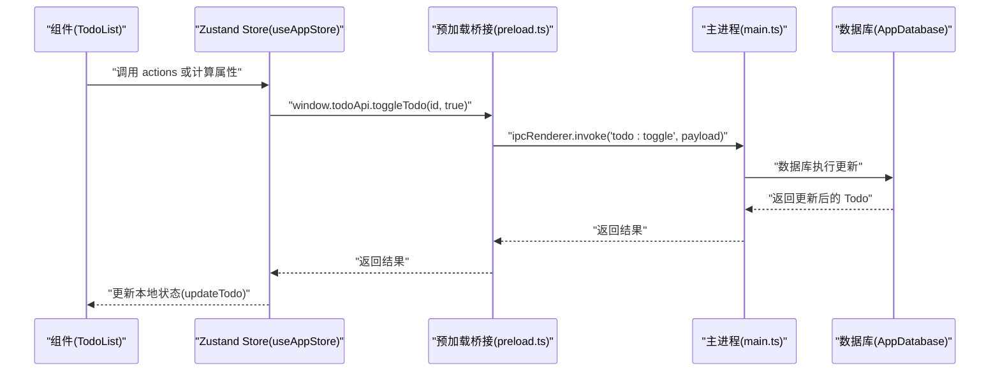
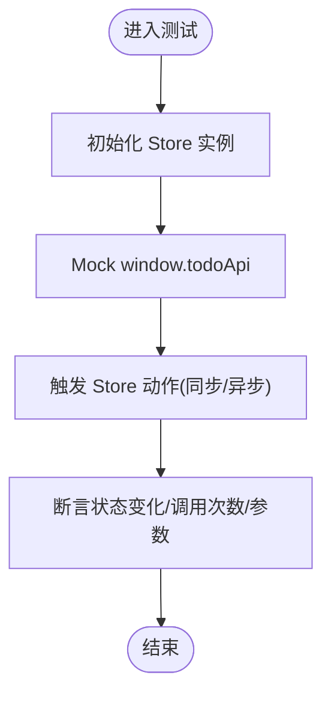
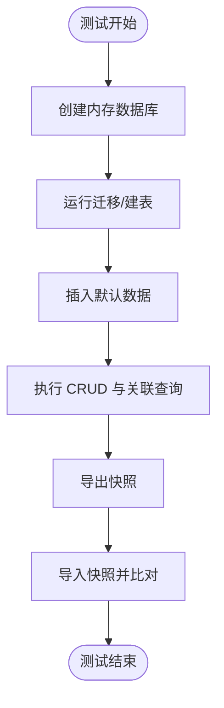
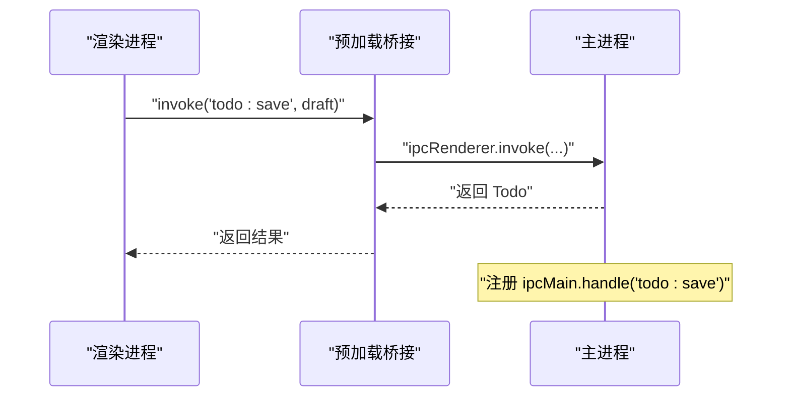
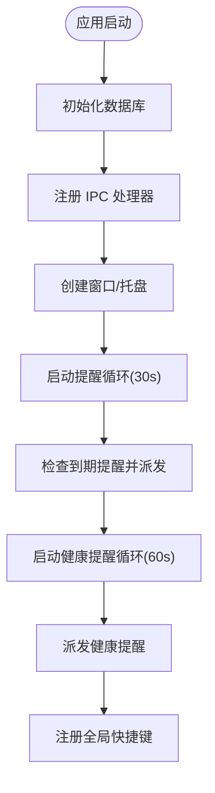
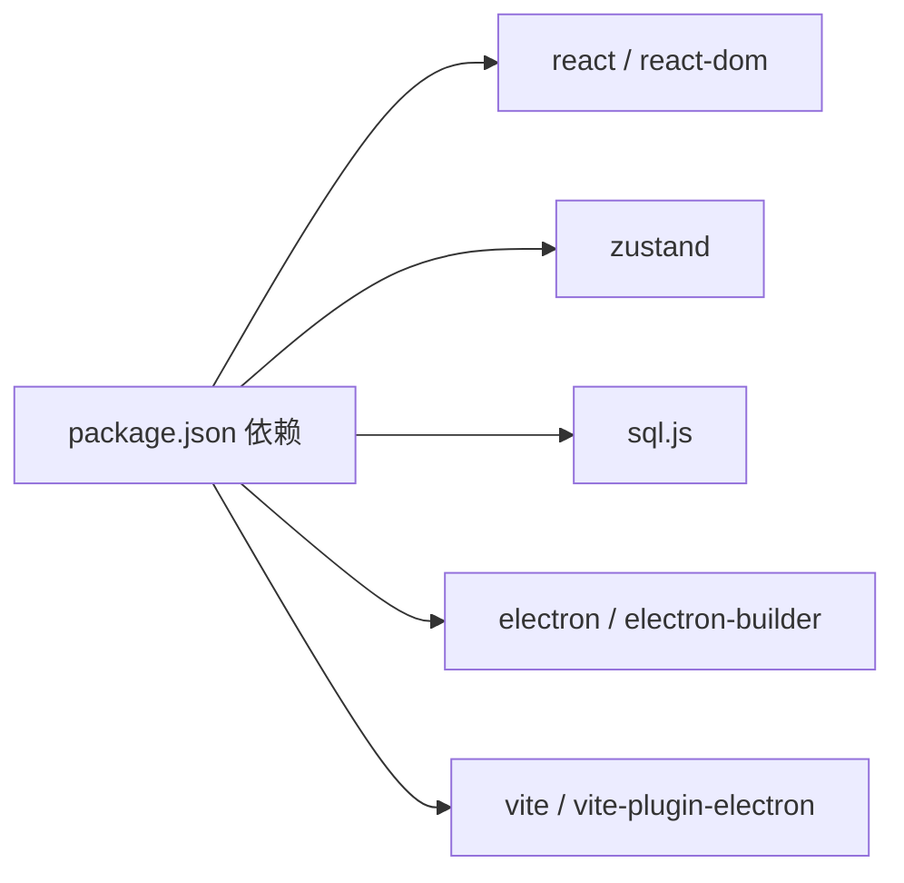

# 模块测试

<cite>
**本文引用的文件**
- [package.json](file://app/package.json)
- [vite.config.ts](file://app/vite.config.ts)
- [useAppStore.ts](file://app/src/store/useAppStore.ts)
- [types.ts](file://app/src/types.ts)
- [main.ts](file://app/electron/main.ts)
- [preload.ts](file://app/electron/preload.ts)
- [db.ts](file://app/electron/db.ts)
- [Content.tsx](file://app/src/components/Content/Content.tsx)
- [TodoList.tsx](file://app/src/components/Content/TodoList.tsx)
- [eslint.config.js](file://app/eslint.config.js)
- [README.md](file://app/README.md)
</cite>

## 目录
1. [简介](#简介)
2. [项目结构](#项目结构)
3. [核心组件](#核心组件)
4. [架构总览](#架构总览)
5. [详细组件分析](#详细组件分析)
6. [依赖分析](#依赖分析)
7. [性能考虑](#性能考虑)
8. [故障排查指南](#故障排查指南)
9. [结论](#结论)
10. [附录](#附录)

## 简介
本指南面向 SnowTodo 的模块测试，覆盖从单元测试、集成测试到端到端测试的完整流程与最佳实践。重点围绕以下方面展开：
- 测试框架与配置：Jest、React Testing Library、Electron 主进程测试策略
- 状态管理测试：Zustand Store 的行为验证与副作用隔离
- 数据层测试：SQL.js 内存数据库与持久化逻辑
- IPC 通信测试：预加载桥接层与主进程交互
- 异步操作与定时器：提醒循环、健康提醒、全局快捷键
- 覆盖率与持续集成：覆盖率门槛与 CI 集成建议

## 项目结构
SnowTodo 采用 React + Vite + Electron 架构，前端通过 window.todoApi 与 Electron 主进程进行 IPC 通信；状态管理使用 Zustand；数据持久化基于 sql.js 的 SQLite WASM。

```mermaid
graph TB
subgraph "渲染进程"
UI["React 组件<br/>Content.tsx / TodoList.tsx"]
Store["Zustand Store<br/>useAppStore.ts"]
Bridge["预加载桥接<br/>preload.ts"]
end
subgraph "主进程"
Main["Electron 主进程<br/>main.ts"]
DB["AppDatabase(sql.js)<br/>db.ts"]
end
UI --> Store
Store --> Bridge
Bridge <- --> Main
Main --> DB
```

**图表来源**
- [Content.tsx:1-65](file://app/src/components/Content/Content.tsx#L1-L65)
- [TodoList.tsx:1-189](file://app/src/components/Content/TodoList.tsx#L1-L189)
- [useAppStore.ts:1-604](file://app/src/store/useAppStore.ts#L1-L604)
- [preload.ts:1-117](file://app/electron/preload.ts#L1-L117)
- [main.ts:1-391](file://app/electron/main.ts#L1-L391)
- [db.ts:1-800](file://app/electron/db.ts#L1-L800)

**章节来源**
- [vite.config.ts:1-37](file://app/vite.config.ts#L1-L37)
- [package.json:1-100](file://app/package.json#L1-L100)

## 核心组件
- 状态管理：useAppStore.ts 提供 Todo、分类、标签、设置、Pomodoro、健康提醒、AI、时间块、仪表盘、项目等多模块的状态与动作，并通过 window.todoApi 调用主进程接口。
- 预加载桥接：preload.ts 将 ipcRenderer.invoke/on 暴露为 window.todoApi，统一前端调用入口。
- 主进程：main.ts 注册 ipcMain.handle，实现数据 CRUD、提醒分发、全局快捷键、托盘与窗口控制。
- 数据库：db.ts 使用 sql.js 初始化 WASM 并封装表结构、迁移、默认数据与各类查询/写入方法。

**章节来源**
- [useAppStore.ts:1-604](file://app/src/store/useAppStore.ts#L1-L604)
- [preload.ts:1-117](file://app/electron/preload.ts#L1-L117)
- [main.ts:227-358](file://app/electron/main.ts#L227-L358)
- [db.ts:55-90](file://app/electron/db.ts#L55-L90)

## 架构总览
下面以 IPC 调用为例，展示前端组件、预加载桥接与主进程之间的交互序列。



**图表来源**
- [TodoList.tsx:83-87](file://app/src/components/Content/TodoList.tsx#L83-L87)
- [useAppStore.ts:267-272](file://app/src/store/useAppStore.ts#L267-L272)
- [preload.ts:24-26](file://app/electron/preload.ts#L24-L26)
- [main.ts:230-231](file://app/electron/main.ts#L230-L231)
- [db.ts:798-810](file://app/electron/db.ts#L798-L810)

## 详细组件分析

### 状态管理测试（Zustand Store）
目标：
- 验证状态初始化与更新
- 验证计算属性（过滤、排序、待办集合）
- 验证异步动作（加载设置、加载数据、面板开关）

建议策略：
- 单元测试：针对纯函数与同步动作，如排序、过滤、面板开关
- 集成测试：结合 Mock 的 window.todoApi，验证异步动作的调用与状态变更
- 最佳实践：
  - 使用测试专用的 Store 实例，避免共享状态
  - 对 window.todoApi 进行函数级 Mock，断言调用次数与参数
  - 对异步动作使用 Promise 解析模拟，确保时序正确



**图表来源**
- [useAppStore.ts:181-508](file://app/src/store/useAppStore.ts#L181-L508)
- [types.ts:168-213](file://app/src/types.ts#L168-L213)

**章节来源**
- [useAppStore.ts:181-508](file://app/src/store/useAppStore.ts#L181-L508)
- [types.ts:1-278](file://app/src/types.ts#L1-L278)

### 数据库测试（sql.js）
目标：
- 验证表结构与迁移
- 验证 CRUD 与关联关系
- 验证默认数据插入
- 验证导出/导入快照

建议策略：
- 使用内存数据库进行快速测试，避免磁盘 IO
- 在测试前清理/重建表，保证可重复性
- 对导出/导入进行二进制校验与字段完整性检查



**图表来源**
- [db.ts:60-90](file://app/electron/db.ts#L60-L90)
- [db.ts:299-504](file://app/electron/db.ts#L299-L504)
- [db.ts:507-543](file://app/electron/db.ts#L507-L543)
- [db.ts:1014-1023](file://app/electron/db.ts#L1014-L1023)

**章节来源**
- [db.ts:60-90](file://app/electron/db.ts#L60-L90)
- [db.ts:299-504](file://app/electron/db.ts#L299-L504)
- [db.ts:507-543](file://app/electron/db.ts#L507-L543)
- [db.ts:92-297](file://app/electron/db.ts#L92-L297)

### IPC 通信测试（预加载桥接与主进程）
目标：
- 验证 window.todoApi 的暴露与事件监听
- 验证 ipcMain.handle 的注册与响应
- 验证事件派发（提醒、健康提醒、Pomodoro 状态）

建议策略：
- 在渲染进程侧，仅通过 window.todoApi 调用，避免直接访问 ipcRenderer
- 在主进程侧，使用单元测试验证 handle 回调的输入输出
- 对事件监听器进行生命周期测试（注册/移除）



**图表来源**
- [preload.ts:18-54](file://app/electron/preload.ts#L18-L54)
- [main.ts:229-232](file://app/electron/main.ts#L229-L232)
- [db.ts:716-796](file://app/electron/db.ts#L716-L796)

**章节来源**
- [preload.ts:1-117](file://app/electron/preload.ts#L1-L117)
- [main.ts:227-358](file://app/electron/main.ts#L227-L358)

### 异步操作与定时器测试
目标：
- 验证提醒循环与健康提醒循环
- 验证全局快捷键注册与切换
- 验证窗口动作（最小化/最大化/关闭）

建议策略：
- 使用定时器替身（如 jest.useFakeTimers）控制时间推进
- 对循环逻辑进行“单次检查”测试，避免长时间等待
- 对全局快捷键进行注册/注销测试



**图表来源**
- [main.ts:360-369](file://app/electron/main.ts#L360-L369)
- [main.ts:120-139](file://app/electron/main.ts#L120-L139)
- [main.ts:161-177](file://app/electron/main.ts#L161-L177)
- [main.ts:179-193](file://app/electron/main.ts#L179-L193)

**章节来源**
- [main.ts:120-193](file://app/electron/main.ts#L120-L193)

### 端到端测试（E2E）
目标：
- 验证从 UI 操作到数据库落盘的完整链路
- 验证提醒与健康提醒的触发与 UI 展示
- 验证导入/导出数据的正确性

建议策略：
- 使用跨平台 E2E 框架（如 Playwright 或 Cypress）启动完整应用
- 通过 Mock 或测试模式禁用真实通知，聚焦 UI 行为
- 对关键流程（新增/完成/删除/导入/导出）进行回归测试

[本节为概念性指导，不直接分析具体文件，故无“章节来源”]

## 依赖分析
- 前端依赖：React、Zustand、sql.js、lucide-react、framer-motion 等
- 构建与打包：Vite、Electron Builder、vite-plugin-electron
- 类型与类型检查：TypeScript、@types/react、@types/node



**图表来源**
- [package.json:16-48](file://app/package.json#L16-L48)

**章节来源**
- [package.json:1-100](file://app/package.json#L1-L100)
- [vite.config.ts:1-37](file://app/vite.config.ts#L1-L37)

## 性能考虑
- 测试执行速度：优先使用内存数据库与函数级 Mock，减少磁盘与网络 IO
- 定时器控制：使用假时钟推进，避免真实等待
- 并发测试：避免多个测试并发写同一数据库，必要时使用独立数据库实例或临时目录

[本节为通用建议，不直接分析具体文件，故无“章节来源”]

## 故障排查指南
常见问题与定位思路：
- Store 动作未生效：检查 window.todoApi 是否被正确 Mock，以及异步动作是否解析
- IPC 调用失败：确认主进程已注册对应 handle，且参数类型匹配
- 数据库异常：检查 sql.js 初始化路径与 WASM 文件是否存在
- 定时器未触发：确认假时钟已启用，且循环逻辑只执行一次检查

**章节来源**
- [preload.ts:1-117](file://app/electron/preload.ts#L1-L117)
- [main.ts:227-358](file://app/electron/main.ts#L227-L358)
- [db.ts:64-76](file://app/electron/db.ts#L64-L76)

## 结论
通过分层测试策略（单元、集成、E2E），结合 Mock 与假时钟，可以高效、稳定地验证 SnowTodo 的核心功能。建议在 CI 中强制覆盖率门槛，并对关键路径（状态管理、数据库、IPC、定时器）进行重点保障。

[本节为总结性内容，不直接分析具体文件，故无“章节来源”]

## 附录

### 测试框架与配置建议
- 测试运行器：Jest（TypeScript 支持良好）
- UI 测试：React Testing Library（推荐 RTL 的默认配置）
- Electron 主进程测试：Jest + 假时钟（jest.useFakeTimers）
- 覆盖率：建议对核心模块达到 80%+ 行覆盖率
- CI 集成：在构建脚本中加入测试命令与覆盖率上报

**章节来源**
- [eslint.config.js:1-23](file://app/eslint.config.js#L1-L23)
- [README.md:1-74](file://app/README.md#L1-L74)

### 新模块测试编写步骤（模板）
- 单元测试：针对纯函数与 Store 同步动作，断言状态变化
- 集成测试：Mock window.todoApi，验证异步动作与副作用
- 数据层测试：使用内存数据库，验证 CRUD 与迁移
- IPC 测试：验证预加载桥接与主进程 handle 的一致性
- 异步测试：使用假时钟推进，验证循环与事件派发
- E2E 测试：覆盖关键业务流程，关注导入/导出与提醒行为

[本节为流程性指导，不直接分析具体文件，故无“章节来源”]