# 状态管理集成

<cite>
**本文档引用的文件**
- [useAppStore.ts](file://app/src/store/useAppStore.ts)
- [types.ts](file://app/src/types.ts)
- [App.tsx](file://app/src/App.tsx)
- [TodoList.tsx](file://app/src/components/Content/TodoList.tsx)
- [DetailPanel.tsx](file://app/src/components/DetailPanel/DetailPanel.tsx)
- [HealthView.tsx](file://app/src/components/Health/HealthView.tsx)
- [package.json](file://app/package.json)
</cite>

## 目录
1. [简介](#简介)
2. [项目结构](#项目结构)
3. [核心组件](#核心组件)
4. [架构概览](#架构概览)
5. [详细组件分析](#详细组件分析)
6. [依赖关系分析](#依赖关系分析)
7. [性能考虑](#性能考虑)
8. [故障排除指南](#故障排除指南)
9. [结论](#结论)

## 简介

SnowTodo 是一个基于 Electron 和 React 构建的本地待办事项应用，采用了 Zustand 作为其状态管理解决方案。本指南将详细介绍如何在新模块中集成 Zustand 状态管理，包括 Store 结构设计、Actions 定义、Computed 属性使用等。我们将从现有的 useAppStore 实现出发，展示最佳实践并提供可扩展的指导原则。

## 项目结构

SnowTodo 采用模块化的状态管理架构，主要包含以下关键文件：

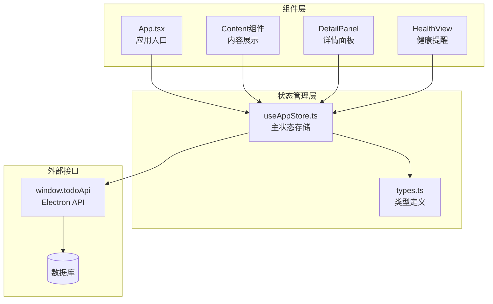

**图表来源**
- [useAppStore.ts:1-604](file://app/src/store/useAppStore.ts#L1-L604)
- [types.ts:1-278](file://app/src/types.ts#L1-L278)

**章节来源**
- [useAppStore.ts:1-604](file://app/src/store/useAppStore.ts#L1-L604)
- [types.ts:1-278](file://app/src/types.ts#L1-L278)

## 核心组件

### 主状态存储 (useAppStore)

useAppStore 是整个应用的核心状态管理器，基于 Zustand 的 create 函数构建。它包含了完整的应用状态和所有相关操作。

#### 状态结构设计

状态被精心组织为多个功能域，确保关注点分离：

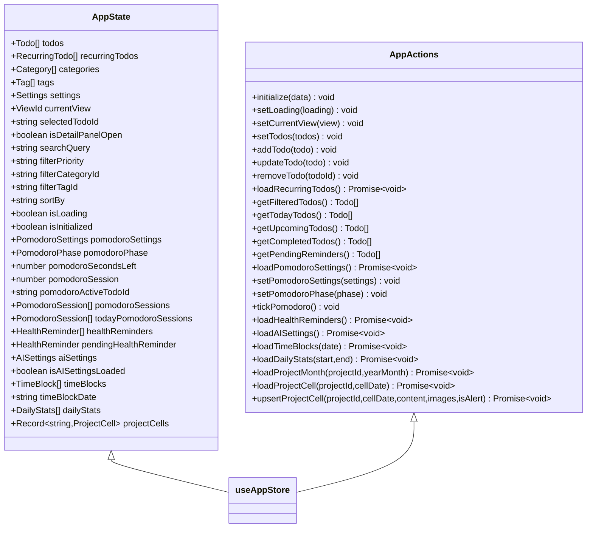

**图表来源**
- [useAppStore.ts:30-176](file://app/src/store/useAppStore.ts#L30-L176)

#### Actions 设计模式

Actions 采用函数式设计，支持同步和异步操作：

1. **同步 Actions**: 直接更新状态
2. **异步 Actions**: 处理 API 调用和数据加载
3. **计算属性**: 基于当前状态派生数据

**章节来源**
- [useAppStore.ts:82-176](file://app/src/store/useAppStore.ts#L82-L176)

## 架构概览

SnowTodo 的状态管理架构体现了现代前端应用的最佳实践：

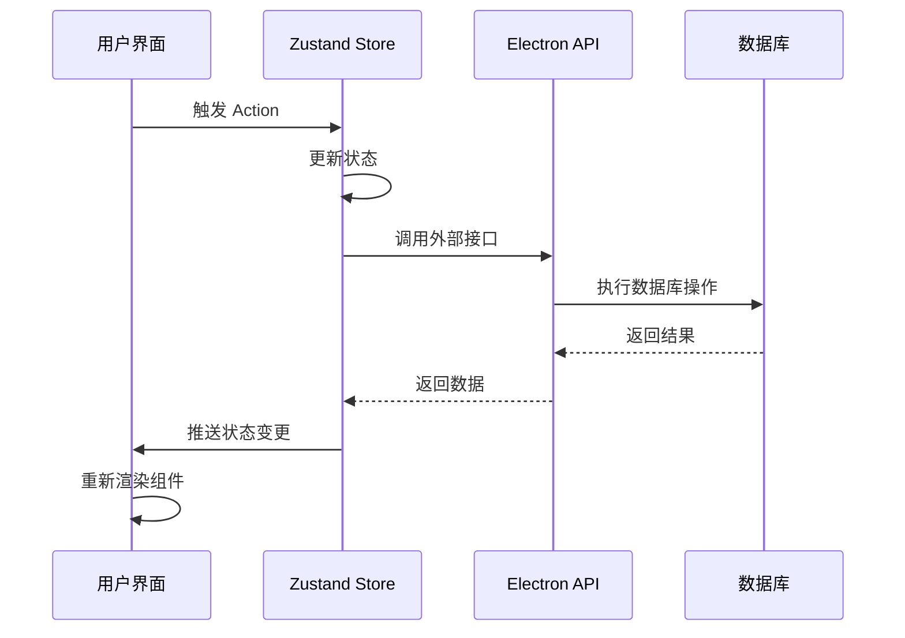

**图表来源**
- [useAppStore.ts:237-298](file://app/src/store/useAppStore.ts#L237-L298)
- [App.tsx:24-34](file://app/src/App.tsx#L24-L34)

## 详细组件分析

### 应用初始化流程

应用启动时的完整状态初始化过程：

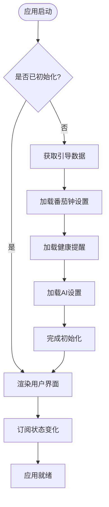

**图表来源**
- [App.tsx:24-34](file://app/src/App.tsx#L24-L34)
- [useAppStore.ts:237-246](file://app/src/store/useAppStore.ts#L237-L246)

### Todo 列表组件集成

TodoList 组件展示了如何高效地使用状态管理：

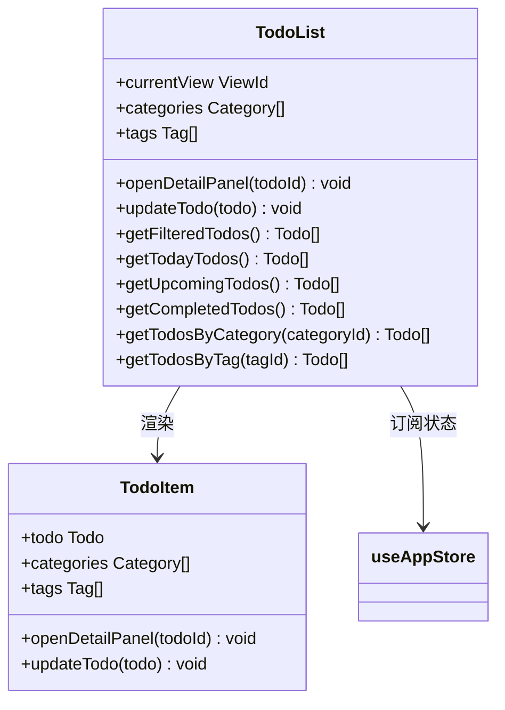

**图表来源**
- [TodoList.tsx:16-75](file://app/src/components/Content/TodoList.tsx#L16-L75)

**章节来源**
- [TodoList.tsx:16-75](file://app/src/components/Content/TodoList.tsx#L16-L75)

### 详情面板状态管理

DetailPanel 展示了复杂状态更新的处理模式：

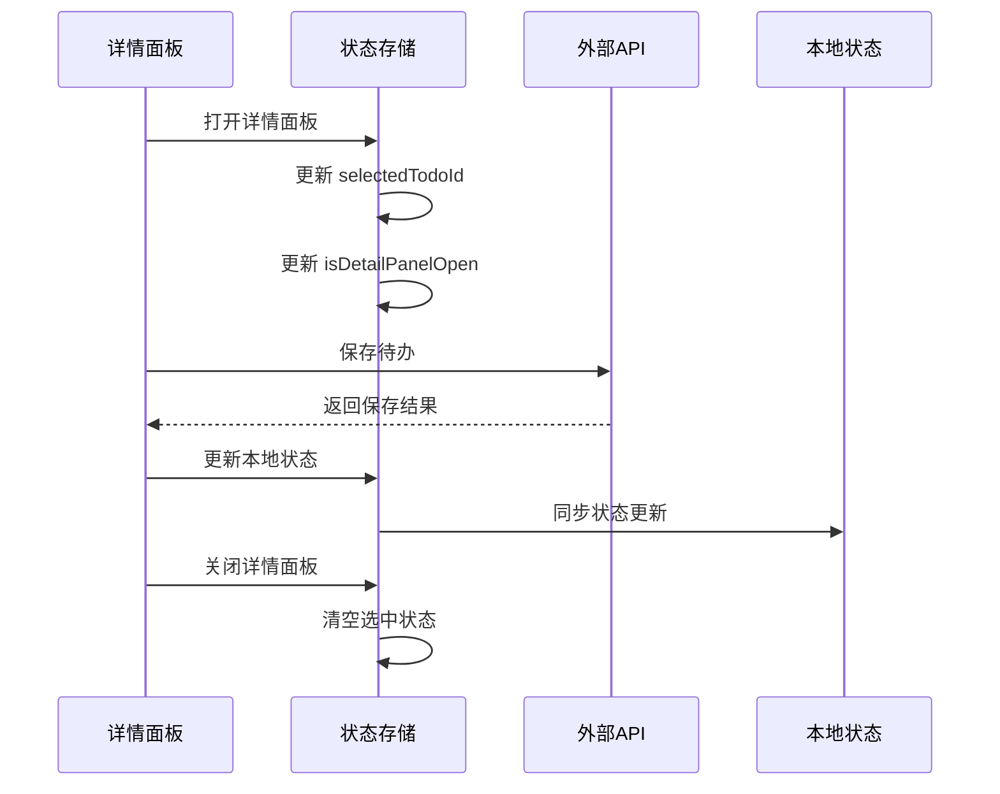

**图表来源**
- [DetailPanel.tsx:33-45](file://app/src/components/DetailPanel/DetailPanel.tsx#L33-L45)
- [DetailPanel.tsx:166-185](file://app/src/components/DetailPanel/DetailPanel.tsx#L166-L185)

**章节来源**
- [DetailPanel.tsx:33-45](file://app/src/components/DetailPanel/DetailPanel.tsx#L33-L45)
- [DetailPanel.tsx:166-185](file://app/src/components/DetailPanel/DetailPanel.tsx#L166-L185)

## 依赖关系分析

### 外部依赖

项目对 Zustand 的依赖关系：

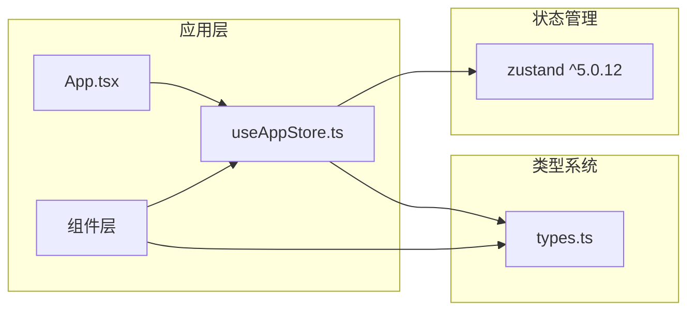

**图表来源**
- [package.json:25](file://app/package.json#L25)
- [useAppStore.ts:1-22](file://app/src/store/useAppStore.ts#L1-L22)

### 内部模块依赖

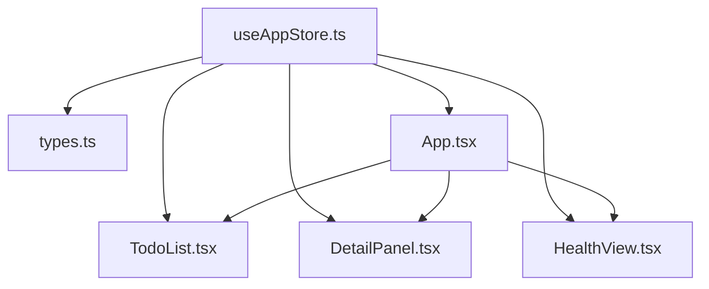

**图表来源**
- [useAppStore.ts:1-22](file://app/src/store/useAppStore.ts#L1-L22)
- [App.tsx:1-9](file://app/src/App.tsx#L1-L9)

**章节来源**
- [package.json:25](file://app/package.json#L25)
- [useAppStore.ts:1-22](file://app/src/store/useAppStore.ts#L1-L22)

## 性能考虑

### 状态分割原则

SnowTodo 遵循了良好的状态分割原则：

1. **按功能域分割**: 将不同模块的状态分离到独立的功能区域
2. **最小化订阅范围**: 组件只订阅需要的状态片段
3. **避免不必要的重渲染**: 使用精确的状态选择器

### 异步操作优化

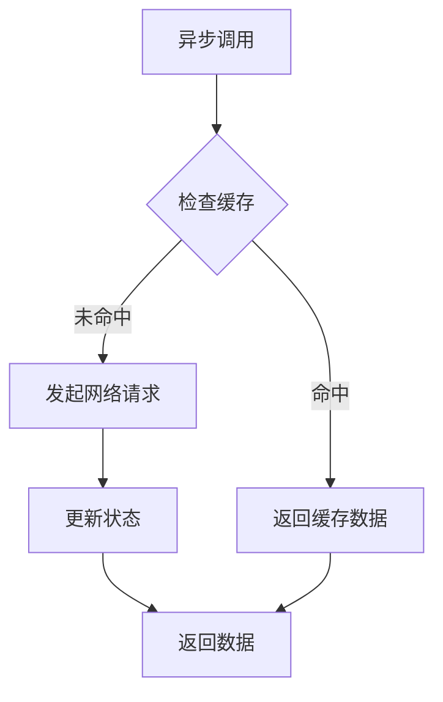

**图表来源**
- [useAppStore.ts:295-298](file://app/src/store/useAppStore.ts#L295-L298)

### 计算属性优化

计算属性通过惰性求值和缓存机制提升性能：

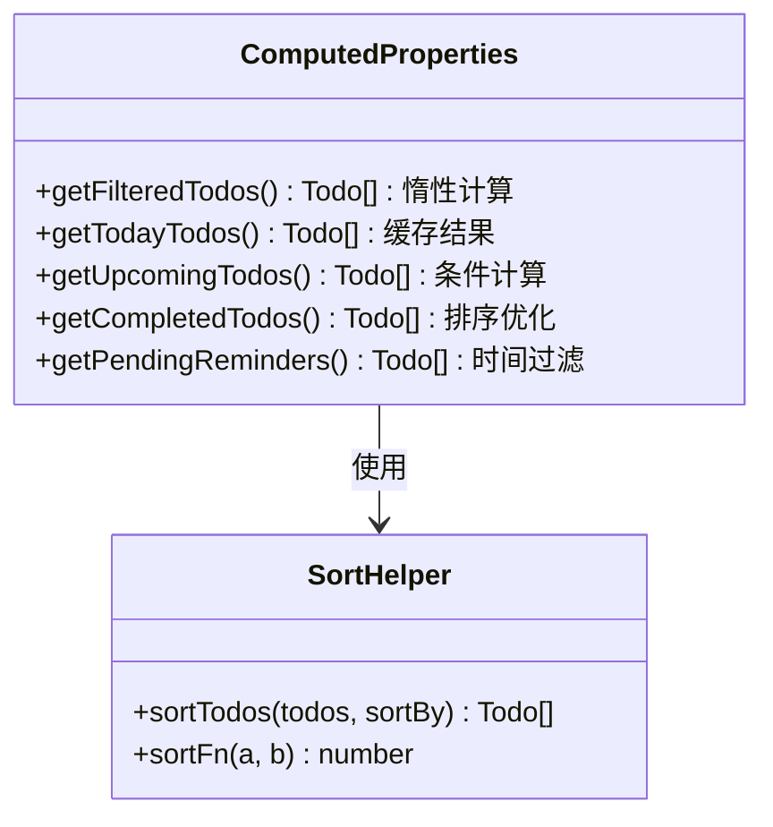

**图表来源**
- [useAppStore.ts:327-390](file://app/src/store/useAppStore.ts#L327-L390)
- [useAppStore.ts:513-536](file://app/src/store/useAppStore.ts#L513-L536)

## 故障排除指南

### 常见问题诊断

1. **状态未更新**: 检查 Action 是否正确调用 `set` 函数
2. **异步操作失败**: 验证 API 调用链和错误处理
3. **性能问题**: 分析组件订阅的状态范围和计算属性的复杂度

### 调试技巧

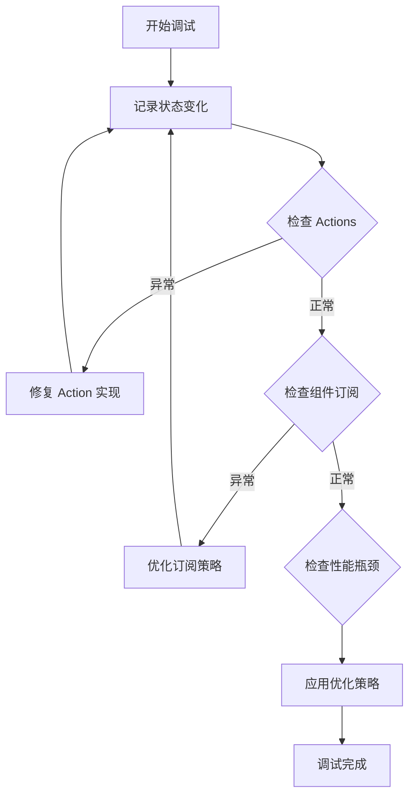

**图表来源**
- [useAppStore.ts:237-246](file://app/src/store/useAppStore.ts#L237-L246)

### 最佳实践建议

1. **类型安全**: 始终使用 TypeScript 类型定义
2. **错误边界**: 为异步操作添加适当的错误处理
3. **状态持久化**: 考虑实现状态持久化机制
4. **测试覆盖**: 为关键状态逻辑编写单元测试

**章节来源**
- [useAppStore.ts:541-603](file://app/src/store/useAppStore.ts#L541-L603)

## 结论

SnowTodo 的 Zustand 状态管理实现展现了现代前端应用的最佳实践。通过精心设计的状态结构、清晰的 Action 分类、高效的计算属性和完善的异步处理机制，该应用为新模块集成提供了优秀的参考模板。

### 关键要点总结

1. **模块化设计**: 按功能域分割状态，确保关注点分离
2. **类型安全**: 完整的 TypeScript 类型定义保证代码质量
3. **性能优化**: 计算属性和精确订阅减少不必要的重渲染
4. **异步处理**: 统一的异步操作模式提升用户体验
5. **可维护性**: 清晰的代码结构便于后续扩展和维护

这个实现为任何基于 React 和 Electron 的应用提供了可靠的状态管理基础，可以作为新模块集成的权威参考。