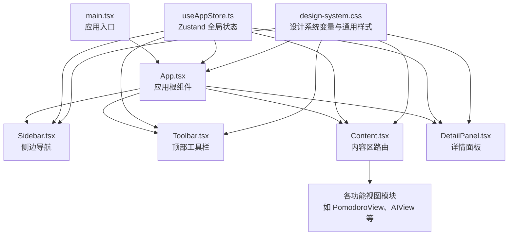
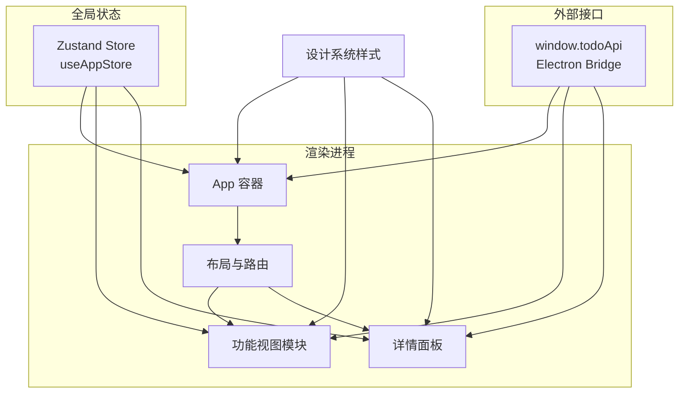
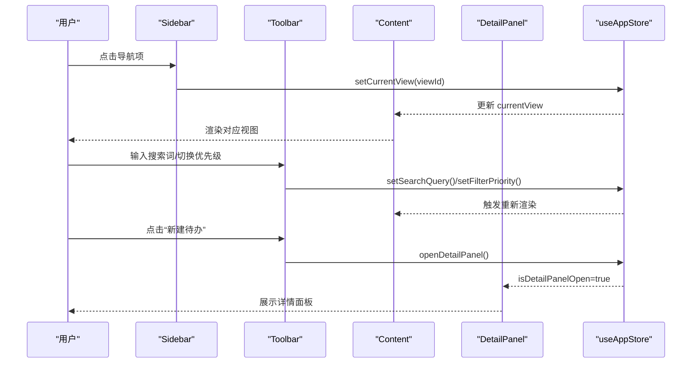
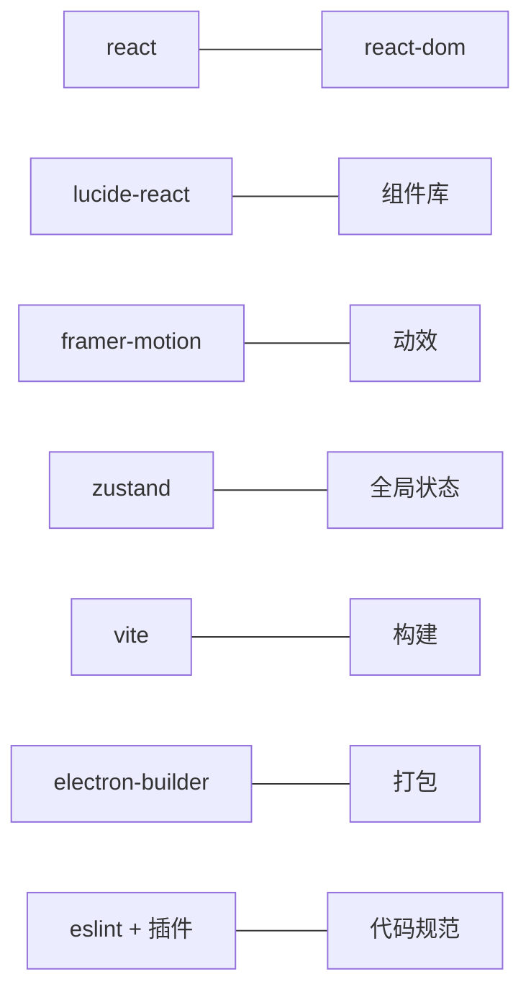

# 组件开发规范

<cite>
**本文引用的文件**
- [App.tsx](file://app/src/App.tsx)
- [components/index.ts](file://app/src/components/index.ts)
- [types.ts](file://app/src/types.ts)
- [useAppStore.ts](file://app/src/store/useAppStore.ts)
- [main.tsx](file://app/src/main.tsx)
- [Sidebar.tsx](file://app/src/components/Sidebar/Sidebar.tsx)
- [Toolbar.tsx](file://app/src/components/Toolbar/Toolbar.tsx)
- [Content.tsx](file://app/src/components/Content/Content.tsx)
- [DetailPanel.tsx](file://app/src/components/DetailPanel/DetailPanel.tsx)
- [design-system.css](file://app/src/styles/design-system.css)
- [package.json](file://app/package.json)
- [eslint.config.js](file://app/eslint.config.js)
</cite>

## 目录
1. [简介](#简介)
2. [项目结构](#项目结构)
3. [核心组件](#核心组件)
4. [架构总览](#架构总览)
5. [组件详解](#组件详解)
6. [依赖关系分析](#依赖关系分析)
7. [性能考量](#性能考量)
8. [故障排查指南](#故障排查指南)
9. [结论](#结论)
10. [附录](#附录)

## 简介
本规范面向 SnowTodo 的 React 组件开发，目标是建立统一的组件结构、类型定义、Hook 使用、样式组织与通信机制，确保新功能组件快速落地且具备良好的可维护性、可扩展性与可测试性。文档结合现有代码库中的组件与状态管理模式，给出最佳实践与模板路径，帮助开发者在不破坏既有架构的前提下高效迭代。

## 项目结构
SnowTodo 采用按功能域分层的组件组织方式：顶层容器组件负责布局与状态初始化，功能模块组件通过共享状态进行解耦协作。全局样式通过设计系统变量集中管理，保证视觉一致性与主题扩展能力。

**图表来源**
- [main.tsx:1-11](file://app/src/main.tsx#L1-L11)
- [App.tsx:11-60](file://app/src/App.tsx#L11-L60)
- [Sidebar.tsx:30-203](file://app/src/components/Sidebar/Sidebar.tsx#L30-L203)
- [Toolbar.tsx:16-78](file://app/src/components/Toolbar/Toolbar.tsx#L16-L78)
- [Content.tsx:14-65](file://app/src/components/Content/Content.tsx#L14-L65)
- [DetailPanel.tsx:33-507](file://app/src/components/DetailPanel/DetailPanel.tsx#L33-L507)
- [useAppStore.ts:181-508](file://app/src/store/useAppStore.ts#L181-L508)
- [design-system.css:1-1000](file://app/src/styles/design-system.css#L1-L1000)

**章节来源**
- [main.tsx:1-11](file://app/src/main.tsx#L1-L11)
- [App.tsx:11-60](file://app/src/App.tsx#L11-L60)
- [design-system.css:1-1000](file://app/src/styles/design-system.css#L1-L1000)

## 核心组件
- 应用根组件负责初始化与布局拼装，使用全局状态进行数据与 UI 状态管理。
- 侧边导航负责视图切换与计数徽标，依赖全局状态读取与更新当前视图。
- 工具栏负责搜索与过滤、打开详情面板等交互。
- 内容区根据当前视图动态渲染对应功能视图。
- 详情面板作为抽屉式表单，负责待办项的增删改查与图片附件处理。

**章节来源**
- [App.tsx:11-60](file://app/src/App.tsx#L11-L60)
- [Sidebar.tsx:30-203](file://app/src/components/Sidebar/Sidebar.tsx#L30-L203)
- [Toolbar.tsx:16-78](file://app/src/components/Toolbar/Toolbar.tsx#L16-L78)
- [Content.tsx:14-65](file://app/src/components/Content/Content.tsx#L14-L65)
- [DetailPanel.tsx:33-507](file://app/src/components/DetailPanel/DetailPanel.tsx#L33-L507)

## 架构总览
SnowTodo 采用“容器 + 组件”的分层架构，配合 Zustand 全局状态与 Electron 渲染进程 API，实现本地化数据持久与桌面端能力集成。组件间通信以 props 下发与全局状态为主，避免深层嵌套带来的复杂度。

**图表来源**
- [App.tsx:11-60](file://app/src/App.tsx#L11-L60)
- [useAppStore.ts:181-508](file://app/src/store/useAppStore.ts#L181-L508)
- [design-system.css:1-1000](file://app/src/styles/design-system.css#L1-L1000)

## 组件详解

### 组件结构设计与 Props 类型
- 结构建议
  - 函数式组件优先，使用 TypeScript 接口定义 Props。
  - 将 UI 与逻辑分离，尽量减少副作用，将副作用集中在 Hook 或事件回调中。
  - 使用受控组件模式，表单字段通过状态驱动，避免直接操作 DOM。
- Props 类型
  - 对于简单组件，Props 可以直接内联；对于复杂组件，建议在 types.ts 中集中声明接口，并导出复用。
  - 对于从全局状态派生的属性，优先通过 Hook 获取，而非显式传入，降低耦合。

**章节来源**
- [types.ts:168-213](file://app/src/types.ts#L168-L213)
- [types.ts:224-258](file://app/src/types.ts#L224-L258)

### Hook 使用规范
- 使用全局状态
  - 通过 useAppStore 读取状态与动作，避免在组件内部重复定义状态。
  - 对于计算属性（如过滤后的待办列表），优先在 Store 中提供派生方法，组件只消费结果。
- 事件与副作用
  - 在 useEffect 中处理初始化与订阅，注意清理副作用。
  - 对于异步调用，优先封装为 Store 动作或独立 Hook，便于测试与复用。
- 表单与本地状态
  - 对于临时草稿（Draft），在组件内使用 useState 管理，提交时再写入全局状态或调用 API。

**章节来源**
- [useAppStore.ts:327-389](file://app/src/store/useAppStore.ts#L327-L389)
- [DetailPanel.tsx:131-164](file://app/src/components/DetailPanel/DetailPanel.tsx#L131-L164)

### 样式组织方式
- 设计系统变量
  - 使用 CSS 变量统一颜色、字体、间距、阴影与层级，保证主题一致性与可扩展性。
- 组件样式
  - 每个组件配套独立的 CSS 文件，命名与组件名一致，使用语义化类名。
  - 抽屉、面板等具有过渡动画的组件，使用类名控制开合状态，避免内联样式。
- 全局样式
  - 在 main.tsx 引入全局样式，确保基础排版与滚动条样式一致。

**章节来源**
- [design-system.css:1-1000](file://app/src/styles/design-system.css#L1-L1000)
- [main.tsx:1-11](file://app/src/main.tsx#L1-L11)

### 组件间通信机制
- 父子组件传递
  - App 作为根容器，向下传递少量必要属性（如面板开关、编辑对象），其余通过全局状态管理。
- 兄弟组件通信
  - 通过全局状态协调，例如 Sidebar 切换视图，Toolbar 负责搜索与过滤，二者均依赖 useAppStore。
- 跨层级数据传递
  - 通过 useAppStore 提供的动作与状态，避免层层 props 下传。
- 事件与回调
  - 子组件通过回调触发 Store 动作，避免直接修改全局状态。

**图表来源**
- [Sidebar.tsx:30-203](file://app/src/components/Sidebar/Sidebar.tsx#L30-L203)
- [Toolbar.tsx:16-78](file://app/src/components/Toolbar/Toolbar.tsx#L16-L78)
- [Content.tsx:14-65](file://app/src/components/Content/Content.tsx#L14-L65)
- [DetailPanel.tsx:33-507](file://app/src/components/DetailPanel/DetailPanel.tsx#L33-L507)
- [useAppStore.ts:253-311](file://app/src/store/useAppStore.ts#L253-L311)

### 最佳实践清单
- 组件职责单一，避免过度渲染
  - 使用 useMemo/useCallback 缓存昂贵计算与回调，减少重渲染。
- 错误边界与降级
  - 对异步加载与 API 调用增加错误提示与重试机制，避免崩溃扩散。
- 可访问性
  - 为交互元素提供键盘可达性，为图标提供替代文本，确保颜色对比度满足可读性要求。
- 性能优化
  - 将大型列表虚拟化，延迟加载非首屏内容，避免在渲染阶段执行重任务。
- 可测试性
  - 将副作用与状态逻辑抽离至 Hook 或 Store 动作，便于单元测试与模拟。

### 代码示例与模板
以下为创建新功能组件的推荐步骤与模板路径（仅提供路径，不展示具体代码）：
- 新建组件文件
  - [组件模板路径](file://app/src/components/Content/TodoList.tsx)
- 导出组件
  - [组件导出路径](file://app/src/components/index.ts)
- 类型定义
  - [类型定义路径](file://app/src/types.ts)
- 全局状态动作
  - [状态动作路径](file://app/src/store/useAppStore.ts)
- 样式文件
  - [样式模板路径](file://app/src/styles/design-system.css)

**章节来源**
- [components/index.ts:1-10](file://app/src/components/index.ts#L1-L10)
- [types.ts:168-213](file://app/src/types.ts#L168-L213)
- [useAppStore.ts:82-176](file://app/src/store/useAppStore.ts#L82-L176)

## 依赖关系分析
- 外部依赖
  - React 生态：React、React DOM、lucide-react（图标）、framer-motion（动效）、clsx（条件类名）。
  - 状态管理：zustand（轻量全局状态）。
  - 构建与打包：Vite、electron-builder。
- ESLint 配置
  - 启用 React Hooks 与 React Refresh 规则，确保 Hook 使用正确性与开发体验。

**图表来源**
- [package.json:16-49](file://app/package.json#L16-L49)
- [eslint.config.js:1-24](file://app/eslint.config.js#L1-24)

**章节来源**
- [package.json:16-49](file://app/package.json#L16-L49)
- [eslint.config.js:1-24](file://app/eslint.config.js#L1-24)

## 性能考量
- 渲染优化
  - 将高频更新的 UI 与稳定内容拆分，使用 memo 包裹纯展示组件。
  - 对列表项使用唯一 key，避免不必要的重排。
- 状态粒度
  - 将细粒度状态下沉至局部组件，避免全局状态频繁变更导致大面积重渲染。
- 异步与缓存
  - 对远程数据请求进行去抖与缓存，减少重复网络请求。
- 图片与资源
  - 图片上传采用异步处理与本地临时存储，提交后再同步到服务端。

[本节为通用指导，无需列出章节来源]

## 故障排查指南
- 初始化失败
  - 检查 App 是否在首次渲染时调用初始化流程，并等待 window.todoApi 返回数据。
- 视图不更新
  - 确认当前视图是否通过 useAppStore 更新，以及 Content 是否根据 currentView 渲染对应视图。
- 详情面板无法关闭
  - 检查 isDetailPanelOpen 与 closeDetailPanel 的联动，确保事件冒泡未被阻止。
- 表单校验与保存
  - 确保草稿对象满足必填项，保存成功后再更新全局状态。

**章节来源**
- [App.tsx:24-34](file://app/src/App.tsx#L24-L34)
- [Content.tsx:14-65](file://app/src/components/Content/Content.tsx#L14-L65)
- [DetailPanel.tsx:166-185](file://app/src/components/DetailPanel/DetailPanel.tsx#L166-L185)

## 结论
通过统一的组件结构、明确的 Props 类型、规范的 Hook 使用与全局状态管理，SnowTodo 能够在保持良好可维护性的同时快速迭代新功能。建议在新增组件时遵循本文规范，优先使用现有类型与状态动作，确保风格一致与易于测试。

## 附录
- 快速检查清单
  - 是否使用受控组件与草稿状态？
  - 是否通过 useAppStore 读取/更新状态？
  - 是否提供必要的类型定义并在 types.ts 中集中管理？
  - 是否遵循设计系统变量与组件样式规范？
  - 是否考虑可访问性与键盘操作？