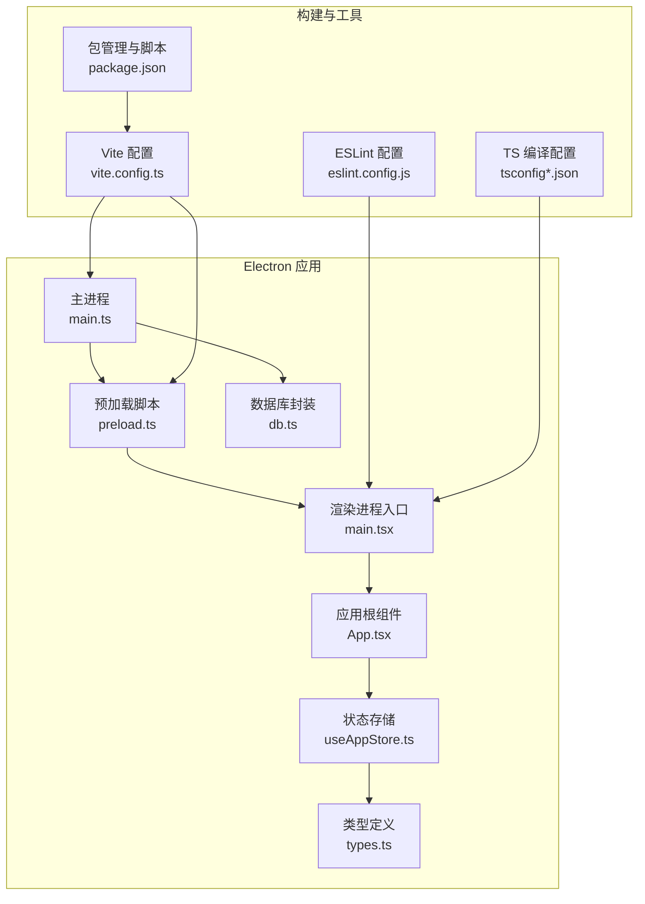
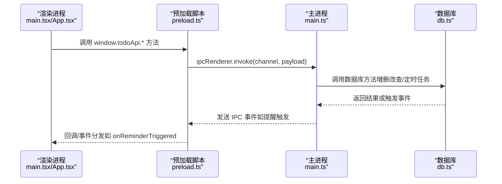
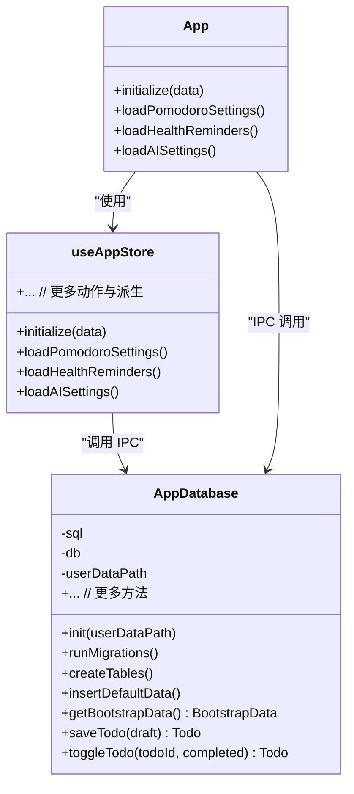
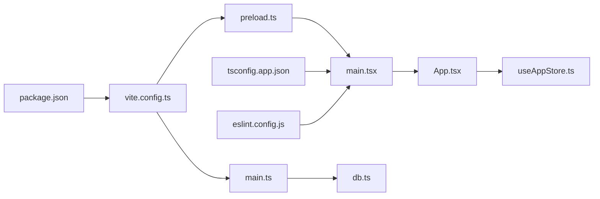

# 调试与测试

<cite>
**本文引用的文件**
- [package.json](file://app/package.json)
- [vite.config.ts](file://app/vite.config.ts)
- [main.ts](file://app/electron/main.ts)
- [preload.ts](file://app/electron/preload.ts)
- [db.ts](file://app/electron/db.ts)
- [main.tsx](file://app/src/main.tsx)
- [App.tsx](file://app/src/App.tsx)
- [useAppStore.ts](file://app/src/store/useAppStore.ts)
- [types.ts](file://app/src/types.ts)
- [eslint.config.js](file://app/eslint.config.js)
- [tsconfig.app.json](file://app/tsconfig.app.json)
- [tsconfig.json](file://app/tsconfig.json)
- [Sidebar.tsx](file://app/src/components/Sidebar/Sidebar.tsx)
- [Toolbar.tsx](file://app/src/components/Toolbar/Toolbar.tsx)
- [Content.tsx](file://app/src/components/Content/Content.tsx)
</cite>

## 目录
1. [简介](#简介)
2. [项目结构](#项目结构)
3. [核心组件](#核心组件)
4. [架构总览](#架构总览)
5. [详细组件分析](#详细组件分析)
6. [依赖分析](#依赖分析)
7. [性能考虑](#性能考虑)
8. [故障排除指南](#故障排除指南)
9. [结论](#结论)
10. [附录](#附录)

## 简介
本指南面向 SnowTodo 项目，提供从开发环境到生产运行的完整调试与测试方法。内容覆盖：
- Electron 主进程与渲染进程的调试技巧
- 浏览器开发者工具与 React/Vue 工具链的使用
- 单元测试与集成测试的编写与配置建议
- 性能测试与内存泄漏检测策略
- 常见问题排查与日志定位方法
- 测试覆盖率监控与提升策略

## 项目结构
SnowTodo 采用 Vite + Electron 的混合架构，前端基于 React + Zustand 状态管理，数据库使用 sql.js（WebAssembly）。Vite 插件负责 Electron 主进程与预加载脚本的打包。

**图表来源**
- [main.ts:1-391](file://app/electron/main.ts#L1-L391)
- [preload.ts:1-117](file://app/electron/preload.ts#L1-L117)
- [main.tsx:1-11](file://app/src/main.tsx#L1-L11)
- [App.tsx:1-60](file://app/src/App.tsx#L1-L60)
- [useAppStore.ts:1-604](file://app/src/store/useAppStore.ts#L1-L604)
- [types.ts:1-278](file://app/src/types.ts#L1-L278)
- [db.ts:1-800](file://app/electron/db.ts#L1-L800)
- [vite.config.ts:1-37](file://app/vite.config.ts#L1-L37)
- [package.json:1-100](file://app/package.json#L1-L100)
- [eslint.config.js:1-24](file://app/eslint.config.js#L1-L24)
- [tsconfig.app.json:1-26](file://app/tsconfig.app.json#L1-L26)
- [tsconfig.json:1-8](file://app/tsconfig.json#L1-L8)

**章节来源**
- [vite.config.ts:1-37](file://app/vite.config.ts#L1-L37)
- [package.json:1-100](file://app/package.json#L1-L100)
- [tsconfig.json:1-8](file://app/tsconfig.json#L1-L8)
- [tsconfig.app.json:1-26](file://app/tsconfig.app.json#L1-L26)
- [eslint.config.js:1-24](file://app/eslint.config.js#L1-L24)

## 核心组件
- 主进程：负责窗口生命周期、托盘、全局快捷键、定时提醒、IPC 注册与数据导出导入等。
- 预加载脚本：通过 contextBridge 暴露受控 API 给渲染进程，实现安全的 IPC 调用。
- 渲染进程：React 应用，使用 Zustand 管理多模块状态（待办、番茄钟、健康提醒、AI、时间块、仪表盘、项目）。
- 数据库：基于 sql.js 的本地嵌入式数据库，支持迁移、索引与默认数据初始化。

**章节来源**
- [main.ts:1-391](file://app/electron/main.ts#L1-L391)
- [preload.ts:1-117](file://app/electron/preload.ts#L1-L117)
- [useAppStore.ts:1-604](file://app/src/store/useAppStore.ts#L1-L604)
- [db.ts:1-800](file://app/electron/db.ts#L1-L800)

## 架构总览
下图展示了主进程、预加载脚本与渲染进程之间的交互关系，以及 IPC 通道与数据库访问路径。

**图表来源**
- [main.ts:227-358](file://app/electron/main.ts#L227-L358)
- [preload.ts:18-116](file://app/electron/preload.ts#L18-L116)
- [db.ts:676-796](file://app/electron/db.ts#L676-L796)

## 详细组件分析

### 主进程调试要点
- 启动参数与开发模式：主进程根据环境变量判断是否启用开发服务器地址，便于热重载与远程调试。
- 定时任务：提醒循环与健康提醒循环分别以固定间隔扫描数据库并触发通知或窗口聚焦；异常会被捕获并记录。
- 托盘与全局快捷键：托盘菜单控制窗口显示/隐藏；全局快捷键用于切换番茄钟状态。
- IPC 接口：集中注册各类业务 IPC（待办、长期待办、番茄钟、健康提醒、AI 设置、时间块、统计数据、图片、项目单元格），便于渲染进程调用。

调试建议
- 使用环境变量开启开发服务器地址，确保渲染进程连接到 Vite Dev Server。
- 在定时任务函数内增加边界条件与异常日志，避免静默失败。
- 托盘与快捷键冲突排查：先注销旧快捷键再注册新配置，注意平台差异。

**章节来源**
- [main.ts:9-52](file://app/electron/main.ts#L9-L52)
- [main.ts:120-177](file://app/electron/main.ts#L120-L177)
- [main.ts:179-193](file://app/electron/main.ts#L179-L193)
- [main.ts:227-358](file://app/electron/main.ts#L227-L358)

### 预加载脚本与 IPC 桥接
- 通过 contextBridge 将有限的 API 暴露给渲染进程，避免直接暴露 Node.js 能力。
- 对事件监听器返回解绑函数，防止内存泄漏。
- 暴露的 API 覆盖基础数据、提醒、长期待办、番茄钟、健康提醒、AI、时间块、统计、图片、项目等模块。

调试建议
- 在渲染进程侧对每个 API 调用添加超时与错误回调。
- 对高频事件（如提醒触发）进行去抖/节流处理，避免 UI 抖动。

**章节来源**
- [preload.ts:18-116](file://app/electron/preload.ts#L18-L116)

### 渲染进程与状态管理
- React 应用入口创建根节点并渲染 App。
- App 组件在首次初始化时通过 window.todoApi 获取引导数据并填充状态。
- Zustand store 管理多模块状态与派生计算，提供异步加载与本地更新方法。

调试建议
- 在 App 初始化阶段增加加载状态与错误提示。
- 对 store 中的异步方法（如加载番茄钟设置、健康提醒、AI 设置）增加重试与降级逻辑。

**章节来源**
- [main.tsx:1-11](file://app/src/main.tsx#L1-L11)
- [App.tsx:24-34](file://app/src/App.tsx#L24-L34)
- [useAppStore.ts:237-246](file://app/src/store/useAppStore.ts#L237-L246)
- [useAppStore.ts:394-420](file://app/src/store/useAppStore.ts#L394-L420)
- [useAppStore.ts:425-438](file://app/src/store/useAppStore.ts#L425-L438)
- [useAppStore.ts:443-447](file://app/src/store/useAppStore.ts#L443-L447)

### 数据库层（sql.js）
- 初始化时根据是否打包决定 wasm 文件位置，并加载数据库文件或创建表结构。
- 支持迁移：新增列、表与索引，插入默认数据（健康提醒、主题、AI 设置、番茄钟设置）。
- 提供 CRUD 与聚合查询接口，导出/导入快照。

调试建议
- 在迁移过程中捕获异常并记录具体错误，避免破坏现有数据。
- 导出/导入流程中增加校验与回滚机制。

**章节来源**
- [db.ts:60-90](file://app/electron/db.ts#L60-L90)
- [db.ts:92-297](file://app/electron/db.ts#L92-L297)
- [db.ts:299-504](file://app/electron/db.ts#L299-L504)
- [db.ts:676-796](file://app/electron/db.ts#L676-L796)

### 类与关系图（代码级）

**图表来源**
- [db.ts:55-800](file://app/electron/db.ts#L55-L800)
- [App.tsx:11-34](file://app/src/App.tsx#L11-L34)
- [useAppStore.ts:181-604](file://app/src/store/useAppStore.ts#L181-L604)

## 依赖分析
- 构建与打包：Vite + vite-plugin-electron + vite-plugin-electron-renderer，主进程与预加载脚本独立输出目录。
- 语言与类型：TypeScript（tsconfig.app.json 配置 JSX、bundler 模式）。
- 代码质量：ESLint（tseslint、react-hooks、react-refresh）。
- 运行时：Electron（主进程）、React（渲染进程）、Zustand（状态）、sql.js（数据库）。

**图表来源**
- [vite.config.ts:1-37](file://app/vite.config.ts#L1-L37)
- [main.ts:1-391](file://app/electron/main.ts#L1-L391)
- [preload.ts:1-117](file://app/electron/preload.ts#L1-L117)
- [main.tsx:1-11](file://app/src/main.tsx#L1-L11)
- [App.tsx:1-60](file://app/src/App.tsx#L1-L60)
- [useAppStore.ts:1-604](file://app/src/store/useAppStore.ts#L1-L604)
- [db.ts:1-800](file://app/electron/db.ts#L1-L800)
- [tsconfig.app.json:1-26](file://app/tsconfig.app.json#L1-L26)
- [eslint.config.js:1-24](file://app/eslint.config.js#L1-L24)
- [package.json:1-100](file://app/package.json#L1-L100)

**章节来源**
- [vite.config.ts:1-37](file://app/vite.config.ts#L1-L37)
- [tsconfig.app.json:1-26](file://app/tsconfig.app.json#L1-L26)
- [eslint.config.js:1-24](file://app/eslint.config.js#L1-L24)
- [package.json:1-100](file://app/package.json#L1-L100)

## 性能考虑
- 渲染进程性能
  - 避免不必要的重渲染：合理拆分组件、使用 memo 化与选择器。
  - 控制状态粒度：将高频更新与低频更新分离，减少全局状态波动。
  - 图片与媒体：对大图进行懒加载与尺寸压缩。
- 主进程与 IPC
  - 减少高频 IPC 调用：合并请求或使用批量接口。
  - 异步处理：将耗时操作放入 Worker 或后台线程。
- 数据库
  - 为热点查询建立索引（已迁移中创建索引）。
  - 批量写入：事务包裹多次 INSERT/UPDATE。
- 打包与资源
  - 启用 asar 与产物最小化，避免多余资源打包。

[本节为通用指导，无需特定文件引用]

## 故障排除指南
- 开发环境无法热更新
  - 确认主进程使用开发服务器地址（环境变量），渲染进程连接到 Vite Dev Server。
  - 检查 Vite 插件配置与端口占用。
- 托盘与窗口行为异常
  - 关闭事件改为隐藏而非退出，macOS 平台需遵循系统规范。
  - 全局快捷键注册失败时检查权限与冲突。
- IPC 调用无响应
  - 在预加载脚本中为每个 invoke 添加超时与错误回调。
  - 在主进程的 ipcMain.handle 中捕获异常并记录堆栈。
- 数据库初始化失败
  - 检查 sql-wasm.wasm 路径与权限，确保可读取。
  - 迁移失败时逐条执行并记录错误，必要时回滚。
- 日志定位
  - 主进程使用 console.error 记录定时任务与 IPC 错误。
  - 渲染进程在 store 异步方法中增加错误上报与降级提示。

**章节来源**
- [main.ts:9-52](file://app/electron/main.ts#L9-L52)
- [main.ts:371-381](file://app/electron/main.ts#L371-L381)
- [main.ts:120-177](file://app/electron/main.ts#L120-L177)
- [main.ts:227-358](file://app/electron/main.ts#L227-L358)
- [preload.ts:18-116](file://app/electron/preload.ts#L18-L116)
- [db.ts:64-90](file://app/electron/db.ts#L64-L90)
- [db.ts:92-297](file://app/electron/db.ts#L92-L297)

## 结论
通过明确的主/渲染进程职责划分、严格的 IPC 桥接与完善的数据库迁移机制，SnowTodo 在开发与调试上具备良好的可维护性。建议在后续迭代中补充单元测试与集成测试，完善性能监控与覆盖率统计，持续优化用户体验与稳定性。

[本节为总结，无需特定文件引用]

## 附录

### 开发环境调试方法
- Electron 主进程
  - 使用 --inspect-brk 在启动时挂起断点，附加到主进程。
  - 在主进程入口处设置断点，观察窗口创建、托盘与定时任务初始化。
- 渲染进程
  - 在 Vite Dev Server 下运行，使用浏览器开发者工具的 Elements/Console/Network/Timeline。
  - React DevTools 用于组件树与状态检查；Zustand DevTools 可选，便于追踪状态变化。
- 预加载脚本
  - 通过 Console 查看 IPC 调用与事件回调是否正常触发。

[本节为通用指导，无需特定文件引用]

### 浏览器开发者工具与扩展
- React DevTools
  - 安装扩展后，在页面切换到 React 标签，查看组件层级、Props 与 Hooks 状态。
- Vue DevTools
  - 若存在 Vue 组件，可在对应页面启用 Vue DevTools 标签页进行调试。
- 网络与性能
  - Network 面板观察 IPC 请求与响应；Performance 面板记录帧率与长任务。
  - Memory 面板监控堆内存增长，识别潜在泄漏。

[本节为通用指导，无需特定文件引用]

### 单元测试与集成测试
- 测试框架选择
  - 建议使用 Vitest（与 Vite 生态契合）或 Jest（社区成熟）。
- 测试范围
  - 单元测试：纯函数、工具方法、store 动作与派生计算。
  - 集成测试：IPC 通信、数据库操作、定时任务触发。
- 配置建议
  - 使用 Vite 的测试配置，模拟 Electron 环境与 preload API。
  - 为 sql.js 提供内存数据库模拟，避免真实文件 IO。
- 覆盖率
  - 使用覆盖率报告（如 Istanbul/Vitest）监控语句、分支、函数与行覆盖率。
  - 设定阈值并持续提升，优先补齐关键路径与异常分支。

[本节为通用指导，无需特定文件引用]

### 性能测试与内存泄漏检测
- 性能测试
  - 使用 Lighthouse 或 Chrome Performance 面板评估首屏与交互延迟。
  - 对长列表渲染进行虚拟化，减少 DOM 节点数量。
- 内存泄漏
  - 使用 Performance 面板录制内存快照，对比多次 GC 后的对象保留。
  - 检查事件监听器是否正确解绑，避免闭包持有大对象。
  - 对高频 IPC 回调进行节流/去抖。

[本节为通用指导，无需特定文件引用]

### 测试覆盖率监控与提升策略
- 监控
  - 在 CI 中启用覆盖率报告，失败阈值触发阻断。
- 提升策略
  - 优先覆盖核心业务逻辑与错误路径。
  - 对 store 的派生计算与 IPC 调用进行重点测试。
  - 使用快照测试验证 UI 输出一致性。

[本节为通用指导，无需特定文件引用]

### 日志系统与问题定位
- 主进程日志
  - 在定时任务与 IPC 处增加结构化日志，包含时间戳、模块名与上下文信息。
- 渲染进程日志
  - 在 store 异步方法中记录请求参数、响应与错误堆栈。
- 日志收集
  - 将日志输出到文件或外部服务，便于离线分析。
- 快速定位
  - 使用关键词过滤（如 “Reminder loop error”、“DB Migration error”）快速定位问题。

**章节来源**
- [main.ts:132-134](file://app/electron/main.ts#L132-L134)
- [main.ts:170-172](file://app/electron/main.ts#L170-L172)
- [db.ts:102-104](file://app/electron/db.ts#L102-L104)
- [db.ts:192-195](file://app/electron/db.ts#L192-L195)