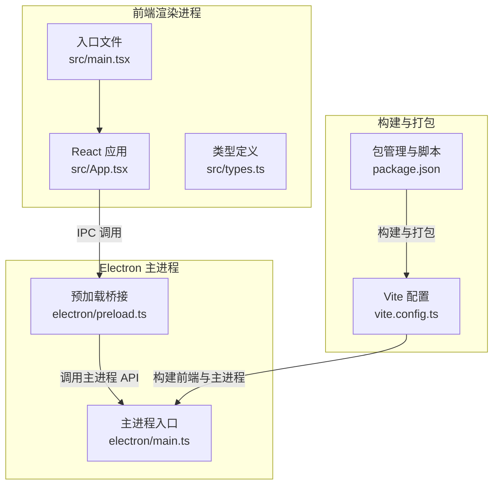
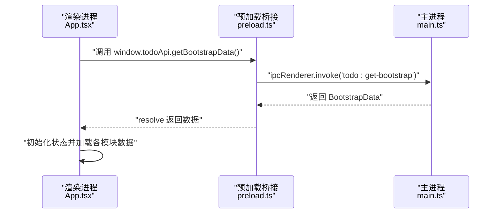
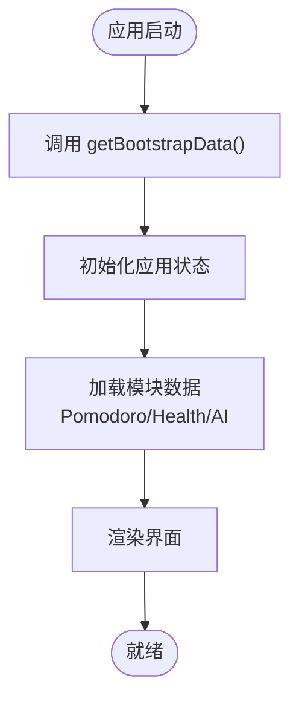
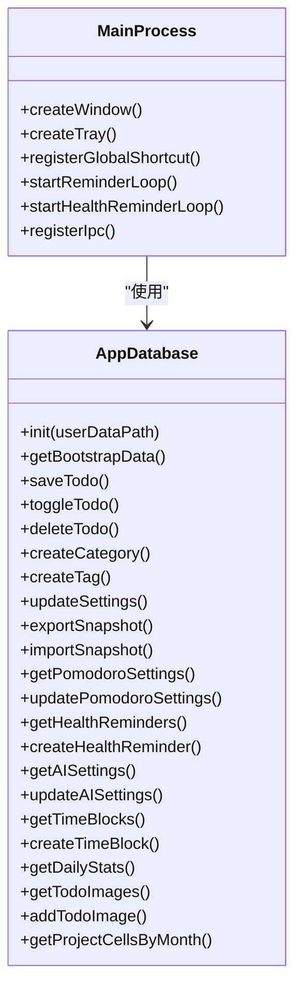
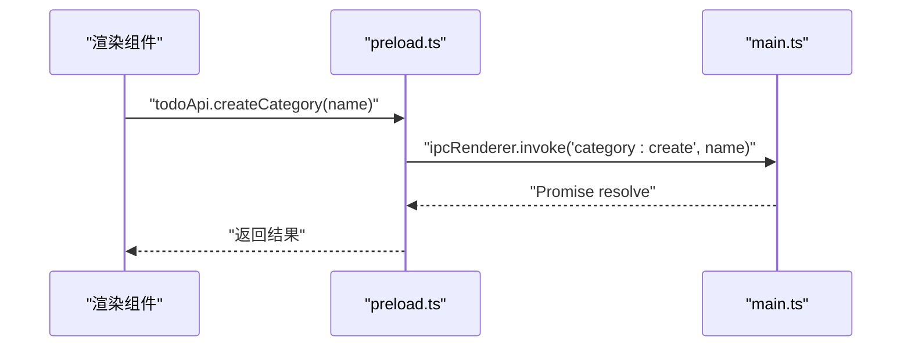
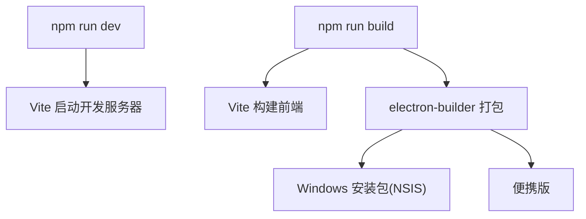
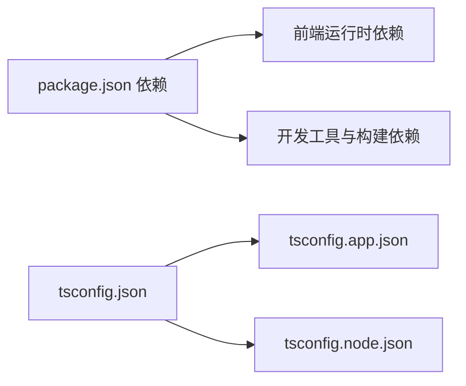

# 快速开始

<cite>
**本文引用的文件**
- [package.json](file://app/package.json)
- [vite.config.ts](file://app/vite.config.ts)
- [main.ts](file://app/electron/main.ts)
- [preload.ts](file://app/electron/preload.ts)
- [types.ts](file://app/src/types.ts)
- [App.tsx](file://app/src/App.tsx)
- [main.tsx](file://app/src/main.tsx)
- [eslint.config.js](file://app/eslint.config.js)
- [tsconfig.json](file://app/tsconfig.json)
- [tsconfig.app.json](file://app/tsconfig.app.json)
- [tsconfig.node.json](file://app/tsconfig.node.json)
- [installer.nsh](file://app/scripts/installer.nsh)
</cite>

## 目录
1. [简介](#简介)
2. [项目结构](#项目结构)
3. [核心组件](#核心-components)
4. [架构总览](#架构总览)
5. [详细组件分析](#详细组件分析)
6. [依赖关系分析](#依赖关系分析)
7. [性能与构建特性](#性能与构建特性)
8. [开发命令与工作流](#开发命令与工作流)
9. [常见问题排查](#常见问题排查)
10. [基本使用示例](#基本使用示例)
11. [结论](#结论)

## 简介
SnowTodo 是一款基于 React + TypeScript + Vite 的本地待办应用，通过 Electron 将 Web 应用打包为桌面应用。它支持待办事项管理、健康提醒、番茄钟、项目看板、AI 设置、图片附件等多种功能，并通过 IPC 在渲染进程与主进程之间进行数据交互。

## 项目结构
项目采用“前端 + Electron 主进程 + 预加载桥接”的分层组织：
- 前端源码位于 app/src，包含 React 组件、状态管理、样式与类型定义
- Electron 主进程位于 app/electron，负责窗口、托盘、全局快捷键、IPC、定时提醒等
- 构建与打包配置位于 app/vite.config.ts、app/package.json 以及 electron-builder 配置
- 类型定义集中在 app/src/types.ts，统一描述待办、健康提醒、番茄钟、时间块等业务模型

图表来源
- [main.ts:1-52](file://app/electron/main.ts#L1-L52)
- [preload.ts:1-117](file://app/electron/preload.ts#L1-L117)
- [App.tsx:1-60](file://app/src/App.tsx#L1-L60)
- [main.tsx:1-11](file://app/src/main.tsx#L1-L11)
- [vite.config.ts:1-37](file://app/vite.config.ts#L1-L37)
- [package.json:1-100](file://app/package.json#L1-L100)

章节来源
- [package.json:1-100](file://app/package.json#L1-L100)
- [vite.config.ts:1-37](file://app/vite.config.ts#L1-L37)
- [main.ts:1-52](file://app/electron/main.ts#L1-L52)
- [preload.ts:1-117](file://app/electron/preload.ts#L1-L117)
- [types.ts:1-278](file://app/src/types.ts#L1-L278)
- [App.tsx:1-60](file://app/src/App.tsx#L1-L60)
- [main.tsx:1-11](file://app/src/main.tsx#L1-L11)

## 核心组件
- 渲染进程应用：React + Zustand 状态管理，通过 window.todoApi 与主进程通信
- 主进程：创建窗口、托盘、全局快捷键、定时提醒循环、数据导出导入、IPC 处理
- 预加载桥接：通过 contextBridge 暴露安全的 API 到渲染进程
- 构建工具：Vite + vite-plugin-electron，配合 electron-builder 打包

章节来源
- [App.tsx:1-60](file://app/src/App.tsx#L1-L60)
- [main.ts:1-383](file://app/electron/main.ts#L1-L383)
- [preload.ts:1-117](file://app/electron/preload.ts#L1-L117)

## 架构总览
下图展示了从启动到 IPC 通信的关键流程：

图表来源
- [App.tsx:24-34](file://app/src/App.tsx#L24-L34)
- [preload.ts:18-21](file://app/electron/preload.ts#L18-L21)
- [main.ts:220-220](file://app/electron/main.ts#L220-L220)

## 详细组件分析

### 渲染进程与状态管理
- 应用入口在 main.tsx 中挂载根组件 App.tsx
- App.tsx 通过 window.todoApi.getBootstrapData() 获取初始数据，初始化状态并加载番茄钟、健康提醒、AI 设置等模块

图表来源
- [main.tsx:1-11](file://app/src/main.tsx#L1-L11)
- [App.tsx:24-34](file://app/src/App.tsx#L24-L34)

章节来源
- [main.tsx:1-11](file://app/src/main.tsx#L1-L11)
- [App.tsx:1-60](file://app/src/App.tsx#L1-L60)

### 主进程与 IPC 服务
- 主进程负责创建窗口、托盘、注册全局快捷键、启动定时提醒循环
- 通过 ipcMain.handle 注册大量 IPC 方法，覆盖待办 CRUD、分类标签、设置、数据导入导出、番茄钟、健康提醒、AI 设置、时间块、统计数据、图片附件、项目看板等

图表来源
- [main.ts:1-383](file://app/electron/main.ts#L1-L383)
- [types.ts:161-213](file://app/src/types.ts#L161-L213)

章节来源
- [main.ts:1-383](file://app/electron/main.ts#L1-L383)
- [types.ts:1-278](file://app/src/types.ts#L1-L278)

### 预加载桥接与安全 IPC
- 预加载通过 contextBridge.exposeInMainWorld 暴露 todoApi，封装所有 IPC 调用，避免直接暴露 Node.js API
- 提供待办、分类标签、设置、数据导入导出、窗口控制、提醒事件、番茄钟、健康提醒、AI 设置、时间块、统计数据、图片附件、项目看板等方法

图表来源
- [preload.ts:18-31](file://app/electron/preload.ts#L18-L31)
- [main.ts:225-225](file://app/electron/main.ts#L225-L225)

章节来源
- [preload.ts:1-117](file://app/electron/preload.ts#L1-L117)
- [main.ts:219-350](file://app/electron/main.ts#L219-L350)

### 构建与打包配置
- Vite 配置启用 vite-plugin-electron，分别构建主进程与预加载脚本，并输出到 dist-electron，前端资源输出到 dist
- package.json 定义了开发、构建、预览、类型检查、代码检查等脚本；electron-builder 用于打包 Windows 安装包（NSIS）与便携版

图表来源
- [vite.config.ts:6-36](file://app/vite.config.ts#L6-L36)
- [package.json:9-14](file://app/package.json#L9-L14)
- [package.json:50-98](file://app/package.json#L50-L98)

章节来源
- [vite.config.ts:1-37](file://app/vite.config.ts#L1-L37)
- [package.json:1-100](file://app/package.json#L1-L100)

## 依赖关系分析
- 前端依赖：React、React DOM、React Router、Zustand、Framer Motion、Lucide React、Day.js、SQL.js
- 开发依赖：Vite、@vitejs/plugin-react、electron、electron-builder、typescript、eslint、vite-plugin-electron 系列插件
- 类型配置：tsconfig.json 引用 tsconfig.app.json 与 tsconfig.node.json，分别约束前端与 Electron 相关代码的编译选项

图表来源
- [package.json:16-49](file://app/package.json#L16-L49)
- [tsconfig.json:1-8](file://app/tsconfig.json#L1-L8)
- [tsconfig.app.json:1-26](file://app/tsconfig.app.json#L1-L26)
- [tsconfig.node.json:1-25](file://app/tsconfig.node.json#L1-L25)

章节来源
- [package.json:1-100](file://app/package.json#L1-L100)
- [tsconfig.json:1-8](file://app/tsconfig.json#L1-L8)
- [tsconfig.app.json:1-26](file://app/tsconfig.app.json#L1-L26)
- [tsconfig.node.json:1-25](file://app/tsconfig.node.json#L1-L25)

## 性能与构建特性
- Vite 开发服务器提供快速热更新与按需模块解析
- electron-builder 使用 asar 打包，减少文件体积与提升加载速度
- Windows 安装包集成 VC++ 2015-2022 Redistributable 下载安装逻辑，确保运行环境

章节来源
- [vite.config.ts:1-37](file://app/vite.config.ts#L1-L37)
- [package.json:74-98](file://app/package.json#L74-L98)
- [installer.nsh:7-14](file://app/scripts/installer.nsh#L7-L14)

## 开发命令与工作流
- 开发模式：npm run dev
  - 启动 Vite 开发服务器，Electron 主进程监听开发服务器地址，实现热更新
- 生产构建：npm run build
  - Vite 构建前端资源，随后 electron-builder 打包为可执行程序或安装包
- 预览构建：npm run preview
  - 本地预览生产构建产物
- 类型检查：npm run typecheck
  - 使用 TypeScript 编译器进行类型检查
- 代码检查：npm run lint
  - 使用 ESLint 检查代码风格与潜在问题

章节来源
- [package.json:9-14](file://app/package.json#L9-L14)
- [eslint.config.js:1-24](file://app/eslint.config.js#L1-L24)

## 常见问题排查
- 端口占用
  - 现象：开发服务器无法启动，提示端口被占用
  - 处理：修改 Vite 配置中的端口或终止占用进程
- 权限问题
  - 现象：安装包无法写入系统目录或需要管理员权限
  - 处理：以管理员身份运行安装程序，或选择“仅当前用户”安装路径
- 数据库与 WASM
  - 现象：应用启动时报错找不到 sql-wasm.wasm
  - 处理：确认 electron-builder 的 extraResources 已包含该文件，或检查打包配置
- 全局快捷键无效
  - 现象：注册全局快捷键失败
  - 处理：检查主进程日志，确认权限与平台支持；必要时更换快捷键组合
- 托盘图标显示异常
  - 现象：托盘图标尺寸或路径错误
  - 处理：确认 public/tray-icon.png 存在且路径正确，开发/生产环境路径区分

章节来源
- [main.ts:47-51](file://app/electron/main.ts#L47-L51)
- [main.ts:54-92](file://app/electron/main.ts#L54-L92)
- [package.json:56-72](file://app/package.json#L56-L72)
- [installer.nsh:8-13](file://app/scripts/installer.nsh#L8-L13)

## 基本使用示例
- 添加一个待办
  - 在侧边栏选择“新建待办”，填写标题与备注，设置优先级与提醒
- 查看待办列表
  - 在“今日/全部/即将到来/已完成”视图中查看不同状态的待办
- 设置健康提醒
  - 进入“健康”页面，添加间隔或固定时间的提醒，选择通知类型
- 使用番茄钟
  - 进入“番茄钟”页面，设置专注时长与休息时长，使用全局快捷键启动/暂停
- 导入/导出数据
  - 在“设置”中导出备份 JSON 文件，或从 JSON 恢复数据

章节来源
- [App.tsx:40-56](file://app/src/App.tsx#L40-L56)
- [types.ts:63-98](file://app/src/types.ts#L63-L98)
- [types.ts:27-58](file://app/src/types.ts#L27-L58)

## 结论
SnowTodo 提供了完整的本地待办管理能力，结合 Electron 的桌面原生特性与 Vite 的高效开发体验，适合初学者快速上手与进阶开发者深度定制。建议在开发前先阅读本指南的环境与命令部分，再逐步探索各功能模块。