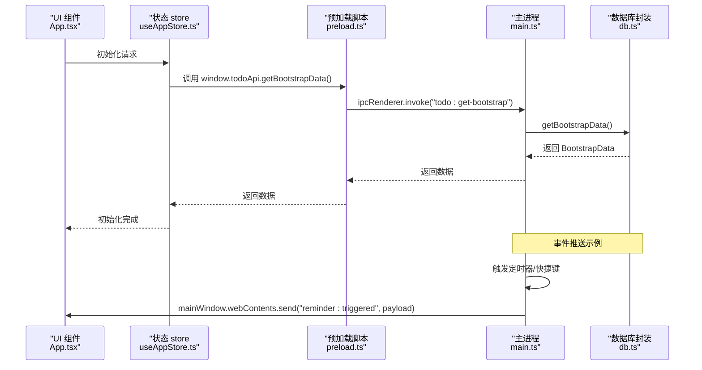
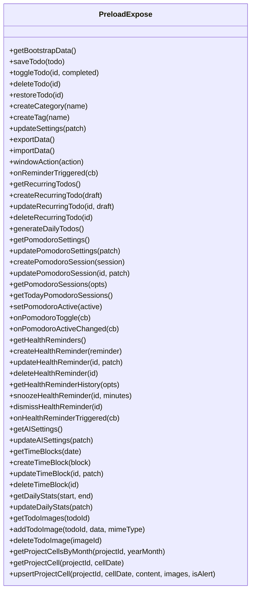
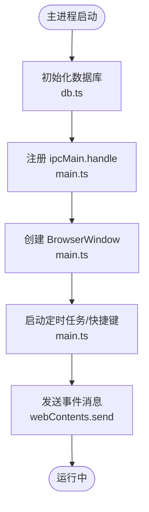
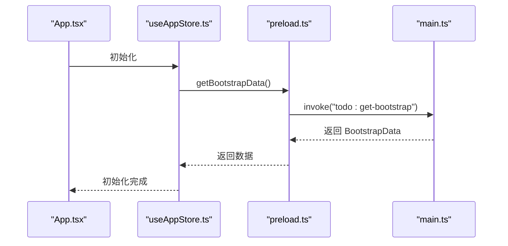
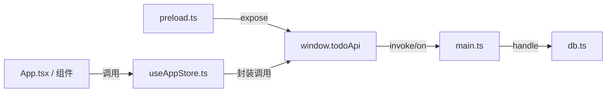

# IPC 通信问题

<cite>
**本文引用的文件**
- [app/electron/main.ts](file://app/electron/main.ts)
- [app/electron/preload.ts](file://app/electron/preload.ts)
- [app/src/store/useAppStore.ts](file://app/src/store/useAppStore.ts)
- [app/src/App.tsx](file://app/src/App.tsx)
- [app/src/components/Pomodoro/PomodoroView.tsx](file://app/src/components/Pomodoro/PomodoroView.tsx)
- [app/src/components/Health/HealthView.tsx](file://app/src/components/Health/HealthView.tsx)
- [app/src/types.ts](file://app/src/types.ts)
- [app/electron/db.ts](file://app/electron/db.ts)
</cite>

## 目录
1. [简介](#简介)
2. [项目结构](#项目结构)
3. [核心组件](#核心组件)
4. [架构总览](#架构总览)
5. [详细组件分析](#详细组件分析)
6. [依赖关系分析](#依赖关系分析)
7. [性能考量](#性能考量)
8. [故障排除指南](#故障排除指南)
9. [结论](#结论)
10. [附录](#附录)

## 简介
本指南聚焦于 SnowTodo 在 Electron 环境中的 IPC 通信故障排除，覆盖主进程与渲染进程之间的消息丢失、调用超时、类型不匹配、预加载脚本安全限制导致的 API 访问失败、权限配置错误、handle 函数未注册、参数传递错误、返回值格式问题、异步调用错误处理与重试机制、以及跨进程数据序列化与反序列化的最佳实践与常见陷阱。文档以代码为依据，结合可视化图示帮助开发者快速定位与解决问题。

## 项目结构
SnowTodo 的 IPC 采用标准的 Electron 架构：
- 主进程负责业务逻辑与数据库操作，通过 ipcMain.handle 注册同步/异步处理器。
- 渲染进程通过 preload 暴露的 todoApi 对象调用 ipcRenderer.invoke 或监听 ipcRenderer.on。
- 应用状态管理与 UI 组件通过 store 将 IPC 调用封装为易用的函数式接口。

```mermaid
graph TB
subgraph "渲染进程"
UI["React 组件<br/>App.tsx / 各功能视图"]
Store["应用状态 store<br/>useAppStore.ts"]
Preload["预加载脚本<br/>preload.ts"]
end
subgraph "主进程"
Main["主进程入口<br/>main.ts"]
DB["数据库封装<br/>db.ts"]
end
UI --> Store
Store --> Preload
Preload <- --> Main
Main --> DB
```

图表来源
- [app/src/App.tsx:24-34](file://app/src/App.tsx#L24-L34)
- [app/src/store/useAppStore.ts:295-298](file://app/src/store/useAppStore.ts#L295-L298)
- [app/electron/preload.ts:18-116](file://app/electron/preload.ts#L18-L116)
- [app/electron/main.ts:227-358](file://app/electron/main.ts#L227-L358)
- [app/electron/db.ts:55-90](file://app/electron/db.ts#L55-L90)

章节来源
- [app/src/App.tsx:11-34](file://app/src/App.tsx#L11-L34)
- [app/src/store/useAppStore.ts:181-508](file://app/src/store/useAppStore.ts#L181-L508)
- [app/electron/preload.ts:1-117](file://app/electron/preload.ts#L1-L117)
- [app/electron/main.ts:18-52](file://app/electron/main.ts#L18-L52)
- [app/electron/db.ts:55-90](file://app/electron/db.ts#L55-L90)

## 核心组件
- 主进程 IPC 注册与处理
  - 使用 ipcMain.handle 注册各类业务 API，如待办、分类标签、设置、数据导入导出、窗口控制、番茄钟、健康提醒、AI 设置、时间块、统计数据、图片与项目单元格等。
  - 主进程还通过 mainWindow.webContents.send 发送事件型消息（如提醒触发、全局快捷键切换等），供渲染进程监听。
- 预加载脚本暴露 API
  - 通过 contextBridge.exposeInMainWorld 暴露 window.todoApi，封装 ipcRenderer.invoke 与 ipcRenderer.on，统一渲染进程调用入口。
- 渲染进程状态与调用
  - 应用初始化时通过 window.todoApi.getBootstrapData 获取初始数据；后续各模块通过 store 中封装的方法调用对应 IPC 接口。
- 数据模型与类型
  - types.ts 定义了 Todo、Settings、Pomodoro、HealthReminder、TimeBlock、AISettings、DailyStats、ProjectCell 等核心类型，确保 IPC 参数与返回值的类型一致性。

章节来源
- [app/electron/main.ts:227-358](file://app/electron/main.ts#L227-L358)
- [app/electron/preload.ts:18-116](file://app/electron/preload.ts#L18-L116)
- [app/src/store/useAppStore.ts:295-298](file://app/src/store/useAppStore.ts#L295-L298)
- [app/src/types.ts:1-278](file://app/src/types.ts#L1-L278)

## 架构总览
下图展示了从 UI 到数据库的端到端 IPC 流程，包括同步调用与事件推送。



图表来源
- [app/src/App.tsx:24-34](file://app/src/App.tsx#L24-L34)
- [app/src/store/useAppStore.ts:295-298](file://app/src/store/useAppStore.ts#L295-L298)
- [app/electron/preload.ts:20](file://app/electron/preload.ts#L20)
- [app/electron/main.ts:98-118](file://app/electron/main.ts#L98-L118)
- [app/electron/db.ts:676-714](file://app/electron/db.ts#L676-L714)

## 详细组件分析

### 预加载脚本与渲染进程 API 暴露
- 预加载脚本通过 contextBridge.exposeInMainWorld 暴露 window.todoApi，统一封装 invoke 与 on。
- API 按功能域分组，便于维护与排障：基础数据、待办 CRUD、分类标签、设置、数据导入导出、窗口控制、提醒事件、长期待办、番茄钟、健康提醒、AI 设置、时间块、统计数据、图片、项目单元格等。
- 事件监听器返回移除函数，避免内存泄漏与重复监听。



图表来源
- [app/electron/preload.ts:18-116](file://app/electron/preload.ts#L18-L116)

章节来源
- [app/electron/preload.ts:1-117](file://app/electron/preload.ts#L1-L117)

### 主进程 IPC 注册与处理
- 主进程集中注册所有 ipcMain.handle，按模块划分清晰，便于定位问题。
- 事件推送：通过 mainWindow.webContents.send 推送提醒与番茄钟状态变更等事件。
- 异常处理：主进程内对定时任务与快捷键注册进行 try/catch，避免崩溃影响应用运行。



图表来源
- [app/electron/main.ts:360-391](file://app/electron/main.ts#L360-L391)
- [app/electron/db.ts:60-90](file://app/electron/db.ts#L60-L90)

章节来源
- [app/electron/main.ts:227-358](file://app/electron/main.ts#L227-L358)
- [app/electron/main.ts:98-118](file://app/electron/main.ts#L98-L118)
- [app/electron/main.ts:179-193](file://app/electron/main.ts#L179-L193)

### 渲染进程初始化与状态管理
- 应用初始化时调用 window.todoApi.getBootstrapData，随后加载各模块数据。
- store 将 IPC 调用封装为可组合的 actions，降低耦合度，便于测试与排障。



图表来源
- [app/src/App.tsx:24-34](file://app/src/App.tsx#L24-L34)
- [app/src/store/useAppStore.ts:295-298](file://app/src/store/useAppStore.ts#L295-L298)
- [app/electron/preload.ts:20](file://app/electron/preload.ts#L20)

章节来源
- [app/src/App.tsx:11-34](file://app/src/App.tsx#L11-L34)
- [app/src/store/useAppStore.ts:181-508](file://app/src/store/useAppStore.ts#L181-L508)

### 常见 IPC 错误模式与定位
- handle 函数未注册
  - 现象：渲染进程调用 window.todoApi.<method>() 抛出“未找到处理程序”或超时。
  - 排查：确认主进程是否已注册对应通道名；核对 preload.ts 与 main.ts 的通道名一致。
- 参数传递错误
  - 现象：参数类型不匹配、缺少必填字段、对象结构不符。
  - 排查：对照 types.ts 中的接口定义，确保传入参数与接口一致；注意嵌套对象与数组的序列化。
- 返回值格式问题
  - 现象：返回值结构与预期不符、字段缺失或类型错误。
  - 排查：检查主进程 db.ts 的返回值构造，确保与 types.ts 定义一致。
- 事件监听未移除
  - 现象：组件卸载后仍收到事件回调，引发内存泄漏或逻辑错误。
  - 排查：确认每次监听均返回并调用移除函数；避免重复监听。

章节来源
- [app/electron/preload.ts:43-47](file://app/electron/preload.ts#L43-L47)
- [app/electron/preload.ts:64-73](file://app/electron/preload.ts#L64-L73)
- [app/electron/preload.ts:83-87](file://app/electron/preload.ts#L83-L87)
- [app/src/types.ts:1-278](file://app/src/types.ts#L1-L278)

## 依赖关系分析
- 预加载脚本依赖 Electron 的 ipcRenderer 与 contextBridge，向外暴露 window.todoApi。
- 主进程依赖 Electron 的 ipcMain 与 BrowserWindow，向渲染进程提供服务。
- store 依赖 window.todoApi，将 IPC 调用抽象为应用级动作。
- db.ts 作为数据层，被主进程调用以执行业务逻辑与持久化。



图表来源
- [app/electron/preload.ts:1-117](file://app/electron/preload.ts#L1-L117)
- [app/electron/main.ts:227-358](file://app/electron/main.ts#L227-L358)
- [app/electron/db.ts:55-90](file://app/electron/db.ts#L55-L90)
- [app/src/store/useAppStore.ts:181-508](file://app/src/store/useAppStore.ts#L181-L508)
- [app/src/App.tsx:11-34](file://app/src/App.tsx#L11-L34)

章节来源
- [app/electron/preload.ts:1-117](file://app/electron/preload.ts#L1-L117)
- [app/electron/main.ts:227-358](file://app/electron/main.ts#L227-L358)
- [app/electron/db.ts:55-90](file://app/electron/db.ts#L55-L90)
- [app/src/store/useAppStore.ts:181-508](file://app/src/store/useAppStore.ts#L181-L508)
- [app/src/App.tsx:11-34](file://app/src/App.tsx#L11-L34)

## 性能考量
- IPC 调用为同步阻塞，频繁调用可能阻塞 UI 线程。建议：
  - 合理批量读取（如一次性获取月度项目单元格数据）。
  - 使用事件推送替代高频轮询（如健康提醒与番茄钟状态变更）。
- 数据库访问应避免在渲染线程直接调用，主进程统一处理。
- 大对象传输（如图片 base64）会增加序列化开销，建议：
  - 控制图片尺寸与数量。
  - 仅传输必要字段，避免冗余数据。

## 故障排除指南

### 1. IPC 消息丢失与调用超时
- 症状
  - 调用无响应或超时。
- 排查步骤
  - 确认主进程已注册对应 handle；核对通道名大小写与拼写。
  - 检查主进程窗口是否已创建，事件推送需依赖 mainWindow.webContents。
  - 在渲染进程捕获异常并记录错误上下文（参数、时间戳）。
- 重试策略
  - 对幂等操作（如设置更新、数据导出）添加指数退避重试。
  - 对非幂等操作（如创建、删除）避免自动重试，改为提示用户手动重试。

章节来源
- [app/electron/main.ts:227-358](file://app/electron/main.ts#L227-L358)
- [app/electron/main.ts:98-118](file://app/electron/main.ts#L98-L118)

### 2. 类型不匹配与序列化陷阱
- 症状
  - 参数解析失败、字段缺失、类型转换异常。
- 排查步骤
  - 对照 types.ts 的接口定义，逐项校验传参结构。
  - 注意嵌套对象与数组的 JSON 序列化/反序列化，确保字段命名一致。
  - 对日期字符串、枚举值（如 priority、reminderType）进行严格校验。
- 最佳实践
  - 在预加载脚本与主进程之间统一使用 types.ts 定义的接口。
  - 对大对象进行压缩或分批传输，减少序列化负担。

章节来源
- [app/src/types.ts:1-278](file://app/src/types.ts#L1-L278)
- [app/electron/preload.ts:18-116](file://app/electron/preload.ts#L18-L116)
- [app/electron/main.ts:227-358](file://app/electron/main.ts#L227-L358)

### 3. 预加载脚本安全限制导致的 API 访问失败
- 症状
  - window.todoApi 未定义或调用报错。
- 排查步骤
  - 确认 webPreferences 中启用 contextIsolation 并正确设置 preload 路径。
  - 确认 preload 脚本已成功注入并在应用启动早期执行。
  - 检查 preload.ts 是否正确暴露 window.todoApi。
- 解决方案
  - 不要在渲染进程中直接访问 Node.js API；所有能力通过 contextBridge 暴露。
  - 避免在 preload 中执行耗时操作，防止阻塞页面初始化。

章节来源
- [app/electron/main.ts:28-33](file://app/electron/main.ts#L28-L33)
- [app/electron/preload.ts:1-117](file://app/electron/preload.ts#L1-L117)

### 4. 权限配置错误与安全相关问题
- 症状
  - 某些 API 无法调用或返回空数据。
- 排查步骤
  - 检查 webPreferences 中的 contextIsolation 与 nodeIntegration 配置。
  - 确认 preload 仅暴露必要的 API，避免过度授权。
- 建议
  - 采用最小权限原则，仅暴露当前模块所需的 IPC 接口。
  - 对敏感操作（如数据导入导出）增加二次确认与错误提示。

章节来源
- [app/electron/main.ts:28-33](file://app/electron/main.ts#L28-L33)
- [app/electron/preload.ts:1-117](file://app/electron/preload.ts#L1-L117)

### 5. 常见 IPC 错误模式
- handle 未注册
  - 现象：调用抛出“未找到处理程序”。
  - 处理：核对 main.ts 中的通道名与 preload.ts 的调用是否一致。
- 参数传递错误
  - 现象：参数类型不符或字段缺失。
  - 处理：严格遵循 types.ts 接口，必要时在调用前做参数校验。
- 返回值格式问题
  - 现象：返回结构与预期不一致。
  - 处理：检查主进程 db.ts 的返回值构造，确保与 types.ts 一致。
- 事件监听未移除
  - 现象：组件卸载后仍接收事件。
  - 处理：每次监听返回移除函数并在组件卸载时调用。

章节来源
- [app/electron/preload.ts:43-47](file://app/electron/preload.ts#L43-L47)
- [app/electron/preload.ts:64-73](file://app/electron/preload.ts#L64-L73)
- [app/electron/preload.ts:83-87](file://app/electron/preload.ts#L83-L87)
- [app/src/types.ts:1-278](file://app/src/types.ts#L1-L278)

### 6. 通信调试工具与方法
- Electron DevTools
  - 在渲染进程打开 DevTools，观察 Console 与 Network 面板，定位调用栈与错误信息。
- IPC 监控
  - 在主进程打印关键 IPC 调用日志（输入参数、返回值摘要），辅助定位问题。
- 消息序列分析
  - 对于事件推送（如提醒触发），记录事件到达时间与处理结果，验证时序一致性。
- 日志与追踪
  - 在 store 中包装 IPC 调用，记录请求/响应与耗时，便于性能与稳定性分析。

章节来源
- [app/electron/main.ts:120-139](file://app/electron/main.ts#L120-L139)
- [app/electron/main.ts:141-177](file://app/electron/main.ts#L141-L177)

### 7. 异步调用的错误处理与重试机制
- 错误处理
  - 在渲染进程捕获 Promise 拒绝，记录错误详情与上下文。
  - 对不可恢复错误（如参数非法）提示用户修正；对可恢复错误（如网络波动）提示重试。
- 重试机制
  - 对幂等操作采用指数退避重试，最大重试次数与等待时间可配置。
  - 对非幂等操作禁止自动重试，改为用户确认后再试。
- 容错处理
  - 对网络不稳定场景，采用本地缓存兜底，待网络恢复后同步。

章节来源
- [app/src/store/useAppStore.ts:295-298](file://app/src/store/useAppStore.ts#L295-L298)
- [app/src/store/useAppStore.ts:443-447](file://app/src/store/useAppStore.ts#L443-L447)

### 8. 跨进程数据序列化与反序列化的最佳实践
- 最小化传输
  - 仅传输必要字段，避免大对象与冗余数据。
- 类型一致性
  - 严格遵循 types.ts 接口，避免隐式类型转换。
- 时间与枚举
  - 日期统一使用 ISO 字符串；枚举使用受控集合，避免未知值。
- 大对象优化
  - 图片等大对象优先考虑文件路径或分块传输，减少内存占用。

章节来源
- [app/src/types.ts:1-278](file://app/src/types.ts#L1-L278)
- [app/electron/preload.ts:104-107](file://app/electron/preload.ts#L104-L107)

## 结论
SnowTodo 的 IPC 架构清晰、职责分明：预加载脚本统一暴露 API，主进程集中处理业务与事件推送，store 将 IPC 封装为应用级动作。通过严格的类型定义与模块化设计，可以有效降低 IPC 通信的复杂性与故障率。建议在开发与运维中坚持以下原则：最小权限暴露、类型强约束、事件驱动替代轮询、完善的错误处理与重试、以及持续的日志与监控。

## 附录
- 关键通道名速查（部分）
  - 基础：todo:get-bootstrap, todo:save, todo:toggle, todo:delete, todo:restore
  - 分类与标签：category:create, tag:create
  - 设置：settings:update
  - 数据：data:export, data:import
  - 窗口：window:action
  - 提醒事件：reminder:triggered
  - 长期待办：recurring:get-all, recurring:create, recurring:update, recurring:delete, recurring:generate-daily
  - 番茄钟：pomodoro:get-settings, pomodoro:update-settings, pomodoro:create-session, pomodoro:update-session, pomodoro:get-sessions, pomodoro:get-today-sessions, pomodoro:set-active, pomodoro:toggle, pomodoro:active-changed
  - 健康提醒：health:get-reminders, health:create-reminder, health:update-reminder, health:delete-reminder, health:get-history, health:snooze-reminder, health:dismiss-reminder, health-reminder:triggered
  - AI 设置：ai:get-settings, ai:update-settings
  - 时间块：timeblock:get-all, timeblock:create, timeblock:update, timeblock:delete
  - 统计：stats:get-daily, stats:update-daily
  - 图片：todo:get-images, todo:add-image, todo:delete-image
  - 项目单元格：project:get-cells-by-month, project:get-cell, project:upsert-cell

章节来源
- [app/electron/main.ts:227-358](file://app/electron/main.ts#L227-L358)
- [app/electron/preload.ts:18-116](file://app/electron/preload.ts#L18-L116)