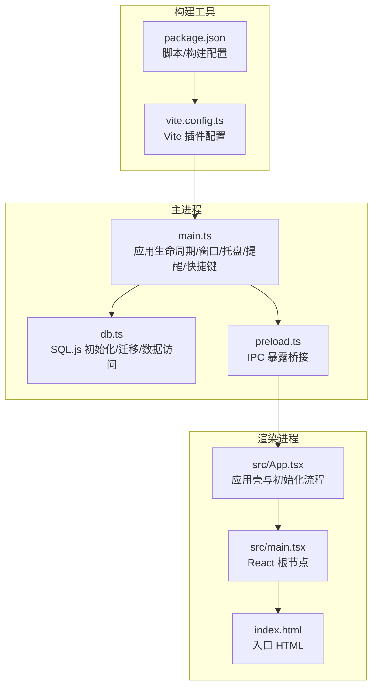
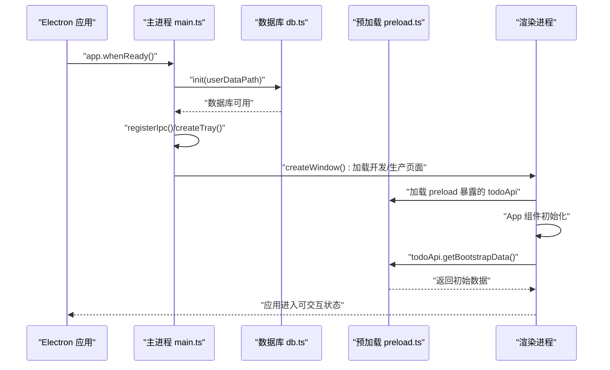
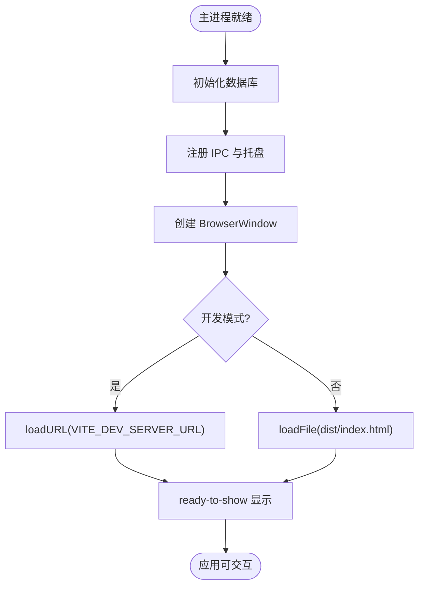
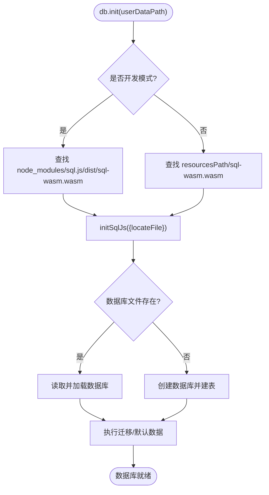
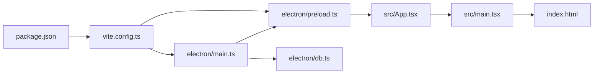

# 启动问题

<cite>
**本文引用的文件**
- [app\electron\main.ts](file://app/electron/main.ts)
- [app\electron\preload.ts](file://app/electron/preload.ts)
- [app\electron\db.ts](file://app/electron/db.ts)
- [app\vite.config.ts](file://app/vite.config.ts)
- [app\package.json](file://app/package.json)
- [app\index.html](file://app/index.html)
- [app\src\main.tsx](file://app/src/main.tsx)
- [app\src\App.tsx](file://app/src/App.tsx)
- [app\src\types.ts](file://app/src/types.ts)
- [build.log](file://build.log)
- [build2.log](file://build2.log)
</cite>

## 目录
1. [简介](#简介)
2. [项目结构](#项目结构)
3. [核心组件](#核心组件)
4. [架构总览](#架构总览)
5. [详细组件分析](#详细组件分析)
6. [依赖关系分析](#依赖关系分析)
7. [性能考虑](#性能考虑)
8. [故障排除指南](#故障排除指南)
9. [结论](#结论)
10. [附录](#附录)

## 简介
本指南聚焦于 SnowTodo 的启动问题排查与解决，覆盖应用无法启动、白屏、黑屏等常见症状；区分开发与生产环境的启动差异；定位 Vite 开发服务器连接问题、静态资源加载失败、Electron 主进程初始化错误；提供启动日志分析方法与窗口创建失败的根因与修复建议；说明应用更新与重启过程中的常见问题；并给出不同操作系统下的启动差异与解决方案。

## 项目结构
SnowTodo 采用 Electron + React + Vite 的混合架构：
- 主进程负责应用生命周期、窗口创建、托盘、提醒循环、全局快捷键、数据库初始化与 IPC 注册。
- 渲染进程负责 UI 展示与业务逻辑，通过 preload 暴露受控的 API 给渲染层。
- Vite 负责开发服务器与打包，electron-builder 负责打包分发。

**图表来源**
- [app\electron\main.ts:18-52](file://app/electron/main.ts#L18-L52)
- [app\electron\db.ts:60-90](file://app/electron/db.ts#L60-L90)
- [app\electron\preload.ts:18-116](file://app/electron/preload.ts#L18-L116)
- [app\index.html:1-14](file://app/index.html#L1-L14)
- [app\src\main.tsx:1-11](file://app/src/main.tsx#L1-L11)
- [app\src\App.tsx:11-34](file://app/src/App.tsx#L11-L34)
- [app\vite.config.ts:1-37](file://app/vite.config.ts#L1-L37)
- [app\package.json:1-100](file://app/package.json#L1-L100)

**章节来源**
- [app\electron\main.ts:18-52](file://app/electron/main.ts#L18-L52)
- [app\electron\db.ts:60-90](file://app/electron/db.ts#L60-L90)
- [app\electron\preload.ts:18-116](file://app/electron/preload.ts#L18-L116)
- [app\vite.config.ts:1-37](file://app/vite.config.ts#L1-L37)
- [app\package.json:1-100](file://app/package.json#L1-L100)
- [app\index.html:1-14](file://app/index.html#L1-L14)
- [app\src\main.tsx:1-11](file://app/src/main.tsx#L1-L11)
- [app\src\App.tsx:11-34](file://app/src/App.tsx#L11-L34)

## 核心组件
- 主进程入口与生命周期
  - 应用就绪后初始化数据库、注册 IPC、创建窗口、创建托盘、启动提醒循环、注册全局快捷键。
  - 关闭窗口行为：非 macOS 平台默认隐藏至托盘而非退出。
- 数据库初始化
  - 根据是否打包决定 wasm 资源路径，初始化 SQL.js，加载或创建本地数据库，执行迁移与默认数据注入。
- 预加载桥接
  - 通过 contextBridge 暴露 todoApi，封装各类 IPC 调用，供渲染进程安全调用。
- 渲染进程初始化
  - 在 App 组件挂载后，通过 window.todoApi.getBootstrapData 获取初始数据并初始化状态。

**章节来源**
- [app\electron\main.ts:360-390](file://app/electron/main.ts#L360-L390)
- [app\electron\db.ts:60-90](file://app/electron/db.ts#L60-L90)
- [app\electron\preload.ts:18-116](file://app/electron/preload.ts#L18-L116)
- [app\src\App.tsx:24-34](file://app/src/App.tsx#L24-L34)

## 架构总览
启动序列从主进程开始，贯穿数据库初始化、窗口创建、渲染进程加载、IPC 暴露与数据拉取。

**图表来源**
- [app\electron\main.ts:360-369](file://app/electron/main.ts#L360-L369)
- [app\electron\db.ts:60-90](file://app/electron/db.ts#L60-L90)
- [app\electron\preload.ts:18-116](file://app/electron/preload.ts#L18-L116)
- [app\src\App.tsx:24-34](file://app/src/App.tsx#L24-L34)

## 详细组件分析

### 主进程启动流程与窗口创建
- 窗口参数
  - 固定尺寸、最小尺寸、背景色、上下文隔离、禁用 Node 集成、指定 preload 路径。
  - ready-to-show 事件后显示窗口，避免首屏闪烁。
- 开发/生产加载策略
  - 开发模式：使用 VITE_DEV_SERVER_URL 加载本地开发服务器。
  - 生产模式：加载 dist/index.html。
- 关闭行为
  - 非 macOS 平台拦截 close 事件，隐藏到托盘；macOS 需要显式退出。

**图表来源**
- [app\electron\main.ts:18-52](file://app/electron/main.ts#L18-L52)
- [app\electron\main.ts:47-51](file://app/electron/main.ts#L47-L51)

**章节来源**
- [app\electron\main.ts:18-52](file://app/electron/main.ts#L18-L52)

### 数据库初始化与 WASM 资源定位
- 资源定位
  - 开发：node_modules/sql.js/dist/sql-wasm.wasm
  - 生产：process.resourcesPath/sql-wasm.wasm
- 迁移与默认数据
  - 不存在数据库则创建表结构、索引与默认数据；存在则执行迁移。
- 错误处理
  - 迁移过程中的异常会记录到控制台，不影响启动但可能导致功能缺失。

**图表来源**
- [app\electron\db.ts:60-90](file://app/electron/db.ts#L60-L90)
- [app\electron\db.ts:92-297](file://app/electron/db.ts#L92-L297)

**章节来源**
- [app\electron\db.ts:60-90](file://app/electron/db.ts#L60-L90)
- [app\electron\db.ts:92-297](file://app/electron/db.ts#L92-L297)

### 预加载桥接与 IPC 暴露
- 暴露 todoApi，封装大量 IPC 调用，如 todo CRUD、设置更新、提醒事件、番茄钟、健康提醒、时间块、统计数据、图片管理、项目单元格等。
- 渲染进程通过 window.todoApi 安全调用主进程能力。

**章节来源**
- [app\electron\preload.ts:18-116](file://app/electron/preload.ts#L18-L116)

### 渲染进程初始化与数据拉取
- App 组件在首次渲染时调用 window.todoApi.getBootstrapData，拉取初始数据并初始化状态。
- 若未初始化，则阻塞后续 UI 渲染直到数据到位。

**章节来源**
- [app\src\App.tsx:24-34](file://app/src/App.tsx#L24-L34)
- [app\electron\preload.ts:20-20](file://app/electron/preload.ts#L20-L20)

## 依赖关系分析
- 构建链路
  - vite.config.ts 使用 vite-plugin-electron，将主进程入口指向 electron/main.ts，preload 指向 electron/preload.ts，输出目录 dist-electron。
  - package.json 中 dev/build/lint 等脚本驱动开发与打包。
- 运行时链路
  - 主进程依赖 Electron API、数据库模块、IPC 注册。
  - 渲染进程依赖 React、类型定义、样式与入口脚本。

**图表来源**
- [app\vite.config.ts:7-32](file://app/vite.config.ts#L7-L32)
- [app\package.json:9-14](file://app/package.json#L9-L14)
- [app\electron\main.ts:1-10](file://app/electron/main.ts#L1-L10)
- [app\electron\preload.ts:1-16](file://app/electron/preload.ts#L1-L16)
- [app\src\App.tsx:1-10](file://app/src/App.tsx#L1-L10)
- [app\src\main.tsx:1-10](file://app/src/main.tsx#L1-L10)
- [app\index.html:1-13](file://app/index.html#L1-L13)

**章节来源**
- [app\vite.config.ts:1-37](file://app/vite.config.ts#L1-L37)
- [app\package.json:1-100](file://app/package.json#L1-L100)

## 性能考虑
- 首屏显示优化：窗口 ready-to-show 事件后才显示，避免白屏闪烁。
- 数据库延迟初始化：应用就绪后再初始化数据库，缩短冷启动时间。
- IPC 调用集中在 preload 桥接层，减少渲染进程直接调用主进程的复杂度。

[本节为通用指导，无需特定文件引用]

## 故障排除指南

### 一、应用无法启动
常见原因与排查步骤：
- 主进程未正确初始化
  - 检查主进程是否成功执行数据库初始化与窗口创建。
  - 关注主进程日志中的数据库迁移错误与窗口创建异常。
- 数据库初始化失败
  - 确认 wasm 资源路径是否正确（开发/生产）。
  - 检查用户数据目录权限与磁盘空间。
- 构建产物缺失
  - 确认已执行构建命令并生成 dist 与 dist-electron 目录。
  - 检查 electron-builder 配置与 extraResources 是否包含 sql-wasm.wasm 与 tray 图标。

**章节来源**
- [app\electron\main.ts:360-369](file://app/electron/main.ts#L360-L369)
- [app\electron\db.ts:60-90](file://app/electron/db.ts#L60-L90)
- [app\package.json:12-12](file://app/package.json#L12-L12)
- [app\package.json:50-98](file://app/package.json#L50-L98)

### 二、白屏/黑屏
可能原因与解决：
- 开发模式下 Vite 服务未启动或端口被占用
  - 确保 VITE_DEV_SERVER_URL 指向正确的开发服务器地址。
  - 检查端口占用并更换端口。
- 生产模式下资源加载失败
  - 确认 dist/index.html 存在且路径正确。
  - 确认静态资源（如 favicon、CSS/JS）可被 Electron 正常访问。
- 预加载脚本未正确注入
  - 确认 preload 路径与 preload.ts 输出一致。
  - 检查 webPreferences.preload 指向。

**章节来源**
- [app\electron\main.ts:47-51](file://app/electron/main.ts#L47-L51)
- [app\index.html:1-14](file://app/index.html#L1-L14)
- [app\electron\preload.ts:1-16](file://app/electron/preload.ts#L1-L16)

### 三、开发环境与生产环境差异
- 开发环境
  - 使用 VITE_DEV_SERVER_URL 加载本地开发服务器。
  - 预加载与渲染进程均走本地调试。
- 生产环境
  - 加载打包后的 dist/index.html。
  - 预加载与渲染进程打包为最终产物。
- 常见差异问题
  - 资源路径：开发使用相对路径，生产使用绝对路径。
  - 调试工具：开发可启用严格模式与 React DevTools，生产关闭。

**章节来源**
- [app\electron\main.ts:8-9](file://app/electron/main.ts#L8-L9)
- [app\electron\main.ts:47-51](file://app/electron/main.ts#L47-L51)
- [app\vite.config.ts:33-36](file://app/vite.config.ts#L33-L36)

### 四、Vite 开发服务器连接问题
- 现象
  - 应用启动后空白页或长时间无响应。
- 排查
  - 确认 VITE_DEV_SERVER_URL 环境变量正确。
  - 检查开发服务器是否正常启动与监听端口。
  - 网络代理或防火墙导致连接超时。

**章节来源**
- [app\electron\main.ts:8-9](file://app/electron/main.ts#L8-L9)
- [app\electron\main.ts:47-49](file://app/electron/main.ts#L47-L49)

### 五、静态资源加载失败
- 现象
  - 图标、样式、字体或图片无法显示。
- 排查
  - 检查 public 目录与打包配置是否包含所需资源。
  - 确认资源路径在生产环境可访问。

**章节来源**
- [app\package.json:50-98](file://app/package.json#L50-L98)

### 六、Electron 主进程初始化错误
- 现象
  - 应用启动即崩溃或无法创建窗口。
- 排查
  - 检查主进程日志中的数据库初始化异常。
  - 确认 preload 路径与 preload 输出一致。
  - 检查 webPreferences 配置（contextIsolation、nodeIntegration）。

**章节来源**
- [app\electron\main.ts:18-33](file://app/electron/main.ts#L18-L33)
- [app\electron\main.ts:28-32](file://app/electron/main.ts#L28-L32)

### 七、窗口创建失败
- 参数配置错误
  - 尺寸过小、路径错误、preload 不存在。
- 资源路径问题
  - 开发模式下 VITE_DEV_SERVER_URL 未设置或不可达。
  - 生产模式下 dist/index.html 或静态资源缺失。
- 解决方案
  - 修正窗口参数与 preload 路径。
  - 确认开发/生产加载目标存在且可访问。

**章节来源**
- [app\electron\main.ts:18-52](file://app/electron/main.ts#L18-L52)

### 八、应用更新与重启过程中的问题
- 更新器
  - 项目使用 electron-builder，需确保安装包包含必要资源（wasm、图标）。
- 重启行为
  - 关闭窗口默认隐藏至托盘（非 macOS），需要显式退出。
- 建议
  - 在更新后清理缓存目录，确保新版本资源被正确加载。

**章节来源**
- [app\package.json:50-98](file://app/package.json#L50-L98)
- [app\electron\main.ts:376-381](file://app/electron/main.ts#L376-L381)

### 九、不同操作系统下的启动差异
- Windows
  - 默认隐藏窗口至托盘；安装包目标包含 nsis/portable。
- macOS
  - 关闭窗口触发 app.quit，遵循平台行为。
- Linux
  - 行为与 Windows 类似，注意桌面集成与图标路径。

**章节来源**
- [app\package.json:75-91](file://app/package.json#L75-L91)
- [app\electron\main.ts:376-381](file://app/electron/main.ts#L376-L381)

### 十、启动日志分析方法
- 启用详细日志
  - 在主进程中使用 console.error 记录关键错误（数据库迁移、提醒循环、快捷键注册等）。
  - 在渲染进程通过 window.todoApi 调用时捕获异常并上报。
- 分析要点
  - 主进程：数据库初始化失败、窗口加载失败、IPC 注册异常。
  - 渲染进程：todoApi 调用失败、初始数据拉取超时。
- 构建日志
  - build.log 与 build2.log 中包含 electron-builder 下载失败、执行失败等错误信息，需关注网络与代理配置。

**章节来源**
- [app\electron\db.ts:92-297](file://app/electron/db.ts#L92-L297)
- [app\electron\main.ts:120-139](file://app/electron/main.ts#L120-L139)
- [app\electron\main.ts:170-177](file://app/electron/main.ts#L170-L177)
- [app\electron\main.ts:179-193](file://app/electron/main.ts#L179-L193)
- [build.log:1-29](file://build.log#L1-L29)
- [build2.log:1-39](file://build2.log#L1-L39)

## 结论
SnowTodo 的启动问题多源于主进程初始化、数据库资源定位与窗口加载三个环节。通过区分开发/生产环境、明确资源路径、加强日志输出与错误捕获，可快速定位并解决问题。建议在开发阶段启用严格模式与详细日志，在生产阶段确保资源完整与路径正确，并针对不同平台调整托盘与退出行为。

## 附录

### A. 常见启动错误与修复对照
- 无法加载开发服务器
  - 检查 VITE_DEV_SERVER_URL 与端口占用。
- 数据库初始化失败
  - 确认 sql-wasm.wasm 路径与权限。
- 窗口空白
  - 检查 dist/index.html 与静态资源。
- 托盘不生效
  - 确认 tray 图标路径与平台支持。

**章节来源**
- [app\electron\main.ts:47-51](file://app/electron/main.ts#L47-L51)
- [app\electron\db.ts:60-90](file://app/electron/db.ts#L60-L90)
- [app\package.json:50-98](file://app/package.json#L50-L98)