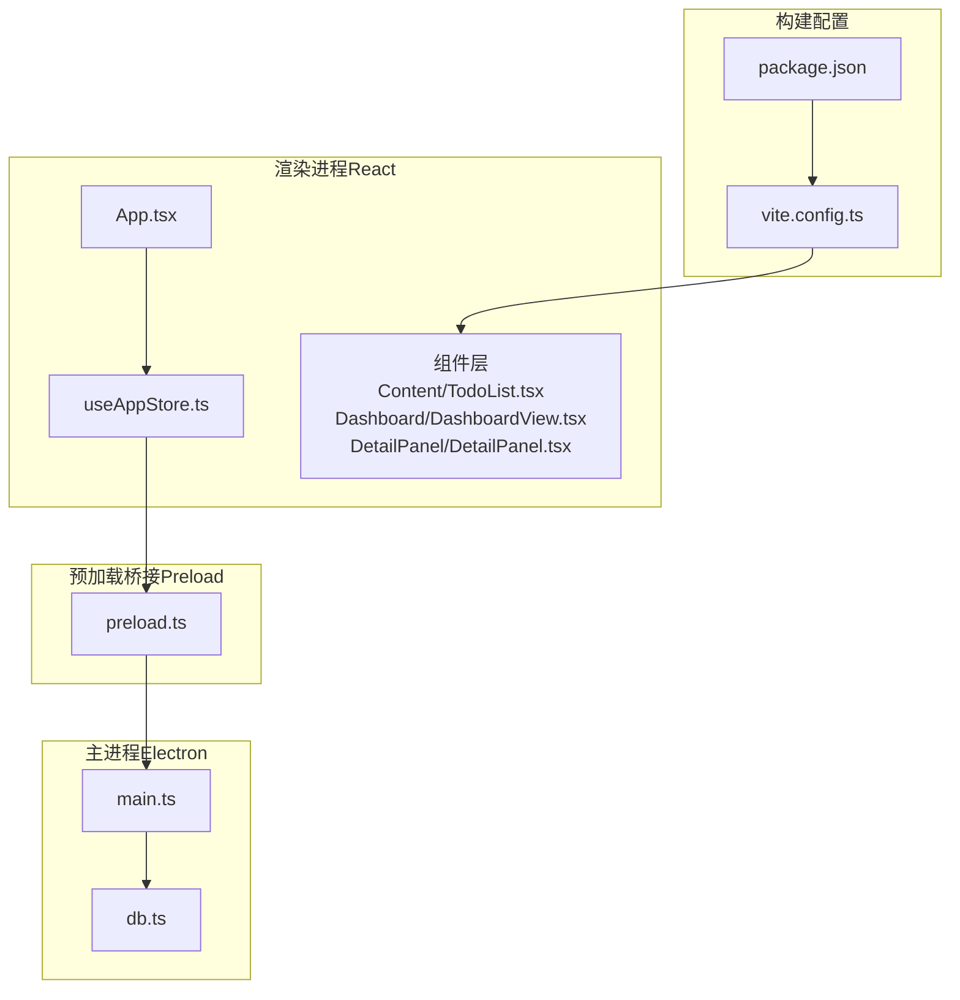
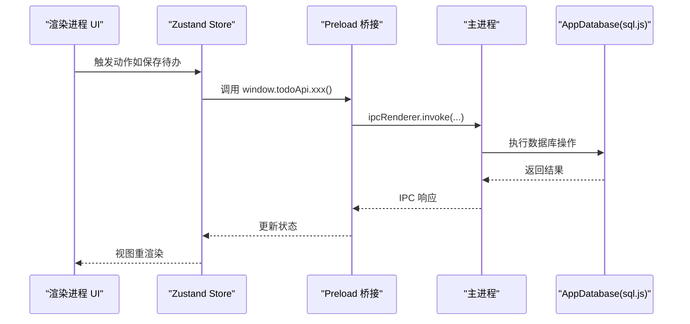
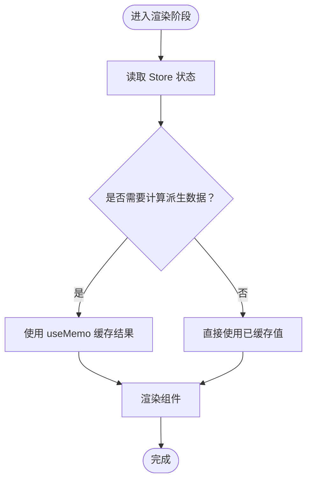
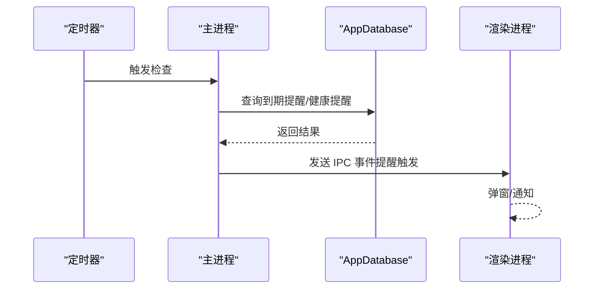
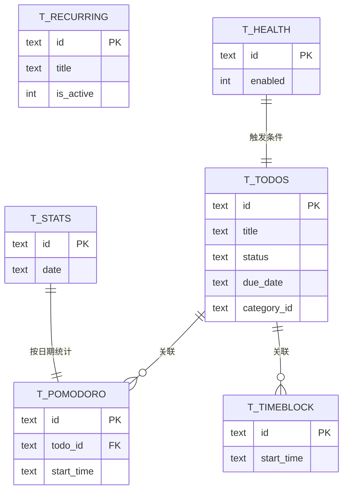
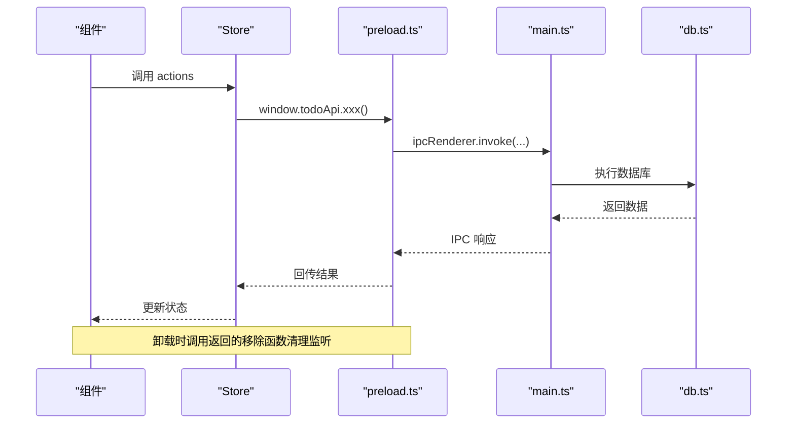
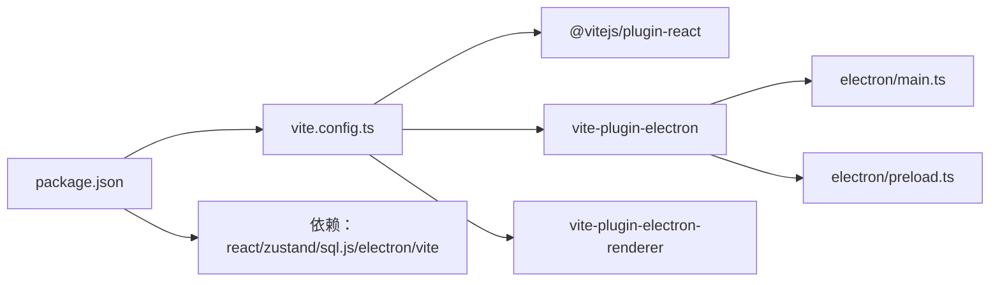

# 性能优化

<cite>
**本文引用的文件**
- [app/src/store/useAppStore.ts](file://app/src/store/useAppStore.ts)
- [app/src/App.tsx](file://app/src/App.tsx)
- [app/src/components/Content/TodoList.tsx](file://app/src/components/Content/TodoList.tsx)
- [app/src/components/Dashboard/DashboardView.tsx](file://app/src/components/Dashboard/DashboardView.tsx)
- [app/src/components/DetailPanel/DetailPanel.tsx](file://app/src/components/DetailPanel/DetailPanel.tsx)
- [app/src/components/Health/HealthView.tsx](file://app/src/components/Health/HealthView.tsx)
- [app/src/tabs](file://app/src/tabs)
- [app/src/types.ts](file://app/src/types.ts)
- [app/electron/main.ts](file://app/electron/main.ts)
- [app/electron/db.ts](file://app/electron/db.ts)
- [app/electron/preload.ts](file://app/electron/preload.ts)
- [app/vite.config.ts](file://app/vite.config.ts)
- [app/package.json](file://app/package.json)
</cite>

## 目录
1. [简介](#简介)
2. [项目结构](#项目结构)
3. [核心组件](#核心组件)
4. [架构总览](#架构总览)
5. [详细组件分析](#详细组件分析)
6. [依赖关系分析](#依赖关系分析)
7. [性能考量与优化建议](#性能考量与优化建议)
8. [故障排查指南](#故障排查指南)
9. [结论](#结论)
10. [附录](#附录)

## 简介
本指南聚焦 SnowTodo 的性能问题诊断与优化实践，覆盖以下方面：
- 内存泄漏识别与检测：Electron 渲染进程与主进程的常见陷阱、React 组件卸载与事件监听清理、IPC 通道与全局快捷键管理。
- CPU 使用率过高分析：渲染进程重计算、主进程定时器与阻塞操作、IPC 调用频率与批量处理。
- 数据库查询优化：索引使用、查询计划、批量写入与事务化处理。
- 状态管理优化：Zustand 状态树设计、订阅粒度控制、计算派生数据的缓存与去抖。
- 构建与打包优化：Vite 配置、代码分割、资源压缩与外部化策略。
- 性能监控与指标解读：如何采集与理解关键指标，结合工具定位瓶颈。

## 项目结构
SnowTodo 采用 Electron + React + Vite 的技术栈，前端使用 Zustand 管理状态，主进程通过 IPC 与数据库交互，数据库基于 sql.js（WebAssembly）实现本地存储。

**图表来源**
- [app/src/App.tsx](file://app/src/App.tsx)
- [app/src/store/useAppStore.ts](file://app/src/store/useAppStore.ts)
- [app/src/components/Content/TodoList.tsx](file://app/src/components/Content/TodoList.tsx)
- [app/src/components/Dashboard/DashboardView.tsx](file://app/src/components/Dashboard/DashboardView.tsx)
- [app/src/components/DetailPanel/DetailPanel.tsx](file://app/src/components/DetailPanel/DetailPanel.tsx)
- [app/electron/preload.ts](file://app/electron/preload.ts)
- [app/electron/main.ts](file://app/electron/main.ts)
- [app/electron/db.ts](file://app/electron/db.ts)
- [app/vite.config.ts](file://app/vite.config.ts)
- [app/package.json](file://app/package.json)

**章节来源**
- [app/src/App.tsx](file://app/src/App.tsx)
- [app/src/store/useAppStore.ts](file://app/src/store/useAppStore.ts)
- [app/electron/main.ts](file://app/electron/main.ts)
- [app/electron/db.ts](file://app/electron/db.ts)
- [app/electron/preload.ts](file://app/electron/preload.ts)
- [app/vite.config.ts](file://app/vite.config.ts)
- [app/package.json](file://app/package.json)

## 核心组件
- 状态管理：Zustand 存储 useAppStore，集中管理 todos、过滤器、排序、Pomodoro、健康提醒、AI 设置、时间块、仪表盘统计与项目单元格等。
- 主进程：负责窗口生命周期、托盘、全局快捷键、定时器触发提醒、IPC 注册与数据持久化。
- 数据库：sql.js 封装 AppDatabase，提供 CRUD、索引、迁移与统计数据聚合。
- 预加载桥接：暴露安全的 window.todoApi，封装 IPC 调用与事件订阅/移除。

**章节来源**
- [app/src/store/useAppStore.ts](file://app/src/store/useAppStore.ts)
- [app/electron/main.ts](file://app/electron/main.ts)
- [app/electron/db.ts](file://app/electron/db.ts)
- [app/electron/preload.ts](file://app/electron/preload.ts)

## 架构总览
渲染进程通过 preload 暴露的 API 与主进程通信；主进程调用数据库执行业务逻辑，并通过定时器周期性检查提醒；数据库使用 sql.js 在 WebAssembly 中运行，避免 Node.js 原生扩展带来的复杂性。

**图表来源**
- [app/src/store/useAppStore.ts](file://app/src/store/useAppStore.ts)
- [app/electron/preload.ts](file://app/electron/preload.ts)
- [app/electron/main.ts](file://app/electron/main.ts)
- [app/electron/db.ts](file://app/electron/db.ts)

## 详细组件分析

### 状态管理与渲染性能（Zustand）
- 状态树设计
  - 将“基础数据”“UI 状态”“模块化领域状态”分层组织，避免单一大对象导致全量重渲染。
  - 将派生数据（如过滤后的待办、今日待办、待提醒项）以函数形式提供，减少冗余存储。
- 订阅粒度控制
  - 组件仅订阅所需字段，避免跨视图共享导致的过度订阅。
  - 对高频计算的派生数据使用 useMemo 缓存（例如仪表盘的填充与汇总）。
- 重渲染优化
  - TodoList 中按视图类型分别计算列表，避免在渲染阶段做昂贵的过滤/排序。
  - 详情面板与健康提醒弹窗按需打开，减少不必要的 DOM 结构。

**图表来源**
- [app/src/store/useAppStore.ts](file://app/src/store/useAppStore.ts)
- [app/src/components/Content/TodoList.tsx](file://app/src/components/Content/TodoList.tsx)
- [app/src/components/Dashboard/DashboardView.tsx](file://app/src/components/Dashboard/DashboardView.tsx)

**章节来源**
- [app/src/store/useAppStore.ts](file://app/src/store/useAppStore.ts)
- [app/src/components/Content/TodoList.tsx](file://app/src/components/Content/TodoList.tsx)
- [app/src/components/Dashboard/DashboardView.tsx](file://app/src/components/Dashboard/DashboardView.tsx)

### 主进程定时器与阻塞风险
- 定时器
  - 提醒循环：每 30 秒检查一次到期提醒；健康提醒循环：每 60 秒检查一次到期健康提醒。
  - 建议：将检查逻辑异步化，避免阻塞主线程；对异常进行 try/catch 并记录错误。
- 全局快捷键
  - 修改设置后重新注册，注意注销旧快捷键，避免重复绑定。
- 窗口与托盘
  - 关闭行为改为隐藏至托盘，避免频繁销毁/重建窗口造成资源浪费。

**图表来源**
- [app/electron/main.ts](file://app/electron/main.ts)
- [app/electron/db.ts](file://app/electron/db.ts)

**章节来源**
- [app/electron/main.ts](file://app/electron/main.ts)
- [app/electron/db.ts](file://app/electron/db.ts)

### 数据库查询与索引优化
- 表与索引
  - todos、recurring_todos、pomodoro_sessions、time_blocks、daily_stats、health_reminders 等均建立必要索引，如 idx_todos_status、idx_pomodoro_todo、idx_timeblock_start、idx_daily_stats_date、idx_health_enabled。
- 查询模式
  - 按状态/日期范围/类别/标签过滤查询，优先使用带索引的列。
  - 聚合统计（如每日统计）使用 SUM/COUNT 并按日期分组，避免全表扫描。
- 批量写入
  - 通过事务化写入（如保存待办时先删除再插入标签映射）降低锁竞争与 I/O 次数。

**图表来源**
- [app/electron/db.ts](file://app/electron/db.ts)

**章节来源**
- [app/electron/db.ts](file://app/electron/db.ts)

### 预加载桥接与 IPC 订阅管理
- 暴露统一 API：getBootstrapData、saveTodo、toggleTodo、onReminderTriggered、onPomodoroToggle 等。
- 事件订阅与移除：onXxx 回调返回移除函数，确保组件卸载时清理监听，避免内存泄漏。
- IPC 调用：使用 invoke/send 区分请求-响应与单向事件，减少不必要的阻塞。

**图表来源**
- [app/electron/preload.ts](file://app/electron/preload.ts)
- [app/src/store/useAppStore.ts](file://app/src/store/useAppStore.ts)

**章节来源**
- [app/electron/preload.ts](file://app/electron/preload.ts)
- [app/src/store/useAppStore.ts](file://app/src/store/useAppStore.ts)

### 图像上传与内存管理（详情面板）
- 文件读取：使用 FileReader 异步读取图片为 base64，避免阻塞 UI。
- 新建与编辑流程差异：新建时临时保存在组件状态，保存后再批量上传；编辑时直接上传并同步更新。
- 卸载清理：面板关闭时清空 lightbox，防止残留 DOM 引起视觉与内存问题。

**章节来源**
- [app/src/components/DetailPanel/DetailPanel.tsx](file://app/src/components/DetailPanel/DetailPanel.tsx)

## 依赖关系分析
- 构建链路
  - Vite 插件组合：@vitejs/plugin-react、vite-plugin-electron、vite-plugin-electron-renderer。
  - 主进程打包：entry 指向 electron/main.ts，输出到 dist-electron；preload 输入 electron/preload.ts。
  - 外部化：sql.js 外部化，避免重复打包。
- 依赖与版本
  - React 19、Zustand 5、sql.js 1.x、Electron 41、Vite 8。
  - 生产构建：vite build && electron-builder。

**图表来源**
- [app/vite.config.ts](file://app/vite.config.ts)
- [app/package.json](file://app/package.json)

**章节来源**
- [app/vite.config.ts](file://app/vite.config.ts)
- [app/package.json](file://app/package.json)

## 性能考量与优化建议

### 内存泄漏识别与检测
- Electron 渲染进程
  - 事件监听：确保每个 onXxx 回调返回的移除函数在组件卸载时调用（详情面板、健康提醒弹窗）。
  - 大对象持有：避免在组件状态中长期持有大数组或图像数据，必要时及时切片或释放。
  - 图像资源：base64 图片在内存中占用较大，建议限制尺寸或延迟加载。
- 主进程
  - 定时器：检查 startReminderLoop/startHealthReminderLoop 是否正确清理旧定时器，避免重复触发。
  - 全局快捷键：修改设置后先 unregisterAll，再注册新快捷键，防止重复绑定。
  - 窗口生命周期：关闭行为改为 hide，避免频繁创建/销毁窗口。
- React 组件
  - 使用 React DevTools Profiler 检测重渲染热点；对高频组件使用 memo 化。
  - 避免在 effect 中直接访问 DOM 或全局变量，确保清理函数完整。

**章节来源**
- [app/electron/preload.ts](file://app/electron/preload.ts)
- [app/src/components/DetailPanel/DetailPanel.tsx](file://app/src/components/DetailPanel/DetailPanel.tsx)
- [app/electron/main.ts](file://app/electron/main.ts)

### CPU 使用率过高分析
- 渲染进程
  - 高频计算：Dashboard 的填充与汇总使用 useMemo 缓存；TodoList 的过滤/排序在 Store 层完成，避免在渲染阶段重复计算。
  - 动画与过渡：Framer Motion 等动画库在大量元素上可能带来开销，建议限制动画范围或降级。
- 主进程
  - 定时器频率：当前 30s/60s 检查较为合理，若数据量增大可考虑指数退避或合并检查。
  - IPC 调用：避免在渲染进程中频繁发起同步 IPC；将批处理放在主进程执行。
- 数据库
  - 大查询：对多表联结与聚合查询使用索引；必要时拆分查询或分页。

**章节来源**
- [app/src/components/Dashboard/DashboardView.tsx](file://app/src/components/Dashboard/DashboardView.tsx)
- [app/src/components/Content/TodoList.tsx](file://app/src/components/Content/TodoList.tsx)
- [app/electron/main.ts](file://app/electron/main.ts)
- [app/electron/db.ts](file://app/electron/db.ts)

### 数据库查询性能优化
- 索引使用
  - 已建立 idx_todos_status、idx_pomodoro_todo、idx_timeblock_start、idx_daily_stats_date、idx_health_enabled 等索引。
- 查询计划
  - 使用 EXPLAIN QUERY PLAN（在 sql.js 中可通过 PRAGMA）分析慢查询路径，优先命中索引列。
- 批量操作
  - 保存待办时先删除再插入标签映射，减少冲突与回滚成本。
  - 日常统计更新采用 upsert，避免重复写入。

**章节来源**
- [app/electron/db.ts](file://app/electron/db.ts)

### 状态管理性能优化策略
- Zustand 状态树设计
  - 将“基础数据”“UI 状态”“模块化领域状态”分层，避免单一大对象。
  - 将派生数据以函数提供，配合 useMemo 缓存。
- 订阅粒度控制
  - 组件仅订阅所需字段；对跨视图共享的状态进行拆分或局部化。
- 计算派生数据
  - 使用 useMemo/memo 包裹昂贵计算；对频繁变更的数据进行节流/去抖。

**章节来源**
- [app/src/store/useAppStore.ts](file://app/src/store/useAppStore.ts)
- [app/src/components/Dashboard/DashboardView.tsx](file://app/src/components/Dashboard/DashboardView.tsx)

### 构建与打包优化
- Vite 配置
  - 外部化 sql.js，避免重复打包与体积膨胀。
  - 使用 electron 插件分离主进程与渲染进程构建目录。
- 代码分割
  - 将大型视图组件（如 Dashboard）按需加载，减少首屏负担。
- 资源压缩
  - 生产构建启用压缩；静态资源（如图标）建议使用 WebP 或 SVG。

**章节来源**
- [app/vite.config.ts](file://app/vite.config.ts)
- [app/package.json](file://app/package.json)

### 性能监控与指标解读
- 指标建议
  - 渲染进程：FPS、JS Heap、DOM 节点数、事件监听数量、IPC 请求耗时。
  - 主进程：CPU 使用率、定时器数量、IPC 队列长度、数据库查询耗时。
- 工具
  - Chrome DevTools Performance/Heap/Network 面板。
  - Electron DevTools（如 electron-devtools-installer）。
  - 自定义指标埋点：记录关键操作耗时（如保存待办、加载统计）。
- 指标解读
  - FPS 波动大：检查动画与重排重绘热点。
  - Heap 持续增长：排查未清理的事件监听、大对象未释放。
  - IPC 延迟高：检查主进程阻塞与查询复杂度。

[本节为通用指导，无需特定文件引用]

## 故障排查指南
- 提醒未触发或重复触发
  - 检查定时器是否正确清理与重启；核对健康提醒的 skipDuringPomodoro 与工作日/周末过滤。
- 图像无法上传或显示异常
  - 检查 FileReader 是否成功读取；确认 base64 数据格式；编辑状态下确保上传后同步更新。
- 窗口关闭即退出
  - 确认关闭事件是否被拦截并隐藏至托盘；托盘点击恢复窗口逻辑正常。
- IPC 事件未移除
  - 确保 onXxx 回调返回的移除函数在组件卸载时调用；使用 React 的 useEffect 清理模式。

**章节来源**
- [app/electron/main.ts](file://app/electron/main.ts)
- [app/electron/preload.ts](file://app/electron/preload.ts)
- [app/src/components/DetailPanel/DetailPanel.tsx](file://app/src/components/DetailPanel/DetailPanel.tsx)

## 结论
SnowTodo 的性能优化应从“状态管理订阅粒度、渲染进程重计算、主进程定时器与阻塞、数据库索引与查询、构建打包外部化”五个维度入手。通过精细化的订阅与缓存、合理的定时器策略、完备的事件监听清理以及索引驱动的查询，可显著降低内存与 CPU 压力。结合性能监控工具持续观测关键指标，形成闭环优化。

## 附录
- 关键类型与模块边界
  - 类型定义集中在 types.ts，涵盖 Todo、Category、Tag、Settings、Pomodoro、HealthReminder、TimeBlock、AISettings、DailyStats、ProjectCell 等。
  - 模块化边界：M1（Pomodoro）、M3（健康提醒）、M4（仪表盘）、M5（AI）、M6（时间块）通过独立 actions 与 API 调用隔离。

**章节来源**
- [app/src/types.ts](file://app/src/types.ts)