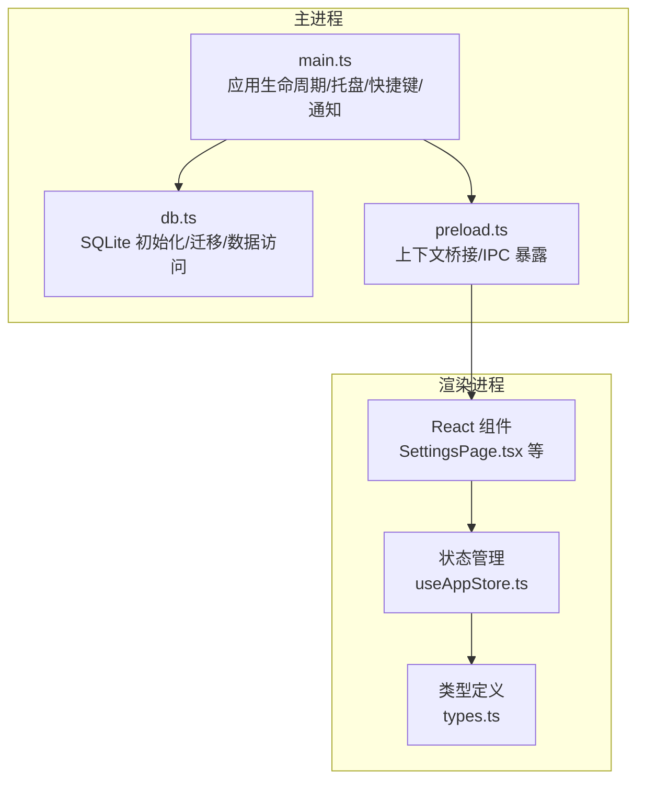
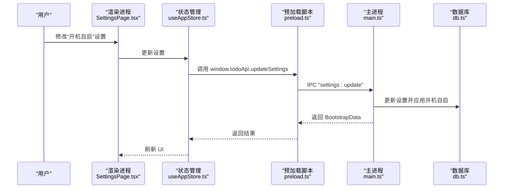
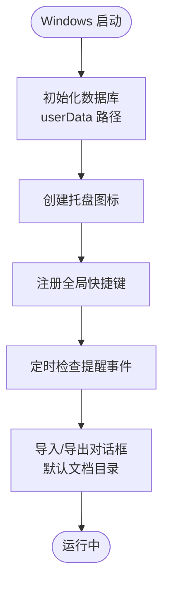
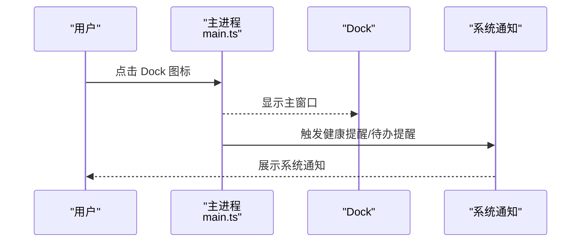
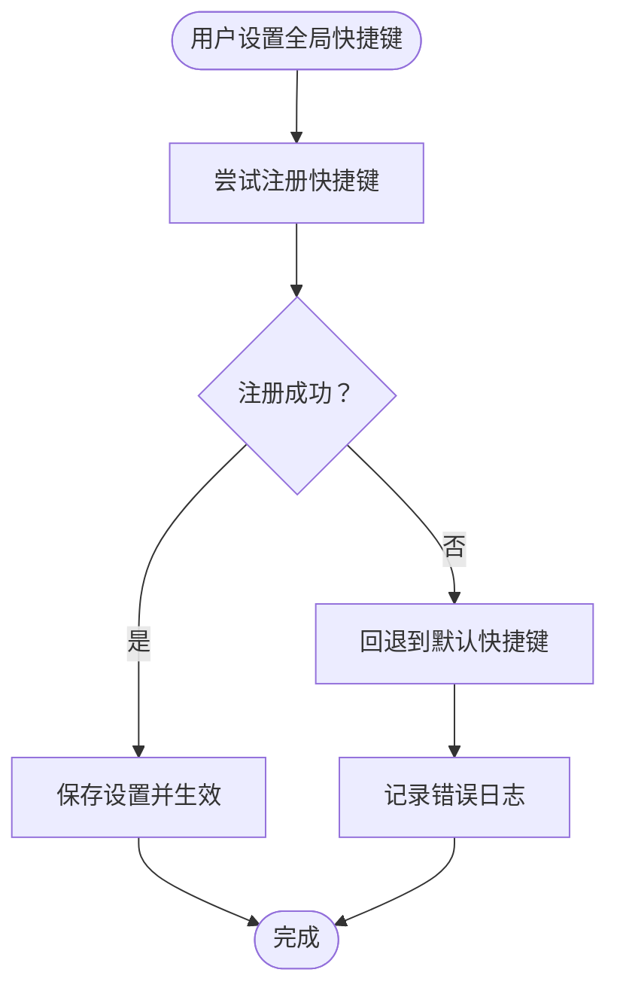
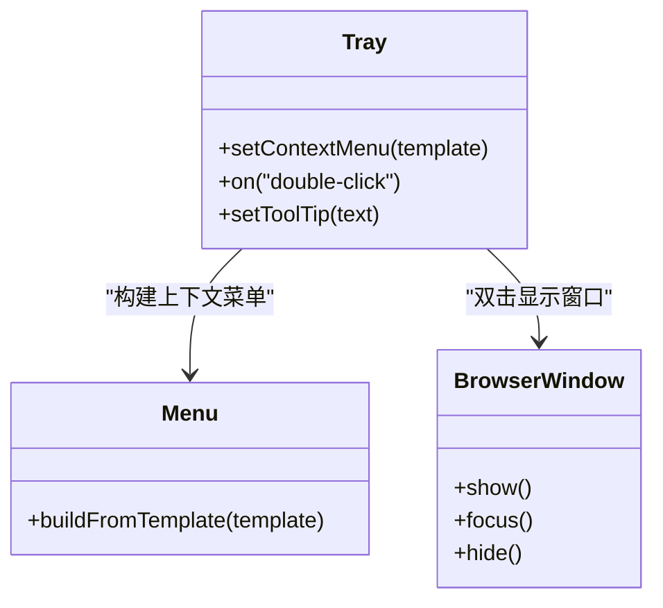
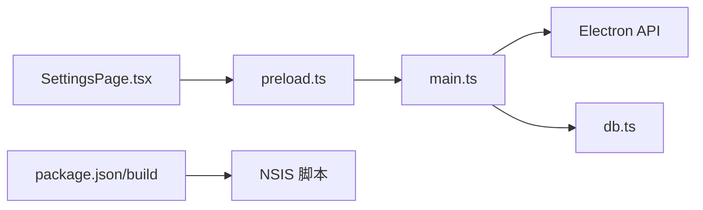

# 操作系统特定问题

<cite>
**本文档引用的文件**
- [main.ts](file://app/electron/main.ts)
- [preload.ts](file://app/electron/preload.ts)
- [db.ts](file://app/electron/db.ts)
- [types.ts](file://app/src/types.ts)
- [package.json](file://app/package.json)
- [installer.nsh](file://app/scripts/installer.nsh)
- [build-vc.js](file://build-vc.js)
- [SettingsPage.tsx](file://app/src/components/Settings/SettingsPage.tsx)
- [useAppStore.ts](file://app/src/store/useAppStore.ts)
</cite>

## 目录
1. [简介](#简介)
2. [项目结构](#项目结构)
3. [核心组件](#核心组件)
4. [架构总览](#架构总览)
5. [详细组件分析](#详细组件分析)
6. [依赖关系分析](#依赖关系分析)
7. [性能考量](#性能考量)
8. [故障排除指南](#故障排除指南)
9. [结论](#结论)

## 简介
本指南聚焦于 SnowTodo 在不同操作系统（Windows、macOS、Linux）下的特定问题与故障排除方法。内容覆盖文件路径处理、权限问题、系统集成功能（托盘、快捷键、开机自启、通知、文件关联）的实现差异，并针对各平台的兼容性提供具体解决方案与最佳实践。

## 项目结构
SnowTodo 是基于 Electron 的跨平台桌面应用，采用主进程（Electron 主线程）与渲染进程（React UI）分离的架构：
- 主进程负责窗口管理、系统托盘、全局快捷键、系统通知、数据库初始化与持久化、开机自启配置等系统级功能。
- 渲染进程负责用户界面交互、状态管理、IPC 通信以及业务逻辑展示。

图表来源
- [main.ts:1-391](file://app/electron/main.ts#L1-L391)
- [db.ts:1-800](file://app/electron/db.ts#L1-L800)
- [preload.ts:1-117](file://app/electron/preload.ts#L1-L117)
- [SettingsPage.tsx:1-147](file://app/src/components/Settings/SettingsPage.tsx#L1-L147)
- [useAppStore.ts:1-200](file://app/src/store/useAppStore.ts#L1-L200)
- [types.ts:1-278](file://app/src/types.ts#L1-L278)

章节来源
- [main.ts:1-391](file://app/electron/main.ts#L1-L391)
- [db.ts:1-800](file://app/electron/db.ts#L1-L800)
- [preload.ts:1-117](file://app/electron/preload.ts#L1-L117)
- [SettingsPage.tsx:1-147](file://app/src/components/Settings/SettingsPage.tsx#L1-L147)
- [useAppStore.ts:1-200](file://app/src/store/useAppStore.ts#L1-L200)
- [types.ts:1-278](file://app/src/types.ts#L1-L278)

## 核心组件
- 应用主进程（main.ts）
  - 窗口创建与关闭行为控制（最小化到托盘而非退出）
  - 系统托盘创建与双击显示主窗口
  - 全局快捷键注册与切换
  - 系统通知（系统通知 + 弹窗提醒）
  - 开机自启动设置
  - 数据导入/导出对话框与文件路径处理
- 数据层（db.ts）
  - SQLite 初始化与 WASM 资源定位
  - 数据库迁移与表结构管理
  - 用户数据目录（userData）读写
- 预加载脚本（preload.ts）
  - 通过 contextBridge 暴露安全的 IPC 接口给渲染进程
- 类型与状态（types.ts, useAppStore.ts）
  - 定义应用数据模型与状态接口
  - 状态管理与 UI 交互

章节来源
- [main.ts:18-52](file://app/electron/main.ts#L18-L52)
- [main.ts:54-92](file://app/electron/main.ts#L54-L92)
- [main.ts:179-193](file://app/electron/main.ts#L179-L193)
- [main.ts:98-118](file://app/electron/main.ts#L98-L118)
- [main.ts:94-96](file://app/electron/main.ts#L94-L96)
- [main.ts:195-225](file://app/electron/main.ts#L195-L225)
- [db.ts:60-90](file://app/electron/db.ts#L60-L90)
- [db.ts:282-297](file://app/electron/db.ts#L282-L297)
- [preload.ts:18-116](file://app/electron/preload.ts#L18-L116)
- [types.ts:161-166](file://app/src/types.ts#L161-L166)
- [useAppStore.ts:181-200](file://app/src/store/useAppStore.ts#L181-L200)

## 架构总览
SnowTodo 的系统集成功能在主进程中统一实现，通过 IPC 将功能暴露给渲染进程。关键流程如下：
- 启动时初始化数据库与用户数据目录，注册托盘、全局快捷键与定时提醒循环
- 用户操作通过渲染进程触发 IPC，主进程执行系统级操作（托盘、通知、快捷键、开机自启）
- 数据持久化通过 SQLite 存储在用户数据目录

图表来源
- [SettingsPage.tsx:8-17](file://app/src/components/Settings/SettingsPage.tsx#L8-L17)
- [useAppStore.ts:111-114](file://app/src/store/useAppStore.ts#L111-L114)
- [preload.ts:32-38](file://app/electron/preload.ts#L32-L38)
- [main.ts:235-239](file://app/electron/main.ts#L235-L239)
- [db.ts:676-714](file://app/electron/db.ts#L676-L714)

章节来源
- [main.ts:360-369](file://app/electron/main.ts#L360-L369)
- [preload.ts:18-116](file://app/electron/preload.ts#L18-L116)
- [db.ts:676-714](file://app/electron/db.ts#L676-L714)

## 详细组件分析

### Windows 平台特定问题与解决方案
- 文件路径处理
  - 数据库文件位于用户数据目录（userData），通过 app.getPath('userData') 获取绝对路径，避免相对路径导致的权限与路径解析问题。
  - 导入/导出对话框使用系统默认文档目录作为初始路径，确保用户可直接访问。
- 权限问题
  - 使用用户数据目录进行读写，避免需要管理员权限的系统目录。
  - 安装器包含 VC++ 运行库下载与静默安装逻辑，减少运行时依赖缺失导致的崩溃。
- 系统集成功能
  - 托盘：创建托盘图标并绑定双击显示主窗口；关闭窗口时隐藏到托盘而非退出。
  - 全局快捷键：支持自定义组合键，注册失败时记录错误日志。
  - 开机自启：通过 app.setLoginItemSettings 设置登录项。
  - 系统通知：根据提醒类型发送系统通知或弹窗提醒。
- 安装与打包
  - 使用 electron-builder 配置 NSIS 安装包，目标架构 x64，包含额外资源（WASM、托盘图标）。
  - 自定义安装脚本下载 VC++ 运行库，提升兼容性。

图表来源
- [main.ts:360-369](file://app/electron/main.ts#L360-L369)
- [main.ts:54-92](file://app/electron/main.ts#L54-L92)
- [main.ts:179-193](file://app/electron/main.ts#L179-L193)
- [main.ts:98-118](file://app/electron/main.ts#L98-L118)
- [main.ts:195-225](file://app/electron/main.ts#L195-L225)
- [db.ts:60-90](file://app/electron/db.ts#L60-L90)
- [package.json:50-99](file://app/package.json#L50-L99)
- [installer.nsh:7-14](file://app/scripts/installer.nsh#L7-L14)

章节来源
- [main.ts:360-369](file://app/electron/main.ts#L360-L369)
- [main.ts:54-92](file://app/electron/main.ts#L54-L92)
- [main.ts:179-193](file://app/electron/main.ts#L179-L193)
- [main.ts:98-118](file://app/electron/main.ts#L98-L118)
- [main.ts:195-225](file://app/electron/main.ts#L195-L225)
- [db.ts:60-90](file://app/electron/db.ts#L60-L90)
- [package.json:50-99](file://app/package.json#L50-L99)
- [installer.nsh:7-14](file://app/scripts/installer.nsh#L7-L14)

### macOS 平台特定问题与解决方案
- 应用沙盒与代码签名
  - 项目未启用沙盒模式，使用通用 darwin 平台构建；如需上架 Mac App Store 或启用沙盒，请参考相关签名与权限配置。
- Dock 图标与菜单栏集成
  - 关闭窗口时遵循 macOS 行为：当所有窗口关闭且非 macOS 平台时退出应用；macOS 平台保持常驻。
- 系统通知
  - 使用 Notification API 发送系统通知，支持标题与正文；弹窗提醒通过主窗口恢复与聚焦实现。
- 开机自启
  - 通过 app.setLoginItemSettings 配置登录项，适用于 macOS 登录项设置。

图表来源
- [main.ts:376-381](file://app/electron/main.ts#L376-L381)
- [main.ts:101-106](file://app/electron/main.ts#L101-L106)
- [main.ts:142-147](file://app/electron/main.ts#L142-L147)

章节来源
- [main.ts:376-381](file://app/electron/main.ts#L376-L381)
- [main.ts:101-106](file://app/electron/main.ts#L101-L106)
- [main.ts:142-147](file://app/electron/main.ts#L142-L147)

### Linux 平台特定问题与解决方案
- 桌面环境适配
  - 托盘图标在 Linux 下可能因桌面环境差异而显示异常；建议使用标准尺寸与格式的图标资源。
- 文件系统权限
  - 数据库与资源文件均位于用户数据目录，避免需要 root 权限的系统目录。
- 依赖库版本
  - 通过 electron-builder 自动打包依赖；如遇运行时库缺失，建议检查系统 GTK/Qt 环境与 Electron 版本兼容性。

章节来源
- [db.ts:60-90](file://app/electron/db.ts#L60-L90)
- [package.json:50-99](file://app/package.json#L50-L99)

### 全局快捷键在不同平台的实现差异
- 注册机制
  - 使用 globalShortcut.register 注册组合键；若注册失败，记录错误日志并提示用户调整快捷键。
- 平台差异
  - Windows：支持 Ctrl/Alt/Shift 组合键；注意与系统快捷键冲突。
  - macOS：支持 Cmd/Option/Control 组合键；部分组合键可能被系统占用。
  - Linux：组合键支持情况与桌面环境相关，建议提供可配置的默认值。
- 解决方案
  - 提供默认快捷键（如 Ctrl+Shift+P），允许用户修改并在注册失败时回退到默认值。
  - 在设置页面提供快捷键输入框与实时验证反馈。

图表来源
- [main.ts:179-193](file://app/electron/main.ts#L179-L193)
- [types.ts:40-58](file://app/src/types.ts#L40-L58)

章节来源
- [main.ts:179-193](file://app/electron/main.ts#L179-L193)
- [types.ts:40-58](file://app/src/types.ts#L40-L58)

### 系统托盘功能的兼容性与替代方案
- Windows
  - 创建托盘图标并绑定双击显示主窗口；关闭窗口时隐藏到托盘。
- macOS
  - 保持常驻，遵循系统托盘行为；图标与上下文菜单在不同 macOS 版本下表现一致。
- Linux
  - 托盘图标显示可能受桌面环境影响；建议提供替代入口（如菜单栏或右键菜单）。
- 替代方案
  - 若托盘不可用，可通过设置页面提供“显示主窗口”按钮或快捷键唤醒。
  - 在设置中增加“始终最小化到托盘”的选项以改善用户体验。

图表来源
- [main.ts:54-92](file://app/electron/main.ts#L54-L92)

章节来源
- [main.ts:54-92](file://app/electron/main.ts#L54-L92)

### 开机自启、文件关联、系统通知的平台差异处理
- 开机自启
  - 使用 app.setLoginItemSettings 控制登录项；Windows 通过 NSIS 安装器设置；macOS/Linux 通过系统设置生效。
- 文件关联
  - 项目未实现文件关联功能；如需支持，可在各平台通过原生扩展或第三方库实现（例如 Windows 的文件关联注册表项、macOS 的 UTI 和 Info.plist 配置、Linux 的 MIME 类型与 Desktop Entry）。
- 系统通知
  - 使用 Notification API 发送系统通知；弹窗提醒通过主窗口恢复与聚焦实现，确保用户可见性。

章节来源
- [main.ts:94-96](file://app/electron/main.ts#L94-L96)
- [main.ts:101-118](file://app/electron/main.ts#L101-L118)
- [main.ts:142-157](file://app/electron/main.ts#L142-L157)

## 依赖关系分析
- 主进程依赖
  - Electron API：app、BrowserWindow、ipcMain、Notification、globalShortcut、Tray、Menu、nativeImage
  - 数据库：sql.js（WASM）、fs/path
- 渲染进程依赖
  - React + Zustand 状态管理
  - IPC 接口通过 preload 暴露
- 构建与打包
  - electron-builder 配置目标平台与安装包格式
  - NSIS 脚本嵌入 VC++ 运行库安装

图表来源
- [main.ts:1-10](file://app/electron/main.ts#L1-L10)
- [db.ts:1-5](file://app/electron/db.ts#L1-L5)
- [preload.ts:1-16](file://app/electron/preload.ts#L1-L16)
- [package.json:50-99](file://app/package.json#L50-L99)
- [installer.nsh:7-14](file://app/scripts/installer.nsh#L7-L14)

章节来源
- [main.ts:1-10](file://app/electron/main.ts#L1-L10)
- [db.ts:1-5](file://app/electron/db.ts#L1-L5)
- [preload.ts:1-16](file://app/electron/preload.ts#L1-L16)
- [package.json:50-99](file://app/package.json#L50-L99)
- [installer.nsh:7-14](file://app/scripts/installer.nsh#L7-L14)

## 性能考量
- 数据库初始化
  - 通过 locateFile 指定 WASM 路径，避免开发与生产环境路径差异导致的加载失败。
- 定时任务
  - 提醒循环与健康提醒循环分别以固定间隔运行，注意避免频繁 I/O 操作；可考虑合并检查或延迟策略。
- 托盘与通知
  - 避免在短时间内大量发送通知，以免影响系统性能与用户体验。

章节来源
- [db.ts:74-76](file://app/electron/db.ts#L74-L76)
- [main.ts:120-139](file://app/electron/main.ts#L120-L139)
- [main.ts:161-177](file://app/electron/main.ts#L161-L177)

## 故障排除指南

### Windows 常见问题
- 安装后无法启动或崩溃
  - 检查是否缺少 VC++ 运行库；安装器会自动下载并静默安装，若失败请手动安装 x64 版本。
  - 确认安装包目标架构为 x64，与系统匹配。
- 托盘图标不显示或无响应
  - 确保托盘图标资源存在且路径正确；重启系统或更换托盘图标格式。
- 全局快捷键无效
  - 更换快捷键组合，避免与系统或第三方软件冲突；检查注册失败日志。
- 开机自启未生效
  - 检查 Windows 登录项设置；确认安装器已正确配置。

章节来源
- [installer.nsh:7-14](file://app/scripts/installer.nsh#L7-L14)
- [package.json:75-90](file://app/package.json#L75-L90)
- [main.ts:179-193](file://app/electron/main.ts#L179-L193)
- [main.ts:94-96](file://app/electron/main.ts#L94-L96)

### macOS 常见问题
- Dock 图标不显示或点击无响应
  - 确认应用已正确打包并签名；检查 Info.plist 中的 CFBundleDisplayName 与图标设置。
- 托盘图标异常
  - 检查图标尺寸与格式；不同 macOS 版本对托盘图标的渲染略有差异。
- 全局快捷键冲突
  - 更换快捷键组合；避免与系统快捷键冲突（如 Cmd+Shift+P）。
- 系统通知未显示
  - 检查系统通知权限；确保应用具有发送通知的权限。

章节来源
- [main.ts:376-381](file://app/electron/main.ts#L376-L381)
- [main.ts:179-193](file://app/electron/main.ts#L179-L193)
- [main.ts:101-106](file://app/electron/main.ts#L101-L106)

### Linux 常见问题
- 托盘图标不显示
  - 检查桌面环境对托盘的支持；尝试更换图标格式或尺寸。
- 文件权限错误
  - 确保用户数据目录可读写；避免使用需要 root 权限的系统目录。
- 依赖库缺失
  - 检查系统 GTK/Qt 环境与 Electron 版本兼容性；必要时升级系统库。

章节来源
- [db.ts:60-90](file://app/electron/db.ts#L60-L90)
- [package.json:50-99](file://app/package.json#L50-L99)

### 通用问题
- 数据导入/导出失败
  - 确认文件路径有效且有读写权限；检查 JSON 格式是否正确。
- 设置未生效
  - 通过 IPC 更新设置后，主进程会调用 applyLaunchOnStartup 应用开机自启；检查返回的 BootstrapData 是否包含最新设置。
- 日志排查
  - 查看控制台输出中的错误日志（如全局快捷键注册失败、提醒循环异常等），定位问题根因。

章节来源
- [main.ts:235-239](file://app/electron/main.ts#L235-L239)
- [main.ts:195-225](file://app/electron/main.ts#L195-L225)
- [main.ts:132-134](file://app/electron/main.ts#L132-L134)

## 结论
SnowTodo 在多平台下通过主进程统一处理系统集成功能，结合 IPC 将能力暴露给渲染进程。针对 Windows、macOS、Linux 的差异，项目已在路径处理、权限控制、托盘与快捷键等方面提供了基础支持。建议在实际部署中：
- Windows：确保 VC++ 运行库安装与安装包架构匹配
- macOS：关注 Dock 与通知权限，避免快捷键冲突
- Linux：关注托盘兼容性与依赖库版本
同时，建议为文件关联、更严格的权限校验与更丰富的日志输出预留扩展点，以进一步提升跨平台稳定性与用户体验。