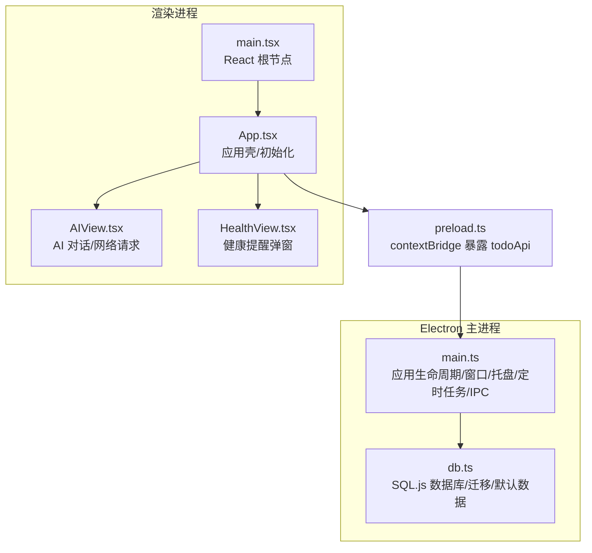
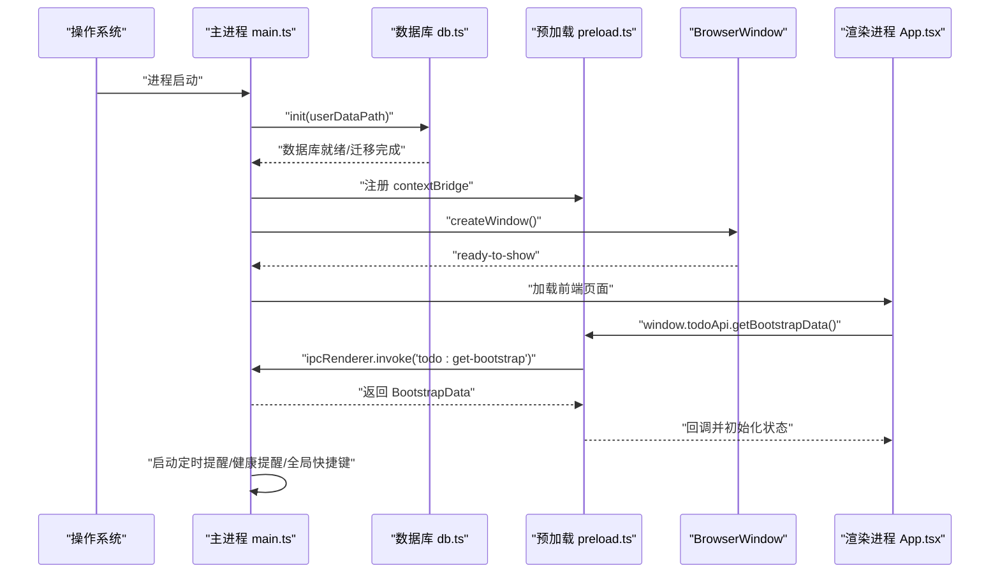
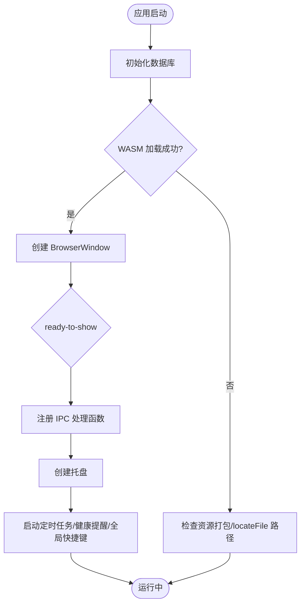
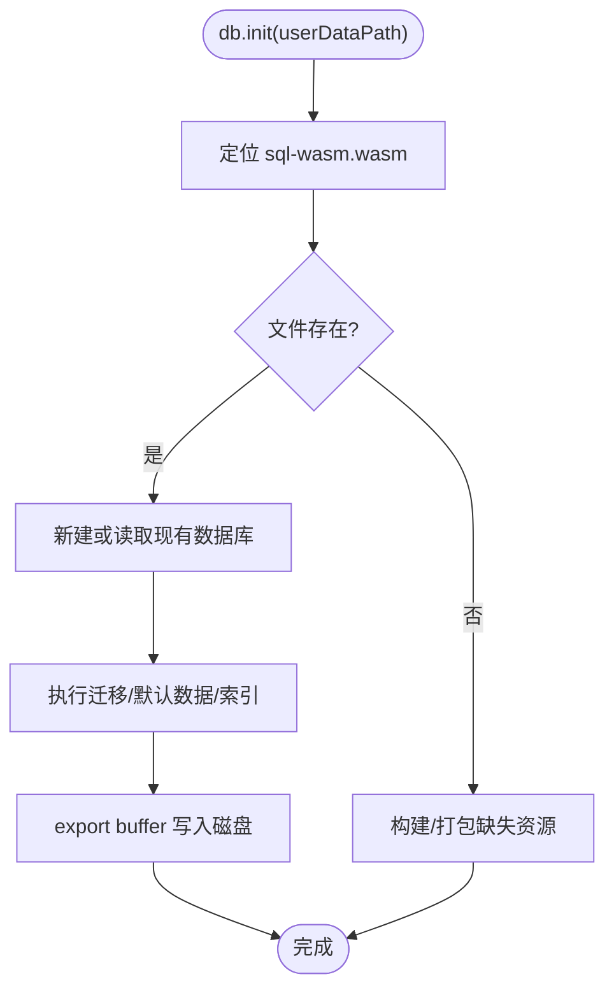
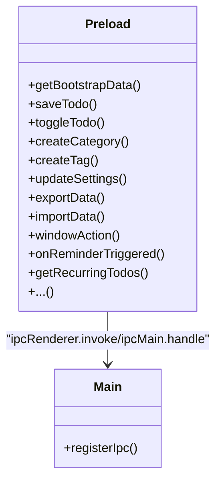
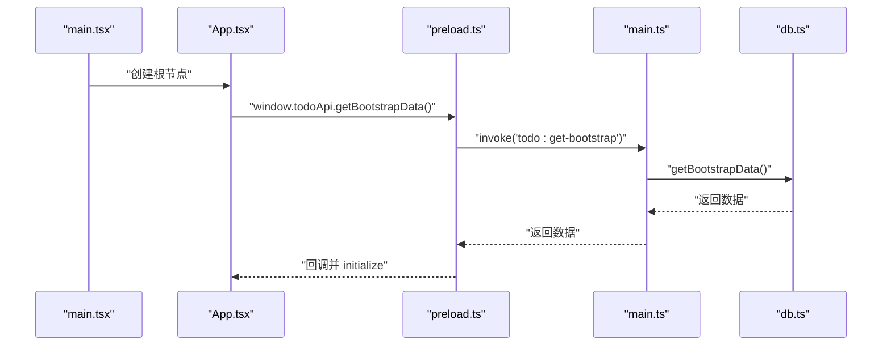
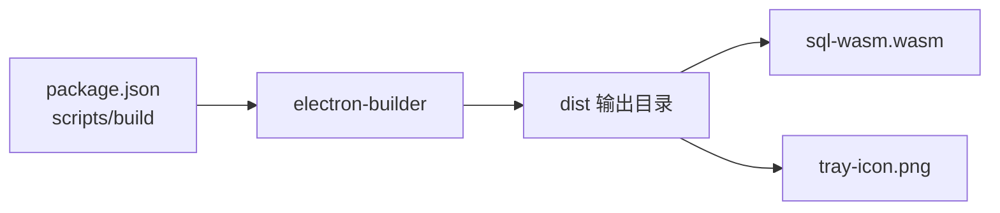

# 故障排除

<cite>
**本文引用的文件**
- [main.ts](file://app/electron/main.ts)
- [db.ts](file://app/electron/db.ts)
- [preload.ts](file://app/electron/preload.ts)
- [types.ts](file://app/src/types.ts)
- [App.tsx](file://app/src/App.tsx)
- [AIView.tsx](file://app/src/components/AI/AIView.tsx)
- [HealthView.tsx](file://app/src/components/Health/HealthView.tsx)
- [main.tsx](file://app/src/main.tsx)
- [index.html](file://app/index.html)
- [package.json](file://app/package.json)
</cite>

## 目录
1. [简介](#简介)
2. [项目结构](#项目结构)
3. [核心组件](#核心组件)
4. [架构总览](#架构总览)
5. [详细组件分析](#详细组件分析)
6. [依赖关系分析](#依赖关系分析)
7. [性能考虑](#性能考虑)
8. [故障排除指南](#故障排除指南)
9. [结论](#结论)
10. [附录](#附录)

## 简介
本指南面向开发者与用户，聚焦 SnowTodo 在开发与生产环境中的故障排除与调试实践。内容覆盖应用启动失败、数据库连接问题、IPC 通信异常、日志与日志分析、性能问题（内存泄漏、CPU 占用）、网络问题（AI 服务与在线功能）、跨平台差异、崩溃报告收集与分析，以及开发/生产调试差异与预防性建议。

## 项目结构
SnowTodo 采用 Electron + React 架构，主进程负责窗口、托盘、全局快捷键、定时提醒、IPC 注册与数据库初始化；渲染进程负责 UI、状态管理与业务交互；预加载脚本通过 contextBridge 暴露受控 API 给渲染进程。

图表来源
- [main.ts:18-52](file://app/electron/main.ts#L18-L52)
- [db.ts:60-90](file://app/electron/db.ts#L60-L90)
- [preload.ts:18-116](file://app/electron/preload.ts#L18-L116)
- [main.tsx:1-11](file://app/src/main.tsx#L1-L11)
- [App.tsx:11-34](file://app/src/App.tsx#L11-L34)
- [AIView.tsx:1-210](file://app/src/components/AI/AIView.tsx#L1-L210)
- [HealthView.tsx:280-316](file://app/src/components/Health/HealthView.tsx#L280-L316)

章节来源
- [main.ts:18-52](file://app/electron/main.ts#L18-L52)
- [db.ts:60-90](file://app/electron/db.ts#L60-L90)
- [preload.ts:18-116](file://app/electron/preload.ts#L18-L116)
- [main.tsx:1-11](file://app/src/main.tsx#L1-L11)
- [App.tsx:11-34](file://app/src/App.tsx#L11-L34)

## 核心组件
- 应用主进程与生命周期：窗口创建、托盘、全局快捷键、定时提醒循环、IPC 注册与退出清理。
- 数据层（SQL.js）：WASM 文件定位、数据库初始化、迁移、默认数据注入、保存策略。
- 预加载与 IPC 桥：暴露 todoApi，统一渲染进程调用入口。
- 渲染进程：React 根节点、应用壳初始化、AI 与健康提醒等模块。

章节来源
- [main.ts:360-390](file://app/electron/main.ts#L360-L390)
- [db.ts:60-90](file://app/electron/db.ts#L60-L90)
- [preload.ts:18-116](file://app/electron/preload.ts#L18-L116)
- [main.tsx:1-11](file://app/src/main.tsx#L1-L11)
- [App.tsx:11-34](file://app/src/App.tsx#L11-L34)

## 架构总览
应用启动流程与关键事件链如下：

图表来源
- [main.ts:360-390](file://app/electron/main.ts#L360-L390)
- [db.ts:60-90](file://app/electron/db.ts#L60-L90)
- [preload.ts:18-21](file://app/electron/preload.ts#L18-L21)
- [App.tsx:24-34](file://app/src/App.tsx#L24-L34)

## 详细组件分析

### 组件 A：主进程与 IPC（启动、托盘、定时任务）
- 关键点
  - 窗口创建与最小化隐藏策略、关闭事件拦截。
  - 托盘菜单与双击显示主窗口。
  - 定时提醒与健康提醒循环，异常捕获与日志输出。
  - 全局快捷键注册与切换。
  - IPC 注册覆盖待办、分类/标签、设置、数据导入导出、Pomodoro、健康提醒、AI 设置、时间块、统计、图片、项目单元格等。
- 常见问题定位
  - 启动失败：检查数据库初始化是否抛错、WASM 路径是否正确、窗口加载 URL 是否可用。
  - 托盘无响应：确认托盘图标路径与 resize、上下文菜单构建。
  - 定时任务不触发：检查循环间隔、异常捕获、mainWindow 引用。
  - IPC 不通：核对通道名一致性、参数类型、preload 暴露与渲染端调用。

图表来源
- [main.ts:360-390](file://app/electron/main.ts#L360-L390)
- [db.ts:60-90](file://app/electron/db.ts#L60-L90)

章节来源
- [main.ts:18-52](file://app/electron/main.ts#L18-L52)
- [main.ts:54-92](file://app/electron/main.ts#L54-L92)
- [main.ts:120-177](file://app/electron/main.ts#L120-L177)
- [main.ts:227-358](file://app/electron/main.ts#L227-L358)
- [main.ts:360-390](file://app/electron/main.ts#L360-L390)

### 组件 B：数据库层（SQL.js/WASM）
- 关键点
  - dev/prod 下 WASM 路径不同，需确保打包包含 sql-wasm.wasm 并正确 locateFile。
  - 首次运行创建表与索引、插入默认数据；已有数据库执行迁移。
  - 保存策略为 export buffer 写回 userData 目录。
- 常见问题定位
  - 数据库无法打开：检查 userData 路径权限、WASM 文件是否存在、迁移是否报错。
  - 表结构不一致：确认迁移逻辑是否执行、索引创建是否成功。
  - 导入导出失败：核对 JSON 结构与版本兼容性。

图表来源
- [db.ts:60-90](file://app/electron/db.ts#L60-L90)
- [db.ts:92-297](file://app/electron/db.ts#L92-L297)
- [db.ts:626-630](file://app/electron/db.ts#L626-L630)

章节来源
- [db.ts:60-90](file://app/electron/db.ts#L60-L90)
- [db.ts:92-297](file://app/electron/db.ts#L92-L297)
- [db.ts:626-630](file://app/electron/db.ts#L626-L630)
- [package.json:50-72](file://app/package.json#L50-L72)

### 组件 C：预加载与 IPC 桥（todoApi）
- 关键点
  - 通过 contextBridge.exposeInMainWorld 暴露 todoApi，统一渲染进程调用入口。
  - 包含待办、设置、数据导入导出、窗口控制、健康提醒、Pomodoro、AI 设置、时间块、统计、图片、项目单元格等通道。
- 常见问题定位
  - 渲染进程调用报错：检查通道名是否匹配、参数类型是否正确、preload 是否正确注入。
  - 回调未触发：确认 ipcRenderer.on 监听与移除配对。

图表来源
- [preload.ts:18-116](file://app/electron/preload.ts#L18-L116)
- [main.ts:227-358](file://app/electron/main.ts#L227-L358)

章节来源
- [preload.ts:18-116](file://app/electron/preload.ts#L18-L116)
- [main.ts:227-358](file://app/electron/main.ts#L227-L358)

### 组件 D：渲染进程初始化与 AI 网络
- 关键点
  - React 根节点创建，App 在首次挂载时通过 todoApi 获取引导数据并初始化状态。
  - AI 视图在发起网络请求前会校验 API Key，否则提示用户先配置。
  - 健康提醒视图提供“稍后再提醒/我知道了”等交互。
- 常见问题定位
  - 页面空白：检查 index.html 中根节点与入口脚本、Vite 开发服务器可用性。
  - 初始化失败：确认 IPC 通道 todo:get-bootstrap 是否可达。
  - AI 请求失败：检查 API Key、代理、网络连通性、服务端返回码。

图表来源
- [main.tsx:1-11](file://app/src/main.tsx#L1-L11)
- [App.tsx:24-34](file://app/src/App.tsx#L24-L34)
- [preload.ts:18-21](file://app/electron/preload.ts#L18-L21)
- [main.ts:227-229](file://app/electron/main.ts#L227-L229)
- [db.ts:676-714](file://app/electron/db.ts#L676-L714)

章节来源
- [main.tsx:1-11](file://app/src/main.tsx#L1-L11)
- [App.tsx:11-34](file://app/src/App.tsx#L11-L34)
- [AIView.tsx:165-175](file://app/src/components/AI/AIView.tsx#L165-L175)
- [AIView.tsx:192-210](file://app/src/components/AI/AIView.tsx#L192-L210)
- [HealthView.tsx:280-316](file://app/src/components/Health/HealthView.tsx#L280-L316)

## 依赖关系分析
- 构建与打包
  - 产物包含 sql-wasm.wasm 与托盘图标，确保安装包内资源完整。
  - 生产构建使用 electron-builder，目标平台与架构由配置决定。
- 运行时依赖
  - React、Zustand、sql.js、dayjs、lucide-react 等。

图表来源
- [package.json:50-98](file://app/package.json#L50-L98)

章节来源
- [package.json:50-98](file://app/package.json#L50-L98)

## 性能考虑
- 内存与 GC
  - 避免在渲染进程中持有大对象长期引用；定期释放监听器与定时器。
  - 使用 React DevTools 检查组件重渲染次数与原因。
- CPU 占用
  - 定时任务间隔合理设置（提醒每 30 秒、健康提醒每分钟），避免频繁查询。
  - 避免在主线程执行耗时操作，必要时拆分到 Worker 或延后处理。
- 数据库写入
  - 批量写入合并提交，减少 export/save 次数。
- 网络请求
  - 合理缓存与去抖，避免高频请求；对 AI 接口增加超时与重试策略。

## 故障排除指南

### 一、应用启动失败
- 现象
  - 启动后黑屏或白屏，无窗口显示。
- 诊断步骤
  - 检查开发模式下 VITE_DEV_SERVER_URL 是否可达；生产模式下 dist/index.html 是否存在。
  - 确认主进程窗口 webPreferences 配置、preload 路径是否正确。
  - 查看控制台日志，定位数据库初始化或 WASM 加载失败。
- 解决方案
  - 修复开发服务器地址或构建产物路径；确保 sql-wasm.wasm 与托盘图标被打包进最终安装包。

章节来源
- [main.ts:47-51](file://app/electron/main.ts#L47-L51)
- [index.html:9-12](file://app/index.html#L9-L12)
- [db.ts:60-90](file://app/electron/db.ts#L60-L90)
- [package.json:50-72](file://app/package.json#L50-L72)

### 二、数据库连接问题
- 现象
  - 启动时报错“找不到数据库/迁移失败/索引创建失败”。
- 诊断步骤
  - 检查 userData 目录权限与空间；确认 sql-wasm.wasm 路径在 dev/prod 下均正确。
  - 查看迁移日志，定位具体 SQL 报错。
- 解决方案
  - 以管理员权限运行或更换用户数据目录；重新打包包含 WASM 资源；修正迁移语句。

章节来源
- [db.ts:60-90](file://app/electron/db.ts#L60-L90)
- [db.ts:92-297](file://app/electron/db.ts#L92-L297)
- [package.json:50-72](file://app/package.json#L50-L72)

### 三、IPC 通信异常
- 现象
  - 渲染进程调用 window.todoApi.* 报错或无响应。
- 诊断步骤
  - 核对 preload.ts 暴露的通道名与 main.ts 中 ipcMain.handle 的注册是否一致。
  - 检查渲染进程是否在 DOM 准备好后调用 API；确认 preload 已注入。
- 解决方案
  - 修正通道名大小写与拼写；确保在 App 初始化后再调用 API。

章节来源
- [preload.ts:18-116](file://app/electron/preload.ts#L18-L116)
- [main.ts:227-358](file://app/electron/main.ts#L227-L358)
- [App.tsx:24-34](file://app/src/App.tsx#L24-L34)

### 四、定时提醒与健康提醒不触发
- 现象
  - 到点无通知或弹窗。
- 诊断步骤
  - 检查定时器是否被清理、异常是否被捕获；确认数据库查询结果与 due 时间计算。
  - macOS 下窗口关闭行为与 app.quit 条件。
- 解决方案
  - 修复循环逻辑与异常处理；在生产环境验证 due 计算与系统通知权限。

章节来源
- [main.ts:120-177](file://app/electron/main.ts#L120-L177)
- [main.ts:376-381](file://app/electron/main.ts#L376-L381)

### 五、全局快捷键无效
- 现象
  - 快捷键无响应。
- 诊断步骤
  - 检查注册逻辑与错误日志；确认设置变更后是否重新注册。
- 解决方案
  - 在设置更新后调用重新注册逻辑。

章节来源
- [main.ts:179-193](file://app/electron/main.ts#L179-L193)
- [main.ts:268-275](file://app/electron/main.ts#L268-L275)

### 六、AI 服务与在线功能问题
- 现象
  - AI 对话无响应、报错或返回非 2xx。
- 诊断步骤
  - 检查 API Key 是否配置；确认代理设置；查看网络面板与响应体。
  - 校验请求体字段与服务端要求是否一致。
- 解决方案
  - 补充 API Key；调整代理；根据服务端返回码进行重试或降级。

章节来源
- [AIView.tsx:165-175](file://app/src/components/AI/AIView.tsx#L165-L175)
- [AIView.tsx:192-210](file://app/src/components/AI/AIView.tsx#L192-L210)
- [db.ts:1587-1612](file://app/electron/db.ts#L1587-L1612)

### 七、跨平台特殊问题
- Windows
  - 安装包目标包含 nsis/portable；注意签名与可编辑可执行选项。
- macOS
  - 窗口关闭默认行为与 app.quit 条件；托盘图标尺寸与格式。
- Linux
  - 托盘图标路径与权限；打包目标与架构。

章节来源
- [package.json:75-98](file://app/package.json#L75-L98)
- [main.ts:376-381](file://app/electron/main.ts#L376-L381)
- [main.ts:54-92](file://app/electron/main.ts#L54-L92)

### 八、开发与生产调试差异
- 开发
  - 使用 VITE_DEV_SERVER_URL；Electron DevTools 可直接调试主/渲染进程；React DevTools 支持热重载。
- 生产
  - 通过日志与崩溃报告定位问题；禁用不必要的日志输出；使用最小化复现步骤。

章节来源
- [main.ts:47-49](file://app/electron/main.ts#L47-L49)
- [main.tsx:1-11](file://app/src/main.tsx#L1-L11)

### 九、崩溃报告收集与分析
- 建议
  - 在主进程捕获 uncaughtException、unhandledRejection，并记录堆栈与上下文信息。
  - 将崩溃日志与数据库快照（导出）一并收集，便于复现。
  - 在用户同意前提下上传匿名化日志与最小化堆栈。

### 十、日志系统与分析技巧
- 日志位置
  - 主进程控制台日志（终端/IDE 控制台）；数据库迁移与错误日志。
- 分析技巧
  - 按时间线梳理启动阶段关键事件；区分开发与生产日志级别；结合数据库导出定位数据相关问题。

章节来源
- [main.ts:132-134](file://app/electron/main.ts#L132-L134)
- [main.ts:170-171](file://app/electron/main.ts#L170-L171)
- [db.ts:102-103](file://app/electron/db.ts#L102-L103)

## 结论
通过明确主进程、数据库、IPC 桥与渲染进程的职责边界，配合规范的日志与崩溃收集机制，SnowTodo 可在多平台上稳定运行。建议在开发阶段充分使用 Electron/React/Node.js 调试工具，在生产阶段建立完善的监控与回溯能力，持续优化性能与用户体验。

## 附录

### A. 调试工具使用清单
- Electron DevTools
  - 主进程：在主进程代码中添加断点，或在浏览器 DevTools 中切换到主进程上下文。
  - 渲染进程：在页面中按 F12 打开 DevTools。
- React DevTools
  - 安装 React DevTools 浏览器扩展，查看组件树与状态变化。
- Node.js 调试器
  - 使用 VS Code 的 Node 调试配置附加到 Electron 主进程；或使用 --inspect-brk 参数启动并连接 Chrome DevTools。

### B. 常见 IPC 通道速查
- 待办：todo:get-bootstrap、todo:save、todo:toggle、todo:delete、todo:restore
- 分类/标签：category:create、tag:create
- 设置：settings:update
- 数据：data:export、data:import
- 窗口：window:action
- 健康提醒：health:get-reminders、health:create-reminder、health:update-reminder、health:delete-reminder、health:get-history、health:snooze-reminder、health:dismiss-reminder、onHealthReminderTriggered
- Pomodoro：pomodoro:get-settings、pomodoro:update-settings、pomodoro:create-session、pomodoro:update-session、pomodoro:get-sessions、pomodoro:get-today-sessions、pomodoro:set-active、onPomodoroToggle、onPomodoroActiveChanged
- AI 设置：ai:get-settings、ai:update-settings
- 时间块：timeblock:get-all、timeblock:create、timeblock:update、timeblock:delete
- 统计：stats:get-daily、stats:update-daily
- 图片：todo:get-images、todo:add-image、todo:delete-image
- 项目单元格：project:get-cells-by-month、project:get-cell、project:upsert-cell

章节来源
- [preload.ts:18-116](file://app/electron/preload.ts#L18-L116)
- [main.ts:227-358](file://app/electron/main.ts#L227-L358)