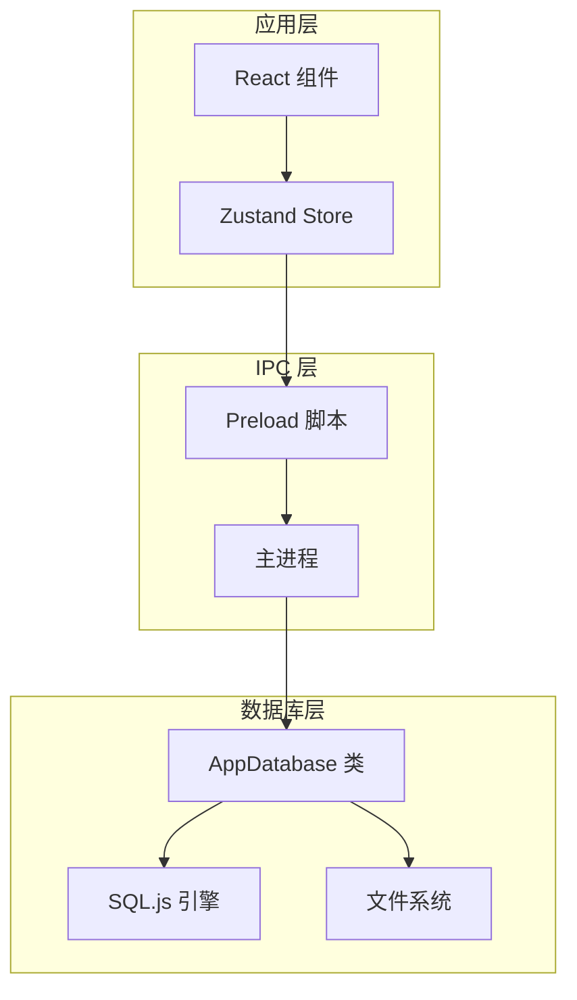
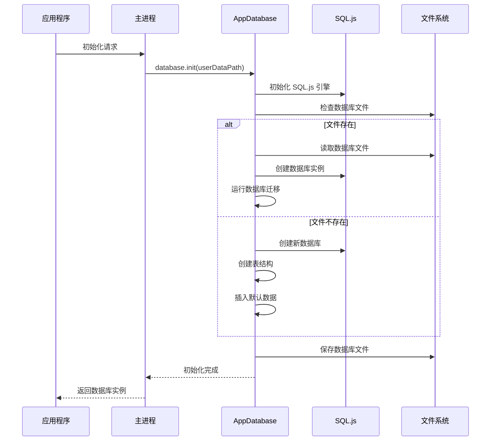
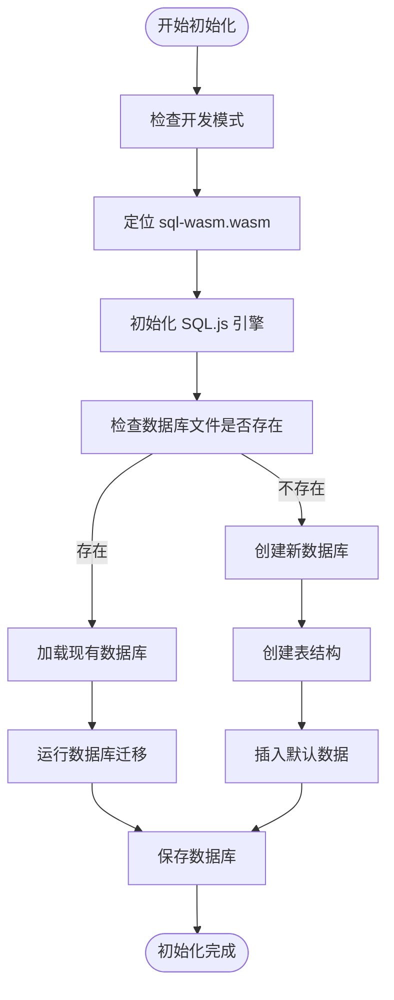
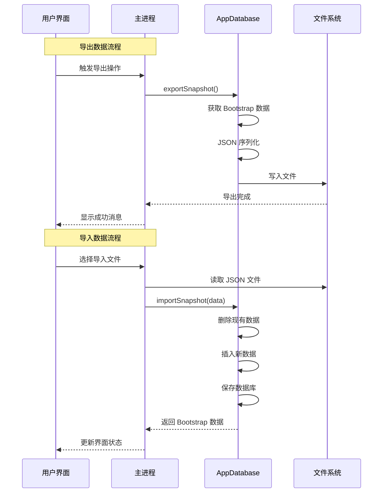
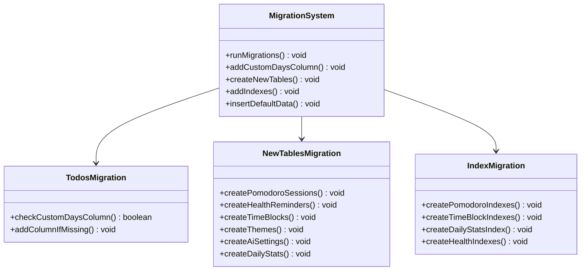
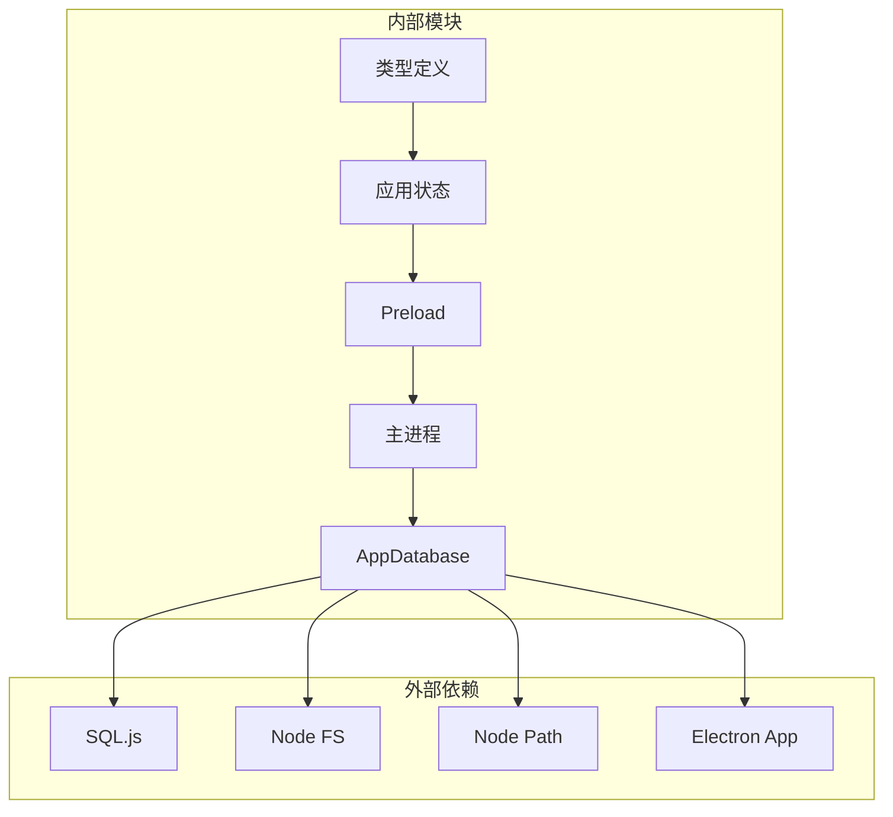

# 数据库问题

<cite>
**本文档引用的文件**
- [db.ts](file://app/electron/db.ts)
- [main.ts](file://app/electron/main.ts)
- [preload.ts](file://app/electron/preload.ts)
- [useAppStore.ts](file://app/src/store/useAppStore.ts)
- [types.ts](file://app/src/types.ts)
</cite>

## 目录
1. [简介](#简介)
2. [项目结构](#项目结构)
3. [核心组件](#核心组件)
4. [架构概览](#架构概览)
5. [详细组件分析](#详细组件分析)
6. [依赖关系分析](#依赖关系分析)
7. [性能考虑](#性能考虑)
8. [故障排除指南](#故障排除指南)
9. [结论](#结论)

## 简介

SnowTodo 是一个基于 Electron 和 React 的桌面待办事项应用，采用 SQL.js 作为本地数据库解决方案。本指南专注于数据库相关的问题诊断和解决，涵盖从初始化失败到性能优化的完整生命周期管理。

## 项目结构

SnowTodo 的数据库架构采用分层设计，主要组件包括：



**图表来源**
- [db.ts:55-90](file://app/electron/db.ts#L55-L90)
- [main.ts:8-10](file://app/electron/main.ts#L8-L10)
- [preload.ts:18-116](file://app/electron/preload.ts#L18-L116)

**章节来源**
- [db.ts:55-90](file://app/electron/db.ts#L55-L90)
- [main.ts:8-10](file://app/electron/main.ts#L8-L10)
- [preload.ts:18-116](file://app/electron/preload.ts#L18-L116)

## 核心组件

### AppDatabase 类

AppDatabase 是整个数据库系统的核心，负责：
- SQL.js 初始化和配置
- 数据库文件管理和迁移
- 数据模型映射和转换
- 数据导入导出功能

### 数据模型

系统支持多种数据实体：
- **待办事项 (Todos)**: 核心任务管理
- **分类 (Categories)**: 任务分类组织
- **标签 (Tags)**: 任务标签系统
- **重复待办 (Recurring Todos)**: 日常模板功能
- **番茄钟 (Pomodoro Sessions)**: 时间管理追踪
- **健康提醒 (Health Reminders)**: 健康管理功能
- **时间块 (Time Blocks)**: 日程安排
- **主题 (Themes)**: 界面定制
- **AI 设置 (AI Settings)**: 智能助手配置

**章节来源**
- [db.ts:299-504](file://app/electron/db.ts#L299-L504)
- [types.ts:168-277](file://app/src/types.ts#L168-L277)

## 架构概览



**图表来源**
- [db.ts:60-90](file://app/electron/db.ts#L60-L90)
- [main.ts:360-369](file://app/electron/main.ts#L360-L369)

## 详细组件分析

### 数据库初始化流程

数据库初始化是整个系统的关键环节，涉及多个步骤：



**图表来源**
- [db.ts:60-90](file://app/electron/db.ts#L60-L90)
- [db.ts:92-297](file://app/electron/db.ts#L92-L297)

### 数据导入导出机制

系统提供了完整的数据导入导出功能：



**图表来源**
- [db.ts:970-1023](file://app/electron/db.ts#L970-L1023)
- [main.ts:195-225](file://app/electron/main.ts#L195-L225)

### 数据库迁移系统

系统内置了强大的数据库迁移机制，确保向后兼容性：



**图表来源**
- [db.ts:92-297](file://app/electron/db.ts#L92-L297)

**章节来源**
- [db.ts:92-297](file://app/electron/db.ts#L92-L297)
- [db.ts:970-1023](file://app/electron/db.ts#L970-L1023)

## 依赖关系分析



**图表来源**
- [db.ts:1-24](file://app/electron/db.ts#L1-L24)
- [main.ts:1-6](file://app/electron/main.ts#L1-L6)
- [preload.ts:1-16](file://app/electron/preload.ts#L1-L16)

**章节来源**
- [db.ts:1-24](file://app/electron/db.ts#L1-L24)
- [main.ts:1-6](file://app/electron/main.ts#L1-L6)
- [preload.ts:1-16](file://app/electron/preload.ts#L1-L16)

## 性能考虑

### 查询优化策略

系统通过以下方式优化数据库性能：

1. **索引优化**: 为常用查询字段创建索引
2. **批量操作**: 减少数据库往返次数
3. **缓存机制**: 在应用层缓存频繁访问的数据
4. **延迟保存**: 合并多次修改后再保存

### 内存管理

SQL.js 在 WebAssembly 环境中运行，需要注意：
- WASM 模块的内存分配
- 大型查询结果的内存管理
- 数据库文件的内存映射

**章节来源**
- [db.ts:384-479](file://app/electron/db.ts#L384-L479)
- [db.ts:197-206](file://app/electron/db.ts#L197-L206)

## 故障排除指南

### SQL.js 初始化失败

#### 问题症状
- 应用启动时数据库无法加载
- 控制台出现 SQL.js 初始化错误
- 应用功能受限或完全不可用

#### 诊断步骤
1. **检查 WASM 文件路径**
   - 开发环境: `node_modules/sql.js/dist/sql-wasm.wasm`
   - 生产环境: `resources/sql-wasm.wasm`

2. **验证文件存在性**
   ```bash
   # 检查开发环境
   ls node_modules/sql.js/dist/sql-wasm.wasm
   
   # 检查生产环境
   ls resources/sql-wasm.wasm
   ```

3. **验证权限**
   - 确保应用程序有读取权限
   - 检查防病毒软件拦截

#### 解决方案
1. **手动复制 WASM 文件**
   ```bash
   # 复制到资源目录
   cp node_modules/sql.js/dist/sql-wasm.wasm resources/
   ```

2. **检查构建配置**
   - 确保打包工具包含 WASM 文件
   - 验证资源路径配置

3. **降级依赖版本**
   ```bash
   npm install sql.js@^1.8.0
   ```

**章节来源**
- [db.ts:63-76](file://app/electron/db.ts#L63-L76)

### 数据库文件损坏

#### 问题症状
- 应用启动时抛出数据库异常
- 查询返回空结果或错误数据
- 数据库操作失败

#### 诊断步骤
1. **检查文件完整性**
   ```bash
   # 验证文件大小
   ls -la snowtodo.db
   
   # 检查文件头
   hexdump -C snowtodo.db | head -20
   ```

2. **尝试数据库修复**
   ```sql
   PRAGMA integrity_check;
   PRAGMA foreign_key_check;
   ```

3. **检查磁盘空间**
   - 确保有足够的可用空间
   - 检查文件系统错误

#### 解决方案
1. **使用 SQLite 工具修复**
   ```bash
   # 安装 sqlite3
   sudo apt-get install sqlite3
   
   # 检查数据库
   sqlite3 snowtodo.db "PRAGMA integrity_check;"
   
   # 修复数据库
   sqlite3 snowtodo.db ".backup backup.db"
   sqlite3 snowtodo.db "VACUUM;"
   ```

2. **数据恢复**
   - 使用备份文件恢复
   - 从最近的导出文件重建

3. **预防措施**
   - 定期备份数据库
   - 监控磁盘空间
   - 实施写入确认机制

**章节来源**
- [db.ts:80-89](file://app/electron/db.ts#L80-L89)

### 连接超时问题

#### 问题症状
- 数据库操作响应缓慢
- 查询执行超时
- 应用界面卡顿

#### 诊断步骤
1. **监控查询性能**
   ```sql
   -- 启用查询计时
   PRAGMA enable_profiler = true;
   
   -- 分析慢查询
   EXPLAIN QUERY PLAN SELECT * FROM todos WHERE status = 'pending';
   ```

2. **检查并发访问**
   - 监控同时进行的数据库操作
   - 检查死锁情况

3. **分析内存使用**
   - 监控 WASM 内存分配
   - 检查内存泄漏

#### 解决方案
1. **优化查询语句**
   ```sql
   -- 添加适当的索引
   CREATE INDEX IF NOT EXISTS idx_todos_status ON todos(status);
   CREATE INDEX IF NOT EXISTS idx_todos_due_date ON todos(due_date);
   ```

2. **实现连接池**
   - 限制并发数据库操作
   - 实施队列机制

3. **调整超时设置**
   ```javascript
   // 增加查询超时时间
   this.db.run('PRAGMA timeout = 30000;');
   ```

**章节来源**
- [db.ts:384-479](file://app/electron/db.ts#L384-L479)

### 权限问题

#### 问题症状
- 无法创建或修改数据库文件
- 文件写入操作失败
- 应用无权访问用户数据目录

#### 诊断步骤
1. **检查用户数据目录权限**
   ```bash
   # 查看目录权限
   ls -la ~/Library/Application\ Support/SnowTodo/
   
   # 检查目录所有权
   stat ~/Library/Application\ Support/SnowTodo/
   ```

2. **验证文件系统支持**
   - 检查 NTFS/FAT32 支持
   - 验证跨平台兼容性

#### 解决方案
1. **修复目录权限**
   ```bash
   # 修复权限
   chmod 755 ~/Library/Application\ Support/SnowTodo/
   chown $USER:$GROUP ~/Library/Application\ Support/SnowTodo/
   ```

2. **使用替代位置**
   ```javascript
   // 尝试其他用户目录
   const alternativePath = path.join(os.homedir(), '.snowtodo');
   ```

3. **实施权限检查**
   ```javascript
   // 启动时检查权限
   try {
       fs.accessSync(userDataPath, fs.constants.W_OK);
   } catch (error) {
       throw new Error('Insufficient permissions for database directory');
   }
   ```

**章节来源**
- [db.ts:78](file://app/electron/db.ts#L78)

### 存储空间不足

#### 问题症状
- 数据库文件无法扩展
- 写入操作失败
- 应用功能受限

#### 诊断步骤
1. **检查磁盘空间**
   ```bash
   # 检查可用空间
   df -h ~/
   
   # 检查特定目录
   du -sh ~/Library/Application\ Support/SnowTodo/
   ```

2. **监控数据库大小**
   ```sql
   -- 检查数据库大小
   PRAGMA page_size;
   PRAGMA page_count;
   ```

#### 解决方案
1. **清理数据库**
   ```sql
   -- 清理归档数据
   DELETE FROM todos WHERE status = 'archived';
   
   -- 优化数据库
   VACUUM;
   ```

2. **实施自动清理**
   ```javascript
   // 定期清理旧数据
   setInterval(() => {
       this.cleanupOldData();
   }, 24 * 60 * 60 * 1000);
   ```

3. **监控存储使用**
   ```javascript
   // 实施存储监控
   const checkStorage = () => {
       const stats = fs.statSync(dbPath);
       if (stats.size > maxSize) {
           this.triggerCleanup();
       }
   };
   ```

**章节来源**
- [db.ts:626-630](file://app/electron/db.ts#L626-L630)

### 数据导入导出错误

#### 问题症状
- JSON 格式验证失败
- 数据完整性检查失败
- 编码问题导致数据损坏

#### 诊断步骤
1. **验证 JSON 格式**
   ```javascript
   try {
       const parsed = JSON.parse(jsonString);
       validateBootstrapData(parsed);
   } catch (error) {
       console.error('JSON parsing failed:', error.message);
   }
   ```

2. **检查数据完整性**
   ```javascript
   const validateBootstrapData = (data) => {
       // 验证必需字段
       if (!data.todos || !Array.isArray(data.todos)) {
           throw new Error('Invalid todos data');
       }
       
       // 验证数据类型
       data.todos.forEach(todo => {
           if (!todo.id || !todo.title) {
               throw new Error('Invalid todo structure');
           }
       });
   };
   ```

3. **处理编码问题**
   ```javascript
   // 确保正确的文件编码
   const raw = fs.readFileSync(filePath, 'utf-8');
   const snapshot = JSON.parse(raw);
   ```

#### 解决方案
1. **实现数据验证**
   ```javascript
   const importSnapshot = (data) => {
       try {
           // 验证数据结构
           this.validateImportData(data);
           
           // 开启事务
           this.db.run('BEGIN IMMEDIATE');
           
           // 删除现有数据
           this.clearExistingData();
           
           // 插入新数据
           this.insertNewData(data);
           
           // 提交事务
           this.db.run('COMMIT');
           
           return this.getBootstrapData();
           
       } catch (error) {
           // 回滚事务
           this.db.run('ROLLBACK');
           throw error;
       }
   };
   ```

2. **处理编码问题**
   ```javascript
   // 处理不同编码格式
   const handleEncoding = (rawData) => {
       try {
           return JSON.parse(rawData);
       } catch (error) {
           // 尝试 UTF-8 解码
           const utf8Data = Buffer.from(rawData).toString('utf-8');
           return JSON.parse(utf8Data);
       }
   };
   ```

3. **实现增量导入**
   ```javascript
   const incrementalImport = (data) => {
       // 检查现有数据
       const existingIds = this.getExistingIds();
       
       // 过滤重复数据
       const newData = data.filter(item => !existingIds.includes(item.id));
       
       // 导入新数据
       this.importData(newData);
   };
   ```

**章节来源**
- [db.ts:974-1023](file://app/electron/db.ts#L974-L1023)

### 数据库性能问题

#### 问题症状
- 查询响应缓慢
- 内存使用过高
- 应用界面卡顿

#### 诊断步骤
1. **分析查询性能**
   ```sql
   -- 启用查询分析
   EXPLAIN QUERY PLAN SELECT * FROM todos WHERE status = 'pending';
   
   -- 检查索引使用
   PRAGMA index_info(idx_todos_status);
   ```

2. **监控内存使用**
   ```javascript
   // 监控 WASM 内存
   const getMemoryUsage = () => {
       // 获取内存统计信息
       return this.sql.getMemoryUsage();
   };
   ```

3. **检查索引使用情况**
   ```sql
   -- 分析索引效率
   ANALYZE;
   PRAGMA index_info(table_name);
   ```

#### 解决方案
1. **优化查询语句**
   ```sql
   -- 使用参数化查询
   const stmt = this.db.prepare(
       "SELECT * FROM todos WHERE status = ? AND due_date <= ?"
   );
   
   // 预编译查询
   const queryTodos = (status, date) => {
       stmt.run(status, date);
       return stmt.getAsObject();
   };
   ```

2. **实施查询缓存**
   ```javascript
   class QueryCache {
       constructor() {
           this.cache = new Map();
           this.ttl = 5 * 60 * 1000; // 5分钟
       }
       
       get(key) {
           const item = this.cache.get(key);
           if (item && Date.now() - item.timestamp < this.ttl) {
               return item.data;
           }
           return null;
       }
       
       set(key, data) {
           this.cache.set(key, {
               data,
               timestamp: Date.now()
           });
       }
   }
   ```

3. **优化索引策略**
   ```sql
   -- 创建复合索引
   CREATE INDEX IF NOT EXISTS idx_todos_status_due_date 
   ON todos(status, due_date);
   
   -- 优化常用查询
   CREATE INDEX IF NOT EXISTS idx_todos_category_status 
   ON todos(category_id, status);
   ```

**章节来源**
- [db.ts:882-930](file://app/electron/db.ts#L882-L930)
- [db.ts:384-479](file://app/electron/db.ts#L384-L479)

### 数据同步和备份恢复

#### 问题症状
- 并发访问冲突
- 事务处理异常
- 数据不一致

#### 诊断步骤
1. **检查并发访问**
   ```javascript
   // 实施读写锁
   class DatabaseLock {
       constructor() {
           this.readers = 0;
           this.writer = false;
           this.waiting = [];
       }
       
       acquireRead() {
           if (!this.writer) {
               this.readers++;
               return true;
           }
           return false;
       }
       
       releaseRead() {
           this.readers--;
       }
       
       acquireWrite() {
           if (this.readers === 0 && !this.writer) {
               this.writer = true;
               return true;
           }
           return false;
       }
       
       releaseWrite() {
           this.writer = false;
       }
   }
   ```

2. **监控事务状态**
   ```javascript
   // 实施事务监控
   const monitorTransactions = () => {
       const activeTx = this.db.exec('PRAGMA transaction_state');
       return activeTx[0]?.values?.length > 0;
   };
   ```

#### 解决方案
1. **实现事务管理**
   ```javascript
   const executeInTransaction = async (operation) => {
       try {
           this.db.run('BEGIN IMMEDIATE');
           const result = await operation();
           this.db.run('COMMIT');
           return result;
       } catch (error) {
           this.db.run('ROLLBACK');
           throw error;
       }
   };
   ```

2. **实施备份策略**
   ```javascript
   const createBackup = async () => {
       const timestamp = new Date().toISOString();
       const backupPath = `${dbPath}.${timestamp}.bak`;
       
       // 创建数据库副本
       const backupData = this.db.export();
       fs.writeFileSync(backupPath, Buffer.from(backupData));
       
       return backupPath;
   };
   ```

3. **处理并发冲突**
   ```javascript
   const handleConcurrency = async (operation, maxRetries = 3) => {
       for (let i = 0; i < maxRetries; i++) {
           try {
               return await operation();
           } catch (error) {
               if (error.message.includes('database is locked')) {
                   await sleep(100 * (i + 1)); // 指数退避
                   continue;
               }
               throw error;
           }
       }
   };
   ```

**章节来源**
- [db.ts:1704-1715](file://app/electron/db.ts#L1704-L1715)

### 数据库迁移和版本升级

#### 问题症状
- 升级后数据丢失
- 新增字段缺失
- 表结构不兼容

#### 诊断步骤
1. **检查迁移状态**
   ```javascript
   const checkMigrationStatus = () => {
       const migrations = [
           'custom_days_column',
           'new_tables',
           'indexes',
           'default_data'
       ];
       
       const results = {};
       migrations.forEach(migration => {
           results[migration] = this.checkMigration(migration);
       });
       
       return results;
   };
   ```

2. **验证数据完整性**
   ```javascript
   const validateMigration = () => {
       const checks = [
           this.validateTodosTable(),
           this.validateNewTables(),
           this.validateIndexes()
       ];
       
       return checks.every(check => check);
   };
   ```

#### 解决方案
1. **实施安全迁移**
   ```javascript
   const safeMigration = async () => {
       try {
           // 创建迁移备份
           await this.createMigrationBackup();
           
           // 执行迁移
           await this.runMigrations();
           
           // 验证迁移结果
           if (await this.validateMigration()) {
               await this.cleanupMigrationBackup();
           } else {
               throw new Error('Migration validation failed');
           }
       } catch (error) {
           // 回滚到备份
           await this.rollbackMigration();
           throw error;
       }
   };
   ```

2. **实现回滚策略**
   ```javascript
   const rollbackMigration = async () => {
       // 从备份恢复
       const backupData = await this.readMigrationBackup();
       this.db = new this.sql.Database(backupData);
       
       // 清理备份文件
       await this.cleanupMigrationBackup();
   };
   ```

3. **监控迁移进度**
   ```javascript
   const monitorMigrationProgress = (migrationName) => {
       console.log(`Starting migration: ${migrationName}`);
       
       const startTime = Date.now();
       const result = this.runSingleMigration(migrationName);
       const endTime = Date.now();
       
       console.log(`Migration completed in ${(endTime - startTime)/1000}s`);
       
       return result;
   };
   ```

**章节来源**
- [db.ts:92-297](file://app/electron/db.ts#L92-L297)

## 结论

SnowTodo 的数据库系统通过 SQL.js 提供了可靠的本地数据存储解决方案。通过实施完善的故障排除策略、性能优化措施和安全的迁移机制，可以确保系统的稳定性和可靠性。

关键要点包括：
- **初始化健壮性**: 确保 WASM 文件正确部署和访问
- **数据完整性**: 实施严格的验证和备份机制
- **性能优化**: 通过索引、缓存和查询优化提升性能
- **故障恢复**: 建立完整的备份、恢复和回滚策略
- **监控告警**: 实施实时监控和异常检测机制

通过遵循本指南中的最佳实践，开发者可以有效预防和解决大多数数据库相关问题，确保 SnowTodo 应用的稳定运行。