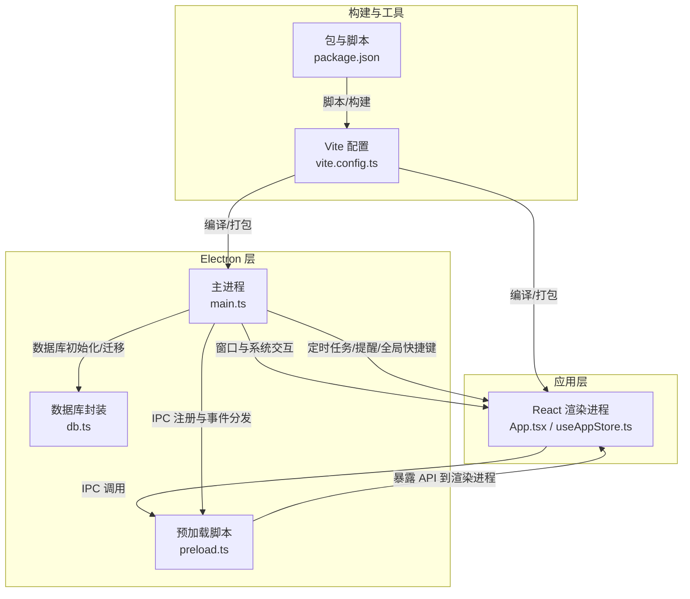
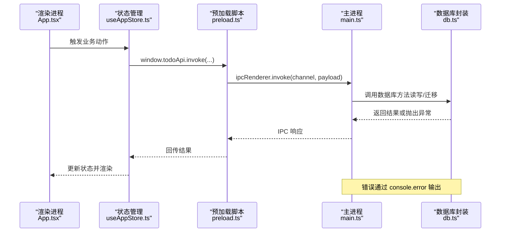
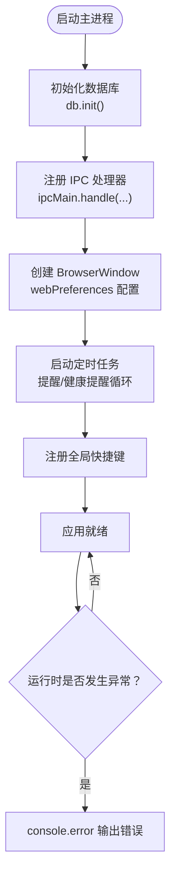
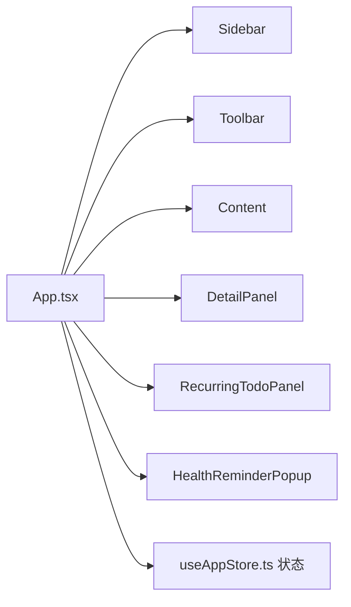
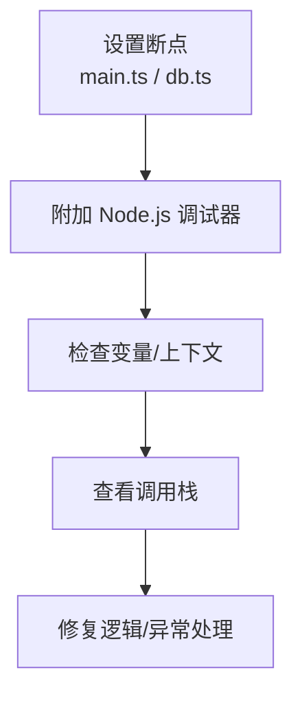
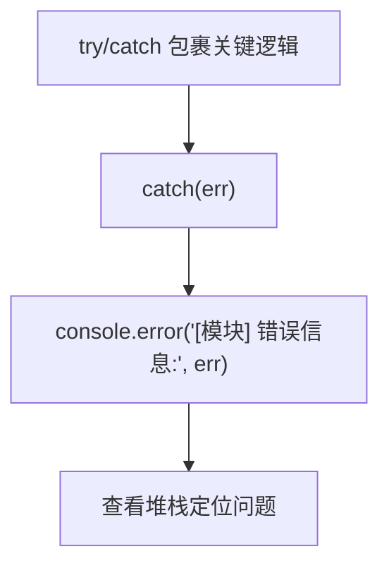
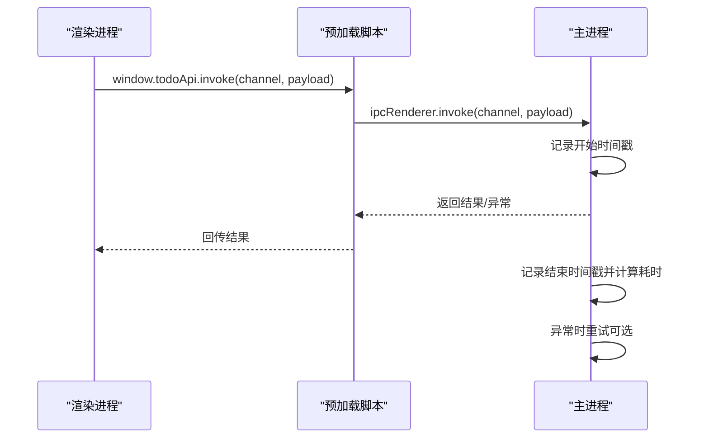
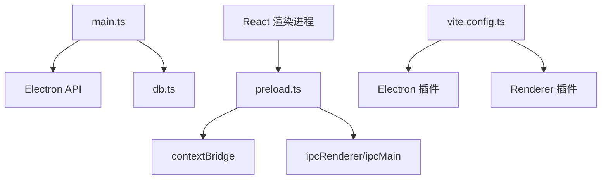

# 调试工具使用

<cite>
**本文引用的文件**
- [main.ts](file://app/electron/main.ts)
- [preload.ts](file://app/electron/preload.ts)
- [db.ts](file://app/electron/db.ts)
- [vite.config.ts](file://app/vite.config.ts)
- [package.json](file://app/package.json)
- [App.tsx](file://app/src/App.tsx)
- [useAppStore.ts](file://app/src/store/useAppStore.ts)
- [types.ts](file://app/src/types.ts)
</cite>

## 目录
1. [简介](#简介)
2. [项目结构](#项目结构)
3. [核心组件](#核心组件)
4. [架构总览](#架构总览)
5. [详细组件分析](#详细组件分析)
6. [依赖关系分析](#依赖关系分析)
7. [性能与调试建议](#性能与调试建议)
8. [故障排查指南](#故障排查指南)
9. [结论](#结论)
10. [附录](#附录)

## 简介
本指南面向 SnowTodo 的开发者与维护者，提供一套完整的调试工具使用方法，覆盖：
- Electron DevTools 的主进程与渲染进程调试、性能分析、内存快照
- React DevTools 在 Electron 环境下的配置与使用
- Node.js 调试器集成与断点、变量检查、调用栈分析
- 日志系统配置与使用（不同级别日志、聚合、错误堆栈）
- 网络请求调试（API 调用监控、响应时间分析、错误重试）
- 第三方工具集成（性能分析、内存分析、网络监控）

本指南基于仓库中的实际代码进行分析，并提供可操作的步骤与可视化图表，帮助快速定位问题并优化应用。

## 项目结构
SnowTodo 采用 Electron + React + Vite 的现代桌面应用架构，核心目录与职责如下：
- app/electron：Electron 主进程、预加载脚本、数据库封装
- app/src：React 应用源码，包含组件、状态管理、类型定义
- app/vite.config.ts：构建与插件配置，支持 Electron 主进程与渲染进程分离
- app/package.json：脚本与构建配置，包含 Electron 构建与打包参数

图表来源
- [main.ts:18-52](file://app/electron/main.ts#L18-L52)
- [preload.ts:18-116](file://app/electron/preload.ts#L18-L116)
- [db.ts:60-90](file://app/electron/db.ts#L60-L90)
- [vite.config.ts:6-32](file://app/vite.config.ts#L6-L32)
- [package.json:9-14](file://app/package.json#L9-L14)

章节来源
- [main.ts:18-52](file://app/electron/main.ts#L18-L52)
- [preload.ts:18-116](file://app/electron/preload.ts#L18-L116)
- [vite.config.ts:6-32](file://app/vite.config.ts#L6-L32)
- [package.json:9-14](file://app/package.json#L9-L14)

## 核心组件
- 主进程（main.ts）：负责窗口创建、托盘、全局快捷键、定时提醒、IPC 注册与事件分发、应用生命周期管理。
- 预加载脚本（preload.ts）：通过 contextBridge 暴露受控 API 至渲染进程，统一管理 IPC 调用与事件监听。
- 数据库封装（db.ts）：封装 SQL.js 初始化、WASM 资源定位、表结构与迁移、默认数据注入。
- React 应用（App.tsx / useAppStore.ts）：应用入口与状态管理，通过 window.todoApi 与主进程通信。
- 构建配置（vite.config.ts / package.json）：Electron 主进程与渲染进程分离构建，支持开发与生产环境。

章节来源
- [main.ts:360-391](file://app/electron/main.ts#L360-L391)
- [preload.ts:18-116](file://app/electron/preload.ts#L18-L116)
- [db.ts:60-90](file://app/electron/db.ts#L60-L90)
- [App.tsx:24-34](file://app/src/App.tsx#L24-L34)
- [useAppStore.ts:237-246](file://app/src/store/useAppStore.ts#L237-L246)
- [vite.config.ts:6-32](file://app/vite.config.ts#L6-L32)
- [package.json:9-14](file://app/package.json#L9-L14)

## 架构总览
下图展示了从渲染进程发起 IPC 请求到主进程处理与数据库交互的端到端流程，以及日志输出位置与错误捕获点。

图表来源
- [App.tsx:24-34](file://app/src/App.tsx#L24-L34)
- [useAppStore.ts:295-298](file://app/src/store/useAppStore.ts#L295-L298)
- [preload.ts:18-116](file://app/electron/preload.ts#L18-L116)
- [main.ts:227-358](file://app/electron/main.ts#L227-L358)
- [db.ts:92-200](file://app/electron/db.ts#L92-L200)

## 详细组件分析

### 主进程调试（Electron DevTools）
- 启动方式：开发模式下，主进程通过 Vite 开发服务器加载渲染页面；可通过附加 DevTools 调试主进程。
- 关键调试点：
  - 窗口创建与 webPreferences 配置（上下文隔离、禁用 Node 集成）
  - IPC 注册与事件分发（提醒、健康提醒、Pomodoro、AI、时间块、统计数据等）
  - 定时任务（提醒循环、健康提醒循环）、全局快捷键注册
  - 错误捕获与日志输出（try/catch 包裹与 console.error）

图表来源
- [main.ts:360-391](file://app/electron/main.ts#L360-L391)
- [main.ts:120-177](file://app/electron/main.ts#L120-L177)
- [main.ts:179-193](file://app/electron/main.ts#L179-L193)
- [db.ts:60-90](file://app/electron/db.ts#L60-L90)

章节来源
- [main.ts:18-52](file://app/electron/main.ts#L18-L52)
- [main.ts:227-358](file://app/electron/main.ts#L227-L358)
- [main.ts:120-177](file://app/electron/main.ts#L120-L177)
- [main.ts:179-193](file://app/electron/main.ts#L179-L193)
- [db.ts:60-90](file://app/electron/db.ts#L60-L90)

### 渲染进程调试（React + Electron）
- React DevTools：在开发模式下，渲染进程由 Vite 提供，React DevTools 可直接检测到组件树。
- 组件树检查：通过 React DevTools 查看 App.tsx 及其子组件（Sidebar、Toolbar、Content、DetailPanel 等）的状态与 props。
- 状态检查：使用 React DevTools 的状态面板查看 useAppStore 中的状态字段（todos、settings、pomodoro、healthReminders 等）。
- 性能分析：结合 React Profiler 与浏览器性能面板，观察组件渲染耗时与重渲染热点。

图表来源
- [App.tsx:40-56](file://app/src/App.tsx#L40-L56)
- [useAppStore.ts:30-80](file://app/src/store/useAppStore.ts#L30-L80)

章节来源
- [App.tsx:11-56](file://app/src/App.tsx#L11-L56)
- [useAppStore.ts:181-508](file://app/src/store/useAppStore.ts#L181-L508)

### Node.js 调试器集成
- 断点设置：在主进程文件（main.ts、db.ts）中添加断点，使用 Node.js 调试器附加到主进程。
- 变量检查：在断点处检查数据库连接、SQL 查询、IPC 请求参数与返回值。
- 调用栈分析：定位异常发生的具体函数链路，结合 console.error 输出的错误信息进行回溯。

图表来源
- [main.ts:120-177](file://app/electron/main.ts#L120-L177)
- [db.ts:92-200](file://app/electron/db.ts#L92-L200)

章节来源
- [main.ts:120-177](file://app/electron/main.ts#L120-L177)
- [db.ts:92-200](file://app/electron/db.ts#L92-L200)

### 日志系统配置与使用
- 日志级别：项目中使用 console.error 输出严重错误，console.log 输出一般信息（如数据库迁移提示）。
- 日志聚合：建议在开发阶段将控制台输出重定向至日志文件，便于聚合分析。
- 错误堆栈：异常捕获点集中在定时任务与 IPC 处理器中，确保错误信息包含堆栈以便定位。

图表来源
- [main.ts:120-177](file://app/electron/main.ts#L120-L177)
- [db.ts:92-200](file://app/electron/db.ts#L92-L200)

章节来源
- [main.ts:120-177](file://app/electron/main.ts#L120-L177)
- [db.ts:92-200](file://app/electron/db.ts#L92-L200)

### 网络请求调试
- API 调用监控：渲染进程通过 window.todoApi 发起 IPC 调用，主进程在 ipcMain.handle 中实现具体逻辑。
- 响应时间分析：可在主进程对 IPC 请求前后打点，记录耗时并输出日志。
- 错误重试机制：对于数据库操作或外部资源访问，可在异常时进行有限重试并记录重试次数与原因。

图表来源
- [preload.ts:18-116](file://app/electron/preload.ts#L18-L116)
- [main.ts:227-358](file://app/electron/main.ts#L227-L358)

章节来源
- [preload.ts:18-116](file://app/electron/preload.ts#L18-L116)
- [main.ts:227-358](file://app/electron/main.ts#L227-L358)

### 第三方工具集成
- 性能分析：使用 Chrome DevTools Performance 面板分析渲染进程与主进程的 CPU 占用与长任务。
- 内存分析：使用 Memory 面板进行堆快照对比，定位内存泄漏与大对象持有。
- 网络监控：在 Network 面板观察 IPC 请求与资源加载情况（注意：IPC 不在传统网络面板中显示）。
- 数据库分析：结合 SQL.js 的查询执行计划与索引使用情况，优化数据库访问路径。

## 依赖关系分析
- 主进程依赖 Electron API（BrowserWindow、ipcMain、globalShortcut、Tray、Menu、Notification）与 SQL.js。
- 预加载脚本通过 contextBridge 将受控 API 暴露给渲染进程，避免直接暴露 Node.js API。
- 构建配置启用 vite-plugin-electron 与 vite-plugin-electron-renderer，实现主进程与渲染进程的独立构建与热更新。

图表来源
- [main.ts:1-10](file://app/electron/main.ts#L1-L10)
- [preload.ts:1-16](file://app/electron/preload.ts#L1-L16)
- [vite.config.ts:6-32](file://app/vite.config.ts#L6-L32)

章节来源
- [main.ts:1-10](file://app/electron/main.ts#L1-L10)
- [preload.ts:1-16](file://app/electron/preload.ts#L1-L16)
- [vite.config.ts:6-32](file://app/vite.config.ts#L6-L32)

## 性能与调试建议
- 使用 React Profiler 识别重渲染热点，减少不必要的状态更新。
- 对数据库操作进行批量处理与索引优化，避免在主线程执行重型 SQL。
- 合理使用定时器与节流，避免频繁触发的 IPC 导致 UI 卡顿。
- 在开发阶段开启严格模式与 ESLint 规则，提前发现潜在问题。

## 故障排查指南
- 主进程异常：检查定时任务与 IPC 注册处的 try/catch 是否覆盖，关注 console.error 输出。
- 数据库初始化失败：确认 sql-wasm.wasm 路径解析正确，开发与生产环境路径差异需分别处理。
- IPC 调用超时：在主进程对 IPC 请求增加超时与重试策略，并记录耗时日志。
- 渲染进程卡顿：使用性能面板定位长任务，必要时拆分计算逻辑或延迟执行。

章节来源
- [main.ts:120-177](file://app/electron/main.ts#L120-L177)
- [db.ts:60-90](file://app/electron/db.ts#L60-L90)
- [db.ts:92-200](file://app/electron/db.ts#L92-L200)

## 结论
通过合理利用 Electron DevTools、React DevTools、Node.js 调试器与日志系统，可以高效定位与解决 SnowTodo 的各类问题。配合性能与内存分析工具，持续优化应用的稳定性与用户体验。建议在开发流程中固化调试规范与日志策略，确保问题可追踪、可复现、可修复。

## 附录
- 类型定义参考：用于理解 IPC 参数与返回值的数据结构（如 Settings、PomodoroSettings、HealthReminder、AISettings、TimeBlock、DailyStats 等）。
- 构建与脚本：开发、预览、构建与打包命令，以及 Electron Builder 的目标平台与签名配置。

章节来源
- [types.ts:161-278](file://app/src/types.ts#L161-L278)
- [package.json:9-14](file://app/package.json#L9-L14)