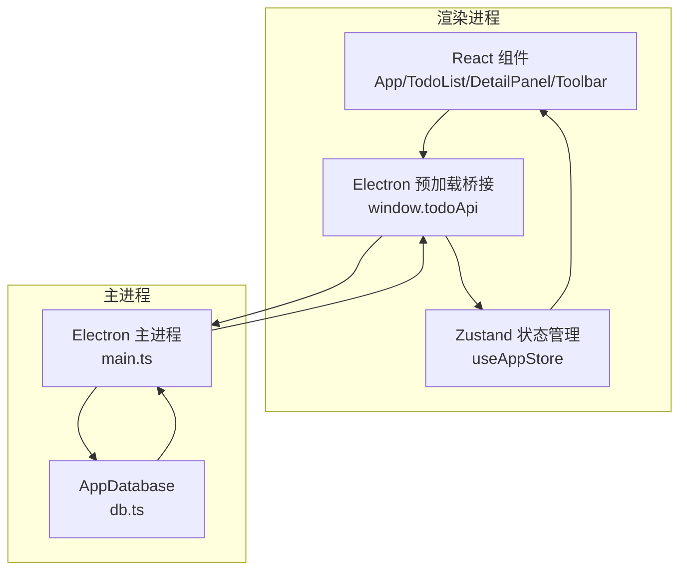
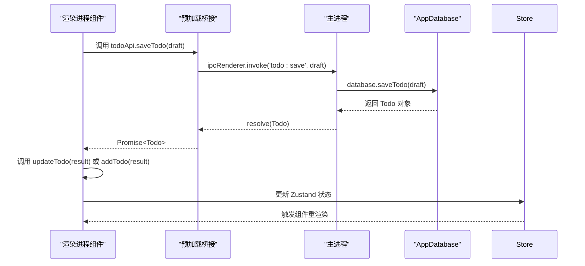
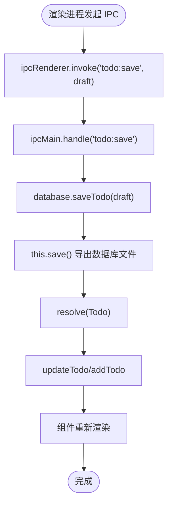
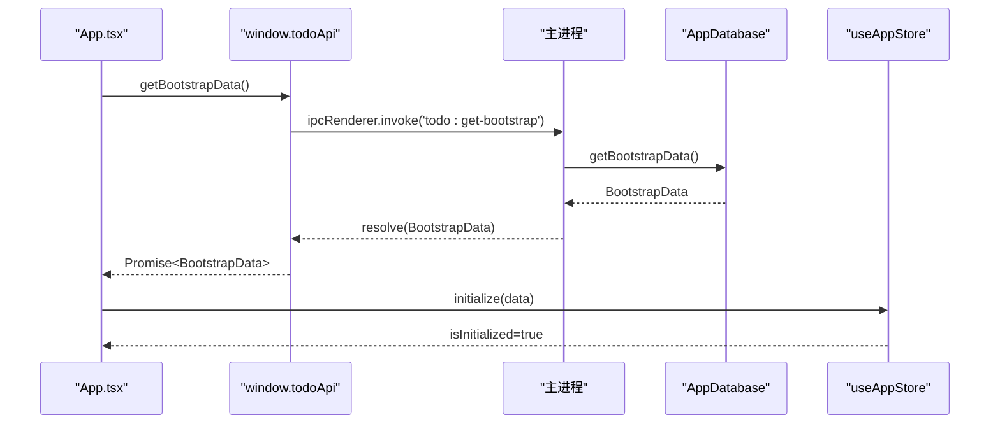
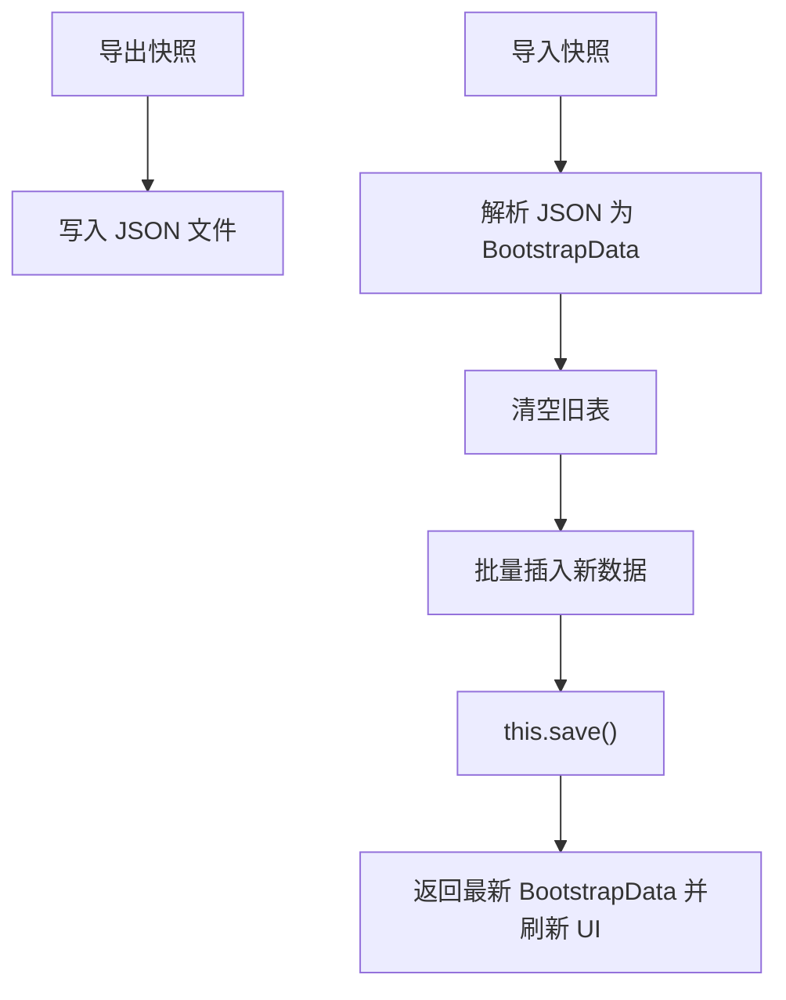
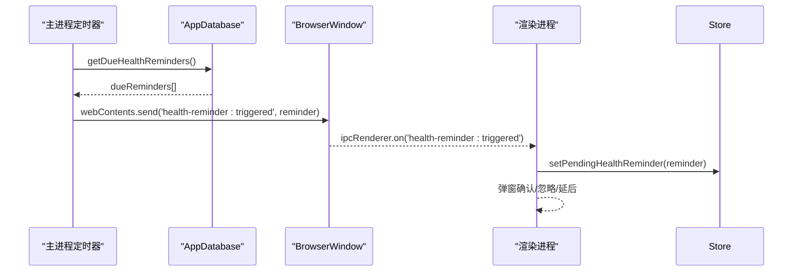
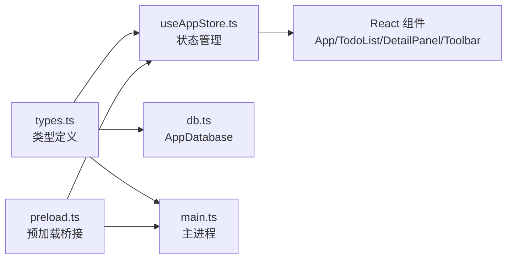

# 数据同步策略

<cite>
**本文档引用的文件**
- [main.ts](file://app/electron/main.ts)
- [db.ts](file://app/electron/db.ts)
- [preload.ts](file://app/electron/preload.ts)
- [useAppStore.ts](file://app/src/store/useAppStore.ts)
- [types.ts](file://app/src/types.ts)
- [App.tsx](file://app/src/App.tsx)
- [TodoList.tsx](file://app/src/components/Content/TodoList.tsx)
- [DetailPanel.tsx](file://app/src/components/DetailPanel/DetailPanel.tsx)
- [Toolbar.tsx](file://app/src/components/Toolbar/Toolbar.tsx)
</cite>

## 目录
1. [简介](#简介)
2. [项目结构](#项目结构)
3. [核心组件](#核心组件)
4. [架构总览](#架构总览)
5. [详细组件分析](#详细组件分析)
6. [依赖关系分析](#依赖关系分析)
7. [性能考虑](#性能考虑)
8. [故障排除指南](#故障排除指南)
9. [结论](#结论)

## 简介
本文件系统性梳理 SnowTodo 的数据同步策略，覆盖主进程与渲染进程间的 IPC 数据传输与状态更新、数据库变更到状态管理的同步流程、离线数据处理策略、实时数据同步与并发控制、数据备份与恢复机制，以及性能优化与故障排除方法。目标是帮助开发者快速理解并维护数据一致性与用户体验。

## 项目结构
SnowTodo 采用 Electron + React 架构，数据流从渲染进程通过 IPC 调用主进程数据库接口，主进程执行 SQL.js 持久化，渲染进程使用 Zustand 管理全局状态，并驱动 UI 组件响应。

**图表来源**
- [main.ts:227-358](file://app/electron/main.ts#L227-L358)
- [db.ts:55-90](file://app/electron/db.ts#L55-L90)
- [preload.ts:18-116](file://app/electron/preload.ts#L18-L116)
- [useAppStore.ts:181-508](file://app/src/store/useAppStore.ts#L181-L508)

**章节来源**
- [main.ts:18-52](file://app/electron/main.ts#L18-L52)
- [preload.ts:1-117](file://app/electron/preload.ts#L1-L117)
- [useAppStore.ts:1-604](file://app/src/store/useAppStore.ts#L1-L604)

## 核心组件
- 主进程数据库服务：封装 SQL.js，提供事务性持久化与迁移能力，负责数据变更与快照导入导出。
- 预加载桥接层：暴露安全的 IPC 接口给渲染进程，统一参数校验与返回值类型。
- 渲染进程状态管理：Zustand Store 管理应用状态，包含基础数据、UI 状态、模块化业务状态（番茄钟、健康提醒、时间块、项目单元格等）。
- React 组件：基于 Store 的计算派生状态与副作用，驱动 UI 响应与用户交互。

**章节来源**
- [db.ts:55-90](file://app/electron/db.ts#L55-L90)
- [preload.ts:18-116](file://app/electron/preload.ts#L18-L116)
- [useAppStore.ts:25-176](file://app/src/store/useAppStore.ts#L25-L176)

## 架构总览
渲染进程通过 window.todoApi 发起 IPC 请求，主进程在 ipcMain.handle 中调用 AppDatabase 方法执行数据库操作，完成后将结果通过 IPC 返回渲染进程，渲染进程更新 Zustand Store 并驱动 UI。

**图表来源**
- [preload.ts:23-24](file://app/electron/preload.ts#L23-L24)
- [main.ts:229-229](file://app/electron/main.ts#L229-L229)
- [db.ts:716-796](file://app/electron/db.ts#L716-L796)
- [useAppStore.ts:264-272](file://app/src/store/useAppStore.ts#L264-L272)

## 详细组件分析

### 主进程与数据库同步（IPC 通信与状态更新）
- IPC 注册：主进程在 registerIpc 中集中注册各类 IPC 处理函数，涵盖待办 CRUD、设置更新、提醒、番茄钟、健康提醒、时间块、项目单元格、统计数据、图片管理等。
- 数据持久化：AppDatabase 在每次写入后调用 save 将内存数据库导出为文件，确保落盘。
- 状态更新：渲染进程收到 IPC 返回值后，调用 Store 的相应动作（如 updateTodo/addTodo/setTodos），触发 UI 重渲染。

**图表来源**
- [main.ts:227-233](file://app/electron/main.ts#L227-L233)
- [db.ts:716-796](file://app/electron/db.ts#L716-L796)
- [useAppStore.ts:264-272](file://app/src/store/useAppStore.ts#L264-L272)

**章节来源**
- [main.ts:227-358](file://app/electron/main.ts#L227-L358)
- [db.ts:626-630](file://app/electron/db.ts#L626-L630)
- [useAppStore.ts:264-272](file://app/src/store/useAppStore.ts#L264-L272)

### 数据库变更到状态管理的同步流程
- 初始化：应用启动时，渲染进程调用 getBootstrapData 获取初始数据，主进程返回 todos/categories/tags/settings，Store.initialize 完成一次性初始化。
- 实时更新：用户在 DetailPanel 编辑保存、TodoList 切换完成状态、Toolbar 搜索过滤等操作，均通过 IPC 写入数据库，随后 Store 动作更新本地状态，组件响应变化。
- 计算派生：Store 提供 getFilteredTodos/getTodayTodos 等计算函数，基于当前状态与筛选条件动态生成视图所需数据。

**图表来源**
- [App.tsx:24-34](file://app/src/App.tsx#L24-L34)
- [main.ts:228-228](file://app/electron/main.ts#L228-L228)
- [db.ts:676-714](file://app/electron/db.ts#L676-L714)
- [useAppStore.ts:237-246](file://app/src/store/useAppStore.ts#L237-L246)

**章节来源**
- [App.tsx:24-34](file://app/src/App.tsx#L24-L34)
- [useAppStore.ts:237-246](file://app/src/store/useAppStore.ts#L237-L246)

### 离线数据处理策略
- 本地缓存：Store 在渲染进程中维护完整应用状态，无需每次渲染都请求主进程，提升交互流畅度。
- 快照导入导出：支持全量快照导出（JSON）与导入（BootstrapData），用于跨设备迁移或备份恢复。
- 数据合并：导入时先清空旧数据再写入新数据，避免冲突；导入后立即应用设置并刷新 UI。

**图表来源**
- [main.ts:195-225](file://app/electron/main.ts#L195-L225)
- [db.ts:970-1023](file://app/electron/db.ts#L970-L1023)

**章节来源**
- [main.ts:195-225](file://app/electron/main.ts#L195-L225)
- [db.ts:970-1023](file://app/electron/db.ts#L970-L1023)

### 实时数据同步与并发控制
- 主进程单实例：Electron 主进程作为数据库唯一写入入口，避免多实例并发写入导致的数据竞争。
- IPC 同步：所有写操作通过 ipcRenderer.invoke 同步等待主进程返回，保证 UI 与数据库的一致性。
- 健康提醒与番茄钟：主进程定时器扫描数据库生成提醒事件与每日待办，通过 webContents.send 推送事件到渲染进程，渲染进程更新状态并弹窗提示。
- 锁机制：未实现显式数据库锁；通过主进程串行化处理 IPC 请求，避免竞态。

**图表来源**
- [main.ts:161-177](file://app/electron/main.ts#L161-L177)
- [db.ts:1406-1457](file://app/electron/db.ts#L1406-L1457)
- [preload.ts:83-87](file://app/electron/preload.ts#L83-L87)

**章节来源**
- [main.ts:120-177](file://app/electron/main.ts#L120-L177)
- [db.ts:1406-1457](file://app/electron/db.ts#L1406-L1457)
- [preload.ts:83-87](file://app/electron/preload.ts#L83-L87)

### 数据备份与恢复策略
- 全量备份：导出当前数据库快照为 JSON 文件，包含 todos/categories/tags/settings。
- 增量备份：当前代码未实现增量备份；可通过定期导出来替代。
- 恢复流程：导入 JSON 快照，主进程重建数据库并返回最新 BootstrapData，渲染进程重新初始化状态。

**章节来源**
- [main.ts:195-225](file://app/electron/main.ts#L195-L225)
- [db.ts:970-1023](file://app/electron/db.ts#L970-L1023)

### 性能优化建议
- 批量操作：对频繁的 UI 更新（如列表滚动）可采用节流/防抖策略，减少 Store 更新频率。
- 延迟更新：对非关键路径的状态更新（如搜索输入）可延迟到用户停止输入后再触发。
- 内存管理：避免在 Store 中存储超大数据结构；对图片等二进制数据建议仅存储引用并在需要时按需加载。
- 索引优化：数据库已建立常用索引（如 todos 状态、due_date、索引等），可结合查询模式进一步评估新增索引。

[本节为通用指导，无需特定文件引用]

## 依赖关系分析

**图表来源**
- [types.ts:1-278](file://app/src/types.ts#L1-L278)
- [useAppStore.ts:1-604](file://app/src/store/useAppStore.ts#L1-L604)
- [db.ts:1-1825](file://app/electron/db.ts#L1-L1825)
- [main.ts:1-391](file://app/electron/main.ts#L1-L391)
- [preload.ts:1-117](file://app/electron/preload.ts#L1-L117)

**章节来源**
- [types.ts:1-278](file://app/src/types.ts#L1-L278)
- [useAppStore.ts:1-604](file://app/src/store/useAppStore.ts#L1-L604)
- [db.ts:1-1825](file://app/electron/db.ts#L1-L1825)
- [main.ts:1-391](file://app/electron/main.ts#L1-L391)
- [preload.ts:1-117](file://app/electron/preload.ts#L1-L117)

## 性能考虑
- IPC 成本：频繁的 invoke/call 会产生开销，建议合并多次小更新为一次批量操作。
- 数据库写入：每次写入都会触发 save 导出，建议在高频场景下进行去抖或合并写入。
- 渲染性能：Store 中的计算派生函数应避免昂贵运算，必要时引入 memo 化或缓存中间结果。
- 图片处理：图片上传与预览建议异步处理，避免阻塞主线程。

[本节为通用指导，无需特定文件引用]

## 故障排除指南
- IPC 调用失败：检查主进程是否正确注册对应 handle，渲染进程是否正确调用 window.todoApi 方法。
- 数据未更新：确认主进程数据库写入成功并调用了 save，渲染进程是否调用了相应的 Store 动作。
- 健康提醒未触发：检查主进程定时器是否运行，数据库中健康提醒配置是否有效，渲染进程是否注册了 onHealthReminderTriggered。
- 导入失败：确认 JSON 快照格式符合 BootstrapData，主进程导入逻辑是否抛出异常。

**章节来源**
- [main.ts:227-358](file://app/electron/main.ts#L227-L358)
- [db.ts:970-1023](file://app/electron/db.ts#L970-L1023)
- [preload.ts:83-87](file://app/electron/preload.ts#L83-L87)

## 结论
SnowTodo 的数据同步以主进程为中心，通过 IPC 将渲染进程的用户操作转化为数据库变更，再由 Store 驱动 UI 响应。系统具备完善的快照导入导出能力，满足离线与迁移需求；定时器机制保障提醒与每日待办的实时性。建议在高频写入场景下进一步优化 IPC 与数据库写入策略，以获得更佳性能与稳定性。