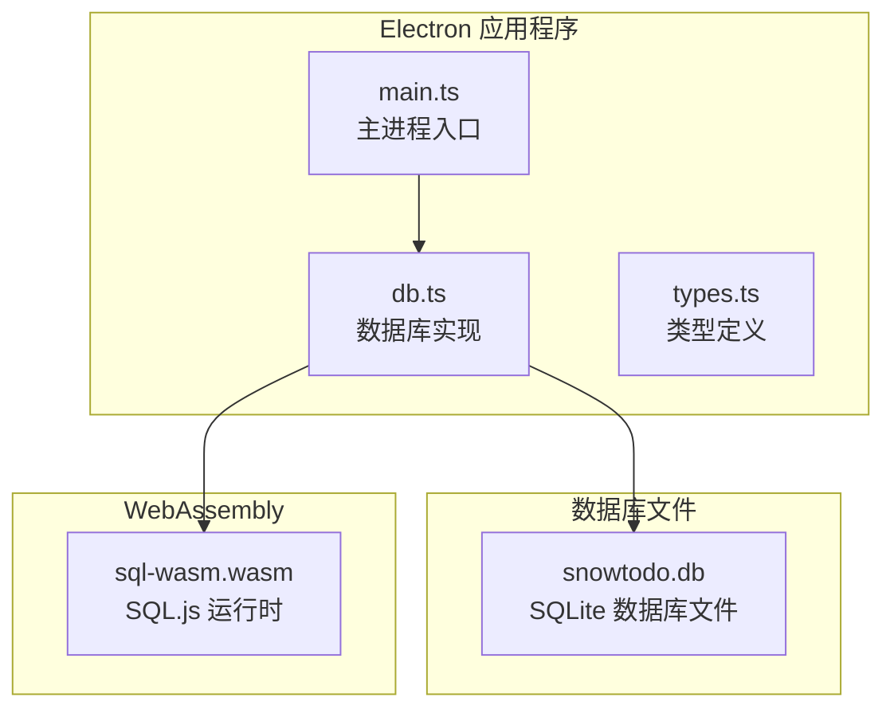
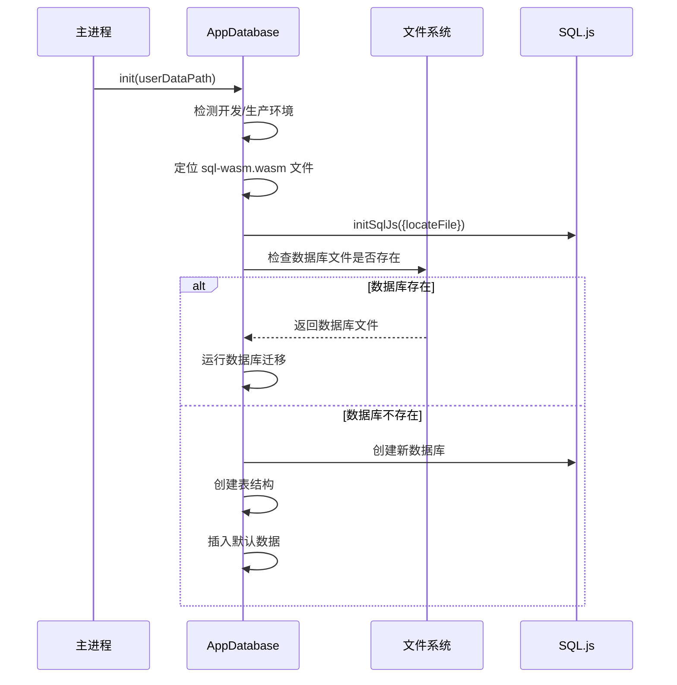
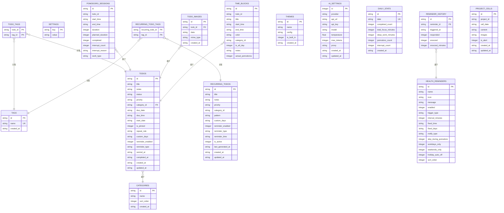
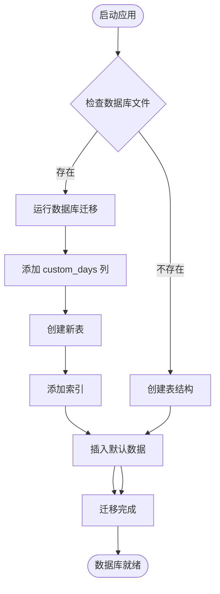
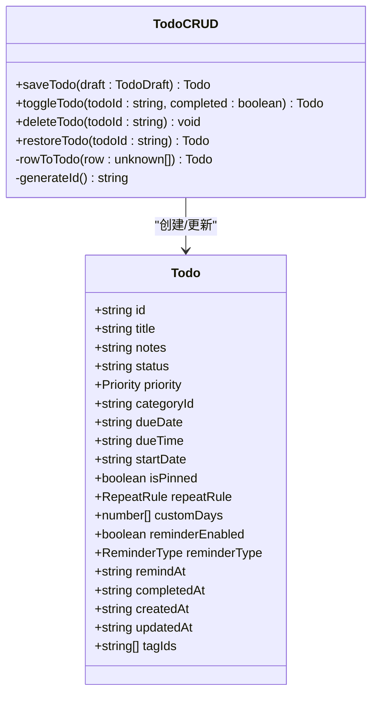
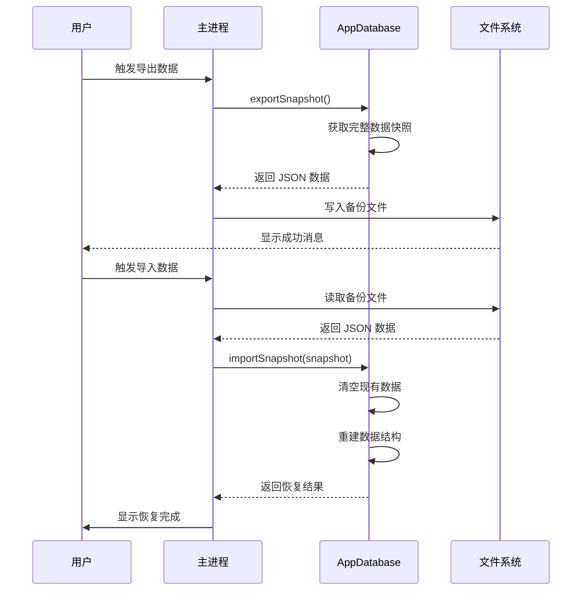
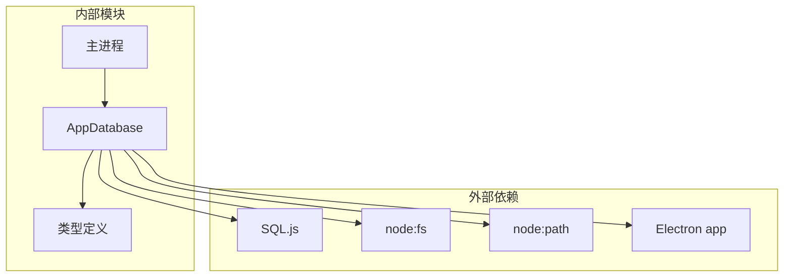

# 数据库层实现

<cite>
**本文档引用的文件**
- [db.ts](file://app/electron/db.ts)
- [main.ts](file://app/electron/main.ts)
- [types.ts](file://app/src/types.ts)
</cite>

## 目录
1. [简介](#简介)
2. [项目结构](#项目结构)
3. [核心组件](#核心组件)
4. [架构概览](#架构概览)
5. [详细组件分析](#详细组件分析)
6. [依赖关系分析](#依赖关系分析)
7. [性能考虑](#性能考虑)
8. [故障排除指南](#故障排除指南)
9. [结论](#结论)
10. [附录](#附录)

## 简介

SnowTodo 的数据库层实现了基于 SQL.js 的本地数据库解决方案，为桌面应用程序提供了完整的数据持久化能力。该实现采用 WebAssembly 技术，在 Electron 环境中运行 SQLite 数据库，支持所有核心功能：待办事项管理、健康提醒、番茄钟追踪、主题配置、AI 设置等。

## 项目结构

数据库相关的核心文件位于 `app/electron/` 目录下，主要包含：



**图表来源**
- [db.ts:60-90](file://app/electron/db.ts#L60-L90)
- [main.ts:360-369](file://app/electron/main.ts#L360-L369)

**章节来源**
- [db.ts:1-50](file://app/electron/db.ts#L1-L50)
- [main.ts:1-52](file://app/electron/main.ts#L1-L52)

## 核心组件

### AppDatabase 类

AppDatabase 是整个数据库层的核心类，负责：

- **SQL.js 初始化**：处理 WebAssembly 文件定位和数据库初始化
- **数据库生命周期管理**：连接管理、迁移、保存
- **CRUD 操作**：提供完整的数据操作接口
- **数据迁移**：向后兼容性和版本升级支持

### 数据库初始化流程



**图表来源**
- [db.ts:60-90](file://app/electron/db.ts#L60-L90)

**章节来源**
- [db.ts:55-90](file://app/electron/db.ts#L55-L90)

## 架构概览

### 数据库表结构设计

SnowTodo 采用了规范化的数据库设计，包含以下核心表：



**图表来源**
- [db.ts:299-504](file://app/electron/db.ts#L299-L504)

### SQL.js 集成原理

SQL.js 是一个将 SQLite 编译为 WebAssembly 的 JavaScript 库，SnowTodo 的集成方式如下：

1. **WASM 文件定位**：
   - 开发环境：`node_modules/sql.js/dist/sql-wasm.wasm`
   - 生产环境：`process.resourcesPath/sql-wasm.wasm`

2. **初始化过程**：
   ```typescript
   this.sql = await initSqlJs({
     locateFile: () => wasmPath,
   })
   ```

3. **数据库连接管理**：
   - 使用单例模式确保全局唯一连接
   - 支持内存数据库和持久化数据库两种模式
   - 自动处理数据库文件的读写

**章节来源**
- [db.ts:60-90](file://app/electron/db.ts#L60-L90)

## 详细组件分析

### 数据库迁移机制

SnowTodo 实现了完整的数据库迁移系统，确保向后兼容性：



**图表来源**
- [db.ts:92-297](file://app/electron/db.ts#L92-L297)

#### 版本兼容性处理

迁移系统通过以下策略确保版本兼容：

1. **列级迁移**：检查表结构变化，动态添加缺失列
2. **表级迁移**：条件性创建新表，使用 `IF NOT EXISTS`
3. **索引优化**：自动添加必要的索引提升查询性能
4. **数据补全**：为新功能插入默认配置数据

**章节来源**
- [db.ts:92-297](file://app/electron/db.ts#L92-L297)

### CRUD 操作实现

#### 待办事项 CRUD



**图表来源**
- [db.ts:716-796](file://app/electron/db.ts#L716-L796)
- [types.ts:168-188](file://app/src/types.ts#L168-L188)

#### 关键 CRUD 方法详解

1. **saveTodo 方法**：
   - 支持新建和更新操作
   - 自动处理标签关联
   - 统一的时间戳管理

2. **toggleTodo 方法**：
   - 状态切换逻辑
   - 完成时间自动记录
   - 数据一致性保证

3. **批量操作优化**：
   - 使用事务减少磁盘 I/O
   - 批量插入提升性能
   - 条件更新避免不必要的写入

**章节来源**
- [db.ts:716-833](file://app/electron/db.ts#L716-L833)

### 查询优化策略

#### 索引设计

SnowTodo 为关键查询场景建立了专门的索引：

| 索引名称 | 表名 | 字段 | 查询用途 |
|---------|------|------|----------|
| idx_todos_status | todos | status | 状态过滤查询 |
| idx_todos_due_date | todos | due_date | 逾期和到期提醒 |
| idx_todos_category | todos | category_id | 分类筛选 |
| idx_recurring_active | recurring_todos | is_active | 活跃模板查询 |
| idx_pomodoro_todo | pomodoro_sessions | todo_id | 任务专注历史 |
| idx_pomodoro_start | pomodoro_sessions | start_time | 时间范围查询 |
| idx_timeblock_start | time_blocks | start_time | 日程安排查询 |
| idx_daily_stats_date | daily_stats | date | 统计报表查询 |
| idx_health_enabled | health_reminders | enabled | 启用提醒查询 |

#### 复合索引设计

针对高频查询模式，建议考虑以下复合索引：

1. **待办事项综合查询**：
   - `(status, due_date, category_id)`
   - `(status, is_pinned, created_at)`

2. **健康提醒查询**：
   - `(enabled, trigger_type, sort_order)`
   - `(enabled, fixed_time, fixed_days)`

**章节来源**
- [db.ts:384-480](file://app/electron/db.ts#L384-L480)
- [db.ts:197-206](file://app/electron/db.ts#L197-L206)

### 数据备份与恢复

#### 备份机制

SnowTodo 提供了完整的数据备份和恢复功能：



**图表来源**
- [main.ts:195-225](file://app/electron/main.ts#L195-L225)
- [db.ts:970-1023](file://app/electron/db.ts#L970-L1023)

#### 数据完整性保证

1. **事务处理**：关键操作使用事务确保原子性
2. **外键约束**：合理使用外键维护引用完整性
3. **数据验证**：输入数据的格式和范围验证
4. **错误回滚**：异常情况下的数据回滚机制

**章节来源**
- [main.ts:195-225](file://app/electron/main.ts#L195-L225)
- [db.ts:970-1023](file://app/electron/db.ts#L970-L1023)

## 依赖关系分析

### 组件耦合度



**图表来源**
- [db.ts:1-24](file://app/electron/db.ts#L1-L24)
- [main.ts:1-6](file://app/electron/main.ts#L1-L6)

### 数据流分析

数据库层的数据流遵循以下模式：

1. **初始化阶段**：加载配置 → 定位 WASM → 连接数据库 → 运行迁移
2. **操作阶段**：接收请求 → 验证数据 → 执行查询 → 更新索引 → 保存文件
3. **查询阶段**：构建 SQL → 执行查询 → 转换结果 → 返回数据

**章节来源**
- [db.ts:60-90](file://app/electron/db.ts#L60-L90)
- [main.ts:227-358](file://app/electron/main.ts#L227-L358)

## 性能考虑

### 查询性能优化

1. **索引策略**：
   - 为高频查询字段建立适当索引
   - 避免过度索引影响写入性能
   - 定期分析查询执行计划

2. **查询优化**：
   - 使用参数化查询防止 SQL 注入
   - 限制返回结果集大小
   - 合理使用 LIMIT 和 OFFSET

3. **缓存策略**：
   - 对静态配置数据进行内存缓存
   - 减少重复的数据库查询
   - 实现智能缓存失效机制

### 存储优化

1. **文件大小控制**：
   - 定期清理历史数据
   - 压缩存储大对象
   - 实施数据归档策略

2. **内存管理**：
   - 及时释放不再使用的连接
   - 监控内存使用情况
   - 实现垃圾回收机制

## 故障排除指南

### 常见问题及解决方案

#### SQL.js 初始化失败

**症状**：应用启动时报错，无法初始化数据库

**可能原因**：
1. WASM 文件路径错误
2. 权限问题导致文件访问失败
3. 磁盘空间不足

**解决方法**：
```typescript
// 检查 WASM 文件是否存在
console.log('WASM 路径:', wasmPath)
console.log('文件存在:', fs.existsSync(wasmPath))

// 检查权限
const stat = fs.statSync(wasmPath)
console.log('文件权限:', stat.mode.toString(8))
```

#### 数据库文件损坏

**症状**：应用无法正常启动或数据丢失

**解决步骤**：
1. 备份当前数据库文件
2. 删除损坏的数据库文件
3. 重启应用自动生成新的数据库
4. 导入之前备份的数据

#### 性能问题

**症状**：查询响应缓慢，应用卡顿

**诊断方法**：
```sql
-- 检查表大小
SELECT name, size FROM sqlite_master WHERE type='table';

-- 分析查询执行计划
EXPLAIN QUERY PLAN SELECT * FROM todos WHERE status='pending';
```

**优化建议**：
1. 添加适当的索引
2. 重构复杂查询
3. 实施分页查询
4. 清理无用数据

**章节来源**
- [db.ts:60-90](file://app/electron/db.ts#L60-L90)

## 结论

SnowTodo 的数据库层实现展现了现代桌面应用数据持久化的最佳实践。通过 SQL.js 的 WebAssembly 技术，实现了跨平台的本地数据库解决方案。该实现具有以下优势：

1. **技术先进性**：采用最新的 WebAssembly 技术，性能优异
2. **架构清晰**：模块化设计，职责分离明确
3. **扩展性强**：完善的迁移机制支持功能演进
4. **可靠性高**：完整的备份恢复和数据完整性保障
5. **性能优化**：合理的索引设计和查询优化策略

## 附录

### 数据库扩展指南

#### 新增表结构

1. **定义表结构**：在 `createTables` 方法中添加新表定义
2. **添加索引**：根据查询需求添加必要索引
3. **实现 CRUD 方法**：提供完整的数据操作接口
4. **测试验证**：编写单元测试确保功能正确

#### 数据迁移最佳实践

1. **向后兼容**：确保新版本可以处理旧版本数据
2. **幂等性**：迁移脚本应该可以安全重复执行
3. **事务封装**：将相关迁移操作放在同一事务中
4. **错误处理**：完善的异常捕获和回滚机制

#### 性能监控指标

- 数据库文件大小增长率
- 查询响应时间分布
- 索引使用效率
- 内存占用情况
- 磁盘 I/O 性能