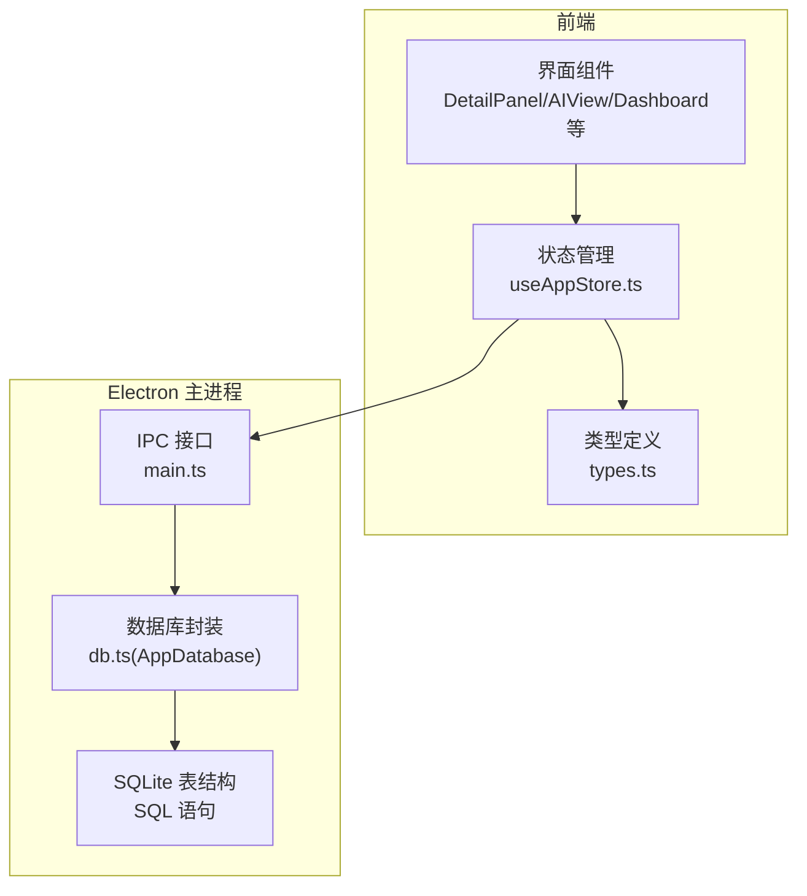
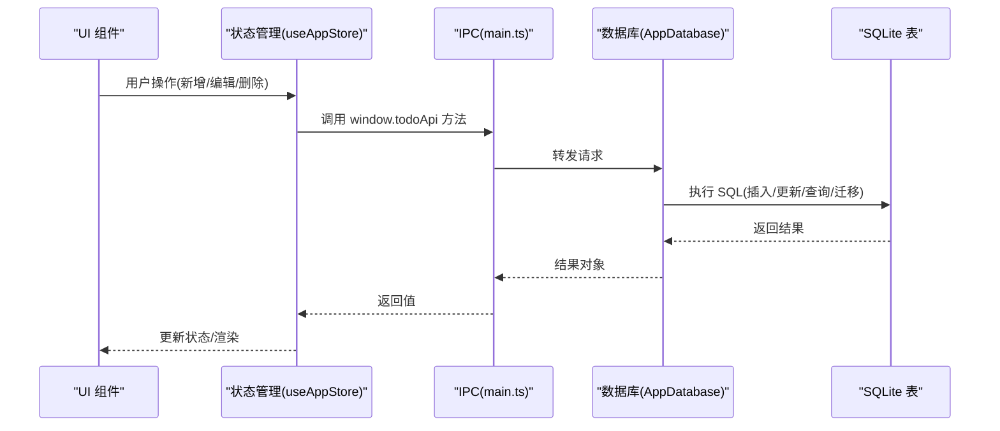
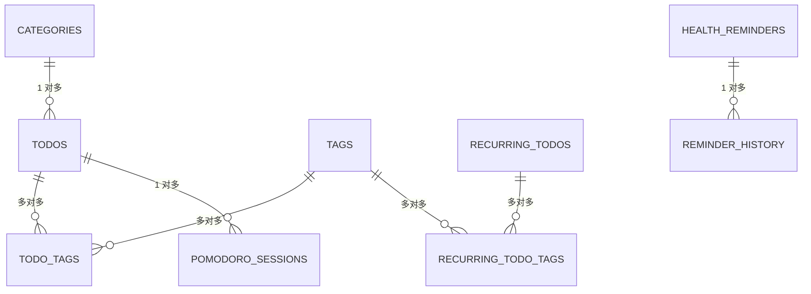

# 数据模型设计

<cite>
**本文档引用的文件**
- [types.ts](file://app/src/types.ts)
- [db.ts](file://app/electron/db.ts)
- [useAppStore.ts](file://app/src/store/useAppStore.ts)
- [main.ts](file://app/electron/main.ts)
</cite>

## 目录
1. [简介](#简介)
2. [项目结构](#项目结构)
3. [核心组件](#核心组件)
4. [架构总览](#架构总览)
5. [详细组件分析](#详细组件分析)
6. [依赖关系分析](#依赖关系分析)
7. [性能考量](#性能考量)
8. [故障排查指南](#故障排查指南)
9. [结论](#结论)
10. [附录](#附录)

## 简介
本文件系统性梳理 SnowTodo 的数据模型设计，覆盖 Todo、Category、Tag、PomodoroSession、HealthReminder、RecurringTodo、TimeBlock、Theme、AISettings、DailyStats 等核心实体及其关系。重点阐述：
- 实体定义与字段语义
- 关系建模（一对一、一对多、多对多）
- 数据验证与业务规则
- 序列化/反序列化与类型安全
- 扩展性与版本演进策略
- 使用示例与最佳实践
- 扩展指南与自定义模型实现方法

## 项目结构
SnowTodo 的数据层由前端 TypeScript 类型定义与 Electron 主进程的 SQLite 存储共同组成。前端通过全局 window.todoApi 与主进程交互，主进程负责持久化与迁移。

图表来源
- [useAppStore.ts:1-604](file://app/src/store/useAppStore.ts#L1-L604)
- [main.ts:294-317](file://app/electron/main.ts#L294-L317)
- [db.ts:55-90](file://app/electron/db.ts#L55-L90)

章节来源
- [types.ts:1-278](file://app/src/types.ts#L1-L278)
- [db.ts:299-504](file://app/electron/db.ts#L299-L504)
- [useAppStore.ts:1-604](file://app/src/store/useAppStore.ts#L1-L604)
- [main.ts:294-317](file://app/electron/main.ts#L294-L317)

## 核心组件
本节概述所有核心数据模型及职责边界。

- Todo：待办事项，包含标题、优先级、分类、到期时间、重复规则、提醒设置、标签关联等。
- Category：分类，用于组织 Todo。
- Tag：标签，支持多对多关联 Todo。
- RecurringTodo：长期每日待办模板，支持按日/工作日/周末/自定义周期生成实例。
- PomodoroSession：番茄钟会话，记录专注时长、中断次数、工作类型等。
- HealthReminder：健康提醒，支持间隔/固定时间触发、跳过番茄钟、工作日限制等。
- TimeBlock：时间块，用于日程安排与番茄钟关联。
- Theme：主题，存储颜色与效果配置。
- AISettings：AI 设置，统一管理模型参数与认证信息。
- DailyStats：每日统计，汇总完成数、专注分钟数、深潜分钟数、番茄数与中断数。
- Settings：应用基础设置，如启动项、默认排序、紧凑模式等。

章节来源
- [types.ts:148-277](file://app/src/types.ts#L148-L277)
- [db.ts:299-504](file://app/electron/db.ts#L299-L504)

## 架构总览
数据流从 UI 组件经状态管理到 IPC，再到数据库封装，最终持久化至 SQLite。迁移与索引确保历史数据与查询性能。

图表来源
- [useAppStore.ts:541-603](file://app/src/store/useAppStore.ts#L541-L603)
- [main.ts:294-317](file://app/electron/main.ts#L294-L317)
- [db.ts:55-90](file://app/electron/db.ts#L55-L90)

## 详细组件分析

### Todo 实体
- 字段要点：状态、优先级、到期/开始时间、重复规则、提醒开关与类型、完成时间、标签集合等。
- 关系：
  - 属于一个 Category（外键）
  - 多对多关联多个 Tag（通过中间表 todo_tags）
- 业务规则：
  - 重复规则影响到期时间推进
  - 开始日期决定“今日待办”可见性
  - 提醒类型与提醒时间共同决定触发条件
- 序列化：前端以 TypeScript 接口定义；数据库以 JSON 文本存储数组字段（如 custom_days），读取时解析为 number[]。

章节来源
- [types.ts:168-188](file://app/src/types.ts#L168-L188)
- [db.ts:336-342](file://app/electron/db.ts#L336-L342)
- [db.ts:636-674](file://app/electron/db.ts#L636-L674)

### Category 实体
- 字段要点：名称、排序、创建时间。
- 关系：一对多 -> Todo。
- 业务规则：排序字段控制展示顺序。

章节来源
- [types.ts:148-153](file://app/src/types.ts#L148-L153)
- [db.ts:301-306](file://app/electron/db.ts#L301-L306)

### Tag 实体
- 字段要点：名称唯一、创建时间。
- 关系：多对多 <-> Todo（中间表 todo_tags）。
- 业务规则：同名标签合并返回。

章节来源
- [types.ts:155-159](file://app/src/types.ts#L155-L159)
- [db.ts:308-312](file://app/electron/db.ts#L308-L312)
- [db.ts:336-342](file://app/electron/db.ts#L336-L342)

### RecurringTodo 实体
- 字段要点：优先级、分类、标签、重复模式、自定义星期、提醒开关/类型/时间、激活状态、最后生成日期。
- 关系：
  - 属于一个 Category
  - 多对多关联多个 Tag（中间表 recurring_todo_tags）
- 业务规则：按模式与自定义星期生成“今日待办”，防止重复生成。

章节来源
- [types.ts:224-243](file://app/src/types.ts#L224-L243)
- [db.ts:358-374](file://app/electron/db.ts#L358-L374)
- [db.ts:376-382](file://app/electron/db.ts#L376-L382)
- [db.ts:1184-1252](file://app/electron/db.ts#L1184-L1252)

### PomodoroSession 实体
- 字段要点：关联 Todo、起止时间、实际/计划时长、完成标志、中断次数/原因、工作类型（浅/深）。
- 关系：属于一个 Todo。
- 业务规则：完成后更新每日统计。

章节来源
- [types.ts:27-38](file://app/src/types.ts#L27-L38)
- [db.ts:389-400](file://app/electron/db.ts#L389-L400)
- [db.ts:1256-1302](file://app/electron/db.ts#L1256-L1302)
- [db.ts:1626-1677](file://app/electron/db.ts#L1626-L1677)

### HealthReminder 实体
- 字段要点：名称、图标、消息、启用、触发类型（间隔/固定）、间隔分钟、固定时间与星期、通知类型、跳过番茄钟、工作日/周末限制、节日自动关闭、排序。
- 关系：无外键，独立表。
- 业务规则：根据当前时间、工作日/周末、已触发历史判断是否触发。

章节来源
- [types.ts:63-79](file://app/src/types.ts#L63-L79)
- [db.ts:402-418](file://app/electron/db.ts#L402-L418)
- [db.ts:1333-1351](file://app/electron/db.ts#L1333-L1351)
- [db.ts:1406-1457](file://app/electron/db.ts#L1406-L1457)

### TimeBlock 实体
- 字段要点：关联 Todo、标题、起止时间、颜色、分类、全天标记、备注、实际番茄数。
- 关系：可选关联 Todo。
- 业务规则：按日期范围查询与更新。

章节来源
- [types.ts:103-114](file://app/src/types.ts#L103-L114)
- [db.ts:430-441](file://app/electron/db.ts#L430-L441)
- [db.ts:1485-1552](file://app/electron/db.ts#L1485-L1552)

### Theme 实体
- 字段要点：名称、配置（JSON 字符串）、内置标记、创建时间。
- 关系：无外键，独立表。
- 业务规则：内置主题与自定义主题区分存储。

章节来源
- [db.ts:443-449](file://app/electron/db.ts#L443-L449)
- [db.ts:1556-1583](file://app/electron/db.ts#L1556-L1583)

### AISettings 实体
- 字段要点：提供商、API 地址、API Key、模型、温度、最大 Token、代理。
- 关系：单行记录（id=1）。
- 业务规则：通过设置表键值对存储与读取。

章节来源
- [types.ts:119-127](file://app/src/types.ts#L119-L127)
- [db.ts:451-462](file://app/electron/db.ts#L451-L462)
- [db.ts:1587-1622](file://app/electron/db.ts#L1587-L1622)

### DailyStats 实体
- 字段要点：日期唯一、完成数、专注分钟数、深潜分钟数、番茄数、中断数。
- 关系：无外键，独立表。
- 业务规则：基于当日番茄钟与完成记录计算并 upsert。

章节来源
- [types.ts:138-146](file://app/src/types.ts#L138-L146)
- [db.ts:464-473](file://app/electron/db.ts#L464-L473)
- [db.ts:1626-1698](file://app/electron/db.ts#L1626-L1698)

### Settings 实体
- 字段要点：启动项、默认排序、默认提醒类型、紧凑模式。
- 关系：键值对存储于 settings 表。
- 业务规则：与应用初始化与 UI 行为相关。

章节来源
- [types.ts:161-166](file://app/src/types.ts#L161-L166)
- [db.ts:353-356](file://app/electron/db.ts#L353-L356)

## 依赖关系分析

### 关系图（实体与表）

图表来源
- [db.ts:301-306](file://app/electron/db.ts#L301-L306)
- [db.ts:336-342](file://app/electron/db.ts#L336-L342)
- [db.ts:358-374](file://app/electron/db.ts#L358-L374)
- [db.ts:376-382](file://app/electron/db.ts#L376-L382)
- [db.ts:389-400](file://app/electron/db.ts#L389-L400)
- [db.ts:402-418](file://app/electron/db.ts#L402-L418)
- [db.ts:420-428](file://app/electron/db.ts#L420-L428)

### 关键索引与约束
- 索引：todos(status/due_date/category_id)、recurring_todos(is_active)、pomodoro_sessions(todo_id/start_time)、time_blocks(start_time)、daily_stats(date)、health_reminders(enabled)。
- 约束：categories.name 唯一；tags.name 唯一；外键 cascade 删除（todo_tags/recurring_todo_tags/todos/health_reminders）。

章节来源
- [db.ts:384-387](file://app/electron/db.ts#L384-L387)
- [db.ts:475-479](file://app/electron/db.ts#L475-L479)
- [db.ts:333](file://app/electron/db.ts#L333)
- [db.ts:340-341](file://app/electron/db.ts#L340-L341)
- [db.ts:373](file://app/electron/db.ts#L373)
- [db.ts:380-381](file://app/electron/db.ts#L380-L381)
- [db.ts:427](file://app/electron/db.ts#L427)

## 性能考量
- 查询优化：为高频过滤字段建立索引（状态、到期日期、分类、活动状态、开始时间、日期唯一）。
- 写入优化：批量导入/导出采用事务式写入，减少磁盘 IO。
- 计算优化：每日统计按天 upsert，避免全量扫描。
- 序列化成本：数组字段以 JSON 文本存储，读取时解析，注意大数组场景的内存占用。

[本节为通用指导，无需特定文件来源]

## 故障排查指南
- 数据库初始化失败：检查 sql-wasm 文件路径与权限，确认 db 文件存在或可创建。
- 迁移异常：关注迁移日志输出，逐条检查新增列/索引/默认数据插入。
- 导入/导出错误：核对 BootstrapData 结构一致性，确保 todos/tags/categories/settings 完整。
- 提醒未触发：检查 HealthReminder 的触发类型、时间、工作日限制与历史触发记录。
- 番茄钟统计异常：确认 pomodoro_sessions 完成标志与工作类型正确更新。

章节来源
- [db.ts:60-90](file://app/electron/db.ts#L60-L90)
- [db.ts:92-297](file://app/electron/db.ts#L92-L297)
- [db.ts:974-1023](file://app/electron/db.ts#L974-L1023)
- [db.ts:1406-1457](file://app/electron/db.ts#L1406-L1457)
- [db.ts:1626-1677](file://app/electron/db.ts#L1626-L1677)

## 结论
SnowTodo 的数据模型以清晰的实体划分与严格的外键/索引约束为基础，结合前端类型系统与主进程数据库封装，实现了良好的可维护性与扩展性。通过迁移机制与索引策略保障了历史数据兼容与查询性能。建议在扩展新实体时遵循现有命名规范、索引策略与序列化约定，确保整体一致性。

[本节为总结性内容，无需特定文件来源]

## 附录

### 数据验证与业务规则清单
- Todo
  - 重复规则推进到期时间
  - 开始日期限制“今日待办”可见性
  - 提醒类型与提醒时间决定触发
- RecurringTodo
  - 模式与自定义星期决定生成
  - 最后生成日期防重复
- HealthReminder
  - 跳过番茄钟、工作日/周末限制、节日自动关闭
- PomodoroSession
  - 完成标志与工作类型影响统计
- DailyStats
  - 基于当日完成与番茄钟计算

章节来源
- [db.ts:942-968](file://app/electron/db.ts#L942-L968)
- [db.ts:1184-1252](file://app/electron/db.ts#L1184-L1252)
- [db.ts:1406-1457](file://app/electron/db.ts#L1406-L1457)
- [db.ts:1256-1302](file://app/electron/db.ts#L1256-L1302)
- [db.ts:1626-1677](file://app/electron/db.ts#L1626-L1677)

### 序列化与类型安全
- 前端：通过 TypeScript 接口定义强类型，避免运行时类型错误。
- 主进程：JSON 文本存储数组字段（如 custom_days、fixed_days、images），读取时解析为数组。
- 设置项：settings 表以键值对存储 JSON，读取时反序列化为对象。

章节来源
- [db.ts:646-652](file://app/electron/db.ts#L646-L652)
- [db.ts:1041](file://app/electron/db.ts#L1041)
- [db.ts:1784](file://app/electron/db.ts#L1784)
- [db.ts:1813](file://app/electron/db.ts#L1813)

### 扩展性设计与版本管理
- 迁移机制：新增列/表/索引通过迁移脚本幂等执行，保证历史数据兼容。
- 默认数据：首次安装或迁移后插入默认分类、提醒、主题、AI 设置。
- 版本演进：通过 settings 表键值对存储复杂配置，便于后续扩展。

章节来源
- [db.ts:92-297](file://app/electron/db.ts#L92-L297)
- [db.ts:507-543](file://app/electron/db.ts#L507-L543)

### 使用示例与最佳实践
- 新增/编辑 Todo：使用 TodoDraft，提交后通过 saveTodo 持久化并返回完整 Todo。
- 生成每日待办：调用 generateDailyTodos，按模板规则创建实例。
- 番茄钟会话：创建/更新 PomodoroSession，完成后自动更新 DailyStats。
- 健康提醒：按需创建/更新 HealthReminder，系统定时检查触发条件。
- 导入/导出：使用 exportSnapshot/importSnapshot 保持数据完整性。

章节来源
- [db.ts:716-796](file://app/electron/db.ts#L716-L796)
- [db.ts:1184-1252](file://app/electron/db.ts#L1184-L1252)
- [db.ts:1271-1302](file://app/electron/db.ts#L1271-L1302)
- [db.ts:1358-1397](file://app/electron/db.ts#L1358-L1397)
- [db.ts:970-1023](file://app/electron/db.ts#L970-L1023)

### 扩展指南与自定义模型实现
- 新增实体步骤
  - 在 types.ts 中定义接口与默认值
  - 在 db.ts 中创建表与索引，必要时添加迁移
  - 在 main.ts 中注册 IPC 处理函数
  - 在 useAppStore.ts 中声明状态与动作
  - 在 UI 组件中调用 window.todoApi 对应方法
- 约束与一致性
  - 外键约束与 cascade 删除策略
  - 唯一约束（如 categories.name、tags.name）
  - JSON 文本字段的解析/序列化规范
- 性能与兼容
  - 为高频查询字段添加索引
  - 迁移脚本幂等执行，避免破坏历史数据
  - settings 键值对存储复杂配置，便于版本演进

章节来源
- [types.ts:1-277](file://app/src/types.ts#L1-L277)
- [db.ts:299-504](file://app/electron/db.ts#L299-L504)
- [main.ts:294-317](file://app/electron/main.ts#L294-L317)
- [useAppStore.ts:1-604](file://app/src/store/useAppStore.ts#L1-L604)