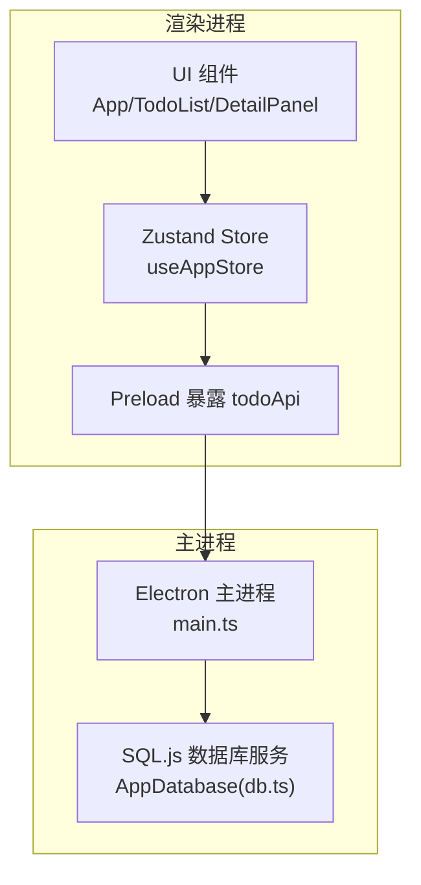
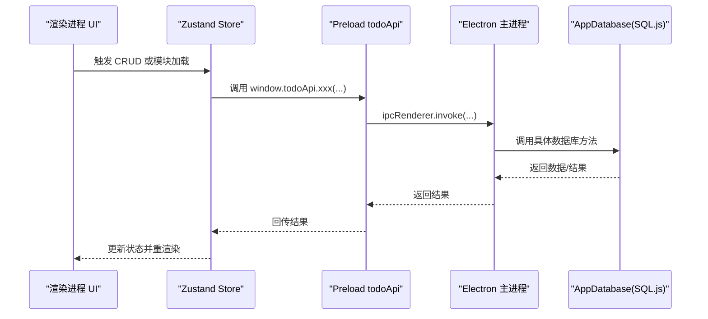
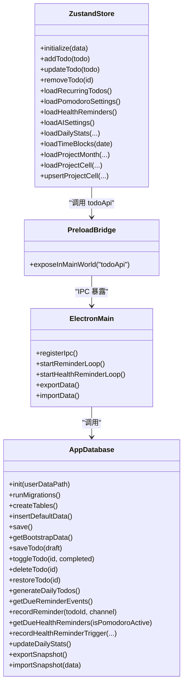
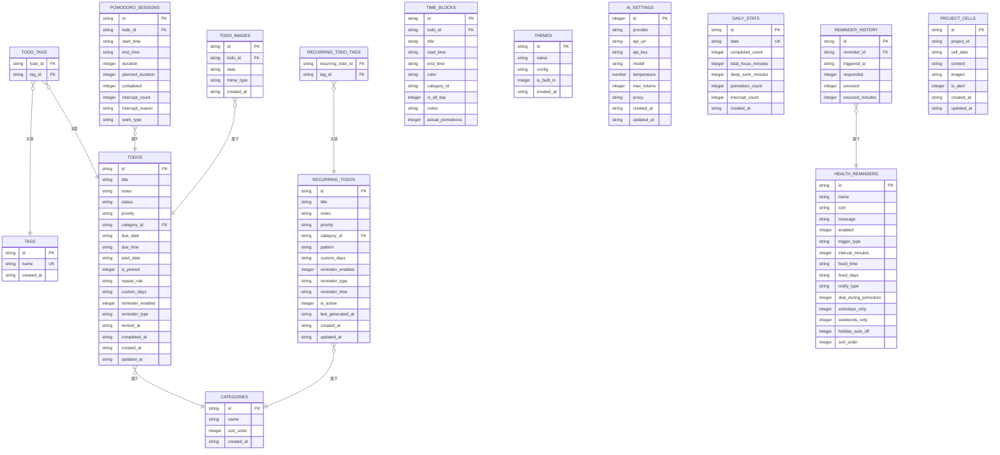

# 数据管理

<cite>
**本文引用的文件**
- [db.ts](file://app/electron/db.ts)
- [main.ts](file://app/electron/main.ts)
- [preload.ts](file://app/electron/preload.ts)
- [useAppStore.ts](file://app/src/store/useAppStore.ts)
- [types.ts](file://app/src/types.ts)
- [App.tsx](file://app/src/App.tsx)
- [TodoList.tsx](file://app/src/components/Content/TodoList.tsx)
- [DetailPanel.tsx](file://app/src/components/DetailPanel/DetailPanel.tsx)
</cite>

## 目录
1. [简介](#简介)
2. [项目结构](#项目结构)
3. [核心组件](#核心组件)
4. [架构总览](#架构总览)
5. [详细组件分析](#详细组件分析)
6. [依赖关系分析](#依赖关系分析)
7. [性能考量](#性能考量)
8. [故障排查指南](#故障排查指南)
9. [结论](#结论)
10. [附录](#附录)

## 简介
本文件系统性梳理 SnowTodo 的数据管理系统，重点覆盖：
- SQL.js 在 Electron 中的集成与数据库生命周期管理
- 表结构设计与实体关系、索引与约束
- CRUD 与业务操作（如重复待办生成、提醒触发、统计更新）
- Zustand 状态管理中的数据同步、状态更新与性能优化
- 数据访问模式、缓存策略与查询优化
- 数据安全、导入导出与一致性保障
- 扩展与自定义的最佳实践

## 项目结构
SnowTodo 的数据层由三部分组成：
- 主进程数据库服务：封装 SQL.js，负责建表、迁移、CRUD、定时任务与导出导入
- 渲染进程状态管理：Zustand store 负责 UI 状态与业务数据的本地缓存与派发
- IPC 接口桥接：preload 暴露 todoApi，渲染进程通过 IPC 调用主进程数据库能力

图表来源
- [main.ts:227-358](file://app/electron/main.ts#L227-L358)
- [preload.ts:18-116](file://app/electron/preload.ts#L18-L116)
- [db.ts:55-90](file://app/electron/db.ts#L55-L90)

章节来源
- [main.ts:18-52](file://app/electron/main.ts#L18-L52)
- [preload.ts:1-117](file://app/electron/preload.ts#L1-L117)
- [db.ts:55-90](file://app/electron/db.ts#L55-L90)

## 核心组件
- AppDatabase：封装 SQL.js，负责数据库初始化、表结构与迁移、CRUD、定时任务、导出导入、统计更新等
- useAppStore：Zustand 状态容器，维护 todos、recurringTodos、settings、pomodoro、health、timeblocks、stats 等状态，并通过 window.todoApi 与主进程交互
- Electron 主进程：注册 IPC，启动定时器，处理导入导出，暴露统一接口给渲染进程
- Preload：通过 contextBridge 暴露 todoApi，屏蔽 IPC 细节
- 类型系统：types.ts 定义 Todo、PomodoroSession、HealthReminder、RecurringTodo、DailyStats 等实体与枚举

章节来源
- [db.ts:55-90](file://app/electron/db.ts#L55-L90)
- [useAppStore.ts:1-604](file://app/src/store/useAppStore.ts#L1-L604)
- [main.ts:227-358](file://app/electron/main.ts#L227-L358)
- [preload.ts:18-116](file://app/electron/preload.ts#L18-L116)
- [types.ts:1-278](file://app/src/types.ts#L1-L278)

## 架构总览
渲染进程通过 window.todoApi 发起请求，主进程根据 IPC 映射调用 AppDatabase 的方法，返回结果后写入数据库并持久化，随后通过 store 更新 UI。定时器在主进程侧定期扫描提醒事件与健康提醒，触发系统通知或向渲染进程发送事件。

图表来源
- [useAppStore.ts:540-603](file://app/src/store/useAppStore.ts#L540-L603)
- [preload.ts:18-116](file://app/electron/preload.ts#L18-L116)
- [main.ts:227-358](file://app/electron/main.ts#L227-L358)
- [db.ts:716-796](file://app/electron/db.ts#L716-L796)

## 详细组件分析

### SQL.js 数据库集成与初始化
- 初始化流程
  - 定位 sql-wasm.wasm 路径（开发/打包两种路径）
  - 使用 initSqlJs 加载 WASM 并创建 SQL.js 实例
  - 若存在数据库文件则读取并恢复；否则创建表结构并插入默认数据
  - 运行迁移脚本，确保新增表、列、索引与默认值
- 数据库持久化
  - 通过 export() 将内存数据库导出为二进制缓冲区，写入 userData 目录下的 snowtodo.db 文件
- 迁移策略
  - 新增列：如 todos.custom_days、todos.start_date
  - 新增表：pomodoro_sessions、health_reminders、reminder_history、time_blocks、themes、ai_settings、daily_stats、todo_images、project_cells
  - 新增索引：提升查询性能
  - 默认数据：健康提醒、主题、AI 设置、默认分类与设置项

章节来源
- [db.ts:60-90](file://app/electron/db.ts#L60-L90)
- [db.ts:92-297](file://app/electron/db.ts#L92-L297)
- [db.ts:299-504](file://app/electron/db.ts#L299-L504)
- [db.ts:626-630](file://app/electron/db.ts#L626-L630)

### 表结构设计与实体关系
- 核心实体
  - todos：待办事项，支持优先级、分类、标签、重复规则、提醒配置、完成状态与时间戳
  - recurring_todos：长期每日待办模板，支持 daily/weekdays/weekends/custom 等模式
  - categories/tags：分类与标签，多对多通过中间表关联
  - pomodoro_sessions：专注会话，记录开始/结束、时长、中断次数与类型
  - health_reminders：健康提醒，支持 interval/fixed 两类触发与历史记录
  - reminder_logs：提醒日志，避免重复触发
  - time_blocks：时间块，用于日程安排
  - themes/ai_settings/settings：主题、AI 设置与通用设置
  - daily_stats：每日统计，按天聚合完成数、专注分钟、深潜分钟、番茄数与中断数
  - todo_images：待办图片，base64 存储
  - project_cells：项目看板单元格，支持内容、图片数组与告警标记
- 关系与约束
  - 外键：todos.category_id -> categories.id；todos 与 tags 通过 todo_tags 关联；recurring_todos 与 tags 通过 recurring_todo_tags 关联；pomodoro_sessions.todo_id -> todos.id；todo_images.todo_id -> todos.id；reminder_history.reminder_id -> health_reminders.id
  - 约束：tags.name 唯一；索引覆盖常用查询字段（如 todos.status/due_date/category_id、pomodoro_sessions、time_blocks、daily_stats、health_reminders 等）

章节来源
- [db.ts:300-504](file://app/electron/db.ts#L300-L504)
- [db.ts:384-479](file://app/electron/db.ts#L384-L479)
- [db.ts:1027-1051](file://app/electron/db.ts#L1027-L1051)
- [db.ts:1256-1269](file://app/electron/db.ts#L1256-L1269)
- [db.ts:1333-1351](file://app/electron/db.ts#L1333-L1351)
- [db.ts:1485-1498](file://app/electron/db.ts#L1485-L1498)
- [db.ts:1626-1677](file://app/electron/db.ts#L1626-L1677)

### CRUD 与业务操作实现
- Todo CRUD
  - 保存：支持新建与更新，处理标签多对多关系，最后持久化并返回完整实体
  - 完成/恢复：切换状态并更新完成时间
  - 删除：逻辑归档（状态改为 archived）
- Recurring Todos
  - 生成每日待办：按模板规则与自定义星期生成当日实例，更新 last_generated_at
- Pomodoro
  - 创建/更新会话：完成后联动更新每日统计
- 健康提醒
  - 触发检查：基于 enabled、skipDuringPomodoro、workdays/weekends、fixed/interval、最近触发时间等条件
  - 历史记录：记录触发、响应该、忽略
- 导入导出
  - 导出：将当前 BootstrapData 序列化为 JSON
  - 导入：清空旧数据后批量写入，再返回新的 BootstrapData

章节来源
- [db.ts:716-796](file://app/electron/db.ts#L716-L796)
- [db.ts:798-833](file://app/electron/db.ts#L798-L833)
- [db.ts:819-822](file://app/electron/db.ts#L819-L822)
- [db.ts:1067-1101](file://app/electron/db.ts#L1067-L1101)
- [db.ts:1183-1252](file://app/electron/db.ts#L1183-L1252)
- [db.ts:1271-1302](file://app/electron/db.ts#L1271-L1302)
- [db.ts:1406-1457](file://app/electron/db.ts#L1406-L1457)
- [db.ts:1459-1467](file://app/electron/db.ts#L1459-L1467)
- [db.ts:970-1023](file://app/electron/db.ts#L970-L1023)

### 数据访问模式、缓存策略与查询优化
- 缓存策略
  - 渲染进程使用 Zustand 本地缓存 todos、recurringTodos、settings、pomodoro、health、timeblocks、stats 等，减少频繁 IPC
  - 首屏通过 window.todoApi.getBootstrapData 一次性拉取基础数据，后续按需增量加载（如模块数据）
- 查询优化
  - 为高频查询建立索引：todos.status、todos.due_date、todos.category_id、recurring_todos.is_active、pomodoro_sessions(todo_id,start_time)、time_blocks(start_time)、daily_stats(date)、health_reminders(enabled)
  - 使用分页/范围查询：pomodoro sessions、time blocks、daily stats
  - 避免重复触发：reminder_logs 与 reminder_history 记录已触发时间，结合时间字符串截断避免同分钟重复
- 数据一致性
  - 所有写操作均在主进程执行，写入后立即持久化，确保崩溃可恢复
  - 导入采用全量替换策略，先删除再写入，保证一致性

章节来源
- [useAppStore.ts:237-246](file://app/src/store/useAppStore.ts#L237-L246)
- [useAppStore.ts:295-298](file://app/src/store/useAppStore.ts#L295-L298)
- [db.ts:384-479](file://app/electron/db.ts#L384-L479)
- [db.ts:882-930](file://app/electron/db.ts#L882-L930)
- [db.ts:1425-1443](file://app/electron/db.ts#L1425-L1443)

### Zustand 状态管理中的数据同步机制
- 初始化与加载
  - App 首次渲染时调用 window.todoApi.getBootstrapData，初始化 todos/categories/tags/settings
  - 各模块独立加载：pomodoro、health、AI、stats、timeblocks、projects
- 同步策略
  - 写操作：渲染进程调用 window.todoApi.xxx(...)，主进程返回结果后，Store 通过 set/update 方法更新本地状态
  - 读操作：Store 内部计算函数（如 getFilteredTodos/getTodayTodos）直接从本地状态派生，避免重复 IPC
- 性能优化
  - 局部更新：仅更新受影响的字段，避免全量替换
  - 计算派生：排序、过滤、聚合在 Store 内部进行，减少 UI 重复计算
  - 事件监听：通过 onReminderTriggered/onHealthReminderTriggered 等回调，主进程推送事件，Store 仅做状态更新

章节来源
- [App.tsx:24-34](file://app/src/App.tsx#L24-L34)
- [useAppStore.ts:237-246](file://app/src/store/useAppStore.ts#L237-L246)
- [useAppStore.ts:327-389](file://app/src/store/useAppStore.ts#L327-L389)
- [useAppStore.ts:425-438](file://app/src/store/useAppStore.ts#L425-L438)
- [useAppStore.ts:540-603](file://app/src/store/useAppStore.ts#L540-L603)

### 数据安全、备份与恢复
- 数据存储位置
  - 数据库文件位于 Electron userData 目录下的 snowtodo.db
- 备份与恢复
  - 导出：通过对话框保存为 JSON 文件
  - 导入：读取 JSON 并全量替换数据库，返回新数据供前端初始化
- 安全建议
  - 当前未见数据库加密实现，建议在生产环境增加加密存储方案（如基于密钥的加密文件）
  - 对敏感字段（如 AI API Key）可在导入时进行校验与脱敏处理

章节来源
- [main.ts:195-225](file://app/electron/main.ts#L195-L225)
- [db.ts:970-1023](file://app/electron/db.ts#L970-L1023)

### 数据一致性与并发控制
- 单线程写入
  - 所有写操作在主进程同步执行，避免并发冲突
- 原子性
  - 事务：单条 SQL 语句或小批量写入，失败即回滚
  - 导入：全量替换，保证最终一致
- 重复触发防护
  - 通过 reminder_logs 与 reminder_history 记录触发时间，避免同一分钟重复触发
- 并发 UI
  - 渲染进程内部状态更新为同步 set 操作，避免竞态

章节来源
- [db.ts:882-930](file://app/electron/db.ts#L882-L930)
- [db.ts:1425-1443](file://app/electron/db.ts#L1425-L1443)
- [db.ts:1459-1467](file://app/electron/db.ts#L1459-L1467)

### 数据模型扩展与自定义最佳实践
- 新增实体
  - 在 db.ts 中新增表与索引，迁移脚本中 idempotent 创建
  - 在 types.ts 中定义 TypeScript 接口与枚举
  - 在 preload/main.ts 中注册 IPC 接口，暴露给渲染进程
  - 在 useAppStore.ts 中新增状态字段与动作，必要时在 UI 组件中消费
- 字段变更
  - 通过迁移脚本添加列并设置默认值，避免破坏现有数据
  - 为新字段建立索引，确保查询性能
- 业务扩展
  - 重复待办：遵循 recurring_todos 模式，注意 last_generated_at 防止重复生成
  - 提醒系统：新增触发类型或条件时，完善 getDueHealthReminders 与历史记录
  - 统计：新增维度时，更新 updateDailyStats 并在 UI 展示

章节来源
- [db.ts:92-297](file://app/electron/db.ts#L92-L297)
- [types.ts:1-278](file://app/src/types.ts#L1-L278)
- [preload.ts:18-116](file://app/electron/preload.ts#L18-L116)
- [main.ts:227-358](file://app/electron/main.ts#L227-L358)
- [useAppStore.ts:1-604](file://app/src/store/useAppStore.ts#L1-L604)

## 依赖关系分析

图表来源
- [db.ts:55-90](file://app/electron/db.ts#L55-L90)
- [main.ts:227-358](file://app/electron/main.ts#L227-L358)
- [preload.ts:18-116](file://app/electron/preload.ts#L18-L116)
- [useAppStore.ts:181-508](file://app/src/store/useAppStore.ts#L181-L508)

## 性能考量
- 查询性能
  - 为高频字段建立索引，避免全表扫描
  - 使用范围查询与 LIMIT 限制结果集大小
- 写入性能
  - 批量写入时尽量合并 SQL，减少多次往返
  - 导入采用全量替换，避免碎片化
- 内存占用
  - SQL.js 在主线程运行，避免在渲染进程直接操作数据库
  - Store 仅缓存必要数据，避免冗余拷贝
- 定时任务
  - 提醒与健康提醒轮询间隔合理设置，避免 CPU 占用过高

## 故障排查指南
- 数据库无法初始化
  - 检查 sql-wasm.wasm 是否正确加载（开发/打包路径）
  - 确认 userData 目录权限与磁盘空间
- 提醒未触发
  - 检查 reminder_logs 是否已有同分钟记录
  - 确认健康提醒 enabled、skipDuringPomodoro、workdays/weekends 条件
- 导入失败
  - 检查 JSON 文件格式与完整性
  - 确认导入后是否成功返回新的 BootstrapData
- UI 不刷新
  - 确认 IPC 调用是否成功返回
  - 检查 Store 动作是否正确更新状态

章节来源
- [db.ts:60-90](file://app/electron/db.ts#L60-L90)
- [db.ts:882-930](file://app/electron/db.ts#L882-L930)
- [db.ts:1406-1457](file://app/electron/db.ts#L1406-L1457)
- [main.ts:195-225](file://app/electron/main.ts#L195-L225)
- [useAppStore.ts:237-246](file://app/src/store/useAppStore.ts#L237-L246)

## 结论
SnowTodo 的数据管理以 SQL.js 为核心，结合 Electron IPC 与 Zustand 状态管理，实现了稳定、可扩展且高性能的数据层。通过完善的迁移机制、索引与缓存策略，系统在功能丰富的同时保持良好的性能与一致性。建议在生产环境中引入数据库加密与更细粒度的并发控制，进一步提升安全性与可靠性。

## 附录
- 数据模型 ER 图（简化）

图表来源
- [db.ts:300-504](file://app/electron/db.ts#L300-L504)
- [db.ts:1027-1051](file://app/electron/db.ts#L1027-L1051)
- [db.ts:1256-1269](file://app/electron/db.ts#L1256-L1269)
- [db.ts:1333-1351](file://app/electron/db.ts#L1333-L1351)
- [db.ts:1485-1498](file://app/electron/db.ts#L1485-L1498)
- [db.ts:1626-1677](file://app/electron/db.ts#L1626-L1677)
- [db.ts:1743-1769](file://app/electron/db.ts#L1743-L1769)
- [db.ts:1773-1802](file://app/electron/db.ts#L1773-L1802)