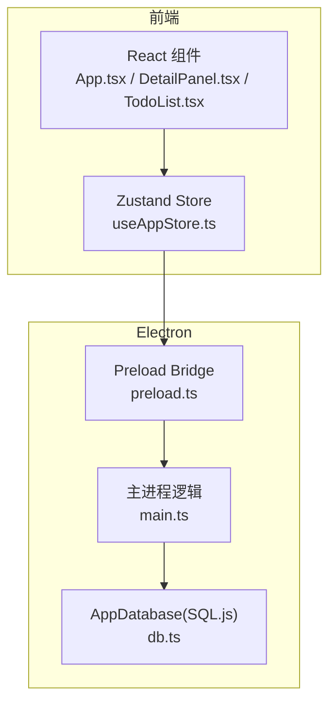
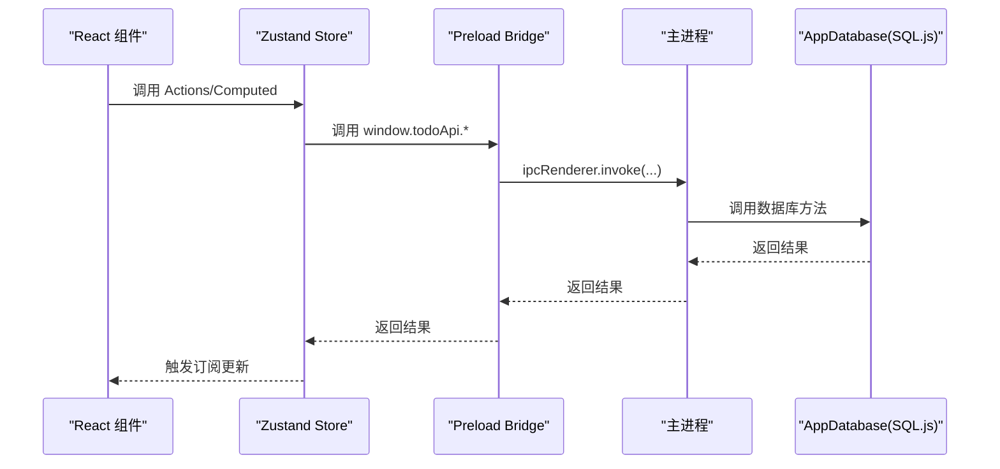
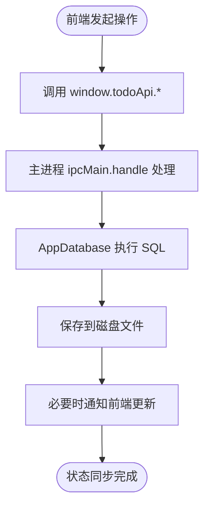
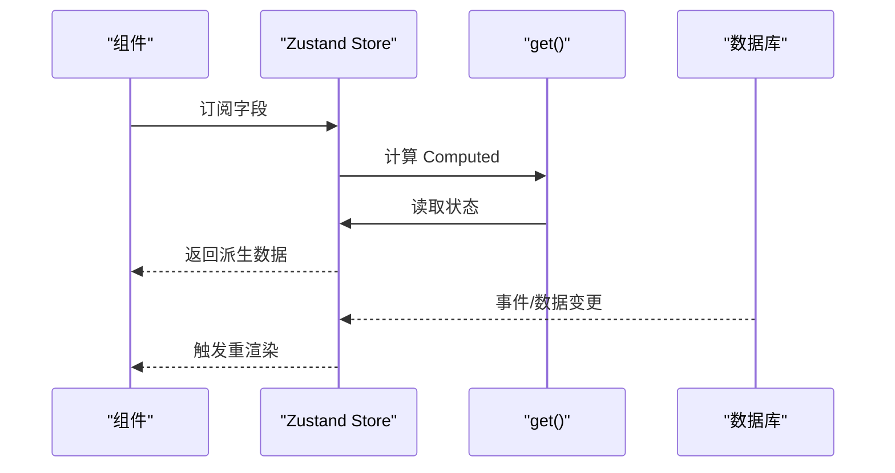

# 状态管理机制

<cite>
**本文引用的文件**
- [useAppStore.ts](file://app/src/store/useAppStore.ts)
- [types.ts](file://app/src/types.ts)
- [db.ts](file://app/electron/db.ts)
- [main.ts](file://app/electron/main.ts)
- [preload.ts](file://app/electron/preload.ts)
- [App.tsx](file://app/src/App.tsx)
- [DetailPanel.tsx](file://app/src/components/DetailPanel/DetailPanel.tsx)
- [TodoList.tsx](file://app/src/components/Content/TodoList.tsx)
</cite>

## 目录
1. [简介](#简介)
2. [项目结构](#项目结构)
3. [核心组件](#核心组件)
4. [架构总览](#架构总览)
5. [详细组件分析](#详细组件分析)
6. [依赖关系分析](#依赖关系分析)
7. [性能考量](#性能考量)
8. [故障排查指南](#故障排查指南)
9. [结论](#结论)
10. [附录](#附录)

## 简介
本文件系统性梳理 SnowTodo 的状态管理机制，重点围绕 Zustand 在前端的应用，解释状态结构设计、Actions 与 Computed 的定义与使用、全局状态的数据流、持久化策略、订阅与响应式更新、模块化设计以及调试与性能优化建议。目标是帮助开发者快速理解并高效扩展状态管理能力。

## 项目结构
SnowTodo 的状态管理采用“前端 Zustand + 后端 Electron + SQL.js 数据库”的分层架构：
- 前端通过 Zustand 维护应用全局状态，并以 Actions/Computed 形式暴露操作与派生数据。
- 通过 preload 暴露的 window.todoApi IPC 接口与主进程通信，主进程调用 AppDatabase 完成数据库读写。
- AppDatabase 使用 SQL.js 将 SQLite 数据持久化到本地文件，支持迁移与索引优化。

图表来源
- [useAppStore.ts:181-508](file://app/src/store/useAppStore.ts#L181-L508)
- [preload.ts:18-116](file://app/electron/preload.ts#L18-L116)
- [main.ts:227-358](file://app/electron/main.ts#L227-L358)
- [db.ts:55-90](file://app/electron/db.ts#L55-L90)

章节来源
- [useAppStore.ts:1-604](file://app/src/store/useAppStore.ts#L1-L604)
- [types.ts:1-278](file://app/src/types.ts#L1-L278)
- [db.ts:1-800](file://app/electron/db.ts#L1-L800)
- [main.ts:1-391](file://app/electron/main.ts#L1-L391)
- [preload.ts:1-117](file://app/electron/preload.ts#L1-L117)

## 核心组件
- Zustand Store：集中定义状态类型、初始值、Actions 与 Computed，提供统一的状态入口。
- 类型系统：通过 types.ts 定义 Todo、Category、Tag、Settings、Pomodoro、Health、AI、TimeBlock、DailyStats、ProjectCell 等核心数据模型。
- 数据持久化：AppDatabase 负责建表、迁移、默认数据注入、增删改查与导出导入。
- IPC 桥接：preload.ts 暴露 window.todoApi，main.ts 注册 IPC 处理器，实现前端与数据库的双向同步。
- 组件订阅：React 组件通过 useAppStore 订阅状态变化，实现自动重渲染。

章节来源
- [useAppStore.ts:30-176](file://app/src/store/useAppStore.ts#L30-L176)
- [types.ts:161-278](file://app/src/types.ts#L161-L278)
- [db.ts:55-297](file://app/electron/db.ts#L55-L297)
- [preload.ts:18-116](file://app/electron/preload.ts#L18-L116)
- [main.ts:227-358](file://app/electron/main.ts#L227-L358)

## 架构总览
下图展示了从组件到数据库的完整数据流路径，包括初始化、更新与持久化流程。

图表来源
- [useAppStore.ts:237-246](file://app/src/store/useAppStore.ts#L237-L246)
- [preload.ts:18-116](file://app/electron/preload.ts#L18-L116)
- [main.ts:227-358](file://app/electron/main.ts#L227-L358)
- [db.ts:676-796](file://app/electron/db.ts#L676-L796)

## 详细组件分析

### Zustand Store 设计与数据流
- 状态结构设计
  - 基础数据：todos、recurringTodos、categories、tags、settings。
  - UI 状态：currentView、selectedTodoId、isDetailPanelOpen、filters、sortBy 等。
  - 功能模块状态：Pomodoro、Health、AI、TimeBlock、Dashboard、Projects。
  - 加载与初始化：isLoading、isInitialized。
- Actions
  - 初始化：initialize 将后端返回的 BootstrapData 写入状态并标记初始化完成。
  - 导航与筛选：setCurrentView、setSearchQuery、setFilter*、setSortBy、clearFilters。
  - CRUD：setTodos/addTodo/updateTodo/removeTodo；Category/Tag 的 set/add。
  - 模块化 Actions：如 loadPomodoroSettings、loadHealthReminders、loadAISettings、loadTimeBlocks、loadDailyStats、loadProjectMonth/loadProjectCell/upsertProjectCell 等。
  - 本地状态变更：如 setPomodoroPhase/setPomodoroSecondsLeft/tickPomodoro、setHealthReminders、setAISettings 等。
- Computed
  - getFilteredTodos/getTodayTodos/getUpcomingTodos/getCompletedTodos/getTodosByCategory/getTodosByTag/getPendingReminders。
  - 内部排序函数 sortTodos，支持按到期时间、创建时间、优先级等排序，并保留置顶项在前。
- 数据流
  - 初始化：App.tsx 在 isInitialized 为 false 时调用 window.todoApi.getBootstrapData，然后 initialize。
  - 更新：组件通过 Actions 修改状态；部分模块通过 loadXxx 异步拉取后端数据并 setXxx。
  - 同步：window.todoApi.* 通过 IPC 与主进程交互，主进程调用 AppDatabase 完成持久化或查询。

章节来源
- [useAppStore.ts:30-176](file://app/src/store/useAppStore.ts#L30-L176)
- [useAppStore.ts:181-508](file://app/src/store/useAppStore.ts#L181-L508)
- [App.tsx:24-34](file://app/src/App.tsx#L24-L34)
- [types.ts:513-536](file://app/src/types.ts#L513-L536)

### 状态持久化策略与双向同步
- 前端到数据库
  - 组件通过 window.todoApi.* 调用主进程处理器，主进程执行 AppDatabase 方法，写入 SQL.js 数据库并保存到磁盘文件。
  - 示例：保存待办、更新设置、创建/更新健康提醒、创建/更新时间块、更新每日统计、项目单元格等。
- 数据库到前端
  - Store 中的 loadXxx 方法通过 window.todoApi.* 拉取数据，setXxx 写回状态，触发组件重渲染。
  - 示例：loadPomodoroSettings、loadHealthReminders、loadAISettings、loadTimeBlocks、loadDailyStats、loadProjectMonth/loadProjectCell。
- 数据一致性
  - 主进程定时任务会生成每日待办并检查提醒事件，确保数据库与业务规则一致。
  - 导入/导出：支持全量快照导入导出，便于备份与迁移。

图表来源
- [preload.ts:18-116](file://app/electron/preload.ts#L18-L116)
- [main.ts:227-358](file://app/electron/main.ts#L227-L358)
- [db.ts:626-630](file://app/electron/db.ts#L626-L630)

章节来源
- [db.ts:676-796](file://app/electron/db.ts#L676-L796)
- [main.ts:227-358](file://app/electron/main.ts#L227-L358)
- [preload.ts:18-116](file://app/electron/preload.ts#L18-L116)

### 订阅与响应式更新机制
- 组件订阅
  - 组件通过 useAppStore(state => selector) 订阅所需字段，仅当这些字段变化时触发重渲染。
  - 示例：TodoList 根据 currentView 与 getTodayTodos/getFilteredTodos/getUpcomingTodos 等 Computed 渲染列表。
- Store 内部订阅
  - get() 函数在 Computed 中读取当前状态，实现派生数据的自动计算。
- 事件驱动
  - 主进程通过 ipcRenderer.on 广播事件（如提醒触发），前端通过 onXxx 回调处理，更新状态并触发 UI 更新。

图表来源
- [TodoList.tsx:20-45](file://app/src/components/Content/TodoList.tsx#L20-L45)
- [useAppStore.ts:327-389](file://app/src/store/useAppStore.ts#L327-L389)
- [preload.ts:43-47](file://app/electron/preload.ts#L43-L47)

章节来源
- [TodoList.tsx:20-45](file://app/src/components/Content/TodoList.tsx#L20-L45)
- [DetailPanel.tsx:33-45](file://app/src/components/DetailPanel/DetailPanel.tsx#L33-L45)
- [useAppStore.ts:327-389](file://app/src/store/useAppStore.ts#L327-L389)

### 状态模块化设计
- 功能域划分
  - 基础模块：Todo、Category、Tag、Settings。
  - UI 模块：currentView、filters、sortBy、面板开关等。
  - 功能模块：Pomodoro、Health、AI、TimeBlock、Dashboard、Projects。
- 状态隔离与共享
  - 每个模块拥有独立的 Actions/Computed，避免跨模块耦合。
  - 通过 Computed 实现跨模块的派生数据（如根据分类/标签过滤的 Todo 列表）。
- 初始化策略
  - App.tsx 在首次加载时调用 initialize 与多个 loadXxx，确保各模块数据就绪。

章节来源
- [useAppStore.ts:30-176](file://app/src/store/useAppStore.ts#L30-L176)
- [App.tsx:24-34](file://app/src/App.tsx#L24-L34)

### 状态调试与性能优化
- 调试工具
  - 使用 Zustand DevTools（可选）观察状态变化与 Actions 调用。
  - 在组件中打印订阅字段，定位不必要的重渲染。
  - 通过 preload/main/db 的日志输出定位 IPC 与数据库问题。
- 性能优化
  - 使用 get() 在 Computed 中进行局部计算，避免重复遍历。
  - 对高频更新的字段（如 Pomodoro 倒计时）采用最小化状态更新。
  - 合理拆分模块，减少无关字段变更导致的重渲染。
  - 对大数据量场景（如项目单元格）采用分页/按需加载策略。

## 依赖关系分析

```mermaid
classDiagram
class AppState {
+todos : Todo[]
+recurringTodos : RecurringTodo[]
+categories : Category[]
+tags : Tag[]
+settings : Settings
+currentView : ViewId
+selectedTodoId : string|null
+isDetailPanelOpen : boolean
+searchQuery : string
+filterPriority : string|null
+sortBy : Settings["defaultSort"]
+pomodoroSettings : PomodoroSettings
+pomodoroPhase : PomodoroPhase
+pomodoroSecondsLeft : number
+healthReminders : HealthReminder[]
+aiSettings : AISettings|null
+timeBlocks : TimeBlock[]
+timeBlockDate : string
+dailyStats : DailyStats[]
+projectCells : Record<string, ProjectCell>
}
class AppActions {
+initialize(data)
+setLoading(loading)
+setCurrentView(view)
+setTodos(todos)
+addTodo(todo)
+updateTodo(todo)
+removeTodo(id)
+setCategories(categories)
+addCategory(category)
+setTags(tags)
+addTag(tag)
+setRecurringTodos(recurringTodos)
+addRecurringTodo(rt)
+updateRecurringTodo(rt)
+removeRecurringTodo(id)
+openRecurringPanel(id?)
+closeRecurringPanel()
+loadRecurringTodos()
+setSettings(settings)
+updateSettings(patch)
+openDetailPanel(todoId?)
+closeDetailPanel()
+setSearchQuery(query)
+setFilterPriority(priority)
+setFilterCategoryId(categoryId)
+setFilterTagId(tagId)
+setSortBy(sort)
+clearFilters()
+getFilteredTodos()
+getTodayTodos()
+getUpcomingTodos()
+getCompletedTodos()
+getTodosByCategory(categoryId)
+getTodosByTag(tagId)
+getPendingReminders()
+loadPomodoroSettings()
+setPomodoroSettings(settings)
+setPomodoroPhase(phase)
+setPomodoroSecondsLeft(seconds)
+tickPomodoro()
+setPomodoroSession(n)
+setPomodoroActiveTodoId(id)
+addPomodoroSession(session)
+setTodayPomodoroSessions(sessions)
+loadTodayPomodoroSessions()
+loadHealthReminders()
+setHealthReminders(reminders)
+addHealthReminder(reminder)
+updateHealthReminderLocal(reminder)
+removeHealthReminder(id)
+setPendingHealthReminder(reminder)
+loadAISettings()
+setAISettings(settings)
+setTimeBlocks(blocks)
+setTimeBlockDate(date)
+loadTimeBlocks(date)
+addTimeBlock(block)
+updateTimeBlockLocal(block)
+removeTimeBlock(id)
+setDailyStats(stats)
+loadDailyStats(startDate,endDate)
+loadProjectMonth(projectId,yearMonth)
+loadProjectCell(projectId,cellDate)
+upsertProjectCell(projectId,cellDate,content,images,isAlert)
}
class AppDatabase {
+init(userDataPath)
+getBootstrapData()
+saveTodo(draft)
+toggleTodo(todoId,completed)
+deleteTodo(todoId)
+restoreTodo(todoId)
+createCategory(name)
+createTag(name)
+updateSettings(patch)
+exportSnapshot()
+importSnapshot(snapshot)
+getPomodoroSettings()
+updatePomodoroSettings(patch)
+createPomodoroSession(session)
+updatePomodoroSession(id,patch)
+getPomodoroSessions(opts)
+getTodayPomodoroSessions()
+getHealthReminders()
+createHealthReminder(reminder)
+updateHealthReminder(id,patch)
+deleteHealthReminder(id)
+getReminderHistory(opts)
+recordHealthReminderTrigger(id,responded,snoozed,minutes?)
+getAISettings()
+updateAISettings(patch)
+getTimeBlocks(date)
+createTimeBlock(block)
+updateTimeBlock(id,patch)
+deleteTimeBlock(id)
+getDailyStats(opts)
+updateDailyStats(patch)
+getTodoImages(todoId)
+addTodoImage(todoId,data,mimeType)
+deleteTodoImage(imageId)
+getProjectCellsByMonth(projectId,yearMonth)
+getProjectCell(projectId,cellDate)
+upsertProjectCell(projectId,cellDate,content,images,isAlert)
}
AppState <.. AppActions : "组合"
AppActions --> AppDatabase : "通过 IPC 调用"
```

图表来源
- [useAppStore.ts:30-176](file://app/src/store/useAppStore.ts#L30-L176)
- [db.ts:55-630](file://app/electron/db.ts#L55-L630)

章节来源
- [useAppStore.ts:30-176](file://app/src/store/useAppStore.ts#L30-L176)
- [db.ts:55-630](file://app/electron/db.ts#L55-L630)

## 性能考量
- 计算复杂度
  - Computed 中的过滤与排序通常为 O(n log n)，其中 n 为待办数量。建议在高频场景下缓存中间结果或分页。
- 数据库访问
  - SQL.js 在内存中运行，适合中小规模数据。对于大量数据，建议使用索引与 LIMIT 查询，或考虑分页加载。
- 渲染优化
  - 使用组件级订阅，避免全局状态变更引发的整树重渲染。
  - 对于高频更新（如倒计时），可拆分状态或使用独立的订阅粒度。

## 故障排查指南
- 初始化失败
  - 检查 App.tsx 是否正确调用 initialize 与各模块 loadXxx。
  - 确认 window.todoApi.getBootstrapData 是否成功返回数据。
- 数据未持久化
  - 检查主进程 ipcMain.handle 是否正确注册，AppDatabase 是否保存到磁盘。
  - 确认数据库文件存在且可读写。
- 订阅不生效
  - 确保组件使用正确的订阅选择器，避免返回新对象导致不必要的重渲染。
  - 检查 Computed 是否正确使用 get() 读取状态。
- IPC 通信异常
  - 查看 preload 与 main 的日志，确认 ipcRenderer.invoke/ipcMain.handle 的参数与返回值一致。

章节来源
- [App.tsx:24-34](file://app/src/App.tsx#L24-L34)
- [main.ts:227-358](file://app/electron/main.ts#L227-L358)
- [preload.ts:18-116](file://app/electron/preload.ts#L18-L116)
- [db.ts:626-630](file://app/electron/db.ts#L626-L630)

## 结论
SnowTodo 的状态管理以 Zustand 为核心，结合 Electron 的 IPC 与 SQL.js 数据库，实现了清晰的模块化、可靠的持久化与高效的响应式更新。通过合理的 Computed 设计与订阅粒度控制，能够在保证开发体验的同时维持良好的性能表现。建议在扩展新功能时遵循现有模式，保持状态结构清晰与 Actions/Computed 的职责单一。

## 附录
- 最佳实践
  - 将 UI 状态与业务状态分离，避免混杂。
  - 为每个功能模块提供独立的 Actions/Computed，便于测试与维护。
  - 对高频更新的字段采用细粒度订阅，减少重渲染。
  - 在组件中使用 get() 进行派生计算，避免在渲染函数中做重型计算。
- 扩展指南
  - 新增模块时，先定义类型与初始状态，再实现 Actions/Computed，最后在 App.tsx 中初始化。
  - 通过 window.todoApi.* 与主进程对接，确保所有写操作都经过数据库层。
  - 对大数据量场景，优先考虑分页、索引与缓存策略。