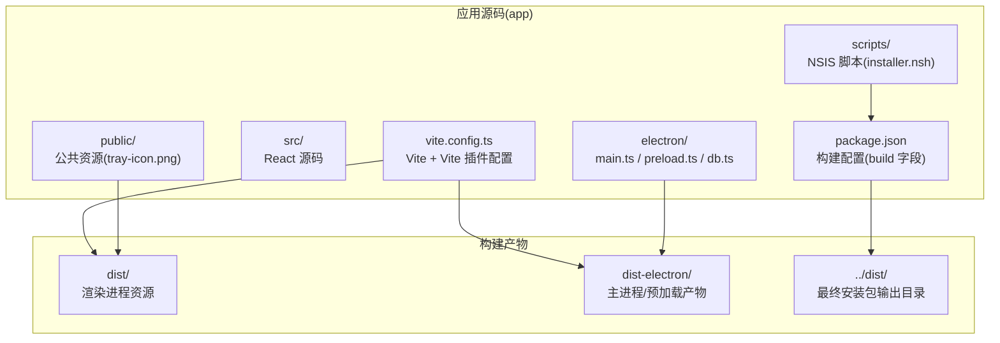
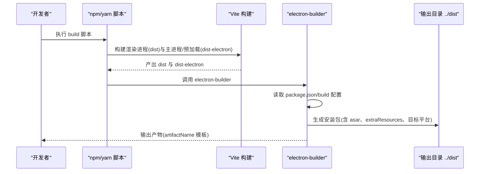
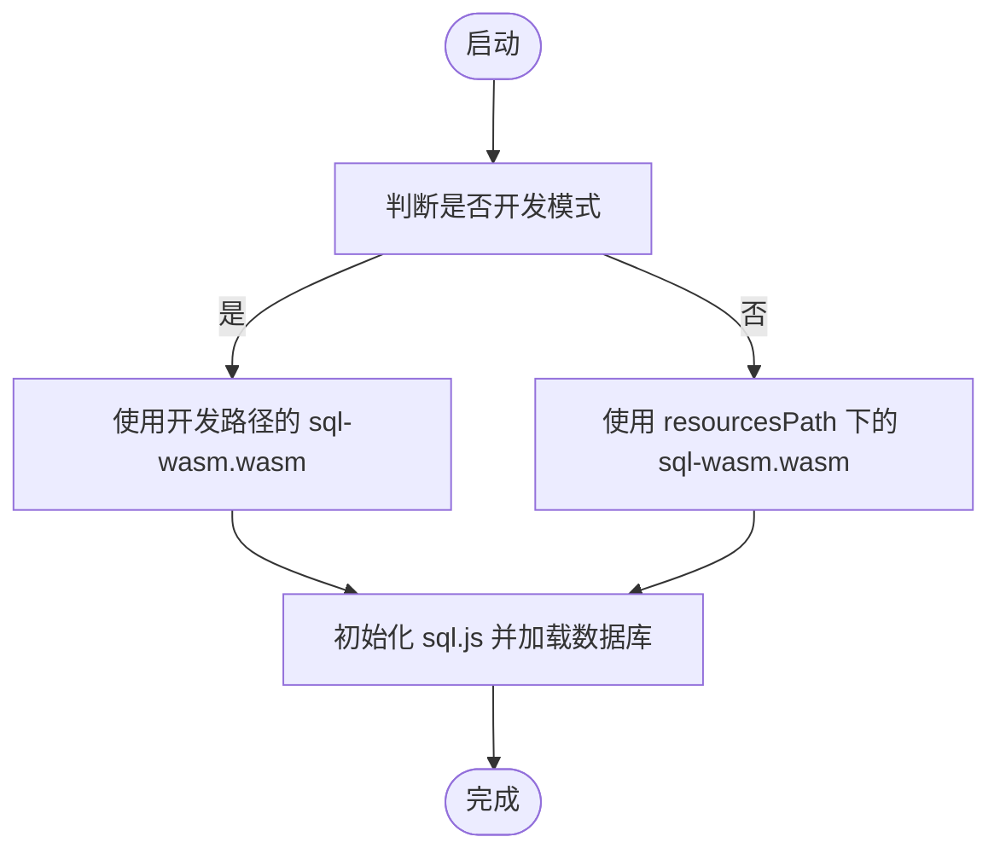
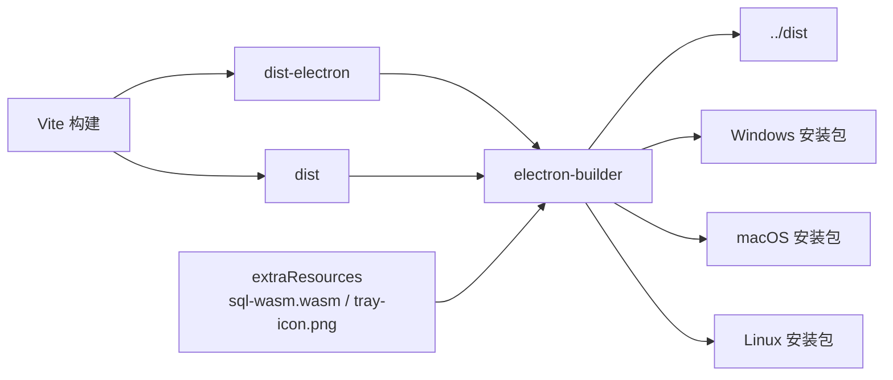

# Electron 打包

<cite>
**本文引用的文件**
- [package.json](file://app/package.json)
- [vite.config.ts](file://app/vite.config.ts)
- [main.ts](file://app/electron/main.ts)
- [preload.ts](file://app/electron/preload.ts)
- [db.ts](file://app/electron/db.ts)
- [installer.nsh](file://app/scripts/installer.nsh)
- [build-vc.js](file://build-vc.js)
</cite>

## 目录
1. [简介](#简介)
2. [项目结构](#项目结构)
3. [核心组件](#核心组件)
4. [架构总览](#架构总览)
5. [详细组件分析](#详细组件分析)
6. [依赖关系分析](#依赖关系分析)
7. [性能考量](#性能考量)
8. [故障排查指南](#故障排查指南)
9. [结论](#结论)
10. [附录](#附录)

## 简介
本文件面向需要为 Electron 应用制定与执行打包流程的工程团队，结合仓库中现有的配置与脚本，系统化梳理 electron-builder 的配置与使用方式，覆盖多平台（Windows、macOS、Linux）打包差异、应用图标与安装器配置、数字签名与安全策略、asar 打包格式选择与原生模块处理、自动更新机制现状与落地建议、常见问题排查与性能优化策略，以及不同发布渠道的打包策略与版本管理实践。

## 项目结构
本项目采用 Vite + electron-builder 的前端构建与打包方案，核心目录与职责如下：
- app：应用源码与打包配置
  - electron：主进程、预加载脚本与数据库初始化逻辑
  - src：React 前端源码
  - public：公共资源（如托盘图标）
  - scripts：NSIS 安装脚本片段
  - 构建产物输出：
    - dist：渲染进程资源
    - dist-electron：主进程与预加载构建产物
- 根目录：打包脚本与顶层说明

**图表来源**
- [vite.config.ts:1-37](file://app/vite.config.ts#L1-L37)
- [package.json:50-99](file://app/package.json#L50-L99)

**章节来源**
- [vite.config.ts:1-37](file://app/vite.config.ts#L1-L37)
- [package.json:50-99](file://app/package.json#L50-L99)

## 核心组件
- 构建脚本与入口
  - package.json 的 scripts.build 负责先构建 Vite，再调用 electron-builder 进行打包。
  - build-vc.js 提供直接调用 electron-builder CLI 的示例，便于在 CI 或本地快速触发 Windows 平台构建。
- 构建配置（build 字段）
  - appId、productName、directories.output 指定应用标识、产品名与输出目录。
  - files 与 extraResources 明确打包包含的资源与额外资源路径。
  - asar 启用 asar 归档；electronDist 指定 Electron 发行版路径。
  - win.target 指定 Windows 平台目标（nsis 与 portable），nsis 配置包含安装向导行为与自定义脚本。
  - artifactName 定义产物命名模板。
- Vite 配置
  - 主进程与预加载分别指定输出目录 dist-electron，并对外部化 sql.js。
  - 渲染进程输出至 dist。
- 主进程与预加载
  - 主进程负责窗口、托盘、IPC、定时提醒等；预加载通过 contextBridge 暴露 API。
- 数据库与原生模块
  - 使用 sql.js（WebAssembly），在开发与打包后两种路径下定位 wasm 文件。
  - 通过 extraResources 将 sql-wasm.wasm 与 tray-icon.png 注入应用资源。

**章节来源**
- [package.json:9-14](file://app/package.json#L9-L14)
- [package.json:50-99](file://app/package.json#L50-L99)
- [build-vc.js:1-9](file://build-vc.js#L1-L9)
- [vite.config.ts:9-32](file://app/vite.config.ts#L9-L32)
- [main.ts:54-92](file://app/electron/main.ts#L54-L92)
- [preload.ts:18-116](file://app/electron/preload.ts#L18-L116)
- [db.ts:60-90](file://app/electron/db.ts#L60-L90)

## 架构总览
下图展示从构建到打包的关键流程与组件交互：

**图表来源**
- [package.json:12](file://app/package.json#L12)
- [package.json:50-99](file://app/package.json#L50-L99)
- [vite.config.ts:33-36](file://app/vite.config.ts#L33-L36)
- [build-vc.js:4](file://build-vc.js#L4)

## 详细组件分析

### electron-builder 配置与使用
- 关键配置项解析
  - appId/productName/directories.output：统一应用标识与输出位置。
  - files/extraResources：明确包含渲染进程资源、主进程产物、WASM 与托盘图标。
  - asar：启用归档以提升安全性与加载性能。
  - electronDist：指向已安装的 Electron 发行版目录。
  - win.target/nsis：定义 Windows 安装包类型与安装向导行为，include 引入自定义 NSIS 片段。
  - artifactName：产物命名规则，便于自动化分发。
- 使用方式
  - 本地：npm/yarn run build 自动完成 Vite 构建与 electron-builder 打包。
  - CI/手动：通过 build-vc.js 或直接调用 electron-builder CLI 指定平台参数。

**章节来源**
- [package.json:50-99](file://app/package.json#L50-L99)
- [build-vc.js:1-9](file://build-vc.js#L1-L9)

### 多平台打包流程与差异
- Windows
  - 目标：nsis 与 portable 两种形式，支持自定义安装脚本（VC++ 运行库下载）。
  - 安装器行为：一键安装与允许更改安装目录。
- macOS/Linux
  - 当前配置未显式声明 macOS/Linux 的 target 与签名策略，需在实际发布时补充相应字段（例如 mac、linux、dmg、zip 等）。
- 平台差异要点
  - 图标与签名：Windows 使用可执行文件签名；macOS 使用 codesign；Linux 通常无需签名但可生成 DEB/RPM。
  - 安装体验：Windows 使用 NSIS；macOS 建议 DMG；Linux 建议 AppImage/DEB/RPM。

**章节来源**
- [package.json:75-96](file://app/package.json#L75-L96)
- [installer.nsh:7-14](file://app/scripts/installer.nsh#L7-L14)

### 应用图标、安装程序与资源注入
- 应用图标
  - 项目内置多尺寸图标模板与 Linux 图标集，可在构建时按平台注入。
- 托盘图标
  - 开发与打包后路径不同，主进程根据 isDev 与 resourcesPath 动态定位。
- 安装程序
  - NSIS 包含 VC++ 运行库下载与静默安装逻辑，确保运行环境。
- 资源注入
  - 通过 extraResources 将 sql-wasm.wasm 与 tray-icon.png 注入应用资源，保证运行期可用。

**章节来源**
- [main.ts:54-92](file://app/electron/main.ts#L54-L92)
- [db.ts:60-90](file://app/electron/db.ts#L60-L90)
- [package.json:63-72](file://app/package.json#L63-L72)
- [installer.nsh:7-14](file://app/scripts/installer.nsh#L7-L14)

### 数字签名与安全策略
- Windows
  - 当前配置未启用签名，可扩展 signAndEditExecutable 或使用 @electron/windows-sign 工具链。
- macOS
  - 当前配置未启用签名，需在构建时配置 identity、entitlements、hardenedRuntime 等。
- Linux
  - 通常不强制签名，但可配合 AppImage/DEB/RPM 的签名工具进行供应链安全加固。
- 安全建议
  - 启用 asar 并合理配置 asarUnpack（仅对必须解包的原生模块生效）。
  - 对于 WebAssembly 模块，确保 locateFile 路径正确且只读访问。
  - 在 CI 中使用受信证书与签名工具，避免本地签名密钥泄露。

**章节来源**
- [package.json:75-96](file://app/package.json#L75-L96)
- [db.ts:60-90](file://app/electron/db.ts#L60-L90)

### asar 打包格式与原生模块处理
- asar 选择
  - 启用 asar 可隐藏源码、提升加载性能；对原生模块需谨慎处理。
- 原生模块与 WASM
  - 项目使用 sql.js（WASM），通过 extraResources 注入并在运行时动态定位 wasm 文件。
  - Vite 配置将 sql.js 设为外部依赖，避免被 asar 打包。
- 最佳实践
  - 仅对静态资源启用 asar；原生二进制或动态库应 asarUnpack。
  - 对 WASM 文件，确保 locateFile 返回正确的资源路径（开发与生产环境均兼容）。

**图表来源**
- [db.ts:60-90](file://app/electron/db.ts#L60-L90)

**章节来源**
- [package.json:74](file://app/package.json#L74)
- [vite.config.ts:15-17](file://app/vite.config.ts#L15-L17)
- [db.ts:60-90](file://app/electron/db.ts#L60-L90)

### 自动更新机制
- 现状
  - 仓库未发现自动更新相关配置或实现代码。
- 建议方案
  - Windows：使用 squirrel.windows 或 nsis 更新器，结合 GitHub/Gitee Releases。
  - macOS：使用 electron-updater 的 dmg 或 zip 方案。
  - Linux：使用 AppImage 或 DEB/RPM 的更新通道。
- 实施步骤
  - 在 package.json 的 build 字段添加对应平台的更新配置。
  - 在主进程中引入 autoUpdater，并在应用启动后检查更新。
  - 在 CI 中发布新版本并上传更新包。

**章节来源**
- [package.json:50-99](file://app/package.json#L50-L99)
- [main.ts:360-369](file://app/electron/main.ts#L360-L369)

### 打包流程中的常见问题与排查
- 打包后无法找到 sql-wasm.wasm
  - 确认 extraResources 是否包含该文件，且 locateFile 返回的路径正确。
- 托盘图标在打包后不显示
  - 检查主进程根据 isDev 与 resourcesPath 的分支逻辑是否命中。
- NSIS 安装失败或缺少 VC++ 运行库
  - 确认 include 的 NSIS 片段已生效，网络可达性与下载路径正确。
- Windows 平台签名失败
  - 确认证书与签名工具可用，CI 环境变量与权限配置正确。
- macOS 平台沙箱/权限问题
  - 确认 entitlements 与 hardenedRuntime 配置完整，必要时调整 Info.plist。

**章节来源**
- [db.ts:60-90](file://app/electron/db.ts#L60-L90)
- [main.ts:54-92](file://app/electron/main.ts#L54-L92)
- [installer.nsh:7-14](file://app/scripts/installer.nsh#L7-L14)
- [package.json:75-96](file://app/package.json#L75-L96)

## 依赖关系分析
- 构建链路
  - Vite 负责渲染进程与主进程/预加载的构建；electron-builder 负责打包与生成安装包。
- 资源依赖
  - 主进程与预加载依赖 dist 与 dist-electron；数据库依赖 sql-wasm.wasm；托盘图标依赖 public 与 extraResources。
- 外部工具
  - electron-builder 依赖 Electron 发行版（electronDist 指定）；Windows 签名依赖 @electron/windows-sign；macOS 签名依赖 @electron/osx-sign。

**图表来源**
- [vite.config.ts:33-36](file://app/vite.config.ts#L33-L36)
- [package.json:50-99](file://app/package.json#L50-L99)
- [db.ts:60-90](file://app/electron/db.ts#L60-L90)

**章节来源**
- [vite.config.ts:9-32](file://app/vite.config.ts#L9-L32)
- [package.json:50-99](file://app/package.json#L50-L99)

## 性能考量
- asar 与资源组织
  - 启用 asar 可减少文件数量带来的 I/O 开销；对体积大且频繁读取的资源可考虑 asarUnpack。
- 构建优化
  - 将 sql.js 等原生模块外置，避免不必要的打包与压缩开销。
  - 控制 files 列表，仅包含必要资源，缩短打包时间。
- 运行时优化
  - WASM 初始化路径尽量稳定，避免重复定位与 IO。
  - IPC 接口尽量聚合，减少通信次数。

**章节来源**
- [package.json:74](file://app/package.json#L74)
- [vite.config.ts:15-17](file://app/vite.config.ts#L15-L17)
- [db.ts:60-90](file://app/electron/db.ts#L60-L90)

## 故障排查指南
- 打包失败
  - 检查 electronDist 是否指向有效 Electron 发行版目录。
  - 确认 files/extraResources 覆盖所有运行期依赖。
- 运行期异常
  - 核对 locateFile 返回路径与实际资源位置一致。
  - 检查主进程与预加载的输出目录与 Vite 配置一致。
- 平台特定问题
  - Windows：确认 NSIS include 脚本与 VC++ 下载逻辑。
  - macOS/Linux：确认签名与权限配置，必要时补充 entitlements 与 target。

**章节来源**
- [package.json:73](file://app/package.json#L73)
- [package.json:56-72](file://app/package.json#L56-L72)
- [db.ts:60-90](file://app/electron/db.ts#L60-L90)
- [installer.nsh:7-14](file://app/scripts/installer.nsh#L7-L14)

## 结论
本项目已具备较为完整的打包基础：Vite 构建链路清晰、electron-builder 配置明确、资源注入与 WASM 处理到位。建议在现有基础上补充 macOS/Linux 的目标与签名配置、Windows 的安装器增强与自动更新能力，并在 CI 中固化签名与发布流程，以实现跨平台、可审计、可自动化的高质量交付。

## 附录
- 发布渠道与版本管理建议
  - 版本号由 package.json 的 version 统一管理；每次发布前更新版本并打标签。
  - 不同渠道（内测、公测、正式）使用不同的 appId 或构建变体，便于区分安装包。
  - CI 中按平台与架构生成产物，上传至制品库或发布页，触发自动更新推送。

**章节来源**
- [package.json:4](file://app/package.json#L4)
- [package.json:50-99](file://app/package.json#L50-L99)