# Vite 构建配置

<cite>
**本文档引用的文件**
- [vite.config.ts](file://app/vite.config.ts)
- [package.json](file://app/package.json)
- [main.ts](file://app/electron/main.ts)
- [preload.ts](file://app/electron/preload.ts)
- [index.html](file://app/index.html)
- [main.tsx](file://app/src/main.tsx)
- [db.ts](file://app/electron/db.ts)
- [types.ts](file://app/src/types.ts)
- [installer.nsh](file://app/scripts/installer.nsh)
- [tsconfig.json](file://app/tsconfig.json)
</cite>

## 目录
1. [简介](#简介)
2. [项目结构](#项目结构)
3. [核心组件](#核心组件)
4. [架构概览](#架构概览)
5. [详细组件分析](#详细组件分析)
6. [依赖关系分析](#依赖关系分析)
7. [性能考虑](#性能考虑)
8. [故障排除指南](#故障排除指南)
9. [结论](#结论)
10. [附录](#附录)

## 简介

这是一个基于 Vite 和 Electron 的桌面应用构建配置文档。项目采用现代化的前端技术栈，使用 Vite 作为构建工具，结合 Electron 实现跨平台桌面应用开发。配置重点涵盖了主进程、预加载脚本和渲染进程的分离构建，以及针对 sql.js 的外部依赖处理策略。

## 项目结构

该项目采用典型的 Vite + Electron 结构，主要目录组织如下：

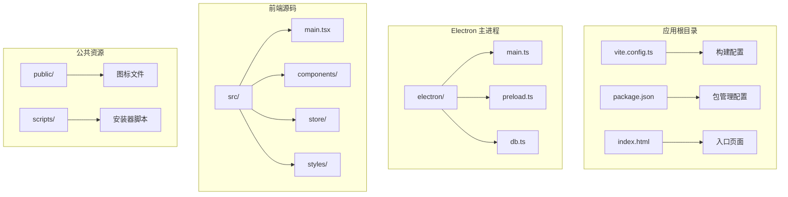

**图表来源**
- [vite.config.ts:1-37](file://app/vite.config.ts#L1-L37)
- [package.json:1-100](file://app/package.json#L1-L100)
- [index.html:1-14](file://app/index.html#L1-L14)

**章节来源**
- [vite.config.ts:1-37](file://app/vite.config.ts#L1-L37)
- [package.json:1-100](file://app/package.json#L1-L100)
- [index.html:1-14](file://app/index.html#L1-L14)

## 核心组件

### Vite 构建配置核心组件

项目的核心构建配置由三个主要插件组成：

1. **@vitejs/plugin-react**: React 组件的开发和构建支持
2. **vite-plugin-electron**: Electron 主进程的专用构建插件
3. **vite-plugin-electron-renderer**: 渲染进程的增强支持插件

每个组件都有特定的配置职责和输出目录设置。

**章节来源**
- [vite.config.ts:6-36](file://app/vite.config.ts#L6-L36)

## 架构概览

整个应用的构建架构采用了分离式设计，确保各进程的独立性和安全性：

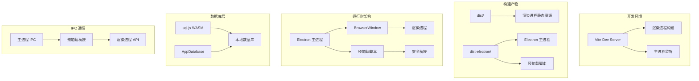

**图表来源**
- [vite.config.ts:9-31](file://app/vite.config.ts#L9-L31)
- [main.ts:18-52](file://app/electron/main.ts#L18-L52)
- [preload.ts:18-116](file://app/electron/preload.ts#L18-L116)

## 详细组件分析

### Vite 配置文件分析

#### 插件配置详解

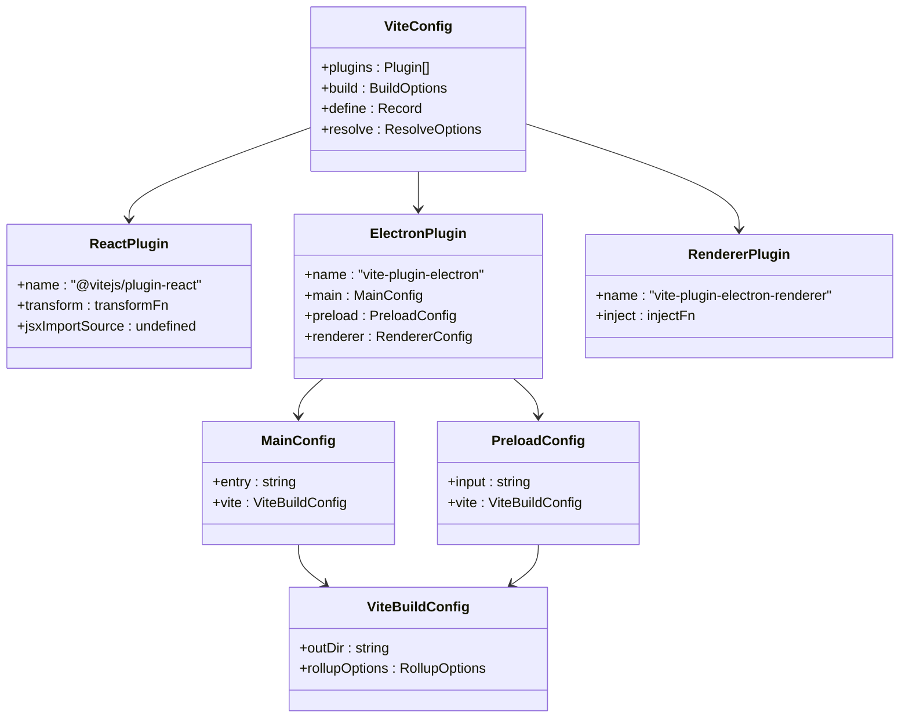

**图表来源**
- [vite.config.ts:7-32](file://app/vite.config.ts#L7-L32)

#### 输出目录配置

项目采用了分离的输出目录策略：

| 目录 | 用途 | 描述 |
|------|------|------|
| `dist/` | 渲染进程 | 存放 React 应用的最终构建产物 |
| `dist-electron/` | 主进程和预加载 | 存放 Electron 主进程和预加载脚本 |

这种分离确保了：
- 渲染进程的静态资源与 Electron 主进程代码隔离
- 预加载脚本的安全执行环境
- 数据库文件的正确打包和分发

**章节来源**
- [vite.config.ts:33-36](file://app/vite.config.ts#L33-L36)
- [vite.config.ts:14-26](file://app/vite.config.ts#L14-L26)

### 主进程构建配置

#### 主进程配置细节

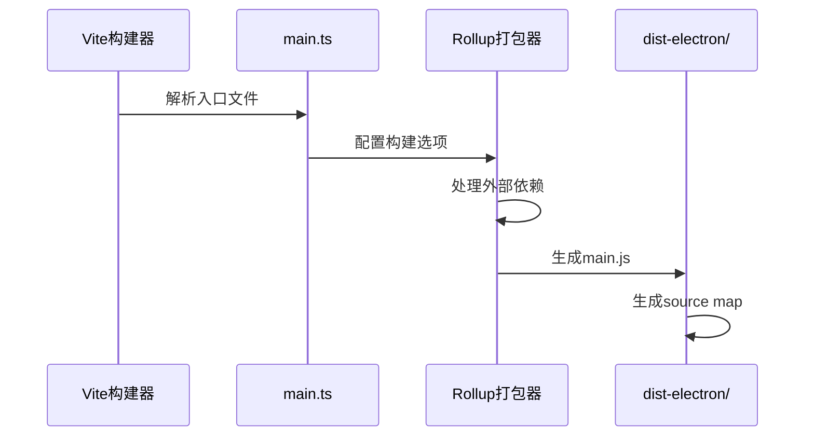

**图表来源**
- [vite.config.ts:9-20](file://app/vite.config.ts#L9-L20)

#### 外部依赖处理

项目对 `sql.js` 采用了特殊的外部依赖处理策略：

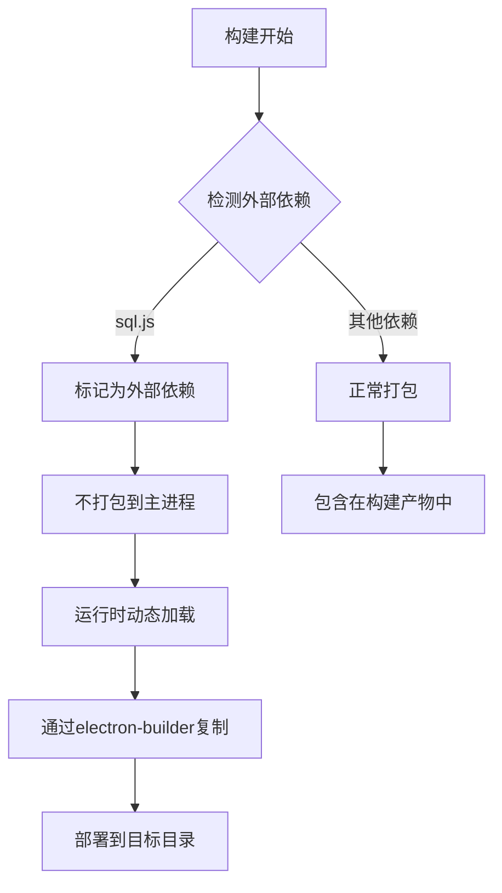

**图表来源**
- [vite.config.ts:16](file://app/vite.config.ts#L16)

**章节来源**
- [vite.config.ts:9-20](file://app/vite.config.ts#L9-L20)

### 预加载脚本配置

#### 预加载脚本构建特点

预加载脚本采用了独立的构建配置：

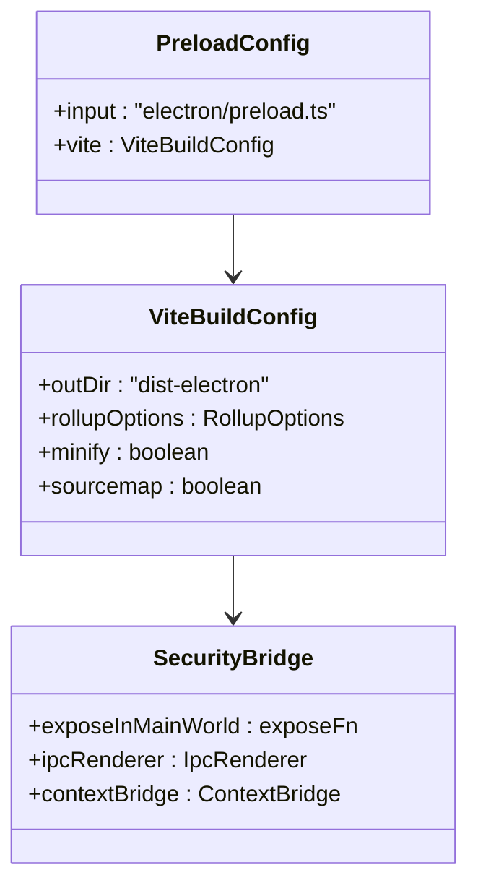

**图表来源**
- [vite.config.ts:21-29](file://app/vite.config.ts#L21-L29)

**章节来源**
- [vite.config.ts:21-29](file://app/vite.config.ts#L21-L29)

### 渲染进程配置

#### 渲染进程构建特性

渲染进程使用标准的 Vite 配置：

**图表来源**
- [vite.config.ts:33-36](file://app/vite.config.ts#L33-L36)

**章节来源**
- [vite.config.ts:33-36](file://app/vite.config.ts#L33-L36)

## 依赖关系分析

### 构建工具链依赖

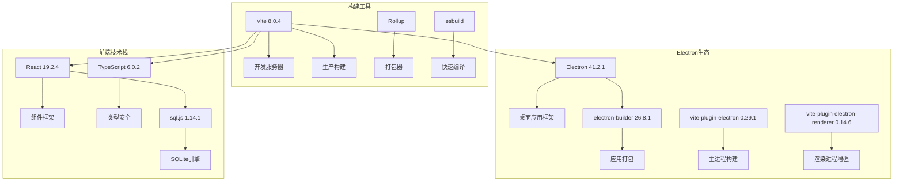

**图表来源**
- [package.json:27-49](file://app/package.json#L27-L49)

### 运行时依赖关系

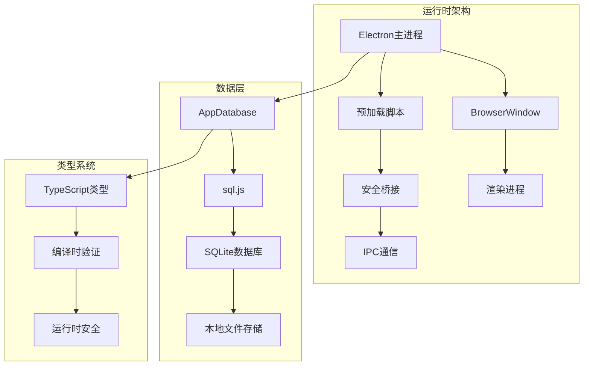

**图表来源**
- [main.ts:1-391](file://app/electron/main.ts#L1-L391)
- [db.ts:1-800](file://app/electron/db.ts#L1-L800)

**章节来源**
- [package.json:16-49](file://app/package.json#L16-L49)

## 性能考虑

### 构建性能优化策略

#### 外部依赖优化

项目对外部依赖采用了智能处理策略：

1. **sql.js 外部化**: 避免将大型 WASM 文件打包到主进程
2. **按需加载**: 运行时动态加载外部依赖
3. **文件复制**: 通过 electron-builder 确保文件正确部署

#### 缓存和增量构建

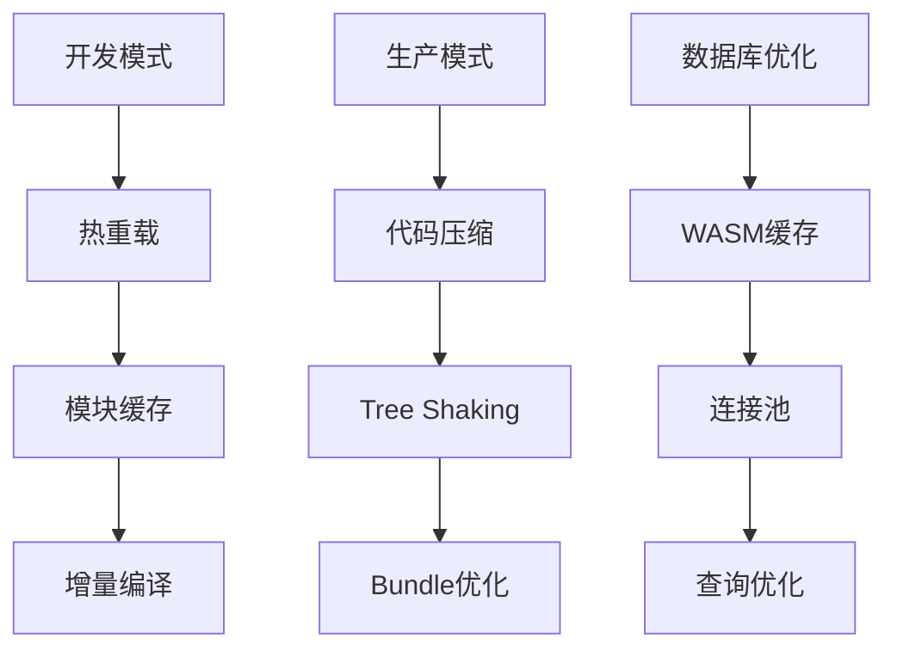

### 内存和资源管理

#### 数据库内存优化

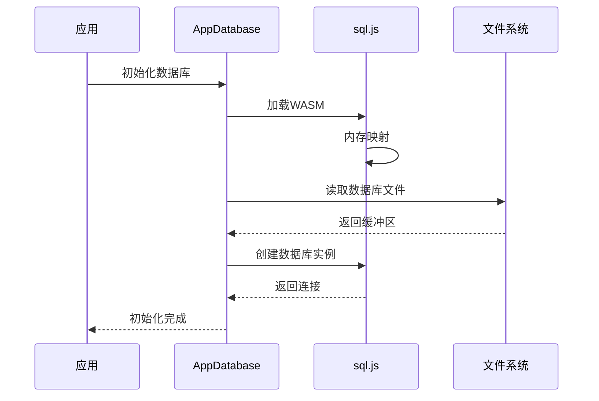

**图表来源**
- [db.ts:60-90](file://app/electron/db.ts#L60-L90)

**章节来源**
- [db.ts:60-90](file://app/electron/db.ts#L60-L90)

## 故障排除指南

### 常见构建问题及解决方案

#### 1. sql.js 依赖问题

**问题症状**:
- 构建时出现 sql.js 相关错误
- 运行时无法找到 sql.js 模块

**解决方案**:
- 确保在 `rollupOptions.external` 中声明外部依赖
- 在 `electron-builder` 配置中添加文件复制规则
- 验证 WASM 文件路径在开发和生产环境中的正确性

#### 2. 预加载脚本安全问题

**问题症状**:
- 预加载脚本无法访问某些 API
- 安全警告或错误

**解决方案**:
- 使用 `contextBridge.exposeInMainWorld` 正确暴露 API
- 确保所有 IPC 调用都有对应的处理器
- 验证类型定义的完整性

#### 3. 开发服务器热重载问题

**问题症状**:
- 修改代码后页面不刷新
- 热重载失效

**解决方案**:
- 检查 VITE_DEV_SERVER_URL 环境变量
- 确保开发服务器正确启动
- 验证端口占用情况

**章节来源**
- [vite.config.ts:16](file://app/vite.config.ts#L16)
- [main.ts:9](file://app/electron/main.ts#L9)
- [preload.ts:18-116](file://app/electron/preload.ts#L18-L116)

### 调试技巧

#### 开发环境调试

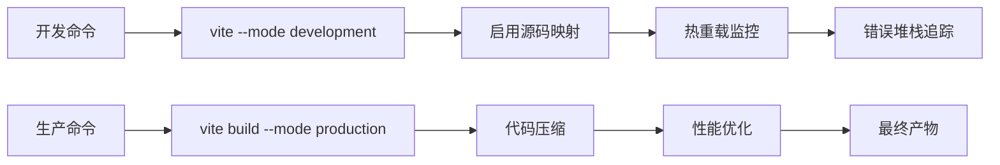

#### Electron 调试

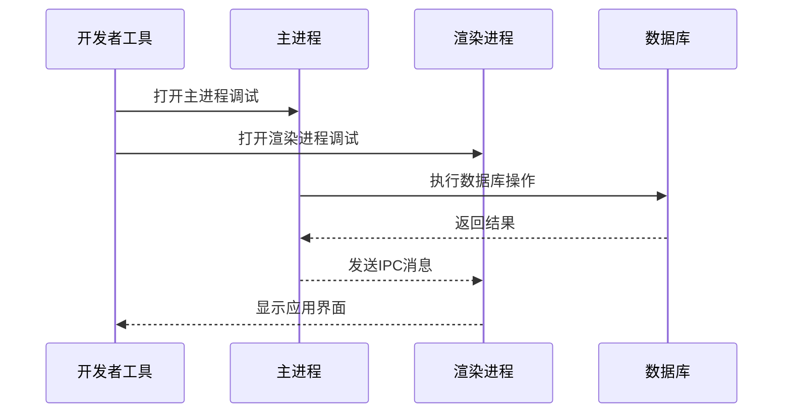

## 结论

本项目的 Vite 构建配置展现了现代 Electron 应用的最佳实践。通过分离主进程、预加载脚本和渲染进程的构建，实现了更好的安全性、可维护性和性能表现。

关键优势包括：
- **安全隔离**: 预加载脚本的安全桥接机制
- **性能优化**: 外部依赖的智能处理和按需加载
- **开发体验**: 完善的热重载和调试支持
- **部署友好**: 通过 electron-builder 的完整打包流程

## 附录

### 配置最佳实践

#### 环境变量配置

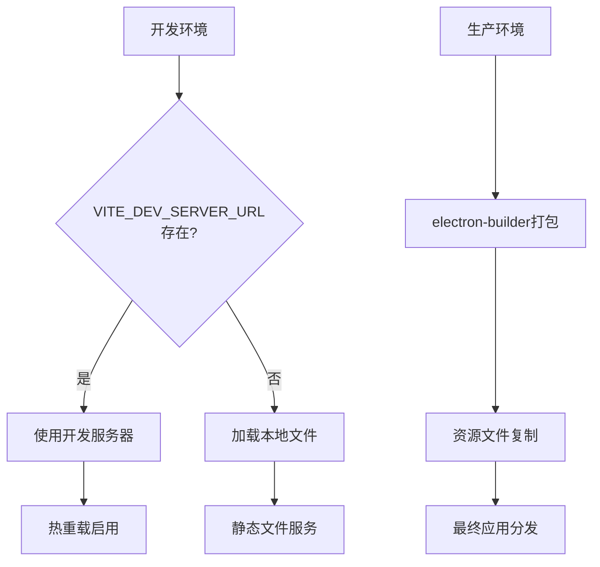

#### 类型安全配置

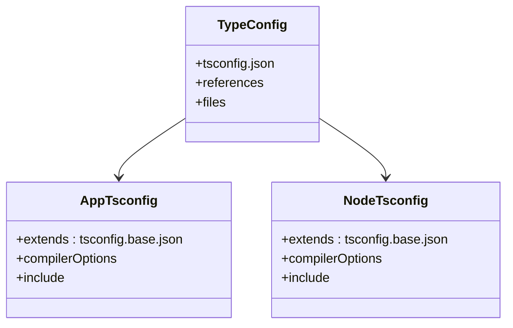

**图表来源**
- [tsconfig.json:1-8](file://app/tsconfig.json#L1-L8)

### 扩展建议

#### 性能监控

建议添加以下监控机制：
- 构建时间分析
- Bundle 大小监控
- 运行时性能指标
- 内存使用情况跟踪

#### 安全加固

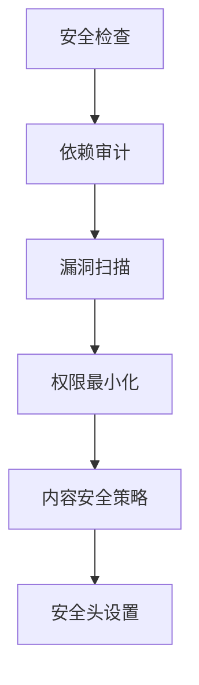