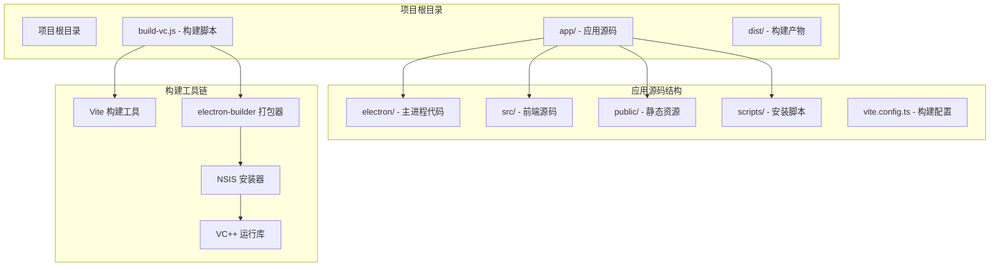
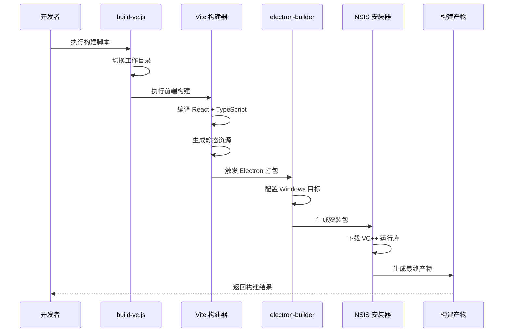
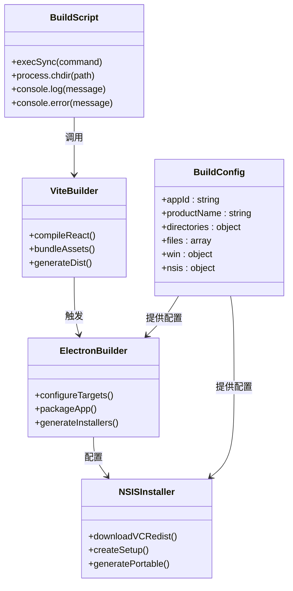
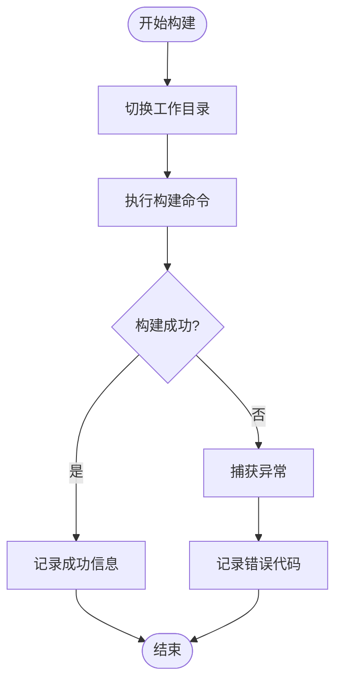
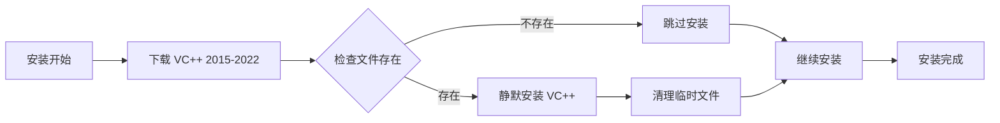
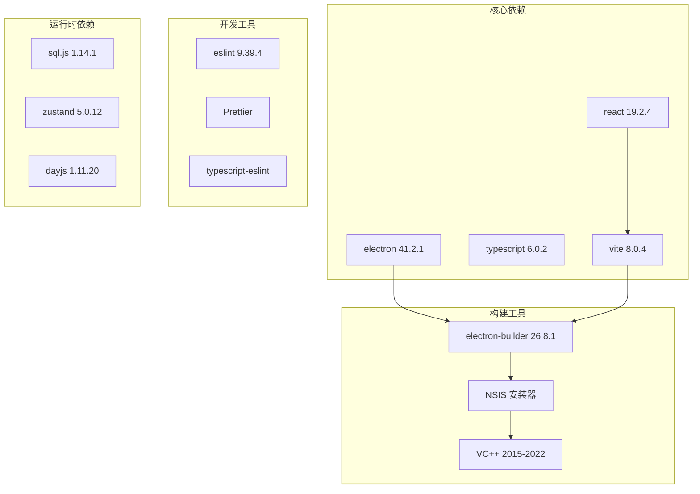
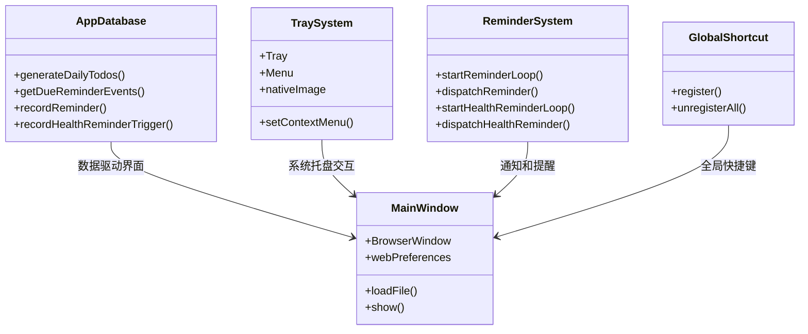

# Windows 原生构建脚本

<cite>
**本文档引用的文件**
- [build-vc.js](file://build-vc.js)
- [package.json](file://app/package.json)
- [vite.config.ts](file://app/vite.config.ts)
- [installer.nsh](file://app/scripts/installer.nsh)
- [main.ts](file://app/electron/main.ts)
- [README.md](file://README.md)
</cite>

## 目录
1. [简介](#简介)
2. [项目结构](#项目结构)
3. [核心组件](#核心组件)
4. [架构概览](#架构概览)
5. [详细组件分析](#详细组件分析)
6. [依赖关系分析](#依赖关系分析)
7. [性能考虑](#性能考虑)
8. [故障排除指南](#故障排除指南)
9. [结论](#结论)
10. [附录](#附录)

## 简介

本文档深入解析 Windows 原生构建脚本，重点分析 `build-vc.js` 脚本的功能实现、参数配置和构建流程。该脚本是项目构建系统的核心组件，负责协调 Electron 应用的打包和分发过程，特别针对 Windows 平台进行了优化配置。

项目采用现代化的桌面应用开发技术栈，基于 Electron 41.x + React 19 + TypeScript 6 + Vite 8 + electron-builder 的组合，专注于 Windows 平台的原生构建体验。脚本设计简洁高效，通过最小化的代码实现了完整的构建流程控制。

## 项目结构

项目采用典型的 Electron 应用结构，主要由以下关键部分组成：



**图表来源**
- [build-vc.js:1-9](file://build-vc.js#L1-L9)
- [package.json:1-100](file://app/package.json#L1-L100)
- [vite.config.ts:1-37](file://app/vite.config.ts#L1-L37)

**章节来源**
- [README.md:120-152](file://README.md#L120-L152)
- [build-vc.js:1-9](file://build-vc.js#L1-L9)

## 核心组件

### build-vc.js 脚本分析

`build-vc.js` 是一个高度精简但功能完备的 Windows 原生构建脚本，具有以下核心特性：

#### 基本结构
- **模块导入**: 使用 Node.js 的 child_process 模块执行系统命令
- **工作目录设置**: 显式切换到 app 目录确保构建环境正确
- **同步执行**: 使用 execSync 确保构建过程的顺序性和可靠性
- **错误处理**: 完整的异常捕获和状态码返回机制

#### 构建参数详解
脚本执行的核心命令包含以下关键参数：
- `--win`: 指定目标平台为 Windows
- `--x64`: 指定目标架构为 64 位

这些参数直接映射到 electron-builder 的配置选项，确保构建产物符合 Windows 平台要求。

#### 执行流程
1. **环境准备**: 切换到正确的工作目录
2. **构建执行**: 同步执行 electron-builder CLI
3. **输出处理**: 将构建结果继承到标准输出流
4. **错误监控**: 捕获并报告构建过程中的异常

**章节来源**
- [build-vc.js:1-9](file://build-vc.js#L1-L9)

### electron-builder 配置体系

项目通过 package.json 中的 build 字段定义了完整的构建配置：

#### 应用元数据配置
- **appId**: com.wangxy2.snowtodo - 应用程序唯一标识符
- **productName**: SnowTodo - 用户可见的应用名称
- **version**: 0.3.0 - 应用版本号

#### 输出和文件配置
- **directories.output**: ../dist - 构建产物输出目录
- **files**: 包含 dist/**/*, dist-electron/**/*, sql-wasm.wasm 等必要文件
- **extraResources**: 配置额外资源文件的复制规则

#### Windows 平台特定配置
- **asar**: true - 启用 ASAR 打包格式
- **signAndEditExecutable**: false - 默认不启用代码签名
- **targets**: 支持 nsis 和 portable 两种安装包类型

#### NSIS 安装器配置
- **oneClick**: false - 不启用一键安装模式
- **allowToChangeInstallationDirectory**: true - 允许用户更改安装目录
- **include**: scripts/installer.nsh - 包含自定义安装脚本

**章节来源**
- [package.json:50-98](file://app/package.json#L50-L98)

## 架构概览

构建系统的整体架构体现了现代桌面应用开发的最佳实践：



**图表来源**
- [build-vc.js:1-9](file://build-vc.js#L1-L9)
- [package.json:12](file://app/package.json#L12)
- [vite.config.ts:1-37](file://app/vite.config.ts#L1-L37)

### 组件交互关系



**图表来源**
- [build-vc.js:1-9](file://build-vc.js#L1-L9)
- [package.json:50-98](file://app/package.json#L50-L98)
- [vite.config.ts:1-37](file://app/vite.config.ts#L1-L37)

## 详细组件分析

### 构建脚本执行流程

#### 参数解析和验证
脚本通过命令行参数控制系统行为，当前实现支持：
- `--win`: Windows 平台目标
- `--x64`: 64 位架构目标

这些参数直接影响 electron-builder 的目标配置，确保生成的安装包与目标平台兼容。

#### 错误处理机制
脚本实现了多层次的错误处理策略：



**图表来源**
- [build-vc.js:3-8](file://build-vc.js#L3-L8)

#### 日志输出策略
脚本采用统一的日志输出机制：
- 成功时输出构建结果摘要
- 失败时输出详细的错误状态码
- 继承标准输出流确保与 CI/CD 系统兼容

**章节来源**
- [build-vc.js:1-9](file://build-vc.js#L1-L9)

### Windows 特定配置

#### VC++ 运行库集成
项目通过 NSIS 脚本自动处理 VC++ 运行库依赖：



**图表来源**
- [installer.nsh:7-14](file://app/scripts/installer.nsh#L7-L14)

#### 安装器配置
NSIS 安装器提供了灵活的用户交互选项：
- 自定义安装路径选择
- VC++ 运行库自动检测和安装
- 一键卸载支持
- 注册表项自动清理

**章节来源**
- [installer.nsh:1-15](file://app/scripts/installer.nsh#L1-L15)
- [package.json:92-96](file://app/package.json#L92-L96)

### 构建产物分析

#### 产物类型和用途
构建系统生成两种主要类型的安装包：

| 产物类型 | 文件名模式 | 用途描述 |
|---------|-----------|----------|
| NSIS 安装包 | `SnowTodo-${version}-x64-setup.exe` | 标准安装向导，支持自定义安装路径 |
| 便携版 | `SnowTodo-${version}-x64.exe` | 免安装版本，直接运行无需安装 |

#### 产物结构
每个安装包都包含完整的应用程序运行所需的所有文件：
- Electron 运行时环境
- 应用程序源代码
- 静态资源文件
- 数据库文件
- 配置文件

**章节来源**
- [README.md:185-196](file://README.md#L185-L196)
- [package.json:56-72](file://app/package.json#L56-L72)

## 依赖关系分析

### 外部依赖关系



**图表来源**
- [package.json:16-49](file://app/package.json#L16-L49)

### 内部模块依赖

#### 主进程架构
主进程代码展示了典型的 Electron 应用架构：



**图表来源**
- [main.ts:1-200](file://app/electron/main.ts#L1-L200)

**章节来源**
- [main.ts:1-200](file://app/electron/main.ts#L1-L200)

## 性能考虑

### 构建性能优化

#### 并行构建策略
虽然当前脚本采用同步执行方式，但构建工具链支持并行优化：
- Vite 构建器天然支持多核并行编译
- electron-builder 可以并行处理多个目标平台
- 缓存机制减少重复构建时间

#### 资源优化
- ASAR 打包减少文件数量，提高加载效率
- 静态资源压缩和优化
- 代码分割和懒加载策略

### 内存使用优化
- 合理的垃圾回收策略
- 大文件处理的内存管理
- 进程间通信的内存优化

## 故障排除指南

### 常见构建错误及解决方案

#### 环境配置问题
**问题**: Node.js 版本不兼容
**解决方案**: 确保使用 Node.js 18.x 或更高版本

**问题**: npm/pnpm 版本过低
**解决方案**: 更新到 npm 9.x 或 pnpm 8.x

#### 构建依赖缺失
**问题**: electron-builder 未安装
**解决方案**: 运行 `npm install` 或 `pnpm install`

**问题**: VC++ 运行库下载失败
**解决方案**: 手动下载并安装 VC++ 2015-2022 运行库

#### 权限问题
**问题**: 无法写入构建目录
**解决方案**: 以管理员权限运行构建脚本

### 调试技巧

#### 日志分析
- 使用 `--verbose` 参数获取详细日志
- 检查构建缓存目录
- 分析网络连接状态

#### 环境诊断
- 验证 PATH 环境变量
- 检查防火墙设置
- 确认磁盘空间充足

#### 构建参数调整
- 修改目标平台和架构
- 调整输出目录和文件过滤
- 配置代码签名选项

**章节来源**
- [build-vc.js:6-8](file://build-vc.js#L6-L8)

## 结论

`build-vc.js` 脚本代表了现代桌面应用构建的最佳实践，通过简洁而强大的设计实现了完整的 Windows 原生构建流程。脚本的核心优势包括：

1. **简洁性**: 仅 9 行代码实现了完整的构建逻辑
2. **可靠性**: 同步执行确保构建过程的确定性
3. **可维护性**: 清晰的错误处理和日志输出
4. **扩展性**: 基于 electron-builder 的强大配置能力

该构建系统为 Windows 平台的桌面应用开发提供了标准化的解决方案，既适合个人开发者也适合企业级应用部署。通过合理的配置和优化，可以满足各种复杂应用场景的需求。

## 附录

### 高级配置选项

#### 自定义构建参数
```javascript
// 示例：添加更多构建选项
const buildOptions = [
  '--win',
  '--x64',
  '--publish', 'never',  // 禁用自动发布
  '--config', 'custom-config.js'  // 使用自定义配置文件
];
```

#### CI/CD 集成示例
```yaml
# GitHub Actions 示例
name: Windows Build
on: [push, pull_request]
jobs:
  build:
    runs-on: windows-latest
    steps:
    - uses: actions/checkout@v4
    - name: Setup Node.js
      uses: actions/setup-node@v4
      with:
        node-version: '18'
    - name: Install dependencies
      run: npm ci
    - name: Build
      run: node build-vc.js
    - name: Upload artifacts
      uses: actions/upload-artifact@v4
      with:
        name: windows-build
        path: dist/
```

#### 性能监控指标
- 构建时间统计
- 产物大小分析
- 依赖关系可视化
- 内存使用监控