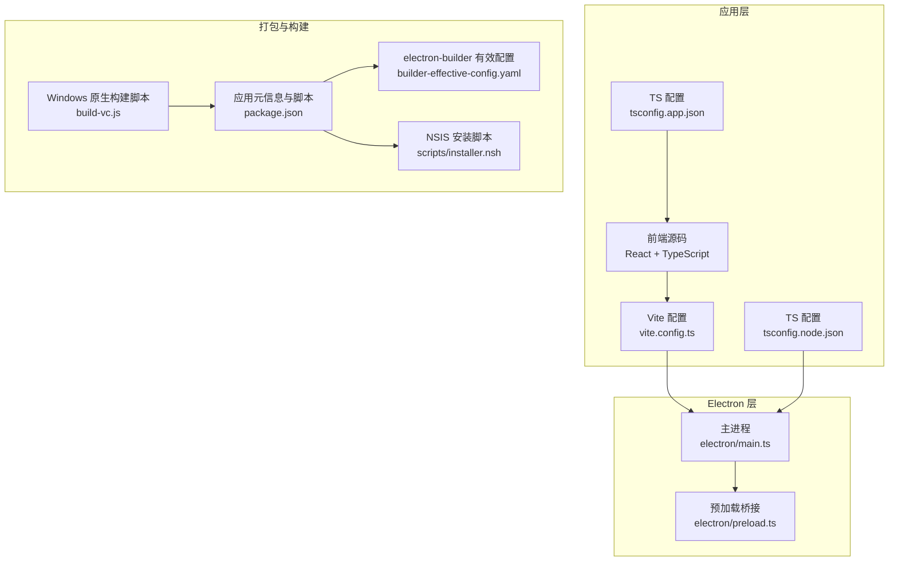
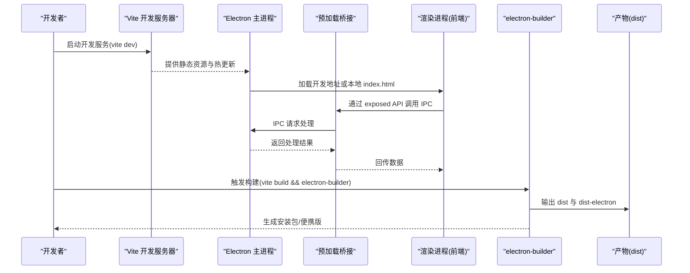
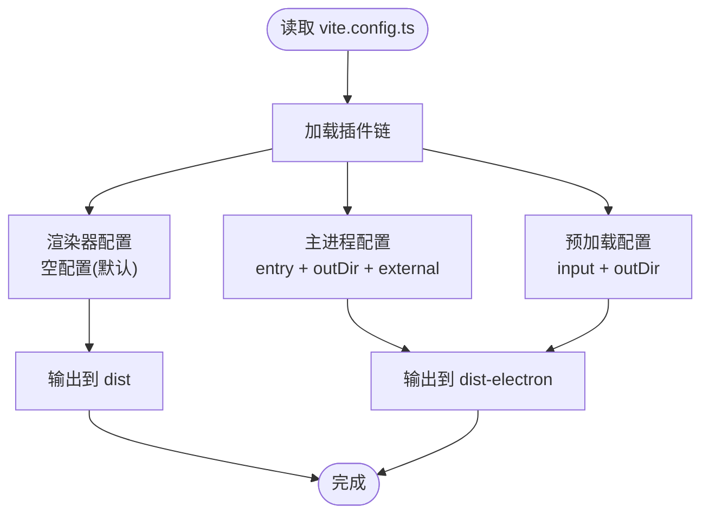
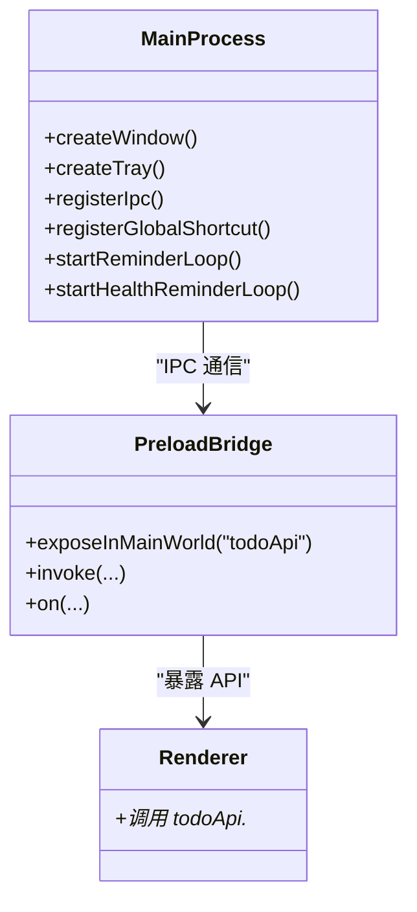
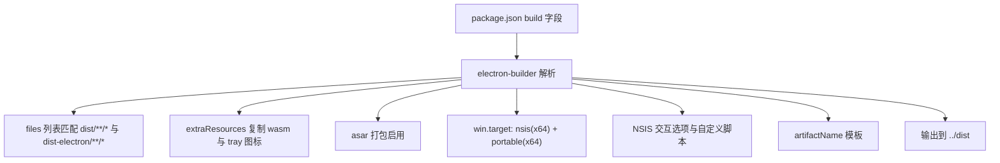
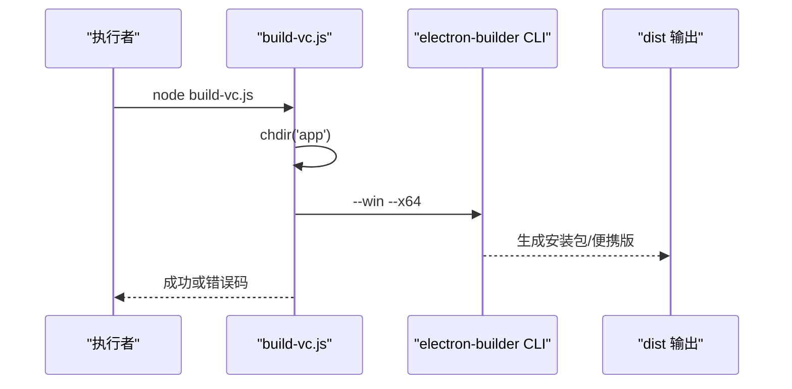
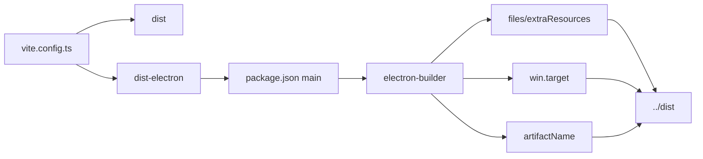

# 构建与部署

<cite>
**本文引用的文件**
- [vite.config.ts](file://app/vite.config.ts)
- [package.json](file://app/package.json)
- [build-vc.js](file://build-vc.js)
- [installer.nsh](file://app/scripts/installer.nsh)
- [builder-effective-config.yaml](file://dist/builder-effective-config.yaml)
- [main.ts](file://app/electron/main.ts)
- [preload.ts](file://app/electron/preload.ts)
- [tsconfig.json](file://app/tsconfig.json)
- [tsconfig.app.json](file://app/tsconfig.app.json)
- [tsconfig.node.json](file://app/tsconfig.node.json)
</cite>

## 目录
1. [简介](#简介)
2. [项目结构](#项目结构)
3. [核心组件](#核心组件)
4. [架构总览](#架构总览)
5. [详细组件分析](#详细组件分析)
6. [依赖关系分析](#依赖关系分析)
7. [性能考量](#性能考量)
8. [故障排除指南](#故障排除指南)
9. [结论](#结论)
10. [附录](#附录)

## 简介
本文件面向开发者与运维人员，系统化梳理 SnowTodo 的构建与部署流程，涵盖以下主题：
- Vite 开发与生产构建配置、Electron 集成设置
- electron-builder 多平台打包配置与产物组织
- Windows 平台原生构建脚本 build-vc.js 的用法与可选参数
- 安全与性能优化：应用签名、代码混淆、asar 打包策略
- 不同目标平台（Windows、macOS、Linux）的构建差异与注意事项
- 持续集成与自动化部署建议
- 版本管理与发布流程最佳实践
- 应用更新机制与自动更新实现思路
- 部署故障排除与性能监控要点

## 项目结构
仓库采用“前端应用 + Electron 主进程 + 打包工具”的分层组织方式：
- app：前端源码与构建配置，包含 React + TypeScript 源码、Vite 配置、Electron 主进程与预加载脚本
- 根目录：Windows 原生构建脚本 build-vc.js，以及构建产物输出目录 dist
- 资源与安装器：NSIS 安装脚本 installer.nsh，用于在安装时拉取并静默安装 VC++ 运行库

图表来源
- [vite.config.ts:1-37](file://app/vite.config.ts#L1-L37)
- [package.json:1-100](file://app/package.json#L1-L100)
- [main.ts:1-391](file://app/electron/main.ts#L1-L391)
- [preload.ts:1-117](file://app/electron/preload.ts#L1-L117)
- [builder-effective-config.yaml:1-34](file://dist/builder-effective-config.yaml#L1-L34)
- [installer.nsh:1-15](file://app/scripts/installer.nsh#L1-L15)
- [build-vc.js:1-9](file://build-vc.js#L1-L9)
- [tsconfig.app.json:1-26](file://app/tsconfig.app.json#L1-L26)
- [tsconfig.node.json:1-25](file://app/tsconfig.node.json#L1-L25)

章节来源
- [vite.config.ts:1-37](file://app/vite.config.ts#L1-L37)
- [package.json:1-100](file://app/package.json#L1-L100)
- [tsconfig.json:1-8](file://app/tsconfig.json#L1-L8)
- [tsconfig.app.json:1-26](file://app/tsconfig.app.json#L1-L26)
- [tsconfig.node.json:1-25](file://app/tsconfig.node.json#L1-L25)

## 核心组件
- Vite 构建配置：定义前端构建目录、插件链（React、Electron 插件、渲染器兼容插件），以及主进程与预加载脚本的独立构建输出目录
- Electron 主进程：负责窗口生命周期、托盘、全局快捷键、IPC 通信、提醒循环、数据导入导出等
- 预加载桥接：通过 contextBridge 暴露受控 API 至渲染进程，统一 IPC 调用入口
- electron-builder 配置：定义应用标识、产物目录、打包文件列表、额外资源、asar 启用、Windows 目标（NSIS 与便携版）、NSIS 交互选项、制品命名模板
- Windows 原生构建脚本：封装调用 electron-builder 的命令行，便于在 CI 或本地快速触发 Windows 平台构建
- NSIS 安装脚本：在安装过程中下载并静默安装 VC++ 2015-2022 运行库，提升运行环境兼容性

章节来源
- [vite.config.ts:6-36](file://app/vite.config.ts#L6-L36)
- [main.ts:18-52](file://app/electron/main.ts#L18-L52)
- [preload.ts:18-116](file://app/electron/preload.ts#L18-L116)
- [package.json:50-98](file://app/package.json#L50-L98)
- [build-vc.js:1-9](file://build-vc.js#L1-L9)
- [installer.nsh:7-14](file://app/scripts/installer.nsh#L7-L14)

## 架构总览
下图展示从开发到打包的关键路径与模块交互：

图表来源
- [vite.config.ts:6-36](file://app/vite.config.ts#L6-L36)
- [main.ts:47-51](file://app/electron/main.ts#L47-L51)
- [preload.ts:18-116](file://app/electron/preload.ts#L18-L116)
- [package.json:9-14](file://app/package.json#L9-L14)
- [builder-effective-config.yaml:1-34](file://dist/builder-effective-config.yaml#L1-L34)

## 详细组件分析

### Vite 构建配置与 Electron 集成
- 插件链
  - @vitejs/plugin-react：启用 React JSX 支持与开发期优化
  - vite-plugin-electron/simple：为 Electron 主进程与预加载脚本提供独立构建能力，指定入口与输出目录
  - vite-plugin-electron-renderer：增强渲染进程对 Electron 环境的兼容性
- 构建输出
  - 前端产物输出至 dist
  - 主进程与预加载脚本输出至 dist-electron，确保与打包阶段一致
- 外部依赖
  - 将 sql.js 标记为外部依赖，避免被主进程打包，由额外资源复制保证运行时可用

图表来源
- [vite.config.ts:6-36](file://app/vite.config.ts#L6-L36)

章节来源
- [vite.config.ts:6-36](file://app/vite.config.ts#L6-L36)

### Electron 主进程与预加载桥接
- 主进程职责
  - 创建窗口、托盘、菜单；处理窗口关闭行为（隐藏至托盘）
  - 注册全局快捷键、定时提醒与健康提醒循环
  - 通过 IPC 暴露数据库与业务接口，处理导入导出、设置变更、Pomodoro、健康提醒、AI 设置、时间块、项目单元格等
- 预加载桥接
  - 使用 contextBridge.exposeInMainWorld 暴露 todoApi，统一渲染进程调用入口
  - 包含事件订阅（onXxx）与异步调用（invoke），便于在 React 组件中直接使用

图表来源
- [main.ts:18-391](file://app/electron/main.ts#L18-L391)
- [preload.ts:18-116](file://app/electron/preload.ts#L18-L116)

章节来源
- [main.ts:18-391](file://app/electron/main.ts#L18-L391)
- [preload.ts:18-116](file://app/electron/preload.ts#L18-L116)

### electron-builder 配置与多平台打包
- 应用元信息与脚本
  - appId、productName、main 字段指向 dist-electron/main.js
  - scripts.dev/build/preview 定义开发、构建与预览命令
- 打包配置
  - directories.output 指向 ../dist，files 列表包含 dist/**/*、dist-electron/**/*、sql-wasm.wasm、package.json、tray-icon.png
  - extraResources 复制 sql-wasm.wasm 与 tray-icon.png 到应用资源根目录
  - asar 启用，提升安全性与加载性能
  - Windows 目标：nsis（x64）与 portable（x64）
  - NSIS 选项：非一键安装、允许选择安装目录、引入自定义安装脚本
  - artifactName：制品命名模板包含产品名、版本与架构
- 有效配置来源
  - builder-effective-config.yaml 显示 electronVersion、win.target、nsis 选项等最终生效项

图表来源
- [package.json:50-98](file://app/package.json#L50-L98)
- [builder-effective-config.yaml:6-32](file://dist/builder-effective-config.yaml#L6-L32)

章节来源
- [package.json:50-98](file://app/package.json#L50-L98)
- [builder-effective-config.yaml:1-34](file://dist/builder-effective-config.yaml#L1-L34)

### Windows 平台原生构建脚本（build-vc.js）
- 功能：切换工作目录至 app，执行 electron-builder CLI，仅针对 Windows（x64）
- 用法：在本地或 CI 中直接运行该脚本以触发 Windows 平台打包
- 错误处理：捕获异常并输出退出码，便于 CI 判定失败

图表来源
- [build-vc.js:1-9](file://build-vc.js#L1-L9)

章节来源
- [build-vc.js:1-9](file://build-vc.js#L1-L9)

### NSIS 安装脚本与运行库准备
- 作用：在安装过程中从微软 CDN 下载并静默安装 VC++ 2015-2022 运行库，降低用户手动安装成本
- 集成：通过 NSIS include 引入自定义宏，在安装流程中执行下载与安装逻辑

章节来源
- [installer.nsh:7-14](file://app/scripts/installer.nsh#L7-L14)

### TypeScript 编译配置
- tsconfig.json：聚合 tsconfig.app.json 与 tsconfig.node.json
- tsconfig.app.json：前端编译目标、模块解析、JSX、类型检查规则
- tsconfig.node.json：Electron 主进程与 Vite 配置文件的编译目标与模块解析

章节来源
- [tsconfig.json:1-8](file://app/tsconfig.json#L1-L8)
- [tsconfig.app.json:1-26](file://app/tsconfig.app.json#L1-L26)
- [tsconfig.node.json:1-25](file://app/tsconfig.node.json#L1-L25)

## 依赖关系分析
- 构建链路耦合
  - Vite 配置决定前端与 Electron 产物输出位置，必须与 electron-builder 的 files/extraResources 保持一致
  - 主进程入口 main.ts 由 package.json 的 main 字段指向，需确保 dist-electron/main.js 存在
- 外部依赖
  - sql.js 作为外部库，通过 external 与 extraResources 两处配合，确保运行时可用
- 平台差异
  - Windows：NSIS 安装器 + 便携版；VC++ 运行库自动安装
  - macOS/Linux：当前未在 electron-builder 中声明目标，如需支持需补充对应 target 配置

图表来源
- [vite.config.ts:6-36](file://app/vite.config.ts#L6-L36)
- [package.json:8,50-98](file://app/package.json#L8,L50-L98)
- [builder-effective-config.yaml:6-32](file://dist/builder-effective-config.yaml#L6-L32)

章节来源
- [vite.config.ts:6-36](file://app/vite.config.ts#L6-L36)
- [package.json:8,50-98](file://app/package.json#L8,L50-L98)
- [builder-effective-config.yaml:6-32](file://dist/builder-effective-config.yaml#L6-L32)

## 性能考量
- asar 打包：启用后可减少文件数量、提升加载速度，并对资源进行压缩与只读保护
- 外部依赖分离：将 sql.js 标记为 external 并通过 extraResources 复制，避免主进程体积膨胀，同时保证运行时可用
- 渲染器与主进程分离：通过预加载桥接暴露受限 API，降低上下文隔离带来的通信开销
- 生产构建输出：前端与 Electron 产物分别输出，便于缓存与增量构建

章节来源
- [package.json:74,56-62](file://app/package.json#L74,L56-L62)
- [vite.config.ts:15-18](file://app/vite.config.ts#L15-L18)

## 故障排除指南
- 构建后无法启动或空白页面
  - 检查 Vite 输出目录与 electron-builder files 是否一致
  - 确认 package.json main 指向 dist-electron/main.js
- 预加载 API 未定义
  - 确保 preload 已正确注入，且渲染进程通过 exposed API 访问
- Windows 安装失败或缺少运行库
  - 检查 NSIS 宏是否正确引入，确认网络可达微软 CDN
- 打包产物缺失资源
  - 确认 extraResources 已包含 sql-wasm.wasm 与 tray-icon.png
- CI 中构建失败
  - 使用 build-vc.js 统一入口，关注脚本返回码与日志

章节来源
- [main.ts:28-33](file://app/electron/main.ts#L28-L33)
- [preload.ts:18-116](file://app/electron/preload.ts#L18-L116)
- [package.json:56-62,74](file://app/package.json#L56-L62,L74)
- [installer.nsh:7-14](file://app/scripts/installer.nsh#L7-L14)
- [build-vc.js:1-9](file://build-vc.js#L1-L9)

## 结论
本项目通过 Vite + Electron + electron-builder 的组合，实现了跨平台桌面应用的高效开发与稳定打包。核心优化点包括：asar 启用、外部依赖分离、预加载桥接、NSIS 自动安装 VC++ 运行库。Windows 平台可通过 build-vc.js 快速触发构建；macOS/Linux 平台可在现有配置基础上扩展目标。建议在 CI 中统一使用 build-vc.js 并结合版本号与制品命名模板，形成标准化发布流水线。

## 附录

### 持续集成与自动化部署建议
- 触发条件：分支保护、标签推送、PR 合并
- 步骤建议：
  - 安装依赖与缓存
  - 运行类型检查与 lint
  - Vite 生产构建
  - electron-builder 打包（Windows 使用 build-vc.js）
  - 上传制品（artifactName 模板已包含版本与架构）
  - 可选：签名与公证（见“应用签名”小节）

章节来源
- [package.json:9-14](file://app/package.json#L9-L14)
- [build-vc.js:1-9](file://build-vc.js#L1-L9)

### 发布流程与版本管理策略
- 版本号：遵循语义化版本（主.次.补丁），在 package.json 中维护
- 标签与发布：使用 Git 标签标记发布版本，CI 自动产出制品
- 制品命名：artifactName 模板已包含产品名、版本与架构，便于归档与检索
- 多平台扩展：如需 macOS/Linux，需在 electron-builder 中添加对应 target

章节来源
- [package.json:4,97](file://app/package.json#L4,L97)
- [builder-effective-config.yaml:32](file://dist/builder-effective-config.yaml#L32)

### 应用更新机制与自动更新实现
- 当前配置未显式启用 autoUpdater，若需实现自动更新，可在主进程中引入 electron-updater，并在 package.json 的 build 字段中配置更新源（如 S3、GitHub Releases 等）
- 建议：在 CI 中为每个发布版本生成更新清单，并在应用启动时检查更新

章节来源
- [main.ts:360-369](file://app/electron/main.ts#L360-L369)
- [package.json:50-98](file://app/package.json#L50-L98)

### 安全与性能优化措施
- 应用签名
  - Windows：可启用 signAndEditExecutable 或在 CI 中使用 SignTool 对安装包进行签名
  - macOS/Linux：可配置相应签名字段（当前未在配置中体现）
- 代码混淆
  - electron-builder 默认不进行 JS 混淆；如需可结合自定义插件或在构建后对渲染进程资源进行混淆
- asar 打包
  - 已启用，提升加载性能与资源保护

章节来源
- [package.json:74,75-90](file://app/package.json#L74,L75-L90)
- [builder-effective-config.yaml:19,20-28](file://dist/builder-effective-config.yaml#L19,L20-L28)

### 不同目标平台的构建差异与注意事项
- Windows
  - 目标：nsis（x64）+ portable（x64）
  - 注意：VC++ 运行库通过 NSIS 自动安装；可选启用签名
- macOS/Linux
  - 当前未在 electron-builder 中声明目标，如需支持需补充对应 target 与签名配置

章节来源
- [builder-effective-config.yaml:20-28](file://dist/builder-effective-config.yaml#L20-L28)
- [package.json:91-96](file://app/package.json#L91-L96)