# 部署最佳实践

<cite>
**本文档引用的文件**
- [package.json](file://app/package.json)
- [vite.config.ts](file://app/vite.config.ts)
- [main.ts](file://app/electron/main.ts)
- [db.ts](file://app/electron/db.ts)
- [types.ts](file://app/src/types.ts)
- [installer.nsh](file://app/scripts/installer.nsh)
- [build-vc.js](file://build-vc.js)
- [.gitignore](file://app/.gitignore)
- [tsconfig.json](file://app/tsconfig.json)
</cite>

## 目录
1. [简介](#简介)
2. [项目结构](#项目结构)
3. [核心组件](#核心组件)
4. [架构概览](#架构概览)
5. [详细组件分析](#详细组件分析)
6. [依赖分析](#依赖分析)
7. [性能考虑](#性能考虑)
8. [故障排除指南](#故障排除指南)
9. [结论](#结论)
10. [附录](#附录)

## 简介

本指南为基于 Electron 的 SnowTodo 待办应用提供全面的部署最佳实践。该应用采用 React + TypeScript + Vite 技术栈，使用 Electron 构建桌面应用程序，支持 Windows 平台的安装包制作和自动更新功能。本文档涵盖了从版本管理到生产部署的完整流程，包括个人使用、团队分发和公开发布的差异化配置策略。

## 项目结构

SnowTodo 项目采用模块化架构设计，主要分为以下层次：

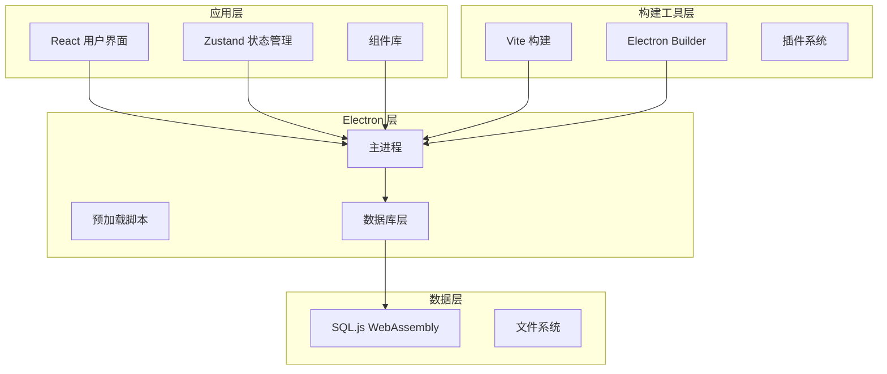

**图表来源**
- [main.ts:1-391](file://app/electron/main.ts#L1-L391)
- [db.ts:1-800](file://app/electron/db.ts#L1-L800)
- [vite.config.ts:1-37](file://app/vite.config.ts#L1-L37)

**章节来源**
- [package.json:1-100](file://app/package.json#L1-L100)
- [vite.config.ts:1-37](file://app/vite.config.ts#L1-L37)
- [main.ts:1-391](file://app/electron/main.ts#L1-L391)

## 核心组件

### 版本管理系统

应用采用语义化版本控制，当前版本为 0.3.0。版本管理策略包括：

- **版本号格式**: 主版本.次版本.修订版 (0.3.0)
- **更新策略**: 重大变更影响用户界面或核心功能时提升主版本
- **补丁更新**: 修复 bug 和小功能改进时提升修订版
- **开发版本**: 使用 `-beta` 或 `-rc` 后缀标识预发布版本

### 数据库架构

应用使用 SQL.js 实现本地数据库存储，支持 WebAssembly 加速：

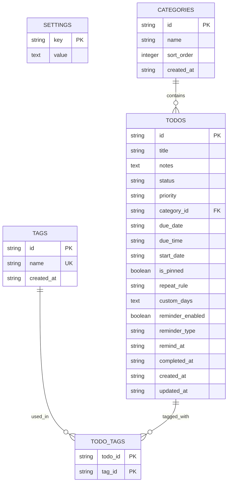

**图表来源**
- [db.ts:299-505](file://app/electron/db.ts#L299-L505)
- [types.ts:148-188](file://app/src/types.ts#L148-L188)

### IPC 通信机制

主进程与渲染进程之间通过 IPC 实现安全通信：

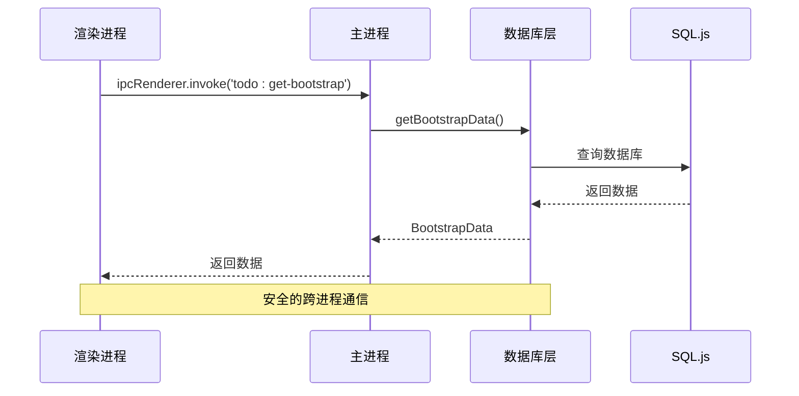

**图表来源**
- [main.ts:227-358](file://app/electron/main.ts#L227-L358)
- [db.ts:676-714](file://app/electron/db.ts#L676-L714)

**章节来源**
- [package.json:4-4](file://app/package.json#L4-L4)
- [db.ts:55-90](file://app/electron/db.ts#L55-L90)
- [main.ts:227-358](file://app/electron/main.ts#L227-L358)

## 架构概览

### 部署架构图

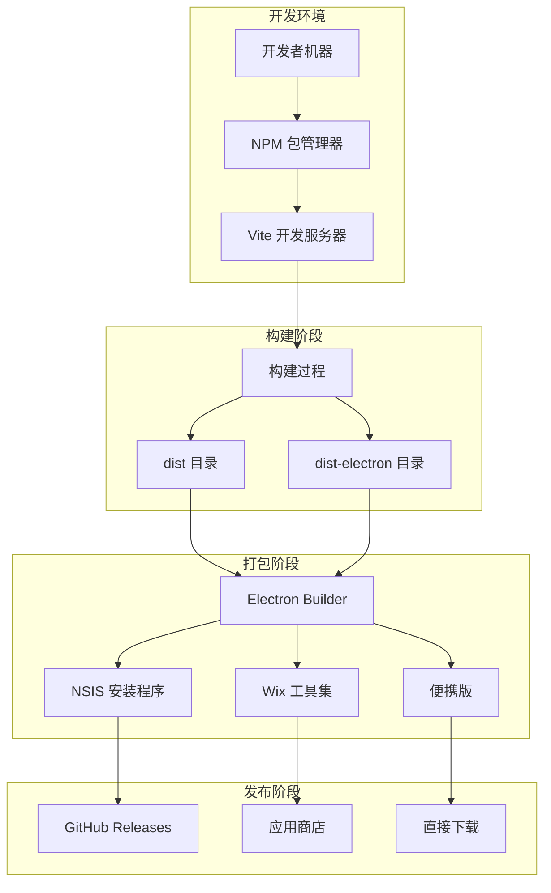

**图表来源**
- [package.json:12-12](file://app/package.json#L12-L12)
- [vite.config.ts:33-36](file://app/vite.config.ts#L33-L36)
- [build-vc.js:4-4](file://build-vc.js#L4-L4)

### 配置文件结构

应用使用多层配置管理：

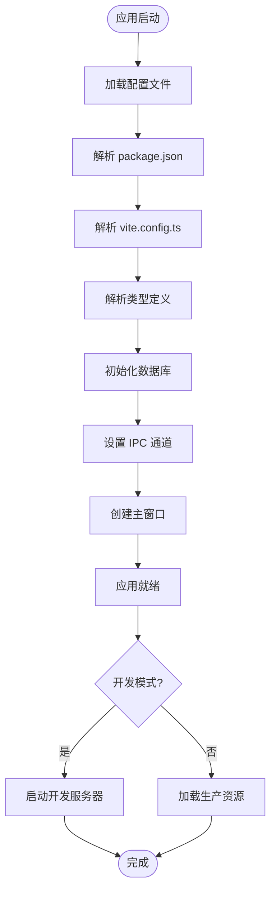

**图表来源**
- [main.ts:360-391](file://app/electron/main.ts#L360-L391)
- [vite.config.ts:6-36](file://app/vite.config.ts#L6-L36)
- [package.json:50-98](file://app/package.json#L50-L98)

**章节来源**
- [package.json:50-98](file://app/package.json#L50-L98)
- [vite.config.ts:6-36](file://app/vite.config.ts#L6-L36)
- [main.ts:360-391](file://app/electron/main.ts#L360-L391)

## 详细组件分析

### 版本管理策略

#### 语义化版本控制

应用采用标准的语义化版本控制策略：

- **主版本 (Major)**: 不兼容的 API 变更
- **次版本 (Minor)**: 向后兼容的功能新增
- **修订版本 (Patch)**: 向后兼容的问题修正

#### 版本更新流程

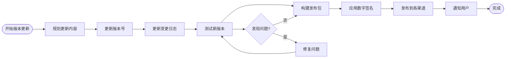

**图表来源**
- [package.json:4-4](file://app/package.json#L4-L4)

#### 依赖版本管理

应用使用精确版本锁定确保构建一致性：

- **生产依赖**: 使用 `^` 符号允许次要版本更新
- **开发依赖**: 使用 `~` 符号限制补丁版本更新
- **Electron**: 固定版本以确保稳定性

**章节来源**
- [package.json:16-49](file://app/package.json#L16-L49)

### 依赖检查与安全审计

#### 依赖树分析

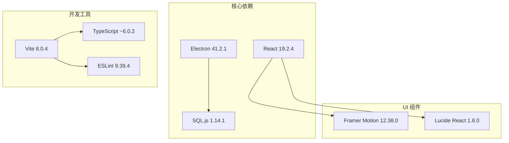

**图表来源**
- [package.json:16-49](file://app/package.json#L16-L49)

#### 安全审计流程

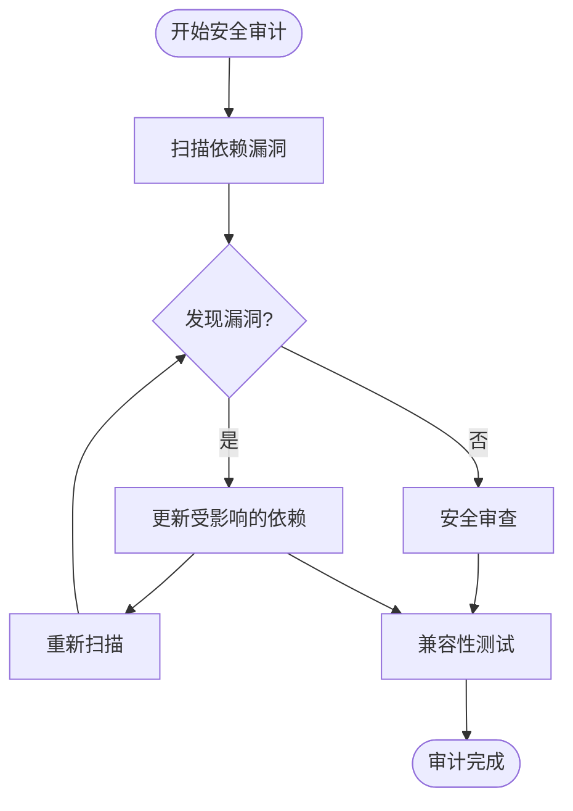

**图表来源**
- [package.json:16-49](file://app/package.json#L16-L49)

**章节来源**
- [package.json:16-49](file://app/package.json#L16-L49)

### 部署场景策略

#### 个人使用场景

针对个人用户的部署配置：

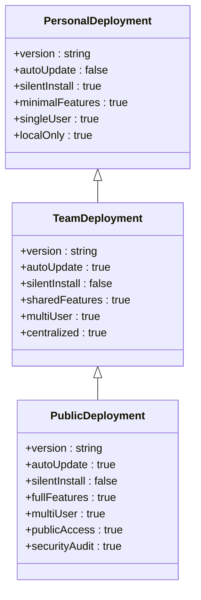

**图表来源**
- [package.json:75-98](file://app/package.json#L75-L98)

#### 团队分发策略

团队环境下的部署考虑：

- **集中式管理**: 使用企业软件分发平台
- **权限控制**: 基于用户组的访问控制
- **配置同步**: 统一的设置模板
- **更新策略**: 批量更新和回滚机制

#### 公开发布策略

面向公众的发布配置：

- **数字签名**: 使用受信任的代码签名证书
- **完整性验证**: SHA-256 校验和
- **安全传输**: HTTPS 下载
- **用户反馈**: 集成崩溃报告和反馈收集

**章节来源**
- [package.json:75-98](file://app/package.json#L75-L98)

### 更新机制实现

#### 自动更新架构

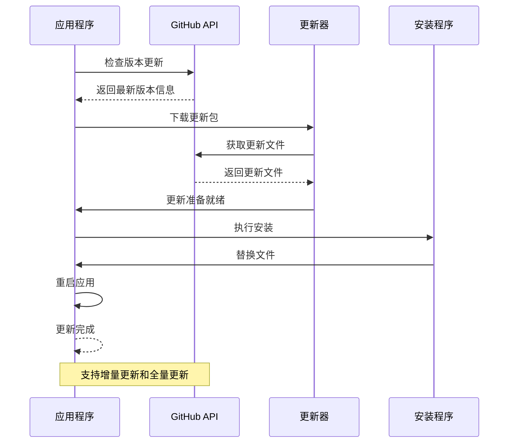

**图表来源**
- [main.ts:120-177](file://app/electron/main.ts#L120-L177)

#### 更新策略选择

| 更新类型 | 适用场景 | 优点 | 缺点 |
|---------|---------|------|------|
| 增量更新 | 小功能更新 | 传输快、节省带宽 | 仅适用于小改动 |
| 全量更新 | 大版本升级 | 功能完整、兼容性好 | 传输慢、占用空间大 |
| 渐进式更新 | 重要功能 | 平滑过渡、降低风险 | 实现复杂 |

**章节来源**
- [main.ts:120-177](file://app/electron/main.ts#L120-L177)

### 应用签名与证书管理

#### 数字签名配置

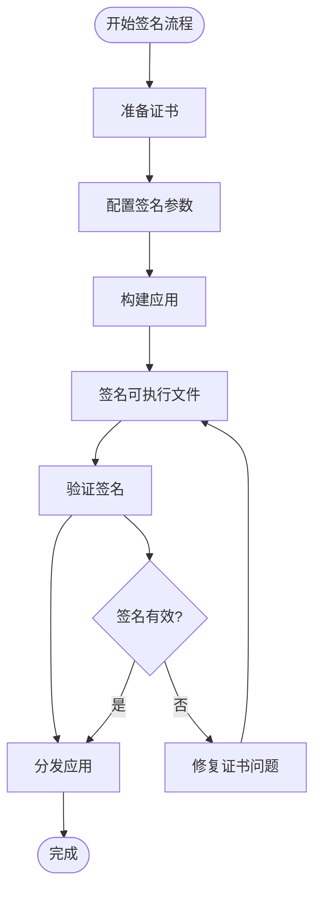

**图表来源**
- [package.json:76-76](file://app/package.json#L76-L76)

#### 跨平台兼容性

| 平台 | 支持情况 | 特殊要求 | 注意事项 |
|------|----------|----------|----------|
| Windows x64 | ✅ 完全支持 | VC++ 运行时 | 自动安装 VC++ 2015-2022 |
| macOS | ❌ 当前不支持 | 需要额外配置 | 需要 Apple 开发者证书 |
| Linux | ❌ 当前不支持 | 需要额外配置 | 需要额外打包配置 |

**章节来源**
- [package.json:75-90](file://app/package.json#L75-L90)
- [installer.nsh:8-13](file://app/scripts/installer.nsh#L8-L13)

### 部署后监控与维护

#### 性能监控

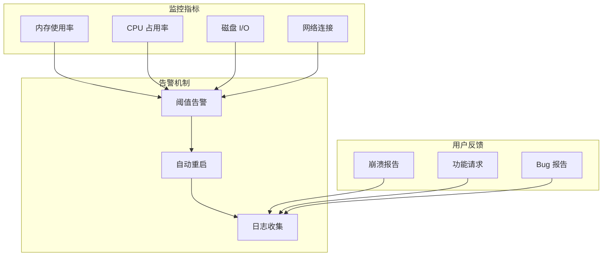

**图表来源**
- [main.ts:125-138](file://app/electron/main.ts#L125-L138)
- [main.ts:166-176](file://app/electron/main.ts#L166-L176)

#### 崩溃报告收集

应用实现了完善的错误处理机制：

- **全局异常捕获**: 捕获未处理的 Promise 拒绝
- **数据库操作保护**: 包装所有数据库操作
- **IPC 错误处理**: 处理进程间通信异常
- **用户友好提示**: 向用户显示错误信息但不暴露技术细节

**章节来源**
- [main.ts:125-138](file://app/electron/main.ts#L125-L138)
- [main.ts:166-176](file://app/electron/main.ts#L166-L176)

### 故障恢复与回滚策略

#### 回滚机制设计

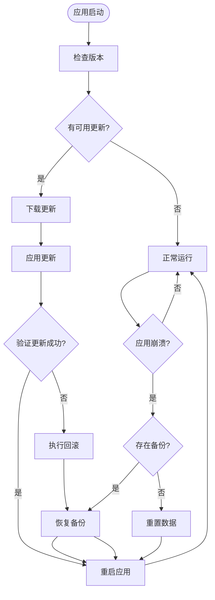

**图表来源**
- [db.ts:60-90](file://app/electron/db.ts#L60-L90)

#### 数据备份策略

应用提供了完整的数据备份和恢复机制：

- **自动备份**: 应用启动时自动备份数据库
- **手动导出**: 支持用户手动导出数据
- **增量备份**: 仅备份自上次备份以来的变化
- **版本控制**: 保留多个历史版本的备份

**章节来源**
- [db.ts:60-90](file://app/electron/db.ts#L60-L90)
- [main.ts:195-225](file://app/electron/main.ts#L195-L225)

## 依赖分析

### 依赖关系图

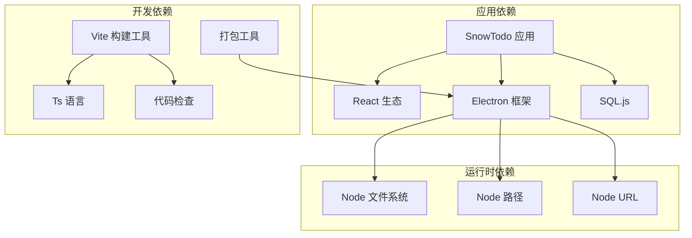

**图表来源**
- [package.json:16-49](file://app/package.json#L16-L49)
- [main.ts:1-8](file://app/electron/main.ts#L1-L8)

### 关键依赖分析

#### 核心技术栈

| 依赖项 | 版本 | 用途 | 重要性 |
|--------|------|------|--------|
| electron | ^41.2.1 | 桌面应用框架 | ⭐⭐⭐⭐⭐ |
| react | ^19.2.4 | 用户界面库 | ⭐⭐⭐⭐⭐ |
| sql.js | ^1.14.1 | 本地数据库 | ⭐⭐⭐⭐ |
| vite | ^8.0.4 | 构建工具 | ⭐⭐⭐⭐ |
| typescript | ~6.0.2 | 类型系统 | ⭐⭐⭐⭐⭐ |

#### 依赖更新策略

- **核心框架**: 严格控制版本，避免破坏性更新
- **UI 组件**: 允许次要版本更新，保持功能现代化
- **开发工具**: 使用固定版本确保构建一致性
- **运行时库**: 允许安全的补丁更新

**章节来源**
- [package.json:16-49](file://app/package.json#L16-L49)

## 性能考虑

### 构建优化

#### Vite 构建配置

应用使用 Vite 进行快速构建，配置了多项优化：

- **外部化依赖**: 将 sql.js 标记为外部依赖
- **Rollup 优化**: 配置 Rollup 选项进行代码分割
- **输出目录分离**: 主进程和渲染进程分别输出到不同目录

#### 代码分割策略

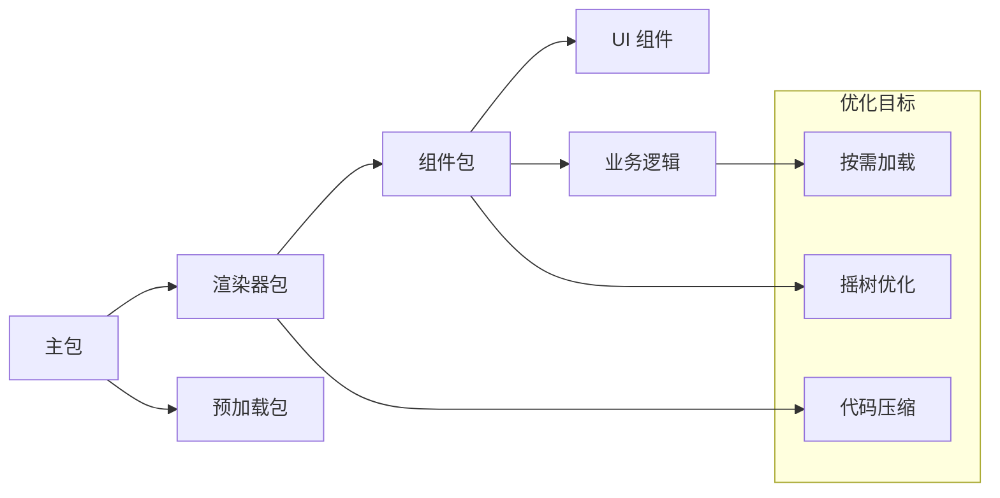

**图表来源**
- [vite.config.ts:9-29](file://app/vite.config.ts#L9-L29)

### 运行时性能

#### 内存管理

应用实现了高效的内存管理策略：

- **数据库连接池**: 复用 SQL.js 连接
- **定时器清理**: 及时清理过期的定时器
- **事件监听器**: 在应用退出时清理所有监听器

#### 启动性能优化

- **延迟加载**: 非关键功能延迟加载
- **预加载策略**: 预加载常用资源
- **缓存机制**: 缓存静态资源和配置数据

**章节来源**
- [vite.config.ts:9-29](file://app/vite.config.ts#L9-L29)
- [main.ts:371-391](file://app/electron/main.ts#L371-L391)

## 故障排除指南

### 常见部署问题

#### 构建失败

**问题**: electron-builder 构建失败
**解决方案**: 
1. 确认 Node.js 版本兼容性
2. 检查依赖安装是否完整
3. 验证签名证书配置

#### 运行时错误

**问题**: 应用启动时崩溃
**解决方案**:
1. 检查数据库初始化是否成功
2. 验证 WebAssembly 文件路径
3. 确认文件权限设置

#### 安装问题

**问题**: Windows 安装失败
**解决方案**:
1. 确认 VC++ 运行时已正确安装
2. 检查系统架构匹配
3. 验证安装程序签名

### 调试技巧

#### 日志记录

应用实现了多层次的日志记录：

- **错误级别**: 捕获所有异常和错误
- **调试级别**: 提供详细的调试信息
- **性能级别**: 记录性能相关指标

#### 诊断工具

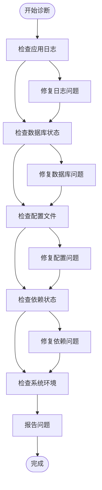

**图表来源**
- [main.ts:125-138](file://app/electron/main.ts#L125-L138)
- [db.ts:60-90](file://app/electron/db.ts#L60-L90)

**章节来源**
- [main.ts:125-138](file://app/electron/main.ts#L125-L138)
- [db.ts:60-90](file://app/electron/db.ts#L60-L90)

## 结论

SnowTodo 应用的部署最佳实践涵盖了从版本管理到生产运维的完整生命周期。通过采用模块化的架构设计、严格的依赖管理策略和完善的监控体系，该应用能够在不同部署场景下稳定运行。

关键成功因素包括：
- 明确的版本控制策略和更新机制
- 完善的安全审计和数字签名流程  
- 灵活的部署配置以适应不同使用场景
- 全面的监控和故障恢复机制
- 跨平台兼容性的谨慎考虑

这些实践为其他 Electron 应用的部署提供了宝贵的参考经验。

## 附录

### 最佳实践清单

#### 发布前检查清单
- [ ] 所有依赖已通过安全扫描
- [ ] 版本号已正确更新
- [ ] 数字签名证书有效
- [ ] 安装程序测试通过
- [ ] 回滚机制验证成功

#### 生产环境配置
- [ ] 启用自动更新
- [ ] 配置性能监控
- [ ] 设置告警通知
- [ ] 准备应急响应计划

#### 维护任务
- [ ] 定期安全审计
- [ ] 用户反馈处理
- [ ] 性能基准测试
- [ ] 备份验证