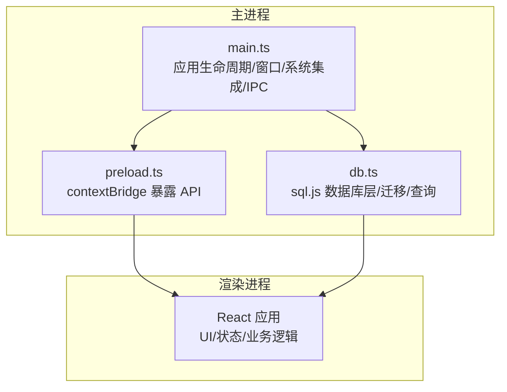
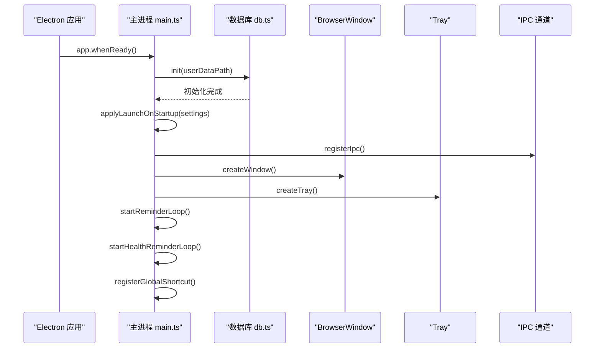
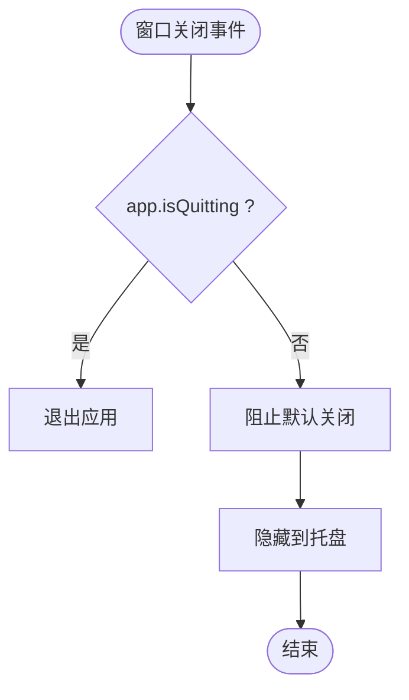
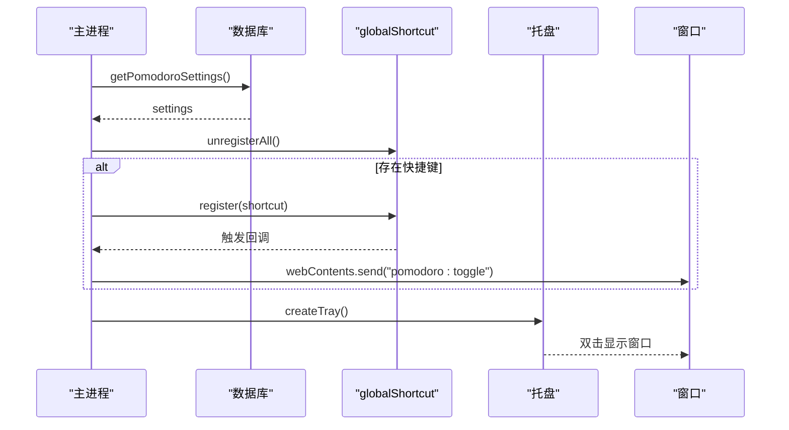
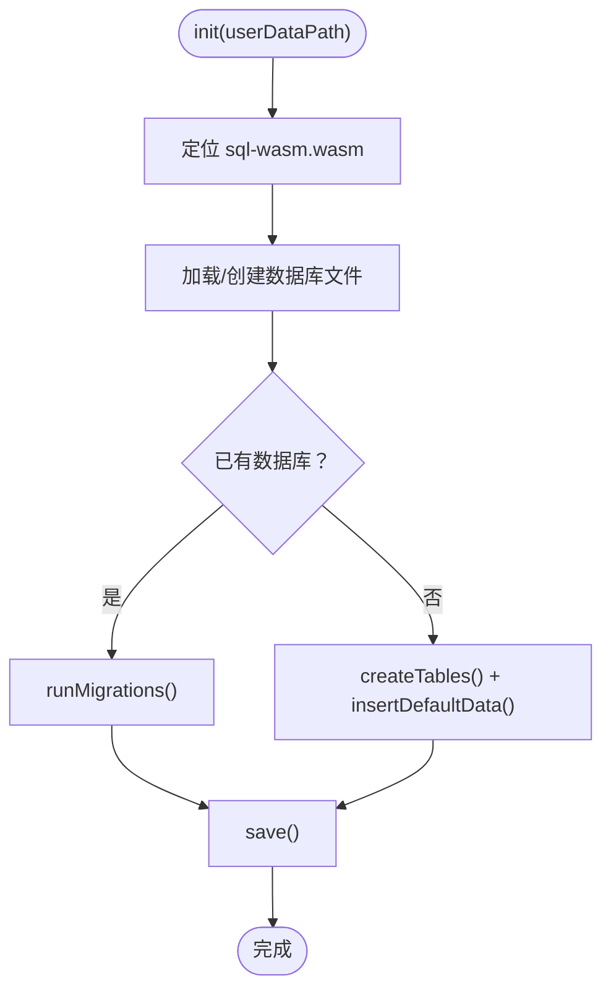
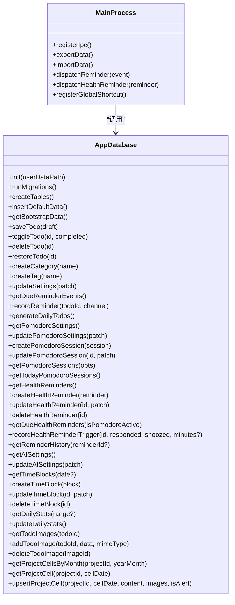
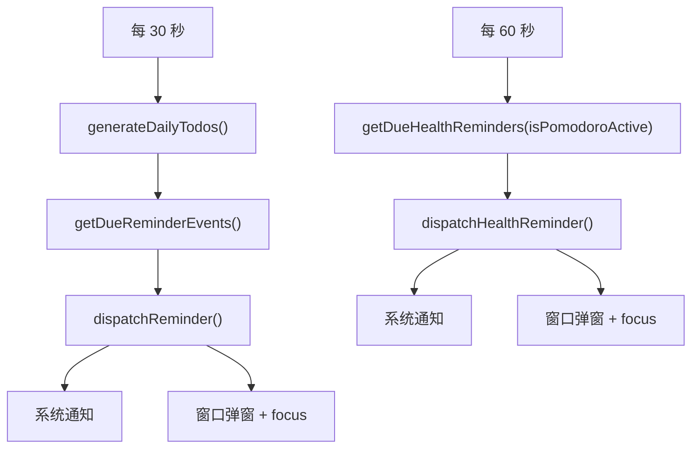
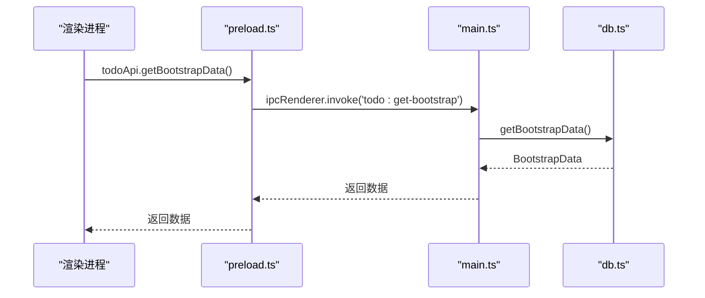
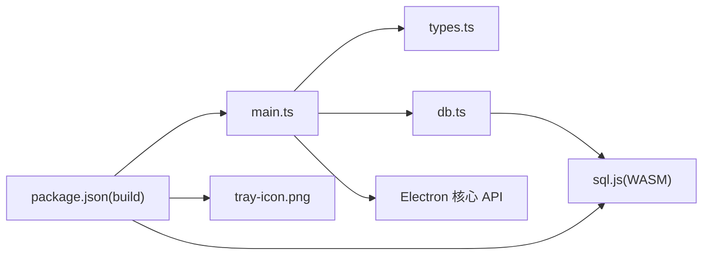

# Electron 主进程设计

<cite>
**本文引用的文件**
- [main.ts](file://app/electron/main.ts)
- [db.ts](file://app/electron/db.ts)
- [preload.ts](file://app/electron/preload.ts)
- [types.ts](file://app/src/types.ts)
- [package.json](file://app/package.json)
- [README.md](file://README.md)
</cite>

## 目录
1. [简介](#简介)
2. [项目结构](#项目结构)
3. [核心组件](#核心组件)
4. [架构总览](#架构总览)
5. [详细组件分析](#详细组件分析)
6. [依赖关系分析](#依赖关系分析)
7. [性能考虑](#性能考虑)
8. [故障排查指南](#故障排查指南)
9. [结论](#结论)
10. [附录](#附录)

## 简介
本文件面向 SnowTodo 的 Electron 主进程，系统性梳理其职责边界与实现细节，覆盖应用生命周期管理、窗口创建与隐藏到托盘、系统集成功能（托盘、全局快捷键、开机启动）、数据库初始化与迁移、IPC 通信通道、系统事件处理、窗口状态管理与跨平台兼容性、错误处理策略、性能优化与调试技巧。文档同时提供架构图与关键流程图，帮助开发者快速理解主进程与前端、数据库、系统服务之间的交互关系。

## 项目结构
SnowTodo 的主进程位于 app/electron 目录，采用“主进程 + 预加载脚本 + 数据库层”的三层架构：
- 主进程负责应用生命周期、窗口管理、系统集成、定时任务与 IPC 注册
- 预加载脚本通过 contextBridge 暴露受控 API，供渲染进程调用
- 数据库层基于 sql.js（WASM）实现 SQLite 的本地持久化，支持迁移与索引

图表来源
- [main.ts:1-391](file://app/electron/main.ts#L1-L391)
- [preload.ts:1-117](file://app/electron/preload.ts#L1-L117)
- [db.ts:1-800](file://app/electron/db.ts#L1-L800)

章节来源
- [main.ts:1-391](file://app/electron/main.ts#L1-L391)
- [db.ts:1-800](file://app/electron/db.ts#L1-L800)
- [preload.ts:1-117](file://app/electron/preload.ts#L1-L117)

## 核心组件
- 应用生命周期与窗口管理
  - 初始化窗口、最小化到托盘、关闭行为控制、开发/生产资源加载
- 系统集成功能
  - 托盘图标与菜单、双击显示主窗口、全局快捷键注册、开机启动设置
- 数据库层
  - sql.js 初始化、WASM 资源定位、数据库文件路径、表结构与迁移、默认数据插入
- IPC 通信
  - 注册各类模块的 handle 通道（待办、分类/标签、设置、数据导入导出、番茄钟、健康提醒、时间块、统计、图片、项目单元格等）
- 定时任务
  - 待办提醒循环（每 30 秒）、健康提醒循环（每 60 秒）、生成每日待办
- 错误处理
  - 任务循环 try/catch、全局快捷键注册异常捕获、数据库迁移异常日志

章节来源
- [main.ts:18-52](file://app/electron/main.ts#L18-L52)
- [main.ts:54-92](file://app/electron/main.ts#L54-L92)
- [main.ts:98-177](file://app/electron/main.ts#L98-L177)
- [main.ts:179-193](file://app/electron/main.ts#L179-L193)
- [main.ts:227-358](file://app/electron/main.ts#L227-L358)
- [main.ts:360-391](file://app/electron/main.ts#L360-L391)
- [db.ts:60-90](file://app/electron/db.ts#L60-L90)
- [db.ts:92-297](file://app/electron/db.ts#L92-L297)

## 架构总览
主进程在应用就绪后执行以下步骤：
- 初始化数据库（定位 sql-wasm.wasm、加载/创建数据库、运行迁移）
- 应用开机启动设置（根据初始设置）
- 注册 IPC 处理器
- 创建窗口（开发环境加载 Vite DevServer，生产环境加载 dist/index.html）
- 创建托盘并设置上下文菜单
- 启动提醒循环与健康提醒循环
- 注册全局快捷键

图表来源
- [main.ts:360-391](file://app/electron/main.ts#L360-L391)
- [db.ts:60-90](file://app/electron/db.ts#L60-L90)

章节来源
- [main.ts:360-391](file://app/electron/main.ts#L360-L391)
- [db.ts:60-90](file://app/electron/db.ts#L60-L90)

## 详细组件分析

### 窗口管理与隐藏到托盘
- 窗口创建
  - 窗口尺寸、最小尺寸、背景色、标题、webPreferences（preload 路径、隔离、禁用 Node 集成）
  - ready-to-show 时显示窗口
  - 开发/生产环境分别加载 Vite DevServer 或 dist/index.html
- 关闭行为
  - close 事件拦截，非 app.isQuitting 时隐藏窗口而非退出
  - macOS 平台 window-all-closed 时退出应用
- 托盘
  - 加载 tray-icon.png（开发/生产不同路径），设置托盘图标与提示
  - 右键菜单：显示主窗口、退出
  - 双击托盘图标显示主窗口并聚焦

图表来源
- [main.ts:39-45](file://app/electron/main.ts#L39-L45)
- [main.ts:376-381](file://app/electron/main.ts#L376-L381)

章节来源
- [main.ts:18-52](file://app/electron/main.ts#L18-L52)
- [main.ts:54-92](file://app/electron/main.ts#L54-L92)
- [main.ts:376-381](file://app/electron/main.ts#L376-L381)

### 系统集成功能
- 托盘
  - 图标加载与尺寸调整、上下文菜单、双击显示窗口
- 全局快捷键
  - 从数据库读取设置，注册/注销快捷键，触发后向渲染进程发送消息以切换番茄钟状态
- 开机启动
  - 通过 app.setLoginItemSettings 根据设置开启/关闭开机启动

图表来源
- [main.ts:179-193](file://app/electron/main.ts#L179-L193)
- [main.ts:94-96](file://app/electron/main.ts#L94-L96)
- [main.ts:54-92](file://app/electron/main.ts#L54-L92)

章节来源
- [main.ts:94-96](file://app/electron/main.ts#L94-L96)
- [main.ts:179-193](file://app/electron/main.ts#L179-L193)
- [main.ts:54-92](file://app/electron/main.ts#L54-L92)

### 数据库初始化与迁移
- 初始化流程
  - 判断开发/打包环境，定位 sql-wasm.wasm 路径
  - 初始化 sql.js，加载/创建数据库文件，导出/导入二进制
  - 若存在旧数据库则运行迁移；若新建则创建表结构并插入默认数据
- 迁移策略
  - 新增列（如 todos.custom_days）、新增表（pomodoro_sessions、health_reminders、reminder_history、time_blocks、themes、ai_settings、daily_stats）、索引、默认数据（健康提醒、主题、AI 设置、番茄钟设置）
  - 插入默认健康提醒、内置主题、默认 AI 设置、默认番茄钟设置
- 默认设置
  - Settings、PomodoroSettings、AISettings 的默认值

图表来源
- [db.ts:60-90](file://app/electron/db.ts#L60-L90)
- [db.ts:92-297](file://app/electron/db.ts#L92-L297)
- [db.ts:299-504](file://app/electron/db.ts#L299-L504)
- [db.ts:507-543](file://app/electron/db.ts#L507-L543)

章节来源
- [db.ts:60-90](file://app/electron/db.ts#L60-L90)
- [db.ts:92-297](file://app/electron/db.ts#L92-L297)
- [db.ts:299-504](file://app/electron/db.ts#L299-L504)
- [db.ts:507-543](file://app/electron/db.ts#L507-L543)

### IPC 通信通道
主进程通过 ipcMain.handle 注册大量通道，覆盖以下模块：
- 基础待办：保存、切换完成、删除、恢复、分类/标签创建
- 设置：更新设置并应用开机启动
- 数据：导出/导入快照
- 窗口：最小化/最大化/关闭
- 每日待办模板：查询、创建、更新、删除、生成今日待办
- 番茄钟：设置读取/更新、会话创建/更新、查询、活跃状态切换
- 健康提醒：查询、创建、更新、删除、历史查询、延迟/忽略
- AI 设置：查询/更新
- 时间块：查询/创建/更新/删除
- 统计：每日统计查询/更新
- 待办图片：查询/添加/删除
- 项目单元格：按月/单日查询、增改

图表来源
- [main.ts:227-358](file://app/electron/main.ts#L227-L358)
- [db.ts:676-714](file://app/electron/db.ts#L676-L714)
- [db.ts:716-796](file://app/electron/db.ts#L716-L796)
- [db.ts:798-833](file://app/electron/db.ts#L798-L833)
- [db.ts:819-833](file://app/electron/db.ts#L819-L833)
- [db.ts:824-833](file://app/electron/db.ts#L824-L833)
- [db.ts:835-869](file://app/electron/db.ts#L835-L869)
- [db.ts:850-869](file://app/electron/db.ts#L850-L869)
- [db.ts:871-880](file://app/electron/db.ts#L871-L880)
- [db.ts:882-930](file://app/electron/db.ts#L882-L930)
- [db.ts:932-940](file://app/electron/db.ts#L932-L940)
- [db.ts:1183-1252](file://app/electron/db.ts#L1183-L1252)
- [db.ts:1271-1302](file://app/electron/db.ts#L1271-L1302)
- [db.ts:1304-1330](file://app/electron/db.ts#L1304-L1330)
- [db.ts:1353-1356](file://app/electron/db.ts#L1353-L1356)
- [db.ts:1358-1367](file://app/electron/db.ts#L1358-L1367)
- [db.ts:1369-1397](file://app/electron/db.ts#L1369-L1397)
- [db.ts:1399-1403](file://app/electron/db.ts#L1399-L1403)
- [db.ts:1406-1457](file://app/electron/db.ts#L1406-L1457)
- [db.ts:1459-1467](file://app/electron/db.ts#L1459-L1467)
- [db.ts:1469-1481](file://app/electron/db.ts#L1469-L1481)
- [db.ts:1587-1622](file://app/electron/db.ts#L1587-L1622)
- [db.ts:1602-1622](file://app/electron/db.ts#L1602-L1622)
- [db.ts:1500-1552](file://app/electron/db.ts#L1500-L1552)
- [db.ts:1514-1547](file://app/electron/db.ts#L1514-L1547)
- [db.ts:1626-1677](file://app/electron/db.ts#L1626-L1677)
- [db.ts:1679-1698](file://app/electron/db.ts#L1679-L1698)
- [db.ts:1743-1769](file://app/electron/db.ts#L1743-L1769)
- [db.ts:1755-1764](file://app/electron/db.ts#L1755-L1764)
- [db.ts:1766-1769](file://app/electron/db.ts#L1766-L1769)
- [db.ts:1773-1802](file://app/electron/db.ts#L1773-L1802)
- [db.ts:1789-1801](file://app/electron/db.ts#L1789-L1801)
- [db.ts:1804-1823](file://app/electron/db.ts#L1804-L1823)

章节来源
- [main.ts:227-358](file://app/electron/main.ts#L227-L358)

### 定时任务与系统事件
- 待办提醒循环
  - 每 30 秒检查：生成当日待办 + 查询到期提醒事件 + 记录提醒 + 发送系统通知 + 显示弹窗
- 健康提醒循环
  - 每 60 秒检查：根据状态（是否正在番茄钟）与工作日/周末过滤 + 检查最近触发记录 + 发送通知/弹窗 + 记录历史
- 全局快捷键
  - 从数据库读取设置，注册/注销快捷键，触发后向渲染进程发送“pomodoro:toggle”

图表来源
- [main.ts:120-139](file://app/electron/main.ts#L120-L139)
- [main.ts:161-177](file://app/electron/main.ts#L161-L177)
- [main.ts:98-118](file://app/electron/main.ts#L98-L118)
- [main.ts:141-159](file://app/electron/main.ts#L141-L159)
- [db.ts:882-930](file://app/electron/db.ts#L882-L930)
- [db.ts:1406-1457](file://app/electron/db.ts#L1406-L1457)

章节来源
- [main.ts:120-139](file://app/electron/main.ts#L120-L139)
- [main.ts:161-177](file://app/electron/main.ts#L161-L177)
- [main.ts:98-118](file://app/electron/main.ts#L98-L118)
- [main.ts:141-159](file://app/electron/main.ts#L141-L159)
- [db.ts:882-930](file://app/electron/db.ts#L882-L930)
- [db.ts:1406-1457](file://app/electron/db.ts#L1406-L1457)

### 预加载脚本与渲染进程 API
预加载脚本通过 contextBridge.exposeInMainWorld 暴露 todoApi 对象，统一管理各模块的 invoke/on 通道，便于渲染进程安全调用主进程能力。

图表来源
- [preload.ts:18-116](file://app/electron/preload.ts#L18-L116)
- [main.ts:227-228](file://app/electron/main.ts#L227-L228)
- [db.ts:676-714](file://app/electron/db.ts#L676-L714)

章节来源
- [preload.ts:18-116](file://app/electron/preload.ts#L18-L116)
- [main.ts:227-228](file://app/electron/main.ts#L227-L228)
- [db.ts:676-714](file://app/electron/db.ts#L676-L714)

## 依赖关系分析
- 主进程依赖
  - Electron 核心模块：app、BrowserWindow、dialog、ipcMain、Notification、globalShortcut、Tray、Menu、nativeImage
  - 类型定义：来自 app/src/types.ts
  - 数据库：sql.js（WASM）
- 构建与打包
  - package.json 指定主进程入口、electron-builder 配置、资源复制（sql-wasm.wasm、tray-icon.png）

图表来源
- [main.ts:1-10](file://app/electron/main.ts#L1-L10)
- [types.ts:1-278](file://app/src/types.ts#L1-L278)
- [db.ts:1-5](file://app/electron/db.ts#L1-L5)
- [package.json:50-99](file://app/package.json#L50-L99)

章节来源
- [main.ts:1-10](file://app/electron/main.ts#L1-L10)
- [types.ts:1-278](file://app/src/types.ts#L1-L278)
- [db.ts:1-5](file://app/electron/db.ts#L1-L5)
- [package.json:50-99](file://app/package.json#L50-L99)

## 性能考虑
- 数据库 I/O
  - 使用索引（todos、pomodoro_sessions、time_blocks、daily_stats、health_reminders）减少查询成本
  - 批量写入后统一 save()，避免频繁磁盘 IO
- 定时任务频率
  - 待办提醒 30 秒一次、健康提醒 60 秒一次，兼顾及时性与性能
- WASM 初始化
  - 仅在首次初始化时加载 sql-wasm.wasm，避免重复开销
- 窗口最小化/隐藏
  - 关闭事件拦截隐藏窗口，减少内存占用与系统资源消耗
- 跨平台兼容
  - macOS 平台 window-all-closed 时退出，避免后台常驻

章节来源
- [db.ts:197-206](file://app/electron/db.ts#L197-L206)
- [db.ts:1271-1302](file://app/electron/db.ts#L1271-L1302)
- [db.ts:1626-1677](file://app/electron/db.ts#L1626-L1677)
- [main.ts:360-391](file://app/electron/main.ts#L360-L391)
- [main.ts:376-381](file://app/electron/main.ts#L376-L381)

## 故障排查指南
- 数据库初始化失败
  - 检查 sql-wasm.wasm 路径是否正确（开发/打包环境不同）
  - 查看迁移日志与异常堆栈，确认表结构与索引创建是否成功
- 定时任务异常
  - 检查 reminderTimer/healthReminderTimer 是否被正确清理与重启
  - 确认 getDueReminderEvents/getDueHealthReminders 的过滤条件与时间范围
- 全局快捷键无效
  - 确认 getPomodoroSettings 返回的快捷键字符串有效
  - 检查 globalShortcut.register 的返回值与异常捕获
- 托盘图标/菜单问题
  - 确认 tray-icon.png 路径在开发/生产环境均可用
  - 检查 Menu.buildFromTemplate 的模板项是否完整
- 导入/导出数据失败
  - 检查 dialog.showSaveDialog/showOpenDialog 的返回值
  - 确认 JSON 结构与 BootstrapData 兼容

章节来源
- [db.ts:60-90](file://app/electron/db.ts#L60-L90)
- [main.ts:120-139](file://app/electron/main.ts#L120-L139)
- [main.ts:161-177](file://app/electron/main.ts#L161-L177)
- [main.ts:179-193](file://app/electron/main.ts#L179-L193)
- [main.ts:54-92](file://app/electron/main.ts#L54-L92)
- [main.ts:195-225](file://app/electron/main.ts#L195-L225)

## 结论
SnowTodo 的主进程以清晰的职责划分与完善的系统集成为基础，结合 sql.js 的本地数据库能力，实现了从窗口管理、系统集成到定时提醒与 IPC 通信的完整闭环。通过合理的索引与批量写入策略、适度的定时任务频率、严格的错误处理与日志记录，主进程在保证功能完整性的同时兼顾了性能与稳定性。建议后续持续关注跨平台差异与用户反馈，进一步完善错误恢复与诊断能力。

## 附录
- 开发与构建信息
  - 开发模式：Vite + Electron 主进程同步运行
  - 构建产物：NSIS 安装包与便携版可执行文件
  - 代码签名：可通过配置启用
- 项目结构参考
  - 主进程入口：app/electron/main.ts
  - 预加载脚本：app/electron/preload.ts
  - 数据库层：app/electron/db.ts
  - 类型定义：app/src/types.ts
  - 构建配置：app/package.json

章节来源
- [README.md:79-117](file://README.md#L79-L117)
- [package.json:1-100](file://app/package.json#L1-L100)